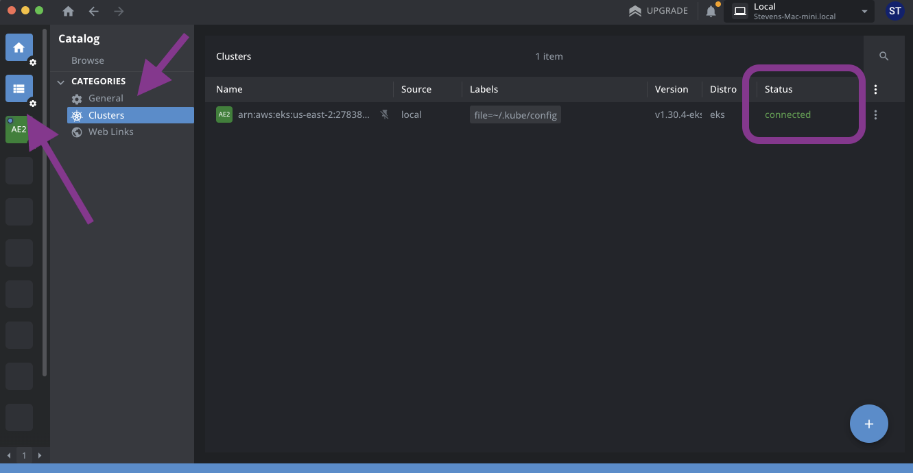

# K8s Primer

## Links

- [kubectl Quick Reference](https://kubernetes.io/docs/reference/kubectl/quick-reference/)
- [Overview of Kubernetes Workloads](https://kubernetes.io/docs/concepts/workloads/)

## Helm and KIND Compatibility

Deploying networks to the Spartan kubernetes cluster is done using the `aztec-network` Helm package. Helm is the package manager for Kubernetes (similar to NPM for Javascript). Packaging deployments using Helm allows them to be portable between Kubernetes distributions (different cloud providers), as well as compatible with Kubernetes-in-Docker (KIND) running on a local machine and in CI. Note that certain features of cloud hosted Kubernetes (such as load balancers) are not available in KIND. For this reason, all changes to the `aztec-network` Helm chart should be tested against a KIND environment to avoid breaking cross-compatibility. Features that are not available in KIND can be toggled during install using `if` statements inside of the Helm chart (`{{if .Values.network.public }}` for example).

## Connecting to the cluster

Accessing the Spartan cluster and nodes within the cluster can be done using either CLI or a GUI.

### Connecting using the CLI

```
gcloud container clusters get-credentials aztec-gke --zone us-west1-a --project testnet-440309
kubectl get svc
```

#### NOTE: Switching between Spartan and KIND clusters

If KIND is installed to your local dev environment, it will create a new "kubernetes context" or cluster connection on your local machine. If you are not seeing the Kubernetes resources that are expected, confirm that your Kubernetes context is pointed to the desired cluster using command:

```
kubectl config get-contexts
```

An asterisk will note the active cluster connection. Cluster connections can be switched using command:

```
kubectl config use-context <context-name>
```

### Connecting using k8Lens

A popular GUI that can be used to connect to the Spartan cluster is the free version of k8Lens. ([Download Link](https://k8slens.dev/))

As long as all CLI tools have been configured, k8Lens will automatically read your local `kubeconfig` file to provide cluster access. The Spartan cluster can then be located by navigating the k8Lens "catalog" as shown below.



Inside of the cluster, k8Lens can be used to visually browse workloads, as well as cluster configurations, networking, and storage.


Selecting individual pods provides options to open a console session as well as browse logs.

**NOTE**: Editing pod configurations directly is not recommended. Any direct edits will be lost during the next pod deployment and replaced by the corresponding IaC configuration stored in git.


