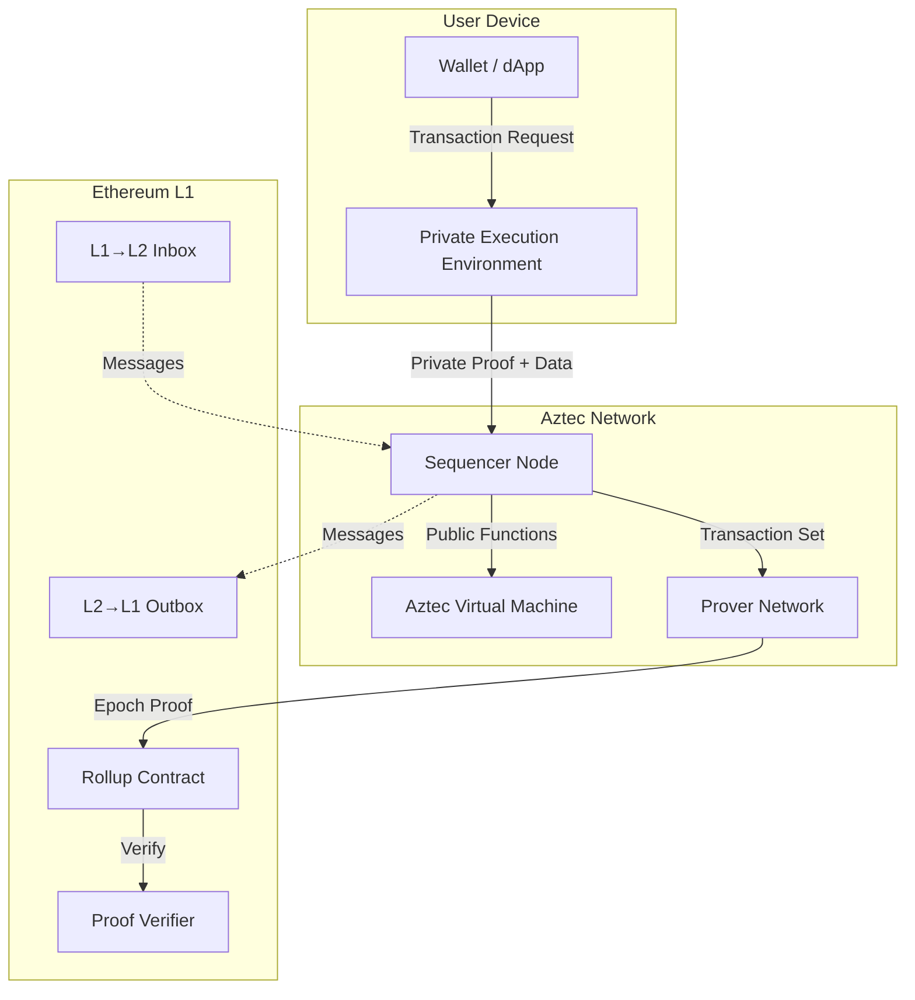
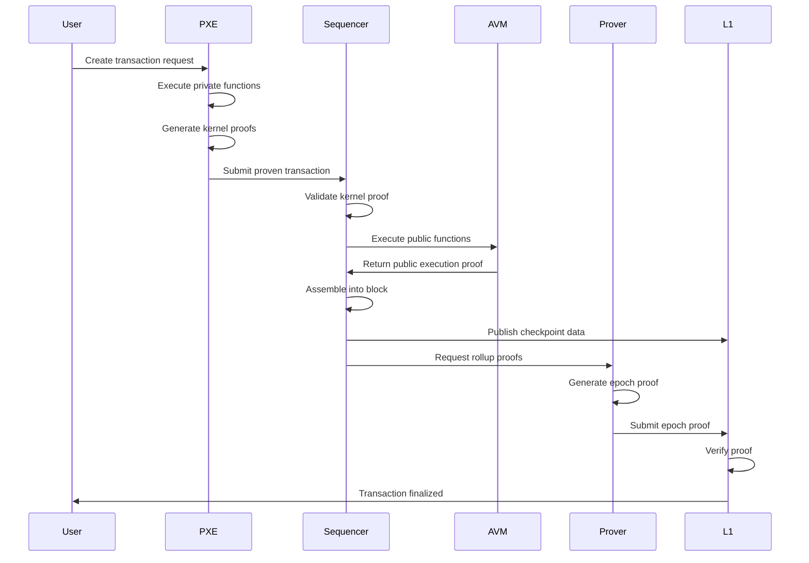
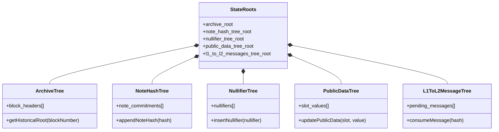

# Protocol Overview & Architecture

## Overview

Aztec is a privacy-preserving layer-2 zkRollup on Ethereum that supports smart contracts with programmable privacy. The protocol enables developers to write applications with mixed private and public execution and state, providing confidentiality guarantees while maintaining composability with Ethereum and other contracts on the Aztec network.

This specification describes the Aztec protocol architecture: its major components, the transaction lifecycle from user submission through settlement on Ethereum, the data structures that represent state, and the cryptographic mechanisms that ensure correctness and privacy. It serves as the entry point for understanding how Aztec operates and provides the foundation for more detailed specifications of individual protocol components.

## Requirements

### R1: Privacy-Preserving Execution

The protocol MUST support execution of smart contract functions where the function logic, inputs, outputs, and caller identity can remain hidden from network observers while still producing verifiable state transitions.

**Rationale:** Privacy is the core value proposition of Aztec. Users must be able to transact confidentially without revealing sensitive information to validators, other users, or observers of the blockchain.

### R2: Hybrid State Model

The protocol MUST support both private state (encrypted, UTXO-based) and public state (transparent, account-based) within the same smart contract and transaction.

**Rationale:** Not all state requires privacy. Public state enables transparency where needed (e.g., total supply of a token), reduces costs for non-sensitive operations, and facilitates composability with public protocols.

### R3: Composability

The protocol MUST enable private functions to call other private functions, public functions to call other public functions, and private functions to enqueue public function calls for later execution.

**Rationale:** Smart contract composability is essential for building complex applications. The protocol must preserve composability while respecting the constraint that private execution happens client-side before public execution on the sequencer.

### R4: Ethereum Settlement

The protocol MUST periodically submit proofs and state commitments to Ethereum L1 for verification and finalization. State transitions MUST NOT be considered final until verified by Ethereum.

**Rationale:** Ethereum provides security, data availability guarantees, and censorship resistance. Aztec inherits Ethereum's security by settling to L1.

### R5: Succinct Verification

The protocol MUST produce proofs that can be verified on Ethereum in constant time and gas cost regardless of the amount of L2 computation performed.

**Rationale:** Ethereum block space is limited and expensive. Succinct proofs (SNARKs) enable the rollup to scale by batching many transactions while keeping L1 verification costs bounded.

### R6: Data Availability

The protocol MUST ensure that sufficient data is published for any party to reconstruct the current L2 state from Ethereum L1 data alone.

**Rationale:** Without data availability, users cannot prove ownership of their private state or recover funds if sequencers become unavailable. L1 data availability ensures censorship resistance and allows anyone to sync the L2 state.

## Specification

### Architecture Components

The Aztec protocol consists of several major components that work together to process transactions, maintain state, and settle to Ethereum:



#### Private Execution Environment (PXE)

The PXE is a client-side component that executes private functions on behalf of users. It runs on user devices (desktop, mobile, browser) and maintains:

- **Private keys**: Nullifier secret key, incoming/outgoing viewing keys, and optional signing keys
- **Note database**: Encrypted UTXOs (notes) owned by the user
- **Contract artifacts**: Bytecode and ABIs for contracts the user interacts with
- **Synchronization state**: Tracks which blocks have been processed for note discovery

The PXE MUST:
1. Execute private functions and generate zero-knowledge proofs of correct execution
2. Maintain user privacy by never revealing private inputs to the network
3. Synchronize with the network to discover new notes addressed to the user
4. Generate transaction requests with kernel proofs ready for sequencer inclusion

#### Sequencer

The sequencer is responsible for ordering transactions, executing public functions, producing blocks, and coordinating proof generation. A sequencer MUST:

1. Accept proven private transactions from users (kernel proofs + side effects)
2. Validate proofs and accumulated data for well-formedness
3. Execute public portions of transactions via the AVM
4. Assemble transactions into blocks and blocks into checkpoints
5. Publish transaction data and state commitments to Ethereum
6. Coordinate with the prover network to generate rollup proofs

Sequencers are selected via a proof-of-stake mechanism with attestation-based consensus. The selection and consensus mechanisms are specified in detail in separate specifications.

#### Aztec Virtual Machine (AVM)

The AVM executes public functions for transactions that contain public logic. Unlike private execution which is proven recursively per function call, the AVM generates a single proof for all public execution within a transaction.

The AVM MUST:
1. Execute public function bytecode deterministically
2. Update public state (public data tree)
3. Validate public call ordering (setup → app logic → teardown)
4. Handle reverts in app logic phase while preserving setup/teardown
5. Generate a SNARK proof of correct public execution

The AVM execution environment is conceptually similar to the EVM but optimized for SNARK-friendly operations.

#### Prover Network

The prover network generates cryptographic proofs for the rollup circuits. Provers MUST:

1. Accept transaction and block data from sequencers
2. Generate rollup proofs in a hierarchical structure (transaction → block → checkpoint → epoch)
3. Recursively aggregate proofs using a binary tree topology
4. Return completed epoch proofs to the sequencer for L1 submission

Proving can be parallelized across multiple machines. The proof generation protocol is specified separately.

#### Rollup Contract (L1)

The Rollup contract on Ethereum L1 maintains the canonical state of the Aztec network. It MUST:

1. Store the current state root (archive tree root)
2. Accept checkpoint submissions from sequencers with attestations
3. Verify epoch proofs via the Verifier contract
4. Process L1→L2 messages (inbox)
5. Publish L2→L1 messages (outbox)
6. Manage sequencer stake and slashing

State transitions are only finalized after epoch proof verification succeeds.

#### Verifier Contract (L1)

The Verifier contract validates SNARK proofs submitted with epoch data. It MUST:

1. Verify the epoch proof using the configured verification key
2. Check that public inputs match the claimed state transition
3. Return verification success/failure to the Rollup contract

The verifier uses a SNARK verification algorithm (currently based on UltraHonk).

### Transaction Lifecycle

A transaction in Aztec progresses through several distinct phases from user intent to L1 finalization:



#### Phase 1: Transaction Construction

The user constructs a transaction request containing:

- **Origin**: Account contract address initiating the transaction
- **Function data**: Selector and privacy flag (private/public) for the entry function
- **Arguments**: Function inputs (hashed for privacy)
- **Transaction context**: Chain ID, version, gas limits
- **Salt**: Randomness to prevent hash prediction

The transaction request is passed to the PXE along with the full argument preimages.

#### Phase 2: Private Execution (PXE)

The PXE executes the transaction's private portion:

1. **Authorization**: The PXE calls the account contract's `is_valid` function to verify the user authorized this transaction (e.g., via signature check)

2. **Private Kernel Init**: Execute the entry function and generate the first kernel proof, validating:
   - Function matches transaction request
   - No caller exists (first call)
   - Function is marked private

3. **Private Kernel Inner** (if needed): For each enqueued private function call:
   - Pop call from private call stack
   - Execute function and generate proof
   - Verify previous kernel proof
   - Accumulate side effects (note hashes, nullifiers, logs, public call requests)

4. **Private Kernel Reset** (optional, may run multiple times): Optimize accumulated data by:
   - Squashing transient notes (created and nullified in same transaction)
   - Validating note hash read requests against state
   - Validating nullifier read requests against state
   - Validating key validation requests

5. **Private Kernel Tail/Tail-to-Public**: Finalize private execution:
   - **Tail**: For private-only transactions, sort side effects and prepare for rollup
   - **Tail-to-Public**: For transactions with public functions, split side effects into non-revertible and revertible sets and prepare for public phase

The PXE outputs a proven transaction containing:
- Final kernel proof
- Accumulated note hashes and nullifiers
- L2→L1 messages
- Encrypted logs
- Public call requests (if any)

#### Phase 3: Transaction Submission

The PXE submits the proven transaction to a sequencer. The transaction contains only:
- Kernel proof (succinct)
- Public inputs (note hashes, nullifiers, logs, public call requests)
- Transaction fee data

Private function logic, arguments, and caller identity remain hidden. The sequencer cannot see what private functions were called or their inputs.

#### Phase 4: Public Execution (Sequencer + AVM)

If the transaction includes public function calls, the sequencer executes them via the AVM:

1. **Setup phase** (non-revertible): Execute setup calls (e.g., fee preparation)
2. **App logic phase** (revertible): Execute main application logic
3. **Teardown phase** (revertible): Execute teardown calls (e.g., fee payment)

The AVM produces:
- Updated public state (public data tree modifications)
- Additional note hashes and nullifiers from public functions
- Public logs
- L2→L1 messages from public execution
- Transaction fee amount
- Reverted flag (if app logic phase failed)

If app logic reverts, its state changes are discarded but setup and teardown remain, ensuring fee payment.

#### Phase 5: Block Assembly

The sequencer assembles transactions into blocks:

1. Order transactions within the block
2. Update state trees:
   - Insert note hashes into note hash tree
   - Insert nullifiers into nullifier tree
   - Apply public state writes to public data tree
   - Update archive tree with new block
3. Compute block header with state roots
4. Publish block data to L1 (as calldata or blobs)

Multiple blocks are grouped into a **checkpoint**, and multiple checkpoints form an **epoch**.

#### Phase 6: Proof Generation

The prover network generates a hierarchical proof structure:

1. **Transaction Level**:
   - TX Base circuits process individual kernel proofs
   - TX Merge circuits combine transaction proofs in binary fashion

2. **Block Level**:
   - Block Root circuits transition to block-level outputs
   - Block Merge circuits combine block proofs

3. **Checkpoint Level**:
   - Checkpoint Root circuits transition to checkpoint-level outputs
   - Checkpoint Merge circuits combine checkpoint proofs

4. **Epoch Level**:
   - Root Rollup circuit produces the final epoch proof
   - Validates blob batching challenges
   - Outputs final public inputs for L1 verification

This binary tree structure enables parallelization and flexible batching.

#### Phase 7: L1 Settlement

The sequencer submits to Ethereum:

1. **Checkpoint submission**: Post checkpoint data with attestations from committee
2. **Epoch proof submission**: Submit the epoch proof and public inputs to the Rollup contract
3. **Verification**: Rollup contract calls Verifier to check proof validity
4. **Finalization**: On successful verification:
   - Update archive root
   - Process L1→L2 inbox messages (make available for consumption)
   - Publish L2→L1 outbox messages (enable L1 claims)
   - Update sequencer state (rewards, slashing)

The transaction is now finalized and irreversible (subject to Ethereum's own finality).

### State Model

Aztec maintains state across several Merkle trees, each serving a specific purpose:



#### Archive Tree

An append-only tree storing block headers. Each leaf represents one block's header hash. The archive tree enables:

- Historical state proofs (prove state at any past block)
- Chain continuity validation
- Rollback protection

Nodes MUST validate that each new block extends the archive tree correctly.

#### Note Hash Tree

An append-only tree storing commitments to private notes. Each leaf is a hash of:
- Note contents
- Owner address
- Storage slot
- Randomness
- Contract address (siloed automatically)

The PXE maintains a local database of note preimages. To spend a note, the user must:
1. Prove the note hash exists in this tree (membership proof)
2. Provide the preimage (known only to the note owner)
3. Emit a nullifier to prevent double-spending

#### Nullifier Tree

An indexed append-only tree storing nullifiers. Each nullifier is computed from:
- Note contents
- Note hash
- Owner's nullifier secret key

The nullifier computation is one-way: observers cannot link a nullifier back to its note hash without the owner's secret key. This preserves privacy during note consumption.

The tree MUST prevent duplicate nullifiers (uniqueness check) and allow efficient membership proofs.

#### Public Data Tree

A sparse Merkle tree storing public state. Each leaf maps a storage slot to a value. Public state is siloed per contract: the slot is computed as:

```
final_slot = hash(contract_address, logical_slot)
```

Public state updates are applied directly (not UTXO-based). The sequencer executes public functions and updates this tree.

#### L1 to L2 Message Tree

A tree storing messages sent from Ethereum L1 to Aztec L2. Messages are inserted when:

1. An L1 portal contract calls `Inbox.sendL2Message()`
2. The message is added to a pending set
3. The sequencer includes the message in a block
4. The message becomes consumable on L2

L2 contracts consume messages by:
1. Calling `process_l1_to_l2_message()` with the message content
2. The kernel verifies the message exists in this tree
3. A nullifier is created to prevent double-consumption

### Cryptographic Mechanisms

#### SNARK Proof System

Aztec uses zkSNARKs (Zero-Knowledge Succinct Non-Interactive Arguments of Knowledge) to prove correct execution. The current implementation uses **UltraHonk**, a SNARK scheme based on:

- **Proving system**: Honk (optimized variant of Plonk)
- **Curve**: BN254 (also called alt_bn128)
- **Polynomial commitment**: KZG (Kate-Zaverucha-Goldberg)

All circuits (private kernel, AVM, rollup circuits) compile to arithmetic constraints and generate proofs using this system.

#### Recursive Proof Aggregation

The rollup uses recursive SNARK composition:

1. Higher-level circuits verify lower-level proofs within the circuit
2. The verification constraints become part of the higher-level circuit
3. Proofs can be aggregated in a binary tree, reducing many proofs to one

This enables:
- Constant L1 verification cost regardless of transaction count
- Parallelizable proof generation
- Flexible batching strategies

#### Privacy Mechanisms

**Note encryption**: Private state (notes) is encrypted using the recipient's incoming viewing public key. The encryption scheme ensures:
- Only the recipient can decrypt note contents
- The sender can decrypt using their outgoing viewing key (for record-keeping)
- Observers see only ciphertext

**Nullifier hiding**: Nullifiers are computed using the note owner's secret key:

```
nullifier = hash(note_hash, nullifier_secret_key)
```

Without the secret key, observers cannot link nullifiers to note hashes, preventing transaction graph analysis.

**Function privacy**: The kernel proof reveals only:
- Number of note hashes created
- Number of nullifiers emitted
- Number of public calls enqueued

The specific functions called, arguments, and caller identity remain hidden.

### L1-L2 Messaging

Aztec supports asynchronous message passing between Ethereum (L1) and Aztec (L2):

#### L1 → L2 Messages

1. L1 portal contract calls `Inbox.sendL2Message(recipient, content, secretHash)`
2. Message is hashed and inserted into the L1→L2 message tree
3. Sequencer includes the message in the next block
4. L2 contract calls `consume_l1_to_l2_message(content, secret)` where `hash(secret) == secretHash`
5. Kernel circuit validates message existence and creates nullifier

The secret hash prevents frontrunning: only the intended recipient (who knows the secret) can consume the message.

#### L2 → L1 Messages

1. L2 contract calls `message_portal(recipient, content)`
2. Kernel circuit accumulates the message
3. Rollup circuit includes message in epoch proof's public inputs
4. L1 Rollup contract publishes messages to Outbox on successful verification
5. L1 portal contract calls `Outbox.consume(message)` to retrieve and process the message

Messages are unilateral and asynchronous. The sender does not receive confirmation within the same transaction.

### Account Abstraction

Every account in Aztec is a smart contract. There are no EOAs (Externally Owned Accounts). Account contracts define:

- **Authorization logic**: How transactions are validated (signature schemes, multisig, etc.)
- **Key management**: Which keys control the account
- **Fee payment**: How transaction fees are paid

An account contract MUST implement:

```
fn is_valid_impl(context, args_hash) -> bool
```

This function validates that the user authorized the transaction. The PXE calls this during private kernel init phase.

Each account has associated key pairs:

| Key Pair                | Purpose                                                   |
| ----------------------- | --------------------------------------------------------- |
| Nullifier keys          | Compute nullifiers for note consumption                   |
| Incoming viewing keys   | Encrypt notes sent to this account                        |
| Outgoing viewing keys   | Encrypt notes sent by this account (for sender's records) |
| Signing keys (optional) | Authorize transactions (defined by account contract)      |

## Data Structures

### Transaction Request

```
TransactionRequest {
    origin: AccountAddress,
    function_data: FunctionData,
    args_hash: Field,
    tx_context: TransactionContext,
    salt: Field,
}

FunctionData {
    selector: u32,
    is_private: bool,
}

TransactionContext {
    chain_id: Field,
    version: Field,
    gas_settings: GasSettings,
}
```

### Proven Transaction

```
ProvenTransaction {
    kernel_proof: Proof,
    public_inputs: KernelPublicInputs,
    encrypted_logs: EncryptedLogs,
    unencrypted_logs: UnencryptedLogs,
}

KernelPublicInputs {
    note_hashes: Field[],
    nullifiers: Field[],
    l2_to_l1_messages: Field[],
    public_call_requests: PublicCallRequest[],
    fee_payer: AccountAddress,
    // ... additional fields
}
```

### Block Header

```
BlockHeader {
    archive_root: Field,
    note_hash_tree_root: Field,
    nullifier_tree_root: Field,
    public_data_tree_root: Field,
    l1_to_l2_message_tree_root: Field,
    block_number: u64,
    slot_number: u64,
    timestamp: u64,
    fee_recipient: EthAddress,
    total_fees: Field,
    // ... additional fields
}
```

### Note Structure

```
Note {
    value: Field,              // Note-specific fields (e.g., amount)
    owner: AccountAddress,     // Who can spend this note
    randomness: Field,         // Entropy for hiding
    // ... additional application-specific fields
}

NoteHash = hash(note_contents, storage_slot, contract_address)
Nullifier = hash(note_hash, nullifier_secret_key)
```

### State Roots

```
StateRoots {
    archive: Field,            // Archive tree root
    note_hash_tree: Field,     // Note hash tree root
    nullifier_tree: Field,     // Nullifier tree root
    public_data_tree: Field,   // Public state tree root
    l1_to_l2_messages: Field,  // L1→L2 message tree root
}
```

## Validation Rules

### V1: Transaction Validation

A sequencer MUST reject a transaction if:

1. The kernel proof fails verification
2. Note hash count exceeds maximum per transaction
3. Nullifier count exceeds maximum per transaction
4. Public call request count exceeds maximum per transaction
5. Fee payer address is zero and transaction has non-zero cost
6. Gas limits are exceeded during public execution
7. Any nullifier in the transaction already exists in the nullifier tree

### V2: Block Validation

A node MUST reject a block if:

1. Block number is not exactly `previous_block_number + 1`
2. Archive root does not correctly extend the previous archive
3. Any note hash or nullifier appears multiple times within the block
4. Any nullifier already exists in the historical nullifier tree
5. Public state updates are not correctly applied
6. Block header hash does not match the computed hash of block contents
7. Timestamp is not monotonically increasing

### V3: Epoch Proof Validation

The Rollup contract MUST reject an epoch proof if:

1. Proof verification fails
2. Previous archive root does not match current state
3. Checkpoint count is invalid
4. Blob commitments are malformed
5. L2→L1 messages exceed maximum count

### V4: Message Validation

**L1→L2 Message Consumption**: The kernel MUST reject `consume_l1_to_l2_message()` if:

1. Message does not exist in L1→L2 message tree
2. Secret hash does not match `hash(provided_secret)`
3. Message has already been consumed (nullifier exists)

**L2→L1 Message Claim**: The L1 Outbox MUST reject `consume()` if:

1. Message was not included in a finalized epoch proof
2. Message has already been consumed
3. Caller is not the intended recipient

## Security Considerations

### Privacy Leakage

**Transaction graph analysis**: While individual transaction contents are hidden, the number of note hashes and nullifiers per transaction is public. Sophisticated analysis could potentially correlate patterns. Users should be aware that transaction timing, size, and structure may leak information.

**Note discovery**: Encrypted logs are posted on-chain. While they cannot be decrypted without keys, metadata like log size and transaction association is visible. Applications should minimize distinguishability where privacy is critical.

### MEV and Sequencer Power

Sequencers control transaction ordering within blocks and can:
- Front-run transactions by observing the mempool
- Censor transactions
- Extract MEV from public function execution ordering

The protocol relies on sequencer rotation, slashing, and governance to mitigate abuse. Future work includes threshold encryption for mempool privacy.

### L1 Data Availability

If data is not available on L1, users cannot:
- Sync to current state
- Prove note ownership
- Recover funds

The protocol requires sufficient data publication to L1 (via calldata or blobs) for state reconstruction. Nodes MUST validate data availability before accepting blocks as valid.

### Proof System Security

The security of Aztec depends on:
- **Soundness**: Invalid state transitions cannot be proven
- **Zero-knowledge**: Proofs do not leak witness data
- **Setup trust assumptions**: The proving system's trusted setup (if any)

UltraHonk relies on the KZG commitment scheme, which requires a trusted setup for the structured reference string (SRS). The SRS must be generated honestly or state transitions could be forged.

## Open Questions

1. **Sequencer selection**: What is the complete mechanism for selecting sequencers across epochs? How are ties broken? How is randomness sourced?

2. **Blob pricing**: How are blob costs computed and passed through to users? What is the relationship between L2 gas and L1 blob fees?

3. **State growth management**: How does the protocol handle unbounded growth of the nullifier tree and note hash tree? Are there pruning or archival mechanisms?

4. **Emergency recovery**: What mechanisms exist for users to withdraw funds if sequencers become unavailable or malicious? Is there an escape hatch?

5. **Protocol upgrades**: How are protocol version upgrades coordinated between L1 contracts, L2 circuits, and client software?

## References

- [Aztec Documentation](https://docs.aztec.network)
- [UltraHonk Specification](https://github.com/AztecProtocol/aztec-packages/tree/master/barretenberg)
- [L1 Contracts](https://github.com/AztecProtocol/aztec-packages/tree/master/l1-contracts)
- [Noir Language](https://noir-lang.org)
