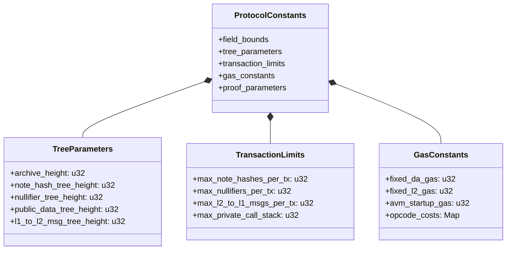

# Constants

## Overview

This specification defines all protocol-wide constants used throughout the Aztec Network. These constants govern fundamental protocol limits including tree heights, maximum array lengths, gas parameters, epoch timing, and cryptographic parameters. Changing any of these values would render alternative implementations incompatible with the protocol.

Constants are categorized into:
- **Field and Type Bounds**: Maximum values for primitive types and addresses
- **Tree Parameters**: Heights and capacities for Merkle trees that maintain protocol state
- **Transaction Limits**: Maximum counts for notes, nullifiers, logs, and other per-transaction effects
- **Call Limits**: Maximum counts for per-function-call effects
- **Rollup Structure**: Checkpoints, epochs, and blob parameters
- **Gas Constants**: Fixed costs and limits for execution
- **Cryptographic Parameters**: Proof sizes, verification key lengths, and generator indices
- **Protocol Addresses**: Canonical addresses for protocol contracts
- **AVM Parameters**: Constants specific to the Aztec Virtual Machine

## Requirements

### R1: Deterministic Protocol Behavior

All protocol implementations MUST use identical constant values to ensure deterministic behavior across the network. Divergence in any constant value will cause state divergence.

**Rationale:** Constants define fundamental protocol limits and parameters. Alternative implementations using different values would compute different state roots, reject valid transactions, or accept invalid ones.

### R2: Merkle Tree Capacity

Tree height constants MUST provide sufficient capacity for the protocol's target lifespan while remaining practical for proof generation.

**Rationale:** Tree heights are fixed at protocol inception. Insufficient capacity would limit protocol lifespan, while excessive heights increase proof generation costs unnecessarily. The protocol targets 100 years of operation at expected throughput.

### R3: Transaction and Call Limits

Maximum array lengths for notes, nullifiers, logs, and other effects MUST bound circuit complexity while providing sufficient capacity for realistic applications.

**Rationale:** These limits directly impact circuit sizes and proving costs. Limits that are too high make proving expensive; limits that are too low restrict application functionality.

### R4: Gas Parameter Accuracy

Gas constants MUST accurately reflect computational costs to prevent denial-of-service attacks while remaining economically viable.

**Rationale:** Underpriced operations enable DoS attacks. Overpriced operations make the protocol economically uncompetitive.

### R5: Backward Compatibility

Constants that affect on-chain state or L1 contracts MUST NOT change without a protocol upgrade that includes migration logic.

**Rationale:** Changes to tree heights, epoch structure, or blob parameters would require L1 contract upgrades and potentially state migration.

## Specification

### Field and Type Bounds

The protocol uses the BN254 curve's scalar field for all Field elements:

| Constant | Value | Description |
|----------|-------|-------------|
| `MAX_FIELD_VALUE` | 21888242871839275222246405745257275088548364400416034343698204186575808495616 | Maximum value representable as a Field element (BN254 scalar field modulus) |
| `MAX_ETH_ADDRESS_BIT_SIZE` | 160 | Bit size of Ethereum addresses (20 bytes) |
| `MAX_ETH_ADDRESS_VALUE` | 0xffffffffffffffffffffffffffffffffffffffff | Maximum valid Ethereum address value |
| `MAX_U64_VALUE` | 0xffffffffffffffff | Maximum unsigned 64-bit integer value |
| `MAX_U32_VALUE` | 0xffffffff | Maximum unsigned 32-bit integer value |

### Merkle Tree Heights

The protocol maintains five append-only or indexed Merkle trees. Tree heights determine maximum capacity:

| Tree | Constant | Height | Leaf Count | Rationale |
|------|----------|--------|------------|-----------|
| Archive | `ARCHIVE_HEIGHT` | 30 | 1,073,741,824 | 4-second blocks for 100+ years (2^30 / (86400/4) ≈ 123 years) |
| Note Hash | `NOTE_HASH_TREE_HEIGHT` | 42 | 4,398,046,511,104 | 64 notes/tx, 15 tps, for 100 years |
| Nullifier | `NULLIFIER_TREE_HEIGHT` | 42 | 4,398,046,511,104 | Same as note hash tree (nullifiers match notes) |
| Public Data | `PUBLIC_DATA_TREE_HEIGHT` | 40 | 1,099,511,627,776 | Average 16 updates/tx, 15 tps, 100 years |
| L1→L2 Messages | `L1_TO_L2_MSG_TREE_HEIGHT` | 36 | 68,719,476,736 | 1024 messages/checkpoint, 72s/checkpoint, 100 years |

**Additional Tree Constants:**

| Constant | Value | Description |
|----------|-------|-------------|
| `VK_TREE_HEIGHT` | 7 | Verification key tree height (128 circuit types max) |
| `FUNCTION_TREE_HEIGHT` | 7 | Private functions per contract (128 max) |
| `OUT_HASH_TREE_HEIGHT` | 5 | Output hash tree height (32 checkpoints per epoch max) |
| `ARTIFACT_FUNCTION_TREE_MAX_HEIGHT` | 7 | Unconstrained functions per contract (128 max) |

**Tree Identifiers:**

Each tree has a numeric identifier used in circuits:

| Tree | Identifier | Value |
|------|------------|-------|
| Nullifier Tree | `NULLIFIER_TREE_ID` | 0 |
| Note Hash Tree | `NOTE_HASH_TREE_ID` | 1 |
| Public Data Tree | `PUBLIC_DATA_TREE_ID` | 2 |
| L1→L2 Message Tree | `L1_TO_L2_MESSAGE_TREE_ID` | 3 |
| Archive Tree | `ARCHIVE_TREE_ID` | 4 |

### Subtree Parameters

Merkle tree insertions are batched using subtrees for efficient proof generation:

| Constant | Value | Description |
|----------|-------|-------------|
| `NOTE_HASH_SUBTREE_HEIGHT` | 6 | Batch size for note hash insertions (64 per batch) |
| `NULLIFIER_SUBTREE_HEIGHT` | 6 | Batch size for nullifier insertions (64 per batch) |
| `PUBLIC_DATA_SUBTREE_HEIGHT` | 6 | Batch size for public data updates (64 per batch) |
| `L1_TO_L2_MSG_SUBTREE_HEIGHT` | 10 | Batch size for L1→L2 messages (1024 per batch) |

**Sibling Path Lengths:**

The number of hashes needed to prove inclusion of a subtree root:

| Constant | Value | Calculation |
|----------|-------|-------------|
| `NOTE_HASH_SUBTREE_ROOT_SIBLING_PATH_LENGTH` | 36 | 42 - 6 |
| `NULLIFIER_SUBTREE_ROOT_SIBLING_PATH_LENGTH` | 36 | 42 - 6 |
| `L1_TO_L2_MSG_SUBTREE_ROOT_SIBLING_PATH_LENGTH` | 26 | 36 - 10 |

### Per-Transaction Limits

These constants define maximum counts for effects accumulated across an entire transaction:

| Constant | Value | Description |
|----------|-------|-------------|
| `MAX_NOTE_HASHES_PER_TX` | 64 | Maximum note hashes created in one transaction (2^6) |
| `MAX_NULLIFIERS_PER_TX` | 64 | Maximum nullifiers emitted in one transaction (2^6) |
| `MAX_PRIVATE_CALL_STACK_LENGTH_PER_TX` | 16 | Maximum private function calls in one transaction |
| `MAX_ENQUEUED_CALLS_PER_TX` | 32 | Maximum public calls enqueued from private execution |
| `MAX_PUBLIC_DATA_UPDATE_REQUESTS_PER_TX` | 63 | Maximum public state updates (64 - 1 for fee) |
| `PROTOCOL_PUBLIC_DATA_UPDATE_REQUESTS_PER_TX` | 1 | Reserved update for fee payer's balance |
| `MAX_TOTAL_PUBLIC_DATA_UPDATE_REQUESTS_PER_TX` | 64 | Total including protocol-reserved updates (2^6) |
| `MAX_PUBLIC_DATA_READS_PER_TX` | 64 | Maximum public state reads |
| `MAX_L2_TO_L1_MSGS_PER_TX` | 8 | Maximum L2→L1 messages per transaction |
| `MAX_PRIVATE_LOGS_PER_TX` | 64 | Maximum encrypted logs per transaction |
| `MAX_CONTRACT_CLASS_LOGS_PER_TX` | 1 | Maximum contract class registration logs |
| `MAX_NOTE_HASH_READ_REQUESTS_PER_TX` | 64 | Maximum note existence checks |
| `MAX_NULLIFIER_READ_REQUESTS_PER_TX` | 64 | Maximum nullifier existence checks |
| `MAX_KEY_VALIDATION_REQUESTS_PER_TX` | 64 | Maximum key validation requests |
| `MAX_L2_TO_L1_MSG_SUBTREES_PER_TX` | 3 | Maximum L2→L1 message subtrees (ceil(log2(8))) |

### Per-Call Limits

These constants define maximum counts for effects from a single function call:

| Constant | Value | Description |
|----------|-------|-------------|
| `MAX_NOTE_HASHES_PER_CALL` | 16 | Maximum note hashes created per function call |
| `MAX_NULLIFIERS_PER_CALL` | 16 | Maximum nullifiers emitted per function call |
| `MAX_PRIVATE_CALL_STACK_LENGTH_PER_CALL` | 8 | Maximum nested private calls per function |
| `MAX_ENQUEUED_CALLS_PER_CALL` | 32 | Maximum public calls enqueued per function |
| `MAX_L2_TO_L1_MSGS_PER_CALL` | 8 | Maximum L2→L1 messages per function call |
| `MAX_PRIVATE_LOGS_PER_CALL` | 16 | Maximum encrypted logs per function call |
| `MAX_CONTRACT_CLASS_LOGS_PER_CALL` | 1 | Maximum contract class logs per function |
| `MAX_NOTE_HASH_READ_REQUESTS_PER_CALL` | 16 | Maximum note existence checks per call |
| `MAX_NULLIFIER_READ_REQUESTS_PER_CALL` | 16 | Maximum nullifier existence checks per call |
| `MAX_KEY_VALIDATION_REQUESTS_PER_CALL` | 16 | Maximum key validation requests per call |

**Invariant:** For all effect types, `MAX_XXX_PER_TX >= MAX_XXX_PER_CALL` to allow accumulation across calls.

### Rollup Structure Constants

The rollup organizes transactions into a hierarchical structure:

```
Transactions → Blocks → Checkpoints → Epochs
```

| Constant | Value | Description |
|----------|-------|-------------|
| `FIELDS_PER_BLOB` | 4096 | Field elements per EIP-4844 blob |
| `BLOBS_PER_CHECKPOINT` | 6 | Maximum blobs published per checkpoint |
| `MAX_CHECKPOINTS_PER_EPOCH` | 32 | Maximum checkpoints proven in one epoch |
| `NUMBER_OF_L1_L2_MESSAGES_PER_ROLLUP` | 1024 | L1→L2 messages per rollup (2^10) |
| `INITIAL_L2_BLOCK_NUM` | 1 | First L2 block number (block 0 is genesis) |
| `INITIAL_CHECKPOINT_NUMBER` | 1 | First checkpoint number |
| `MAX_INCLUDE_BY_TIMESTAMP_DURATION` | 86400 | Maximum seconds a transaction can wait for inclusion (24 hours) |

**Genesis Values:**

These hash values define the initial state of the protocol:

| Constant | Value | Description |
|----------|-------|-------------|
| `GENESIS_BLOCK_HEADER_HASH` | 0x2ff681dd...761ff965 | Hash of genesis block header |
| `GENESIS_ARCHIVE_ROOT` | 0x15684c8c...a50bf5c7 | Initial archive tree root |
| `EMPTY_EPOCH_OUT_HASH` | 0x00c95e0c...3af093 | Out hash for empty epoch |

### Protocol Contract Addresses

Protocol contracts have fixed, reserved addresses:

| Contract | Constant | Address |
|----------|----------|---------|
| Canonical Auth Registry | `CANONICAL_AUTH_REGISTRY_ADDRESS` | 1 |
| Contract Instance Registry | `CONTRACT_INSTANCE_REGISTRY_CONTRACT_ADDRESS` | 2 |
| Contract Class Registry | `CONTRACT_CLASS_REGISTRY_CONTRACT_ADDRESS` | 3 |
| Multi-Call Entrypoint | `MULTI_CALL_ENTRYPOINT_ADDRESS` | 4 |
| Fee Juice | `FEE_JUICE_ADDRESS` | 5 |
| Public Checks | `PUBLIC_CHECKS_ADDRESS` | 6 |

| Constant | Value | Description |
|----------|-------|-------------|
| `MAX_PROTOCOL_CONTRACTS` | 11 | Maximum number of protocol contracts |
| `SIDE_EFFECT_MASKING_ADDRESS` | 0x2b29b6b9...c6eb11e3 | Address used for padding side effects |
| `NULL_MSG_SENDER_CONTRACT_ADDRESS` | 0xffffffff...ffffffff | Null message sender (field element -1) |

**Storage Slots:**

| Constant | Value | Description |
|----------|-------|-------------|
| `CONTRACT_CLASS_REGISTRY_BYTECODE_CAPSULE_SLOT` | 0x1f610387...928df1fb7 | Storage slot for bytecode capsules |
| `FEE_JUICE_BALANCES_SLOT` | 1 | Map slot for Fee Juice balances |
| `UPDATED_CLASS_IDS_SLOT` | 1 | Map slot for updated class IDs |

### Default Public Keys

These public keys serve as nullifiers for uninitialized accounts:

| Key Type | Constant | X Coordinate | Y Coordinate |
|----------|----------|--------------|--------------|
| Nullifier Public Key (NPK) | `DEFAULT_NPK_M_X` / `_Y` | 0x01498945...90364bbd | 0x170ae506...9ab7e344 |
| Incoming Viewing Public Key (IVPK) | `DEFAULT_IVPK_M_X` / `_Y` | 0x00c044b0...fe5e5866c | 0x1c1f0ca2...f2bdb151 |
| Outgoing Viewing Public Key (OVPK) | `DEFAULT_OVPK_M_X` / `_Y` | 0x1b003161...779e287 | 0x080ffc74...8b8dc7833 |
| Tagging Public Key (TPK) | `DEFAULT_TPK_M_X` / `_Y` | 0x019c111f...774a1efb | 0x2039907f...94705b6f |

These keys are derived by hashing the strings "az_null_npk", "az_null_ivpk", "az_null_ovpk", and "az_null_tpk" to the Grumpkin curve.

### Contract Class Constants

| Constant | Value | Description |
|----------|-------|-------------|
| `MAX_PACKED_PUBLIC_BYTECODE_SIZE_IN_FIELDS` | 3000 | Maximum public bytecode size (96KB when serialized) |
| `MAX_PACKED_BYTECODE_SIZE_PER_PRIVATE_FUNCTION_IN_FIELDS` | 3000 | Maximum private function bytecode size |
| `MAX_PACKED_BYTECODE_SIZE_PER_UTILITY_FUNCTION_IN_FIELDS` | 3000 | Maximum utility function bytecode size |
| `CLASS_REGISTRY_PRIVATE_FUNCTION_BROADCASTED_ADDITIONAL_FIELDS` | 23 | Metadata fields for private function broadcast |
| `CLASS_REGISTRY_UTILITY_FUNCTION_BROADCASTED_ADDITIONAL_FIELDS` | 14 | Metadata fields for utility function broadcast |
| `MAX_PUBLIC_CALLS_TO_UNIQUE_CONTRACT_CLASS_IDS` | 21 | Maximum unique contract classes called publicly per tx |

**Magic Values:**

These values identify specific event types in logs:

| Constant | Value | Purpose |
|----------|-------|---------|
| `CONTRACT_CLASS_PUBLISHED_MAGIC_VALUE` | 0x20f5895a...0bf7f244 | Contract class publication event |
| `CONTRACT_CLASS_REGISTRY_PRIVATE_FUNCTION_BROADCASTED_MAGIC_VALUE` | 0x0ea9d22f...ab09e618 | Private function broadcast event |
| `CONTRACT_CLASS_REGISTRY_UTILITY_FUNCTION_BROADCASTED_MAGIC_VALUE` | 0x06549ee6...0ba2369 | Utility function broadcast event |
| `CONTRACT_INSTANCE_PUBLISHED_MAGIC_VALUE` | 0x174c6b3d...0b3e22f | Contract instance publication event |
| `CONTRACT_INSTANCE_UPDATED_MAGIC_VALUE` | 0x2dcffa53...8eaa6f37 | Contract instance update event |

### Proof and Verification Key Lengths

Proof lengths are measured in field elements:

| Proof Type | Constant | Length (fields) | Description |
|------------|----------|-----------------|-------------|
| Recursive Proof | `RECURSIVE_PROOF_LENGTH` | 449 | Standard recursive proof size |
| Nested Recursive Proof | `NESTED_RECURSIVE_PROOF_LENGTH` | 449 | Nested proof size (same as recursive) |
| Recursive Rollup Honk Proof | `RECURSIVE_ROLLUP_HONK_PROOF_LENGTH` | 519 | Rollup proof with IPA claim |
| Nested Recursive Rollup Honk Proof | `NESTED_RECURSIVE_ROLLUP_HONK_PROOF_LENGTH` | 519 | Nested rollup proof |
| Chonk Proof | `CHONK_PROOF_LENGTH` | 1935 | Client Honk proof with incremental folding |
| IPA Proof | `IPA_PROOF_LENGTH` | 64 | Inner Product Argument proof |
| Ultra Keccak Proof | `ULTRA_KECCAK_PROOF_LENGTH` | 331 | Keccak-based proof (root rollup log_n=24) |

**Verification Key Lengths:**

| VK Type | Constant | Length (fields) | Description |
|---------|----------|-----------------|-------------|
| Ultra VK | `ULTRA_VK_LENGTH_IN_FIELDS` | 115 | Ultra verification key |
| Mega VK | `MEGA_VK_LENGTH_IN_FIELDS` | 127 | Mega verification key |
| Chonk VK | `CHONK_VK_LENGTH_IN_FIELDS` | 127 | Chonk verification key (same as Mega) |
| AVM VK | `AVM_VERIFICATION_KEY_LENGTH_IN_FIELDS` | 86 | AVM verification key (2 + 21×4) |

**AVM Proof Constants (Padded):**

| Constant | Value | Description |
|----------|-------|-------------|
| `AVM_V2_PROOF_LENGTH_IN_FIELDS_PADDED` | 16200 | Padded AVM proof length (until column count freezes) |
| `AVM_V2_VERIFICATION_KEY_LENGTH_IN_FIELDS_PADDED` | 1000 | Padded AVM VK length |

### Verification Key Tree Indices

Each circuit type has a fixed index in the verification key tree:

| Circuit | Constant | Index |
|---------|----------|-------|
| Private Kernel Init | `PRIVATE_KERNEL_INIT_VK_INDEX` | 0 |
| Private Kernel Inner | `PRIVATE_KERNEL_INNER_VK_INDEX` | 1 |
| Private Kernel Tail | `PRIVATE_KERNEL_TAIL_VK_INDEX` | 2 |
| Private Kernel Tail to Public | `PRIVATE_KERNEL_TAIL_TO_PUBLIC_VK_INDEX` | 3 |
| Hiding Kernel to Rollup | `HIDING_KERNEL_TO_ROLLUP_VK_INDEX` | 4 |
| Hiding Kernel to Public | `HIDING_KERNEL_TO_PUBLIC_VK_INDEX` | 5 |
| Public Chonk Verifier | `PUBLIC_CHONK_VERIFIER_VK_INDEX` | 6 |
| Private TX Base Rollup | `PRIVATE_TX_BASE_ROLLUP_VK_INDEX` | 7 |
| Public TX Base Rollup | `PUBLIC_TX_BASE_ROLLUP_VK_INDEX` | 8 |
| TX Merge Rollup | `TX_MERGE_ROLLUP_VK_INDEX` | 9 |
| Block Root First Rollup | `BLOCK_ROOT_FIRST_ROLLUP_VK_INDEX` | 10 |
| Block Root Single TX First | `BLOCK_ROOT_SINGLE_TX_FIRST_ROLLUP_VK_INDEX` | 11 |
| Block Root Empty TX First | `BLOCK_ROOT_EMPTY_TX_FIRST_ROLLUP_VK_INDEX` | 12 |
| Block Root Rollup | `BLOCK_ROOT_ROLLUP_VK_INDEX` | 13 |
| Block Root Single TX | `BLOCK_ROOT_SINGLE_TX_ROLLUP_VK_INDEX` | 14 |
| Block Merge Rollup | `BLOCK_MERGE_ROLLUP_VK_INDEX` | 15 |
| Checkpoint Root Rollup | `CHECKPOINT_ROOT_ROLLUP_VK_INDEX` | 16 |
| Checkpoint Root Single Block | `CHECKPOINT_ROOT_SINGLE_BLOCK_ROLLUP_VK_INDEX` | 17 |
| Checkpoint Padding Rollup | `CHECKPOINT_PADDING_ROLLUP_VK_INDEX` | 18 |
| Checkpoint Merge Rollup | `CHECKPOINT_MERGE_ROLLUP_VK_INDEX` | 19 |
| Root Rollup | `ROOT_ROLLUP_VK_INDEX` | 20 |
| Parity Base | `PARITY_BASE_VK_INDEX` | 21 |
| Parity Root | `PARITY_ROOT_VK_INDEX` | 22 |
| Private Kernel Reset | `PRIVATE_KERNEL_RESET_VK_INDEX` | 23 |

Indices after 23 are reserved for variants of Private Kernel Reset.

### Gas Constants

**Fixed Gas Costs:**

| Constant | Value | Description |
|----------|-------|-------------|
| `FIXED_DA_GAS` | 512 | Fixed DA gas for transaction preamble |
| `FIXED_L2_GAS` | 512 | Fixed L2 gas for validation and state updates |
| `FIXED_AVM_STARTUP_L2_GAS` | 20000 | Base cost for starting AVM execution |
| `L2_GAS_DISTRIBUTED_STORAGE_PREMIUM` | 1024 | Premium for distributed storage operations |

**Gas Limits:**

| Constant | Value | Description |
|----------|-------|-------------|
| `AVM_MAX_PROCESSABLE_L2_GAS` | 6000000 | Maximum L2 gas the AVM can safely process |
| `MAX_PROCESSABLE_DA_GAS_PER_CHECKPOINT` | 12582912 | Maximum DA gas per checkpoint (6 blobs × 4096 fields × 32 bytes × 16) |
| `DEFAULT_L2_GAS_LIMIT` | 6000000 | Default L2 gas limit for transactions |
| `DEFAULT_TEARDOWN_L2_GAS_LIMIT` | 1000000 | Default teardown L2 gas limit |
| `DEFAULT_DA_GAS_LIMIT` | 12582912 | Default DA gas limit |
| `DEFAULT_TEARDOWN_DA_GAS_LIMIT` | 1000000 | Default teardown DA gas limit |

**Gas Estimation Limits:**

| Constant | Value | Description |
|----------|-------|-------------|
| `GAS_ESTIMATION_L2_GAS_LIMIT` | 12000000 | L2 gas limit for estimation (2× max processable) |
| `GAS_ESTIMATION_TEARDOWN_L2_GAS_LIMIT` | 6000000 | Teardown L2 gas for estimation |
| `GAS_ESTIMATION_DA_GAS_LIMIT` | 25165824 | DA gas limit for estimation (2× max per checkpoint) |
| `GAS_ESTIMATION_TEARDOWN_DA_GAS_LIMIT` | 12582912 | Teardown DA gas for estimation |

**DA Gas Parameters:**

| Constant | Value | Description |
|----------|-------|-------------|
| `DA_BYTES_PER_FIELD` | 32 | Bytes per field element for DA calculations |
| `DA_GAS_PER_BYTE` | 16 | DA gas cost per byte |

**Per-Effect L2 Gas Costs:**

| Constant | Value | Description |
|----------|-------|-------------|
| `L2_GAS_PER_NOTE_HASH` | 0 | L2 gas per note hash (no additional cost) |
| `L2_GAS_PER_NULLIFIER` | 0 | L2 gas per nullifier (no additional cost) |
| `L2_GAS_PER_L2_TO_L1_MSG` | 200 | L2 gas for L2→L1 message |
| `L2_GAS_PER_PRIVATE_LOG` | 0 | L2 gas per private log (no validation) |
| `L2_GAS_PER_CONTRACT_CLASS_LOG` | 0 | L2 gas per contract class log |

### AVM Opcode Gas Costs

**Arithmetic Operations (Base L2 Gas):**

| Operation | Constant | Cost | Notes |
|-----------|----------|------|-------|
| ADD | `AVM_ADD_BASE_L2_GAS` | 12 | Addition |
| SUB | `AVM_SUB_BASE_L2_GAS` | 12 | Subtraction |
| MUL | `AVM_MUL_BASE_L2_GAS` | 27 | Multiplication |
| DIV | `AVM_DIV_BASE_L2_GAS` | 27 | Integer division |
| FDIV | `AVM_FDIV_BASE_L2_GAS` | 225 | Field division (slow simulation ×25) |
| EQ | `AVM_EQ_BASE_L2_GAS` | 12 | Equality check |
| LT | `AVM_LT_BASE_L2_GAS` | 42 | Less than |
| LTE | `AVM_LTE_BASE_L2_GAS` | 42 | Less than or equal |

**Bitwise Operations:**

| Operation | Constant | Cost |
|-----------|----------|------|
| AND | `AVM_AND_BASE_L2_GAS` | 12 |
| OR | `AVM_OR_BASE_L2_GAS` | 12 |
| XOR | `AVM_XOR_BASE_L2_GAS` | 12 |
| NOT | `AVM_NOT_BASE_L2_GAS` | 12 |
| SHL | `AVM_SHL_BASE_L2_GAS` | 18 |
| SHR | `AVM_SHR_BASE_L2_GAS` | 18 |

**Memory and Control Flow:**

| Operation | Constant | Cost |
|-----------|----------|------|
| CAST | `AVM_CAST_BASE_L2_GAS` | 27 |
| GETENVVAR | `AVM_GETENVVAR_BASE_L2_GAS` | 12 |
| MOV | `AVM_MOV_BASE_L2_GAS` | 12 |
| SET | `AVM_SET_BASE_L2_GAS` | 27 |
| JUMP | `AVM_JUMP_BASE_L2_GAS` | 9 |
| JUMPI | `AVM_JUMPI_BASE_L2_GAS` | 9 |
| INTERNALCALL | `AVM_INTERNALCALL_BASE_L2_GAS` | 9 |
| INTERNALRETURN | `AVM_INTERNALRETURN_BASE_L2_GAS` | 9 |
| RETURN | `AVM_RETURN_BASE_L2_GAS` | 9 |
| REVERT | `AVM_REVERT_BASE_L2_GAS` | 9 |

**Data Copy Operations (Base + Dynamic):**

| Operation | Base Constant | Base Cost | Dynamic Constant | Dynamic Cost |
|-----------|---------------|-----------|------------------|--------------|
| CALLDATACOPY | `AVM_CALLDATACOPY_BASE_L2_GAS` | 18 | `AVM_CALLDATACOPY_DYN_L2_GAS` | 3 per unit |
| RETURNDATACOPY | `AVM_RETURNDATACOPY_BASE_L2_GAS` | 18 | `AVM_RETURNDATACOPY_DYN_L2_GAS` | 3 per unit |
| SUCCESSCOPY | `AVM_SUCCESSCOPY_BASE_L2_GAS` | 12 | — | — |
| RETURNDATASIZE | `AVM_RETURNDATASIZE_BASE_L2_GAS` | 12 | — | — |

**State Access:**

| Operation | Constant | Cost | Notes |
|-----------|----------|------|-------|
| SLOAD | `AVM_SLOAD_BASE_L2_GAS` | 1290 | Storage load (slow sim ×10) |
| SSTORE | `AVM_SSTORE_BASE_L2_GAS` | 33140 | Storage store (slow sim ×20, includes premium) |
| SSTORE (DA) | `AVM_SSTORE_DYN_DA_GAS` | 1024 | DA gas for public data updates |

**Note Hashes and Nullifiers:**

| Operation | Constant | L2 Cost | DA Cost |
|-----------|----------|---------|---------|
| NOTEHASHEXISTS | `AVM_NOTEHASHEXISTS_BASE_L2_GAS` | 504 | — |
| EMITNOTEHASH | `AVM_EMITNOTEHASH_BASE_L2_GAS` | 19275 | 512 |
| NULLIFIEREXISTS | `AVM_NULLIFIEREXISTS_BASE_L2_GAS` | 903 | — |
| EMITNULLIFIER | `AVM_EMITNULLIFIER_BASE_L2_GAS` | 30800 | 512 |

**Messaging:**

| Operation | Constant | L2 Cost | DA Cost |
|-----------|----------|---------|---------|
| L1TOL2MSGEXISTS | `AVM_L1TOL2MSGEXISTS_BASE_L2_GAS` | 540 | — |
| SENDL2TOL1MSG | `AVM_SENDL2TOL1MSG_BASE_L2_GAS` | 478 | 512 |

**Contract Operations:**

| Operation | Constant | Cost |
|-----------|----------|------|
| GETCONTRACTINSTANCE | `AVM_GETCONTRACTINSTANCE_BASE_L2_GAS` | 6108 |
| CALL | `AVM_CALL_BASE_L2_GAS` | 9936 |
| STATICCALL | `AVM_STATICCALL_BASE_L2_GAS` | 9936 |

**Logging:**

| Operation | Base Constant | Base L2 Cost | Base DA Cost | Dynamic L2 | Dynamic DA |
|-----------|---------------|--------------|--------------|------------|------------|
| EMITUNENCRYPTEDLOG | `AVM_EMITUNENCRYPTEDLOG_BASE_L2_GAS` | 15 | 1024 | 3 | 512 per field |
| DEBUGLOG | `AVM_DEBUGLOG_BASE_L2_GAS` | 9 | — | — | — |

**Cryptographic Operations:**

| Operation | Constant | Cost | Notes |
|-----------|----------|------|-------|
| POSEIDON2 | `AVM_POSEIDON2_BASE_L2_GAS` | 360 | Poseidon2 permutation (×15) |
| SHA256COMPRESSION | `AVM_SHA256COMPRESSION_BASE_L2_GAS` | 12288 | SHA-256 compression round |
| KECCAKF1600 | `AVM_KECCAKF1600_BASE_L2_GAS` | 58176 | Keccak-f[1600] permutation |
| ECADD | `AVM_ECADD_BASE_L2_GAS` | 270 | Elliptic curve addition (×10) |
| TORADIXBE | `AVM_TORADIXBE_BASE_L2_GAS` | 24 | Radix conversion base cost |
| TORADIXBE (dynamic) | `AVM_TORADIXBE_DYN_L2_GAS` | 3 | Per digit |

**Bitwise Dynamic Gas:**

| Constant | Value | Description |
|----------|-------|-------------|
| `AVM_BITWISE_DYN_L2_GAS` | 3 | L2 gas per byte for bitwise operations |

### AVM Memory and Addressing

| Constant | Value | Description |
|----------|-------|-------------|
| `AVM_MEMORY_SIZE` | 4294967296 | Total AVM memory size (2^32 bytes) |
| `AVM_HIGHEST_MEM_ADDRESS` | 4294967295 | Highest valid memory address |
| `AVM_MEMORY_NUM_BITS` | 32 | Bits for memory addressing |
| `AVM_PC_SIZE_IN_BITS` | 32 | Program counter size in bits |
| `AVM_MAX_OPERANDS` | 7 | Maximum operands per instruction |
| `AVM_MAX_REGISTERS` | 6 | Maximum registers used |
| `AVM_ADDRESSING_BASE_RESOLUTION_L2_GAS` | 3 | Gas for base resolution |
| `AVM_ADDRESSING_INDIRECT_L2_GAS` | 3 | Gas for indirect addressing |
| `AVM_ADDRESSING_RELATIVE_L2_GAS` | 3 | Gas for relative addressing |

**Memory Tags:**

| Tag | Constant | Value | Type |
|-----|----------|-------|------|
| Field | `MEM_TAG_FF` | 0 | Field element |
| U1 | `MEM_TAG_U1` | 1 | 1-bit unsigned |
| U8 | `MEM_TAG_U8` | 2 | 8-bit unsigned |
| U16 | `MEM_TAG_U16` | 3 | 16-bit unsigned |
| U32 | `MEM_TAG_U32` | 4 | 32-bit unsigned |
| U64 | `MEM_TAG_U64` | 5 | 64-bit unsigned |
| U128 | `MEM_TAG_U128` | 6 | 128-bit unsigned |

### Data Structure Lengths

These constants define serialization sizes for protocol data structures (in field elements):

**Basic Types:**

| Structure | Constant | Length |
|-----------|----------|--------|
| Aztec Address | `AZTEC_ADDRESS_LENGTH` | 1 |
| Ethereum Address | `ETH_ADDRESS_LENGTH` | 1 |
| Gas | `GAS_LENGTH` | 2 |
| Gas Fees | `GAS_FEES_LENGTH` | 2 |
| Gas Settings | `GAS_SETTINGS_LENGTH` | 8 |
| Function Data | `FUNCTION_DATA_LENGTH` | 2 |
| Call Context | `CALL_CONTEXT_LENGTH` | 4 |

**Tree Snapshots:**

| Structure | Constant | Length |
|-----------|----------|--------|
| Append-Only Tree Snapshot | `APPEND_ONLY_TREE_SNAPSHOT_LENGTH` | 2 |
| Append-Only Tree Snapshot (bytes) | `APPEND_ONLY_TREE_SNAPSHOT_LENGTH_BYTES` | 36 |
| State Reference | `STATE_REFERENCE_LENGTH` | 8 |
| Partial State Reference | `PARTIAL_STATE_REFERENCE_LENGTH` | 6 |
| Tree Snapshots | `TREE_SNAPSHOTS_LENGTH` | 8 |

**Messages:**

| Structure | Constant | Length |
|-----------|----------|--------|
| L1→L2 Message | `L1_TO_L2_MESSAGE_LENGTH` | 6 |
| L2→L1 Message | `L2_TO_L1_MESSAGE_LENGTH` | 2 |
| Counted L2→L1 Message | `COUNTED_L2_TO_L1_MESSAGE_LENGTH` | 3 |
| Scoped L2→L1 Message | `SCOPED_L2_TO_L1_MESSAGE_LENGTH` | 3 |
| Scoped Counted L2→L1 Message | `SCOPED_COUNTED_L2_TO_L1_MESSAGE_LENGTH` | 4 |

**Logs:**

| Structure | Constant | Length |
|-----------|----------|--------|
| Private Log Size | `PRIVATE_LOG_SIZE_IN_FIELDS` | 18 |
| Private Log | `PRIVATE_LOG_LENGTH` | 19 |
| Private Log Data | `PRIVATE_LOG_DATA_LENGTH` | 21 |
| Private Log Ciphertext | `PRIVATE_LOG_CIPHERTEXT_LEN` | 17 |
| Scoped Private Log Data | `SCOPED_PRIVATE_LOG_DATA_LENGTH` | 22 |
| Public Logs Header | `FLAT_PUBLIC_LOGS_HEADER_LENGTH` | 1 |
| Public Logs Payload | `FLAT_PUBLIC_LOGS_PAYLOAD_LENGTH` | 4096 |
| Public Logs | `PUBLIC_LOGS_LENGTH` | 4097 |
| Public Log Header | `PUBLIC_LOG_HEADER_LENGTH` | 2 |
| Max Public Log Size | `MAX_PUBLIC_LOG_SIZE_IN_FIELDS` | 4094 |
| Contract Class Log Size | `CONTRACT_CLASS_LOG_SIZE_IN_FIELDS` | 3023 |
| Contract Class Log | `CONTRACT_CLASS_LOG_LENGTH` | 3025 |
| Log Hash | `LOG_HASH_LENGTH` | 2 |
| Counted Log Hash | `COUNTED_LOG_HASH_LENGTH` | 3 |
| Scoped Log Hash | `SCOPED_LOG_HASH_LENGTH` | 3 |
| Scoped Counted Log Hash | `SCOPED_COUNTED_LOG_HASH_LENGTH` | 4 |

**Notes and Nullifiers:**

| Structure | Constant | Length |
|-----------|----------|--------|
| Note Hash | `NOTE_HASH_LENGTH` | 2 |
| Scoped Note Hash | `SCOPED_NOTE_HASH_LENGTH` | 3 |
| Nullifier | `NULLIFIER_LENGTH` | 3 |
| Scoped Nullifier | `SCOPED_NULLIFIER_LENGTH` | 4 |

**Call Requests:**

| Structure | Constant | Length |
|-----------|----------|--------|
| Private Call Request | `PRIVATE_CALL_REQUEST_LENGTH` | 8 |
| Public Call Request | `PUBLIC_CALL_REQUEST_LENGTH` | 4 |
| Counted Public Call Request | `COUNTED_PUBLIC_CALL_REQUEST_LENGTH` | 5 |
| Public Inner Call Request | `PUBLIC_INNER_CALL_REQUEST_LENGTH` | 13 |
| Public Call Stack Item (Compressed) | `PUBLIC_CALL_STACK_ITEM_COMPRESSED_LENGTH` | 12 |

**Storage:**

| Structure | Constant | Length |
|-----------|----------|--------|
| Public Data Write | `PUBLIC_DATA_WRITE_LENGTH` | 2 |
| Public Data Read | `PUBLIC_DATA_READ_LENGTH` | 3 |
| Contract Storage Read | `CONTRACT_STORAGE_READ_LENGTH` | 3 |
| Contract Storage Update Request | `CONTRACT_STORAGE_UPDATE_REQUEST_LENGTH` | 3 |

**Keys and Validation:**

| Structure | Constant | Length |
|-----------|----------|--------|
| Key Validation Request | `KEY_VALIDATION_REQUEST_LENGTH` | 4 |
| Key Validation Request and Generator | `KEY_VALIDATION_REQUEST_AND_GENERATOR_LENGTH` | 5 |
| Scoped Key Validation Request and Generator | `SCOPED_KEY_VALIDATION_REQUEST_AND_GENERATOR_LENGTH` | 6 |

**Blob and BLS12 Structures:**

| Structure | Constant | Length |
|-----------|----------|--------|
| Sponge Blob | `SPONGE_BLOB_LENGTH` | 10 |
| BLS12 FR Limbs | `BLS12_FR_LIMBS` | 3 |
| BLS12 FQ Limbs | `BLS12_FQ_LIMBS` | 4 |
| BLS12 Point | `BLS12_POINT_LENGTH` | 9 |
| BLS12 Point Compressed (bytes) | `BLS12_POINT_COMPRESSED_BYTES` | 48 |
| Blob Accumulator | `BLOB_ACCUMULATOR_LENGTH` | 18 |
| Final Blob Batching Challenges | `FINAL_BLOB_BATCHING_CHALLENGES_LENGTH` | 4 |
| Final Blob Accumulator | `FINAL_BLOB_ACCUMULATOR_LENGTH` | 7 |

**Headers:**

| Structure | Constant | Length |
|-----------|----------|--------|
| Global Variables | `GLOBAL_VARIABLES_LENGTH` | 9 |
| TX Context | `TX_CONTEXT_LENGTH` | 10 |
| TX Request | `TX_REQUEST_LENGTH` | 15 |
| Block Header | `BLOCK_HEADER_LENGTH` | 22 |
| Checkpoint Header | `CHECKPOINT_HEADER_LENGTH` | 12 |
| Checkpoint Header (bytes) | `CHECKPOINT_HEADER_SIZE_IN_BYTES` | 316 |
| Total Fees | `TOTAL_FEES_LENGTH` | 1 |
| Total Mana Used | `TOTAL_MANA_USED_LENGTH` | 1 |
| Fee Recipient | `FEE_RECIPIENT_LENGTH` | 2 |

**Circuit Public Inputs:**

| Structure | Constant | Length |
|-----------|----------|--------|
| Private Circuit Public Inputs | `PRIVATE_CIRCUIT_PUBLIC_INPUTS_LENGTH` | 902 |
| Private Context Inputs | `PRIVATE_CONTEXT_INPUTS_LENGTH` | 37 |
| Private Validation Requests | `PRIVATE_VALIDATION_REQUESTS_LENGTH` | 771 |
| Private Accumulated Data | `PRIVATE_ACCUMULATED_DATA_LENGTH` | 2187 |
| Private to Rollup Accumulated Data | `PRIVATE_TO_ROLLUP_ACCUMULATED_DATA_LENGTH` | 1371 |
| Private to Public Accumulated Data | `PRIVATE_TO_PUBLIC_ACCUMULATED_DATA_LENGTH` | 1499 |
| Private to AVM Accumulated Data | `PRIVATE_TO_AVM_ACCUMULATED_DATA_LENGTH` | 152 |
| AVM Accumulated Data | `AVM_ACCUMULATED_DATA_LENGTH` | 4377 |
| Private Kernel Circuit Public Inputs | `PRIVATE_KERNEL_CIRCUIT_PUBLIC_INPUTS_LENGTH` | 3001 |
| Private to Public Kernel Circuit Public Inputs | `PRIVATE_TO_PUBLIC_KERNEL_CIRCUIT_PUBLIC_INPUTS_LENGTH` | 3040 |
| Private to Rollup Kernel Circuit Public Inputs | `PRIVATE_TO_ROLLUP_KERNEL_CIRCUIT_PUBLIC_INPUTS_LENGTH` | 1409 |
| AVM Circuit Public Inputs | `AVM_CIRCUIT_PUBLIC_INPUTS_LENGTH` | 5008 |
| TX Constant Data | `TX_CONSTANT_DATA_LENGTH` | 34 |
| Combined Constant Data | `COMBINED_CONSTANT_DATA_LENGTH` | 43 |
| Block Constant Data | `BLOCK_CONSTANT_DATA_LENGTH` | 16 |
| Checkpoint Constant Data | `CHECKPOINT_CONSTANT_DATA_LENGTH` | 10 |
| Epoch Constant Data | `EPOCH_CONSTANT_DATA_LENGTH` | 5 |
| TX Rollup Public Inputs | `TX_ROLLUP_PUBLIC_INPUTS_LENGTH` | 52 |
| Block Rollup Public Inputs | `BLOCK_ROLLUP_PUBLIC_INPUTS_LENGTH` | 56 |
| Checkpoint Rollup Public Inputs | `CHECKPOINT_ROLLUP_PUBLIC_INPUTS_LENGTH` | 149 |
| Root Rollup Public Inputs | `ROOT_ROLLUP_PUBLIC_INPUTS_LENGTH` | 111 |

**Miscellaneous:**

| Structure | Constant | Length |
|-----------|----------|--------|
| Contract Instance | `CONTRACT_INSTANCE_LENGTH` | 16 |
| Function Leaf Preimage | `FUNCTION_LEAF_PREIMAGE_LENGTH` | 5 |
| Tree Leaf Read Request | `TREE_LEAF_READ_REQUEST_LENGTH` | 2 |
| Scoped Read Request | `SCOPED_READ_REQUEST_LEN` | 3 |
| Hiding Kernel IO Public Inputs Size | `HIDING_KERNEL_IO_PUBLIC_INPUTS_SIZE` | 28 |
| Pairing Points Size | `PAIRING_POINTS_SIZE` | 8 |
| IPA Claim Size | `IPA_CLAIM_SIZE` | 6 |

**Array Counts:**

| Constant | Value | Description |
|----------|-------|-------------|
| `NUM_PRIVATE_TO_AVM_ACCUMULATED_DATA_ARRAYS` | 3 | Note hashes, nullifiers, L2→L1 msgs |
| `NUM_AVM_ACCUMULATED_DATA_ARRAYS` | 4 | Above plus public data writes |
| `NUM_PUBLIC_CALL_REQUEST_ARRAYS` | 3 | Setup, app logic, teardown |

### Parity Circuit Constants

| Constant | Value | Description |
|----------|-------|-------------|
| `NUM_MSGS_PER_BASE_PARITY` | 256 | Messages processed per base parity circuit |
| `NUM_BASE_PARITY_PER_ROOT_PARITY` | 4 | Base parity circuits per root parity |

### Miscellaneous Constants

| Constant | Value | Description |
|----------|-------|-------------|
| `FUNCTION_SELECTOR_NUM_BYTES` | 4 | Bytes in a function selector |
| `MAX_FR_CALLDATA_TO_ALL_ENQUEUED_CALLS` | 16000 | Maximum field elements in calldata to all enqueued calls |
| `TWO_POW_64` | 18446744073709551616 | 2^64 as a field element |
| `GRUMPKIN_ONE_X` | 1 | Grumpkin generator point X coordinate |
| `GRUMPKIN_ONE_Y` | 17631683881184975370165255887551781615748388533673675138860 | Grumpkin generator point Y coordinate |
| `DEFAULT_MAX_DEBUG_LOG_MEMORY_READS` | 125000 | DoS protection limit (4MB memory reads) |

**Delayed Updates:**

| Constant | Value | Description |
|----------|-------|-------------|
| `DEFAULT_UPDATE_DELAY` | 86400 | Default delay for contract updates (seconds) |
| `MINIMUM_UPDATE_DELAY` | 600 | Minimum allowed update delay (10 minutes) |
| `TIMESTAMP_OF_CHANGE_BIT_SIZE` | 32 | Bits for timestamp representation |
| `UPDATES_VALUE_SIZE` | 1 | Fields per update value |
| `UPDATES_DELAYED_PUBLIC_MUTABLE_VALUES_LEN` | 3 | Length of delayed mutable values |
| `UPDATES_DELAYED_PUBLIC_MUTABLE_SDC_DELAY_BIT_SIZE` | 32 | Delay bits |
| `UPDATES_DELAYED_PUBLIC_MUTABLE_SDC_IS_SOME_BIT_SIZE` | 8 | Option flag bits |
| `UPDATES_DELAYED_PUBLIC_MUTABLE_SDC_OPTION_DELAY_BIT_SIZE` | 40 | Combined option bits |
| `UPDATES_DELAYED_PUBLIC_MUTABLE_METADATA_BIT_SIZE` | 144 | Total metadata bits |

**Blob Prefixes:**

These values identify blob section boundaries when decoding tightly-packed effects:

| Constant | Value | Description |
|----------|-------|-------------|
| `TX_START_PREFIX` | 0x9c707518 | Marks transaction start |
| `BLOCK_END_PREFIX` | 0xeb8dcdbf | Marks block end |
| `CHECKPOINT_END_PREFIX` | 0x8c637443 | Marks checkpoint end |

**Proof Type Identifiers:**

| Constant | Value | Type |
|----------|-------|------|
| `PROOF_TYPE_HONK` | 0 | Honk proof |
| `PROOF_TYPE_OINK` | 1 | Oink proof |
| `PROOF_TYPE_HN` | 2 | HN proof |
| `PROOF_TYPE_AVM` | 3 | AVM proof |
| `PROOF_TYPE_ROLLUP_HONK` | 4 | Rollup Honk proof |
| `PROOF_TYPE_ROOT_ROLLUP_HONK` | 5 | Root rollup Honk proof |
| `PROOF_TYPE_HN_FINAL` | 7 | Final HN proof |
| `PROOF_TYPE_HN_TAIL` | 8 | Tail HN proof |
| `PROOF_TYPE_CHONK` | 9 | Chonk proof |

### Generator Indices (Domain Separators)

Generator indices serve as domain separators for hash functions to prevent cross-protocol collisions:

**Note Hashes:**

| Index | Constant | Value | Purpose |
|-------|----------|-------|---------|
| NOTE_HASH | `DOM_SEP__NOTE_HASH` | 116501019 | Custom note hash computation |
| NOTE_HASH_NONCE | `DOM_SEP__NOTE_HASH_NONCE` | 1721808740 | Note hash with nonce |
| UNIQUE_NOTE_HASH | `DOM_SEP__UNIQUE_NOTE_HASH` | 226850429 | Unique note hash |
| SILOED_NOTE_HASH | `DOM_SEP__SILOED_NOTE_HASH` | 3361878420 | Siloed note hash |

**Nullifiers:**

| Index | Constant | Value | Purpose |
|-------|----------|-------|---------|
| NOTE_NULLIFIER | `DOM_SEP__NOTE_NULLIFIER` | 50789342 | Note nullifier |
| MESSAGE_NULLIFIER | `DOM_SEP__MESSAGE_NULLIFIER` | 3754509616 | L1→L2 message nullifier |
| SILOED_NULLIFIER | `DOM_SEP__SILOED_NULLIFIER` | 57496191 | Siloed nullifier |

**Storage:**

| Index | Constant | Value | Purpose |
|-------|----------|-------|---------|
| PUBLIC_LEAF_SLOT | `DOM_SEP__PUBLIC_LEAF_SLOT` | 1247650290 | Public storage leaf slot |
| PUBLIC_STORAGE_MAP_SLOT | `DOM_SEP__PUBLIC_STORAGE_MAP_SLOT` | 4015149901 | Public storage map slot |

**Contract Class:**

| Index | Constant | Value | Purpose |
|-------|----------|-------|---------|
| PRIVATE_FUNCTION_LEAF | `DOM_SEP__PRIVATE_FUNCTION_LEAF` | 1389398688 | Private function leaf |
| PUBLIC_BYTECODE | `DOM_SEP__PUBLIC_BYTECODE` | 260313585 | Public bytecode hash |
| CONTRACT_CLASS_ID | `DOM_SEP__CONTRACT_CLASS_ID` | 3923495515 | Contract class ID |

**Keys:**

| Index | Constant | Value | Purpose |
|-------|----------|-------|---------|
| INITIALIZER | `DOM_SEP__INITIALIZER` | 385396519 | Salted initialization hash |
| NHK_M | `DOM_SEP__NHK_M` | 242137788 | Nullifier key derivation |
| IVSK_M | `DOM_SEP__IVSK_M` | 2747825907 | Incoming viewing secret key derivation |
| OVSK_M | `DOM_SEP__OVSK_M` | 4272201051 | Outgoing viewing secret key derivation |
| TSK_M | `DOM_SEP__TSK_M` | 1546190975 | Tagging secret key derivation |
| PUBLIC_KEYS_HASH | `DOM_SEP__PUBLIC_KEYS_HASH` | 777457226 | Public keys hash |

**Addresses:**

| Index | Constant | Value | Purpose |
|-------|----------|-------|---------|
| PARTIAL_ADDRESS | `DOM_SEP__PARTIAL_ADDRESS` | 2103633018 | Partial address derivation |
| CONTRACT_ADDRESS_V1 | `DOM_SEP__CONTRACT_ADDRESS_V1` | 1788365517 | Contract address v1 |

**Transactions:**

| Index | Constant | Value | Purpose |
|-------|----------|-------|---------|
| BLOCK_HEADER_HASH | `DOM_SEP__BLOCK_HEADER_HASH` | 4195546849 | Block header hash |
| TX_REQUEST | `DOM_SEP__TX_REQUEST` | 3763737512 | Transaction request hash |
| PUBLIC_TX_HASH | `DOM_SEP__PUBLIC_TX_HASH` | 1630108851 | Public transaction hash |
| PRIVATE_TX_HASH | `DOM_SEP__PRIVATE_TX_HASH` | 1971680439 | Private transaction hash |
| PUBLIC_CALLDATA | `DOM_SEP__PUBLIC_CALLDATA` | 2760353947 | Public function calldata hash |
| FUNCTION_ARGS | `DOM_SEP__FUNCTION_ARGS` | 3576554347 | Private function arguments hash |

**Protocol:**

| Index | Constant | Value | Purpose |
|-------|----------|-------|---------|
| PROTOCOL_CONTRACTS | `DOM_SEP__PROTOCOL_CONTRACTS` | 3904434327 | Protocol contracts hash |
| EVENT_COMMITMENT | `DOM_SEP__EVENT_COMMITMENT` | 2517418573 | Event commitment hash |
| PRIVATE_LOG_FIRST_FIELD | `DOM_SEP__PRIVATE_LOG_FIRST_FIELD` | 2769976252 | Private log first field |

**Authorization and Encryption:**

| Index | Constant | Value | Purpose |
|-------|----------|-------|---------|
| AUTHWIT_INNER | `DOM_SEP__AUTHWIT_INNER` | 221354163 | Inner authwit hash |
| AUTHWIT_OUTER | `DOM_SEP__AUTHWIT_OUTER` | 3283595782 | Outer authwit hash |
| AUTHWIT_NULLIFIER | `DOM_SEP__AUTHWIT_NULLIFIER` | 1239150694 | Authwit nullifier |
| SYMMETRIC_KEY | `DOM_SEP__SYMMETRIC_KEY` | 3882206064 | Symmetric key derivation |
| SYMMETRIC_KEY_2 | `DOM_SEP__SYMMETRIC_KEY_2` | 4129434989 | Alternative symmetric key |
| PARTIAL_NOTE_VALIDITY_COMMITMENT | `DOM_SEP__PARTIAL_NOTE_VALIDITY_COMMITMENT` | 623934423 | Partial note validity |

**Miscellaneous:**

| Index | Constant | Value | Purpose |
|-------|----------|-------|---------|
| INITIALIZATION_NULLIFIER | `DOM_SEP__INITIALIZATION_NULLIFIER` | 1653084894 | Initialization nullifier |
| SECRET_HASH | `DOM_SEP__SECRET_HASH` | 4199652938 | Secret hash |
| TX_NULLIFIER | `DOM_SEP__TX_NULLIFIER` | 1025801951 | Transaction nullifier |
| SIGNATURE_PAYLOAD | `DOM_SEP__SIGNATURE_PAYLOAD` | 463525807 | Signature payload hash |

## Data Structures

### Constant Categories



### Constant Derivation

Some constants are derived from others:

```
NOTE_HASH_TREE_LEAF_COUNT = 2^NOTE_HASH_TREE_HEIGHT
                          = 2^42
                          = 4,398,046,511,104

MAX_NOTE_HASHES_PER_TX = 2^NOTE_HASH_SUBTREE_HEIGHT
                        = 2^6
                        = 64

NOTE_HASH_SUBTREE_ROOT_SIBLING_PATH_LENGTH = NOTE_HASH_TREE_HEIGHT - NOTE_HASH_SUBTREE_HEIGHT
                                             = 42 - 6
                                             = 36
```

## Validation Rules

### V1: Field Value Bounds

All field elements used in the protocol MUST satisfy:

```
0 <= field_value < MAX_FIELD_VALUE
```

Any value outside this range MUST be rejected.

### V2: Tree Capacity

Implementations MUST ensure tree insertions do not exceed tree capacity:

```
note_hash_count <= NOTE_HASH_TREE_LEAF_COUNT
nullifier_count <= 2^NULLIFIER_TREE_HEIGHT
```

Attempting to insert beyond capacity MUST result in an error.

### V3: Per-Transaction Limits

Implementations MUST reject transactions that exceed per-transaction limits:

- `len(note_hashes) <= MAX_NOTE_HASHES_PER_TX`
- `len(nullifiers) <= MAX_NULLIFIERS_PER_TX`
- `len(l2_to_l1_messages) <= MAX_L2_TO_L1_MSGS_PER_TX`
- `len(private_logs) <= MAX_PRIVATE_LOGS_PER_TX`
- `len(public_call_requests) <= MAX_ENQUEUED_CALLS_PER_TX`
- `len(public_data_writes) <= MAX_PUBLIC_DATA_UPDATE_REQUESTS_PER_TX`

### V4: Per-Call Limits

Implementations MUST reject function calls that exceed per-call limits:

- `len(note_hashes) <= MAX_NOTE_HASHES_PER_CALL`
- `len(nullifiers) <= MAX_NULLIFIERS_PER_CALL`
- `len(private_call_stack) <= MAX_PRIVATE_CALL_STACK_LENGTH_PER_CALL`
- `len(enqueued_calls) <= MAX_ENQUEUED_CALLS_PER_CALL`

### V5: Gas Limit Enforcement

The AVM MUST reject execution that exceeds gas limits:

```
l2_gas_used <= gas_limits.l2_gas
da_gas_used <= gas_limits.da_gas
```

Execution MUST revert if gas is exhausted mid-execution (except in teardown phase).

### V6: Proof Length Validation

Verifiers MUST validate that proof lengths match expected constants:

- Recursive proofs: exactly `RECURSIVE_PROOF_LENGTH` fields
- Chonk proofs: exactly `CHONK_PROOF_LENGTH` fields
- AVM proofs: exactly `AVM_V2_PROOF_LENGTH_IN_FIELDS_PADDED` fields

Proofs of incorrect length MUST be rejected.

### V7: Protocol Address Reservation

Implementations MUST prevent user contracts from being deployed at protocol-reserved addresses:

```
contract_address NOT IN [1..MAX_PROTOCOL_CONTRACTS]
contract_address != SIDE_EFFECT_MASKING_ADDRESS
```

Attempting to deploy at a reserved address MUST fail.

### V8: Epoch Structure Validation

Implementations MUST enforce epoch structure:

```
checkpoints_per_epoch <= MAX_CHECKPOINTS_PER_EPOCH
blobs_per_checkpoint <= BLOBS_PER_CHECKPOINT
fields_per_blob == FIELDS_PER_BLOB
```

## Security Considerations

### Constant Derivation Integrity

Constants that are derived from others MUST maintain mathematical consistency. For example, `NOTE_HASH_TREE_LEAF_COUNT` MUST equal `2^NOTE_HASH_TREE_HEIGHT`. Implementations should either derive these programmatically or include tests validating the relationships.

**Risk:** Incorrect derived constants could cause state divergence or enable double-spends.

### Gas Constant Accuracy

Gas costs directly impact protocol security. Underpriced operations enable DoS attacks where attackers submit expensive transactions for low fees. Overpriced operations make the protocol uncompetitive.

**Mitigation:** Gas constants should be derived from empirical measurements of proving costs and adjusted based on mainnet experience.

### Tree Height Future-Proofing

Tree heights are fixed at protocol launch and cannot be changed without breaking compatibility. Insufficient tree heights would limit protocol lifespan.

**Analysis:** Current heights target 100 years at 15 tps. If throughput increases significantly, tree capacity could be exhausted earlier. This would require a protocol migration.

### Magic Value Collision Resistance

Magic values used to identify event types in logs MUST be collision-resistant. Collisions could allow event type confusion attacks.

**Verification:** Magic values are generated by hashing human-readable strings and checking for collisions. See `constants_tests.nr` in the source code.

### Generator Index Uniqueness

Generator indices (domain separators) MUST be unique to prevent hash collision attacks. If two different protocol operations use the same generator index, an attacker might construct inputs that hash to the same value for different purposes.

**Mitigation:** All generator indices are derived by hashing unique human-readable strings. Tests verify uniqueness.

## Open Questions

1. **Tree Height Adjustment:** Should the protocol include mechanisms to adjust tree heights in future versions without full state migration? What would the migration path look like?

2. **Gas Cost Updates:** How should gas constants be updated as proving technology improves? Should there be an on-chain governance mechanism or must all updates go through full protocol upgrades?

3. **Subtree Height Optimization:** Are current subtree heights (6-10) optimal for balancing batch efficiency and proof generation costs? Should they be tunable per epoch?

4. **AVM Proof Length Padding:** The AVM proof length is currently padded to 16,200 fields until the column count stabilizes. When should this padding be removed, and what is the migration plan?

5. **Maximum Transaction Size:** Is the limit of 64 note hashes and 64 nullifiers per transaction sufficient for all anticipated use cases? What applications would require higher limits?

6. **Protocol Address Space:** The current reservation of addresses 1-11 for protocol contracts leaves room for growth. Should we reserve a larger contiguous space (e.g., 1-100) to avoid fragmentation?

7. **Generator Index Governance:** Should new generator indices be registered through an on-chain registry to prevent accidental collisions, or is the current approach of testing in the codebase sufficient?

## References

- **Source Files:**
  - `yarn-project/constants/src/constants.gen.ts` — TypeScript constants (auto-generated)
  - `noir-projects/noir-protocol-circuits/crates/types/src/constants.nr` — Noir constants (source of truth)
  - `noir-projects/noir-protocol-circuits/crates/types/src/constants_tests.nr` — Constant validation tests

- **Related Specifications:**
  - Spec #1: Protocol Overview & Architecture — Provides context for how constants are used throughout the protocol

- **External References:**
  - EIP-4844: Blob-carrying transactions (Ethereum)
  - BN254 Curve: https://eips.ethereum.org/EIPS/eip-197
