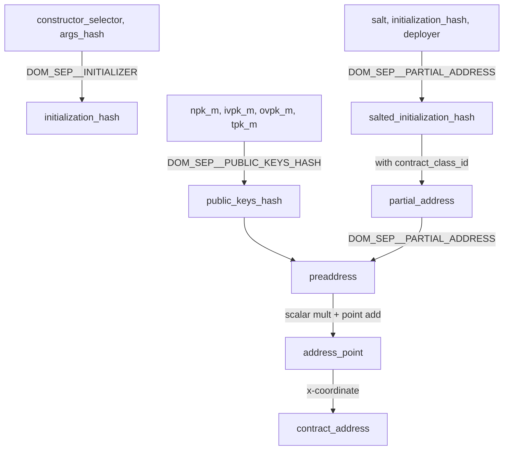
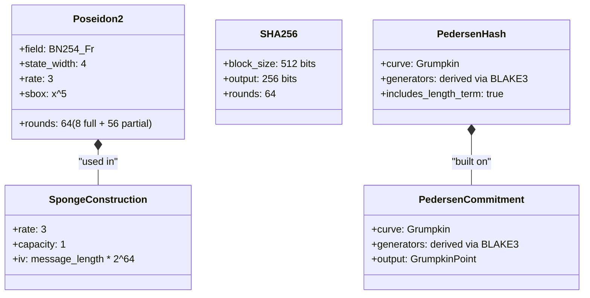

# Cryptographic Primitives

## Overview

This specification defines the cryptographic hash functions, commitment schemes, nullifier derivation algorithms, and Merkle tree hashing used throughout the Aztec protocol. These primitives are the foundation of the protocol's state integrity, privacy, and verifiability guarantees.

Aztec uses three primary hash functions:

- **Poseidon2** — the default SNARK-friendly hash used for nearly all in-circuit hashing: Merkle trees, note commitments, nullifier siloing, address derivation, and protocol structure hashing.
- **SHA-256** — used where Ethereum compatibility or out-of-circuit hashing is needed: L2-to-L1 message hashes, artifact hashes, and the L1-to-L2 message tree.
- **Pedersen** — a Grumpkin-curve commitment scheme available for application use; not used in current protocol-level operations.

Changing any parameter, domain separator, or algorithmic detail described here would cause alternative implementations to produce different state roots.

## Requirements

### R1: Deterministic Hash Outputs

All implementations MUST produce identical hash outputs for identical inputs across every execution context (Noir circuits, native C++, TypeScript/WASM, Solidity). Any divergence causes state root mismatch and chain fork.

**Rationale:** The protocol relies on hash consistency across client-side proving (PXE), sequencer execution, prover computation, and L1 verification.

### R2: Domain Separation

Every distinct protocol hashing operation MUST use a unique domain separator to prevent cross-context hash collisions. Two different protocol operations MUST NOT hash the same input to the same output.

**Rationale:** Without domain separation, an attacker could construct a value that is valid in two different contexts (e.g., a note hash that is also a valid nullifier), breaking protocol integrity.

### R3: SNARK Efficiency

Hash functions used inside circuits MUST be efficient to prove in the UltraHonk proof system over BN254. The protocol MUST prefer Poseidon2 for all in-circuit operations unless external compatibility requires otherwise.

**Rationale:** Hash function cost dominates circuit size. Poseidon2 is designed for arithmetic circuits over prime fields and requires orders of magnitude fewer constraints than SHA-256 or Keccak in a SNARK.

### R4: Collision Resistance

All hash functions used in the protocol MUST provide at least 128 bits of collision resistance.

**Rationale:** The protocol stores commitments and nullifiers in Merkle trees. A collision would allow an attacker to create two distinct preimages that map to the same tree leaf, enabling double-spends or state corruption.

### R5: Preimage Resistance

Hash functions used for nullifier derivation and commitment schemes MUST be preimage-resistant. Given a nullifier, it MUST be computationally infeasible to recover the note hash or secret key used to derive it.

**Rationale:** Preimage resistance is what prevents observers from linking nullifiers to note hashes, which is essential for transaction privacy.

### R6: Pseudo-randomness

Poseidon2 is assumed to be a pseudo-random function (PRF). Protocol operations that rely on this assumption include: Fiat-Shamir challenge generation, expanding a random seed to derive master secret keys, and nullifier derivation (where the output must be indistinguishable from random to prevent linkage).

**Rationale:** If the hash output were distinguishable from random, an observer could potentially link nullifiers to their originating note hashes or deduce relationships between derived keys, breaking privacy guarantees.

## Specification

### Finite Field

All field arithmetic in the protocol operates over the BN254 scalar field:

| Parameter | Value |
|-----------|-------|
| Field modulus _p_ | 21888242871839275222246405745257275088548364400416034343698204186575808495617 |
| Field modulus (hex) | 0x30644E72E131A029B85045B68181585D2833E84879B9709143E1F593F0000001 |
| Bit size | 254 bits |

All `Field` values throughout the protocol are elements of this field. Values MUST satisfy `0 <= v < p`.

### Poseidon2

Poseidon2 is the primary hash function for all in-circuit protocol operations. The Aztec protocol uses a specific instantiation over the BN254 scalar field as defined in [Grassi et al., 2023](https://eprint.iacr.org/2023/323).

#### Parameters

| Parameter | Value |
|-----------|-------|
| Field | BN254 scalar field (Fr) |
| State width (_t_) | 4 |
| S-box degree (_d_) | 5 (x^5) |
| External (full) rounds (_R_F_) | 8 (4 before + 4 after partial rounds) |
| Internal (partial) rounds (_R_P_) | 56 |
| Total rounds | 64 |
| Security level | 128 bits |
| Rate (sponge mode) | 3 field elements |
| Capacity (sponge mode) | 1 field element |

#### Permutation

The Poseidon2 permutation transforms a 4-element state vector `[s_0, s_1, s_2, s_3]` through 64 rounds:

```
function poseidon2_permutation(state: [Field; 4]) -> [Field; 4]:
    // Initial linear layer
    state = external_matrix_multiply(state)

    // First 4 external rounds
    for r in 0..4:
        state = add_round_constants(state, round_constants[r])
        state = apply_sbox_all(state)          // x^5 to all 4 elements
        state = external_matrix_multiply(state)

    // 56 internal rounds
    for r in 4..60:
        state[0] += round_constants[r][0]       // constant added to first element only
        state[0] = state[0]^5                   // S-box on first element only
        state = internal_matrix_multiply(state)

    // Last 4 external rounds
    for r in 60..64:
        state = add_round_constants(state, round_constants[r])
        state = apply_sbox_all(state)
        state = external_matrix_multiply(state)

    return state
```

##### External Matrix

The external (full round) MDS matrix is a fixed 4x4 matrix. Multiplication is computed as:

```
function external_matrix_multiply(state: [Field; 4]) -> [Field; 4]:
    let t0 = state[0] + state[1]    // a + b
    let t1 = state[2] + state[3]    // c + d
    let t2 = 2 * state[1] + t1      // 2b + c + d
    let t3 = 2 * state[3] + t0      // a + b + 2d
    let t4 = 4 * t1 + t3            // a + b + 4c + 6d
    let t5 = 4 * t0 + t2            // 5a + 6b + c + d... (see below)
    let t6 = t3 + t5                 // ...
    let t7 = t2 + t4                 // ...
    return [t6, t5, t7, t4]
```

This corresponds to the matrix:

```
| 5  7  1  3 |
| 4  6  1  1 |
| 1  3  5  7 |
| 1  1  4  6 |
```

##### Internal Matrix

The internal (partial round) matrix is a diagonal matrix optimized for efficient computation. Given diagonal values `D = [D_0, D_1, D_2, D_3]`:

```
function internal_matrix_multiply(state: [Field; 4]) -> [Field; 4]:
    let sum = state[0] + state[1] + state[2] + state[3]
    for i in 0..4:
        state[i] = state[i] * INTERNAL_DIAG[i] + sum
    return state
```

Where `INTERNAL_DIAG` stores `D_i - 1` for each element:

| Index | D_i - 1 (hex) |
|-------|---------------|
| 0 | 0x10dc6e9c006ea38b04b1e03b4bd9490c0d03f98929ca1d7fb56821fd19d3b6e7 |
| 1 | 0x0c28145b6a44df3e0149b3d0a30b3bb599df9756d4dd9b84a86b38cfb45a740b |
| 2 | 0x00544b8338791518b2c7645a50392798b21f75bb60e3596170067d00141cac15 |
| 3 | 0x222c01175718386f2e2e82eb122789e352e105a3b8fa852613bc534433ee428b |

##### Round Constants

There are 64 rounds, each with up to 4 constants. External rounds (0-3 and 60-63) use all 4 constants; internal rounds (4-59) use only the first constant. Round constants are generated using the Grain-128 LFSR seeded with the Poseidon2 parameters (field size, S-box degree, state width, round counts). Implementations MUST use the exact constants from the reference implementation.

**First-round constants (for cross-implementation verification):**

| Element | Value (hex) |
|---------|-------------|
| `rc[0][0]` | 0x19b849f69450b06848da1d39bd5e4a4302bb86744edc26238b0878e269ed23e5 |
| `rc[0][1]` | 0x265ddfe127dd51bd7239347b758f0a1320eb2cc7450acc1dad47f80c8dcf34d6 |
| `rc[0][2]` | 0x199750ec472f1809e0f66a545e1e51624108ac845015c2aa3dfc36bab497d8aa |
| `rc[0][3]` | 0x157ff3fe65ac7208110f06a5f74302b14d743ea25067f0ffd032f787c7f1cdf8 |

**Test vector** — `poseidon2_permutation([0, 1, 2, 3])`:

| Output index | Value (hex) |
|------|-------------|
| 0 | 0x01bd538c2ee014ed5141b29e9ae240bf8db3fe5b9a38629a9647cf8d76c01737 |
| 1 | 0x239b62e7db98aa3a2a8f6a0d2fa1709e7a35959aa6c7034814d9daa90cbac662 |
| 2 | 0x04cbb44c61d928ed06808456bf758cbf0c18d1e15a7b6dbc8245fa7515d5e3cb |
| 3 | 0x2e11c5cff2a22c64d01304b778d78f6998eff1ab73163a35603f54794c30847a |

#### Sponge Construction

Variable-length hashing uses a sponge construction built on the Poseidon2 permutation.

**Initialization:**

```
function poseidon2_sponge_new(message_length: u32) -> Sponge:
    let iv = message_length * 2^64
    return Sponge {
        state: [0, 0, 0, iv],    // IV stored in capacity element
        cache: [0, 0, 0],
        cache_size: 0,
    }
```

The initial vector (IV) encodes the message length in the capacity element as `message_length * 2^64`. This binds the hash to the declared message length.

**Absorb:**

```
function absorb(sponge, input: Field):
    if sponge.cache_size == 3:      // cache full (rate = 3)
        for i in 0..3:
            sponge.state[i] += sponge.cache[i]
        sponge.state = poseidon2_permutation(sponge.state)
        sponge.cache[0] = input
        sponge.cache_size = 1
    else:
        sponge.cache[sponge.cache_size] = input
        sponge.cache_size += 1
```

**Squeeze:**

```
function squeeze(sponge) -> Field:
    // Absorb remaining cache (zero-padded)
    for i in 0..sponge.cache_size:
        sponge.state[i] += sponge.cache[i]
    sponge.state = poseidon2_permutation(sponge.state)
    return sponge.state[0]
```

#### Hash Functions

The protocol defines several Poseidon2-based hash functions. All are built on the sponge construction above.

##### `poseidon2_hash(inputs: [Field; N]) -> Field`

Hash a fixed-length array of field elements:

```
function poseidon2_hash(inputs: [Field; N]) -> Field:
    let sponge = poseidon2_sponge_new(N)
    for i in 0..N:
        absorb(sponge, inputs[i])
    return squeeze(sponge)
```

##### `poseidon2_hash_with_separator(inputs: [Field; N], separator: u32) -> Field`

Hash with a domain separator prepended:

```
function poseidon2_hash_with_separator(inputs: [Field; N], separator: u32) -> Field:
    return poseidon2_hash([separator as Field] ++ inputs)
```

The separator is converted to a field element and prepended to the input array. The total message length is `N + 1`, which affects the IV.

##### `poseidon2_hash_subarray(input: [Field; N], in_len: u32) -> Field`

Hash a variable-length prefix of a fixed-size array:

```
function poseidon2_hash_subarray(input: [Field; N], in_len: u32) -> Field:
    let sponge = poseidon2_sponge_new(in_len)
    for i in 0..N:
        if i < in_len:
            absorb(sponge, input[i])
    return squeeze(sponge)
```

Only the first `in_len` elements are absorbed. The IV uses `in_len` (not `N`).

##### `poseidon2_hash_bytes(inputs: [u8; N]) -> Field`

Hash a byte array by packing into field elements (31 bytes per field):

```
function poseidon2_hash_bytes(inputs: [u8; N]) -> Field:
    let fields = []
    for each 31-byte chunk of inputs:
        fields.push(field_from_bytes(chunk, big_endian=false))
    return poseidon2_hash(fields)
```

Bytes are packed into field elements 31 at a time (to fit within the 254-bit field). The last chunk is zero-padded if needed.

### SHA-256

SHA-256 is used where Ethereum compatibility is required or where hashing occurs outside circuits.

The protocol uses standard SHA-256 as specified in [NIST FIPS 180-4](https://csrc.nist.gov/publications/detail/fips/180/4/final), with specific truncation rules when the output must fit in a field element.

#### `sha256_to_field(bytes: [u8; N]) -> Field`

Compute SHA-256 and truncate to fit the BN254 field:

```
function sha256_to_field(bytes: [u8; N]) -> Field:
    let digest: [u8; 32] = sha256(bytes)
    // Interpret first 31 bytes as big-endian integer (truncate last byte)
    return field_from_bytes_32_trunc(digest)
```

The truncation discards the least significant byte of the 32-byte SHA-256 digest, producing a 248-bit value that always fits in the BN254 field. The first byte of the result is always 0x00.

#### `accumulate_sha256(left: Field, right: Field) -> Field`

Hash two field elements using SHA-256 (used for SHA-based Merkle trees):

```
function accumulate_sha256(left: Field, right: Field) -> Field:
    let left_bytes: [u8; 32] = left.to_be_bytes()
    let right_bytes: [u8; 32] = right.to_be_bytes()
    return sha256_to_field(left_bytes ++ right_bytes)
```

### Pedersen Hash and Commitment

Pedersen hashing and commitments operate over the Grumpkin embedded curve.

#### Grumpkin Curve

| Parameter | Value |
|-----------|-------|
| Base field | BN254 scalar field Fr (same as the protocol's Field) |
| Scalar field | BN254 base field Fq = 0x30644E72E131A029B85045B68181585D97816A916871CA8D3C208C16D87CFD47 |
| Curve equation | y^2 = x^3 - 17 |
| Generator G | (1, 0x11b2dff1448c41d823d3446f21c77dc3aa7b8cf435dfafbb14b34cf69dc25d68) |

Grumpkin is an embedded curve — its base field equals BN254's scalar field, making operations on Grumpkin points efficient within BN254 circuits.

#### Generator Derivation

Pedersen generators are derived deterministically using BLAKE3 hash-to-curve:

```
function derive_generator(domain_separator: string, index: u32) -> GrumpkinPoint:
    let domain_hash = blake3(domain_separator)
    let preimage = domain_hash ++ big_endian_bytes(index, 4)
    for count in 0, 1, 2, ...:
        let hash1 = blake3(preimage ++ [count])
        let hash2 = blake3(preimage ++ [count + 1])
        // Combine into 512-bit value and reduce mod base_field
        let x = (hash1 ++ hash2) mod Fq
        if x^3 - 17 is a quadratic residue:
            let y = sqrt(x^3 - 17)
            // Adjust y parity to match MSB of hash2
            return (x, y)  // with parity adjustment
```

The default domain separator is `"DEFAULT_DOMAIN_SEPARATOR"`.

#### Pedersen Commitment

```
function pedersen_commit(values: [Field; N], generators: [GrumpkinPoint; N]) -> GrumpkinPoint:
    return values[0] * generators[0] + values[1] * generators[1] + ... + values[N-1] * generators[N-1]
```

#### Pedersen Hash

```
function pedersen_hash(values: [Field; N]) -> Field:
    let H_len = derive_generator("pedersen_hash_length", 0)
    let commitment = pedersen_commit(values, default_generators)
    let result_point = N * H_len + commitment
    return result_point.x    // x-coordinate only
```

The length generator `H_len` is derived with domain separator `"pedersen_hash_length"`. Multiplying by the input length prevents length-extension attacks and trivial collisions from elliptic curve point negation symmetry.

### Domain Separation

Every protocol hashing operation uses a domain separator to prevent cross-context collisions. Domain separators are `u32` constants prepended to Poseidon2 inputs via `poseidon2_hash_with_separator`.

#### Generation

Domain separators are derived deterministically:

```
function derive_domain_separator(name: string) -> u32:
    let full_string = "az_dom_sep__" ++ name
    let hash = poseidon2_hash_bytes(full_string.as_bytes())
    return hash mod 2^32
```

This ensures all separators are unique and collision-resistant. Uniqueness is verified by tests.

#### Complete Reference

Domain separators are defined in Spec #2 (Constants), section "Generator Indices (Domain Separators)." The following table summarizes the separators referenced by this specification:

| Constant | Value | Usage |
|----------|-------|-------|
| `DOM_SEP__SILOED_NOTE_HASH` | 3361878420 | Silo note hash to contract address |
| `DOM_SEP__UNIQUE_NOTE_HASH` | 226850429 | Make note hash globally unique |
| `DOM_SEP__NOTE_HASH_NONCE` | 1721808740 | Derive note nonce from first nullifier |
| `DOM_SEP__SILOED_NULLIFIER` | 57496191 | Silo nullifier to contract address |
| `DOM_SEP__PRIVATE_LOG_FIRST_FIELD` | 2769976252 | Silo private log first field |
| `DOM_SEP__PUBLIC_LEAF_SLOT` | 1247650290 | Derive public data tree slot |
| `DOM_SEP__CONTRACT_ADDRESS_V1` | 1788365517 | Derive contract address preaddress |
| `DOM_SEP__PARTIAL_ADDRESS` | 2103633018 | Derive partial address |
| `DOM_SEP__PUBLIC_KEYS_HASH` | 777457226 | Hash public keys |
| `DOM_SEP__CONTRACT_CLASS_ID` | 3923495515 | Derive contract class ID |
| `DOM_SEP__PRIVATE_FUNCTION_LEAF` | 1389398688 | Hash private function leaf |
| `DOM_SEP__PUBLIC_BYTECODE` | 260313585 | Hash public bytecode |
| `DOM_SEP__INITIALIZER` | 385396519 | Hash initialization data |
| `DOM_SEP__TX_REQUEST` | 3763737512 | Hash transaction request |
| `DOM_SEP__BLOCK_HEADER_HASH` | 4195546849 | Hash block header |
| `DOM_SEP__FUNCTION_ARGS` | 3576554347 | Hash function arguments |
| `DOM_SEP__PUBLIC_CALLDATA` | 2760353947 | Hash public calldata |
| `DOM_SEP__NHK_M` | 242137788 | Derive nullifier hiding key |
| `DOM_SEP__IVSK_M` | 2747825907 | Derive incoming viewing secret key |
| `DOM_SEP__OVSK_M` | 4272201051 | Derive outgoing viewing secret key |
| `DOM_SEP__TSK_M` | 1546190975 | Derive tagging secret key |
| `DOM_SEP__NOTE_HASH` | 116501019 | Application-level note hash |
| `DOM_SEP__NOTE_NULLIFIER` | 50789342 | Application-level note nullifier |
| `DOM_SEP__MESSAGE_NULLIFIER` | 3754509616 | L1-to-L2 message nullifier |

For the full list, see Spec #2: Constants.

### Merkle Tree Hashing

The protocol uses Merkle trees to commit to collections of state elements. Tree heights and subtree parameters are defined in Spec #2: Constants.

#### Default Merkle Hash

The default internal node hash for Merkle trees is Poseidon2:

```
function merkle_hash(left: Field, right: Field) -> Field:
    return poseidon2_hash([left, right])
```

This is used for: Archive Tree, Note Hash Tree, Nullifier Tree, Public Data Tree, VK Tree, and Function Tree.

#### SHA Merkle Hash

The L1-to-L2 Message Tree uses SHA-256 for internal nodes:

```
function sha_merkle_hash(left: Field, right: Field) -> Field:
    return accumulate_sha256(left, right)
```

#### Root from Sibling Path

Membership proofs reconstruct the root from a leaf and sibling path:

```
function root_from_sibling_path(
    leaf: Field,
    leaf_index: Field,
    sibling_path: [Field; TREE_HEIGHT],
    hasher: (Field, Field) -> Field = merkle_hash,
) -> Field:
    let node = leaf
    let bits = leaf_index.to_le_bits(TREE_HEIGHT)
    for i in 0..TREE_HEIGHT:
        if bits[i] == 1:
            node = hasher(sibling_path[i], node)    // leaf is right child
        else:
            node = hasher(node, sibling_path[i])    // leaf is left child
    return node
```

The `leaf_index` is decomposed into little-endian bits. At each level, bit `i` determines whether the current node is the left child (bit=0) or right child (bit=1).

#### Empty Tree Root

An empty tree of height `H` has all leaves equal to 0. Its root is computed iteratively:

```
function compute_empty_tree_root(height: u32, hasher) -> Field:
    let hash = 0    // empty leaf
    for i in 0..height:
        hash = hasher(hash, hash)
    return hash
```

**Test vectors (Poseidon2 hasher):**

| Height | Empty root (hex) |
|--------|-----------------|
| 0 | 0x0 |
| 1 | 0x0b63a53787021a4a962a452c2921b3663aff1ffd8d5510540f8e659e782956f1 |
| 2 | 0x0e34ac2c09f45a503d2908bcb12f1cbae5fa4065759c88d501c097506a8b2290 |
| 6 | 0x01c28fe1059ae0237b72334700697bdf465e03df03986fe05200cadeda66bd76 |
| 10 | 0x2a775ea761d20435b31fa2c33ff07663e24542ffb9e7b293dfce3042eb104686 |

**Test vector (Poseidon2, full 16-leaf tree with leaves [1..16]):**

Root = `0x1528946361c480e8dc1e9ae3f8c31c997625fa1ddeddc7db5ad0dce3ac58fc4c`

**Test vector (SHA-256, full 16-leaf tree with leaves [1..16]):**

Root = `0x00b007869b8a5e2a9b3b580a318e702cea04b2f5438f2e26743f545e4d1ecbdb`

### Note Hash Derivation

Notes progress through a three-layer hashing pipeline that adds contract scoping and global uniqueness. Each layer uses Poseidon2 with a distinct domain separator.


#### Layer 1: Inner Note Hash

The inner note hash is application-specific. Contracts compute it from note contents (amount, owner, randomness, etc.). The protocol does not prescribe the internal structure of notes.

#### Layer 2: Siloed Note Hash

Siloing scopes a note hash to its originating contract, preventing cross-contract interference:

```
siloed_note_hash = poseidon2_hash_with_separator(
    [contract_address, inner_note_hash],
    DOM_SEP__SILOED_NOTE_HASH
)
```

#### Layer 3: Unique Note Hash

Uniqueness prevents "faerie gold" attacks where a malicious sender creates duplicate note hashes (only one of which could be nullified):

```
note_nonce = poseidon2_hash_with_separator(
    [first_nullifier_in_tx, note_index_in_tx],
    DOM_SEP__NOTE_HASH_NONCE
)

unique_note_hash = poseidon2_hash_with_separator(
    [note_nonce, siloed_note_hash],
    DOM_SEP__UNIQUE_NOTE_HASH
)
```

The `first_nullifier_in_tx` is the protocol nullifier (derived from the transaction request hash) or the first user-emitted nullifier. Since all nullifiers are globally unique, combining a unique nullifier with an in-transaction index produces a unique nonce.

**Test vector:**

| Input | Value |
|-------|-------|
| inner_note_hash | 1 |
| contract_address | 2 |
| first_nullifier | 3 |
| note_index_in_tx | 4 |

| Output | Value (hex) |
|--------|-------------|
| siloed_note_hash | 0x1986a4bea3eddb1fff917d629a13e10f63f514f401bdd61838c6b475db949169 |
| note_nonce | 0x28e7799791bf066a57bb51fdd0fbcaf3f0926414314c7db515ea343f44f5d58b |
| unique_note_hash | 0x29949aef207b715303b24639737c17fbfeb375c1d965ecfa85c7e4f0febb7d16 |

### Nullifier Derivation

#### Siloed Nullifier

Nullifiers are scoped to their originating contract using the same siloing pattern as note hashes:

```
siloed_nullifier = poseidon2_hash_with_separator(
    [contract_address, inner_nullifier],
    DOM_SEP__SILOED_NULLIFIER
)
```

The inner nullifier is computed by the application contract, typically as a hash of the note hash and the owner's nullifier secret key.

**Test vector:**

| Input | Value |
|-------|-------|
| contract_address | 123 |
| inner_nullifier | 456 |
| siloed_nullifier | 0x169b50336c1f29afdb8a03d955a81e485f5ac7d5f0b8065673d1e407e5877813 |

#### Protocol Nullifier

Every transaction has at least one nullifier — the protocol nullifier. It prevents transaction replay:

```
protocol_nullifier = hash(tx_request)
```

Where `tx_request` is hashed using `poseidon2_hash_with_separator` with `DOM_SEP__TX_REQUEST`. The protocol nullifier is assigned side-effect counter 1 and is scoped to `NULL_MSG_SENDER_CONTRACT_ADDRESS` (field element -1). See Spec #2 for the exact constant value.

#### Application-Level Nullifier Key Derivation

Applications derive nullifier keys per-contract from a master key:

```
app_nullifier_key = poseidon2_hash_with_separator(
    [master_nhk.hi, master_nhk.lo, contract_address],
    DOM_SEP__NHK_M
)
```

Where `master_nhk` is a Grumpkin scalar split into high and low 128-bit limbs.

### Indexed Merkle Tree Leaf Hashing

The Nullifier Tree and Public Data Tree use indexed Merkle trees (also known as sorted Merkle trees). Each leaf stores pointers to maintain a sorted linked list within the tree.

#### Nullifier Tree Leaf

```
NullifierLeafPreimage {
    nullifier: Field,
    next_nullifier: Field,
    next_index: Field,
}
```

The leaf hash is:

```
function nullifier_leaf_hash(preimage: NullifierLeafPreimage) -> Field:
    if preimage.nullifier == 0 AND preimage.next_nullifier == 0 AND preimage.next_index == 0:
        return 0    // empty leaves hash to 0 for batch padding
    return poseidon2_hash([preimage.nullifier, preimage.next_nullifier, preimage.next_index])
```

Empty leaf preimages hash to 0 so that padding leaves in batch insertions do not alter the tree root.

#### Public Data Tree Leaf

```
PublicDataTreeLeafPreimage {
    slot: Field,
    value: Field,
    next_slot: Field,
    next_index: Field,
}
```

The leaf hash is:

```
function public_data_leaf_hash(preimage: PublicDataTreeLeafPreimage) -> Field:
    return poseidon2_hash([preimage.slot, preimage.value, preimage.next_slot, preimage.next_index])
```

**Test vector:**

| Input | Value |
|-------|-------|
| slot | 123 |
| value | 45 |
| next_slot | 67 |
| next_index | 890 |
| hash | 0x2efdfcfc865cbb7543183fae69374ee5106dde9741545afd2fbf12868b550614 |

#### Indexed Tree Non-Membership Proofs

To prove a key does not exist in an indexed tree, a prover supplies a "low leaf" — a leaf whose key is less than the target key and whose `next_key` is greater than the target key (or points to infinity):

```
function is_valid_low_leaf(key: Field, low_leaf: IndexedLeafPreimage) -> bool:
    let is_greater_than_low = low_leaf.key < key
    let is_less_than_next = key < low_leaf.next_key OR low_leaf.points_to_infinity()
    return is_greater_than_low AND is_less_than_next
```

A leaf "points to infinity" when both its `next_key` and `next_index` are 0, indicating it is the last leaf in the sorted order.

### Contract Address Derivation

Contract addresses are derived using Poseidon2 combined with Grumpkin elliptic curve operations:



#### Step-by-step

1. **Initialization hash:**
   ```
   initialization_hash = poseidon2_hash_with_separator(
       [constructor_selector, args_hash],
       DOM_SEP__INITIALIZER
   )
   ```

2. **Salted initialization hash:**
   ```
   salted_init_hash = poseidon2_hash_with_separator(
       [salt, initialization_hash, deployer_address],
       DOM_SEP__PARTIAL_ADDRESS
   )
   ```

3. **Partial address:**
   ```
   partial_address = poseidon2_hash_with_separator(
       [contract_class_id, salted_init_hash],
       DOM_SEP__PARTIAL_ADDRESS
   )
   ```

4. **Public keys hash:**
   ```
   public_keys_hash = poseidon2_hash_with_separator(
       [npk_m.x, npk_m.y, ivpk_m.x, ivpk_m.y, ovpk_m.x, ovpk_m.y, tpk_m.x, tpk_m.y],
       DOM_SEP__PUBLIC_KEYS_HASH
   )
   ```

5. **Preaddress:**
   ```
   preaddress = poseidon2_hash_with_separator(
       [public_keys_hash, partial_address],
       DOM_SEP__CONTRACT_ADDRESS_V1
   )
   ```

6. **Address point:**
   ```
   address_point = preaddress * G + ivpk_m
   ```
   Where `G` is the Grumpkin generator. If the resulting point has a negative y-coordinate (y > (p-1)/2), the point is negated to use the positive y.

7. **Contract address:**
   ```
   contract_address = address_point.x
   ```

### Contract Class ID

```
contract_class_id = poseidon2_hash_with_separator(
    [artifact_hash, private_functions_root, public_bytecode_commitment],
    DOM_SEP__CONTRACT_CLASS_ID
)
```

Where:
- `artifact_hash` is computed using SHA-256 (out of circuit)
- `private_functions_root` is a Poseidon2 Merkle tree of height `FUNCTION_TREE_HEIGHT` (7)
- `public_bytecode_commitment` is a Poseidon2 hash of the bytecode fields with `DOM_SEP__PUBLIC_BYTECODE`

#### Private Function Leaf

Each leaf in the private functions tree:

```
function_leaf = poseidon2_hash_with_separator(
    [function_selector, vk_hash],
    DOM_SEP__PRIVATE_FUNCTION_LEAF
)
```

#### Verification Key Hash

```
vk_hash = poseidon2_hash(vk_fields)
```

VK hashes use plain `poseidon2_hash` without a domain separator.

### L2-to-L1 Message Hash

L2-to-L1 messages are hashed using SHA-256 for Ethereum compatibility:

```
function compute_l2_to_l1_message_hash(
    contract_address: Field,
    rollup_version_id: Field,
    recipient: EthAddress,     // 20 bytes
    chain_id: Field,
    content: Field,
) -> Field:
    let bytes: [u8; 148] = concat(
        contract_address.to_be_bytes(32),     // bytes 0-31
        rollup_version_id.to_be_bytes(32),    // bytes 32-63
        recipient.to_be_bytes(20),            // bytes 64-83
        chain_id.to_be_bytes(32),             // bytes 84-115
        content.to_be_bytes(32),              // bytes 116-147
    )
    return sha256_to_field(bytes)
```

**Test vector:**

| Input | Value |
|-------|-------|
| contract_address | 3 |
| rollup_version_id | 4 |
| recipient | 1 (as EthAddress) |
| chain_id | 5 |
| content | 2 |
| hash | 0x0081edf209e087ad31b3fd24263698723d57190bd1d6e9fe056fc0c0a68ee661 |

### Block Header Hash

Block headers are hashed for inclusion in the Archive Tree:

```
block_header_hash = poseidon2_hash_with_separator(
    [last_archive.root,
     last_archive.next_available_leaf_index,
     note_hash_tree.root,
     note_hash_tree.next_available_leaf_index,
     nullifier_tree.root,
     nullifier_tree.next_available_leaf_index,
     public_data_tree.root,
     public_data_tree.next_available_leaf_index,
     sponge_blob_hash,
     ...global_variables_fields,
     total_fees,
     total_mana_used],
    DOM_SEP__BLOCK_HEADER_HASH
)
```

The exact serialization order matches the `BLOCK_HEADER_LENGTH` (22 fields) defined in Spec #2.

### Transaction Request Hash

```
tx_request_hash = poseidon2_hash_with_separator(
    [origin,
     args_hash,
     chain_id,
     version,
     ...gas_settings_fields,    // 8 fields
     function_selector,
     is_private,
     salt],
    DOM_SEP__TX_REQUEST
)
```

The total input is `TX_REQUEST_LENGTH` (15) fields. The result is used as the protocol nullifier value.

### Function Arguments Hash

```
args_hash = poseidon2_hash_with_separator(args, DOM_SEP__FUNCTION_ARGS)
```

If `args` is empty, `args_hash = 0` (by convention, not by hashing an empty array).

### Public Data Leaf Slot

Public storage slots are siloed to prevent cross-contract interference:

```
leaf_slot = poseidon2_hash_with_separator(
    [contract_address, storage_slot],
    DOM_SEP__PUBLIC_LEAF_SLOT
)
```

### Key Derivation

Master keys are derived using SHA-512 reduced to a Grumpkin scalar:

```
function derive_master_key(secret_key: Field, domain_separator: u32) -> GrumpkinScalar:
    let hash = sha512([secret_key, domain_separator])
    return hash mod grumpkin_scalar_field_order
```

| Key Type | Domain Separator |
|----------|-----------------|
| Nullifier hiding key (nhk_m) | `DOM_SEP__NHK_M` |
| Incoming viewing secret key (ivsk_m) | `DOM_SEP__IVSK_M` |
| Outgoing viewing secret key (ovsk_m) | `DOM_SEP__OVSK_M` |
| Tagging secret key (tsk_m) | `DOM_SEP__TSK_M` |

Master public keys are derived by scalar multiplication with the Grumpkin generator:

```
npk_m  = nhk_m  * G
ivpk_m = ivsk_m * G
ovpk_m = ovsk_m * G
tpk_m  = tsk_m  * G
```

### AVM Cryptographic Opcodes

The AVM exposes the Poseidon2 permutation, SHA-256 compression, Keccak-f[1600], and Grumpkin point addition as opcodes. These are low-level primitives; higher-level constructions (sponge hashing, Merkle proofs) are built in AVM bytecode.

| Opcode | Code | Operation | Input | Output | L2 Gas |
|--------|------|-----------|-------|--------|--------|
| POSEIDON2 | 0x3F | Poseidon2 permutation | 4 Field elements | 4 Field elements | 360 |
| SHA256COMPRESSION | 0x40 | SHA-256 compression | 8 u32 state + 16 u32 block | 8 u32 state | 12288 |
| KECCAKF1600 | 0x41 | Keccak-f[1600] permutation | 25 u64 elements | 25 u64 elements | 58176 |
| ECADD | 0x42 | Grumpkin point addition | 2 points (x, y, is_infinite) | 1 point | 270 |

The POSEIDON2 opcode applies a single permutation (not the full sponge). Contracts that need variable-length hashing MUST implement the sponge construction in AVM bytecode using this opcode.

## Data Structures

### Hash Function Summary



### Merkle Tree Hash Assignments

| Tree | Hash Function | Leaf Type | Height |
|------|--------------|-----------|--------|
| Archive | Poseidon2 | Block header hash (Field) | 30 |
| Note Hash | Poseidon2 | Unique note hash (Field) | 42 |
| Nullifier | Poseidon2 | NullifierLeafPreimage hash (Field) | 42 |
| Public Data | Poseidon2 | PublicDataTreeLeafPreimage hash (Field) | 40 |
| L1-to-L2 Message | SHA-256 (truncated) | Message hash (Field) | 36 |
| VK Tree | Poseidon2 | VK hash (Field) | 7 |
| Function Tree | Poseidon2 | Function leaf hash (Field) | 7 |

### Indexed Tree Leaf Structures

| Field | NullifierLeafPreimage | PublicDataTreeLeafPreimage |
|-------|----------------------|---------------------------|
| Key | `nullifier: Field` | `slot: Field` |
| Value | _(key is the value)_ | `value: Field` |
| Next key | `next_nullifier: Field` | `next_slot: Field` |
| Next index | `next_index: Field` | `next_index: Field` |
| Leaf hash | `poseidon2_hash([nullifier, next_nullifier, next_index])` | `poseidon2_hash([slot, value, next_slot, next_index])` |
| Points to infinity | `next_nullifier == 0 AND next_index == 0` | `next_slot == 0 AND next_index == 0` |

## Validation Rules

### V1: Hash Output Range

All hash outputs used as field elements MUST satisfy `0 <= output < p` where `p` is the BN254 scalar field modulus. SHA-256 outputs MUST be truncated via `sha256_to_field` before use as field elements.

### V2: Domain Separator Uniqueness

Each protocol hashing operation MUST use a distinct domain separator. Implementations MUST reject any configuration where two distinct operations share a domain separator value.

### V3: Merkle Proof Verification

A membership proof is valid if and only if reconstructing the root from the leaf, sibling path, and leaf index using the correct hash function produces the expected root. Implementations MUST use the hash function assigned to the tree type (Poseidon2 for all trees except L1-to-L2 Message Tree which uses SHA-256).

### V4: Indexed Tree Leaf Validity

When inserting into an indexed Merkle tree, implementations MUST verify:

1. The low leaf exists in the tree (membership proof against current root)
2. `low_leaf.key < new_key` (the new key is greater than the low leaf)
3. `new_key < low_leaf.next_key` OR `low_leaf.points_to_infinity()` (the new key fits in the gap)
4. The low leaf is updated to point to the new leaf
5. The new leaf is created with pointers copied from the low leaf's old next pointers

### V5: Note Hash Uniqueness

After siloing and uniqueness injection, every unique note hash in the Note Hash Tree MUST be globally unique. Implementations MUST verify that:
- The `first_nullifier_in_tx` used for nonce derivation is itself unique (guaranteed by the nullifier tree)
- The `note_index_in_tx` is a valid index within the transaction's note hash array

### V6: Nullifier Siloing

All nullifiers inserted into the Nullifier Tree MUST be siloed with their originating contract address. The protocol nullifier is siloed with `NULL_MSG_SENDER_CONTRACT_ADDRESS`.

### V7: Empty Leaf Handling

In the Nullifier Tree, empty leaf preimages (all fields zero) MUST hash to 0. This allows batch insertion with zero-padding without altering the tree root. In the Public Data Tree, empty leaf preimages hash to a non-zero value and are never inserted.

### V8: Poseidon2 IV Encoding

The Poseidon2 sponge IV MUST encode the message length as `message_length * 2^64` in `state[3]`. This binds the hash to the declared input length, preventing length-confusion attacks.

## Security Considerations

### Poseidon2 Security Margin

The Poseidon2 instantiation uses 8 full rounds and 56 partial rounds, which includes a 7.5% security margin over the minimum rounds required for 128-bit security (+2 full rounds, factor of 1.075 for partial rounds). The security analysis considers interpolation attacks, Grobner basis attacks, and differential/linear cryptanalysis as described in the Poseidon2 paper.

### SHA-256 Truncation

SHA-256 outputs are truncated from 256 bits to 248 bits (31 bytes) when converted to field elements. This reduces collision resistance from 128 bits to 124 bits, which remains within acceptable security margins. The truncation is necessary because the BN254 field modulus is 254 bits, and a full 256-bit value could exceed the modulus.

### Indexed Tree Sorted Order Invariant

The indexed Merkle tree's security depends on maintaining the sorted linked list invariant. If a leaf's pointers are corrupted (e.g., `low_leaf.next_key < low_leaf.key`), non-membership proofs become unsound. Circuit validation MUST check pointer ordering during every insertion.

### Domain Separator Collision Risk

Domain separators are 32-bit values derived by hashing unique strings. With ~40 separators, the birthday bound gives negligible collision probability (~2^-23 for 40 values in 2^32 space). However, new separators MUST be tested for uniqueness against all existing values.

### Note Hash Uniqueness and Faerie Gold

Without uniqueness injection, an attacker could create two identical note hashes for a victim. The victim could only nullify one (since nullifiers must be unique), losing the value of the second note. The three-layer hashing pipeline (inner → siloed → unique) prevents this by ensuring every leaf in the Note Hash Tree is globally unique.

### Pseudo-randomness Assumption

The protocol assumes Poseidon2 behaves as a pseudo-random function (PRF). This assumption is critical for: nullifier unlinkability (nullifier outputs must be indistinguishable from random to prevent correlation with note hashes), master key derivation (expanding a single secret into multiple independent keys), and Fiat-Shamir challenge generation. If this assumption were violated, an adversary could potentially link nullifiers to their source notes or derive relationships between protocol keys.

## Open Questions

1. **Poseidon2 round constant generation**: Should the specification include the full Grain-128 LFSR algorithm for round constant generation, or is referencing the Sage script sufficient for reproducibility?

2. **Pedersen deprecation**: Pedersen hash and commitment are available in the Noir standard library but are not used in current protocol-level operations. Should they be formally deprecated for protocol use, or retained for potential future use?

3. **SHA-256 truncation method**: The current truncation drops the last byte of the SHA-256 digest. An alternative is to reduce modulo the field order. Should the spec mandate one approach or allow either?

4. **Keccak availability**: Keccak-f[1600] is available as an AVM opcode but is not used in any protocol-level hashing. Should it be listed as a protocol primitive or only as an AVM feature?

5. **Hash function migration path**: If a vulnerability is discovered in Poseidon2, what is the migration path? Tree heights and hash assignments are baked into circuit designs. A hash function change would require a full protocol upgrade.

## References

- **Poseidon2 Paper**: Grassi, L., Khovratovich, D., Rechberger, C., Roy, A., Schofnegger, M. "Poseidon2: A Faster Version of the Poseidon Hash Function." [ePrint 2023/323](https://eprint.iacr.org/2023/323)
- **SHA-256**: NIST FIPS 180-4, "Secure Hash Standard (SHS)"
- **BN254 Curve**: [EIP-197](https://eips.ethereum.org/EIPS/eip-197)
- **Grumpkin Curve**: Embedded curve over BN254's scalar field (y^2 = x^3 - 17)
- **Related Specifications**:
  - Spec #1: Protocol Overview & Architecture — High-level context for cryptographic usage
  - Spec #2: Constants — All domain separator values, tree heights, and protocol parameters
- **Source Files**:
  - `noir-projects/noir-protocol-circuits/crates/types/src/hash.nr` — Protocol hash functions
  - `noir-projects/noir-protocol-circuits/crates/types/src/poseidon2.nr` — Poseidon2 sponge
  - `noir-projects/noir-protocol-circuits/crates/types/src/merkle_tree/` — Merkle tree operations
  - `barretenberg/cpp/src/barretenberg/crypto/poseidon2/` — Native Poseidon2 implementation
  - `barretenberg/cpp/src/barretenberg/crypto/pedersen_hash/` — Native Pedersen implementation
  - `noir-projects/noir-protocol-circuits/crates/types/src/constants.nr` — Domain separators
