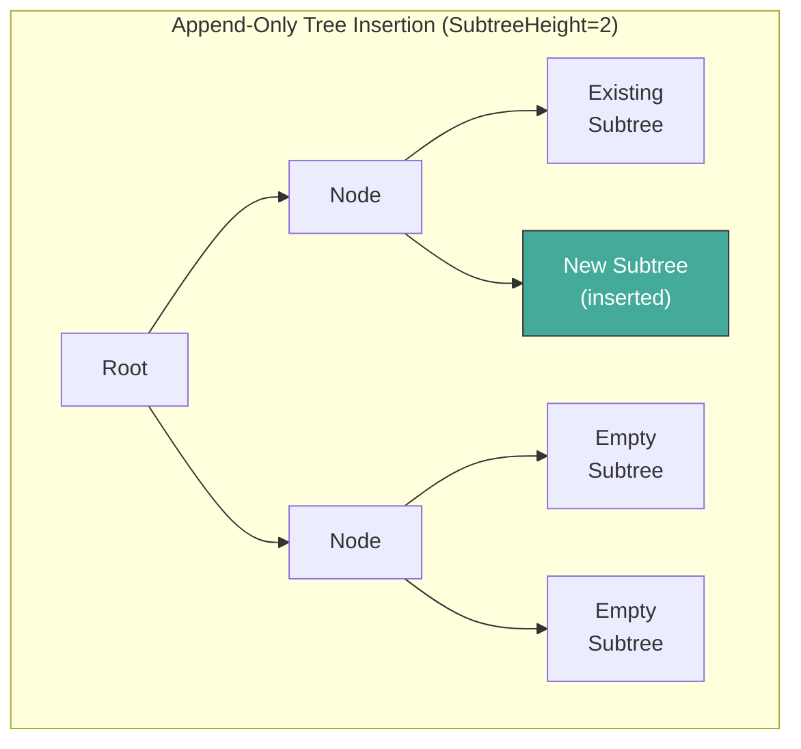
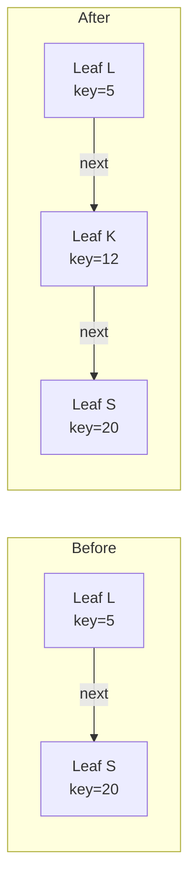
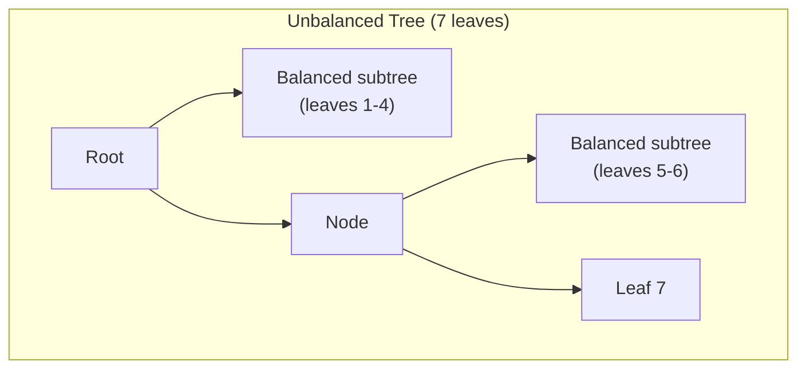
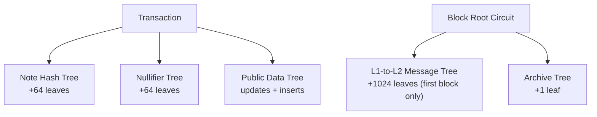
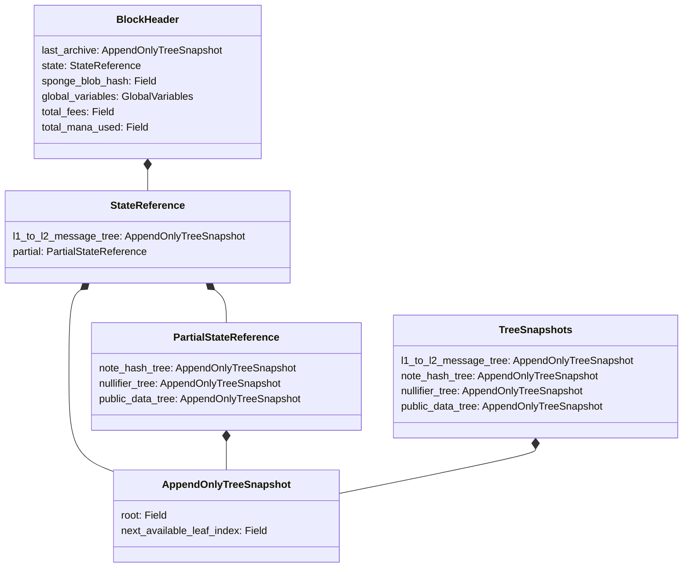

# State Model & Merkle Trees

## Overview

Aztec's global state is represented by five authenticated Merkle trees. Each tree commits to a different aspect of the protocol state, and their roots are included in every block header. Together, they enable:

- **Private state**: Note hashes and nullifiers allow creation and spending of encrypted UTXOs without revealing their contents.
- **Public state**: A key-value store for publicly readable contract storage.
- **Cross-chain messaging**: L1-to-L2 messages are committed on-chain and consumed privately on L2.
- **Chain history**: An archive of all block headers provides a commitment to the entire chain state.

This spec defines each tree's structure, leaf format, insertion algorithm, genesis state, and how tree roots are committed in block headers. It is the canonical reference for any implementation that must produce or verify state roots.

**Cross-references:** Spec #1 (Protocol Overview & Architecture) introduces the five trees conceptually. Spec #2 (Constants) defines all tree heights, subtree heights, and serialization lengths. Spec #3 (Cryptographic Primitives) specifies the hash functions, leaf hashing, and Merkle proof algorithms used by these trees.

## Requirements

### R1: Authenticated State

All protocol state MUST be committed via Merkle tree roots in the block header. Any state claim MUST be verifiable against the appropriate tree root using a Merkle membership proof.

**Rationale:** Authenticated state allows light clients and circuits to verify state without replaying the entire chain. It is fundamental to the privacy model, where proofs reference tree roots rather than plaintext state.

### R2: Append-Only Note Hashes

Note hashes MUST be stored in an append-only tree. Once inserted, a note hash MUST NOT be modified or removed. The tree MUST support efficient batch insertion of a fixed number of leaves per transaction.

**Rationale:** Append-only semantics ensure that existing Merkle proofs remain valid. Notes are consumed via nullifiers rather than deletion, preserving unlinkability between creation and spending.

### R3: Non-Membership Proofs for Nullifiers

The nullifier tree MUST support efficient non-membership proofs. A valid nullifier insertion MUST fail if the nullifier already exists in the tree. The tree MUST NOT support value updates after insertion.

**Rationale:** Nullifiers prevent double-spending. Non-membership proofs let circuits verify that a nullifier has not been emitted before, which is essential for private state transitions.

### R4: Key-Value Public State

The public data tree MUST support both insertion of new key-value pairs and updates to existing values. Reads MUST be provable via membership proofs. Non-existence of a slot MUST be provable via non-membership proofs.

**Rationale:** Public state requires mutable storage (unlike the append-only note hash tree). The indexed tree structure provides both membership and non-membership proofs while supporting updates.

### R5: Deterministic Genesis State

All implementations MUST produce identical genesis tree roots from the same initialization parameters. The genesis block header hash and archive root MUST match the canonical constants.

**Rationale:** Divergent genesis states would cause chain splits. Every node must begin from the same state.

### R6: Batch Insertion Efficiency

Trees MUST support batch insertion of subtrees at predetermined heights. Per-transaction insertions MUST be expressible as a single subtree insertion into the parent tree.

**Rationale:** Batch insertion avoids O(n) individual Merkle proof updates per transaction. By inserting a subtree root, the rollup circuit performs a constant number of hash operations regardless of how many leaves are in the batch.

## Specification

### Tree Types

The protocol maintains five Merkle trees. Each tree is identified by a numeric ID (defined in Spec #2: Constants):

| Tree | ID | Height | Hash Function | Type | Leaves Per Insertion |
|---|---|---|---|---|---|
| Nullifier | 0 | 42 | Poseidon2 | Indexed | 64 per tx |
| Note Hash | 1 | 42 | Poseidon2 | Append-only | 64 per tx |
| Public Data | 2 | 40 | Poseidon2 | Indexed | 64 per tx |
| L1-to-L2 Message | 3 | 36 | Poseidon2 | Append-only | 1024 per checkpoint |
| Archive | 4 | 30 | Poseidon2 | Append-only | 1 per block |

All five trees use Poseidon2 as the internal Merkle hash function: `merkle_hash(left, right) = poseidon2_hash([left, right])`.

There are two structural categories:

- **Append-only trees** store leaves sequentially. New leaves are always appended at the next available index. Existing leaves are never modified.
- **Indexed trees** maintain a sorted linked list within the tree. Each leaf contains pointers (`next_key`, `next_index`) to the next leaf in sorted order. This structure supports both membership and non-membership proofs, and (for the public data tree) value updates. Indexed trees are used instead of sparse Merkle trees to reduce tree height: a sparse tree would require a height of 254 (one level per bit of the key), whereas indexed trees support the same key space at much lower heights (40–42), yielding shorter membership and non-membership proofs.

There is also a third structural category used in the rollup proof tree (not for persistent state):

- **Unbalanced (wonky) trees** are variable-height Merkle trees that avoid empty-leaf padding. Given `N` leaves, an unbalanced tree decomposes `N` into descending powers of 2 (its binary representation), builds a balanced subtree for each power-of-2 group, and then combines these subtrees right-to-left into a single root. This produces the shallowest possible tree for `N` non-empty leaves. These trees are used within the rollup circuits to compute `out_hash` (L2-to-L1 messages, using SHA-256) and `block_headers_hash` (block header hashes, using Poseidon2) without requiring transactions or blocks to be padded to a power of 2.

### Tree Snapshots

Every tree reference in the protocol is represented as an `AppendOnlyTreeSnapshot`:

```
AppendOnlyTreeSnapshot {
    root: Field,
    next_available_leaf_index: Field,
}
```

The `root` is the current Merkle root. The `next_available_leaf_index` is the leaf index at which the next insertion will occur. For indexed trees, this also tracks how many leaves have been appended (even though the linked-list ordering is separate from the physical position).

The serialization length is `APPEND_ONLY_TREE_SNAPSHOT_LENGTH = 2`.

### State Groupings

The four mutable state trees (excluding the archive) are grouped into two structures:

**TreeSnapshots** — all four mutable state trees:

```
TreeSnapshots {
    l1_to_l2_message_tree: AppendOnlyTreeSnapshot,
    note_hash_tree: AppendOnlyTreeSnapshot,
    nullifier_tree: AppendOnlyTreeSnapshot,
    public_data_tree: AppendOnlyTreeSnapshot,
}
```

**PartialStateReference** — the three trees updated per transaction (excluding L1-to-L2 messages):

```
PartialStateReference {
    note_hash_tree: AppendOnlyTreeSnapshot,
    nullifier_tree: AppendOnlyTreeSnapshot,
    public_data_tree: AppendOnlyTreeSnapshot,
}
```

**StateReference** — combines L1-to-L2 message tree with the partial reference:

```
StateReference {
    l1_to_l2_message_tree: AppendOnlyTreeSnapshot,
    partial: PartialStateReference,
}
```

The `StateReference` is used in the block header. The `PartialStateReference` is the unit of state transition per transaction — the L1-to-L2 message tree is updated once per checkpoint (in the first block), not per transaction.

### Merkle Proof Structures

A membership witness for a tree of height `N` consists of:

```
MembershipWitness<N> {
    leaf_index: Field,
    sibling_path: [Field; N],
}
```

The sibling path contains one hash per tree level, ordered from the leaf level (index 0) to the root level (index N-1). Root reconstruction from a sibling path is specified in Spec #3 (Cryptographic Primitives).

### Empty Tree Roots

An empty tree of height `H` has root computed by iteratively hashing zero with itself:

```
function compute_empty_tree_root(H) -> Field:
    node = 0
    for level in 0..H:
        node = merkle_hash(node, node)
    return node
```

Empty leaves are `0`. Each level's empty hash is `merkle_hash(empty_hash_{level-1}, empty_hash_{level-1})`.

---

### Note Hash Tree

The note hash tree is an append-only Merkle tree of height `NOTE_HASH_TREE_HEIGHT = 42`. It stores commitments to private notes.

#### Leaf Format

```
NoteHashLeafPreimage {
    value: Field,
}
```

The leaf value inserted into the tree is the `value` field directly (identity mapping — no additional hashing at the tree level). The `value` is a unique note hash that has already been siloed and made unique by the kernel circuits, as specified in Spec #3 (Cryptographic Primitives).

Empty leaves have value `0`.

#### Application Constraints

The protocol does not enforce any constraints on the values emitted as note hashes by application contracts. An application MAY emit any `Field` value as a `new_note_hash`, including values that do not correspond to an actual note. The kernel circuits silo and uniquify whatever value the application provides, but do not validate its contents.

This means applications are responsible for including randomness in their note hash preimage to make the commitment _hiding_ (not just _binding_). The siloing and uniqueness layers add contract scoping and prevent duplicate leaves, but they do not add hiding — their inputs (contract address, note index, first nullifier) are all publicly derivable. If an application omits randomness and the note preimage can be guessed by an observer, the note is vulnerable to a brute-force preimage attack: the observer can compute candidate note hashes and check them against the tree.

#### Insertion

Note hashes are inserted in batches of `MAX_NOTE_HASHES_PER_TX = 64` per transaction (one subtree of height `NOTE_HASH_SUBTREE_HEIGHT = 6`). All 64 positions are consumed per transaction; unused slots are filled with `0`.

The subtree root is computed from the 64 leaves:

```
function insert_note_hashes(snapshot, note_hashes[64], sibling_path) -> AppendOnlyTreeSnapshot:
    subtree_root = compute_tree_root(note_hashes)  // height-6 Poseidon2 tree
    return insert_subtree(snapshot, sibling_path, subtree_root, subtree_height=6)
```

The sibling path has length `NOTE_HASH_SUBTREE_ROOT_SIBLING_PATH_LENGTH = 42 - 6 = 36`.

#### Genesis State

The note hash tree starts empty at genesis:
- `next_available_leaf_index = 0`
- `root = compute_empty_tree_root(42)`
- Genesis root: `0x2ac5dda169f6bb3b9ca09bbac34e14c94d1654597db740153a1288d859a8a30a`

---

### Nullifier Tree

The nullifier tree is an indexed Merkle tree of height `NULLIFIER_TREE_HEIGHT = 42`. It stores nullifiers — unique values that, once inserted, can never be inserted again. The primary use is marking private notes as consumed (preventing double-spending), but nullifiers serve as a general-purpose uniqueness enforcement mechanism: they prevent contract re-initialization, duplicate contract deployment, authentication witness replay, and transaction replay.

#### Leaf Format

```
NullifierLeafPreimage {
    nullifier: Field,
    next_nullifier: Field,
    next_index: Field,
}
```

| Field | Type | Description |
|---|---|---|
| `nullifier` | Field | The nullifier value (key in the sorted linked list) |
| `next_nullifier` | Field | The next nullifier in sorted order |
| `next_index` | Field | The leaf index of the next nullifier |

**Leaf hashing:** `poseidon2_hash([nullifier, next_nullifier, next_index])`.

**Empty leaf exception:** If all fields are zero (the preimage is empty), the leaf hash MUST be `0` rather than the Poseidon2 hash of three zeros. This ensures that padding leaves in batch insertions do not alter the tree root.

**Points to infinity:** A leaf points to infinity (is the last element in the sorted list) when `next_nullifier == 0 AND next_index == 0`.

**Immutability:** Once a nullifier leaf is inserted, its value MUST NOT be updated. The `next_nullifier` and `next_index` pointers MAY be updated when a new leaf is inserted between this leaf and its current successor.

#### Application Constraints

The protocol does not constrain how application contracts compute nullifiers. An application MAY emit any `Field` value as a nullifier. The kernel circuits silo the nullifier with the originating contract address (see Spec #3), but do not validate the nullifier's derivation logic.

This means applications are responsible for ensuring **determinism**: the same logical action (e.g., consuming a specific note) must always produce the same nullifier. If an application's nullifier computation is non-deterministic, the same note could be consumed multiple times — the indexed tree enforces uniqueness of the values it receives, but cannot enforce that two different values do not correspond to the same logical action.

Applications are also responsible for ensuring **privacy**: nullifiers should be computed using a deterministic secret value (such as the owner's nullifier secret key or a random value stored in an encrypted note). Without knowledge of the secret, an observer cannot compute the expected nullifier for a given note, and therefore cannot link a nullifier in the tree to its corresponding note hash. If an application derives nullifiers from publicly known values, the link between note creation and consumption becomes observable.

#### Indexed Tree Invariants

The nullifier tree maintains a sorted linked list through its `next_*` pointers:

1. For every non-empty leaf with key `k` that does not point to infinity: `k < next_nullifier`.
2. There are no gaps in the linked list — following `next_index` pointers from any leaf eventually reaches a leaf that points to infinity.
3. No two leaves share the same `nullifier` value (enforced during insertion).

#### Insertion Algorithm

Nullifiers are inserted in batches of `MAX_NULLIFIERS_PER_TX = 64` per transaction using the `batch_insert_no_update` algorithm:

```
function batch_insert_nullifiers(
    start_snapshot,
    nullifiers[64],
    sorted_nullifiers[64],          // nullifiers sorted by key descending
    sorted_indexes[64],             // permutation mapping
    low_leaf_preimages[64],         // predecessor leaves
    low_leaf_witnesses[64],         // membership proofs for predecessors
    subtree_sibling_path[36],       // path for subtree insertion
) -> AppendOnlyTreeSnapshot:
    // 1. Verify sorted_nullifiers is a valid permutation of nullifiers, sorted descending by key.
    // 2. For each non-empty sorted nullifier (processing largest first):
    //    a. Validate the low leaf: low_leaf.nullifier < nullifier < low_leaf.next_nullifier
    //       (or low_leaf points to infinity).
    //    b. Verify low leaf membership in the current tree root.
    //    c. Create new leaf: { nullifier, next_nullifier: low_leaf.next_nullifier,
    //                          next_index: low_leaf.next_index }
    //    d. Update low leaf pointers: low_leaf.next_nullifier = nullifier,
    //                                  low_leaf.next_index = new_leaf_index
    //    e. Recompute tree root with updated low leaf.
    // 3. Compute subtree root from the 64 new leaves.
    // 4. Insert subtree root into the tree at the next available position.
    // 5. Return updated snapshot.
```

**Why descending order:** Processing the largest nullifiers first ensures that when multiple nullifiers fall between the same low leaf and its successor, the linked list is correctly threaded. Each insertion updates the low leaf's pointers, so subsequent smaller values see the updated pointers.

The subtree sibling path has length `NULLIFIER_SUBTREE_ROOT_SIBLING_PATH_LENGTH = 42 - 6 = 36`.

#### Low Leaf Validation

A low leaf is valid for a given key if:

```
function is_valid_low_leaf(key, low_leaf) -> bool:
    is_greater = low_leaf.nullifier < key
    is_less = key < low_leaf.next_nullifier OR low_leaf.points_to_infinity()
    return is_greater AND is_less
```

This proves that `key` does not exist in the tree (non-membership) and identifies where it should be inserted to maintain sorted order.

#### Non-Membership Proofs

To prove a nullifier does NOT exist in the tree:

1. Identify the low leaf (the leaf whose key is the largest key less than the target).
2. Validate the low leaf: `low_leaf.key < target < low_leaf.next_key` (or low leaf points to infinity).
3. Prove the low leaf exists in the tree via a standard Merkle membership proof.

#### Genesis State

The nullifier tree is initialized with 128 padding leaves (`INITIAL_NULLIFIER_TREE_SIZE = 2 * MAX_NULLIFIERS_PER_TX = 128`):

| Index | nullifier | next_nullifier | next_index |
|---|---|---|---|
| 0 | 0 | 1 | 1 |
| 1 | 1 | 2 | 2 |
| ... | ... | ... | ... |
| 126 | 126 | 127 | 127 |
| 127 | 127 | 0 | 0 (infinity) |

- `next_available_leaf_index = 128`
- Genesis root: `0x1ec3788cd1c32e54d889d67fe29e481114f9d4afe9b44b229aa29d8ad528dd31`

**Rationale for padding:** The initial leaf at index 0 (`{0, 0, 0}`) is required so that the first real insertion can prove non-membership of any value > 0. However, a single initial leaf at index 0 would leave only `2^6 - 1 = 63` empty positions in the first subtree slot (indices 0..63), which is insufficient for a batch of 64 nullifiers. By pre-filling 128 leaves (two full subtree widths), the first block can insert a complete subtree of 64 leaves starting at index 128.

---

### Public Data Tree

The public data tree is an indexed Merkle tree of height `PUBLIC_DATA_TREE_HEIGHT = 40`. It stores public contract storage as key-value pairs.

#### Leaf Format

```
PublicDataTreeLeafPreimage {
    slot: Field,
    value: Field,
    next_slot: Field,
    next_index: Field,
}
```

| Field | Type | Description |
|---|---|---|
| `slot` | Field | The storage slot (key), derived as `poseidon2_hash_with_separator([contract_address, storage_slot], DOM_SEP__PUBLIC_LEAF_SLOT)` |
| `value` | Field | The stored value |
| `next_slot` | Field | The next slot in sorted order |
| `next_index` | Field | The leaf index of the next slot |

**Leaf hashing:** `poseidon2_hash([slot, value, next_slot, next_index])`.

Unlike the nullifier tree, there is no empty-leaf exception — the hash is always computed via Poseidon2.

**Points to infinity:** A leaf points to infinity when `next_slot == 0 AND next_index == 0`.

#### Value Type

The logical write unit for the public data tree is:

```
PublicDataTreeLeaf {
    slot: Field,
    value: Field,
}
```

This represents the key-value pair being written, without the linked-list pointers.

Each value is a single field element. Contracts can store arbitrary data at a given slot, but the protocol always stores and retrieves it as one field. Applications that need to store data larger than a single field element are responsible for partitioning it across multiple consecutive storage slots.

#### Insertion and Update

The public data tree supports two operations:

**Insertion** (new slot): When a slot does not exist in the tree, a new leaf is created with the value and pointers inherited from the low leaf's successor:
```
new_leaf = { slot: write.slot, value: write.value,
             next_slot: low_leaf.next_slot, next_index: low_leaf.next_index }
```
The low leaf's pointers are updated to point to the new leaf.

**Update** (existing slot): When a slot already exists, only the `value` field is modified. The `slot`, `next_slot`, and `next_index` fields remain unchanged:
```
updated_leaf = { slot: existing.slot, value: new_value,
                 next_slot: existing.next_slot, next_index: existing.next_index }
```

Batch insertions use `PUBLIC_DATA_SUBTREE_HEIGHT = 6`, yielding `MAX_TOTAL_PUBLIC_DATA_UPDATE_REQUESTS_PER_TX = 64` updates per transaction.

#### Genesis State

The public data tree is initialized with 128 padding leaves (`INITIAL_PUBLIC_DATA_TREE_SIZE = 2 * MAX_TOTAL_PUBLIC_DATA_UPDATE_REQUESTS_PER_TX = 128`):

| Index | slot | value | next_slot | next_index |
|---|---|---|---|---|
| 0 | 0 | 0 | 1 | 1 |
| 1 | 1 | 0 | 2 | 2 |
| ... | ... | ... | ... | ... |
| 126 | 126 | 0 | 127 | 127 |
| 127 | 127 | 0 | 0 | 0 (infinity) |

- `next_available_leaf_index = 128`
- Genesis root: `0x23c08a6b1297210c5e24c76b9a936250a1ce2721576c26ea797c7ec35f9e46a9`

The rationale for 128 padding leaves is identical to the nullifier tree.

---

### L1-to-L2 Message Tree

The L1-to-L2 message tree is an append-only Merkle tree of height `L1_TO_L2_MSG_TREE_HEIGHT = 36`. It stores messages sent from Ethereum L1 to Aztec L2.

#### Leaf Format

Each leaf is a plain `Field` value representing the message hash. Empty leaves are `0`.

#### Insertion

L1-to-L2 messages are inserted once per checkpoint (not per transaction or per block). A checkpoint includes up to `NUMBER_OF_L1_L2_MESSAGES_PER_ROLLUP = 1024` messages, forming a subtree of height `L1_TO_L2_MSG_SUBTREE_HEIGHT = 10`.

The insertion occurs during the **first block** of each checkpoint via the block root circuit:

1. The **parity base circuit** takes 256 messages and computes two roots:
   - A SHA-256 Merkle root (`sha_root`) for L1 verification
   - A Poseidon2 Merkle root (`converted_root`) for L2 state tree insertion
2. The **parity root circuit** aggregates 4 parity base proofs (4 × 256 = 1024 messages), producing final `sha_root` and `converted_root` values.
3. The `converted_root` (Poseidon2) is inserted into the L1-to-L2 message tree as a subtree root.
4. The `sha_root` becomes the checkpoint's `in_hash` for L1 verification.

```
function insert_l1_to_l2_messages(
    snapshot,
    parity_converted_root,           // Poseidon2 root of 1024 messages
    sibling_path[26],                // L1_TO_L2_MSG_SUBTREE_ROOT_SIBLING_PATH_LENGTH
) -> AppendOnlyTreeSnapshot:
    return insert_subtree(snapshot, sibling_path, parity_converted_root, subtree_height=10)
```

The sibling path has length `L1_TO_L2_MSG_SUBTREE_ROOT_SIBLING_PATH_LENGTH = 36 - 10 = 26`.

#### Dual-Root Architecture

The parity circuit produces two parallel Merkle roots over the same set of messages:

- **SHA-256 root** (`sha_root`): Used as the `in_hash` in the `CheckpointHeader`. This is verified on L1 against the messages stored in the Inbox contract. SHA-256 is used because it is efficient to verify in the EVM.
- **Poseidon2 root** (`converted_root`): Inserted into the L1-to-L2 message tree on L2. Poseidon2 is used because it is efficient to prove in SNARK circuits.

The parity circuit proves that both roots commit to the same set of messages.

#### Genesis State

The L1-to-L2 message tree starts empty at genesis:
- `next_available_leaf_index = 0`
- `root = compute_empty_tree_root(36)` (using Poseidon2)
- Genesis root: `0x0d582c10ff8115413aa5b70564fdd2f3cefe1f33a1e43a47bc495081e91e73e5`

---

### Archive Tree

The archive tree is an append-only Merkle tree of height `ARCHIVE_HEIGHT = 30`. Each leaf is the hash of a block header, providing a commitment to the entire chain history.

Private execution relies on proofs generated by the user against historical state, since users cannot know the current chain head at proof generation time. The archive tree enables this: because each block header includes `last_archive` (a snapshot of the archive tree before the block) and commitments to all state tree roots, a Merkle membership proof against the archive tree root is sufficient to prove that a given block header — and therefore its committed state — is part of the canonical chain. This allows circuits to verify statements about the state at any historical block.

#### Leaf Format

Each leaf is a block header hash: `poseidon2_hash_with_separator(block_header.serialize(), DOM_SEP__BLOCK_HEADER_HASH)`.

The serialization order of a block header is specified in the Block Header section below.

#### Insertion

One leaf is appended per block. The block number equals `previous_archive.next_available_leaf_index` — that is, the block number is the index at which the block's header hash is inserted into the archive tree.

```
function insert_block_header(
    previous_archive,
    block_header_hash,
    sibling_path[30],
) -> AppendOnlyTreeSnapshot:
    return append_leaf(previous_archive, sibling_path, block_header_hash)
```

#### Genesis State

The archive tree is initialized with one leaf — the genesis block header hash at index 0:
- Leaf 0: `GENESIS_BLOCK_HEADER_HASH = 0x2ff681dd7730c7b9e5650c70afa57ee81377792dfc95d98c11817b8c761ff965`
- `next_available_leaf_index = 1`
- Genesis root: `GENESIS_ARCHIVE_ROOT = 0x15684c8c3d2106918d3860f777e50555b7166adff47df13cc652e2e5a50bf5c7`

The first real block (block number 1) is inserted at index 1.

---

### Block Header

The block header commits to the state of all trees after the block is processed. It is the leaf value inserted into the archive tree.

```
BlockHeader {
    last_archive: AppendOnlyTreeSnapshot,    // Archive tree snapshot BEFORE this block
    state: StateReference,                    // All 4 state tree snapshots AFTER this block
    sponge_blob_hash: Field,                 // Blob data commitment
    global_variables: GlobalVariables,        // Block-level parameters
    total_fees: Field,                        // Total fees collected
    total_mana_used: Field,                   // Total mana consumed
}
```

#### Serialization Order

The block header is serialized as a flat array of `BLOCK_HEADER_LENGTH = 22` field elements in the following order:

| Index | Field | Source |
|---|---|---|
| 0 | `last_archive.root` | Archive snapshot |
| 1 | `last_archive.next_available_leaf_index` | Archive snapshot |
| 2 | `state.l1_to_l2_message_tree.root` | L1-to-L2 message tree |
| 3 | `state.l1_to_l2_message_tree.next_available_leaf_index` | L1-to-L2 message tree |
| 4 | `state.partial.note_hash_tree.root` | Note hash tree |
| 5 | `state.partial.note_hash_tree.next_available_leaf_index` | Note hash tree |
| 6 | `state.partial.nullifier_tree.root` | Nullifier tree |
| 7 | `state.partial.nullifier_tree.next_available_leaf_index` | Nullifier tree |
| 8 | `state.partial.public_data_tree.root` | Public data tree |
| 9 | `state.partial.public_data_tree.next_available_leaf_index` | Public data tree |
| 10 | `sponge_blob_hash` | Blob commitment |
| 11 | `global_variables.chain_id` | Global variables |
| 12 | `global_variables.version` | Global variables |
| 13 | `global_variables.block_number` | Global variables |
| 14 | `global_variables.slot_number` | Global variables |
| 15 | `global_variables.timestamp` | Global variables |
| 16 | `global_variables.coinbase` | Global variables |
| 17 | `global_variables.fee_recipient` | Global variables |
| 18 | `global_variables.gas_fees.fee_per_da_gas` | Gas fees |
| 19 | `global_variables.gas_fees.fee_per_l2_gas` | Gas fees |
| 20 | `total_fees` | Fees |
| 21 | `total_mana_used` | Mana |

#### Block Header Hash

```
block_header_hash = poseidon2_hash_with_separator(serialized_fields, DOM_SEP__BLOCK_HEADER_HASH)
```

Where `DOM_SEP__BLOCK_HEADER_HASH` is the domain separator constant defined in Spec #2 (Constants).

#### Genesis Block Header

The genesis block header has all fields set to zero EXCEPT the initial tree roots:

| Field | Value |
|---|---|
| `last_archive` | `{ root: 0, next_available_leaf_index: 0 }` |
| `state.l1_to_l2_message_tree` | `{ root: <initial L1-to-L2 root>, next_available_leaf_index: 0 }` |
| `state.partial.note_hash_tree` | `{ root: <initial note hash root>, next_available_leaf_index: 0 }` |
| `state.partial.nullifier_tree` | `{ root: <initial nullifier root>, next_available_leaf_index: 128 }` |
| `state.partial.public_data_tree` | `{ root: <initial public data root>, next_available_leaf_index: 128 }` |
| `sponge_blob_hash` | `0` |
| `global_variables` | All zeros |
| `total_fees` | `0` |
| `total_mana_used` | `0` |

The hash of this header equals `GENESIS_BLOCK_HEADER_HASH`.

---

### Append-Only Tree Insertion Algorithm

All append-only trees (note hash, L1-to-L2 message, archive) use the same insertion algorithm. The algorithm inserts a subtree root at the next available position:

```
function insert_subtree(
    snapshot: AppendOnlyTreeSnapshot,
    sibling_path: [Field; TreeHeight - SubtreeHeight],
    subtree_root: Field,
    SubtreeHeight: u32,
) -> AppendOnlyTreeSnapshot:
    assert(TreeHeight <= 64)

    // Compute the index of the subtree root at the insertion depth.
    subtree_index = snapshot.next_available_leaf_index >> SubtreeHeight

    // Verify an empty subtree exists at the insertion location.
    empty_subtree_root = compute_empty_tree_root(SubtreeHeight)
    assert(check_membership(empty_subtree_root, subtree_index, sibling_path, snapshot.root))

    // Compute the new root with the subtree inserted.
    new_root = root_from_sibling_path(subtree_root, subtree_index, sibling_path)

    // Advance the insertion index.
    new_index = snapshot.next_available_leaf_index + (1 << SubtreeHeight)

    return { root: new_root, next_available_leaf_index: new_index }
```

For single-leaf insertion (e.g., archive tree), `SubtreeHeight = 0` and the subtree root is the leaf itself.



### Indexed Tree Insertion Algorithm

The nullifier and public data trees use the indexed tree insertion algorithm. This algorithm maintains a sorted linked list within the Merkle tree, enabling non-membership proofs.

#### Batch Insert (No Update)

Used by the nullifier tree. Inserts multiple values into the tree without allowing updates to existing leaves.

```
function batch_insert_no_update(
    start_snapshot,
    values[SubtreeWidth],
    sorted_values[SubtreeWidth],
    sorted_indexes[SubtreeWidth],
    low_leaf_preimages[SubtreeWidth],
    low_leaf_witnesses[SubtreeWidth],
    subtree_sibling_path,
) -> AppendOnlyTreeSnapshot:
    // Validate permutation: sorted_values must be values sorted by key descending.
    assert(is_permutation(values, sorted_values, sorted_indexes))

    current_root = start_snapshot.root
    new_leaves = [0; SubtreeWidth]

    for i in 0..SubtreeWidth:
        value = sorted_values[i]
        if value is empty:
            continue

        // Validate low leaf.
        low_leaf = low_leaf_preimages[i]
        assert(low_leaf is not empty)
        assert(is_valid_low_leaf(value.key, low_leaf))

        // Verify low leaf exists in tree.
        assert(check_membership(low_leaf.hash(), low_leaf_witnesses[i], current_root))

        // Create new leaf inheriting low leaf's successor pointers.
        new_leaf_index = start_snapshot.next_available_leaf_index + original_index(i)
        new_leaf = build_insertion_leaf(value, low_leaf)
        new_leaves[original_index(i)] = new_leaf.hash()

        // Update low leaf to point to new leaf.
        updated_low_leaf = low_leaf.update_pointers(value.key, new_leaf_index)
        current_root = recompute_root(updated_low_leaf.hash(), low_leaf_witnesses[i])

    // Compute subtree root from new leaves and insert into tree.
    subtree_root = compute_tree_root(new_leaves)
    return insert_subtree(
        { root: current_root, next_available_leaf_index: start_snapshot.next_available_leaf_index },
        subtree_sibling_path,
        subtree_root,
        SubtreeHeight,
    )
```

#### Linked List Maintenance

When a new leaf with key `K` is inserted between low leaf `L` (key < K) and its successor `S` (key > K):

**Before insertion:**
```
L -> S  (L.next_key = S.key, L.next_index = S.index)
```

**After insertion:**
```
L -> K -> S  (L.next_key = K, L.next_index = K.index;
              K.next_key = S.key, K.next_index = S.index)
```



### Unbalanced Tree Construction

Unbalanced (wonky) trees are used by the rollup circuits to compute `out_hash` and `block_headers_hash` without padding to a power of 2. The construction is deterministic given the number of non-empty leaves.

#### Algorithm

Given `N` non-empty leaves, the unbalanced tree is constructed as follows:

1. Decompose `N` into its binary representation, yielding a sequence of descending powers of 2: `[p_0, p_1, ..., p_k]` where `p_0 > p_1 > ... > p_k` and `N = p_0 + p_1 + ... + p_k`.
2. Partition the leaves into groups of these sizes (left to right): the first `p_0` leaves form one group, the next `p_1` leaves form the next, and so on.
3. Compute a balanced Merkle root for each group.
4. Combine the subtree roots **right to left**: start with the smallest (rightmost) subtree root and iteratively hash it with the next subtree root to its left, until a single root remains.

```
function compute_unbalanced_root(leaves[N], hash_fn) -> Field:
    // Decompose N into powers of 2 (its set bits).
    subtree_sizes = powers_of_2_decomposition(N)  // e.g., 13 -> [8, 4, 1]

    // Build balanced subtree roots for each group.
    subtree_roots = []
    offset = 0
    for size in subtree_sizes:
        subtree_roots.push(compute_balanced_root(leaves[offset..offset+size], hash_fn))
        offset += size

    // Combine right to left.
    root = subtree_roots.last()
    for i in (subtree_roots.len() - 2)..=0:
        root = hash_fn(subtree_roots[i], root)
    return root
```

**Right-to-left combination minimizes tree depth.** For example, with subtree sizes `[8, 4, 2]`: combining `4` and `2` first (depth 3) then merging with `8` (depth 3) yields depth 4. Combining `8` and `4` first (depth 4) then merging with `2` would yield depth 5.

#### Special Cases

- `N = 0`: The root is `0`.
- `N = 1`: The root is the single leaf value (no hashing).
- `N` is a power of 2: The tree is a standard balanced Merkle tree.

#### Example: 7 Leaves

`7 = 4 + 2 + 1`, so the tree decomposes into three balanced subtrees of sizes 4, 2, and 1. The subtree roots are combined right-to-left:

```
root = hash(balanced_root(leaves[0..4]), hash(balanced_root(leaves[4..6]), leaves[6]))
```



#### Usage

| Context | Hash Function | Defined In |
|---|---|---|
| `out_hash` (L2-to-L1 messages) | SHA-256 (`sha256_to_field`) | Spec #9 (Rollup Circuits) |
| `block_headers_hash` | Poseidon2 | Spec #6 (Blocks), Spec #9 (Rollup Circuits) |

The greedy fill constraint that determines the shape of these trees is specified in Spec #9: at every merge point in the rollup proof tree, the left child contains a power-of-2 count of items and the right child contains the remainder. This constraint produces the same tree shape as the algorithm above.

**Out hash special case:** When computing `out_hash`, zero values are skipped rather than hashed. If either child is zero, the non-zero child is used directly without hashing. See Spec #9 for the `accumulate_out_hash` function.

### State Transition Per Transaction

Each transaction updates three of the four mutable state trees (the `PartialStateReference`):

1. **Note hash tree**: A subtree of 64 note hashes is inserted (append-only).
2. **Nullifier tree**: A batch of 64 nullifiers is inserted (indexed, no update).
3. **Public data tree**: Up to 64 public data writes are applied. Existing slots are updated in place; new slots are inserted into the indexed tree.

The L1-to-L2 message tree is NOT updated per transaction.



### State Transition Per Block

At the block level:

1. All per-transaction state transitions are accumulated.
2. The L1-to-L2 message tree is updated if this is the first block in a checkpoint (1024 messages inserted).
3. A block header is constructed containing the final tree snapshots.
4. The block header hash is appended to the archive tree.
5. The block number equals `previous_archive.next_available_leaf_index`.

### State Transition Per Checkpoint

A checkpoint groups multiple blocks. At the checkpoint level:

1. L1-to-L2 messages for the checkpoint are processed via the parity circuit.
2. The `in_hash` (SHA-256 root of messages) is recorded in the `CheckpointHeader`.
3. The checkpoint's L2-to-L1 `out_hash` is inserted into the epoch out hash tree (a SHA-256 tree of height `OUT_HASH_TREE_HEIGHT = 5`, capacity 32 checkpoints).

The `CheckpointHeader` commits to the checkpoint state:

```
CheckpointHeader {
    last_archive_root: Field,
    block_headers_hash: Field,
    blobs_hash: Field,
    in_hash: Field,                // SHA-256 root of L1-to-L2 messages
    epoch_out_hash: Field,         // Accumulated SHA-256 out hash tree root
    slot_number: Field,
    timestamp: u64,
    coinbase: EthAddress,
    fee_recipient: AztecAddress,
    gas_fees: GasFees,
    total_mana_used: Field,
}
```

The checkpoint header is hashed using SHA-256: `sha256_to_field(checkpoint_header.to_be_bytes())`.

### L1 State Anchor

On L1, the rollup contract stores the archive root as the canonical state anchor. At genesis:

```
rollupStore.archives[0] = GENESIS_ARCHIVE_ROOT
```

The epoch proof verified on L1 includes `previous_archive_root` and `new_archive_root`. The contract verifies that `previous_archive_root` matches the stored archive root, then updates it to `new_archive_root`.

## Data Structures



### Leaf Preimage Summary

| Tree | Preimage Struct | Fields | Hash Method | Serialization Length |
|---|---|---|---|---|
| Note Hash | `NoteHashLeafPreimage` | `value` | Identity (leaf = value) | 1 |
| Nullifier | `NullifierLeafPreimage` | `nullifier, next_nullifier, next_index` | `poseidon2_hash([...])` (0 if empty) | 3 |
| Public Data | `PublicDataTreeLeafPreimage` | `slot, value, next_slot, next_index` | `poseidon2_hash([...])` | 4 |
| L1-to-L2 Message | (plain Field) | `message_hash` | Identity (leaf = value) | 1 |
| Archive | (plain Field) | `block_header_hash` | Identity (leaf = hash) | 1 |

### Tree Dimensions Summary

| Tree | Height | Subtree Height | Subtree Width | Sibling Path Length | Initial Size | Insertion Frequency |
|---|---|---|---|---|---|---|
| Note Hash | 42 | 6 | 64 | 36 | 0 | Per transaction |
| Nullifier | 42 | 6 | 64 | 36 | 128 | Per transaction |
| Public Data | 40 | 6 | 64 | 34 | 128 | Per transaction |
| L1-to-L2 Message | 36 | 10 | 1024 | 26 | 0 | Per checkpoint |
| Archive | 30 | 0 | 1 | 30 | 1 | Per block |

### Genesis State Summary

| Tree | Initial Leaf Count | Genesis Root |
|---|---|---|
| Note Hash | 0 | `0x2ac5dda169f6bb3b9ca09bbac34e14c94d1654597db740153a1288d859a8a30a` |
| Nullifier | 128 | `0x1ec3788cd1c32e54d889d67fe29e481114f9d4afe9b44b229aa29d8ad528dd31` |
| Public Data | 128 | `0x23c08a6b1297210c5e24c76b9a936250a1ce2721576c26ea797c7ec35f9e46a9` |
| L1-to-L2 Message | 0 | `0x0d582c10ff8115413aa5b70564fdd2f3cefe1f33a1e43a47bc495081e91e73e5` |
| Archive | 1 | `0x15684c8c3d2106918d3860f777e50555b7166adff47df13cc652e2e5a50bf5c7` |

## Validation Rules

### V1: Tree Root Consistency

Block headers MUST contain the correct tree roots after applying all state transitions in the block. Validators MUST reject blocks where any tree root does not match the expected state after processing all transactions.

### V2: Append-Only Integrity

For append-only trees (note hash, L1-to-L2 message, archive):
- New leaves MUST be inserted at `next_available_leaf_index`.
- The insertion point MUST contain an empty subtree (verified via membership proof).
- `next_available_leaf_index` MUST advance by exactly the subtree width after insertion.
- The tree MUST NOT be modified at any index less than `next_available_leaf_index`.

### V3: Indexed Tree Integrity

For indexed trees (nullifier, public data):
- Every insertion MUST include a valid low leaf membership proof.
- The low leaf MUST satisfy `low_leaf.key < new_key < low_leaf.next_key` (or low leaf points to infinity).
- After insertion, the linked list MUST remain sorted with no duplicate keys.
- The nullifier tree MUST NOT allow value updates. Any attempt to insert a duplicate nullifier MUST fail.
- The public data tree MUST allow value updates for existing slots but MUST NOT change the slot's linked-list pointers during an update.

### V4: Non-Membership Proof Validity

A non-membership proof for key `K` in an indexed tree is valid if and only if:
1. A low leaf `L` exists in the tree (verified by membership proof).
2. `L.key < K`.
3. Either `K < L.next_key` or `L` points to infinity.

### V5: Block Number Derivation

The block number MUST equal `previous_archive.next_available_leaf_index`. This ensures block numbers are sequential and match the archive tree insertion index.

### V6: Genesis State Verification

At genesis:
- The nullifier tree MUST have 128 padding leaves with sequential values 0..127.
- The public data tree MUST have 128 padding leaves with sequential slots 0..127 and values all zero.
- The note hash tree and L1-to-L2 message tree MUST be empty.
- The archive tree MUST contain exactly one leaf (the genesis block header hash) at index 0.
- The genesis block header hash MUST equal `GENESIS_BLOCK_HEADER_HASH`.
- The genesis archive root MUST equal `GENESIS_ARCHIVE_ROOT`.

### V7: L1-to-L2 Message Insertion Timing

The L1-to-L2 message subtree MUST be inserted only in the first block of each checkpoint. Subsequent blocks in the same checkpoint MUST NOT modify the L1-to-L2 message tree. The `in_hash` MUST be zero for blocks that are not the first block in a checkpoint.

### V8: Empty Leaf Hash Convention

Empty leaves in all trees MUST have value `0`. For nullifier leaf preimages, an all-zero preimage MUST produce leaf hash `0` (bypassing Poseidon2). For all other tree types, the identity mapping or standard Poseidon2 hash applies.

## Security Considerations

### Tree Capacity Exhaustion

Each tree has a maximum capacity determined by its height (e.g., 2^42 leaves for the note hash tree). If a tree becomes full, no further insertions are possible, effectively halting the corresponding protocol functionality.

**Mitigation:** Tree heights are chosen to support approximately 100 years of operation at projected transaction rates (see Spec #2: Constants for the capacity calculations).

### Nullifier Collision

If two distinct notes produce the same nullifier, only one can be spent. This would be a critical privacy and liveness issue.

**Mitigation:** Nullifiers are derived from note hashes and secret keys using Poseidon2 with domain separation. Collision resistance of the hash function (128-bit security) makes this computationally infeasible.

### State Root Manipulation

An adversarial sequencer could attempt to produce invalid state roots. Since all state transitions are proven in zero-knowledge circuits, the rollup contract on L1 only accepts blocks accompanied by valid proofs.

**Mitigation:** The epoch proof verified on L1 covers the entire state transition including all tree operations. Invalid state roots would produce invalid proofs.

### Note Hash Preimage Attack

The protocol does not enforce that note hashes are hiding commitments. If an application emits a note hash without including sufficient randomness, an observer who can guess the note contents can compute the expected unique note hash (since the contract address, first nullifier, and note index are all public or derivable) and confirm it against the tree. This reveals which notes belong to which users.

**Mitigation:** Application contracts MUST include a random field element in the note hash preimage. The standard note macro in `aztec-nr` generates randomness automatically. Custom note implementations that omit randomness degrade privacy for their users but do not affect protocol soundness.

### Indexed Tree Low Leaf Attacks

In indexed trees, the prover must supply the correct low leaf for each insertion. An incorrect low leaf would break the sorted linked-list invariant.

**Mitigation:** The circuit validates the low leaf's membership in the tree and checks that the insertion key falls between the low leaf's key and its successor's key. Both conditions are enforced in the SNARK.

## Open Questions

1. **L1-to-L2 message tree hash function discrepancy:** The implementation uses Poseidon2 for the L1-to-L2 message tree's internal nodes (via `insert_subtree_root_to_snapshot`, which uses `merkle_hash` = Poseidon2). The parity circuit converts messages from SHA-256 to Poseidon2 before insertion. Spec #3 currently states this tree uses SHA-256 internally — one of the two specs needs correction.

2. **Public data tree subtree sibling path length:** The public data tree (height 40, subtree height 6) should have sibling path length 34, but no explicit constant `PUBLIC_DATA_SUBTREE_ROOT_SIBLING_PATH_LENGTH` is defined in the codebase. The nullifier and note hash trees (height 42, subtree 6) each have explicit constants for their sibling path lengths (36). Should this constant be added for consistency?

3. **Padding leaf construction:** The 128 initial padding leaves for the nullifier and public data trees use sequential integer values (0..127) as keys. This occupies the first 128 slots of the public data tree, which overlaps with actual contract storage slot addresses. Is this intentional? Real storage slots are derived via `poseidon2_hash_with_separator([contract_address, storage_slot], ...)` which produces values much larger than 127, so collisions are cryptographically unlikely — but the design intention should be documented.

4. **`StateReference` vs `TreeSnapshots`:** The codebase marks `StateReference` as deprecated in favor of `TreeSnapshots`, but `StateReference` is still used in `BlockHeader`. Should the block header be migrated to use `TreeSnapshots` directly?

## References

- [Indexed Merkle Trees](https://eprint.iacr.org/2021/1263.pdf) — academic paper introducing indexed Merkle trees, the basis for the nullifier and public data tree structures
- Spec #1: Protocol Overview & Architecture — conceptual introduction to the five state trees
- Spec #2: Constants — tree heights, subtree heights, tree IDs, serialization lengths, genesis constants
- Spec #3: Cryptographic Primitives — hash functions, Merkle proof algorithms, note hash and nullifier derivation
- `noir-projects/noir-protocol-circuits/crates/types/src/merkle_tree/` — Noir circuit implementations of tree operations
- `noir-projects/noir-protocol-circuits/crates/types/src/abis/` — data structure definitions (block header, tree snapshots, leaf preimages)
- `noir-projects/noir-protocol-circuits/crates/rollup-lib/src/` — rollup circuit implementations showing how trees are updated per block
- `barretenberg/cpp/src/barretenberg/world_state/` — C++ world state implementation including genesis initialization
