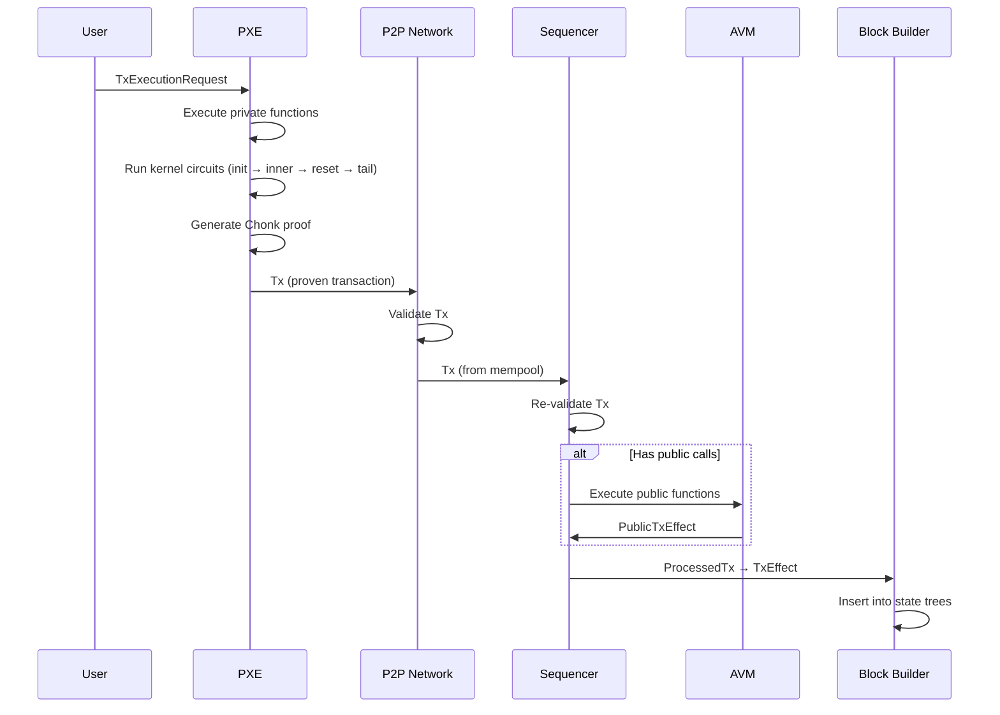
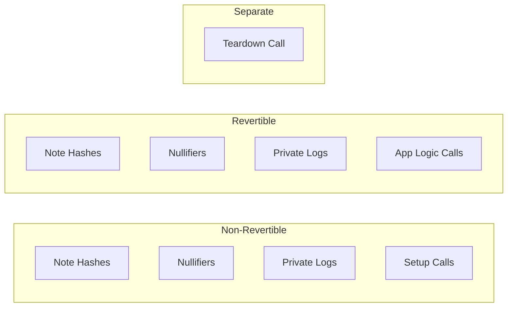
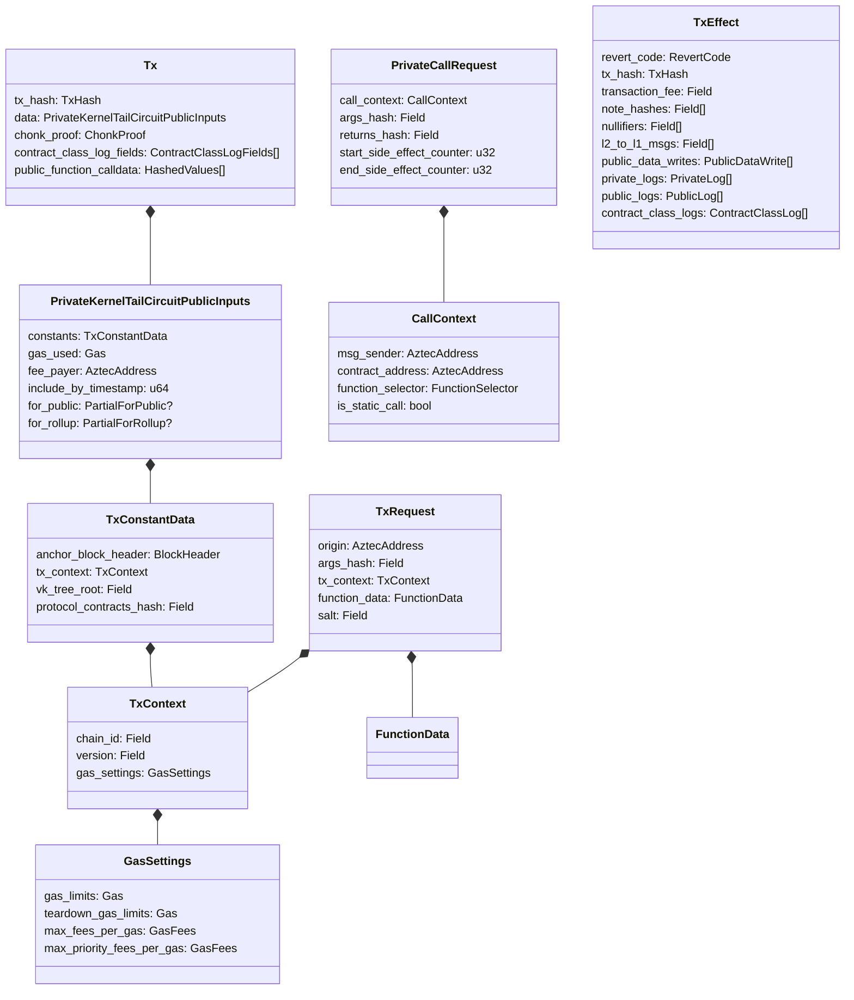

# Transaction Format & Lifecycle

## Overview

This specification defines the complete transaction object in the Aztec protocol: its fields, how it is constructed from private kernel outputs, the validation rules that govern its acceptance, and how it progresses through the mempool to block inclusion. A transaction is the fundamental unit of state change in the Aztec network.

Aztec transactions are unique among rollups because private execution occurs client-side in the Private Execution Environment (PXE), producing a zero-knowledge proof before the transaction is ever submitted to the network. The sequencer never sees private function logic, inputs, or caller identity — only the proven side effects and proof.

There are two logical stages to a transaction:

1. **Transaction Request** — the user's intent, specifying the origin contract, entry function, arguments, and gas settings.
2. **Proven Transaction (Tx)** — the fully proven object gossipped over the P2P network, containing the kernel proof, accumulated side effects, and auxiliary data needed for public execution.

After public execution (if any), the sequencer produces a **Transaction Effect (TxEffect)** — the final set of state changes committed to the block.

**Cross-references:**
- Spec #1 (Protocol Overview & Architecture) — introduces the transaction lifecycle at a high level
- Spec #2 (Constants) — defines all per-transaction limits, gas constants, serialization lengths, and domain separators
- Spec #3 (Cryptographic Primitives) — specifies hash functions used for tx hashing, nullifier derivation, and note hash siloing
- Spec #4 (State Model & Merkle Trees) — defines the trees that transactions mutate

## Requirements

### R1: Privacy-Preserving Submission

A proven transaction MUST NOT reveal the private functions that were executed, their arguments, or the identity of the caller beyond the origin contract address. Only proven side effects (note hashes, nullifiers, logs, public call requests) and the kernel proof are transmitted to the network.

**Rationale:** This is the core privacy guarantee. The sequencer and other observers learn only the number and type of side effects, not the logic that produced them.

### R2: Deterministic Transaction Identity

Every transaction MUST have a unique, deterministic identifier (TxHash) derived from its kernel circuit public inputs. Two transactions with identical kernel public inputs MUST produce the same TxHash.

**Rationale:** The TxHash is used for mempool deduplication, block inclusion tracking, log indexing, and blob encoding. Deterministic derivation ensures all nodes agree on a transaction's identity.

### R3: Replay Protection

Transactions MUST be bound to a specific chain ID and rollup version. A transaction valid on one chain or version MUST NOT be valid on another.

**Rationale:** Without replay protection, a transaction could be submitted to a different chain or after a protocol upgrade, causing unintended state changes.

### R4: Fee Payment Guarantee

Every transaction MUST specify gas limits and maximum fees per gas. If a transaction includes public calls, its fee payer MUST have sufficient Fee Juice balance to cover the maximum possible fee. Private-only transactions MUST also pay fees via a deduction from the fee payer's balance.

**Rationale:** Sequencers must be compensated for execution and proving costs. Fee guarantees prevent griefing attacks where transactions consume resources without paying.

### R5: Bounded Side Effects

The number of side effects (note hashes, nullifiers, L2-to-L1 messages, logs, public call requests) in a transaction MUST NOT exceed the per-transaction limits defined in Spec #2 (Constants).

**Rationale:** These limits bound circuit complexity and ensure that a single transaction cannot consume an unbounded amount of block space.

### R6: Temporal Validity

Each transaction MUST specify a timestamp by which it must be included in a block. Expired transactions MUST be rejected.

**Rationale:** Stale transactions should not persist indefinitely in the mempool. The inclusion deadline also anchors the transaction to a specific state epoch, preventing inclusion against outdated state.

### R7: First Nullifier Guarantee

Every transaction MUST emit at least one nullifier. If no private function in the transaction emits a nullifier, the protocol MUST generate a **protocol nullifier** derived from the transaction request hash.

**Rationale:** The first nullifier serves as a unique transaction identifier used for note hash nonce generation (preventing Faerie-Gold attacks) and log indexing. Guaranteeing its existence simplifies downstream processing.

## Specification

### Transaction Lifecycle

A transaction progresses through the following phases:



#### Phase 1: Transaction Request Construction

The user constructs a `TxExecutionRequest` containing the entry function, arguments, gas settings, and authorization data. The PXE converts this to a `TxRequest` by hashing the arguments and stripping data not needed for the kernel circuit.

Because Aztec uses native account abstraction — where every account is backed by a contract — the transaction request specifies only the contract address, function selector, and arguments for the initial call (the **entrypoint**). Nonces, signatures, and other authentication data are arguments to the entrypoint function and are thus opaque to the protocol. The entrypoint is always a private function on the origin account contract.

#### Phase 2: Private Execution

Private execution in the PXE occurs in two sub-steps:

1. **Simulation**: The PXE executes all private function circuits and kernel circuits without generating witnesses or proofs. This produces the transaction's side effects and allows the PXE to return a simulated result to the caller — enabling applications to detect failed assertions or inspect outputs before committing to a proof. The private call stack is processed until empty; all enqueued private function calls MUST be resolved during this step.
2. **Proving**: The PXE re-executes the same circuit chain, this time generating witnesses and producing a proof. It is not necessary to simulate before proving, though simulation is desirable to provide early feedback and catch failures.

The kernel circuit chain during both sub-steps is:

1. **Private Kernel Init**: Processes the first function call, validates it against the `TxRequest`, and generates the protocol nullifier if needed.
2. **Private Kernel Inner** (repeated): Processes each subsequent private function call, accumulating side effects.
3. **Private Kernel Reset** (optional, repeated): Squashes transient notes, validates read requests, and silos note hashes and nullifiers.
4. **Private Kernel Tail** (private-only) or **Private Kernel Tail-to-Public** (has public calls): Finalizes accumulated data, sorts side effects, and produces the final kernel public inputs. The tail circuit validates that the private call stack is empty and all read requests and key validation requests have been resolved.

The kernel processes the private call stack iteratively. The Init circuit processes the entrypoint call and pushes any nested calls onto the stack. Each Inner kernel iteration pops the top `PrivateCallRequest` from the stack, validates that the call's execution (contract address, function selector, arguments hash, static call flag) matches the request, accumulates its side effects, and pushes any further nested calls. Nested calls are pushed in reverse order so that they are processed in the original call order (LIFO). This continues until the private call stack is empty.

When a private function enqueues a public function call, it does not push to the private call stack. Instead, a `PublicCallRequest` with an `args_hash` (but no execution results) is added to the `public_call_requests` accumulator. The sequencer later resolves these in the public execution phase.

A **Chonk proof** is generated covering the entire private kernel circuit chain.

#### Phase 3: Transaction Submission

The PXE assembles the `Tx` object and submits it to the P2P network. The `Tx` contains:
- The claimed `TxHash`
- The kernel circuit public inputs (`PrivateKernelTailCircuitPublicInputs`)
- The Chonk proof
- Contract class log field preimages
- Public function calldata (hashed values)

#### Phase 4: Mempool Validation

Nodes validate received transactions before admitting them to the mempool. Validation is specified in the Validation Rules section below.

#### Phase 5: Public Execution (if applicable)

If the transaction enqueues public function calls, the sequencer executes them via the AVM in three phases:

1. **Setup** (non-revertible): Fee preparation and other setup logic
2. **App Logic** (revertible): Main application logic
3. **Teardown** (non-revertible): Fee payment finalization

Unlike private execution — which reads from the historical state referenced by the `anchor_block_header` — public execution operates on the current world state at the time of block building. Each public function reads from and writes to the latest public data tree, and state changes from earlier calls within the same transaction are visible to later calls.

Public execution can revert due to a failed assertion, running out of gas, an invalid opcode, a static call attempting state modification, a nullifier collision, or other exceptional halts. If app logic reverts, its state changes are discarded but setup and teardown effects are preserved. The transaction is still included in the block and pays fees, but is flagged with a non-OK `RevertCode`.

#### Phase 6: Transaction Effect Construction

The sequencer constructs a `TxEffect` from the combined private and public execution results. This is the final representation committed to the block and encoded into blobs for data availability.

### Transaction Request

The `TxRequest` is the hashed representation of the user's intent. It is created during private execution and constrained by the kernel circuits.

| Field | Type | Size (fields) | Description |
|---|---|---|---|
| `origin` | AztecAddress | 1 | Address of the account contract initiating the transaction |
| `args_hash` | Field | 1 | Poseidon2 hash of the entry function arguments |
| `tx_context` | TxContext | 10 | Transaction context (chain ID, version, gas settings) |
| `function_data` | FunctionData | 2 | Entry function selector and privacy flag |
| `salt` | Field | 1 | Random salt for hash unpredictability |

**Total serialized length:** `TX_REQUEST_LENGTH = 15` fields.

**Hash computation:**

```
tx_request_hash = poseidon2_hash_with_separator(tx_request.serialize(), DOM_SEP__TX_REQUEST)
```

#### TxContext

| Field | Type | Size (fields) | Description |
|---|---|---|---|
| `chain_id` | Field | 1 | L1 chain ID for replay protection |
| `version` | Field | 1 | Rollup contract version for replay protection |
| `gas_settings` | GasSettings | 8 | Gas limits and fee caps |

**Total serialized length:** `TX_CONTEXT_LENGTH = 10` fields.

#### FunctionData

| Field | Type | Size (fields) | Description |
|---|---|---|---|
| `selector` | FunctionSelector | 1 | 4-byte function selector (zero-padded to Field) |
| `is_private` | bool | 1 | `true` for private entry functions (always `true` for tx entry points) |

**Total serialized length:** `FUNCTION_DATA_LENGTH = 2` fields.

#### GasSettings

| Field | Type | Size (fields) | Description |
|---|---|---|---|
| `gas_limits` | Gas | 2 | Maximum DA gas and L2 gas for the transaction |
| `teardown_gas_limits` | Gas | 2 | Gas budget reserved for the teardown phase |
| `max_fees_per_gas` | GasFees | 2 | Maximum fee per unit of DA gas and L2 gas |
| `max_priority_fees_per_gas` | GasFees | 2 | Maximum priority fee (tip) per unit of gas |

**Total serialized length:** `GAS_SETTINGS_LENGTH = 8` fields.

The `Gas` type contains two dimensions:

| Field | Type | Description |
|---|---|---|
| `da_gas` | u32 | Data availability gas |
| `l2_gas` | u32 | L2 execution gas |

The `GasFees` type contains:

| Field | Type | Description |
|---|---|---|
| `fee_per_da_gas` | Field | Fee per unit of DA gas |
| `fee_per_l2_gas` | Field | Fee per unit of L2 gas |

The **fee limit** (maximum fee a transaction can pay) is computed as:

```
fee_limit = gas_limits.da_gas * max_fees_per_gas.fee_per_da_gas
           + gas_limits.l2_gas * max_fees_per_gas.fee_per_l2_gas
```

### TxExecutionRequest

The `TxExecutionRequest` is the full, un-hashed version of the transaction request that the PXE uses for execution. It is NOT transmitted over the network.

| Field | Type | Description |
|---|---|---|
| `origin` | AztecAddress | Sender account contract address |
| `function_selector` | FunctionSelector | Entry function selector |
| `first_call_args_hash` | Field | Hash of first function call arguments |
| `tx_context` | TxContext | Transaction context |
| `args_of_calls` | HashedValues[] | Packed arguments for each function call |
| `auth_witnesses` | AuthWitness[] | Transient authorization witnesses |
| `capsules` | Capsule[] | Read-only oracle data |
| `salt` | Field | Random salt |

During simulation and proving, the PXE answers oracle queries from executing functions using data from this request: when a function call is invoked with a hash of its arguments, the PXE resolves the preimage from `args_of_calls`; when a contract requests authorization for an action identified by a hash, the PXE provides the matching entry from `auth_witnesses`.

The `TxExecutionRequest` is converted to a `TxRequest` by:

```
tx_request = TxRequest {
    origin: exec_request.origin,
    args_hash: exec_request.first_call_args_hash,
    tx_context: exec_request.tx_context,
    function_data: FunctionData {
        selector: exec_request.function_selector,
        is_private: true,  // Entrypoints are always private
    },
    salt: exec_request.salt,
}
```

### Proven Transaction (Tx)

The `Tx` is the object gossipped over the P2P network and stored in the mempool. It extends the `Gossipable` base class and is identified by topic type `tx`.

| Field | Type | Description |
|---|---|---|
| `tx_hash` | TxHash | Claimed hash of kernel public inputs |
| `data` | PrivateKernelTailCircuitPublicInputs | Output of private kernel tail circuit |
| `chonk_proof` | ChonkProof | Proof of private kernel execution |
| `contract_class_log_fields` | ContractClassLogFields[] | Preimages for contract class logs |
| `public_function_calldata` | HashedValues[] | Calldata for enqueued public calls |

#### TxHash

The `TxHash` is a single Field element computed from the kernel public inputs:

- For **private-only transactions** (no public calls):
  ```
  tx_hash = poseidon2_hash_with_separator(
      PrivateToRollupKernelCircuitPublicInputs.serialize(),
      DOM_SEP__PRIVATE_TX_HASH
  )
  ```

- For **transactions with public calls**:
  ```
  tx_hash = poseidon2_hash_with_separator(
      PrivateToPublicKernelCircuitPublicInputs.serialize(),
      DOM_SEP__PUBLIC_TX_HASH
  )
  ```

The domain separators distinguish the two hash preimage formats.

#### Serialization

The `Tx` is serialized for P2P transmission as:

```
tx_hash || data || chonk_proof || contract_class_log_fields_vector || public_function_calldata_vector
```

Where vectors are length-prefixed with a 1-byte or 4-byte count.

### Kernel Circuit Public Inputs

The kernel public inputs are the data committed to by the kernel proof. They come in two variants depending on whether the transaction has public calls.

#### PrivateKernelTailCircuitPublicInputs

This is the combined structure output by the PXE:

| Field | Type | Description |
|---|---|---|
| `constants` | TxConstantData | Immutable transaction-wide data |
| `gas_used` | Gas | Gas consumed during private execution |
| `fee_payer` | AztecAddress | Address paying for the transaction |
| `include_by_timestamp` | u64 | Deadline for block inclusion |
| `for_public` | PartialPrivateTailPublicInputsForPublic? | Present if tx has public calls |
| `for_rollup` | PartialPrivateTailPublicInputsForRollup? | Present if tx is private-only |

Exactly one of `for_public` or `for_rollup` MUST be set.

#### TxConstantData

Data that remains constant throughout kernel circuit execution:

| Field | Type | Size (fields) | Description |
|---|---|---|---|
| `anchor_block_header` | BlockHeader | 22 | Block header used as state anchor during execution |
| `tx_context` | TxContext | 10 | Chain ID, version, gas settings |
| `vk_tree_root` | Field | 1 | Root of the verification key tree |
| `protocol_contracts_hash` | Field | 1 | Hash of the protocol contracts list |

**Total serialized length:** `TX_CONSTANT_DATA_LENGTH = 34` fields.

The `anchor_block_header` references a historical block whose state was used during private execution. This is NOT the block the transaction will be included in — there may be a gap between the anchor block and the inclusion block.

#### PrivateToRollupKernelCircuitPublicInputs (Private-Only)

For transactions without public calls:

| Field | Type | Size (fields) | Description |
|---|---|---|---|
| `constants` | TxConstantData | 34 | Transaction constants |
| `end` | PrivateToRollupAccumulatedData | 1371 | Final accumulated side effects |
| `gas_used` | Gas | 2 | Total gas consumed |
| `fee_payer` | AztecAddress | 1 | Fee payer address |
| `include_by_timestamp` | u64 | 1 | Inclusion deadline |

**Total serialized length:** `PRIVATE_TO_ROLLUP_KERNEL_CIRCUIT_PUBLIC_INPUTS_LENGTH = 1409` fields.

**Hash:** `poseidon2_hash_with_separator(fields, DOM_SEP__PRIVATE_TX_HASH)`

#### PrivateToPublicKernelCircuitPublicInputs (Has Public Calls)

For transactions with public calls:

| Field | Type | Size (fields) | Description |
|---|---|---|---|
| `constants` | TxConstantData | 34 | Transaction constants |
| `non_revertible_accumulated_data` | PrivateToPublicAccumulatedData | 1499 | Non-revertible side effects |
| `revertible_accumulated_data` | PrivateToPublicAccumulatedData | 1499 | Revertible side effects |
| `public_teardown_call_request` | PublicCallRequest | 4 | Teardown function call request |
| `gas_used` | Gas | 2 | Gas consumed in private execution |
| `fee_payer` | AztecAddress | 1 | Fee payer address |
| `include_by_timestamp` | u64 | 1 | Inclusion deadline |

**Total serialized length:** `PRIVATE_TO_PUBLIC_KERNEL_CIRCUIT_PUBLIC_INPUTS_LENGTH = 3040` fields.

**Hash:** `poseidon2_hash_with_separator(fields, DOM_SEP__PUBLIC_TX_HASH)`

### Accumulated Data

#### PrivateToRollupAccumulatedData

Side effects from a private-only transaction:

| Field | Type | Max Count | Description |
|---|---|---|---|
| `note_hashes` | Field[] | 64 | Unique, siloed note hashes |
| `nullifiers` | Field[] | 64 | Siloed nullifiers |
| `l2_to_l1_msgs` | ScopedL2ToL1Message[] | 8 | L2-to-L1 messages with contract scope |
| `private_logs` | PrivateLog[] | 64 | Encrypted private logs |
| `contract_class_logs_hashes` | ScopedLogHash[] | 1 | Contract class log hashes with scope |

All arrays are fixed-size tuples padded with empty (zero) values. The maximum counts are defined in Spec #2 (Constants).

#### PrivateToPublicAccumulatedData

Side effects for a transaction with public calls. This structure is used twice — once for non-revertible effects and once for revertible effects:

| Field | Type | Max Count | Description |
|---|---|---|---|
| `note_hashes` | Field[] | 64 | Unique, siloed note hashes |
| `nullifiers` | Field[] | 64 | Siloed nullifiers |
| `l2_to_l1_msgs` | ScopedL2ToL1Message[] | 8 | L2-to-L1 messages |
| `private_logs` | PrivateLog[] | 64 | Encrypted private logs |
| `contract_class_logs_hashes` | ScopedLogHash[] | 1 | Contract class log hashes |
| `public_call_requests` | PublicCallRequest[] | 32 | Enqueued public function calls |

#### CallContext

Shared context for any function call (private or public):

| Field | Type | Size (fields) | Description |
|---|---|---|---|
| `msg_sender` | AztecAddress | 1 | Address of the contract that initiated the call |
| `contract_address` | AztecAddress | 1 | Address of the contract being called |
| `function_selector` | FunctionSelector | 1 | Selector of the function being called |
| `is_static_call` | bool | 1 | Whether the call is static (read-only) |

**Total serialized length:** `CALL_CONTEXT_LENGTH = 4` fields.

#### PrivateCallRequest

A request representing a synchronous private function call in the private call stack:

| Field | Type | Size (fields) | Description |
|---|---|---|---|
| `call_context` | CallContext | 4 | Call context (sender, target, selector, static flag) |
| `args_hash` | Field | 1 | Hash of the function arguments |
| `returns_hash` | Field | 1 | Hash of the function return values |
| `start_side_effect_counter` | u32 | 1 | Side-effect counter at the start of the call |
| `end_side_effect_counter` | u32 | 1 | Side-effect counter at the end of the call |

**Total serialized length:** `PRIVATE_CALL_REQUEST_LENGTH = 8` fields.

The kernel circuit validates each `PrivateCallRequest` by checking that the nested execution's `CallContext` and `args_hash` match the request, and that the side-effect counters delineate a valid range. The `returns_hash` allows the caller to constrain expected return values.

#### PublicCallRequest

A request to execute a public function:

| Field | Type | Size (fields) | Description |
|---|---|---|---|
| `msg_sender` | AztecAddress | 1 | Account that invoked the call |
| `contract_address` | AztecAddress | 1 | Target contract |
| `is_static_call` | bool | 1 | Whether this is a static (read-only) call |
| `calldata_hash` | Field | 1 | Hash of the function calldata |

**Total serialized length:** `PUBLIC_CALL_REQUEST_LENGTH = 4` fields.

The `calldata_hash` is computed as:

```
calldata_hash = poseidon2_hash_with_separator(calldata, DOM_SEP__PUBLIC_CALLDATA)
```

The actual calldata is transmitted alongside the `Tx` in the `public_function_calldata` array as `HashedValues` (value-hash pairs).

### Protocol Nullifier

Every transaction MUST emit at least one nullifier. If no private function emits a nullifier, the **Private Kernel Init** circuit inserts a **protocol nullifier** at index 0:

```
protocol_nullifier = Nullifier {
    value: tx_request.hash(),
    note_hash: 0,
}
```

The protocol nullifier:
- Has side-effect counter `1` (no other side effect can have counter 1)
- Is scoped to `NULL_MSG_SENDER_CONTRACT_ADDRESS` (field element -1)
- Uses the `TxRequest` hash as its value, ensuring uniqueness per transaction

The first nullifier (whether user-emitted or protocol-generated) serves as:
1. A seed for computing note hash nonces (see Spec #3)
2. A transaction identifier for log indexing
3. A replay prevention mechanism

### Non-Revertible vs. Revertible Effects

For transactions with public calls, the Private Kernel Tail-to-Public circuit splits accumulated side effects into two sets:

- **Non-revertible effects**: Committed regardless of whether app logic reverts. Includes setup-phase public calls, fee-related operations, and any private effects marked as non-revertible.
- **Revertible effects**: Discarded if the app logic phase reverts. Includes app-logic-phase public calls and their associated private effects.

The teardown call request is stored separately — it always executes regardless of app logic revert status.



### Public Execution Phases

When the sequencer processes a transaction with public calls, it executes them via the AVM in the following order:

1. **Setup phase**: Non-revertible public call requests from `non_revertible_accumulated_data.public_call_requests`. These typically handle fee preparation (e.g., Fee Payment Contract interactions).

2. **App logic phase**: Revertible public call requests from `revertible_accumulated_data.public_call_requests`. If any call in this phase reverts, ALL revertible effects (both private and public) are discarded.

3. **Teardown phase**: The `public_teardown_call_request` (if non-empty). This typically handles fee payment finalization. Teardown always executes, even if app logic reverted.

### Synchronous and Enqueued Calls

Function calls in the Aztec protocol fall into two categories based on execution timing:

**Synchronous calls** occur when a private function calls another private function, or when a public function calls another public function. Execution jumps to the target function and returns with a result before the caller resumes. At the protocol level, each synchronous private call is represented as a `PrivateCallRequest` in the private call stack. The calling function pushes the request (containing the target contract, function selector, arguments hash, and expected return hash) onto the stack, and the kernel circuit processes it in the next iteration. The kernel validates that the nested execution matches the request — specifically, that the `CallContext`, `args_hash`, `returns_hash`, and side-effect counters are consistent — before accumulating its side effects.

**Enqueued calls** occur when a private function calls a public function. Because private execution happens client-side in the PXE and public execution happens on the sequencer, these calls cannot be resolved synchronously. Instead, the private function emits a `PublicCallRequest` containing the target contract, `msg_sender`, static call flag, and a hash of the calldata. These requests are accumulated in the kernel output and resolved by the sequencer during the public execution phase.

Public-to-private calls are not supported — a public function cannot invoke a private function, as the private execution environment is not available on the sequencer.

### Static Calls

Both private and public function calls can be executed as **static calls**, meaning the called function and all nested calls within it MUST NOT produce any state-modifying side effects. Static calls allow querying another contract while guaranteeing no state mutation occurs. This mechanism is based on [EIP-214](https://eips.ethereum.org/EIPS/eip-214).

A static call is identified by the `is_static_call` flag in the `CallContext`. When a static call is made, all subsequent nested calls inherit the static flag — a static call frame cannot spawn a non-static nested call.

The kernel circuit enforces that a static call emits none of the following side effects:

- `note_hashes`
- `nullifiers`
- `l2_to_l1_msgs`
- `private_logs`
- `contract_class_logs_hashes`

Additionally, a static call MUST NOT:
- Nominate itself as the fee payer
- Set the min revertible side effect counter (which would affect the revertibility boundary)

For public static calls, the AVM enforces that no state-modifying opcodes are executed. Specifically, the following opcodes MUST revert with a static call alteration error:

- `SSTORE` (public storage writes)
- `EMITNOTEHASH`
- `EMITNULLIFIER`
- `SENDL2TOL1MSG`
- `EMITUNENCRYPTEDLOG` (public logs)

### Transaction Effect (TxEffect)

After execution is complete, the sequencer constructs a `TxEffect` representing the final state changes committed to the block:

| Field | Type | Description |
|---|---|---|
| `revert_code` | RevertCode | Whether the transaction reverted (OK, APP_LOGIC_REVERTED, etc.) |
| `tx_hash` | TxHash | Transaction identifier |
| `transaction_fee` | Field | Actual fee paid (in Fee Juice) |
| `note_hashes` | Field[] | Note hashes to insert into the note hash tree |
| `nullifiers` | Field[] | Nullifiers to insert into the nullifier tree |
| `l2_to_l1_msgs` | Field[] | L2-to-L1 message hashes |
| `public_data_writes` | PublicDataWrite[] | Public state updates |
| `private_logs` | PrivateLog[] | Encrypted private logs |
| `public_logs` | PublicLog[] | Public logs from AVM execution |
| `contract_class_logs` | ContractClassLog[] | Contract class registration logs |

The `TxEffect` enforces the following invariants on construction:
- No array exceeds its per-transaction maximum count
- No note hash, nullifier, or L2-to-L1 message is zero
- No public data write or private log is empty

#### TxEffect for Private-Only Transactions

For transactions without public calls:
- `note_hashes`: From `end.note_hashes` (non-zero values)
- `nullifiers`: From `end.nullifiers` (non-zero values)
- `l2_to_l1_msgs`: From `end.l2_to_l1_msgs`, hashed with chain ID and version
- `public_data_writes`: A single write deducting the fee from the fee payer's balance
- `private_logs`: From `end.private_logs` (non-empty values)
- `public_logs`: Empty
- `revert_code`: Always `OK`

#### TxEffect for Transactions with Public Calls

For transactions with public calls:
- `note_hashes`, `nullifiers`, `l2_to_l1_msgs`: Combined from private accumulated data and AVM execution output. If reverted, only non-revertible private effects are included.
- `public_data_writes`: From AVM execution output
- `private_logs`: Non-revertible logs always included; revertible logs only if `revert_code` is `OK`
- `public_logs`: From AVM execution output
- `contract_class_logs`: All logs if OK; only non-revertible logs if reverted

#### L2-to-L1 Message Hashing

L2-to-L1 messages in the `TxEffect` are stored as hashes rather than raw message content:

```
l2_to_l1_msg_hash = sha256_to_field(
    l2_sender || l1_recipient || content || rollup_version || chain_id
)
```

This hash is computed by the sequencer when constructing the `TxEffect` from the scoped L2-to-L1 messages in the kernel output.

### Blob Encoding

Transaction effects are encoded into EIP-4844 blobs for data availability. Each transaction's blob data begins with a **TX start marker** containing counts of all effect types:

| Marker Field | Description |
|---|---|
| `revert_code` | Transaction revert status |
| `num_note_hashes` | Count of note hashes |
| `num_nullifiers` | Count of nullifiers |
| `num_l2_to_l1_msgs` | Count of L2-to-L1 messages |
| `num_public_data_writes` | Count of public data writes |
| `num_private_logs` | Count of private logs |
| `private_logs_length` | Total emitted length of private logs |
| `public_logs_length` | Total length of public logs |
| `contract_class_log_length` | Emitted length of contract class log |
| `num_blob_fields` | Total fields this tx occupies in the blob |

The TX start marker is prefixed with `TX_START_PREFIX = 0x9c707518`. Block boundaries use `BLOCK_END_PREFIX = 0xeb8dcdbf`. Checkpoint boundaries use `CHECKPOINT_END_PREFIX = 0x8c637443`.

### Fee Payment

The fee payer is specified in `PrivateKernelTailCircuitPublicInputs.fee_payer`. Fee payment proceeds differently for the two transaction types:

**Private-only transactions:** The sequencer computes the transaction fee and creates a single `PublicDataWrite` deducting the fee from the fee payer's Fee Juice balance at:
```
slot = poseidon2_hash_with_separator(
    [FEE_JUICE_ADDRESS, FEE_JUICE_BALANCES_SLOT],
    DOM_SEP__PUBLIC_STORAGE_MAP_SLOT
)
```

**Transactions with public calls:** Fee payment is handled by the AVM during the teardown phase. The teardown function (typically a Fee Payment Contract method) performs the balance deduction. The AVM outputs the final `transaction_fee`.

The **fee limit** (maximum fee a transaction can pay) is:
```
fee_limit = sum over dimensions of (gas_limits[dim] * max_fees_per_gas[dim])
```

The fee payer's Fee Juice balance MUST be at least `fee_limit` at the time of validation.

## Data Structures



### Key Type Sizes

| Structure | Constant | Size (fields) |
|---|---|---|
| TxRequest | `TX_REQUEST_LENGTH` | 15 |
| TxContext | `TX_CONTEXT_LENGTH` | 10 |
| GasSettings | `GAS_SETTINGS_LENGTH` | 8 |
| FunctionData | `FUNCTION_DATA_LENGTH` | 2 |
| Gas | `GAS_LENGTH` | 2 |
| GasFees | `GAS_FEES_LENGTH` | 2 |
| TxConstantData | `TX_CONSTANT_DATA_LENGTH` | 34 |
| CallContext | `CALL_CONTEXT_LENGTH` | 4 |
| PrivateCallRequest | `PRIVATE_CALL_REQUEST_LENGTH` | 8 |
| PublicCallRequest | `PUBLIC_CALL_REQUEST_LENGTH` | 4 |
| PrivateToRollupAccumulatedData | `PRIVATE_TO_ROLLUP_ACCUMULATED_DATA_LENGTH` | 1371 |
| PrivateToPublicAccumulatedData | `PRIVATE_TO_PUBLIC_ACCUMULATED_DATA_LENGTH` | 1499 |
| PrivateToRollupKernelCircuitPublicInputs | `PRIVATE_TO_ROLLUP_KERNEL_CIRCUIT_PUBLIC_INPUTS_LENGTH` | 1409 |
| PrivateToPublicKernelCircuitPublicInputs | `PRIVATE_TO_PUBLIC_KERNEL_CIRCUIT_PUBLIC_INPUTS_LENGTH` | 3040 |

## Validation Rules

Transaction validation occurs at two stages: mempool admission (P2P layer) and block building (sequencer). The validators are composed in an aggregate pipeline — a transaction MUST pass ALL validators to be admitted.

A subset of these rules is re-enforced by the base rollup circuit when the transaction is included in a block. Specifically, the rollup circuit re-verifies the kernel proof (V1), transaction constant data (V3), block header anchor (V4), inclusion timestamp (V5), contract class logs (V10), and fee payer balance (V8). Rules that are only checked at the mempool/sequencer layer — such as gas limit bounds (V7), calldata validation (V9), setup allow list (V11), and transaction size (V12) — are not re-enforced on-chain.

### V1: Proof Verification

The Chonk proof MUST verify against the claimed kernel public inputs. A node MUST reject any transaction with an invalid proof.

The verifier uses the appropriate verification key from the VK tree based on whether the transaction is private-only (`HIDING_KERNEL_TO_ROLLUP_VK_INDEX = 4`) or has public calls (`HIDING_KERNEL_TO_PUBLIC_VK_INDEX = 5`).

### V2: Hash Integrity

The claimed `tx_hash` MUST match the hash computed from the kernel public inputs:

```
expected_hash = data.for_public
    ? hash(data.toPrivateToPublicKernelCircuitPublicInputs())   // DOM_SEP__PUBLIC_TX_HASH
    : hash(data.toPrivateToRollupKernelCircuitPublicInputs())   // DOM_SEP__PRIVATE_TX_HASH
assert(tx.tx_hash == expected_hash)
```

### V3: Metadata Validation

The following fields in `TxConstantData` MUST match the node's current protocol state:

| Field | Must Equal |
|---|---|
| `tx_context.chain_id` | Node's L1 chain ID |
| `tx_context.version` | Node's rollup version |
| `vk_tree_root` | Node's current VK tree root |
| `protocol_contracts_hash` | Node's computed protocol contracts hash |

### V4: Block Header Validation

The `anchor_block_header` hash MUST exist in the node's archive tree. A transaction referencing an unknown or future block header MUST be rejected.

### V5: Timestamp Validation

If the transaction's `include_by_timestamp` is non-zero and the block being built is not block 1:

```
assert(tx.data.include_by_timestamp >= current_block_timestamp)
```

Transactions built against the genesis block (anchor block number 0) are only valid in block 1.

### V6: Nullifier Uniqueness

1. No two nullifiers within the same transaction MUST be equal.
2. No nullifier in the transaction MUST already exist in the nullifier tree.

A transaction that violates either condition MUST be rejected.

### V7: Gas Limit Validation

The transaction's gas limits MUST satisfy:

```
gas_limits.da_gas >= FIXED_DA_GAS (512)
gas_limits.l2_gas >= FIXED_L2_GAS (512)
gas_limits.l2_gas <= AVM_MAX_PROCESSABLE_L2_GAS (6,000,000)
```

### V8: Fee Validation

If the transaction's `max_fees_per_gas` is below the current block's gas fees, the transaction SHOULD be **skipped** (deferred, not rejected) — it may become eligible in a future block with lower fees.

If the fee payer's Fee Juice balance (including any pending L1 claims in this transaction) is less than the transaction's `fee_limit`, the transaction MUST be rejected.

### V9: Calldata Validation

For transactions with public calls:

1. The number of `public_function_calldata` entries MUST equal the number of non-empty public call requests.
2. The total field count across all calldata MUST NOT exceed `MAX_FR_CALLDATA_TO_ALL_ENQUEUED_CALLS = 16,000`.
3. For each public call request, the hash of its calldata MUST match `request.calldata_hash`.

### V10: Contract Class Log Validation

1. The number of `contract_class_log_fields` entries MUST equal the number of non-empty contract class log hashes in the kernel output.
2. The hash of each log's fields MUST match the corresponding hash in the kernel output.
3. The logs MUST be in the same order as the kernel's log hashes.
4. Each log's declared length MUST be at least as large as the index of its last non-zero field plus one.

### V11: Setup Function Allow List

For transactions with public calls, all setup-phase (non-revertible) public call requests MUST call functions that are on the **setup allow list**. The allow list is configured per sequencer and typically includes:

- The Fee Juice contract (address `5`)
- Known Fee Payment Contract classes and their approved functions

Setup functions that are not on the allow list MUST cause the transaction to be rejected.

### V12: Transaction Size Limit

The serialized size of the `Tx` object MUST NOT exceed `MAX_TX_SIZE_KB * 1024` bytes.

### Validation Result Types

Each validator returns one of three results:

| Result | Meaning | Action |
|---|---|---|
| `valid` | Transaction passes this check | Continue to next validator |
| `invalid` | Transaction is definitively invalid | Reject permanently |
| `skipped` | Transaction is not currently eligible | Defer (do not reject) |

A transaction is admitted to the mempool only if ALL validators return `valid`. If any returns `invalid`, the transaction is rejected. If any returns `skipped` (and none returned `invalid`), the transaction is deferred.

## Security Considerations

### Transaction Graph Analysis

While individual transaction contents are hidden, the following metadata is visible:
- Number of note hashes and nullifiers
- Number and size of encrypted logs
- Whether the transaction has public calls
- The fee payer address
- The number of public call requests and their target contracts

Sophisticated analysis could correlate these patterns. Applications requiring strong privacy should minimize distinguishability (e.g., pad to uniform effect counts).

### `msg_sender` Leakage in Enqueued Public Calls

When a private function enqueues a public function call, the `msg_sender` field in the `PublicCallRequest` becomes visible to the sequencer and all observers. If the `msg_sender` is the user's account contract, this directly reveals the caller's identity. If it is an application contract, it reveals which contract the user interacted with in private.

To mitigate this, enqueued public calls support a `hide_msg_sender` option (incognito mode), which sets the `msg_sender` to `NULL_MSG_SENDER_CONTRACT_ADDRESS`, preventing the public call from revealing which contract initiated it. Applications requiring privacy for their public interactions SHOULD use incognito enqueued calls where feasible.

### Faerie-Gold Attacks

A Faerie-Gold attack occurs when an attacker crafts a note that appears valid to a recipient but becomes unspendable. The protocol prevents this by making note hashes unique using the first nullifier as a nonce seed:

```
nonce = poseidon2_hash_with_separator([first_nullifier, note_index_in_tx], DOM_SEP__NOTE_HASH_NONCE)
unique_note_hash = poseidon2_hash_with_separator([nonce, note_hash], DOM_SEP__UNIQUE_NOTE_HASH)
```

Since the first nullifier is guaranteed to exist and be unique per transaction, the nonce is unpredictable to attackers.

### Fee Griefing

Without fee validation, an attacker could submit transactions that consume sequencer resources (proof verification, public execution) without paying. The protocol mitigates this through:

1. **Upfront balance check**: Fee payer balance MUST cover the fee limit before admission.
2. **Non-revertible setup/teardown**: Fee payment logic in setup and teardown phases cannot be reverted by app logic failures.
3. **Gas limits**: Bound the maximum resources a single transaction can consume.

### Mempool Flooding

The following mechanisms protect against mempool flooding:
- **Transaction size limit**: Bounds memory consumption per transaction.
- **Proof verification**: Prevents spam with invalid proofs (proof generation is expensive).
- **Double-spend checking**: Prevents duplicate transactions.
- **Gas fee filtering**: Transactions below current fee levels are skipped.

## Open Questions

1. **Transaction Cancellation**: How can a user cancel a pending transaction? Currently, the only mechanism is to emit the same nullifier in a new transaction, causing the original to fail double-spend validation. Should there be an explicit cancellation mechanism?

2. **MaxPriorityFeesPerGas Usage**: The `GasSettings` includes `max_priority_fees_per_gas` (EIP-1559-style tips), but the current implementation does not appear to use this field for sequencer prioritization. How should priority fees affect transaction ordering?

3. **Include-by-Timestamp vs. Include-by-Block**: The `include_by_timestamp` field uses wall-clock time rather than block numbers. Given that block times may vary, should the protocol also support block-number-based expiration?

4. **Calldata Size Limit**: The `MAX_FR_CALLDATA_TO_ALL_ENQUEUED_CALLS = 16,000` limit applies to the total calldata across all public calls. Is this sufficient for complex transactions with many public interactions? Should per-call limits also be enforced?

5. **Setup Allow List Governance**: The setup function allow list is currently configured per sequencer. Should this be a protocol-level consensus parameter to ensure uniform validation across all nodes?

6. **Proof Type Migration**: The current implementation uses "Chonk" proofs (client Honk with incremental folding). What is the migration path if the proof system changes? How will the VK tree and proof type identifiers be updated?

## References

- Spec #1: Protocol Overview & Architecture — transaction lifecycle overview
- Spec #2: Constants — per-transaction limits, gas constants, serialization lengths, domain separators
- Spec #3: Cryptographic Primitives — hash functions used for tx hashing and nullifier derivation
- Spec #4: State Model & Merkle Trees — trees mutated by transaction effects
- `yarn-project/stdlib/src/tx/` — TypeScript transaction types (Tx, TxRequest, TxEffect, etc.)
- `yarn-project/stdlib/src/kernel/` — Kernel circuit public input types
- `yarn-project/p2p/src/msg_validators/tx_validator/` — Transaction validation pipeline
- `noir-projects/noir-protocol-circuits/crates/types/src/abis/transaction/` — Noir circuit transaction types
- `noir-projects/noir-protocol-circuits/crates/private-kernel-lib/` — Private kernel circuit implementations
