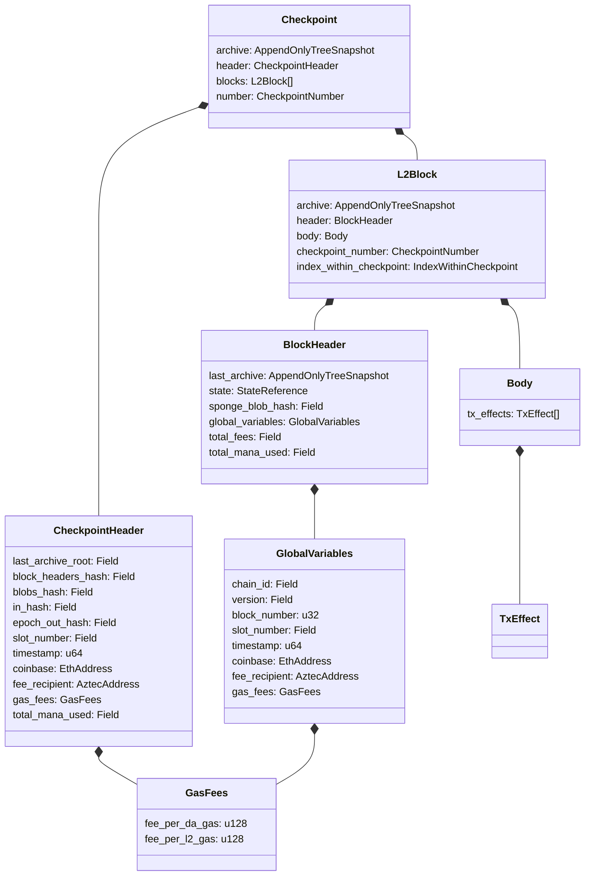

# Block Format & Header

## Overview

This specification defines the structure of L2 blocks in the Aztec protocol: the block header, block body, and their relationship to checkpoints and L1 submission. A block is the fundamental unit of state advancement — each block contains transaction effects, commits to the resulting state via tree roots, and is recorded in the archive tree.

Aztec uses a three-level hierarchy for organizing L2 data:

1. **Block** — contains a set of transaction effects and a header committing to the resulting state.
2. **Checkpoint** — groups one or more blocks from the same L2 slot, submitted atomically to L1.
3. **Epoch** — groups multiple checkpoints for batch proving and finalization.

Blocks exist within checkpoints — a checkpoint always contains at least one block. A checkpoint is the unit of L1 submission (via the `propose` transaction), while a block is the unit of state advancement and archive tree insertion.

**Cross-references:**
- Spec #1 (Protocol Overview & Architecture) — introduces the block/checkpoint/epoch hierarchy and sequencer role
- Spec #2 (Constants) — defines serialization lengths (`BLOCK_HEADER_LENGTH`, `CHECKPOINT_HEADER_LENGTH`, `GLOBAL_VARIABLES_LENGTH`), domain separators, and blob encoding prefixes
- Spec #3 (Cryptographic Primitives) — specifies Poseidon2 (used for block header hashing) and SHA-256-to-field (used for checkpoint header hashing)
- Spec #4 (State Model & Merkle Trees) — defines the archive tree, tree snapshots, state references, block header serialization, and genesis state
- Spec #5 (Transaction Format & Lifecycle) — defines `TxEffect`, the per-transaction output committed in the block body

## Requirements

### R1: Deterministic Block Structure

All implementations MUST produce identical block headers from the same inputs. The block header serialization, field ordering, and hashing algorithm MUST match exactly across all implementations (circuit, TypeScript, Solidity).

**Rationale:** Blocks are verified across multiple environments — the prover circuit, the L2 node, and the L1 rollup contract. Any divergence in serialization or hashing would cause proof verification failures or chain splits.

### R2: Complete State Commitment

Each block header MUST commit to the complete state of all four mutable Merkle trees after the block is processed. The header MUST also commit to the archive tree state before the block (enabling chain traversal).

**Rationale:** The block header is the leaf inserted into the archive tree. It must contain enough information to verify the entire chain state at any point. The `last_archive` field enables backward traversal, while the `state` field commits to the result of applying the block's transactions.

### R3: Data Availability

All transaction effects in a block body MUST be encoded into EIP-4844 blobs and committed via the `sponge_blob_hash` in the block header. The blob encoding MUST be deterministic and recoverable — an independent node MUST be able to reconstruct the complete block body from blob data.

**Rationale:** Blobs are the data availability mechanism. Without deterministic encoding and recoverability, nodes cannot sync from L1 data alone, breaking the rollup security model.

### R4: L1 Verifiability

The checkpoint header submitted to L1 MUST be independently computable from the constituent block headers and checkpoint parameters. The L1 rollup contract MUST be able to validate the checkpoint header against chain state without access to L2-specific data structures.

**Rationale:** L1 validation is the trust anchor. The rollup contract validates timing, fees, data availability, and chain continuity without requiring L2 state replay.

### R5: Sequential Block Numbering

Block numbers MUST be sequential starting from `INITIAL_L2_BLOCK_NUM = 1`. The block number MUST equal the archive tree index at which the block header hash is inserted.

**Rationale:** Sequential numbering with archive index alignment provides a simple, verifiable mapping between block numbers and their position in the archive tree.

### R6: Block Lifecycle Tracking

Implementations MUST track blocks through their lifecycle stages: proposed, checkpointed, proven, and finalized. A block's lifecycle stage determines what guarantees can be made about its finality.

**Rationale:** Different consumers require different finality guarantees. A wallet displaying a balance needs proven blocks; a block explorer can show proposed blocks.

## Specification

### Block Structure

An L2 block consists of a header and a body, along with metadata linking it to its checkpoint:

```
L2Block {
    archive: AppendOnlyTreeSnapshot,        // Archive tree AFTER this block
    header: BlockHeader,                     // Block header
    body: Body,                              // Transaction effects
    checkpoint_number: CheckpointNumber,     // Checkpoint this block belongs to
    index_within_checkpoint: IndexWithinCheckpoint,  // Position within checkpoint (0-based)
}
```

The block hash is defined as the hash of its header:

```
block_hash = header.hash()
```

The block number is derived from the header's global variables:

```
block_number = header.global_variables.block_number
```

This value MUST equal `header.last_archive.next_available_leaf_index` — the index at which this block's header hash is inserted into the archive tree.

### Block Header

The block header is the canonical commitment to block state. Its structure and serialization are defined in Spec #4 (State Model & Merkle Trees). The header contains six top-level fields:

```
BlockHeader {
    last_archive: AppendOnlyTreeSnapshot,    // Archive tree snapshot BEFORE this block
    state: StateReference,                    // All 4 state tree snapshots AFTER this block
    sponge_blob_hash: Field,                 // Cumulative blob data commitment
    global_variables: GlobalVariables,        // Block-level parameters
    total_fees: Field,                        // Total fees collected in this block
    total_mana_used: Field,                   // Total mana consumed in this block
}
```

The serialization order (22 field elements), hashing algorithm (Poseidon2 with `DOM_SEP__BLOCK_HEADER_HASH`), and genesis state are specified in Spec #4. This spec focuses on the semantic meaning of each field and how blocks are assembled, linked, and submitted to L1.

#### Field Semantics

**`last_archive`** — A snapshot of the archive tree as it existed before this block was applied. For block number `N`, `last_archive.next_available_leaf_index` MUST equal `N`. This field chains blocks together: each block's `last_archive` MUST equal the previous block's `archive` (the post-block archive snapshot stored in the `L2Block`).

**`state`** — A `StateReference` containing snapshots of all four mutable state trees after this block's transaction effects have been applied. See Spec #4 for the `StateReference` and `PartialStateReference` structures. The L1-to-L2 message tree snapshot is updated only in the first block of each checkpoint; for subsequent blocks within the same checkpoint, it carries forward unchanged.

**`sponge_blob_hash`** — The hash of the sponge blob state after absorbing this block's transaction effects. This is a cumulative commitment: it may include effects from previous blocks within the same checkpoint. To prove that specific effects belong to a particular block, the verifier compares the `sponge_blob_hash` of the current block against that of the previous block (whose header can be validated via an archive membership proof on `last_archive`).

**`global_variables`** — Block-level parameters that are constant for all transactions within the block. See the Global Variables section below.

**`total_fees`** — The sum of all transaction fees collected in this block, denominated in Fee Juice. This is a `Field` element.

**`total_mana_used`** — The total amount of mana consumed by all transactions in this block. This is a `Field` element.

### Global Variables

The `GlobalVariables` structure contains parameters that are fixed for the duration of a block and available to all transactions:

```
GlobalVariables {
    chain_id: Field,              // Ethereum chain ID (e.g., 1 for mainnet)
    version: Field,               // Protocol version
    block_number: u32,            // L2 block number
    slot_number: Field,           // L2 slot number
    timestamp: u64,               // Unix timestamp of the slot
    coinbase: EthAddress,         // Ethereum address of the block proposer
    fee_recipient: AztecAddress,  // L2 address receiving fees (unchecked, set by builder)
    gas_fees: GasFees,            // Current gas prices
}
```

The serialization length is `GLOBAL_VARIABLES_LENGTH = 9` field elements (see Spec #2: Constants).

#### Global Variables Fields

| Field | Type | Size (fields) | Description |
|---|---|---|---|
| `chain_id` | `Field` | 1 | Ethereum chain ID. Prevents cross-chain replay attacks. |
| `version` | `Field` | 1 | Protocol version number. Prevents cross-version replay attacks. |
| `block_number` | `u32` | 1 | Sequential L2 block number, starting from `INITIAL_L2_BLOCK_NUM = 1`. |
| `slot_number` | `Field` | 1 | L2 slot number. All blocks in a checkpoint share the same slot. |
| `timestamp` | `u64` | 1 | Unix timestamp derived from the slot number. All blocks in a checkpoint share the same timestamp. |
| `coinbase` | `EthAddress` | 1 | Ethereum address of the proposer, used for L1 fee distribution. MUST be non-zero. |
| `fee_recipient` | `AztecAddress` | 1 | Arbitrary L2 address set by the block builder. Unchecked by the protocol; enables off-chain arrangements between builders and transaction submitters. |
| `gas_fees` | `GasFees` | 2 | Current gas prices (`fee_per_da_gas` and `fee_per_l2_gas`). |

#### GasFees

```
GasFees {
    fee_per_da_gas: u128,   // Price per unit of DA gas
    fee_per_l2_gas: u128,   // Price per unit of L2 gas
}
```

The serialization length is `GAS_FEES_LENGTH = 2` field elements.

**Current protocol constraint:** `fee_per_da_gas` MUST be `0`. DA gas pricing is not currently active; all costs are captured by L2 gas. The `fee_per_l2_gas` value MUST match the computed mana base fee for the slot (see checkpoint validation).

### Block Body

The block body is an ordered list of transaction effects:

```
Body {
    tx_effects: TxEffect[],
}
```

Serialization format: `[tx_effects.length, tx_effects[0], tx_effects[1], ...]`

Each `TxEffect` is defined in Spec #5 (Transaction Format & Lifecycle). It contains the final state changes produced by a transaction after both private and public execution: note hashes, nullifiers, L2-to-L1 messages, public data writes, logs, the revert code, transaction hash, and transaction fee.

The block body is not directly committed in the block header. Instead, body data is committed through two mechanisms:

1. **Blob commitment** — The transaction effects are encoded into blob fields and absorbed into a sponge, producing the `sponge_blob_hash` in the block header.
2. **State roots** — The cumulative effect of applying all transaction effects is reflected in the `state` field of the block header (tree roots after the block).

### Block Assembly

The sequencer assembles a block by:

1. Selecting transactions from the mempool.
2. Executing public functions (if any) via the AVM.
3. Producing a `TxEffect` for each transaction.
4. Updating the four mutable state trees with the effects:
   - Note hash tree: insert note hashes (up to `MAX_NOTE_HASHES_PER_TX` per transaction).
   - Nullifier tree: insert nullifiers (up to `MAX_NULLIFIERS_PER_TX` per transaction).
   - Public data tree: apply public data writes (up to `MAX_TOTAL_PUBLIC_DATA_UPDATE_REQUESTS_PER_TX` per transaction).
   - L1-to-L2 message tree: insert messages only in the first block of the checkpoint (up to `L1_TO_L2_MSG_SUBTREE_SIZE` messages per checkpoint).
5. Computing the block header from the resulting tree state.
6. Inserting the block header hash into the archive tree.

The block number MUST equal `previous_archive.next_available_leaf_index`. After insertion, the archive snapshot becomes:

```
archive = {
    root: <new archive root after inserting block_header_hash>,
    next_available_leaf_index: block_number + 1,
}
```

### Checkpoint Structure

A checkpoint groups one or more blocks from the same L2 slot for atomic L1 submission:

```
Checkpoint {
    archive: AppendOnlyTreeSnapshot,    // Archive tree AFTER all blocks in checkpoint
    header: CheckpointHeader,           // Checkpoint-level commitment
    blocks: L2Block[],                  // Ordered list of blocks
    number: CheckpointNumber,           // Sequential checkpoint number
}
```

Checkpoint numbers start from `INITIAL_CHECKPOINT_NUMBER = 1` (the genesis checkpoint is 0).

All blocks within a checkpoint share the same `slot_number`, `timestamp`, `coinbase`, `fee_recipient`, and `gas_fees` (from `GlobalVariables`). Block numbers are sequential within the checkpoint: if a checkpoint starts at block number `N` and contains `K` blocks, the blocks are numbered `N`, `N+1`, ..., `N+K-1`.

#### Checkpoint Header

The checkpoint header is the unit of L1 verification. It commits to the collective state of all blocks in the checkpoint:

```
CheckpointHeader {
    last_archive_root: Field,          // Archive root BEFORE this checkpoint
    block_headers_hash: Field,         // Hash of all block headers in checkpoint
    blobs_hash: Field,                 // Commitment to blob data
    in_hash: Field,                    // SHA-256 root of L1-to-L2 messages
    epoch_out_hash: Field,             // Accumulated epoch out hash tree root
    slot_number: Field,                // L2 slot number
    timestamp: u64,                    // Slot timestamp
    coinbase: EthAddress,              // Block reward recipient
    fee_recipient: AztecAddress,       // L2 fee recipient
    gas_fees: GasFees,                 // Gas price information
    total_mana_used: Field,            // Total mana across all blocks
}
```

The serialization length is `CHECKPOINT_HEADER_LENGTH = 12` field elements. The byte serialization length is `CHECKPOINT_HEADER_SIZE_IN_BYTES = 316` bytes.

#### Checkpoint Header Fields

| Field | Type | Size (bytes) | Description |
|---|---|---|---|
| `last_archive_root` | `Field` | 32 | Archive root before this checkpoint. MUST match the L1-stored archive root. |
| `block_headers_hash` | `Field` | 32 | Poseidon2 root of block header hashes (unbalanced tree). |
| `blobs_hash` | `Field` | 32 | Commitment to EIP-4844 blob data for data availability. |
| `in_hash` | `Field` | 32 | SHA-256 root of L1-to-L2 messages consumed in this checkpoint. |
| `epoch_out_hash` | `Field` | 32 | Root of the epoch out hash balanced tree up to and including this checkpoint. |
| `slot_number` | `Field` | 32 | L2 slot number for this checkpoint. |
| `timestamp` | `u64` | 8 | Unix timestamp derived from slot number. |
| `coinbase` | `EthAddress` | 20 | Ethereum address of the proposer. |
| `fee_recipient` | `AztecAddress` | 32 | L2 address receiving fees. |
| `gas_fees.fee_per_da_gas` | `u128` | 16 | DA gas price (currently always 0). |
| `gas_fees.fee_per_l2_gas` | `u128` | 16 | L2 gas price (must match computed mana base fee). |
| `total_mana_used` | `Field` | 32 | Total mana consumed across all blocks in checkpoint. |

#### Checkpoint Header Hash

The checkpoint header is hashed using SHA-256-to-field over its big-endian byte serialization:

```
checkpoint_header_hash = sha256_to_field(checkpoint_header.to_be_bytes())
```

The byte serialization is tightly packed in the order shown in the table above, totaling `CHECKPOINT_HEADER_SIZE_IN_BYTES = 316` bytes. This is in contrast to the block header, which uses Poseidon2 over field elements.

**Rationale:** The checkpoint header hash must be verifiable on L1 in Solidity. SHA-256 is natively available in the EVM, making it the natural choice for L1-verified data. Block headers, which are only verified inside ZK circuits, use Poseidon2 for circuit efficiency.

#### Block Headers Hash

The `block_headers_hash` field commits to all block headers in the checkpoint. It is computed as an **unbalanced Poseidon2 Merkle tree** root over the individual block header hashes:

```
block_headers_hash = unbalanced_poseidon2_root([
    block_0.header.hash(),
    block_1.header.hash(),
    ...,
    block_K.header.hash(),
])
```

The unbalanced tree structure matches the greedy fill strategy used by the block merge circuit (see Spec #4). This means blocks are merged in a binary tree pattern, filling left children first.

### L1 Submission

Checkpoints are submitted to L1 via the `propose` function on the rollup contract. The L1 representation of the checkpoint header is the `ProposedHeader`:

```
ProposedHeader {               // Solidity struct
    lastArchiveRoot: bytes32,
    blockHeadersHash: bytes32,
    blobsHash: bytes32,
    inHash: bytes32,
    outHash: bytes32,          // epoch_out_hash
    slotNumber: Slot,          // uint256
    timestamp: Timestamp,      // uint256
    coinbase: address,         // 20 bytes
    feeRecipient: bytes32,
    gasFees: GasFees,          // {feePerDaGas: uint128, feePerL2Gas: uint128}
    totalManaUsed: uint256,
}
```

The `ProposedHeader` is hashed on L1 using `sha256ToField(abi.encodePacked(...))`. This hash MUST match the `CheckpointHeader` hash produced by the circuit.

#### Propose Transaction

The `propose` function accepts:

| Parameter | Type | Description |
|---|---|---|
| `args.archive` | `bytes32` | New archive root after checkpoint |
| `args.oracleInput` | `OracleInput` | L1 fee oracle data for mana pricing |
| `args.header` | `ProposedHeader` | Checkpoint header |
| `attestations` | `CommitteeAttestations` | Validator committee signatures |
| `signers` | `address[]` | Signing committee members |
| `attestationsAndSignersSignature` | `Signature` | Signature over attestations and signers |
| `blobInput` | `bytes` | Blob commitment data |

#### Propose Flow

The L1 `propose` function executes the following steps:

1. **Prune**: If the proof submission window for unproven checkpoints has passed, prune them.
2. **Validate blobs**: Verify blob commitments against actual EIP-4844 blob data.
3. **Compute header hash**: Hash the `ProposedHeader` using `sha256ToField`.
4. **Set up epoch**: If this is the first checkpoint of a new epoch, initialize epoch state.
5. **Validate header**: Check all header constraints (see Validation Rules).
6. **Verify proposer**: Validate that the proposer is the designated slot leader with sufficient attestations.
7. **Update chain state**: Increment checkpoint number, update archive root, store checkpoint metadata.
8. **Consume L1-to-L2 messages**: Consume pending messages from the inbox and validate against `in_hash`.
9. **Emit event**: Emit `CheckpointProposed(checkpointNumber, archive, blobHashes, payloadDigest, attestationsHash)`.

### Blob Data Encoding

Block body data is encoded into EIP-4844 blobs for data availability. Each block is encoded into a sequence of field elements with the following structure:

```
BlockBlobData {
    blockEndMarker: {
        numTxs: u32,              // Number of transactions in this block
        timestamp: u64,           // Block timestamp
        blockNumber: u32,         // Block number
    },
    blockEndStateField: {
        l1ToL2MessageNextAvailableLeafIndex: u32,
        noteHashNextAvailableLeafIndex: u32,
        nullifierNextAvailableLeafIndex: u32,
        publicDataNextAvailableLeafIndex: u32,
        totalManaUsed: Field,
    },
    lastArchiveRoot: Field,       // last_archive.root from block header
    noteHashRoot: Field,          // note hash tree root after block
    nullifierRoot: Field,         // nullifier tree root after block
    publicDataRoot: Field,        // public data tree root after block
    l1ToL2MessageRoot: Field,     // Only present in first block of checkpoint
    txs: TxBlobData[],            // Per-transaction blob data
}
```

Blob encoding uses three sentinel prefixes (defined in Spec #2: Constants) to delimit structure boundaries:

| Prefix | Constant | Value | Purpose |
|---|---|---|---|
| Transaction start | `TX_START_PREFIX` | `0x9c707518` | Marks beginning of a transaction's blob data |
| Block end | `BLOCK_END_PREFIX` | `0xeb8dcdbf` | Marks end of a block within the blob |
| Checkpoint end | `CHECKPOINT_END_PREFIX` | `0x8c637443` | Marks end of the checkpoint's blob data |

The maximum blob capacity per checkpoint is `BLOBS_PER_CHECKPOINT = 6` blobs, each containing `FIELDS_PER_BLOB = 4096` field elements.

### Block Lifecycle

Blocks progress through four lifecycle stages:

| Stage | Description | Guarantee |
|---|---|---|
| `proposed` | Block assembled by sequencer, gossiped on P2P network | No L1 guarantee. May be reorganized. |
| `checkpointed` | Block included in a checkpoint submitted to L1 | Committed to L1 calldata/blobs. Subject to pruning if proof not submitted within window. |
| `proven` | Block included in a verified epoch proof on L1 | Cryptographic proof verified on L1. Still subject to L1 reorg. |
| `finalized` | Proven block on a finalized L1 block | Full finality. Cannot be reverted without an L1 reorg. |

The chain maintains tips for each lifecycle stage:

```
L2Tips {
    proposed: L2BlockId,       // {number, hash}
    checkpointed: L2TipId,     // {block: {number, hash}, checkpoint: {number, hash}}
    proven: L2TipId,
    finalized: L2TipId,
}
```

### Rollup Circuit Integration

The block and checkpoint structures feed into the rollup proof hierarchy. The relevant circuit structures are:

#### BlockConstantData

Constants shared across all transactions within a single block, used in block-level circuits:

```
BlockConstantData {
    last_archive: AppendOnlyTreeSnapshot,
    l1_to_l2_tree_snapshot: AppendOnlyTreeSnapshot,
    vk_tree_root: Field,
    protocol_contracts_hash: Field,
    prover_id: Field,
    global_variables: GlobalVariables,
}
```

Serialization length: `BLOCK_CONSTANT_DATA_LENGTH = 16`.

#### CheckpointConstantData

Constants shared across all blocks within a checkpoint, used in checkpoint-level circuits:

```
CheckpointConstantData {
    chain_id: Field,
    version: Field,
    vk_tree_root: Field,
    protocol_contracts_hash: Field,
    prover_id: Field,
    slot_number: Field,
    coinbase: EthAddress,
    fee_recipient: AztecAddress,
    gas_fees: GasFees,
}
```

Serialization length: `CHECKPOINT_CONSTANT_DATA_LENGTH = 10`.

#### BlockRollupPublicInputs

The public inputs produced by block root and block merge circuits:

```
BlockRollupPublicInputs {
    constants: CheckpointConstantData,
    previous_archive: AppendOnlyTreeSnapshot,
    new_archive: AppendOnlyTreeSnapshot,
    start_state: StateReference,
    end_state: StateReference,
    start_sponge_blob: SpongeBlob,
    end_sponge_blob: SpongeBlob,
    timestamp: u64,
    block_headers_hash: Field,
    in_hash: Field,
    out_hash: Field,
    accumulated_fees: Field,
    accumulated_mana_used: Field,
}
```

Serialization length: `BLOCK_ROLLUP_PUBLIC_INPUTS_LENGTH = 56`.

The number of blocks in a rollup is computed as:

```
num_blocks = new_archive.next_available_leaf_index - previous_archive.next_available_leaf_index
```

## Data Structures



### Structure Summary

| Structure | Serialization Length (fields) | Hash Algorithm | Domain Separator |
|---|---|---|---|
| `BlockHeader` | 22 | Poseidon2 | `DOM_SEP__BLOCK_HEADER_HASH` |
| `CheckpointHeader` | 12 | SHA-256-to-field | None |
| `GlobalVariables` | 9 | — | — |
| `GasFees` | 2 | — | — |
| `AppendOnlyTreeSnapshot` | 2 | — | — |
| `StateReference` | 8 | — | — |
| `PartialStateReference` | 6 | — | — |

### L2Block Serialization

The `L2Block` binary serialization order is:

| Order | Field | Serialization |
|---|---|---|
| 1 | `header` | `BlockHeader` (22 fields as field elements) |
| 2 | `archive` | `AppendOnlyTreeSnapshot` (root: 32 bytes, index: 4 bytes) |
| 3 | `body` | `Body` (length-prefixed array of `TxEffect`) |
| 4 | `checkpoint_number` | 4-byte big-endian integer |
| 5 | `index_within_checkpoint` | 4-byte big-endian integer |

### Checkpoint Header Byte Serialization

The `CheckpointHeader` byte serialization for hashing is tightly packed (no padding) in this order:

| Offset | Field | Size (bytes) |
|---|---|---|
| 0 | `last_archive_root` | 32 |
| 32 | `block_headers_hash` | 32 |
| 64 | `blobs_hash` | 32 |
| 96 | `in_hash` | 32 |
| 128 | `epoch_out_hash` | 32 |
| 160 | `slot_number` | 32 |
| 192 | `timestamp` | 8 |
| 200 | `coinbase` | 20 |
| 220 | `fee_recipient` | 32 |
| 252 | `gas_fees.fee_per_da_gas` | 16 |
| 268 | `gas_fees.fee_per_l2_gas` | 16 |
| 284 | `total_mana_used` | 32 |
| **Total** | | **316** |

All multi-byte fields are big-endian encoded.

## Validation Rules

### V1: Block Header Consistency

A block header MUST satisfy:

- `last_archive.next_available_leaf_index == block_number` (block number matches archive index).
- `state` MUST reflect the tree roots after applying all transaction effects in the body.
- `total_fees` MUST equal the sum of all `tx_effect.transaction_fee` values in the body.
- `total_mana_used` MUST reflect the total mana consumed by all transactions.

### V2: Block Chain Continuity

For block `N` (where `N > 1`):

- `block_N.header.last_archive` MUST equal `block_{N-1}.archive` (the archive snapshot after the previous block).

For the first real block (`N = 1`):

- `block_1.header.last_archive` MUST equal the genesis archive snapshot (root = `GENESIS_ARCHIVE_ROOT`, index = 1).

### V3: Checkpoint Header Validation (L1)

The L1 rollup contract MUST validate the following on each `propose` call:

| Field | Constraint |
|---|---|
| `coinbase` | MUST be non-zero. |
| `totalManaUsed` | MUST NOT exceed the mana limit. |
| `lastArchiveRoot` | MUST equal the current tip archive root stored on L1. |
| `slotNumber` | MUST be greater than the slot of the last checkpointed checkpoint. |
| `slotNumber` | MUST equal the current L1 timestamp's slot. |
| `timestamp` | MUST equal the timestamp derived from `slotNumber`. |
| `timestamp` | MUST NOT be in the future relative to `block.timestamp`. |
| `blobsHash` | MUST match the commitment computed from actual EIP-4844 blobs (unless DA checks are bypassed). |
| `gasFees.feePerDaGas` | MUST be `0`. |
| `gasFees.feePerL2Gas` | MUST equal the computed mana base fee for the slot. |

### V4: Block Headers Hash Verification

The `block_headers_hash` in the checkpoint header MUST equal the unbalanced Poseidon2 root computed from the block header hashes of all blocks in the checkpoint. The block merge circuit enforces that blocks are filled greedily (left children first in the binary tree).

### V5: In-Hash Verification

The `in_hash` MUST equal the SHA-256 root of the L1-to-L2 messages consumed from the L1 inbox for this checkpoint. The L1 contract verifies this by consuming messages from the inbox and comparing the resulting hash.

### V6: Intra-Checkpoint Consistency

All blocks within a checkpoint MUST share:

- The same `slot_number` in their `global_variables`.
- The same `timestamp` in their `global_variables`.
- The same `coinbase` in their `global_variables`.
- The same `fee_recipient` in their `global_variables`.
- The same `gas_fees` in their `global_variables`.
- The same `chain_id` and `version`.

Block numbers within a checkpoint MUST be sequential: block at `index_within_checkpoint = i` MUST have `block_number = first_block_number + i`.

### V7: L1-to-L2 Message Tree Update

The L1-to-L2 message tree MUST be updated only in the first block of each checkpoint (`index_within_checkpoint == 0`). For subsequent blocks, the L1-to-L2 message tree snapshot MUST carry forward unchanged from the previous block.

### V8: Archive Tree Update

After each block, the block header hash MUST be appended to the archive tree at index `block_number`. The resulting archive snapshot MUST be stored in `L2Block.archive`.

### V9: Sponge Blob Consistency

The `sponge_blob_hash` in each block header MUST correctly reflect the cumulative blob sponge state after absorbing the transaction effects of this block and all previous blocks in the same checkpoint.

## Security Considerations

**Chain Reorganizations**

Blocks that are only `proposed` (not checkpointed) can be reorganized by the sequencer. Blocks that are `checkpointed` but not `proven` can be pruned if the proof submission window expires. Only `proven` blocks on `finalized` L1 blocks have full finality guarantees.

**Mitigation:** Applications MUST choose the appropriate block tag for their finality requirements. Critical operations (e.g., L1 withdrawals) SHOULD wait for `proven` or `finalized` status.

**Header Hash Collision**

A collision in the block header hash (Poseidon2) would allow two different blocks to occupy the same archive position. A collision in the checkpoint header hash (SHA-256-to-field) would allow a forged checkpoint to be accepted on L1.

**Mitigation:** Both Poseidon2 and SHA-256 are collision-resistant hash functions. The domain separator `DOM_SEP__BLOCK_HEADER_HASH` prevents cross-domain hash collisions for block headers.

**Blob Data Withholding**

A proposer could submit a valid checkpoint header to L1 without making the blob data available, preventing other nodes from reconstructing blocks.

**Mitigation:** EIP-4844 blob data availability is enforced by the Ethereum consensus layer. The `blobsHash` in the checkpoint header is validated against actual blob commitments on L1.

**Timestamp Manipulation**

A proposer could attempt to manipulate timestamps to affect time-dependent logic.

**Mitigation:** The L1 contract enforces that `timestamp` is derived from `slotNumber` (which is derived from L1 `block.timestamp`), and that the timestamp is not in the future. This binds L2 time to L1 time.

## Open Questions

1. **Variable blocks per checkpoint:** The number of blocks per checkpoint is not fixed by a protocol constant. What are the practical limits on blocks per checkpoint, beyond the blob capacity constraint (`BLOBS_PER_CHECKPOINT * FIELDS_PER_BLOB` total field elements)?

2. **StateReference deprecation:** The codebase marks `StateReference` as deprecated in favor of `TreeSnapshots` (see Spec #4, Open Question #4). If `BlockHeader` migrates to `TreeSnapshots`, the serialization order and `BLOCK_HEADER_LENGTH` constant would remain unchanged, but the structural grouping would differ.

3. **Sponge blob hash specification:** The exact sponge construction used for `sponge_blob_hash` (sponge parameters, absorption strategy, squeeze behavior) needs detailed specification for independent implementation.

4. **Finalized block definition:** The `finalized` block tag is currently computed as blocks that are 2 epochs behind the proven tip. The proper definition should be based on L1 finalization of the block containing the epoch proof.

5. **Empty block validity:** Can a checkpoint contain blocks with zero transactions? If so, what are the constraints on `total_fees`, `total_mana_used`, and state roots for empty blocks?

## References

- Spec #1: Protocol Overview & Architecture — block/checkpoint/epoch hierarchy, sequencer role, proof hierarchy
- Spec #2: Constants — all serialization lengths, tree dimensions, blob constants, domain separators, genesis constants
- Spec #3: Cryptographic Primitives — Poseidon2 and SHA-256-to-field hash functions
- Spec #4: State Model & Merkle Trees — block header serialization, archive tree, state references, genesis state
- Spec #5: Transaction Format & Lifecycle — TxEffect structure, transaction hashing, transaction fees
- `noir-projects/noir-protocol-circuits/crates/types/src/abis/block_header.nr` — Noir block header definition
- `noir-projects/noir-protocol-circuits/crates/types/src/abis/checkpoint_header.nr` — Noir checkpoint header definition
- `noir-projects/noir-protocol-circuits/crates/types/src/abis/global_variables.nr` — Noir global variables definition
- `yarn-project/stdlib/src/block/l2_block.ts` — TypeScript L2Block implementation
- `yarn-project/stdlib/src/block/body.ts` — TypeScript Body implementation
- `yarn-project/stdlib/src/checkpoint/checkpoint.ts` — TypeScript Checkpoint implementation
- `yarn-project/stdlib/src/rollup/block_headers_hash.ts` — Block headers hash computation
- `l1-contracts/src/core/libraries/rollup/ProposedHeaderLib.sol` — Solidity ProposedHeader and hashing
- `l1-contracts/src/core/libraries/rollup/ProposeLib.sol` — L1 propose flow and header validation
