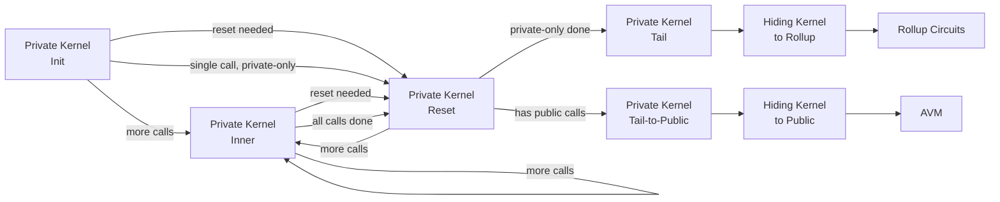
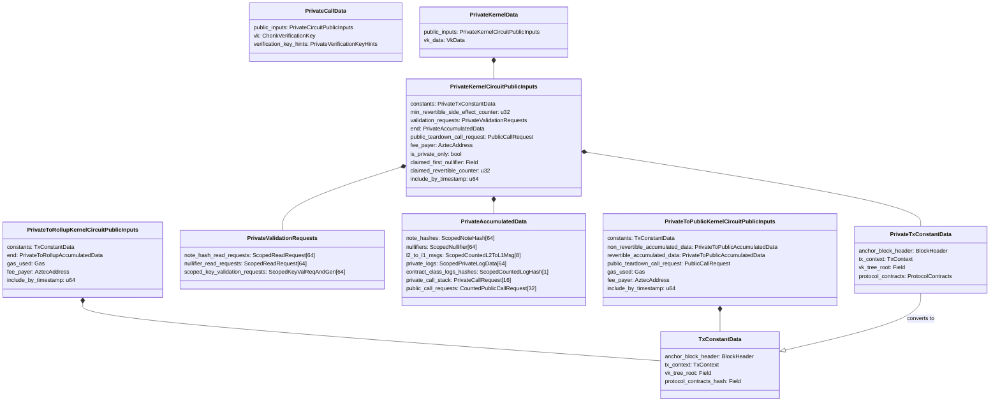

# Private Kernel Circuits

## Overview

This specification defines the private kernel circuit family: the circuits that process private function calls client-side and produce the proven transaction output that is submitted to the Aztec network. The private kernel circuits form an iterative chain that accumulates side effects from each private function call, validates read requests and key derivations, and finalizes the result for either direct rollup inclusion (private-only transactions) or handoff to public execution.

The private kernel circuit family consists of six circuit types:

1. **Private Kernel Init** — processes the first private function call and initializes kernel state
2. **Private Kernel Inner** — processes each subsequent private function call
3. **Private Kernel Reset** — validates read requests, squashes transient data, silos side effects, and pads arrays
4. **Private Kernel Tail** — finalizes a private-only transaction for rollup inclusion
5. **Private Kernel Tail-to-Public** — finalizes the private phase for transactions with public calls
6. **Hiding Kernel** (to-rollup and to-public variants) — converts the folding proof into a standard SNARK proof

The Init, Inner, and Reset circuits share the same intermediate public inputs structure (`PrivateKernelCircuitPublicInputs`). The Tail and Tail-to-Public circuits produce final output structures (`PrivateToRollupKernelCircuitPublicInputs` and `PrivateToPublicKernelCircuitPublicInputs` respectively) that are consumed by the rollup circuits or AVM.

**Cross-references:**
- Spec #1 (Protocol Overview & Architecture) — introduces the private execution phases
- Spec #2 (Constants) — defines per-call and per-transaction limits, VK tree indices, gas constants, and serialization lengths
- Spec #3 (Cryptographic Primitives) — specifies siloing, uniqueness derivation, and Merkle proof algorithms used by the kernel circuits
- Spec #4 (State Model & Merkle Trees) — defines the trees that read requests validate against
- Spec #5 (Transaction Format & Lifecycle) — defines the `Tx` object produced from kernel outputs, validation rules, and the transaction lifecycle

## Requirements

### R1: Iterative Accumulation

The kernel circuit chain MUST process private function calls iteratively, accumulating side effects into fixed-size arrays. Each circuit iteration MUST verify the proof from the previous iteration (except Init, which has no predecessor).

**Rationale:** Private functions are executed sequentially on the client. The iterative kernel design enables variable-length call chains while maintaining constant-size circuit structures.

### R2: Side Effect Integrity

The kernel circuits MUST ensure that all accumulated side effects (note hashes, nullifiers, L2-to-L1 messages, logs, public call requests) originate from verified private function executions. No side effect may be injected without a corresponding valid function proof.

**Rationale:** The kernel proof is the only evidence of correct private execution. Side effects not backed by proofs would allow arbitrary state manipulation.

### R3: Call Stack Management

The kernel circuits MUST maintain a private call stack. Each Inner circuit MUST pop one request from the stack, validate that the executed function matches the request, and push any new nested call requests. The Tail circuits MUST verify the call stack is empty.

**Rationale:** The call stack enforces that all requested function calls are actually executed and that no calls are skipped or fabricated.

### R4: Transient Data Elimination

Before finalization, the Reset circuit MUST squash transient note hash/nullifier pairs — cases where a note is created and nullified within the same transaction. Associated logs MUST also be removed.

**Rationale:** Transient data wastes block space and tree capacity. Squashing reduces the on-chain footprint and improves privacy by concealing intermediate state.

### R5: Siloing and Uniqueness

The Reset circuit MUST silo note hashes, nullifiers, and private log first fields to their originating contract addresses before the Tail circuit. Note hashes MUST be made globally unique using nonces derived from the first nullifier.

**Rationale:** Siloing prevents cross-contract interference (a contract cannot create a note hash or nullifier in another contract's namespace). Uniqueness prevents Faerie-Gold attacks where duplicate note hashes render notes unspendable.

### R6: Read Request Validation

All note hash read requests and nullifier read requests MUST be validated before the Tail circuit. Validation may be against pending data (within the same transaction) or settled data (historical state via Merkle membership proofs).

**Rationale:** Read requests prove that specific state exists, which is necessary for correct application logic (e.g., proving a note exists before nullifying it).

### R7: Privacy-Preserving Finalization

The Tail circuits MUST strip scoping information (contract addresses, side-effect counters) from accumulated data before producing final output. The Hiding Kernel MUST mask the ECC operation queue to ensure zero-knowledge.

**Rationale:** Scoping data would reveal which contract produced each side effect, breaking function privacy. The ECC op queue contains traces of all elliptic curve operations from private execution, which could leak information.

### R8: Revertibility Separation

For transactions with public calls, the Tail-to-Public circuit MUST split accumulated data into non-revertible and revertible sets based on the `min_revertible_side_effect_counter`.

**Rationale:** If public execution reverts, non-revertible effects (fee payment, setup) must persist while revertible effects are discarded.

## Specification

### Circuit Chain Overview

The private kernel circuits form an acyclic directed chain. Each circuit verifies its predecessor's proof and produces output for the next circuit:



The allowed predecessor circuits for each circuit type are enforced via verification key index checks:

| Circuit | Allowed Predecessors (VK Indices) |
|---|---|
| Init | None (entry point) |
| Inner | Init (0), Inner (1), Reset (23+) |
| Reset | Init (0), Inner (1), Reset (23+) |
| Tail | Init (0), Inner (1), Reset (23+) |
| Tail-to-Public | Init (0), Inner (1), Reset (23+) |
| Hiding Kernel to Rollup | Tail (2) |
| Hiding Kernel to Public | Tail-to-Public (3) |

### Intermediate Public Inputs

The Init, Inner, and Reset circuits all produce `PrivateKernelCircuitPublicInputs`, the intermediate state that flows through the chain:

| Field | Type | Description |
|---|---|---|
| `constants` | PrivateTxConstantData | Immutable data for the transaction |
| `min_revertible_side_effect_counter` | u32 | Counter separating non-revertible from revertible effects |
| `validation_requests` | PrivateValidationRequests | Pending read and key validation requests |
| `end` | PrivateAccumulatedData | Accumulated side effects |
| `public_teardown_call_request` | PublicCallRequest | Teardown function request (if any) |
| `fee_payer` | AztecAddress | Address paying transaction fees |
| `is_private_only` | bool | Whether transaction has no public calls |
| `claimed_first_nullifier` | Field | Hint for the first nullifier value |
| `claimed_revertible_counter` | u32 | Hint for the revertible counter |
| `include_by_timestamp` | u64 | Accumulated inclusion deadline |

**Serialization length:** `PRIVATE_KERNEL_CIRCUIT_PUBLIC_INPUTS_LENGTH = 3001` fields.

#### PrivateTxConstantData

| Field | Type | Size (fields) | Description |
|---|---|---|---|
| `anchor_block_header` | BlockHeader | 22 | Historical block header used as state anchor |
| `tx_context` | TxContext | 10 | Chain ID, version, gas settings |
| `vk_tree_root` | Field | 1 | Root of the verification key tree |
| `protocol_contracts` | ProtocolContracts | 10 | List of protocol contract addresses |

**Serialization length:** `COMBINED_CONSTANT_DATA_LENGTH = 43` fields.

The `PrivateTxConstantData` carries the full `ProtocolContracts` list during private execution. The Tail circuits convert this to `TxConstantData` by hashing the protocol contracts list into `protocol_contracts_hash`.

#### PrivateValidationRequests

| Field | Type | Max Count | Description |
|---|---|---|---|
| `note_hash_read_requests` | ScopedReadRequest[] | 64 | Requests to prove note hash existence |
| `nullifier_read_requests` | ScopedReadRequest[] | 64 | Requests to prove nullifier existence |
| `scoped_key_validation_requests_and_generators` | ScopedKeyValidationRequestAndGenerator[] | 64 | Requests to validate key derivations |

**Serialization length:** `PRIVATE_VALIDATION_REQUESTS_LENGTH = 771` fields.

All request arrays MUST be empty before the Tail circuit executes. The Reset circuit is responsible for processing and clearing these arrays.

#### PrivateAccumulatedData

| Field | Type | Max Count | Description |
|---|---|---|---|
| `note_hashes` | ScopedNoteHash[] | 64 | Note hashes with contract scope and counters |
| `nullifiers` | ScopedNullifier[] | 64 | Nullifiers with contract scope and counters |
| `l2_to_l1_msgs` | ScopedCountedL2ToL1Message[] | 8 | L2-to-L1 messages with scope and counters |
| `private_logs` | ScopedPrivateLogData[] | 64 | Private logs with scope and counters |
| `contract_class_logs_hashes` | ScopedCountedLogHash[] | 1 | Contract class log hashes |
| `private_call_stack` | PrivateCallRequest[] | 16 | Pending private call requests |
| `public_call_requests` | CountedPublicCallRequest[] | 32 | Enqueued public function calls |

**Serialization length:** `PRIVATE_ACCUMULATED_DATA_LENGTH = 2187` fields.

Each side effect is "scoped" — it carries the contract address and side-effect counter of the function that produced it. Scoping is used for siloing (binding to a contract namespace), revertibility determination (comparing counters to `min_revertible_side_effect_counter`), and transient data matching.

---

### Private Kernel Init

The Init circuit is the entry point of the private kernel chain. It processes the first private function call in a transaction and initializes the kernel state.

**VK Index:** `PRIVATE_KERNEL_INIT_VK_INDEX = 0`

#### Private Inputs

| Field | Type | Description |
|---|---|---|
| `tx_request` | TxRequest | The user's intent (origin, function, args hash, tx context, salt) |
| `private_call` | PrivateCallData | Proof and public inputs of the first function call |
| `vk_tree_root` | Field | Root of the VK tree for circuit validation |
| `protocol_contracts` | ProtocolContracts | List of protocol contract addresses |
| `is_private_only` | bool | Whether the transaction has only private calls |
| `first_nullifier_hint` | Field | Hint for the transaction's first nullifier |
| `revertible_counter_hint` | u32 | Hint for the min revertible side-effect counter |

#### Public Inputs (Output)

`PrivateKernelCircuitPublicInputs` — the intermediate kernel state.

#### Validation Rules

**V-Init-1: Function proof verification.** The Init circuit MUST verify the proof of the first private function call. The verification uses the function's verification key.

**V-Init-2: Transaction request matching.** The first function call MUST match the `tx_request`:
- `tx_request.origin == call.call_context.contract_address`
- `tx_request.function_data.selector == call.call_context.function_selector`
- `tx_request.function_data.is_private == true`
- `tx_request.args_hash == call.args_hash`
- `tx_request.tx_context == call.tx_context`

**V-Init-3: First call constraints.** The first function call MUST satisfy:
- `call.call_context.msg_sender == NULL_MSG_SENDER_CONTRACT_ADDRESS` (no caller)
- `call.call_context.is_static_call == false` (first call cannot be static)
- `call.start_side_effect_counter > 1` (counters 0 and 1 are reserved)

**V-Init-4: First nullifier hint.** The `first_nullifier_hint` MUST NOT be empty. If it equals the protocol nullifier value (`poseidon2_hash_with_separator(tx_request.serialize(), DOM_SEP__TX_REQUEST)`), the Init circuit inserts the protocol nullifier at index 0 of the nullifiers array with counter 1 and scope `NULL_MSG_SENDER_CONTRACT_ADDRESS`.

**V-Init-5: Contract address validation.** The contract address MUST be correctly derived. For regular contracts, the address is verified against the contract instance commitment. For protocol contracts, the address MUST appear in the `protocol_contracts` list.

**V-Init-6: Side-effect counter validation.** All side-effect counters within the function call MUST be unique and within the call's counter bounds (`start_side_effect_counter` to `end_side_effect_counter`).

**V-Init-7: Claimed length validation.** All claimed array lengths in the function's public inputs MUST NOT exceed the maximum per-call limits defined in Spec #2 (Constants).

**V-Init-8: Message sender validation.** All outgoing private call requests MUST have `msg_sender` equal to this function's contract address. Public call requests MUST have `msg_sender` equal to this function's contract address OR `NULL_MSG_SENDER_CONTRACT_ADDRESS` (for privacy).

#### Output Composition

The Init circuit initializes `PrivateKernelCircuitPublicInputs` by:
1. Setting `constants` from the function's `anchor_block_header`, `tx_context`, `vk_tree_root`, and `protocol_contracts`
2. Copying the function's side effects into the accumulated data arrays
3. Setting `claimed_first_nullifier` to `first_nullifier_hint`
4. Setting `claimed_revertible_counter` to `revertible_counter_hint`
5. Setting `is_private_only` from the input hint
6. Setting `fee_payer` if the function declares itself as fee payer
7. Inserting the protocol nullifier at index 0 if `first_nullifier_hint` equals the protocol nullifier
8. Setting `include_by_timestamp` from the function's `include_by_timestamp`

---

### Private Kernel Inner

The Inner circuit processes each subsequent private function call after the first. It is invoked iteratively for each call in the private call stack.

**VK Index:** `PRIVATE_KERNEL_INNER_VK_INDEX = 1`

#### Private Inputs

| Field | Type | Description |
|---|---|---|
| `previous_kernel` | PrivateKernelData | Previous kernel proof, VK data, and public inputs |
| `private_call` | PrivateCallData | Proof and public inputs of the current function call |

The `PrivateKernelData` wraps the previous kernel's output:

| Field | Type | Description |
|---|---|---|
| `public_inputs` | PrivateKernelCircuitPublicInputs | Previous kernel output |
| `vk_data` | VkData | Verification key, its tree index, and Merkle sibling path |

The `VkData` structure contains:

| Field | Type | Description |
|---|---|---|
| `vk` | VerificationKey | The verification key (key fields + hash) |
| `leaf_index` | u32 | Index in the VK tree |
| `sibling_path` | [Field; VK_TREE_HEIGHT] | Merkle path to the VK in the VK tree |

The previous kernel proof is verified using `PROOF_TYPE_HN` (HyperNova folding proof) normally, or `PROOF_TYPE_HN_TAIL` for the final kernel iteration (used by Tail and Tail-to-Public). VK index validation maps any index >= `PRIVATE_KERNEL_RESET_VK_INDEX` (23) to the base reset index, allowing all reset variants to be accepted with a single entry in the allowed indices list.

#### Public Inputs (Output)

`PrivateKernelCircuitPublicInputs` — updated intermediate kernel state.

#### Validation Rules

**V-Inner-1: Previous kernel proof verification.** The Inner circuit MUST verify the proof from the previous kernel circuit. The verification key MUST be validated against the VK tree using the provided Merkle path.

**V-Inner-2: VK index validation.** The previous kernel's VK index MUST be one of: `PRIVATE_KERNEL_INIT_VK_INDEX` (0), `PRIVATE_KERNEL_INNER_VK_INDEX` (1), or `PRIVATE_KERNEL_RESET_VK_INDEX` (23) or a reset variant index.

**V-Inner-3: Call request matching.** The current private call MUST match the top entry on the previous kernel's `private_call_stack`:
- `request.call_context == call.call_context`
- `request.args_hash == call.args_hash`
- `request.returns_hash == call.returns_hash`
- `request.start_side_effect_counter == call.start_side_effect_counter`
- `request.end_side_effect_counter == call.end_side_effect_counter`

**V-Inner-4: Constant data consistency.** The function's `anchor_block_header` and `tx_context` MUST match the previous kernel's constants.

**V-Inner-5: Function proof verification.** Same as V-Init-1.

**V-Inner-6: Contract address validation.** Same as V-Init-5.

**V-Inner-7: Side-effect counter validation.** Same as V-Init-6.

**V-Inner-8: Claimed length validation.** Same as V-Init-7.

**V-Inner-9: Message sender validation.** Same as V-Init-8.

**V-Inner-10: Static call enforcement.** If the function is a static call (`call_context.is_static_call == true`), the following MUST hold:
- No note hashes, nullifiers, L2-to-L1 messages, private logs, or contract class logs
- All nested call requests (private and public) MUST also be static
- The function MUST NOT declare itself as fee payer
- The function MUST NOT set `min_revertible_side_effect_counter`

#### Output Composition

The Inner circuit updates `PrivateKernelCircuitPublicInputs` by:
1. Popping the top call request from `private_call_stack`
2. Appending the function's side effects to the accumulated data arrays
3. Appending the function's validation requests
4. Pushing the function's nested private call requests onto `private_call_stack`
5. Updating `fee_payer` if the function declares itself as fee payer (and no fee payer was set)
6. Updating `min_revertible_side_effect_counter` if the function sets it (taking the minimum)
7. Updating `include_by_timestamp` (taking the minimum of previous and current values)

---

### Private Kernel Reset

The Reset circuit processes validation requests, squashes transient data, silos side effects, and pads arrays. It is parameterized — multiple circuit variants exist with different capacities for each operation type.

**VK Index:** `PRIVATE_KERNEL_RESET_VK_INDEX = 23` (base index; variants occupy indices 23+)

#### Private Inputs

| Field | Type | Description |
|---|---|---|
| `previous_kernel` | PrivateKernelData | Previous kernel proof, VK data, and public inputs |
| `padded_side_effects` | PaddedSideEffects | Random padding values for array obfuscation |
| `hints` | PrivateKernelResetHints | Hints for each reset operation |

The `PrivateKernelResetHints` structure contains:

| Field | Type | Description |
|---|---|---|
| `note_hash_read_request_hints` | NoteHashReadRequestHints | Hints for validating note hash read requests |
| `nullifier_read_request_hints` | NullifierReadRequestHints | Hints for validating nullifier read requests |
| `key_validation_hints` | KeyValidationHint[] | Hints for validating key derivation requests |
| `transient_data_squashing_hints` | TransientDataSquashingHint[] | Hints for identifying transient note/nullifier pairs |

#### Public Inputs (Output)

`PrivateKernelCircuitPublicInputs` — updated intermediate kernel state with processed requests.

#### Parameterization

The Reset circuit is generic over the number of each operation it can perform in a single invocation:

| Parameter | Description |
|---|---|
| `NoteHashPendingReadAmount` | Number of note hash pending read requests to validate |
| `NoteHashSettledReadAmount` | Number of note hash settled read requests to validate |
| `NullifierPendingReadAmount` | Number of nullifier pending read requests to validate |
| `NullifierSettledReadAmount` | Number of nullifier settled read requests to validate |
| `KeyValidationAmount` | Number of key validation requests to process |
| `TransientDataSquashingAmount` | Number of transient note/nullifier pairs to squash |
| `NoteHashSiloingAmount` | Number of note hashes to silo |
| `NullifierSiloingAmount` | Number of nullifiers to silo |
| `PrivateLogSiloingAmount` | Number of private logs to silo |

Different parameter combinations yield different circuit variants, each with its own verification key. The PXE selects the smallest variant sufficient for the current transaction's needs, minimizing proving time.

A single Reset invocation processes only up to the parameterized number of items for each operation. Any unprocessed read requests, key validation requests, or transient pairs are propagated unchanged to the output and MUST be resolved by a subsequent Reset circuit before the Tail circuit executes. Multiple Reset invocations may be chained (Reset → Inner → Reset, or Reset → Reset) to handle transactions that exceed a single variant's capacity.

#### Operations

The Reset circuit performs the following operations (each optional based on parameterization):

##### Read Request Validation

Read requests can be resolved in two ways:

**Pending reads** — the requested value exists in the current transaction's accumulated data:
- For note hash read requests: a note hash in `end.note_hashes` matches the requested value
- For nullifier read requests: a nullifier in `end.nullifiers` matches the requested value
- The matching item's counter MUST be less than the read request's counter (the value was emitted before the read)
- The matching item's `contract_address` MUST equal the read request's `contract_address`

A pending read request can only be resolved if the referenced value has already been accumulated into the kernel's public inputs. If the value was emitted in a nested execution whose Inner kernel iteration has not yet been processed, the read request cannot be verified and MUST be propagated to a subsequent Reset circuit.

**Settled reads** — the requested value exists in historical state:
- The hint provides a Merkle membership proof against the `anchor_block_header`'s tree root
- For note hashes: proof against the note hash tree (height 42)
- For nullifiers: proof against the nullifier tree (height 42), where the leaf preimage contains the nullifier value

After validation, processed read requests are removed from the `validation_requests` arrays.

##### Key Validation

Key validation requests verify that application-specific nullifier keys are correctly derived from master keys:

```
app_nullifier_key = poseidon2_hash_with_separator(
    [master_nhk.hi, master_nhk.lo, contract_address],
    DOM_SEP__NHK_M
)
```

The hint provides the secret key (`sk_app`) and the public key point. The circuit verifies:
1. The secret key derives to the expected public key via scalar multiplication
2. The derived key matches the request's `app_key`

After validation, processed requests are removed from the `validation_requests` arrays.

##### Transient Data Squashing

A note hash and nullifier are "transient" and eligible for squashing if all of the following hold:
1. The nullifier's `note_hash` field references the note hash's value
2. Both belong to the same `contract_address`
3. The nullifier's counter is greater than the note hash's counter (temporal ordering)
4. If the nullifier is revertible (counter > `min_revertible_side_effect_counter`), the note hash MUST also be revertible

The revertibility constraint prevents squashing a non-revertible note hash with a revertible nullifier. If such a pair were squashed and public execution later reverted, the non-revertible note hash would be lost — violating the guarantee that non-revertible effects always persist.

For each transient pair identified by the hints:
1. Verify the note hash and nullifier match (value linkage and contract address)
2. Remove both from their respective arrays
3. Remove any private logs whose `note_hash_counter` matches the squashed note hash's counter and whose `contract_address` matches the note hash's contract address

Transient data squashing is not required to process all eligible pairs at once. If a pending note hash is still referenced by an unresolved read request, it MUST NOT be squashed until after that read request has been validated and cleared by a prior Reset invocation.

##### Siloing

Siloing binds side effects to their originating contract address. The Reset circuit applies the following transformations:

**Note hash siloing and uniqueness:**
```
siloed_note_hash = poseidon2_hash_with_separator(
    [contract_address, inner_note_hash],
    DOM_SEP__SILOED_NOTE_HASH
)
note_nonce = poseidon2_hash_with_separator(
    [claimed_first_nullifier, note_index],
    DOM_SEP__NOTE_HASH_NONCE
)
unique_note_hash = poseidon2_hash_with_separator(
    [note_nonce, siloed_note_hash],
    DOM_SEP__UNIQUE_NOTE_HASH
)
```

Where `note_index` is the note hash's position within the transaction's note hash array.

**Nullifier siloing:**
```
siloed_nullifier = poseidon2_hash_with_separator(
    [contract_address, inner_nullifier],
    DOM_SEP__SILOED_NULLIFIER
)
```

The protocol nullifier (at index 0, scoped to `NULL_MSG_SENDER_CONTRACT_ADDRESS`) is already a siloed value and MUST NOT be siloed again.

**Private log siloing:**
```
siloed_first_field = poseidon2_hash_with_separator(
    [contract_address, inner_first_field],
    DOM_SEP__PRIVATE_LOG_FIRST_FIELD
)
```

Only the first field of each private log is siloed. The remaining fields are unchanged.

After siloing, the scoping information (contract address) on each side effect is cleared, as it is no longer needed and would leak privacy information.

##### Padding

To obscure the true number of side effects in each array, the Reset circuit can pad arrays with random values provided via the `padded_side_effects` input. Padding values are inserted after the real side effects.

For the Reset circuit invoked before the Tail-to-Public circuit, the `PaddedSideEffects` structure provides:
- `note_hashes: [Field; 64]` — padding note hashes
- `nullifiers: [Field; 64]` — padding nullifiers
- `private_logs: [PrivateLog; 64]` — padding private logs

#### Validation Rules

**V-Reset-1: Previous kernel proof verification.** Same as V-Inner-1.

**V-Reset-2: VK index validation.** Same as V-Inner-2.

**V-Reset-3: Read request consistency.** Processed read requests MUST be removed from the output. Unprocessed requests MUST be propagated unchanged.

**V-Reset-4: Transient data consistency.** Squashed note hashes and nullifiers MUST be removed from the output. Associated logs MUST also be removed. Non-transient items MUST be propagated unchanged.

**V-Reset-5: Siloing correctness.** Siloed values MUST be computed using the correct domain separators and contract addresses. Already-siloed values (identified by a null contract scope) MUST NOT be siloed again.

**V-Reset-6: Padding correctness.** Padding values MUST be placed after real side effects. The output array lengths MUST correctly account for both real and padded items.

**V-Reset-7: Constant data preservation.** The `constants`, `claimed_first_nullifier`, `claimed_revertible_counter`, `is_private_only`, `fee_payer`, and `public_teardown_call_request` MUST be propagated unchanged.

---

### Private Kernel Tail

The Tail circuit finalizes a private-only transaction (no public function calls). It produces output that goes directly to the Hiding Kernel and then to the rollup circuits.

**VK Index:** `PRIVATE_KERNEL_TAIL_VK_INDEX = 2`

#### Private Inputs

| Field | Type | Description |
|---|---|---|
| `previous_kernel` | PrivateKernelData | Previous kernel proof, VK data, and public inputs |
| `include_by_timestamp_upper_bound` | u64 | Wallet-specified upper bound on inclusion deadline |

#### Public Inputs (Output)

`PrivateToRollupKernelCircuitPublicInputs`:

| Field | Type | Size (fields) | Description |
|---|---|---|---|
| `constants` | TxConstantData | 34 | Transaction constants (protocol contracts hashed) |
| `end` | PrivateToRollupAccumulatedData | 1371 | Final accumulated side effects |
| `gas_used` | Gas | 2 | Total gas consumed |
| `fee_payer` | AztecAddress | 1 | Fee payer address |
| `include_by_timestamp` | u64 | 1 | Inclusion deadline |

**Total serialization length:** `PRIVATE_TO_ROLLUP_KERNEL_CIRCUIT_PUBLIC_INPUTS_LENGTH = 1409` fields.

The `PrivateToRollupAccumulatedData` contains final, siloed, unique side effects with all scoping information removed:

| Field | Type | Max Count | Description |
|---|---|---|---|
| `note_hashes` | Field[] | 64 | Unique, siloed note hashes |
| `nullifiers` | Field[] | 64 | Siloed nullifiers |
| `l2_to_l1_msgs` | ScopedL2ToL1Message[] | 8 | L2-to-L1 messages |
| `private_logs` | PrivateLog[] | 64 | Private logs (first field siloed) |
| `contract_class_logs_hashes` | ScopedLogHash[] | 1 | Contract class log hashes |

#### Validation Rules

**V-Tail-1: Previous kernel proof verification.** The Tail circuit MUST verify the previous kernel proof as a "last kernel" (includes folding accumulator verification).

**V-Tail-2: Private call stack empty.** `previous_kernel.end.private_call_stack.length` MUST be 0.

**V-Tail-3: No public call requests.** `previous_kernel.end.public_call_requests.length` MUST be 0 and `previous_kernel.public_teardown_call_request` MUST be empty.

**V-Tail-4: is_private_only flag.** `previous_kernel.is_private_only` MUST be `true`.

**V-Tail-5: All validation requests processed.** All read request and key validation request arrays MUST have length 0.

**V-Tail-6: No transient data.** There MUST be no remaining transient note hash/nullifier pairs.

**V-Tail-7: All side effects siloed.** All note hashes, nullifiers, and private logs MUST have been siloed (no remaining contract scope).

**V-Tail-8: First nullifier claim.** `claimed_first_nullifier` MUST equal the value of the first nullifier in `end.nullifiers`.

**V-Tail-9: Revertible counter claim.** `claimed_revertible_counter` MUST equal `min_revertible_side_effect_counter`.

**V-Tail-10: Fee payer set.** `fee_payer` MUST NOT be empty (zero address).

**V-Tail-11: Include-by-timestamp bound.** The output `include_by_timestamp` MUST equal `min(previous_kernel.include_by_timestamp, include_by_timestamp_upper_bound)`. The upper bound allows the wallet to round timestamps for privacy (e.g., to the nearest hour).

**V-Tail-12: Include-by-timestamp duration.** The `include_by_timestamp` MUST NOT exceed `anchor_block_header.timestamp + MAX_INCLUDE_BY_TIMESTAMP_DURATION` (24 hours).

**V-Tail-13: Log length bounds.** Each private log length MUST NOT exceed `PRIVATE_LOG_SIZE_IN_FIELDS`. Each contract class log length MUST NOT exceed `CONTRACT_CLASS_LOG_SIZE_IN_FIELDS`.

**V-Tail-14: L2-to-L1 message recipient validation.** Each L2-to-L1 message recipient MUST be a valid Ethereum address.

#### Output Composition

The Tail circuit produces `PrivateToRollupKernelCircuitPublicInputs` by:
1. Converting `CombinedConstantData` to `TxConstantData` (hashing protocol contracts)
2. Sorting accumulated data by side-effect counter
3. Stripping scoping information (contract addresses, counters) via `expose_to_public()`
4. Computing `gas_used` from side-effect counts and gas constants
5. Applying `include_by_timestamp_upper_bound`

#### Gas Metering

The Tail circuit computes `gas_used` from the accumulated side effects:

```
da_gas = (num_note_hashes + num_nullifiers + num_l2_to_l1_msgs
         + sum(private_log_lengths) + num_private_logs
         + sum(contract_class_log_lengths) + num_contract_class_logs)
         * DA_BYTES_PER_FIELD * DA_GAS_PER_BYTE

l2_gas = num_note_hashes * L2_GAS_PER_NOTE_HASH
       + num_nullifiers * L2_GAS_PER_NULLIFIER
       + num_l2_to_l1_msgs * L2_GAS_PER_L2_TO_L1_MSG
       + num_private_logs * L2_GAS_PER_PRIVATE_LOG
       + num_contract_class_logs * L2_GAS_PER_CONTRACT_CLASS_LOG

gas_used = Gas::tx_overhead() + Gas(da_gas, l2_gas)
```

Where `Gas::tx_overhead()` is `Gas(FIXED_DA_GAS, FIXED_L2_GAS)` = `Gas(512, 512)`.

---

### Private Kernel Tail-to-Public

The Tail-to-Public circuit finalizes the private phase for transactions that include public function calls. It splits accumulated data into non-revertible and revertible sets.

**VK Index:** `PRIVATE_KERNEL_TAIL_TO_PUBLIC_VK_INDEX = 3`

#### Private Inputs

| Field | Type | Description |
|---|---|---|
| `previous_kernel` | PrivateKernelData | Previous kernel proof, VK data, and public inputs |
| `padded_side_effect_amounts` | PaddedSideEffectAmounts | Counts of padding items per revertibility set |
| `include_by_timestamp_upper_bound` | u64 | Wallet-specified upper bound on inclusion deadline |

The `PaddedSideEffectAmounts` structure specifies how many padding items to add to each array:

| Field | Type | Description |
|---|---|---|
| `non_revertible_note_hashes` | u32 | Padding count for non-revertible note hashes |
| `revertible_note_hashes` | u32 | Padding count for revertible note hashes |
| `non_revertible_nullifiers` | u32 | Padding count for non-revertible nullifiers |
| `revertible_nullifiers` | u32 | Padding count for revertible nullifiers |
| `non_revertible_private_logs` | u32 | Padding count for non-revertible private logs |
| `revertible_private_logs` | u32 | Padding count for revertible private logs |

#### Public Inputs (Output)

`PrivateToPublicKernelCircuitPublicInputs`:

| Field | Type | Size (fields) | Description |
|---|---|---|---|
| `constants` | TxConstantData | 34 | Transaction constants |
| `non_revertible_accumulated_data` | PrivateToPublicAccumulatedData | 1499 | Non-revertible side effects |
| `revertible_accumulated_data` | PrivateToPublicAccumulatedData | 1499 | Revertible side effects |
| `public_teardown_call_request` | PublicCallRequest | 4 | Teardown function request |
| `gas_used` | Gas | 2 | Gas consumed in private execution |
| `fee_payer` | AztecAddress | 1 | Fee payer address |
| `include_by_timestamp` | u64 | 1 | Inclusion deadline |

**Total serialization length:** `PRIVATE_TO_PUBLIC_KERNEL_CIRCUIT_PUBLIC_INPUTS_LENGTH = 3040` fields.

Each `PrivateToPublicAccumulatedData` contains:

| Field | Type | Max Count | Description |
|---|---|---|---|
| `note_hashes` | Field[] | 64 | Siloed, unique note hashes |
| `nullifiers` | Field[] | 64 | Siloed nullifiers |
| `l2_to_l1_msgs` | ScopedL2ToL1Message[] | 8 | L2-to-L1 messages |
| `private_logs` | PrivateLog[] | 64 | Private logs |
| `contract_class_logs_hashes` | ScopedLogHash[] | 1 | Contract class log hashes |
| `public_call_requests` | PublicCallRequest[] | 32 | Enqueued public calls |

#### Validation Rules

All Tail validation rules (V-Tail-1 through V-Tail-14) apply, with the following modifications:

**V-TailPub-1: Has public calls.** `previous_kernel.end.public_call_requests.length` MUST be non-zero OR `previous_kernel.public_teardown_call_request` MUST be non-empty.

**V-TailPub-2: is_private_only flag.** `previous_kernel.is_private_only` MUST be `false`.

**V-TailPub-3: min_revertible_side_effect_counter set.** `min_revertible_side_effect_counter` MUST NOT be 0 (it must have been set by some function call).

**V-TailPub-4: First nullifier non-revertible.** The first nullifier's counter MUST be less than `min_revertible_side_effect_counter`. The first nullifier MUST always be non-revertible.

**V-TailPub-5: Correct split.** Side effects with counter < `min_revertible_side_effect_counter` MUST appear in `non_revertible_accumulated_data`. Side effects with counter >= `min_revertible_side_effect_counter` MUST appear in `revertible_accumulated_data`.

**V-TailPub-6: Padding amounts.** The total items in each output array MUST equal the real items plus the padding amounts specified in `padded_side_effect_amounts`.

#### Output Composition

The Tail-to-Public circuit produces `PrivateToPublicKernelCircuitPublicInputs` by:
1. Sorting all accumulated data by side-effect counter
2. Splitting into non-revertible and revertible sets based on `min_revertible_side_effect_counter`
3. Stripping scoping information via `expose_to_public()`
4. Computing `gas_used` (using AVM gas costs for note hashes and nullifiers since they will be processed by the AVM)
5. Adding `teardown_gas_limits` to `gas_used` if a teardown call is present
6. Adding `FIXED_AVM_STARTUP_L2_GAS` per public call request to `gas_used`

#### Gas Metering (Public Transaction)

For transactions with public calls, the gas metering uses AVM-compatible costs:

```
l2_gas = num_note_hashes * AVM_EMITNOTEHASH_BASE_L2_GAS
       + num_nullifiers * AVM_EMITNULLIFIER_BASE_L2_GAS
       + num_l2_to_l1_msgs * AVM_SENDL2TOL1MSG_BASE_L2_GAS
       + num_private_logs * L2_GAS_PER_PRIVATE_LOG
       + num_contract_class_logs * L2_GAS_PER_CONTRACT_CLASS_LOG
       + num_public_call_requests * FIXED_AVM_STARTUP_L2_GAS

gas_used = Gas::tx_overhead() + Gas(da_gas, l2_gas) + teardown_gas_limits
```

---

### Hiding Kernel

The Hiding Kernel circuits are the final step in client-side proving. They convert the HyperNova folding proof (produced by the Chonk IVC proving system) into a standard SNARK proof that can be verified publicly without leaking information from the ECC operation queue.

There are two variants:

#### Hiding Kernel to Rollup

For private-only transactions.

**VK Index:** `HIDING_KERNEL_TO_ROLLUP_VK_INDEX = 4`

**Private Inputs:**

| Field | Type | Description |
|---|---|---|
| `previous_kernel_public_inputs` | PrivateToRollupKernelCircuitPublicInputs | Output from the Tail circuit |
| `previous_kernel_vk_data` | VkData | Verification key data for the Tail circuit |

**Public Inputs (Output):** `PrivateToRollupKernelCircuitPublicInputs` — passed through unchanged.

**Validation Rules:**

- **V-Hid-R-1:** The circuit MUST verify the previous kernel's folding proof and decider proof using `PROOF_TYPE_HN_FINAL`.
- **V-Hid-R-2:** The VK index MUST equal `PRIVATE_KERNEL_TAIL_VK_INDEX` (2).
- **V-Hid-R-3:** The VK MUST exist in the VK tree at the declared index (verified via Merkle membership proof against `constants.vk_tree_root`).

#### Hiding Kernel to Public

For transactions with public calls.

**VK Index:** `HIDING_KERNEL_TO_PUBLIC_VK_INDEX = 5`

**Private Inputs:**

| Field | Type | Description |
|---|---|---|
| `previous_kernel_public_inputs` | PrivateToPublicKernelCircuitPublicInputs | Output from the Tail-to-Public circuit |
| `previous_kernel_vk_data` | VkData | Verification key data for the Tail-to-Public circuit |

**Public Inputs (Output):** `PrivateToPublicKernelCircuitPublicInputs` — passed through unchanged.

**Validation Rules:**

- **V-Hid-P-1:** The circuit MUST verify the previous kernel's folding proof and decider proof using `PROOF_TYPE_HN_FINAL`.
- **V-Hid-P-2:** The VK index MUST equal `PRIVATE_KERNEL_TAIL_TO_PUBLIC_VK_INDEX` (3).
- **V-Hid-P-3:** The VK MUST exist in the VK tree at the declared index.

#### Why the Hiding Kernel Exists

The private kernel circuits (Init, Inner, Reset, Tail) use the **Chonk** proving system, which is based on HyperNova incremental folding. This approach is memory-efficient for client-side proving because each circuit iteration folds into a running accumulator rather than producing a full proof.

However, the folding accumulator and the ECC operation queue produced during this process contain traces of all elliptic curve operations from private execution. If exposed directly, these traces could reveal information about the executed private functions.

The Hiding Kernel:
1. Recursively verifies the final HyperNova folding proof and decider proof
2. Masks the ECC op queue data to ensure zero-knowledge
3. Is proven using the **MegaZK** flavor, producing a standard proof

The resulting proof can be verified by the rollup circuits or submitted to the network without leaking private execution details.

---

### Private Call Data

Each private function call is represented by `PrivateCallData`, which bundles the function's proof and execution context:

| Field | Type | Description |
|---|---|---|
| `public_inputs` | PrivateCircuitPublicInputs | The function's declared inputs/outputs |
| `vk` | ChonkVerificationKey | Verification key for the function circuit |
| `verification_key_hints` | PrivateVerificationKeyHints | Hints for contract address derivation |

The `PrivateVerificationKeyHints` contains data needed to validate the contract address:

| Field | Type | Description |
|---|---|---|
| `salted_initialization_hash` | SaltedInitializationHash | Salted initialization data |
| `public_keys` | PublicKeys | Contract's public keys |
| `contract_class_artifact_hash` | Field | Hash of the contract class artifact |
| `contract_class_public_bytecode_commitment` | Field | Public bytecode commitment |
| `function_leaf_membership_witness` | MembershipWitness | Proof that the function exists in the contract's function tree |
| `updated_class_id_witness` | MembershipWitness | Proof for updated class ID (for upgradeable contracts) |
| `updated_class_id_leaf` | PublicDataTreeLeafPreimage | Leaf preimage for the class ID update |
| `updated_class_id_delayed_public_mutable_values` | [Field; 3] | Delayed update values |

The function proof is verified using `PROOF_TYPE_OINK` for the first call (in Init) and `PROOF_TYPE_HN` for subsequent calls (in Inner). Verification is performed via `std::verify_proof_with_type` using the Chonk databus approach — public inputs are committed as part of the proof rather than passed separately.

Every private function circuit has customizable private inputs (tailored to the application's needs), but MUST produce public inputs conforming to the `PrivateCircuitPublicInputs` ABI. This standardized format enables the kernel circuits to interpret and validate the actions of any private function without knowledge of that function's internal logic.

The `PrivateCircuitPublicInputs` contains:

| Field | Type | Description |
|---|---|---|
| `call_context` | CallContext | Contract address, msg_sender, function selector, is_static |
| `args_hash` | Field | Hash of function arguments |
| `returns_hash` | Field | Hash of function return values |
| `start_side_effect_counter` | u32 | First counter for this call's side effects |
| `end_side_effect_counter` | u32 | Last counter for this call's side effects |
| `note_hash_read_requests` | BoundedVec | Note existence proofs requested |
| `nullifier_read_requests` | BoundedVec | Nullifier existence proofs requested |
| `key_validation_requests_and_generators` | BoundedVec | Key derivation validations requested |
| `note_hashes` | BoundedVec | Note hashes created (max 16 per call) |
| `nullifiers` | BoundedVec | Nullifiers emitted (max 16 per call) |
| `l2_to_l1_msgs` | BoundedVec | L2-to-L1 messages (max 8 per call) |
| `private_logs` | BoundedVec | Encrypted logs (max 16 per call) |
| `contract_class_logs_hashes` | BoundedVec | Contract class logs (max 1 per call) |
| `private_call_requests` | BoundedVec | Nested private call requests (max 8 per call) |
| `public_call_requests` | BoundedVec | Enqueued public call requests (max 32 per call) |
| `public_teardown_call_request` | PublicCallRequest | Teardown function request |
| `anchor_block_header` | BlockHeader | State anchor for this execution |
| `tx_context` | TxContext | Transaction context |
| `min_revertible_side_effect_counter` | u32 | Where revertible phase begins |
| `is_fee_payer` | bool | Whether this function pays fees |
| `include_by_timestamp` | u64 | Required inclusion deadline |
| `expected_non_revertible_side_effect_counter` | u32 | Expected counter for phase validation |
| `expected_revertible_side_effect_counter` | u32 | Expected counter for phase validation |

**Serialization length:** `PRIVATE_CIRCUIT_PUBLIC_INPUTS_LENGTH = 902` fields.

### Side-Effect Counter Model

Every side effect in the private kernel carries a monotonically increasing counter that establishes a total ordering within the transaction:

- **Counter 0:** Reserved (unused)
- **Counter 1:** Reserved for the protocol nullifier
- **Counter 2+:** Available for function side effects

Counters are assigned within each function call, bounded by `[start_side_effect_counter, end_side_effect_counter]`. The Init circuit validates that the first call starts above counter 1. The Inner circuit validates that nested calls have counters within the parent call's range.

The counter is used for:
1. **Temporal ordering** — determining which side effects came before others
2. **Revertibility** — side effects with counter < `min_revertible_side_effect_counter` are non-revertible
3. **Transient data matching** — a nullifier can only squash a note hash with a lower counter
4. **Sorting** — the Tail circuits sort side effects by counter for deterministic output

## Data Structures



### Key Type Sizes

| Structure | Constant | Size (fields) |
|---|---|---|
| PrivateCircuitPublicInputs | `PRIVATE_CIRCUIT_PUBLIC_INPUTS_LENGTH` | 902 |
| PrivateKernelCircuitPublicInputs | `PRIVATE_KERNEL_CIRCUIT_PUBLIC_INPUTS_LENGTH` | 3001 |
| PrivateToRollupKernelCircuitPublicInputs | `PRIVATE_TO_ROLLUP_KERNEL_CIRCUIT_PUBLIC_INPUTS_LENGTH` | 1409 |
| PrivateToPublicKernelCircuitPublicInputs | `PRIVATE_TO_PUBLIC_KERNEL_CIRCUIT_PUBLIC_INPUTS_LENGTH` | 3040 |
| PrivateValidationRequests | `PRIVATE_VALIDATION_REQUESTS_LENGTH` | 771 |
| PrivateAccumulatedData | `PRIVATE_ACCUMULATED_DATA_LENGTH` | 2187 |
| PrivateToRollupAccumulatedData | `PRIVATE_TO_ROLLUP_ACCUMULATED_DATA_LENGTH` | 1371 |
| PrivateToPublicAccumulatedData | `PRIVATE_TO_PUBLIC_ACCUMULATED_DATA_LENGTH` | 1499 |
| PrivateTxConstantData | `COMBINED_CONSTANT_DATA_LENGTH` | 43 |
| TxConstantData | `TX_CONSTANT_DATA_LENGTH` | 34 |
| CallContext | `CALL_CONTEXT_LENGTH` | 4 |
| PrivateCallRequest | `PRIVATE_CALL_REQUEST_LENGTH` | 8 |
| PublicCallRequest | `PUBLIC_CALL_REQUEST_LENGTH` | 4 |

### VK Tree Index Summary

| Circuit | Constant | Index |
|---|---|---|
| Private Kernel Init | `PRIVATE_KERNEL_INIT_VK_INDEX` | 0 |
| Private Kernel Inner | `PRIVATE_KERNEL_INNER_VK_INDEX` | 1 |
| Private Kernel Tail | `PRIVATE_KERNEL_TAIL_VK_INDEX` | 2 |
| Private Kernel Tail-to-Public | `PRIVATE_KERNEL_TAIL_TO_PUBLIC_VK_INDEX` | 3 |
| Hiding Kernel to Rollup | `HIDING_KERNEL_TO_ROLLUP_VK_INDEX` | 4 |
| Hiding Kernel to Public | `HIDING_KERNEL_TO_PUBLIC_VK_INDEX` | 5 |
| Private Kernel Reset (base) | `PRIVATE_KERNEL_RESET_VK_INDEX` | 23 |

Reset circuit variants occupy indices starting at 23. The specific variant used depends on the parameterization.

## Validation Rules

This section consolidates all validation rules across the circuit family.

### Common Validations (Init and Inner)

| Rule | Description |
|---|---|
| Function proof | The private function's proof MUST verify against its verification key |
| Contract address | The contract address MUST be correctly derived from the function leaf and class data |
| Counter bounds | Side-effect counters MUST be unique and within `[start_counter, end_counter]` |
| Claimed lengths | Array lengths MUST NOT exceed per-call maximums (Spec #2) |
| Message senders | Outgoing call requests MUST have correct `msg_sender` |
| Expected counters | If set, `expected_non_revertible_counter` and `expected_revertible_counter` MUST be consistent with `claimed_revertible_counter` |

### Previous Kernel Validations (Inner, Reset, Tail)

| Rule | Description |
|---|---|
| Proof verification | Previous kernel proof MUST verify |
| VK in tree | Previous kernel VK MUST exist at the claimed index in the VK tree |
| VK index | Previous kernel VK index MUST be in the allowed set for this circuit type |
| Constant consistency | `anchor_block_header` and `tx_context` MUST match between calls |

### Tail Validations (Tail and Tail-to-Public)

| Rule | Description |
|---|---|
| Call stack empty | `private_call_stack.length == 0` |
| Requests cleared | All validation request arrays MUST have length 0 |
| No transient data | No remaining transient note hash/nullifier pairs |
| All siloed | All note hashes, nullifiers, and private logs MUST be siloed |
| Fee payer set | `fee_payer` MUST NOT be empty |
| First nullifier claim | `claimed_first_nullifier` MUST match `end.nullifiers[0]` |
| Revertible counter claim | `claimed_revertible_counter` MUST match `min_revertible_side_effect_counter` |
| Timestamp bound | `include_by_timestamp <= anchor_timestamp + MAX_INCLUDE_BY_TIMESTAMP_DURATION` |
| Log lengths | Private logs and contract class logs MUST NOT exceed maximum sizes |

### Tail-Specific Rules

| Rule | Tail (private-only) | Tail-to-Public |
|---|---|---|
| `is_private_only` | MUST be `true` | MUST be `false` |
| Public calls | MUST have none | MUST have at least one |
| `min_revertible_counter` | No restriction | MUST be non-zero |
| First nullifier | No phase restriction | Counter MUST be < `min_revertible_counter` |

### Hiding Kernel Validations

| Rule | Description |
|---|---|
| Folding proof | MUST verify using `PROOF_TYPE_HN_FINAL` |
| VK index | MUST match the expected Tail or Tail-to-Public index |
| VK in tree | MUST exist in the VK tree at the declared index |

## Security Considerations

### Side-Effect Counter Manipulation

An attacker could attempt to inject side effects with fabricated counters to affect revertibility classification or transient data squashing.

**Mitigation:** Each function call's counters are bounded by `[start_side_effect_counter, end_side_effect_counter]`, which are declared in the call request and validated by the parent caller. Counter uniqueness is enforced within each call. The Init circuit ensures counters start above the reserved range.

### Protocol Nullifier Bypass

Without the protocol nullifier, a transaction with no user-emitted nullifiers would have no first nullifier, making note hash nonces unpredictable and breaking Faerie-Gold protection.

**Mitigation:** The Init circuit checks `first_nullifier_hint` and injects the protocol nullifier when needed. The Tail circuit validates that `claimed_first_nullifier` matches the actual first nullifier. The protocol nullifier uses the `TxRequest` hash as its value, ensuring per-transaction uniqueness.

### Transient Data Squashing Soundness

Incorrect transient data squashing could allow an attacker to remove non-transient side effects or retain transient ones.

**Mitigation:** The Reset circuit validates each squashing hint by checking value linkage (the nullifier references the note hash), temporal ordering (nullifier counter > note hash counter), and contract scope matching. The Tail circuit validates that no remaining transient pairs exist.

### Padding and Privacy

Without padding, the number of real side effects in each array would be visible, potentially revealing information about transaction structure.

**Mitigation:** The Reset circuit adds random padding values to side-effect arrays. The `PaddedSideEffects` input provides fresh random values for each transaction. For transactions with public calls, `PaddedSideEffectAmounts` specifies per-revertibility-set padding counts.

### VK Tree Integrity

If an attacker could substitute a malicious verification key, they could generate valid-looking proofs for incorrect circuits.

**Mitigation:** Every kernel circuit validates its predecessor's VK against the VK tree using a Merkle membership proof. The VK tree root is propagated through the entire chain and output in the final public inputs for L1 verification.

### Client-Side Proving and Trust

All private kernel circuits execute on the client (PXE). The client is trusted to provide correct witness data (hints, Merkle paths), but the circuit constraints ensure that:
- All proofs verify correctly
- All state transitions are consistent
- All hints match the actual accumulated data

Even a malicious client cannot produce a valid proof with incorrect state transitions.

## Open Questions

1. **Reset circuit variant enumeration**: The exact set of Reset circuit variants (parameter combinations) and their VK indices is determined at compile time and depends on the application ecosystem's needs. Should the spec enumerate all current variants, or leave this as an implementation detail constrained only by the VK tree?

2. **Padding randomness source**: The `PaddedSideEffects` values are provided by the PXE. If padding values are predictable or follow a pattern, they could be distinguished from real side effects. Should the spec prescribe a specific randomness generation method?

3. **include_by_timestamp rounding**: The wallet can round `include_by_timestamp` down for privacy (e.g., to the nearest hour). This creates a trade-off between privacy and transaction validity window. Should the spec recommend specific rounding strategies?

4. **Fee payer nomination timing**: Currently, any private function can nominate itself as fee payer, and the first nomination wins. If the fee payer is nominated in a revertible function, and that function's effects are later discarded, the fee payer designation persists. Should fee payer nomination be restricted to non-revertible functions?

5. **Contract updates and include_by_timestamp**: When a function reads a contract instance that has a scheduled update, the kernel computes an `include_by_timestamp` to ensure the transaction is included before the update takes effect. The interaction between multiple such constraints and the wallet's upper bound needs further specification.

6. **Chonk proof system evolution**: The Hiding Kernel's existence is tied to the Chonk/HyperNova proving system. If the proving system changes (e.g., to a direct IVC system that produces standard proofs), the Hiding Kernel may become unnecessary. How should this migration be handled?

## References

- Spec #1: Protocol Overview & Architecture — transaction lifecycle and private execution phases
- Spec #2: Constants — VK indices, per-call/per-transaction limits, gas constants, domain separators
- Spec #3: Cryptographic Primitives — siloing, uniqueness derivation, Merkle proof algorithms
- Spec #4: State Model & Merkle Trees — note hash tree, nullifier tree structure and proofs
- Spec #5: Transaction Format & Lifecycle — final transaction structure, mempool validation
- `noir-projects/noir-protocol-circuits/crates/private-kernel-lib/` — Noir circuit implementations
- `noir-projects/noir-protocol-circuits/crates/private-kernel-init/` — Init circuit entry point
- `noir-projects/noir-protocol-circuits/crates/private-kernel-inner/` — Inner circuit entry point
- `noir-projects/noir-protocol-circuits/crates/private-kernel-reset/` — Reset circuit entry point
- `noir-projects/noir-protocol-circuits/crates/private-kernel-tail/` — Tail circuit entry point
- `noir-projects/noir-protocol-circuits/crates/private-kernel-tail-to-public/` — Tail-to-Public circuit entry point
- `noir-projects/noir-protocol-circuits/crates/types/src/abis/` — Data structure definitions
