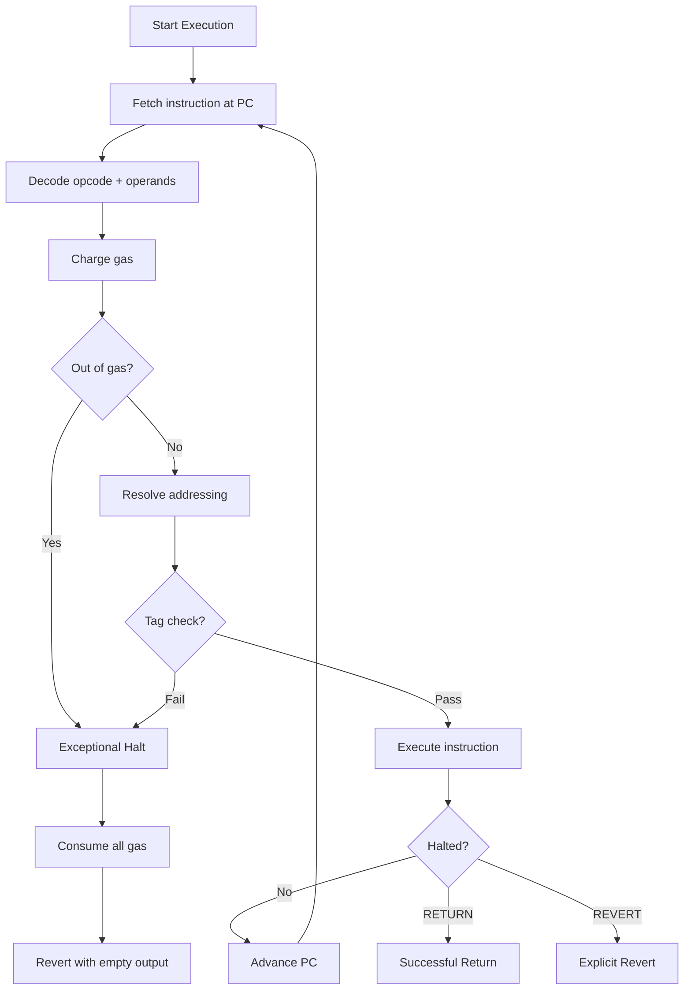
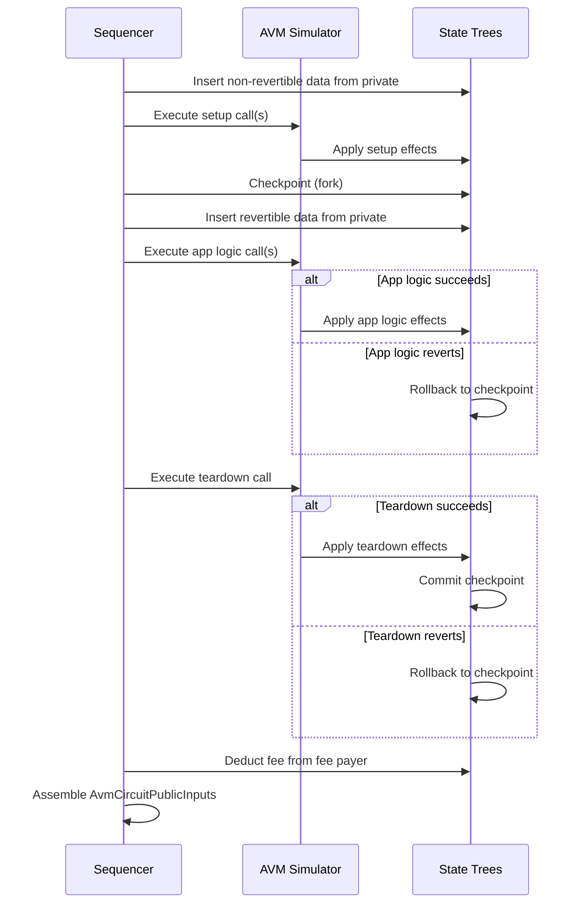
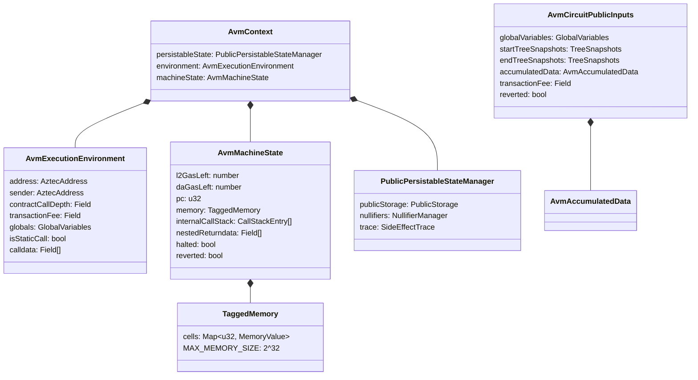

# Public VM (AVM)

## Overview

The Aztec Virtual Machine (AVM) executes public functions for transactions that include public logic. Unlike private execution — which occurs client-side and is proven per-function-call through the private kernel circuit chain — the AVM runs on the sequencer and generates a single proof covering all public execution within a transaction.

The AVM is a register-free, stack-less, tagged-memory virtual machine operating over the BN254 scalar field. It executes bytecode compiled from Noir public functions, processes state reads and writes against the protocol's Merkle trees, and produces a set of accumulated side effects that are merged with the private kernel outputs to form the final transaction effect.

Public execution is organized into three phases per transaction:

1. **Setup** (non-revertible) — fee preparation and other setup logic
2. **App Logic** (revertible) — main application logic
3. **Teardown** (non-revertible) — fee payment finalization

If app logic or teardown reverts, its state changes are discarded but setup effects are always preserved, ensuring fee payment.

**Cross-references:**
- Spec #1 (Protocol Overview & Architecture) — introduces the AVM and its role in the transaction lifecycle
- Spec #2 (Constants) — defines all AVM constants: gas costs, memory parameters, opcode gas tables, and serialization lengths
- Spec #3 (Cryptographic Primitives) — specifies hash functions used in AVM gadget opcodes (Poseidon2, SHA-256, Keccak)
- Spec #4 (State Model & Merkle Trees) — defines the trees the AVM reads from and writes to
- Spec #5 (Transaction Format & Lifecycle) — defines the transaction phases and TxEffect construction
- Spec #7 (Private Kernel Circuits) — defines `PrivateToPublicKernelCircuitPublicInputs`, the input to public execution

## Requirements

### R1: Deterministic Execution

The AVM MUST execute public functions deterministically. Given identical inputs (bytecode, calldata, world state), all implementations MUST produce identical outputs (side effects, gas usage, revert status).

**Rationale:** The AVM proof attests to correct execution. If execution were non-deterministic, provers could not reproduce it and the proof would be invalid.

### R2: Gas-Bounded Execution

Every AVM instruction MUST consume a fixed base gas cost plus any dynamic gas cost. Execution MUST halt with an exceptional revert if any gas dimension is exhausted. The total gas consumed by a transaction's public execution MUST NOT exceed `AVM_MAX_PROCESSABLE_L2_GAS`.

**Rationale:** Gas metering prevents denial-of-service attacks and bounds proving costs. Without gas limits, a single transaction could consume unbounded prover resources.

### R3: Tagged Memory

Every memory cell MUST carry a type tag. Arithmetic and bitwise operations MUST enforce that operand tags match. Tag mismatches MUST cause an exceptional halt.

**Rationale:** Tagged memory prevents type confusion attacks and ensures the circuit can constrain operations to the correct field or integer domain. Without tags, a Field element could be reinterpreted as a small integer or vice versa.

### R4: State Isolation via Phases

Non-revertible phase effects (setup) MUST persist regardless of whether subsequent phases revert. Revertible phase effects (app logic, teardown) MUST be discardable independently.

**Rationale:** Fee payment occurs in setup and teardown. If a revert could undo fee payment, sequencers would have no incentive to include transactions that might fail.

### R5: Static Call Enforcement

Static calls MUST NOT modify state. Any instruction that writes to storage, emits note hashes, emits nullifiers, emits logs, or sends L2-to-L1 messages MUST cause an exceptional halt when executed in a static call context.

**Rationale:** Static calls are the mechanism for read-only cross-contract calls. Violating this invariant would break composability assumptions.

### R6: Provable Execution

The AVM MUST produce a SNARK proof (`PROOF_TYPE_AVM`) attesting to correct execution of all public functions in a transaction. This proof is verified by the rollup circuits.

**Rationale:** The rollup inherits Ethereum's security only if every state transition is proven. The AVM proof covers the public execution portion.

### R7: Interface Compatibility

The AVM MUST accept `PrivateToPublicKernelCircuitPublicInputs` (defined in Spec #7) as its input and produce `AvmCircuitPublicInputs` as its output. These structures form the interface between private kernel proofs and rollup circuits.

**Rationale:** The AVM sits between the private kernel (which produces proven private side effects) and the rollup circuits (which aggregate all transaction effects into blocks). A mismatch in these interfaces would break the proof chain.

## Specification

### Execution Model

The AVM executes public function bytecode in a fetch-decode-execute loop. Each iteration:

1. Fetches the instruction at the current program counter (PC)
2. Decodes the opcode and operands from the bytecode
3. Charges gas (base cost + addressing cost + dynamic cost)
4. Resolves operand addresses through the addressing mode
5. Executes the instruction, potentially modifying memory, world state, or control flow
6. Advances the PC to the next instruction (unless the instruction handles the PC itself)

Execution halts when:
- A `RETURN` instruction is executed (successful halt)
- A `REVERT` instruction is executed (explicit revert)
- An exceptional condition occurs (out of gas, tag check failure, invalid opcode, etc.)



#### Exceptional Halts

An exceptional halt occurs when execution encounters an unrecoverable error. On exceptional halt, the AVM MUST:

1. Set all remaining gas to zero
2. Mark execution as reverted
3. Return empty output data

Exceptional halt conditions include:
- Out of gas (any dimension)
- Memory tag check failure
- Invalid opcode
- Program counter out of bounds
- Invalid memory address (indirect resolution to non-U32 tag)
- Relative address overflow (base + offset exceeds memory size)
- Division by zero (for integer division)
- Nullifier collision during emit
- Side effect limit reached (note hashes, nullifiers, L2-to-L1 messages)
- Static call violation (write operation in static context)
- Elliptic curve point not on curve (ECADD)

### Transaction-Level Execution

The sequencer orchestrates AVM execution across all three transaction phases. The `PublicTxSimulator` manages:

1. **Non-revertible insertion**: Insert note hashes, nullifiers, and L2-to-L1 messages from the private kernel's non-revertible accumulated data into the state trees
2. **Setup phase**: Execute each enqueued setup call request sequentially. If any call reverts, the entire transaction is rejected
3. **State checkpoint**: Fork the state to create a rollback point
4. **Revertible insertion**: Insert the private kernel's revertible accumulated data
5. **App logic phase**: Execute each enqueued app logic call request. If any call reverts, roll back to the post-setup checkpoint
6. **Teardown phase**: Execute the teardown call request (if any). If teardown reverts, roll back to the post-setup checkpoint
7. **Fee payment**: Deduct the transaction fee from the fee payer's Fee Juice balance
8. **Output assembly**: Construct `AvmCircuitPublicInputs` from the final state



#### Gas Allocation Per Phase

Each enqueued call within a phase receives the remaining gas for that phase:

- **Setup**: Receives `gas_limits - start_gas_used` (where `start_gas_used` accounts for private side effects)
- **App Logic**: Receives the remaining gas after setup
- **Teardown**: Receives `teardown_gas_limits` from the transaction's `GasSettings`

The transaction fee is computed as:

```
transaction_fee = gas_used.da_gas * effective_fee_per_da_gas
               + gas_used.l2_gas * effective_fee_per_l2_gas
```

Where `effective_fee_per_*_gas` is the minimum of the block's base fee and the transaction's `max_fees_per_gas`.

### Memory Model

The AVM uses a flat, tagged memory space. There is no separate stack or heap — all data resides in a single linear address space.

#### Memory Space

| Property | Value |
|---|---|
| Address width | 32 bits |
| Total addressable cells | 2^32 (4,294,967,296) |
| Highest valid address | `AVM_HIGHEST_MEM_ADDRESS = 4,294,967,295` |
| Cell size | One Field element or one typed integer |
| Uninitialized value | `Field(0)` with tag `FIELD` |

Memory is per-call-context. Each external call (CALL, STATICCALL) creates a new memory space. Internal calls (INTERNALCALL/INTERNALRETURN) share the caller's memory.

#### Type Tags

Every memory cell carries a type tag that identifies its value type. Tags are checked by instructions before use.

| Tag | Constant | Value | Type | Bit Width |
|---|---|---|---|---|
| Field | `MEM_TAG_FF` | 0 | BN254 scalar field element | 254 |
| U1 | `MEM_TAG_U1` | 1 | 1-bit unsigned integer | 1 |
| U8 | `MEM_TAG_U8` | 2 | 8-bit unsigned integer | 8 |
| U16 | `MEM_TAG_U16` | 3 | 16-bit unsigned integer | 16 |
| U32 | `MEM_TAG_U32` | 4 | 32-bit unsigned integer | 32 |
| U64 | `MEM_TAG_U64` | 5 | 64-bit unsigned integer | 64 |
| U128 | `MEM_TAG_U128` | 6 | 128-bit unsigned integer | 128 |

**Tag rules:**
- Arithmetic operations (`ADD`, `SUB`, `MUL`, `DIV`, `EQ`, `LT`, `LTE`) require both operands to have the same tag
- Bitwise operations (`AND`, `OR`, `XOR`, `NOT`, `SHL`, `SHR`) require integral tags (not Field)
- `FDIV` (field division) requires Field tags
- `CAST` converts between any two tags by truncation
- Memory addresses used for indirect addressing MUST have tag U32
- The base address for relative addressing (memory cell 0) MUST have tag U32
- Comparators (`EQ`, `LT`, `LTE`) output U1

#### Addressing Modes

Each instruction operand can use one of four addressing modes, encoded as 2 bits per operand in the addressing mode byte(s):

| Mode | Value | Bit Pattern | Description |
|---|---|---|---|
| Direct | 0 | `00` | Use the operand value as the memory address directly |
| Indirect | 1 | `01` | Read the address from memory at the operand offset; the value at that address MUST have tag U32 |
| Relative | 2 | `10` | Add the operand offset to the base address stored in `memory[0]` (MUST be U32) |
| Indirect+Relative | 3 | `11` | First apply relative offset, then dereference as indirect |

The addressing mode is encoded as a 1-byte or 2-byte value where bits `[2i]` and `[2i+1]` represent the indirect and relative flags for operand `i`, respectively. Up to `AVM_MAX_OPERANDS = 7` operands can be addressed.

**Addressing gas cost:**

```
addressing_l2_gas = (has_any_relative ? AVM_ADDRESSING_BASE_RESOLUTION_L2_GAS : 0)
                  + num_indirect * AVM_ADDRESSING_INDIRECT_L2_GAS
                  + num_relative * AVM_ADDRESSING_RELATIVE_L2_GAS
```

### Execution Context

Each AVM call frame maintains an execution context consisting of:

#### Execution Environment (immutable within a call)

| Field | Type | Source |
|---|---|---|
| `address` | AztecAddress | Contract being executed |
| `sender` | AztecAddress | Caller's contract address (or `NULL_MSG_SENDER_CONTRACT_ADDRESS` for top-level) |
| `contractCallDepth` | Field | Nesting depth (0 for top-level enqueued calls) |
| `transactionFee` | Field | Computed transaction fee (available only in teardown phase; 0 in other phases) |
| `globals` | GlobalVariables | Block-level constants (see below) |
| `isStaticCall` | bool | Whether this is a static (read-only) call |
| `calldata` | Field[] | Input data for this call |

#### Global Variables

Accessible via the `GETENVVAR` instruction:

| Variable | Enum Value | Type | Description |
|---|---|---|---|
| `ADDRESS` | 0 | Field | Current contract address |
| `SENDER` | 1 | Field | Caller's address |
| `TRANSACTIONFEE` | 2 | Field | Transaction fee |
| `CHAINID` | 3 | Field | L1 chain ID |
| `VERSION` | 4 | Field | Rollup version |
| `BLOCKNUMBER` | 5 | U32 | Current L2 block number |
| `TIMESTAMP` | 6 | U64 | Block timestamp |
| `MINFEEPERL2GAS` | 7 | U128 | Minimum fee per L2 gas |
| `MINFEEPERDAGAS` | 8 | U128 | Minimum fee per DA gas |
| `ISSTATICCALL` | 9 | U1 | 1 if in static call context |
| `L2GASLEFT` | 10 | U32 | Remaining L2 gas |
| `DAGASLEFT` | 11 | U32 | Remaining DA gas |

#### Machine State (mutable)

| Field | Type | Description |
|---|---|---|
| `l2GasLeft` | number | Remaining L2 gas |
| `daGasLeft` | number | Remaining DA gas |
| `pc` | u32 | Program counter (byte offset into bytecode) |
| `memory` | TaggedMemory | The tagged memory space |
| `internalCallStack` | CallStackEntry[] | Stack for INTERNALCALL/INTERNALRETURN |
| `nestedReturndata` | Field[] | Return data from last external call |
| `nestedCallSuccess` | bool | Success flag from last external call |
| `halted` | bool | Whether execution has halted |
| `reverted` | bool | Whether execution reverted |
| `output` | Field[] | Return/revert data |

### Bytecode Format

AVM bytecode is a packed sequence of variable-length instructions. Each instruction begins with a 1-byte opcode, followed by operands whose sizes are determined by the instruction's wire format.

#### Instruction Encoding

```
+--------+-----------+-----------+-----+-----------+
| Opcode | Operand 0 | Operand 1 | ... | Operand N |
| 1 byte | variable  | variable  |     | variable  |
+--------+-----------+-----------+-----+-----------+
```

The opcode byte determines the instruction and its wire format. Many logical operations have two wire format variants (e.g., `ADD_8` and `ADD_16`) to allow compact encoding when operand offsets fit in 8 bits.

#### Operand Types

| Type | Size (bytes) | Encoding | Description |
|---|---|---|---|
| UINT8 | 1 | unsigned | Small constants, addressing mode, tags |
| UINT16 | 2 | big-endian | Memory offsets (16-bit variant) |
| UINT32 | 4 | big-endian | Jump targets, large offsets |
| UINT64 | 8 | big-endian | 64-bit immediate values |
| UINT128 | 16 | big-endian | 128-bit immediate values |
| FF | 32 | big-endian | Field element immediates (reduced mod BN254 scalar) |
| TAG | 1 | unsigned | Memory type tag (0–6) |

#### Wire Format Examples

**Three-operand arithmetic (8-bit variant):**
```
[UINT8:opcode] [UINT8:addressing] [UINT8:aOffset] [UINT8:bOffset] [UINT8:dstOffset]
Total: 5 bytes
```

**Three-operand arithmetic (16-bit variant):**
```
[UINT8:opcode] [UINT8:addressing] [UINT16:aOffset] [UINT16:bOffset] [UINT16:dstOffset]
Total: 8 bytes
```

**SET instruction (field variant):**
```
[UINT8:opcode] [UINT8:addressing] [UINT16:dstOffset] [TAG:tag] [FF:value]
Total: 37 bytes
```

**External call:**
```
[UINT8:opcode] [UINT16:addressing] [UINT16:l2GasOffset] [UINT16:daGasOffset]
[UINT16:addrOffset] [UINT16:argsSizeOffset] [UINT16:argsOffset]
Total: 13 bytes
```

### Instruction Set

The AVM has 62 unique opcodes (some with 8-bit and 16-bit wire format variants, totaling 90 wire opcodes). Instructions are grouped by category.

#### Arithmetic Instructions

All arithmetic instructions take two source operands and one destination operand. Operand tags MUST match (enforced by tag check). The result is written with the same tag as the operands.

| Opcode | Wire Variants | Operation | Tag Constraint | Notes |
|---|---|---|---|---|
| `ADD` | `ADD_8`, `ADD_16` | `dst = a + b` | Same tag, any type | Wraps on overflow for integers; field arithmetic for Field |
| `SUB` | `SUB_8`, `SUB_16` | `dst = a - b` | Same tag, any type | Wraps on underflow for integers; field arithmetic for Field |
| `MUL` | `MUL_8`, `MUL_16` | `dst = a * b` | Same tag, any type | Truncated to type width for integers |
| `DIV` | `DIV_8`, `DIV_16` | `dst = a / b` | Same tag, any type | Integer (Euclidean) division for all types including Field |
| `FDIV` | `FDIV_8`, `FDIV_16` | `dst = a * b^{-1}` | Field only | Field (modular) division; undefined for b=0 |

#### Comparison Instructions

Comparisons output a `U1` value (0 or 1) to the destination.

| Opcode | Wire Variants | Operation | Tag Constraint |
|---|---|---|---|
| `EQ` | `EQ_8`, `EQ_16` | `dst = (a == b) ? 1 : 0` | Same tag, any type |
| `LT` | `LT_8`, `LT_16` | `dst = (a < b) ? 1 : 0` | Same tag, any type |
| `LTE` | `LTE_8`, `LTE_16` | `dst = (a <= b) ? 1 : 0` | Same tag, any type |

#### Bitwise Instructions

Bitwise operations require integral tags (U1, U8, U16, U32, U64, U128). Field tags are NOT permitted. Results are written with the same tag as the operands.

| Opcode | Wire Variants | Operation | Tag Constraint |
|---|---|---|---|
| `AND` | `AND_8`, `AND_16` | `dst = a & b` | Same integral tag |
| `OR` | `OR_8`, `OR_16` | `dst = a \| b` | Same integral tag |
| `XOR` | `XOR_8`, `XOR_16` | `dst = a ^ b` | Same integral tag |
| `NOT` | `NOT_8`, `NOT_16` | `dst = ~a` | Integral tag |
| `SHL` | `SHL_8`, `SHL_16` | `dst = a << b` | Same integral tag |
| `SHR` | `SHR_8`, `SHR_16` | `dst = a >> b` | Same integral tag |

Bitwise operations incur dynamic gas based on the operand byte size: `dynamic_l2_gas = AVM_BITWISE_DYN_L2_GAS * byte_size(tag)`.

| Tag | Byte Size Multiplier |
|---|---|
| U1, U8 | 1 |
| U16 | 2 |
| U32 | 4 |
| U64 | 8 |
| U128 | 16 |

#### Type Conversion

| Opcode | Wire Variants | Operation | Notes |
|---|---|---|---|
| `CAST` | `CAST_8`, `CAST_16` | Convert `src` to type `tag`, write to `dst` | Truncates to target type width |

Wire format: `[opcode, addressing, dstOffset, srcOffset, TAG:dstTag]`

#### Memory Instructions

| Opcode | Wire Variants | Operation | Notes |
|---|---|---|---|
| `SET` | `SET_8`, `SET_16`, `SET_32`, `SET_64`, `SET_128`, `SET_FF` | `dst = immediate` | Loads an immediate constant with specified tag |
| `MOV` | `MOV_8`, `MOV_16` | `dst = src` | Copies value and tag from source to destination |

#### Environment Instructions

| Opcode | Wire Format | Operation | Notes |
|---|---|---|---|
| `GETENVVAR` | `GETENVVAR_16` | `dst = env[varEnum]` | Reads an environment variable by enum index |
| `CALLDATACOPY` | single format | `memory[dst..dst+size] = calldata[cdOffset..cdOffset+size]` | Dynamic gas: `size * AVM_CALLDATACOPY_DYN_L2_GAS` |
| `RETURNDATASIZE` | single format | `dst = len(nestedReturndata)` | Size of last nested call's return data |
| `RETURNDATACOPY` | single format | `memory[dst..dst+size] = returndata[rdOffset..rdOffset+size]` | Dynamic gas: `size * AVM_RETURNDATACOPY_DYN_L2_GAS` |
| `SUCCESSCOPY` | single format | `dst = nestedCallSuccess ? 1 : 0` | Success flag of last nested call |

#### Control Flow Instructions

| Opcode | Wire Format | Operation | Notes |
|---|---|---|---|
| `JUMP` | `JUMP_32` | `pc = target` | Unconditional jump to 32-bit byte offset |
| `JUMPI` | `JUMPI_32` | `if (cond != 0) pc = target` | Conditional jump; condition MUST be U1 |
| `INTERNALCALL` | single format | Push return PC, `pc = target` | Pushes `{callPc, returnPc}` to internal call stack |
| `INTERNALRETURN` | single format | `pc = popped returnPc` | Pops from internal call stack |

`INTERNALCALL` and `INTERNALRETURN` do NOT create new memory spaces. They are for subroutine calls within the same contract.

#### Storage Instructions

| Opcode | Wire Format | Operation | Tag Constraint | Notes |
|---|---|---|---|---|
| `SLOAD` | single format | `dst = storage[slot]` | Slot: Field | Reads from the calling contract's public storage |
| `SSTORE` | single format | `storage[slot] = value` | Slot, value: Field | Writes to the calling contract's public storage |

Storage slots are siloed to the calling contract's address. The siloing is performed by the state manager:

```
siloed_slot = poseidon2_hash([contract_address, slot])
```

`SSTORE` incurs both L2 gas (`AVM_SSTORE_BASE_L2_GAS`) and DA gas (`AVM_SSTORE_DYN_DA_GAS`). `SSTORE` MUST cause an exceptional halt in a static call context.

#### World State Instructions

| Opcode | Operation | Notes |
|---|---|---|
| `NOTEHASHEXISTS` | Check if a note hash exists at a given leaf index | Reads from the note hash tree |
| `EMITNOTEHASH` | Emit a new note hash | Siloed and made unique by the state manager |
| `NULLIFIEREXISTS` | Check if a nullifier exists | Reads from the nullifier tree |
| `EMITNULLIFIER` | Emit a new nullifier | Siloed by the state manager; collision causes exceptional halt |
| `L1TOL2MSGEXISTS` | Check if an L1-to-L2 message exists at a leaf index | Reads from the L1-to-L2 message tree |
| `GETCONTRACTINSTANCE` | Load a contract instance's fields | Reads the deployer, class ID, init hash, and public keys |

**Note hash emission:**

When a public function emits a note hash, the AVM state manager:
1. Silos it: `siloed = poseidon2_hash([contract_address, note_hash])`
2. Computes a nonce: `nonce = compute_note_hash_nonce(first_nullifier, note_hash_count)`
3. Makes it unique: `unique = compute_unique_note_hash(nonce, siloed)`
4. Inserts the unique note hash into the note hash tree

**Nullifier emission:**

When a public function emits a nullifier, the AVM state manager:
1. Silos it: `siloed = poseidon2_hash([contract_address, nullifier])`
2. Checks for collision in the nullifier tree (exceptional halt if exists)
3. Inserts the siloed nullifier into the nullifier tree

All write operations (`EMITNOTEHASH`, `EMITNULLIFIER`, `SSTORE`, `SENDL2TOL1MSG`, `EMITUNENCRYPTEDLOG`) MUST cause an exceptional halt in a static call context.

#### Messaging Instructions

| Opcode | Operation | Notes |
|---|---|---|
| `SENDL2TOL1MSG` | Send an L2-to-L1 message | Message contains recipient (Ethereum address) and content |

#### Logging Instructions

| Opcode | Operation | Notes |
|---|---|---|
| `EMITUNENCRYPTEDLOG` | Emit a public (unencrypted) log | Dynamic gas: `size * AVM_EMITUNENCRYPTEDLOG_DYN_L2_GAS` (L2) + `size * AVM_EMITUNENCRYPTEDLOG_DYN_DA_GAS` (DA) |
| `DEBUGLOG` | Emit a debug log (ignored in production) | No DA gas cost |

#### External Call Instructions

| Opcode | Operation | Call Type |
|---|---|---|
| `CALL` | Call another contract | Mutable (unless parent is static) |
| `STATICCALL` | Call another contract in read-only mode | Always static |

External call semantics:

1. Resolve operands: `l2Gas`, `daGas` (U32), `address` (Field), `argsSize` (U32), `args` (memory pointer)
2. Gas allocation: `allocatedGas = min(requested, gasLeft)` per dimension
3. Deduct allocated gas from caller
4. Create nested execution context:
   - New memory space (empty)
   - `sender` = caller's `address`
   - `contractCallDepth` = caller's depth + 1
   - `isStaticCall` = `true` if `STATICCALL` or if caller is already in static context
5. Fetch and execute the callee's bytecode
6. On return, save `nestedReturndata` and `nestedCallSuccess` in caller's machine state
7. Refund unused gas to caller
8. If nested call succeeded: merge nested state changes into caller
9. If nested call reverted: reject nested state changes (discard writes, keep hints)

The caller retrieves nested call results via:
- `SUCCESSCOPY`: reads the success flag
- `RETURNDATASIZE`: reads the size of return data
- `RETURNDATACOPY`: copies return data into caller's memory

#### Halt Instructions

| Opcode | Wire Variants | Operation | Notes |
|---|---|---|---|
| `RETURN` | single format | Halt successfully with output data | `output = memory[offset..offset+size]` |
| `REVERT` | `REVERT_8`, `REVERT_16` | Halt with revert and output data | `output = memory[offset..offset+size]` |

Both instructions read a size from memory (U32 tag required) and a memory pointer for the output data.

#### Cryptographic Gadget Instructions

| Opcode | Operation | Input | Output | Notes |
|---|---|---|---|---|
| `POSEIDON2` | Poseidon2 permutation | 4 Field elements | 4 Field elements | State-based permutation |
| `SHA256COMPRESSION` | SHA-256 compression | 8 U32 (state) + 16 U32 (input) | 8 U32 | Single compression round |
| `KECCAKF1600` | Keccak-f[1600] permutation | 25 U64 | 25 U64 | Single permutation |
| `ECADD` | Grumpkin EC point addition | (x1, y1, inf1, x2, y2, inf2) | (x3, y3, inf3) | Points MUST be on the Grumpkin curve |

**ECADD details:**
- Input points are (Field, Field, U1) tuples representing (x, y, isInfinite)
- Both points MUST be on the Grumpkin curve; otherwise, an exceptional halt occurs
- The point at infinity is represented as `isInfinite = 1`
- Output includes the infinity flag as U1

#### Conversion Instructions

| Opcode | Operation | Notes |
|---|---|---|
| `TORADIXBE` | Convert a Field to big-endian radix representation | Dynamic gas: `numDigits * AVM_TORADIXBE_DYN_L2_GAS` |

### Gas Metering

The AVM uses a two-dimensional gas model:

- **L2 Gas**: Measures computational cost on L2
- **DA Gas**: Measures data availability cost for state that must be published

Each instruction has a base L2 gas cost and potentially a base DA gas cost. Some instructions also have dynamic costs that scale with operand sizes.

#### Gas Cost Formula

```
total_gas = base_gas(opcode) + addressing_gas(indirect_count, relative_count) + dynamic_gas(opcode, multiplier)
```

Where:
- `base_gas(opcode)` is the fixed cost from the opcode gas table (see Spec #2)
- `addressing_gas` accounts for indirect and relative addressing overhead
- `dynamic_gas` is `dynamic_cost(opcode) * multiplier` where the multiplier depends on the instruction

#### Gas Consumption

Gas is consumed BEFORE instruction execution. If insufficient gas remains, an `OutOfGasError` is thrown, which:
1. Sets all remaining gas to zero across all dimensions
2. Sets the halted and reverted flags
3. Propagates as an exceptional halt

#### AVM Startup Gas

Each enqueued public call consumes `FIXED_AVM_STARTUP_L2_GAS = 20,000` L2 gas as overhead for context initialization. This is accounted for in the `PrivateToPublicKernelCircuitPublicInputs.gas_used` field computed by the Tail-to-Public kernel circuit.

#### Gas Limits

| Constant | Value | Description |
|---|---|---|
| `AVM_MAX_PROCESSABLE_L2_GAS` | 6,000,000 | Maximum L2 gas the AVM can process per transaction |
| `FIXED_AVM_STARTUP_L2_GAS` | 20,000 | Base cost per enqueued call |
| `L2_GAS_DISTRIBUTED_STORAGE_PREMIUM` | 1,024 | Premium for distributed storage operations |

#### Gas Cost Tables

All per-opcode gas costs are defined in Spec #2 (Constants), section "AVM Opcode Gas Costs". The complete tables are normative and MUST be implemented exactly as specified.

### State Management

The AVM interacts with world state through the `PublicPersistableStateManager`, which provides:

1. **Public storage**: Key-value reads and writes against the public data tree, siloed by contract address
2. **Note hashes**: Existence checks and emissions against the note hash tree
3. **Nullifiers**: Existence checks and emissions against the nullifier tree, with collision detection
4. **L1-to-L2 messages**: Existence checks against the L1-to-L2 message tree
5. **Contract instances**: Lookups for contract deployment data

#### State Forking

On external calls, the state manager is forked. If the nested call succeeds, the fork is merged into the parent. If it reverts, the fork is discarded (state writes rolled back, but execution hints are preserved for proving).

#### State Siloing

All storage operations are siloed to the calling contract's address. The AVM MUST NOT allow a contract to read or write another contract's storage directly. Cross-contract interaction MUST go through external calls.

## Data Structures

### AvmCircuitPublicInputs

The AVM circuit produces this structure as its public inputs, which are consumed by the rollup circuits.

| Field | Type | Size (fields) | Description |
|---|---|---|---|
| **Inputs** | | | |
| `globalVariables` | GlobalVariables | 9 | Block-level constants |
| `protocolContracts` | ProtocolContracts | 10 | Protocol contract addresses |
| `startTreeSnapshots` | TreeSnapshots | 8 | State tree roots before public execution |
| `startGasUsed` | Gas | 2 | Gas consumed by private execution |
| `gasSettings` | GasSettings | 8 | Transaction gas limits and fee caps |
| `effectiveGasFees` | GasFees | 2 | Effective fee per gas unit |
| `feePayer` | AztecAddress | 1 | Address paying the transaction fee |
| `proverId` | Field | 1 | Identifier of the prover |
| `publicCallRequestArrayLengths` | PublicCallRequestArrayLengths | 3 | Number of calls per phase |
| `publicSetupCallRequests` | PublicCallRequest[32] | 128 | Setup phase call requests |
| `publicAppLogicCallRequests` | PublicCallRequest[32] | 128 | App logic phase call requests |
| `publicTeardownCallRequest` | PublicCallRequest | 4 | Teardown call request |
| `previousNonRevertibleAccumulatedDataArrayLengths` | PrivateToAvmAccumulatedDataArrayLengths | 3 | Lengths of non-revertible arrays from private |
| `previousRevertibleAccumulatedDataArrayLengths` | PrivateToAvmAccumulatedDataArrayLengths | 3 | Lengths of revertible arrays from private |
| `previousNonRevertibleAccumulatedData` | PrivateToAvmAccumulatedData | 152 | Non-revertible side effects from private |
| `previousRevertibleAccumulatedData` | PrivateToAvmAccumulatedData | 152 | Revertible side effects from private |
| **Outputs** | | | |
| `endTreeSnapshots` | TreeSnapshots | 8 | State tree roots after public execution |
| `endGasUsed` | Gas | 2 | Total gas consumed (private + public) |
| `accumulatedDataArrayLengths` | AvmAccumulatedDataArrayLengths | 4 | Lengths of output accumulated data arrays |
| `accumulatedData` | AvmAccumulatedData | 4,377 | All accumulated side effects (private + public) |
| `transactionFee` | Field | 1 | Computed transaction fee |
| `reverted` | bool | 1 | Whether the transaction's revertible phases reverted |

**Total serialization length:** `AVM_CIRCUIT_PUBLIC_INPUTS_LENGTH = 5,008` fields.

### AvmAccumulatedData

The final accumulated data from both private and public execution:

| Field | Type | Max Count | Description |
|---|---|---|---|
| `noteHashes` | Field[] | 64 | All note hashes (private non-revertible + private revertible + public) |
| `nullifiers` | Field[] | 64 | All nullifiers |
| `l2ToL1Msgs` | ScopedL2ToL1Message[] | 8 | All L2-to-L1 messages |
| `publicDataWrites` | PublicDataWrite[] | 64 | Public storage writes |
| `publicLogs` | PublicLogs | 4,097 | Public (unencrypted) logs |

**Serialization length:** `AVM_ACCUMULATED_DATA_LENGTH = 4,377` fields.

### PrivateToAvmAccumulatedData

Side effects from private execution that the AVM must insert into state:

| Field | Type | Max Count | Description |
|---|---|---|---|
| `noteHashes` | Field[] | 64 | Siloed, unique note hashes from private |
| `nullifiers` | Field[] | 64 | Siloed nullifiers from private |
| `l2ToL1Msgs` | ScopedL2ToL1Message[] | 8 | L2-to-L1 messages from private |

**Serialization length:** `PRIVATE_TO_AVM_ACCUMULATED_DATA_LENGTH = 152` fields.

### Execution Context Relationships



## Validation Rules

### V1: Opcode Validity

Every instruction byte MUST correspond to a valid opcode in the range `[0, MAX_OPCODE_VALUE]`. An invalid opcode MUST cause an exceptional halt.

### V2: Tag Consistency

For all instructions that operate on two or more source operands (arithmetic, comparison, bitwise), the memory tags of the source operands MUST be identical. A tag mismatch MUST cause an exceptional halt.

### V3: Integral-Only Operations

Bitwise operations (`AND`, `OR`, `XOR`, `NOT`, `SHL`, `SHR`) MUST only operate on integral types (U1, U8, U16, U32, U64, U128). A Field tag on any operand MUST cause an exceptional halt.

### V4: Memory Address Tags

Any memory offset used for indirect addressing resolution MUST contain a value with tag U32. If the dereferenced value has a non-U32 tag, it MUST cause an exceptional halt. The same applies to the base address at `memory[0]` for relative addressing.

### V5: Gas Sufficiency

Before executing any instruction, the AVM MUST verify that sufficient gas remains in both dimensions (L2 and DA). If `gasLeft - gasCost < 0` in any dimension, the AVM MUST trigger an exceptional halt that consumes all remaining gas.

### V6: Program Counter Bounds

The program counter MUST remain within the bounds of the bytecode. If `pc >= bytecode.length` after advancing, the AVM MUST trigger an exceptional halt.

### V7: Static Call Constraints

In a static call context, the following opcodes MUST cause an exceptional halt:
- `SSTORE`
- `EMITNOTEHASH`
- `EMITNULLIFIER`
- `SENDL2TOL1MSG`
- `EMITUNENCRYPTEDLOG`

Additionally, `CALL` within a static context MUST be treated as `STATICCALL` (the static property propagates to nested calls).

### V8: Nullifier Uniqueness

When `EMITNULLIFIER` is executed, the siloed nullifier MUST NOT already exist in the nullifier tree. A collision MUST cause an exceptional halt.

### V9: Side Effect Limits

The total number of each side effect type across the entire transaction (private + public) MUST NOT exceed the per-transaction limits defined in Spec #2:
- Note hashes: 64 (`MAX_NOTE_HASHES_PER_TX`)
- Nullifiers: 64 (`MAX_NULLIFIERS_PER_TX`)
- L2-to-L1 messages: 8 (`MAX_L2_TO_L1_MSGS_PER_TX`)
- Public data writes: 64 (`MAX_PUBLIC_DATA_UPDATE_REQUESTS_PER_TX`)

Exceeding a limit MUST cause an exceptional halt.

### V10: AVM Proof Verification

The AVM proof MUST be verified using proof type `PROOF_TYPE_AVM = 3`. The proof public inputs MUST match the `AvmCircuitPublicInputs` produced by simulation. The verification key length is `AVM_VERIFICATION_KEY_LENGTH_IN_FIELDS = 86` fields.

### V11: Circuit Public Inputs Consistency

The `AvmCircuitPublicInputs` MUST satisfy:
- `startTreeSnapshots` matches the state tree roots at the beginning of public execution
- `endTreeSnapshots` matches the state tree roots after all public execution and fee payment
- `endGasUsed` reflects total gas consumed across private and public phases
- `accumulatedData` contains all side effects from both private and public execution
- `transactionFee` is correctly computed from `endGasUsed` and `effectiveGasFees`
- `reverted` is `true` if and only if the revertible phase(s) reverted

### V12: Fee Payment

After all phases complete, the AVM MUST deduct the transaction fee from the fee payer's Fee Juice balance in public storage. This is a protocol-level storage write that occurs regardless of revert status.

### V13: Gas Used Bounds

The total L2 gas consumed MUST NOT exceed `AVM_MAX_PROCESSABLE_L2_GAS`. Transactions exceeding this limit MUST be rejected before execution.

## Security Considerations

### Denial of Service via Gas

The gas model MUST accurately reflect proving costs. Underpriced opcodes could allow an attacker to submit transactions that are cheap to execute but expensive to prove, degrading network throughput. Gas costs are calibrated based on the number of circuit rows each operation consumes.

### Reentrancy

The AVM does not have a reentrancy guard at the protocol level. Contracts MUST implement their own reentrancy protection if needed. However, the state forking mechanism ensures that if a reentrant call reverts, the caller's state is unaffected.

### Information Leakage via Gas

Gas consumption can leak information about private execution. The protocol mitigates this by including gas for private side effects (note hashes, nullifiers) in the public gas accounting, making the total gas less revealing about the private/public split.

### Storage Collision

Public storage slots are siloed by contract address using Poseidon2 hashing. This prevents a malicious contract from reading or writing another contract's storage through crafted slot values.

## Open Questions

1. **AVM Proof Padding:** The AVM proof length is padded to `AVM_V2_PROOF_LENGTH_IN_FIELDS_PADDED = 16,200` fields until the column count stabilizes. What is the timeline for finalizing this, and what migration is needed?

2. **Maximum Contract Call Depth:** There is currently no explicit limit on nested call depth beyond gas limits. Should a hard depth limit be added for circuit constraint reasons?

3. **DELEGATECALL Omission:** The AVM does not support `DELEGATECALL` (executing another contract's code in the caller's storage context). Is this a permanent design choice or a future addition?

4. **Debug Opcode in Production:** The `DEBUGLOG` opcode has no observable effect in production but consumes 9 L2 gas. Should it be removed from the instruction set, or kept for testnet/development purposes?

5. **Dynamic Gas Calibration:** Gas costs are currently calibrated against simulation row counts. As the circuit implementation matures, costs may need recalibration. What is the process for updating gas costs without breaking compatibility?

6. **Calldata Size Limit:** The maximum calldata across all enqueued calls is `MAX_FR_CALLDATA_TO_ALL_ENQUEUED_CALLS = 16,000` field elements. Is this sufficient for anticipated use cases?

7. **Cold/Warm Storage Pricing:** The current gas model does not distinguish between cold and warm storage accesses (unlike EIP-2929 in Ethereum). Should such a distinction be added to better reflect proving costs?
