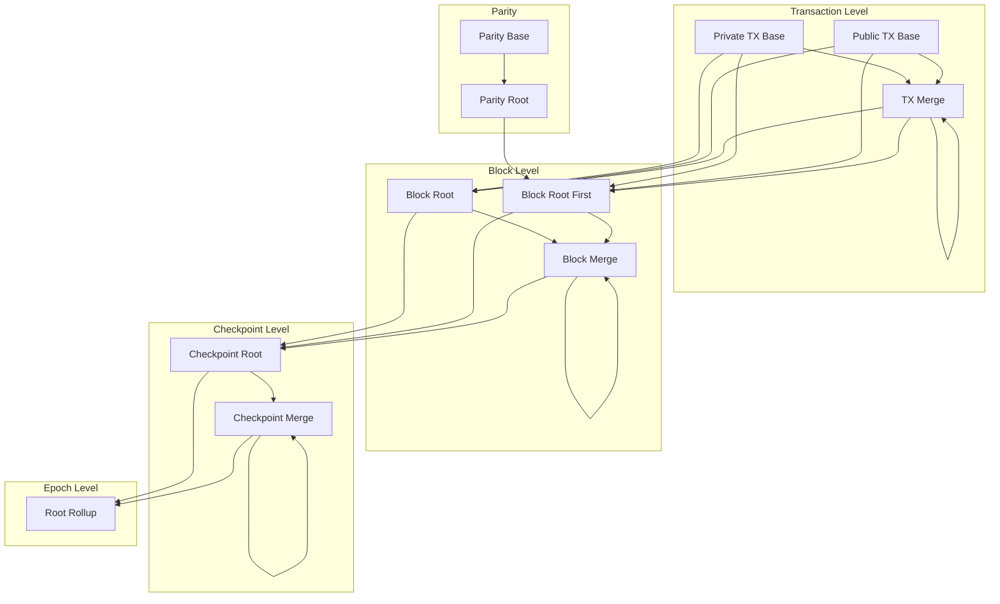
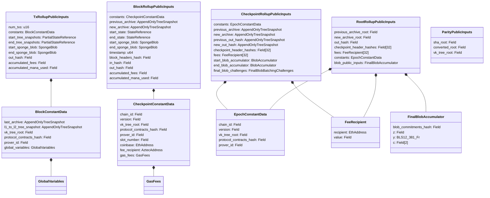

# Rollup Circuits

## Overview

This specification defines the rollup circuit hierarchy: the circuits that aggregate transaction proofs into block proofs, block proofs into checkpoint proofs, and checkpoint proofs into epoch proofs. The rollup circuits form a four-level binary tree that enables parallel proof generation while producing a single succinct proof for L1 verification.

The hierarchy has four levels, each with base and merge circuits:

1. **Transaction level** — TX Base circuits process individual transactions; TX Merge circuits combine them.
2. **Block level** — Block Root circuits finalize a block from its transaction proofs; Block Merge circuits combine block proofs.
3. **Checkpoint level** — Checkpoint Root circuits finalize a checkpoint from its block proofs, processing blob data; Checkpoint Merge circuits combine checkpoint proofs.
4. **Epoch level** — The Root Rollup circuit produces the final epoch proof from checkpoint proofs.

Additionally, **parity circuits** convert L1-to-L2 messages from SHA-256 format (for L1 verification) to Poseidon format (for L2 tree insertion), feeding into the first block root of each checkpoint.

**Cross-references:**
- Spec #1 (Protocol Overview & Architecture) — introduces the rollup hierarchy and proof generation phases
- Spec #2 (Constants) — defines VK tree indices, proof types, serialization lengths, parity constants, and tree dimensions
- Spec #3 (Cryptographic Primitives) — specifies Poseidon2, SHA-256-to-field, and Merkle tree operations used by rollup circuits
- Spec #4 (State Model & Merkle Trees) — defines tree structures, snapshots, and insertion algorithms
- Spec #5 (Transaction Format & Lifecycle) — defines `TxEffect` and transaction fee computation
- Spec #6 (Block Format & Header) — defines block headers, checkpoint headers, and their hashing; `BlockConstantData`, `CheckpointConstantData`, and `BlockRollupPublicInputs`
- Spec #7 (Private Kernel Circuits) — defines the kernel proof chain that produces inputs for TX Base circuits
- Spec #8 (Public VM) — defines the AVM proof consumed by the Public TX Base circuit

## Requirements

### R1: Hierarchical Proof Aggregation

The rollup circuits MUST aggregate proofs in a binary tree structure: transactions into blocks, blocks into checkpoints, and checkpoints into epochs. Each circuit MUST verify the proofs of its child circuits before producing its output.

**Rationale:** Binary tree aggregation enables parallelizable proof generation and produces a single succinct epoch proof regardless of the number of transactions, keeping L1 verification cost constant.

### R2: State Continuity

Each merge or root circuit MUST validate that its left child's end state matches its right child's start state. This applies to tree snapshots, sponge blob state, archive snapshots, and out hash trees at every level.

**Rationale:** State continuity ensures that the sequential application of transactions, blocks, and checkpoints is faithfully represented by the binary proof tree. Without this, proofs could attest to states that skip or reorder operations.

### R3: Greedy Tree Fill Order

The binary proof tree MUST be filled greedily from left to right. At every merge point, the left subtree MUST be a balanced binary tree (its count is a power of 2) and the right subtree MUST contain no more items than the left.

**Rationale:** A canonical tree shape prevents ambiguity in how proofs are combined. It ensures the `block_headers_hash` (an unbalanced Poseidon2 tree root) and `out_hash` (a wonky SHA-256 tree root) are deterministic for a given set of inputs.

### R4: Verification Key Validation

Each circuit MUST validate that its child proofs were produced by an allowed circuit type by checking the child's verification key against a fixed set of allowed VK indices in the verification key tree.

**Rationale:** Without VK validation, an attacker could substitute a proof from a different (weaker) circuit. The VK tree provides a commitment to all valid verification keys, and each circuit restricts which child VK indices it accepts.

### R5: Constant Propagation and Consistency

Constants that are shared across a level (block constants within a block, checkpoint constants within a checkpoint, epoch constants within an epoch) MUST be validated for equality between left and right children at every merge.

**Rationale:** Ensures that all transactions in a block share the same global variables, all blocks in a checkpoint share the same slot parameters, and all checkpoints in an epoch share the same chain configuration.

### R6: Data Availability

The Checkpoint Root circuit MUST validate that the blob data fields match the cumulative sponge blob state from all blocks in the checkpoint, and MUST produce a blob accumulator for L1 verification.

**Rationale:** Blob data is the data availability mechanism. The circuit ensures blob commitments are consistent with the actual transaction effects, preventing data withholding.

### R7: Cross-Chain Message Integrity

The first block of each checkpoint MUST process L1-to-L2 messages via the parity circuit chain. The resulting `in_hash` MUST propagate through the proof tree to the checkpoint header for L1 verification. L2-to-L1 messages MUST be accumulated into an epoch out hash tree for the L1 Outbox.

**Rationale:** Cross-chain messages are the bridge between L1 and L2. The rollup circuits ensure that message roots match what was submitted on L1, preventing message fabrication or omission.

### R8: Single Epoch Proof

The Root Rollup circuit MUST produce a single proof per epoch whose public inputs are sufficient for the L1 Rollup contract to validate and finalize the epoch's state transitions.

**Rationale:** L1 verification cost must be constant regardless of epoch size. The root rollup reduces all epoch data to a fixed-size set of public inputs.

## Specification

### Proving Hierarchy Overview



The hierarchy processes data bottom-up:

1. **TX Base** circuits process individual transactions, updating tree snapshots and absorbing transaction effects into the sponge blob.
2. **TX Merge** circuits combine pairs of TX Base/Merge outputs into a single `TxRollupPublicInputs`.
3. **Block Root** circuits finalize a block: they construct the block header from the merged transaction data, insert it into the archive tree, and transition from `TxRollupPublicInputs` to `BlockRollupPublicInputs`.
4. **Block Merge** circuits combine pairs of Block Root/Merge outputs.
5. **Checkpoint Root** circuits finalize a checkpoint: they validate continuity from the previous checkpoint, process blob data, create the checkpoint header, and transition to `CheckpointRollupPublicInputs`.
6. **Checkpoint Merge** circuits combine pairs of Checkpoint Root/Merge outputs.
7. **Root Rollup** produces the final `RootRollupPublicInputs` for L1 verification.

### Proof Types and Verification Keys

Each circuit has a fixed index in the verification key tree (see Spec #2). The proof type determines which verification algorithm is used.

| Circuit | VK Index Constant | Proof Type |
|---|---|---|
| Private TX Base | `PRIVATE_TX_BASE_ROLLUP_VK_INDEX` (7) | Rollup Honk |
| Public TX Base | `PUBLIC_TX_BASE_ROLLUP_VK_INDEX` (8) | Rollup Honk |
| TX Merge | `TX_MERGE_ROLLUP_VK_INDEX` (9) | Rollup Honk |
| Block Root First | `BLOCK_ROOT_FIRST_ROLLUP_VK_INDEX` (10) | Rollup Honk |
| Block Root Single TX First | `BLOCK_ROOT_SINGLE_TX_FIRST_ROLLUP_VK_INDEX` (11) | Rollup Honk |
| Block Root Empty TX First | `BLOCK_ROOT_EMPTY_TX_FIRST_ROLLUP_VK_INDEX` (12) | Rollup Honk |
| Block Root | `BLOCK_ROOT_ROLLUP_VK_INDEX` (13) | Rollup Honk |
| Block Root Single TX | `BLOCK_ROOT_SINGLE_TX_ROLLUP_VK_INDEX` (14) | Rollup Honk |
| Block Merge | `BLOCK_MERGE_ROLLUP_VK_INDEX` (15) | Rollup Honk |
| Checkpoint Root | `CHECKPOINT_ROOT_ROLLUP_VK_INDEX` (16) | Rollup Honk |
| Checkpoint Root Single Block | `CHECKPOINT_ROOT_SINGLE_BLOCK_ROLLUP_VK_INDEX` (17) | Rollup Honk |
| Checkpoint Padding | `CHECKPOINT_PADDING_ROLLUP_VK_INDEX` (18) | Rollup Honk |
| Checkpoint Merge | `CHECKPOINT_MERGE_ROLLUP_VK_INDEX` (19) | Rollup Honk |
| Root Rollup | `ROOT_ROLLUP_VK_INDEX` (20) | Root Rollup Honk |
| Parity Base | `PARITY_BASE_VK_INDEX` (21) | Ultra Honk |
| Parity Root | `PARITY_ROOT_VK_INDEX` (22) | Ultra Honk |

The Root Rollup uses `PROOF_TYPE_ROOT_ROLLUP_HONK` which produces a proof verifiable on L1 via the Verifier contract (using Keccak-based transcript). All other rollup circuits use `PROOF_TYPE_ROLLUP_HONK` with IPA claims for recursive verification.

#### VK Validation

Each circuit validates child proofs against the VK tree:

1. The child proof includes a `VkData` structure containing the VK hash, leaf index, and Merkle sibling path.
2. The circuit checks that the leaf index is in the set of allowed VK indices for that child position.
3. The circuit verifies the VK exists in the VK tree using a Merkle membership proof against the `vk_tree_root` from the circuit's constants.

### Greedy Fill Constraint

At every merge point (TX Merge, Block Merge, Checkpoint Merge, and their parent root circuits), the binary tree MUST be filled greedily:

```
assert(is_power_of_2(num_left_items))
assert(num_right_items <= num_left_items)
assert(num_right_items > 0)
```

This produces a canonical "unbalanced" tree shape. For `N` items, the left subtree always contains the largest power-of-2 that is `<= N`, and the right subtree contains the remainder.

Valid tree shapes for 2 through 7 items:

```
  2         3           4                 5                   6                      7
  .         .           .                 .                   .                      .
 / \       / \        /   \              / \               /     \               /        \
.   .     .   .     .       .           .   .            .         .          .             .
         / \       / \     / \        /   \            /   \      / \       /   \          / \
        .   .     .   .   .   .     .       .        .       .   .   .    .       .       .   .
                                   / \     / \      / \     / \          / \     / \     / \
                                  .   .   .   .    .   .   .   .        .   .   .   .   .   .
```

### Transaction Level

#### TxRollupPublicInputs

The shared public inputs structure for TX Base and TX Merge circuits (defined in Spec #6):

| Field | Type | Description |
|---|---|---|
| `num_txs` | `u16` | Number of transactions in this rollup subtree |
| `constants` | `BlockConstantData` | Constants shared by all txs in the block |
| `start_tree_snapshots` | `PartialStateReference` | Tree snapshots before this tx range |
| `end_tree_snapshots` | `PartialStateReference` | Tree snapshots after this tx range |
| `start_sponge_blob` | `SpongeBlob` | Sponge blob state before this tx range |
| `end_sponge_blob` | `SpongeBlob` | Sponge blob state after this tx range |
| `out_hash` | `Field` | Root of L2-to-L1 message wonky tree for this range |
| `accumulated_fees` | `Field` | Total fees across all txs in this range |
| `accumulated_mana_used` | `Field` | Total mana used across all txs in this range |

Serialization length: `TX_ROLLUP_PUBLIC_INPUTS_LENGTH = 52`.

#### Private TX Base Rollup

The Private TX Base circuit processes a private-only transaction (one that has no public function calls).

**Private Inputs:**

| Field | Type | Description |
|---|---|---|
| `hiding_kernel_proof_data` | `ChonkProofData<PrivateToRollupKernelCircuitPublicInputs>` | Proof from the Hiding Kernel to Rollup circuit |
| `constants` | `BlockConstantData` | Block-level constants |
| `start_tree_snapshots` | `PartialStateReference` | Tree snapshots before this tx |
| `start_sponge_blob` | `SpongeBlob` | Sponge blob state before this tx |
| `contract_class_log_fields` | `Field[MAX_CONTRACT_CLASS_LOGS_PER_TX][CONTRACT_CLASS_LOG_SIZE_IN_FIELDS]` | Contract class log field values |
| `fee_payer_balance_leaf_preimage` | `PublicDataTreeLeafPreimage` | Fee payer's balance leaf in public data tree |
| `anchor_block_archive_sibling_path` | `Field[ARCHIVE_HEIGHT]` | Merkle path for anchor block validation |
| `tree_snapshot_diff_hints` | `TreeSnapshotDiffHints` | Hints for tree insertions |

**Processing steps:**

1. Verify the hiding kernel proof (Chonk proof type).
2. Validate the hiding kernel's VK against the VK tree.
3. Validate the anchor block exists in the archive tree using `anchor_block_archive_sibling_path` against `constants.last_archive`.
4. Validate the fee payer has sufficient balance and deduct the transaction fee from the public data tree.
5. Validate contract class log hashes from the kernel output match the provided `contract_class_log_fields`.
6. Silo L2-to-L1 messages and compute the `out_hash` (wonky SHA-256 tree root over message hashes; zero values are skipped).
7. Insert note hashes, nullifiers, and the fee payer balance update into their respective trees, producing `end_tree_snapshots`.
8. Absorb the transaction effects into the sponge blob, producing `end_sponge_blob`.
9. Output `TxRollupPublicInputs` with `num_txs = 1`.

#### Public TX Base Rollup

The Public TX Base circuit processes a transaction that includes public function execution.

**Private Inputs:**

| Field | Type | Description |
|---|---|---|
| `public_chonk_verifier_proof_data` | `RollupHonkProofData<PublicChonkVerifierPublicInputs>` | Proof from the Public Chonk Verifier circuit |
| `avm_proof_data` | `AvmV2ProofData<AvmCircuitPublicInputs>` | Proof from the AVM |
| `start_sponge_blob` | `SpongeBlob` | Sponge blob state before this tx |
| `last_archive` | `AppendOnlyTreeSnapshot` | Archive snapshot before this block |
| `anchor_block_archive_sibling_path` | `Field[ARCHIVE_HEIGHT]` | Merkle path for anchor block validation |
| `contract_class_log_fields` | `Field[MAX_CONTRACT_CLASS_LOGS_PER_TX][CONTRACT_CLASS_LOG_SIZE_IN_FIELDS]` | Contract class log field values |

**Processing steps:**

1. Verify the Public Chonk Verifier proof (Rollup Honk proof type).
2. Verify the AVM proof.
3. Validate the Public Chonk Verifier's VK against the VK tree.
4. Validate the AVM's VK.
5. Validate consistency between the AVM output and the Private Kernel Tail-to-Public output (via the Public Chonk Verifier).
6. Validate the anchor block exists in the archive tree.
7. Validate contract class log hashes against the provided fields.
8. Silo L2-to-L1 messages and compute the `out_hash`.
9. Absorb the transaction effects into the sponge blob, producing `end_sponge_blob`.
10. Output `TxRollupPublicInputs` with `num_txs = 1`.

The tree snapshots (`start_tree_snapshots` and `end_tree_snapshots`) come directly from the AVM's public inputs, since the AVM performs all tree updates for public transactions.

#### TX Merge Rollup

The TX Merge circuit combines two TX-level rollup proofs (TX Base or TX Merge) into one.

**Private Inputs:**

| Field | Type | Description |
|---|---|---|
| `previous_rollups` | `RollupHonkProofData<TxRollupPublicInputs>[2]` | Two child rollup proofs |

**Allowed child VK indices:** `TX_MERGE_ROLLUP_VK_INDEX`, `PRIVATE_TX_BASE_ROLLUP_VK_INDEX`, `PUBLIC_TX_BASE_ROLLUP_VK_INDEX`

**Processing steps:**

1. Verify both child proofs.
2. Validate both VKs against the allowed set in the VK tree.
3. Validate the greedy fill constraint: `is_power_of_2(left.num_txs)` and `right.num_txs <= left.num_txs`.
4. Validate constants equality: `left.constants == right.constants`.
5. Validate state continuity:
   - `left.end_tree_snapshots.note_hash_tree == right.start_tree_snapshots.note_hash_tree`
   - `left.end_tree_snapshots.nullifier_tree == right.start_tree_snapshots.nullifier_tree`
   - `left.end_tree_snapshots.public_data_tree == right.start_tree_snapshots.public_data_tree`
   - `left.end_sponge_blob == right.start_sponge_blob`
6. Merge outputs:
   - `num_txs = left.num_txs + right.num_txs`
   - `start_tree_snapshots = left.start_tree_snapshots`
   - `end_tree_snapshots = right.end_tree_snapshots`
   - `start_sponge_blob = left.start_sponge_blob`
   - `end_sponge_blob = right.end_sponge_blob`
   - `out_hash = accumulate_out_hash(left.out_hash, right.out_hash)`
   - `accumulated_fees = left.accumulated_fees + right.accumulated_fees`
   - `accumulated_mana_used = left.accumulated_mana_used + right.accumulated_mana_used`

#### Out Hash Accumulation

The `out_hash` at each level is computed as a "wonky" tree: zero values are skipped rather than hashed.

```
accumulate_out_hash(left, right):
    if left == 0:
        return right
    if right == 0:
        return left
    return sha256_to_field([left, right])
```

SHA-256 is used because L1 contracts verify message membership against the out hash using SHA-256, which is cheaper in the EVM than Poseidon2.

### Block Level

#### BlockRollupPublicInputs

The shared public inputs structure for Block Root and Block Merge circuits (defined in Spec #6):

| Field | Type | Description |
|---|---|---|
| `constants` | `CheckpointConstantData` | Constants shared across all blocks in the checkpoint |
| `previous_archive` | `AppendOnlyTreeSnapshot` | Archive tree before this block range |
| `new_archive` | `AppendOnlyTreeSnapshot` | Archive tree after this block range |
| `start_state` | `StateReference` | Full state (including L1-to-L2 message tree) before this range |
| `end_state` | `StateReference` | Full state after this range |
| `start_sponge_blob` | `SpongeBlob` | Sponge blob state before this range |
| `end_sponge_blob` | `SpongeBlob` | Sponge blob state after this range |
| `timestamp` | `u64` | Timestamp shared by all blocks in the checkpoint |
| `block_headers_hash` | `Field` | Unbalanced Poseidon2 Merkle root of block header hashes |
| `in_hash` | `Field` | SHA-256 root of L1-to-L2 messages (set in first block only; 0 otherwise) |
| `out_hash` | `Field` | Wonky SHA-256 tree root of L2-to-L1 messages |
| `accumulated_fees` | `Field` | Total fees across all blocks in this range |
| `accumulated_mana_used` | `Field` | Total mana used across all blocks in this range |

Serialization length: `BLOCK_ROLLUP_PUBLIC_INPUTS_LENGTH = 56`.

The number of blocks in a range is computed as:
```
num_blocks = new_archive.next_available_leaf_index - previous_archive.next_available_leaf_index
```

#### Block Root Circuits

Block Root circuits finalize a single block by constructing the block header and inserting it into the archive tree. They transition from `TxRollupPublicInputs` to `BlockRollupPublicInputs`.

There are six block root circuit variants to handle different combinations of transaction count and position within the checkpoint:

| Variant | VK Index | First in Checkpoint? | Transaction Count | L1-to-L2 Processing |
|---|---|---|---|---|
| Block Root First | 10 | Yes | >= 2 | Yes (via parity root proof) |
| Block Root Single TX First | 11 | Yes | 1 | Yes (via parity root proof) |
| Block Root Empty TX First | 12 | Yes | 0 | Yes (via parity root proof) |
| Block Root | 13 | No | >= 2 | No |
| Block Root Single TX | 14 | No | 1 | No |

There is no variant for non-first empty blocks — every checkpoint must have at least one block (the first), and only the first block may be empty.

##### Block Header Construction

All Block Root circuits construct the block header as part of their processing. The block header fields are derived as follows:

```
block_number = previous_archive.next_available_leaf_index  // cast to u32

global_variables = GlobalVariables {
    chain_id:      constants.chain_id,
    version:       constants.version,
    block_number:  block_number,
    slot_number:   constants.slot_number,
    timestamp:     timestamp,
    coinbase:      constants.coinbase,
    fee_recipient: constants.fee_recipient,
    gas_fees:      constants.gas_fees,
}

state = StateReference {
    l1_to_l2_message_tree: new_l1_to_l2,  // updated snapshot for first block, propagated for others
    partial: end_tree_snapshots,
}

// Absorb block end data into sponge blob
block_end_sponge_blob = end_sponge_blob  // from tx rollup(s)
block_end_sponge_blob.absorb_block_end_data(
    global_variables, last_archive, state,
    num_txs, accumulated_mana_used, is_first_block_in_checkpoint
)

sponge_blob_hash = block_end_sponge_blob.squeeze()  // squeeze a copy; original continues

block_header = BlockHeader {
    last_archive:     previous_archive,
    state:            state,
    sponge_blob_hash: sponge_blob_hash,
    global_variables: global_variables,
    total_fees:       accumulated_fees,
    total_mana_used:  accumulated_mana_used,
}

// Insert block header hash into archive tree
block_header_hash = block_header.hash()
new_archive = append_leaf(previous_archive, new_archive_sibling_path, block_header_hash)
```

The `block_headers_hash` output is set to `block_header_hash` for a single block. Block Merge circuits subsequently combine these into an unbalanced Poseidon2 Merkle root.

##### Block Root First Rollup

Processes the first block of a checkpoint with >= 2 transactions. Includes L1-to-L2 message processing.

**Additional private inputs** (beyond the standard two child tx rollups):

| Field | Type | Description |
|---|---|---|
| `parity_root` | `UltraHonkProofData<ParityPublicInputs>` | Parity root proof for L1-to-L2 messages |
| `previous_l1_to_l2` | `AppendOnlyTreeSnapshot` | L1-to-L2 message tree snapshot before this checkpoint |
| `new_l1_to_l2_message_subtree_root_sibling_path` | `Field[L1_TO_L2_MSG_SUBTREE_ROOT_SIBLING_PATH_LENGTH]` | Merkle path for L1-to-L2 subtree insertion |
| `new_archive_sibling_path` | `Field[ARCHIVE_HEIGHT]` | Merkle path for block header insertion |

**Additional processing:**

1. Verify the parity root proof and validate its VK (must be `PARITY_ROOT_VK_INDEX`).
2. Validate the parity root's `vk_tree_root` matches the tx rollup's `constants.vk_tree_root`.
3. Insert the L1-to-L2 message subtree (`parity.converted_root`) into the L1-to-L2 message tree at `previous_l1_to_l2`, producing `new_l1_to_l2`.
4. Set `in_hash = parity.sha_root`.
5. Validate `constants.l1_to_l2_tree_snapshot == new_l1_to_l2` (the block constants must anticipate the updated snapshot so that transactions can read new L1-to-L2 messages).

##### Block Root Rollup (Non-First)

Processes a non-first block with >= 2 transactions. Does not process L1-to-L2 messages.

**Private inputs:** Two child tx rollup proofs and `new_archive_sibling_path`.

**Processing:** Validates child proofs and VKs, validates block number matches archive index, merges the two tx rollups, constructs the block header, and inserts it into the archive. `in_hash` is set to 0.

##### Block Root Single TX Variants

For blocks with exactly one transaction, the Block Root Single TX circuits accept a single child proof instead of two. The allowed child VK indices exclude `TX_MERGE_ROLLUP_VK_INDEX` (a single transaction cannot have been merged). Otherwise, processing is identical to the corresponding multi-TX variant.

##### Block Root Empty TX First Rollup

Creates the first block of a checkpoint with zero transactions.

**Private inputs:**

| Field | Type | Description |
|---|---|---|
| `parity_root` | `UltraHonkProofData<ParityPublicInputs>` | Parity root proof |
| `previous_archive` | `AppendOnlyTreeSnapshot` | Archive snapshot before this block |
| `previous_state` | `StateReference` | Full state before this block |
| `constants` | `CheckpointConstantData` | Checkpoint-level constants |
| `timestamp` | `u64` | Block timestamp |
| `new_l1_to_l2_message_subtree_root_sibling_path` | `Field[L1_TO_L2_MSG_SUBTREE_ROOT_SIBLING_PATH_LENGTH]` | Merkle path for subtree insertion |
| `new_archive_sibling_path` | `Field[ARCHIVE_HEIGHT]` | Merkle path for header insertion |

Since there are no transactions, the tree snapshots remain unchanged (`start == end`), the sponge blob starts empty, `accumulated_fees = 0`, `accumulated_mana_used = 0`, and `out_hash = 0`. The circuit still processes L1-to-L2 messages and constructs a block header.

The `previous_archive.next_available_leaf_index` MUST fit in 32 bits (validated via `assert_max_bit_size::<32>()`), ensuring the block number derived by truncation to `u32` is correct.

#### Block Merge Rollup

Combines two Block Root or Block Merge proofs into one.

**Private Inputs:**

| Field | Type | Description |
|---|---|---|
| `previous_rollups` | `RollupHonkProofData<BlockRollupPublicInputs>[2]` | Two child block rollup proofs |

**Allowed left child VK indices:** `BLOCK_ROOT_ROLLUP_VK_INDEX`, `BLOCK_ROOT_SINGLE_TX_ROLLUP_VK_INDEX`, `BLOCK_MERGE_ROLLUP_VK_INDEX`, `BLOCK_ROOT_FIRST_ROLLUP_VK_INDEX`, `BLOCK_ROOT_SINGLE_TX_FIRST_ROLLUP_VK_INDEX`, `BLOCK_ROOT_EMPTY_TX_FIRST_ROLLUP_VK_INDEX`

**Allowed right child VK indices:** `BLOCK_ROOT_ROLLUP_VK_INDEX`, `BLOCK_ROOT_SINGLE_TX_ROLLUP_VK_INDEX`, `BLOCK_MERGE_ROLLUP_VK_INDEX`

The "first" block root variants may only appear as the left child. This, combined with the greedy fill constraint and the checkpoint root's validation that `in_hash != 0`, ensures exactly one first-block root per checkpoint.

**Validation:**

1. Greedy fill: `is_power_of_2(left.num_blocks())` and `right.num_blocks() <= left.num_blocks()`.
2. Constants equality: `left.constants == right.constants`.
3. Archive continuity: `left.new_archive == right.previous_archive`.
4. State continuity: `left.end_state == right.start_state`.
5. Sponge blob continuity: `left.end_sponge_blob == right.start_sponge_blob`.
6. Timestamp equality: `left.timestamp == right.timestamp`.
7. In-hash constraint: `right.in_hash == 0` (only the left subtree carries the `in_hash`).

**Merging:**

```
block_headers_hash = poseidon2_hash([left.block_headers_hash, right.block_headers_hash])
in_hash            = left.in_hash
out_hash           = accumulate_out_hash(left.out_hash, right.out_hash)
accumulated_fees   = left.accumulated_fees + right.accumulated_fees
accumulated_mana_used = left.accumulated_mana_used + right.accumulated_mana_used
previous_archive   = left.previous_archive
new_archive        = right.new_archive
start_state        = left.start_state
end_state          = right.end_state
start_sponge_blob  = left.start_sponge_blob
end_sponge_blob    = right.end_sponge_blob
timestamp          = left.timestamp
```

### Checkpoint Level

#### CheckpointRollupPublicInputs

The shared public inputs for Checkpoint Root and Checkpoint Merge circuits:

| Field | Type | Description |
|---|---|---|
| `constants` | `EpochConstantData` | Constants shared across the epoch |
| `previous_archive` | `AppendOnlyTreeSnapshot` | Archive tree before this checkpoint range |
| `new_archive` | `AppendOnlyTreeSnapshot` | Archive tree after this checkpoint range |
| `previous_out_hash` | `AppendOnlyTreeSnapshot` | Epoch out hash tree before this range |
| `new_out_hash` | `AppendOnlyTreeSnapshot` | Epoch out hash tree after this range |
| `checkpoint_header_hashes` | `Field[MAX_CHECKPOINTS_PER_EPOCH]` | Checkpoint header hashes (padded with zeros) |
| `fees` | `FeeRecipient[MAX_CHECKPOINTS_PER_EPOCH]` | Per-checkpoint fee recipients and amounts |
| `start_blob_accumulator` | `BlobAccumulator` | Blob accumulator state before this range |
| `end_blob_accumulator` | `BlobAccumulator` | Blob accumulator state after this range |
| `final_blob_challenges` | `FinalBlobBatchingChallenges` | Shared blob batching challenges for the epoch |

Serialization length: `CHECKPOINT_ROLLUP_PUBLIC_INPUTS_LENGTH = 149`.

The number of checkpoints is determined by counting non-zero entries in `checkpoint_header_hashes`.

#### Checkpoint Root Circuits

Checkpoint Root circuits finalize a single checkpoint by validating continuity from the previous checkpoint, processing blob data, creating the checkpoint header, and transitioning to `CheckpointRollupPublicInputs`.

There are two variants:

| Variant | VK Index | Block Count |
|---|---|---|
| Checkpoint Root | 16 | >= 2 blocks |
| Checkpoint Root Single Block | 17 | 1 block |

Both variants accept the same hint structure:

| Field | Type | Description |
|---|---|---|
| `previous_block_header` | `BlockHeader` | Header of the last block before this checkpoint |
| `previous_archive_sibling_path` | `Field[ARCHIVE_HEIGHT]` | Merkle path to verify previous block header |
| `previous_out_hash` | `AppendOnlyTreeSnapshot` | Epoch out hash tree snapshot before this checkpoint |
| `new_out_hash_sibling_path` | `Field[OUT_HASH_TREE_HEIGHT]` | Merkle path for inserting checkpoint out hash |
| `start_blob_accumulator` | `BlobAccumulator` | Blob accumulator state before this checkpoint |
| `final_blob_challenges` | `FinalBlobBatchingChallenges` | Shared blob batching challenges |
| `blobs_fields` | `Field[FIELDS_PER_BLOB * BLOBS_PER_CHECKPOINT]` | All blob field data for this checkpoint |
| `blob_commitments` | `BLSPoint[BLOBS_PER_CHECKPOINT]` | KZG commitments for each blob |
| `blobs_hash` | `Field` | SHA-256 hash of EVM blob hashes (truncated to 31 bytes) |

##### Checkpoint Root Validation

The Checkpoint Root circuit validates:

1. **Child proofs and VKs.** Verifies block rollup proofs and validates VKs against allowed indices.
2. **Block continuity** (for multi-block variant). Validates consecutive block rollups between the two children.
3. **Previous checkpoint continuity:**
   - The first block's `start_sponge_blob` MUST be an empty (freshly initialized) sponge.
   - The first block's `start_state` MUST equal `previous_block_header.state`.
   - The first block's `timestamp` MUST be strictly greater than `previous_block_header.global_variables.timestamp`.
   - The first block's `in_hash` MUST be non-zero (L1-to-L2 messages must have been processed).
4. **Previous block header authenticity.** The hash of `previous_block_header` MUST be the last leaf in `previous_archive` (verified via Merkle membership proof).

##### Checkpoint Header Construction

After validation, the circuit constructs the checkpoint header:

```
checkpoint_header = CheckpointHeader {
    last_archive_root:  merged_rollup.previous_archive.root,
    block_headers_hash: merged_rollup.block_headers_hash,
    blobs_hash:         blobs_hash,
    in_hash:            merged_rollup.in_hash,
    epoch_out_hash:     new_out_hash.root,    // root after inserting this checkpoint's out_hash
    slot_number:        constants.slot_number,
    timestamp:          merged_rollup.timestamp,
    coinbase:           constants.coinbase,
    fee_recipient:      constants.fee_recipient,
    gas_fees:           constants.gas_fees,
    total_mana_used:    merged_rollup.accumulated_mana_used,
}
```

The checkpoint header hash is computed using SHA-256-to-field over the byte serialization (see Spec #6).

##### Blob Data Validation

The circuit validates blob data for data availability:

1. Absorb the checkpoint end marker into the end sponge blob.
2. Re-absorb the `blobs_fields` from scratch into a fresh sponge blob up to `num_absorbed_fields` and verify the result matches the propagated `end_sponge_blob`. This proves the hinted blob fields are consistent with the data absorbed incrementally across all TX Base and Block Root circuits.
3. Verify all fields after `num_absorbed_fields` are zero.
4. Squeeze the sponge blob to produce the `sponge_blob_hash`.
5. Evaluate the blob polynomials and batch them using the `final_blob_challenges` and `blob_commitments`, producing the `end_blob_accumulator`.

##### Out Hash Tree

The epoch out hash tree is a balanced SHA-256 Merkle tree of height `OUT_HASH_TREE_HEIGHT = 5` (supporting up to `MAX_CHECKPOINTS_PER_EPOCH = 32` checkpoints). Each checkpoint inserts its `out_hash` (the wonky tree root of all L2-to-L1 messages in the checkpoint) at the next available leaf index.

```
new_out_hash = append_leaf_sha(previous_out_hash, sibling_path, checkpoint_out_hash)
```

##### Fees Output

The checkpoint root writes:
- `checkpoint_header_hashes[0] = checkpoint_header.hash()`
- `fees[0] = FeeRecipient { recipient: constants.coinbase, value: accumulated_fees }`

The remaining array entries are zero-padded.

#### Checkpoint Padding Rollup

A special circuit that produces empty `CheckpointRollupPublicInputs`. It is used when an epoch contains only one checkpoint — the Root Rollup circuit requires two children, so a padding proof fills the right position.

The padding circuit takes no meaningful inputs and outputs `CheckpointRollupPublicInputs::empty()`.

#### Checkpoint Merge Rollup

Combines two checkpoint-level rollup proofs.

**Private Inputs:**

| Field | Type | Description |
|---|---|---|
| `previous_rollups` | `RollupHonkProofData<CheckpointRollupPublicInputs>[2]` | Two child checkpoint rollup proofs |

**Allowed child VK indices:** `CHECKPOINT_ROOT_ROLLUP_VK_INDEX`, `CHECKPOINT_ROOT_SINGLE_BLOCK_ROLLUP_VK_INDEX`, `CHECKPOINT_MERGE_ROLLUP_VK_INDEX`

**Validation:**

1. Greedy fill: `is_power_of_2(left.num_checkpoints())` and `right.num_checkpoints() <= left.num_checkpoints()`.
2. Constants equality: `left.constants == right.constants`.
3. Archive continuity: `left.new_archive == right.previous_archive`.
4. Out hash tree continuity: `left.new_out_hash == right.previous_out_hash`.
5. Blob accumulator continuity: `left.end_blob_accumulator == right.start_blob_accumulator`.
6. Final blob challenges equality: `left.final_blob_challenges == right.final_blob_challenges`.

**Merging:**

The total number of checkpoints MUST NOT exceed `MAX_CHECKPOINTS_PER_EPOCH`.

```
checkpoint_header_hashes = splice_at_count(
    left.checkpoint_header_hashes,
    num_left_checkpoints,
    right.checkpoint_header_hashes
)

fees = splice_at_count(left.fees, num_left_checkpoints, right.fees)

previous_archive       = left.previous_archive
new_archive            = right.new_archive
previous_out_hash      = left.previous_out_hash
new_out_hash           = right.new_out_hash
start_blob_accumulator = left.start_blob_accumulator
end_blob_accumulator   = right.end_blob_accumulator
final_blob_challenges  = left.final_blob_challenges
```

The `splice_at_count` operation takes the first `num_left_checkpoints` entries from the left array and all entries from the right array, placing them contiguously. Array index alignment is preserved so that `fees[i]` corresponds to `checkpoint_header_hashes[i]` for each checkpoint.

### Epoch Level

#### RootRollupPublicInputs

The final public inputs verified on L1:

| Field | Type | Description |
|---|---|---|
| `previous_archive_root` | `Field` | Archive tree root before this epoch |
| `new_archive_root` | `Field` | Archive tree root after this epoch |
| `out_hash` | `Field` | Root of the epoch out hash balanced tree |
| `checkpoint_header_hashes` | `Field[MAX_CHECKPOINTS_PER_EPOCH]` | Per-checkpoint header hashes |
| `fees` | `FeeRecipient[MAX_CHECKPOINTS_PER_EPOCH]` | Per-checkpoint fee recipients and amounts |
| `constants` | `EpochConstantData` | Epoch constants (chain_id, version, vk_tree_root, protocol_contracts_hash, prover_id) |
| `blob_public_inputs` | `FinalBlobAccumulator` | Finalized blob accumulator for L1 verification |

Serialization length: `ROOT_ROLLUP_PUBLIC_INPUTS_LENGTH = 111`.

#### Root Rollup Circuit

The Root Rollup is the final circuit in the hierarchy, producing the epoch proof for L1 verification.

**Private Inputs:**

| Field | Type | Description |
|---|---|---|
| `previous_rollups` | `RollupHonkProofData<CheckpointRollupPublicInputs>[2]` | Two child checkpoint rollup proofs |

**Allowed left child VK indices:** `CHECKPOINT_ROOT_ROLLUP_VK_INDEX`, `CHECKPOINT_ROOT_SINGLE_BLOCK_ROLLUP_VK_INDEX`, `CHECKPOINT_MERGE_ROLLUP_VK_INDEX`

**Allowed right child VK indices:** Same as left, plus `CHECKPOINT_PADDING_ROLLUP_VK_INDEX`

The left child MUST NOT be a padding checkpoint (the epoch must have at least one real checkpoint).

**Processing steps:**

1. Verify both child proofs using `verify_proof_in_root()` (the root uses Keccak-based transcript for L1 verifiability).
2. Validate both VKs against their allowed sets.
3. If the right child is a padding checkpoint:
   - Assert `left.num_checkpoints() == 1` (padding is only needed for single-checkpoint epochs).
   - Use `left` as the merged result (skip merge).
4. If the right child is not padding:
   - Validate consecutive checkpoint rollups between left and right.
   - Merge using `merge_checkpoint_rollups(left, right)`.
5. Validate the epoch started with an empty out hash tree:
   - `merged.previous_out_hash.root == EMPTY_EPOCH_OUT_HASH`
   - `merged.previous_out_hash.next_available_leaf_index == 0`
6. Validate the epoch started with an empty blob accumulator:
   - `merged.start_blob_accumulator.assert_empty()`
7. Validate the `final_blob_challenges` match the final state of the blob accumulator:
   - `validate_final_blob_batching_challenges(merged.end_blob_accumulator, merged.final_blob_challenges)`
8. Finalize the blob accumulator to produce `blob_public_inputs`.
9. Output `RootRollupPublicInputs`.

### Parity Circuits

The parity circuits convert L1-to-L2 messages from SHA-256 Merkle form (for L1 compatibility) to Poseidon Merkle form (for L2 state tree insertion). They run in parallel with the transaction-level circuits.

#### Parity Base

Processes a batch of `NUM_MSGS_PER_BASE_PARITY = 256` L1-to-L2 messages.

**Private Inputs:**

| Field | Type | Description |
|---|---|---|
| `msgs` | `Field[NUM_MSGS_PER_BASE_PARITY]` | L1-to-L2 message hashes |
| `vk_tree_root` | `Field` | VK tree root for consistency |

**Processing:**

1. Compute `sha_root`: SHA-256 Merkle tree root over the messages.
2. Compute `converted_root`: Poseidon Merkle tree root over the same messages.
3. Output `ParityPublicInputs { sha_root, converted_root, vk_tree_root }`.

#### Parity Root

Aggregates `NUM_BASE_PARITY_PER_ROOT_PARITY = 4` Parity Base proofs.

**Private Inputs:**

| Field | Type | Description |
|---|---|---|
| `children` | `UltraHonkProofData<ParityPublicInputs>[NUM_BASE_PARITY_PER_ROOT_PARITY]` | Child parity base proofs |

**Processing:**

1. Verify all child proofs.
2. Validate all children use the same `vk_tree_root`.
3. Validate all children use the same VK (same hash, leaf index, and sibling path).
4. Validate the VK leaf index is `PARITY_BASE_VK_INDEX`.
5. Validate one VK's existence in the VK tree.
6. Compute `sha_root`: SHA-256 Merkle tree root over the children's `sha_root` values.
7. Compute `converted_root`: Poseidon Merkle tree root over the children's `converted_root` values.
8. Output `ParityPublicInputs { sha_root, converted_root, vk_tree_root }`.

The total number of L1-to-L2 messages processed per checkpoint is `NUM_MSGS_PER_BASE_PARITY * NUM_BASE_PARITY_PER_ROOT_PARITY = 1024 = NUMBER_OF_L1_L2_MESSAGES_PER_ROLLUP`.

### Constant Data Structures

Constants are progressively narrowed through the hierarchy:

#### BlockConstantData

Used by TX Base and TX Merge circuits (defined in Spec #6):

| Field | Type | Description |
|---|---|---|
| `last_archive` | `AppendOnlyTreeSnapshot` | Archive tree before this block |
| `l1_to_l2_tree_snapshot` | `AppendOnlyTreeSnapshot` | L1-to-L2 message tree after message insertion |
| `vk_tree_root` | `Field` | Root of the verification key tree |
| `protocol_contracts_hash` | `Field` | Hash of protocol contract addresses |
| `prover_id` | `Field` | Identifier of the prover |
| `global_variables` | `GlobalVariables` | Block-level parameters |

Serialization length: `BLOCK_CONSTANT_DATA_LENGTH = 16`.

#### CheckpointConstantData

Used by Block Root and Block Merge circuits (defined in Spec #6):

| Field | Type | Description |
|---|---|---|
| `chain_id` | `Field` | Ethereum chain ID |
| `version` | `Field` | Protocol version |
| `vk_tree_root` | `Field` | Root of the verification key tree |
| `protocol_contracts_hash` | `Field` | Hash of protocol contract addresses |
| `prover_id` | `Field` | Identifier of the prover |
| `slot_number` | `Field` | L2 slot number |
| `coinbase` | `EthAddress` | Block proposer's Ethereum address |
| `fee_recipient` | `AztecAddress` | L2 fee recipient |
| `gas_fees` | `GasFees` | Gas price information |

Serialization length: `CHECKPOINT_CONSTANT_DATA_LENGTH = 10`.

#### EpochConstantData

Used by Checkpoint Root, Checkpoint Merge, and Root Rollup circuits:

| Field | Type | Description |
|---|---|---|
| `chain_id` | `Field` | Ethereum chain ID |
| `version` | `Field` | Protocol version |
| `vk_tree_root` | `Field` | Root of the verification key tree |
| `protocol_contracts_hash` | `Field` | Hash of protocol contract addresses |
| `prover_id` | `Field` | Identifier of the prover |

Serialization length: `EPOCH_CONSTANT_DATA_LENGTH = 5`.

#### Constant Narrowing

At each level transition, per-block or per-checkpoint fields are removed:

- **TX → Block:** `BlockConstantData` includes `last_archive`, `l1_to_l2_tree_snapshot`, and `global_variables`. The Block Root circuit extracts checkpoint-level fields into `CheckpointConstantData`, discarding per-block fields.
- **Block → Checkpoint:** `CheckpointConstantData` includes `slot_number`, `coinbase`, `fee_recipient`, and `gas_fees`. The Checkpoint Root circuit extracts epoch-level fields into `EpochConstantData`, recording per-checkpoint data in `checkpoint_header_hashes` and `fees`.
- **Checkpoint → Epoch:** `EpochConstantData` contains only `chain_id`, `version`, `vk_tree_root`, `protocol_contracts_hash`, and `prover_id`.

### L1 Epoch Proof Verification

The Root Rollup's `RootRollupPublicInputs` are submitted to the L1 Rollup contract. The L1 verification flow:

1. The Verifier contract verifies the SNARK proof against the Root Rollup's verification key.
2. The Rollup contract validates:
   - `previous_archive_root` matches the last proven archive root on L1.
   - Each `checkpoint_header_hashes[i]` matches the header hash of the corresponding proposed checkpoint.
   - `constants.vk_tree_root` and `constants.protocol_contracts_hash` match the values stored on L1.
3. On successful verification:
   - Update the proven archive root to `new_archive_root`.
   - Publish L2-to-L1 messages from the `out_hash` tree to the Outbox.
   - Distribute fees from `fees[i]` to each checkpoint's `recipient`.

## Data Structures



### Public Inputs Summary

| Structure | Serialization Length | Level |
|---|---|---|
| `TxRollupPublicInputs` | 52 | Transaction (TX Base, TX Merge) |
| `BlockRollupPublicInputs` | 56 | Block (Block Root, Block Merge) |
| `CheckpointRollupPublicInputs` | 149 | Checkpoint (Checkpoint Root, Checkpoint Merge) |
| `RootRollupPublicInputs` | 111 | Epoch (Root Rollup) |
| `ParityPublicInputs` | 3 | Parity (Parity Base, Parity Root) |

## Validation Rules

### V1: Child Proof Verification

Every rollup circuit MUST verify the SNARK proof of each child circuit. The proof type determines the verification algorithm:
- TX Merge, Block Root, Block Merge, Checkpoint Root, Checkpoint Merge: Rollup Honk verification.
- Root Rollup: Rollup Honk verification with IPA claim (using `verify_proof_in_root()`).
- Parity Root verifying Parity Base: Ultra Honk verification.
- Block Root First verifying Parity Root: Ultra Honk verification.

### V2: VK Tree Membership

Each circuit MUST validate its children's verification keys against the VK tree. Specifically:

1. The child's `vk_data.leaf_index` MUST be in the circuit's allowed VK index set.
2. The child's `vk_data` MUST pass a Merkle membership proof against the `vk_tree_root` from the circuit's constants.

### V3: Greedy Fill Order

At every merge point, the left subtree count MUST be a power of 2, and the right subtree count MUST be non-zero and at most equal to the left count.

### V4: State Continuity (Transaction Level)

TX Merge circuits MUST validate:
- `left.end_tree_snapshots.note_hash_tree == right.start_tree_snapshots.note_hash_tree`
- `left.end_tree_snapshots.nullifier_tree == right.start_tree_snapshots.nullifier_tree`
- `left.end_tree_snapshots.public_data_tree == right.start_tree_snapshots.public_data_tree`
- `left.end_sponge_blob == right.start_sponge_blob`
- `left.constants == right.constants`

### V5: State Continuity (Block Level)

Block Merge circuits MUST validate:
- `left.new_archive == right.previous_archive`
- `left.end_state == right.start_state`
- `left.end_sponge_blob == right.start_sponge_blob`
- `left.timestamp == right.timestamp`
- `left.constants == right.constants`
- `right.in_hash == 0`

### V6: State Continuity (Checkpoint Level)

Checkpoint Merge circuits MUST validate:
- `left.new_archive == right.previous_archive`
- `left.new_out_hash == right.previous_out_hash`
- `left.end_blob_accumulator == right.start_blob_accumulator`
- `left.final_blob_challenges == right.final_blob_challenges`
- `left.constants == right.constants`

### V7: Checkpoint Start State

Checkpoint Root circuits MUST validate:
- The first block's `start_sponge_blob` is a freshly initialized (empty) sponge.
- The first block's `start_state` matches `previous_block_header.state`.
- The first block's `timestamp` is strictly greater than `previous_block_header.global_variables.timestamp`.
- The first block's `in_hash` is non-zero.
- The hash of `previous_block_header` is the last leaf in the first block's `previous_archive` (Merkle membership check).

### V8: Epoch Boundary Conditions

The Root Rollup circuit MUST validate:
- `merged.previous_out_hash.root == EMPTY_EPOCH_OUT_HASH`
- `merged.previous_out_hash.next_available_leaf_index == 0`
- `merged.start_blob_accumulator` is empty.
- `merged.final_blob_challenges` matches `merged.end_blob_accumulator`.

### V9: Block Number Consistency

Block Root circuits with transaction inputs MUST validate:
- `constants.global_variables.block_number == constants.last_archive.next_available_leaf_index`

Block Root Empty TX First MUST validate:
- `previous_archive.next_available_leaf_index` fits in 32 bits.

### V10: Blob Data Integrity

Checkpoint Root circuits MUST validate:
- Re-absorbing `blobs_fields` into a fresh sponge produces the same result as the propagated `end_sponge_blob` (after absorbing the checkpoint end marker).
- All fields in `blobs_fields` after `num_absorbed_fields` are zero.
- The blob accumulator is correctly computed from the blob polynomial evaluations.

### V11: Maximum Checkpoints Per Epoch

Checkpoint Merge circuits MUST validate that the total number of checkpoints does not exceed `MAX_CHECKPOINTS_PER_EPOCH = 32`.

### V12: L1-to-L2 Message Tree Snapshot Consistency

For first-block circuits that process L1-to-L2 messages, the `l1_to_l2_tree_snapshot` in the block's `BlockConstantData` MUST equal the L1-to-L2 tree snapshot computed after inserting the new message subtree. This ensures transactions within the block can read the newly inserted messages.

## Open Questions

1. **Blob accumulator specification:** The `BlobAccumulator` and `FinalBlobBatchingChallenges` structures are defined in the blob crate. Their exact field layout, the polynomial evaluation algorithm, and the batching scheme need formal specification for independent implementation.

2. **SpongeBlob specification:** The `SpongeBlob` structure and its `absorb`, `absorb_block_end_data`, `absorb_checkpoint_end_marker`, and `squeeze` operations need detailed specification, including the sponge parameters and field encoding.

3. **Public Chonk Verifier:** The `PublicChonkVerifierPublicInputs` structure and the Public Chonk Verifier circuit are referenced by the Public TX Base circuit but not fully specified here. The Chonk Verifier bridges the private kernel tail-to-public output to the AVM.

4. **Proof type for Parity circuits:** The parity circuits use `UltraHonkProofData` (Ultra Honk proof type) rather than `RollupHonkProofData`. The rationale for this distinction and whether it affects independent implementation needs clarification.

5. **Empty checkpoint validity:** Can an epoch contain zero transactions across all checkpoints (i.e., every checkpoint has only an empty first block)? The current circuits allow this, but the economic implications are unclear.

6. **Archive tree index overflow:** The block root circuits assert `next_available_leaf_index` fits in 32 bits for empty blocks, and the archive tree height is 30 bits. Whether the 32-bit check is sufficient long-term or should be tightened to `ARCHIVE_HEIGHT` bits needs review.

## Security Considerations

**Proof Substitution Attack**

An attacker could attempt to substitute a proof from a different circuit type (e.g., using a TX Base proof where a TX Merge proof is expected).

**Mitigation:** Each circuit validates child VK indices against a fixed allowed set. The VK tree provides a binding commitment to each circuit's verification key. A proof verified with the wrong VK will fail verification.

**State Skip Attack**

An attacker could attempt to skip blocks or checkpoints by manipulating archive snapshots or out hash tree snapshots.

**Mitigation:** State continuity checks at every merge ensure the left child's end state matches the right child's start state. The checkpoint root validates against the previous block header in the archive. The root rollup validates the epoch starts from empty out hash and blob states.

**First-Block Duplication Attack**

An attacker could attempt to include two "first block" roots (each processing L1-to-L2 messages) in a single checkpoint, double-inserting messages.

**Mitigation:** The Block Merge circuit restricts "first" block root VK indices to the left child only. Combined with the greedy fill constraint and the checkpoint root's `in_hash != 0` check on the first (leftmost) block, exactly one first-block root per checkpoint is enforced.

**In-Hash Injection Attack**

An attacker could attempt to inject a fake `in_hash` through a non-first block.

**Mitigation:** The `validate_consecutive_block_rollups` function asserts `right.in_hash == 0`. The `in_hash` can only originate from the leftmost first-block root and propagates exclusively through left children in the merge tree. The checkpoint root validates the final `in_hash` is non-zero.

**Blob Data Withholding**

A prover could submit a valid proof but with blob data that doesn't match what was absorbed into the sponge.

**Mitigation:** The checkpoint root re-absorbs all blob fields into a fresh sponge and verifies it matches the accumulated sponge state. The blob polynomial evaluations are checked against the sponge blob hash and blob commitments. L1 validates blob commitments against actual EIP-4844 blob data.

## References

- Spec #1: Protocol Overview & Architecture — rollup hierarchy, proof generation phases
- Spec #2: Constants — VK tree indices, proof types, serialization lengths, parity constants, tree heights
- Spec #3: Cryptographic Primitives — Poseidon2, SHA-256-to-field, Merkle operations
- Spec #4: State Model & Merkle Trees — tree structures, snapshots, insertion algorithms
- Spec #5: Transaction Format & Lifecycle — TxEffect structure, fee computation
- Spec #6: Block Format & Header — block header construction, checkpoint header, constant data structures
- Spec #7: Private Kernel Circuits — kernel proof chain producing TX Base inputs
- Spec #8: Public VM (AVM) — AVM proof consumed by Public TX Base
