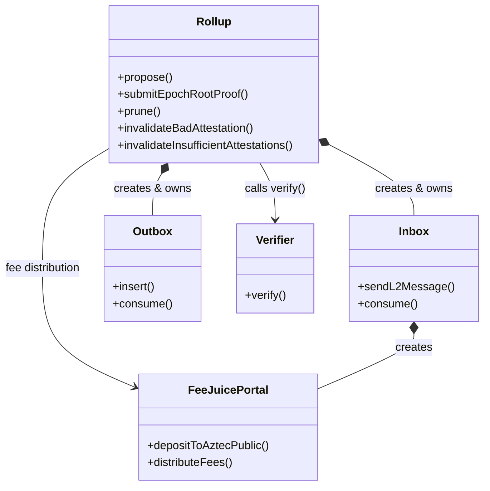
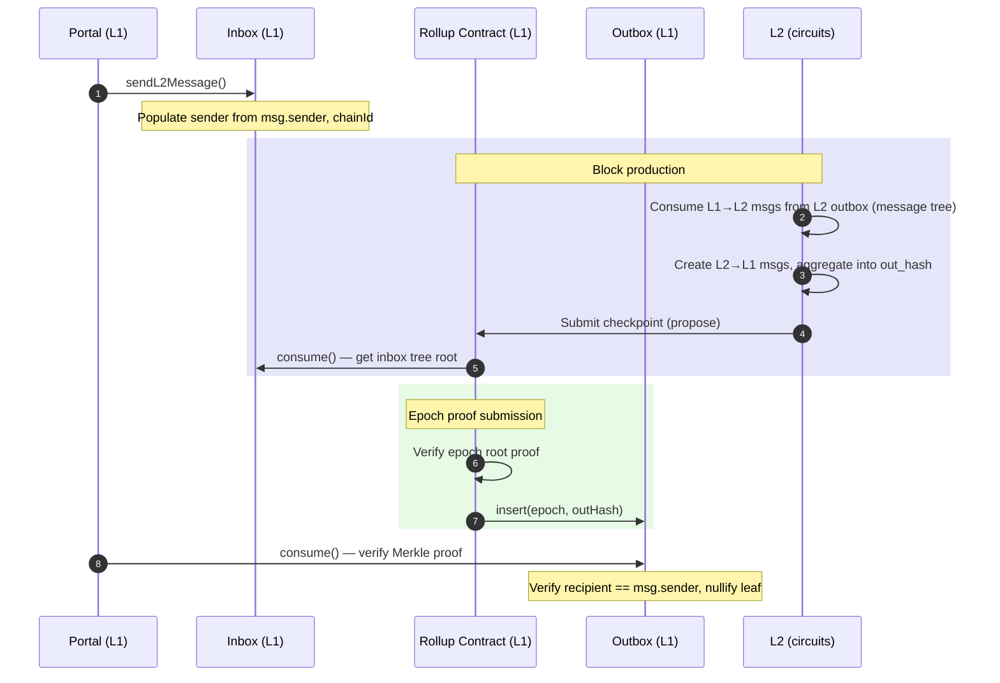
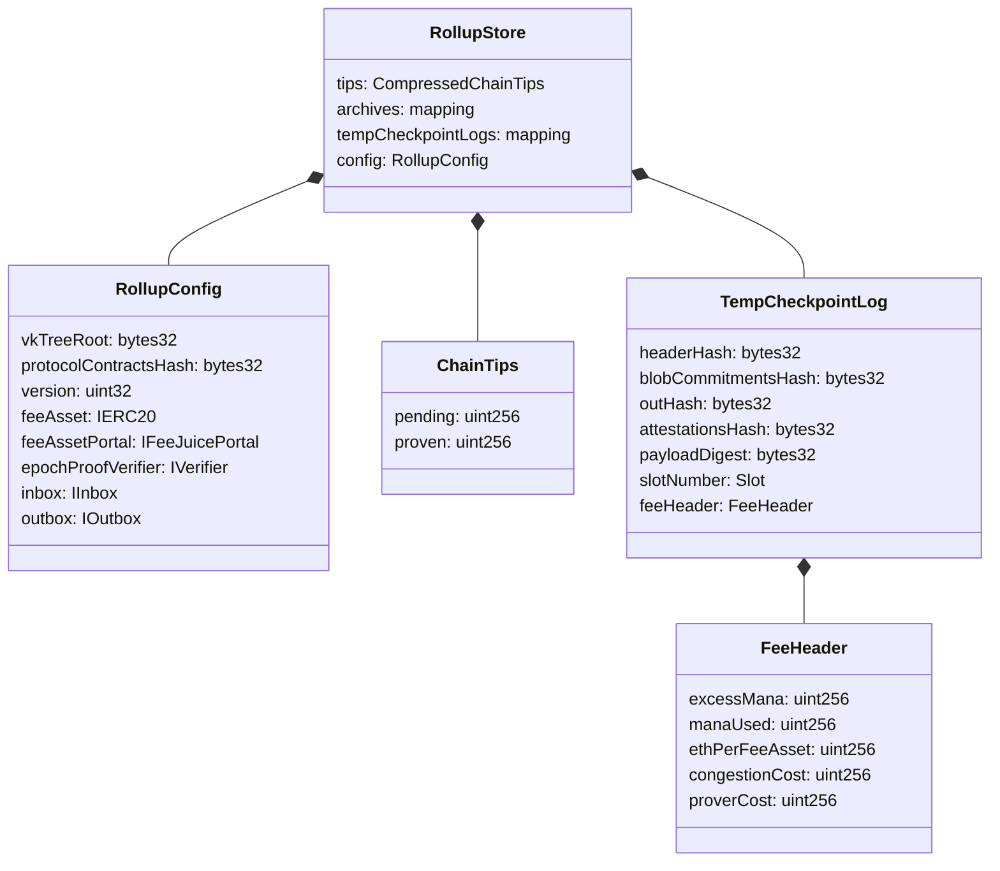
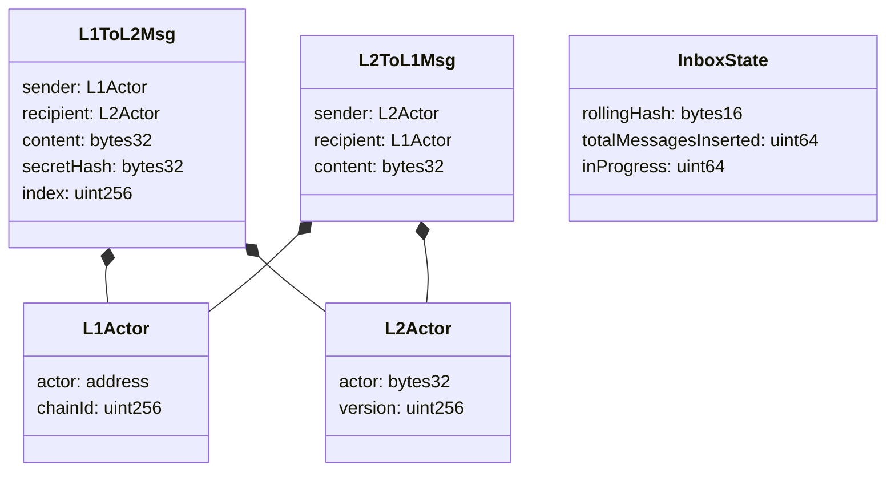

# Spec 10: L1 Rollup Contract & State Transition

## Overview

This spec defines the on-chain rollup contract that lives on Ethereum L1 and serves as the **validating light node** for the Aztec L2 network. The rollup contract verifies epoch proofs, advances L2 state, manages the pending and proven checkpoint chains, processes cross-chain messages, and coordinates the fee and reward system.

The rollup contract is the ultimate authority for L2 state finality. It stores the canonical archive tree root, verifies zero-knowledge proofs of state transitions produced by the rollup circuits (Spec #9), and provides the interface through which L1 and L2 communicate.

This spec covers:

- The state transition function: how L2 state advances on L1
- Checkpoint proposal: how sequencers submit new checkpoints
- Epoch proof submission: how provers finalize epochs
- Pruning and invalidation: how the chain recovers from failures
- The Inbox: L1-to-L2 message delivery
- The Outbox: L2-to-L1 message consumption
- Epoch and slot management
- Fee model integration
- The interface with the data availability layer (EIP-4844 blobs)

## Requirements

### R1: State Commitment Storage

The rollup contract MUST store the canonical state of the L2 chain as archive tree roots (see Spec #4). This serves as the single source of truth for L2 state on L1.

### R2: Proof Verification

The rollup contract MUST verify zero-knowledge validity proofs for epoch state transitions. Only cryptographically proven state transitions may advance the proven chain tip. The proof system uses UltraHonk with a Keccak-based transcript for EVM compatibility (see Spec #3).

### R3: Linear Chain

The rollup contract MUST enforce a linear chain with no forks. Each checkpoint MUST build on the immediately preceding checkpoint. Rollbacks are only permitted through pruning (resetting to the last proven checkpoint) or invalidation (removing checkpoints with invalid attestations).

### R4: Cross-Chain Messaging

The rollup contract MUST facilitate atomic cross-chain message passing:
- L1-to-L2 messages MUST be inserted into the Inbox and consumed during checkpoint proposal.
- L2-to-L1 messages MUST be published to the Outbox upon epoch proof verification and be consumable by L1 portal contracts.

### R5: Data Availability

The rollup contract MUST validate that checkpoint data is available via EIP-4844 blobs. Blob commitments MUST be verified against actual blob hashes during checkpoint proposal, and batched blob proofs MUST be verified during epoch proof submission.

### R6: Timing Constraints

The rollup contract MUST enforce deterministic timing:
- Slot numbers MUST correspond to the current L1 timestamp.
- Timestamps MUST be deterministically derived from slot numbers.
- Epochs MUST have bounded proof submission windows.

### R7: Proposer Authorization

The rollup contract MUST enforce that only the designated proposer for a given slot may submit a checkpoint (see validator selection). The proposer's signature MUST be verified among the submitted attestations.

### R8: Liveness

The rollup contract MUST maintain liveness. If no proof is submitted within the configured window, unproven checkpoints MUST be prunable, allowing the chain to resume from the last proven state.

### R9: Attestation Integrity

Checkpoints with invalid or insufficient attestations MUST be removable by any party via permissionless invalidation functions, preventing the chain from being permanently blocked by invalid data.

## Specification

### Contract Architecture

The rollup system is composed of multiple contracts that together form the validating light node:



The `Rollup` contract implements the `IInstance` interface, which combines `IRollup`, `IStaking`, and `IValidatorSelection`. Due to Ethereum contract size limits, functionality is split across external libraries called via `delegatecall`:

| Library | Responsibility |
|---|---|
| `ProposeLib` | Checkpoint proposal logic |
| `EpochProofLib` | Epoch proof submission and verification |
| `STFLib` | State transition function and chain state |
| `FeeLib` | Fee model and mana pricing |
| `ValidatorSelectionLib` | Committee sampling and proposer verification |
| `StakingLib` | Validator staking and entry queue |
| `RewardLib` | Reward distribution |
| `InvalidateLib` | Checkpoint invalidation |
| `BlobLib` | Blob commitment validation |
| `AttestationLib` | Attestation encoding and verification |

### On-Chain State

The rollup contract stores its state using EIP-7201 namespaced storage slots to avoid collisions across libraries.

#### RollupStore

The primary state container:

| Field | Type | Description |
|---|---|---|
| `tips` | `CompressedChainTips` | Packed pending and proven checkpoint numbers (128 bits each) |
| `archives` | `mapping(uint256 => bytes32)` | Checkpoint number to archive tree root |
| `tempCheckpointLogs` | `mapping(uint256 => CompressedTempCheckpointLog)` | Circular buffer of checkpoint metadata |
| `config` | `RollupConfig` | Immutable-after-init configuration |

#### RollupConfig

| Field | Type | Description |
|---|---|---|
| `vkTreeRoot` | `bytes32` | Root of the verification key tree |
| `protocolContractsHash` | `bytes32` | Hash of protocol contract addresses |
| `version` | `uint32` | Protocol version number |
| `feeAsset` | `IERC20` | Fee token contract |
| `feeAssetPortal` | `IFeeJuicePortal` | Fee token bridge |
| `epochProofVerifier` | `IVerifier` | Root rollup proof verifier |
| `inbox` | `IInbox` | L1-to-L2 message inbox |
| `outbox` | `IOutbox` | L2-to-L1 message outbox |

#### Chain Tips

The chain maintains two tip pointers:

| Tip | Description |
|---|---|
| `pending` | The highest checkpoint number that has been proposed (not yet proven) |
| `proven` | The highest checkpoint number that has been proven via a validity proof |

Invariant: `proven <= pending`. At genesis, both are `0`.

#### Checkpoint Metadata (TempCheckpointLog)

For each proposed checkpoint, the following metadata is stored in a circular buffer:

| Field | Type | Description |
|---|---|---|
| `headerHash` | `bytes32` | SHA-256-to-field hash of the checkpoint header |
| `blobCommitmentsHash` | `bytes32` | Accumulated hash of blob commitments for the epoch |
| `outHash` | `bytes32` | L2-to-L1 message tree root for the checkpoint |
| `attestationsHash` | `bytes32` | `keccak256` of the packed attestations |
| `payloadDigest` | `bytes32` | The digest signed by committee members |
| `slotNumber` | `CompressedSlot` | Slot in which the checkpoint was proposed |
| `feeHeader` | `CompressedFeeHeader` | Fee parameters for the checkpoint |

The circular buffer has size `maxPrunableCheckpoints + 1`, where `maxPrunableCheckpoints = epochDuration * (proofSubmissionEpochs + 1)`. A checkpoint log entry is valid if `checkpointNumber <= pending` and `pending < checkpointNumber + bufferSize`.

### Time Model

Time is divided into **slots** and **epochs** (see also Spec #1).

```
slot_timestamp = genesis_time + slot_number * slot_duration
epoch_for_slot = slot_number / epoch_duration
```

| Parameter | Description | Configured At |
|---|---|---|
| `genesisTime` | L1 timestamp at rollup deployment | Constructor |
| `slotDuration` | Duration of one slot in seconds | Constructor |
| `epochDuration` | Number of slots per epoch | Constructor |
| `proofSubmissionEpochs` | Number of epochs after an epoch ends during which proofs are accepted | Constructor |

The **proof submission deadline** for epoch `e` is epoch `e + proofSubmissionEpochs + 1`. A proof for epoch `e` is accepted at epoch `c` if `c < e + proofSubmissionEpochs + 1`.

### Checkpoint Proposal (`propose`)

Checkpoints are how L2 state progresses on L1. A checkpoint corresponds to one or more L2 blocks aggregated by a sequencer. The designated proposer for the current slot submits a checkpoint that extends the pending chain.

#### Propose Parameters

| Parameter | Type | Description |
|---|---|---|
| `args.archive` | `bytes32` | New archive root after this checkpoint |
| `args.oracleInput` | `OracleInput` | Fee asset price modifier (basis points) |
| `args.header` | `ProposedHeader` | Checkpoint header (see Spec #6) |
| `attestations` | `CommitteeAttestations` | Packed committee signatures |
| `signers` | `address[]` | Addresses of signing committee members |
| `attestationsAndSignersSignature` | `Signature` | Signature binding attestations to signers |
| `blobInput` | `bytes` | Blob commitment data: `[numBlobs (1 byte)][commitments (48 bytes each)]` |

#### Propose Algorithm

```
function propose(args, attestations, signers, attestationsAndSignersSignature, blobInput):
    // 1. Auto-prune if proof window expired
    if canPruneAtTime(block.timestamp):
        prune()

    // 2. Check if transactions are enabled (manaTarget > 0)
    isTxsEnabled = (manaTarget > 0)

    // 3. Update L1 gas fee oracle (if txs enabled)
    if isTxsEnabled:
        updateL1GasFeeOracle()

    // 4. Validate blob commitments against EIP-4844 blobs
    (blobHashes, blobsHashesCommitment, blobCommitments) = validateBlobs(blobInput)

    // 5. Compute header hash
    headerHash = sha256ToField(encode(args.header))

    // 6. Check escape hatch status
    currentEpoch = epochFromTimestamp(block.timestamp)
    (isEscapeHatch, escapeHatchProposer) = escapeHatch.isHatchOpen(currentEpoch)

    // 7. Setup epoch committee (first checkpoint of epoch, unless escape hatch)
    if not isEscapeHatch:
        setupEpoch(currentEpoch)

    // 8. Compute mana min fee components (if txs enabled)
    if isTxsEnabled:
        components = getManaMinFeeComponents(block.timestamp)

    // 9. Create payload digest
    payloadDigest = keccak256(CHECKPOINT_ATTESTATION_DOMAIN, args.archive, args.oracleInput, headerHash)

    // 10. Validate checkpoint header
    validateHeader(args.header, payloadDigest, manaMinFee, blobsHashesCommitment)

    // 11. Verify proposer authorization
    if isEscapeHatch:
        require msg.sender == escapeHatchProposer
    else:
        verifyProposer(slot, epoch, attestations, signers, payloadDigest, attestationsAndSignersSignature)

    // 12. Update chain state
    checkpointNumber = tips.pending + 1
    tips.pending = checkpointNumber
    archives[checkpointNumber] = args.archive
    storeTempCheckpointLog(checkpointNumber, headerHash, blobCommitmentsHash, outHash, ...)

    // 13. Consume L1->L2 messages (if txs enabled)
    if isTxsEnabled:
        inHash = inbox.consume(checkpointNumber)
        require args.header.inHash == inHash

    // 14. Emit CheckpointProposed event
    emit CheckpointProposed(checkpointNumber, archive, blobHashes, payloadDigest, attestationsHash)
```

#### Checkpoint Header Validation

The `validateHeader` function enforces these constraints on the `ProposedHeader` (see Spec #6 for the header format):

| Field | Constraint |
|---|---|
| `coinbase` | MUST be non-zero |
| `totalManaUsed` | MUST NOT exceed `manaLimit` (= `manaTarget * 2`) |
| `lastArchiveRoot` | MUST equal the archive root at the effective pending checkpoint number |
| `slotNumber` | MUST be strictly greater than the slot of the last pending checkpoint |
| `slotNumber` | MUST equal the slot derived from `block.timestamp` |
| `timestamp` | MUST equal `genesisTime + slotNumber * slotDuration` |
| `timestamp` | MUST NOT be in the future relative to `block.timestamp` |
| `blobsHash` | MUST match the commitment computed from actual EIP-4844 blobs |
| `gasFees.feePerDaGas` | MUST be `0` |
| `gasFees.feePerL2Gas` | MUST equal the computed mana base fee for the slot |

#### Attestation Format

Committee attestations are encoded in a packed format to minimize gas:

| Component | Description |
|---|---|
| `signatureIndices` | Bitmap where bit `i` indicates whether position `i` contains a signature |
| `signaturesOrAddresses` | Packed data: 65-byte ECDSA signatures for signers, 20-byte addresses for non-signers |

The committee commitment is reconstructed by recovering addresses from signatures (for signing members) or reading addresses directly (for non-signing members), then hashing the full committee array. This commitment MUST match the stored commitment for the epoch.

**Proposer verification**: The proposer's signature MUST be present among the attestations. The proposer index for a slot is computed as `keccak256(epoch, slot, seed) % committeeSize`. Only the proposer's signature is verified on-chain during proposal; all other signatures are verified off-chain by nodes and at proof submission time.

**Attestation threshold**: For epoch proof submission, attestations for the last checkpoint MUST have valid signatures from more than 2/3 of the committee (i.e., `validSignatures > committeeSize * 2 / 3`).

#### Payload Digest

The payload digest signed by committee members is:

```
payloadDigest = keccak256(
    SignatureDomainSeparator.checkpointAttestation,
    archive,
    oracleInput,
    headerHash
)
```

This binds the attestation to the specific checkpoint data. Committee members also sign an `attestationsAndSigners` digest that binds the packed attestation format to the signer list, preventing substitution attacks.

### Epoch Proof Submission (`submitEpochRootProof`)

After an epoch's checkpoints have been proposed, a prover generates a validity proof covering a contiguous prefix of checkpoints within the epoch. Submitting this proof advances the proven chain tip.

#### Proof Submission Parameters

| Parameter | Type | Description |
|---|---|---|
| `start` | `uint256` | First checkpoint number in the epoch (inclusive) |
| `end` | `uint256` | Last checkpoint number in the epoch (inclusive) |
| `args.previousArchive` | `bytes32` | Archive root before the first checkpoint |
| `args.endArchive` | `bytes32` | Archive root after the last checkpoint |
| `args.outHash` | `bytes32` | Root of the epoch out hash tree (L2-to-L1 messages) |
| `args.proverId` | `address` | Identifier of the prover |
| `fees` | `bytes32[]` | Array of `MAX_CHECKPOINTS_PER_EPOCH * 2` elements: `[recipient, value]` pairs |
| `attestations` | `CommitteeAttestations` | Attestations for the last checkpoint in the range |
| `blobInputs` | `bytes` | Batched blob proof data for EIP-4844 point evaluation precompile |
| `proof` | `bytes` | The root rollup validity proof |

#### Proof Submission Algorithm

```
function submitEpochRootProof(args):
    // 1. Auto-prune if needed
    if canPruneAtTime(block.timestamp):
        prune()

    // 2. Validate epoch boundaries
    endEpoch = assertAcceptable(args.start, args.end)

    // 3. Verify attestations for the last checkpoint
    verifyLastCheckpointAttestationsAndOutHash(args.end, args.attestations, args.outHash)

    // 4. Verify the epoch root proof
    //    a. Validate batched blob proof via EIP-4844 point evaluation precompile
    //    b. Assemble public inputs (111 fields)
    //    c. Verify validity proof via Verifier contract
    require verifyEpochRootProof(args)

    // 5. Advance proven tip if chain is extended
    if args.end > tips.proven:
        tips.proven = args.end
        // Insert L2->L1 messages into outbox (if non-empty)
        if args.outHash != EMPTY_EPOCH_OUT_HASH:
            outbox.insert(endEpoch, args.outHash)

    // 6. Handle rewards and fees
    handleRewardsAndFees(args, endEpoch)

    // 7. Emit event
    emit L2ProofVerified(args.end, args.proverId)
```

#### Epoch Proof Acceptance Criteria

The `assertAcceptable` function validates:

| Check | Constraint |
|---|---|
| Same epoch | `epochForCheckpoint(start) == epochForCheckpoint(end)` |
| Within deadline | Current epoch < `startEpoch + proofSubmissionEpochs + 1` |
| Epoch boundary | `start` MUST be the first checkpoint of its epoch (parent checkpoint in a prior epoch) |
| Builds on proven | `start - 1 <= tips.proven` |
| Max checkpoints | `end - start + 1 <= MAX_CHECKPOINTS_PER_EPOCH` (32) |

Multiple proofs MAY be submitted for the same epoch. The proven tip only advances if `end > tips.proven`. Provers of longer prefixes receive proportionally more rewards.

#### Public Inputs Assembly

The root rollup proof has `ROOT_ROLLUP_PUBLIC_INPUTS_LENGTH = 111` public inputs, assembled as follows (see also Spec #9):

| Offset | Field | Count | Description |
|---|---|---|---|
| 0 | `previousArchive` | 1 | Archive root before the epoch |
| 1 | `endArchive` | 1 | Archive root after the epoch |
| 2 | `outHash` | 1 | Root of epoch L2-to-L1 message tree |
| 3 | `checkpointHeaderHashes[i]` | 32 | Per-checkpoint header hashes (padded with zeros) |
| 35 | `fees[i]` | 64 | Per-checkpoint `(recipient, value)` pairs |
| 99 | `chainId` | 1 | Ethereum chain ID |
| 100 | `version` | 1 | Protocol version |
| 101 | `vkTreeRoot` | 1 | Verification key tree root |
| 102 | `protocolContractsHash` | 1 | Hash of protocol contract addresses |
| 103 | `proverId` | 1 | Prover identifier |
| 104 | `blobCommitmentsHash` | 1 | Accumulated blob commitments hash |
| 105 | `z` | 1 | Blob evaluation challenge |
| 106-108 | `y` | 3 | Blob evaluation result (BLS12-381 field as BigNum) |
| 109-110 | `c` | 2 | Blob commitment (split into 31-byte and 17-byte parts) |

The contract reconstructs these public inputs from on-chain state and the submitted arguments. The `checkpointHeaderHashes` are read from stored `TempCheckpointLog` entries. The `vkTreeRoot` and `protocolContractsHash` are read from `RollupConfig`. The chain ID is read from `block.chainid`.

**Verification**: The assembled public inputs and the proof are passed to the `Verifier` contract. The verifier MUST return `true` for the proof to be accepted.

### Pruning

Pruning resets the pending chain to the proven chain when the proof submission window for the oldest unproven epoch has expired.

```
function prune():
    require canPruneAtTime(block.timestamp)
    tips.pending = tips.proven
    emit PrunedPending(tips.proven, previousPending)
```

**Prune condition**: The oldest unproven epoch's deadline has passed. Specifically, the epoch containing checkpoint `proven + 1` has expired its proof submission window.

Pruning is triggered:
1. Manually via `prune()`
2. Automatically at the start of `propose()` and `submitEpochRootProof()`

After pruning, the chain resumes from the last proven checkpoint. All unproven checkpoints and their metadata become stale.

### Checkpoint Invalidation

Checkpoints with invalid attestations can be removed permissionlessly. This is critical for chain liveness: if a checkpoint with bad attestations blocks the chain, anyone can remove it.

#### `invalidateBadAttestation`

Removes a checkpoint if any single attestation signature is invalid (recovered address does not match the committee member at that index).

```
function invalidateBadAttestation(checkpointNumber, attestations, committee, invalidIndex):
    // Validate: checkpoint is pending, not proven, attestations hash matches,
    //           committee commitment matches, not an escape hatch epoch
    // Verify: recovered address from attestations[invalidIndex] != committee[invalidIndex]
    // Effect: tips.pending = checkpointNumber - 1
    emit CheckpointInvalidated(checkpointNumber)
```

#### `invalidateInsufficientAttestations`

Removes a checkpoint if the total number of valid attestation signatures is insufficient (does not exceed 2/3 of the committee).

```
function invalidateInsufficientAttestations(checkpointNumber, attestations, committee):
    // Validate: same pre-checks as above
    // Count valid signatures, verify: validCount <= committee.length * 2 / 3
    // Effect: tips.pending = checkpointNumber - 1
    emit CheckpointInvalidated(checkpointNumber)
```

Both functions revert the pending tip to `checkpointNumber - 1`, removing the invalid checkpoint and all subsequent ones.

### Cross-Chain Message Model

Cross-chain communication between L1 and L2 uses a paired inbox/outbox architecture. From the perspective of the rollup contract:

- **L1 Inbox** (L1 contract) is paired with the **L2 Outbox** (L2 state: the message tree in the L2 global state). Messages inserted by L1 contracts are consumed on L2.
- **L2 Inbox** (logical, not a contract) is paired with the **L1 Outbox** (L1 contract). Messages created by L2 transactions are consumed on L1.

The L2 inbox does not exist as an independent structure because it keeps no state between blocks. Every L2-to-L1 message created in a block is consumed and moved to the L1 outbox within the same block by the rollup circuits.

**Portals**: L1 contracts that communicate with L2 contracts are called portals. A portal is the L1 counterpart of an L2 contract, responsible for sending messages into the Inbox and consuming messages from the Outbox. When consuming a message from the Outbox, a portal MUST verify that the message was sent from the expected L2 contract, since multiple L2 contracts can send messages to the same L1 address.

**Hash function**: Messages are hashed using SHA-256-to-field (see Spec #3) for gas efficiency on L1. The L1 Inbox builds Frontier Merkle Trees using SHA-256, which are then converted into snark-friendly trees (using Poseidon2) by the tree parity circuits (see Spec #9) before insertion into L2 state.



### Inbox (L1-to-L2 Messages)

The Inbox contract handles L1-to-L2 message passing. It uses a series of **Frontier Merkle Trees** (one per checkpoint) to accumulate messages.

#### Inbox State

| Field | Type | Description |
|---|---|---|
| `rollingHash` | `bytes16` | Rolling keccak256 hash of all inserted leaves |
| `totalMessagesInserted` | `uint64` | Total number of messages ever inserted |
| `inProgress` | `uint64` | Checkpoint number of the tree currently accepting messages |

#### Message Insertion (`sendL2Message`)

```
function sendL2Message(recipient, content, secretHash) -> (hash, index):
    require recipient.actor <= MAX_FIELD_VALUE
    require recipient.version == VERSION
    require content <= MAX_FIELD_VALUE
    require secretHash <= MAX_FIELD_VALUE
    require rollup.getManaTarget() > 0    // Messages blocked during ignition

    message = L1ToL2Msg(sender: L1Actor(msg.sender, chainId), recipient, content, secretHash, index)
    leaf = sha256ToField(encode(message))

    // Insert into current frontier tree; advance to next if full
    if currentTree.isFull:
        inProgress += 1
    currentTree.insertLeaf(leaf)

    rollingHash = keccak256(rollingHash, leaf)
    emit MessageSent(inProgress, index, leaf, rollingHash)
```

The L1ToL2Msg structure:

| Field | Type | Description |
|---|---|---|
| `sender.actor` | `address` | L1 sender address |
| `sender.chainId` | `uint256` | L1 chain ID |
| `recipient.actor` | `bytes32` | L2 recipient address |
| `recipient.version` | `uint256` | Protocol version |
| `content` | `bytes32` | Application-specific content |
| `secretHash` | `bytes32` | Secret hash for private consumption on L2 |
| `index` | `uint256` | Global leaf index across all trees |

The `version` field in `L2Actor` identifies which rollup instance a message is intended for or sent from, allowing multiple rollup instances to share the same inbox/outbox contracts. Only message **hashes** are stored and moved between chains to minimize L1 storage costs; full message content is reconstructed off-chain for consumption proofs.

Messages from the `FeeJuicePortal` use a magic sender address (`FEE_JUICE_ADDRESS = 5`) so the L2 fee juice contract can be initialized at genesis.

#### Message Consumption (`consume`)

```
function consume(checkpointNumber) -> root:
    require msg.sender == ROLLUP
    require checkpointNumber < inProgress

    if checkpointNumber > INITIAL_CHECKPOINT_NUMBER:
        root = trees[checkpointNumber].root()
    else:
        root = EMPTY_ROOT

    // Advance the in-progress tree if at expected position
    if checkpointNumber + LAG == inProgress:
        inProgress += 1

    return root
```

The **LAG** parameter ensures a minimum delay between when messages are inserted and when they can be consumed. At checkpoint `n`, the tree consumed is tree `n`, which was being built during previous checkpoints. This prevents sequencer DOS attacks where an attacker inserts messages that change the tree root after the sequencer has already committed to it.

#### Frontier Merkle Tree

Each message tree is a **Frontier Merkle Tree** of height `L1_TO_L2_MSG_SUBTREE_HEIGHT = 10`, supporting up to `2^10 = 1024` messages. This tree stores only the rightmost non-empty node at each level (the "frontier"), minimizing on-chain storage. It uses SHA-256-to-field as the hash function (gas-efficient on L1).

**State**: Each tree stores a `frontier` mapping (level to node hash) and a `nextIndex` counter. A shared `zeros` mapping (level to empty subtree root) is precomputed once and reused across all trees:

```
zeros[0] = 0x00...00
for i in 1..HEIGHT:
    zeros[i] = sha256ToField(zeros[i-1] || zeros[i-1])
```

**Level computation**: The level to update on insertion equals the number of trailing ones in the binary representation of the insertion index. Each `1` bit in the index represents a right-turn down the tree; counting trailing ones finds the height of the largest filled subtree.

```
function computeLevel(index) -> level:
    count = 0
    while (index & 1 == 1):
        count += 1
        index >>= 1
    return count
```

**Insertion**: Hash the new leaf upward through existing frontier values to compute the root of the largest subtree filled by this insertion, then store the result.

```
function insertLeaf(leaf) -> index:
    index = nextIndex
    level = computeLevel(index)
    right = leaf
    for i in 0..level:
        right = sha256ToField(frontier[i] || right)
    frontier[level] = right
    nextIndex += 1
    return index
```

**Root computation**: Walk up from the last-updated frontier level, using frontier values for filled subtrees and precomputed zero hashes for empty ones.

```
function root() -> bytes32:
    if nextIndex == 0:
        return zeros[HEIGHT]
    if nextIndex == SIZE:
        return frontier[HEIGHT]

    index = nextIndex - 1
    level = computeLevel(index)
    temp = frontier[level]

    bits = index >> level
    for i in level..HEIGHT:
        if bits & 1 == 1:
            temp = sha256ToField(frontier[i] || temp)
        else:
            temp = sha256ToField(temp || zeros[i])
        bits >>= 1
    return temp
```

### Outbox (L2-to-L1 Messages)

The Outbox contract handles L2-to-L1 message consumption. Message roots are inserted by the rollup contract upon epoch proof verification.

#### Outbox State

```
mapping(Epoch => RootData) roots

struct RootData {
    root: bytes32           // Out hash tree root for the epoch
    nullified: BitMap       // Bitmap tracking consumed messages by leaf ID
}
```

#### Message Insertion

```
function insert(epoch, root):
    require msg.sender == ROLLUP
    roots[epoch].root = root
    emit RootAdded(epoch, root)
```

Called by the rollup during `submitEpochRootProof` when `outHash != EMPTY_EPOCH_OUT_HASH`.

#### Message Consumption

```
function consume(message, epoch, leafIndex, path):
    require path.length < 256
    require leafIndex < 2^path.length
    require message.sender.version == VERSION
    require msg.sender == message.recipient.actor
    require block.chainid == message.recipient.chainId

    root = roots[epoch].root
    require root != 0

    // Compute stable leaf ID: position in the binary tree
    leafId = (1 << path.length) + leafIndex
    require not nullified[leafId]

    messageHash = sha256ToField(encodePacked(message))
    verifyMembership(path, messageHash, leafIndex, root)

    nullified.set(leafId)
    emit MessageConsumed(epoch, root, messageHash, leafId)
```

The L2ToL1Msg structure:

| Field | Type | Description |
|---|---|---|
| `sender.actor` | `bytes32` | L2 sender address |
| `sender.version` | `uint256` | Protocol version |
| `recipient.actor` | `address` | L1 recipient address |
| `recipient.chainId` | `uint256` | L1 chain ID |
| `content` | `bytes32` | Application-specific content |

**Leaf ID stability**: Leaf IDs are computed as `(1 << treeHeight) + leafIndex`, which is stable across different epoch proof lengths. When a longer proof replaces a shorter one for the same epoch, previously consumed messages retain their consumed status because their leaf IDs remain unchanged.

**Merkle verification**: Uses SHA-256-to-field for hashing (see Spec #3). The verification includes an index overflow check: after traversing the full path, `indexAtHeight` MUST equal 0, preventing replay attacks with oversized indices.

### L2-Side Message Handling

While the L1 contracts manage the L1 side of cross-chain messaging, the L2 side is handled by the kernel and rollup circuits. This section summarizes the L2 behavior that the L1 contracts depend on for correctness.

#### L2 Inbox (Logical)

The L2 inbox is not a contract but a logical concept. When an L2 transaction creates an L2-to-L1 message, the kernel circuit populates the sender fields:

- `L2Actor.actor`: The L2 contract address sending the message
- `L2Actor.version`: The protocol version of the L2 chain

These message hashes are aggregated into a tree by the rollup circuits (see Spec #9) and the resulting `outHash` is included in the checkpoint header. The state transitioner then inserts this root into the L1 Outbox upon epoch proof verification.

#### L2 Outbox (Message Tree)

The L2 outbox is the message tree within the L2 global state (see Spec #4). It is populated by the state transitioner when L1-to-L2 messages are consumed from the Inbox and converted from SHA-256 trees to snark-friendly trees via the tree parity circuits (see Spec #9).

To consume an L1-to-L2 message on L2, an application circuit (Aztec contract) MUST:

1. Prove that the message exists in the L2 message tree (outbox)
2. Verify that the message sender matches the expected L1 portal contract
3. Verify that the message recipient matches the consuming contract and that the version matches
4. Verify that the caller knows the `secret` that hashes to the message's `secretHash`
5. Emit a nullifier computed from the `secret`, message hash, and message index in the tree to prevent double-spending

The `secretHash` mechanism ensures that L1-to-L2 message consumption on L2 can be private: only actors with knowledge of the `secret` can determine when a message is spent.

### Blob Validation

Checkpoint data availability is guaranteed through EIP-4844 blobs.

#### During Checkpoint Proposal

1. The proposer provides `blobInput` containing the number of blobs and their KZG commitments (48 bytes each).
2. For each blob, the contract computes `sha256(commitment)` with version byte `0x01` and compares against `blobhash(i)` from the EVM opcode.
3. The `blobsHashesCommitment` is computed as `sha256ToField(all_blob_hashes)` and MUST match `header.blobsHash`.
4. A `blobCommitmentsHash` is accumulated per epoch: `sha256ToField(prevHash, commitment_i)`, reinitialized at the first checkpoint of each epoch.

#### During Epoch Proof Submission

1. The batched blob proof is validated by calling the EIP-4844 point evaluation precompile at `address(0x0A)`.
2. The `blobCommitmentsHash` for the last checkpoint in the proven range is included in the proof's public inputs.
3. The blob evaluation challenge `z`, result `y`, and commitment `c` are extracted from `blobInputs` and included in the public inputs.

### Fee Model Integration

The rollup contract integrates an EIP-4844-style fee model (detailed fee specification is out of scope for this spec; only the L1 contract interface is described here).

#### Fee Header

Each checkpoint stores a compressed fee header:

| Field | Bits | Description |
|---|---|---|
| `manaUsed` | 32 | Mana consumed in the checkpoint |
| `excessMana` | 48 | Accumulated excess mana (drives congestion pricing) |
| `ethPerFeeAsset` | 48 | ETH/fee-asset exchange rate (1e12 precision) |
| `congestionCost` | 64 | Congestion cost component per mana |
| `proverCost` | 63 | Prover cost component per mana |
| `preHeat` | 1 | Storage pre-warming flag |

#### Mana Base Fee Computation

The L2 gas fee (`feePerL2Gas`) in the checkpoint header MUST equal the computed mana base fee, which has three components:

1. **Sequencer cost**: Amortized L1 gas and blob fees for posting checkpoint data.
2. **Prover cost**: Amortized L1 gas for proof verification plus configured proving cost per mana.
3. **Congestion cost**: EIP-4844-style exponential function of excess mana: `fakeExponential(MINIMUM_CONGESTION_MULTIPLIER, excessMana, congestionUpdateFraction)`.

The `excessMana` for a checkpoint is computed as:
```
excessMana = clampedAdd(parent.excessMana + parent.manaUsed, -manaTarget)
```

The **mana limit** per checkpoint is `manaTarget * 2`.

#### L1 Gas Fee Oracle

The contract maintains an on-chain oracle for L1 gas fees (base fee and blob fee), updated each time a checkpoint is proposed. The oracle uses a two-value system (`pre` and `post`) with a `slotOfChange` to smooth fee transitions:

- Oracle values have a `LIFETIME` of 5 slots and a `LAG` of 2 slots.
- When the current slot exceeds `slotOfChange + LIFETIME`, the oracle rotates: `pre = post`, `post` is updated with current L1 fees.

#### Fee Asset Price Oracle

The ETH-per-fee-asset exchange rate is updated per checkpoint by applying a modifier in basis points (max ±100 bps = ±1%), clamped between `MIN_ETH_PER_FEE_ASSET` (100, representing ~1e-10 ETH) and `MAX_ETH_PER_FEE_ASSET` (1e14, representing ~100 ETH).

### Reward Distribution

Upon epoch proof verification, rewards and fees are distributed:

1. **Checkpoint rewards**: Claimed from the `RewardDistributor` (governance-controlled). Split between sequencers (`sequencerBps` basis points) and the prover pool.
2. **Fee distribution** per checkpoint:
   - **Congestion portion**: Burned (sent to `BURN_ADDRESS = address(bytes20("CUAUHXICALLI"))`).
   - **Prover fee**: Directed to the prover reward pool.
   - **Sequencer fee**: Accumulated for the checkpoint's coinbase address.
3. **Prover rewards**: Multiple provers may submit proofs for the same epoch. Rewards are proportional to proof length, weighted by a `RewardBooster` that favors consistent provers.

Sequencers claim rewards via `claimSequencerRewards(coinbase)`. Provers claim via `claimProverRewards(coinbase, epochs[])`.

### Escape Hatch

The escape hatch provides an alternative checkpoint production path when the normal committee is unavailable. It operates on a coarser time granularity than epochs (one "hatch" spans multiple epochs).

During an escape hatch period:
- A pre-selected designated proposer (from a separate candidate set with a bond) may propose checkpoints.
- Committee attestations are not required.
- Epoch setup is skipped.
- Attestation verification is skipped during proof submission.

The escape hatch ensures liveness even when the validator committee fails to produce checkpoints.

### Genesis

The rollup contract is initialized with:

| Parameter | Value | Description |
|---|---|---|
| `genesisArchiveRoot` | `GENESIS_ARCHIVE_ROOT` | Initial archive tree root (see Spec #2) |
| `vkTreeRoot` | Configured | Root of verification key tree |
| `protocolContractsHash` | Configured | Hash of protocol contract addresses |

At genesis:
- `tips.pending = 0`, `tips.proven = 0`
- `archives[0] = GENESIS_ARCHIVE_ROOT`
- A genesis fee header is written at checkpoint 0 with the initial `ethPerFeeAsset`
- The Inbox is initialized with `inProgress = INITIAL_CHECKPOINT_NUMBER + LAG`

### Ignition Phase

The protocol supports an "ignition" phase where `manaTarget = 0`. During ignition:
- No transactions are processed (the chain produces empty checkpoints).
- L1-to-L2 messages are blocked (`sendL2Message` reverts).
- Fee computation and L1 gas oracle updates are skipped.
- Inbox consumption is skipped.

Ignition ends when governance sets `manaTarget > 0` via `updateManaTarget`. At that point, the inbox catches up to the current pending checkpoint number.

## Data Structures

### Core Contract Data Structures



### Message Data Structures



### Epoch Proof Public Inputs

| Index | Field | Type |
|---|---|---|
| 0 | `previousArchive` | `Field` |
| 1 | `endArchive` | `Field` |
| 2 | `outHash` | `Field` |
| 3..34 | `checkpointHeaderHashes` | `Field[32]` |
| 35..98 | `fees` | `(EthAddress, Field)[32]` |
| 99 | `chainId` | `Field` |
| 100 | `version` | `Field` |
| 101 | `vkTreeRoot` | `Field` |
| 102 | `protocolContractsHash` | `Field` |
| 103 | `proverId` | `Field` |
| 104 | `blobCommitmentsHash` | `Field` |
| 105 | `z` | `Field` |
| 106..108 | `y` | `BLS12_381_Fr` (3 limbs) |
| 109..110 | `c` | `Field[2]` |

Total: 111 fields (see also Spec #9, `ROOT_ROLLUP_PUBLIC_INPUTS_LENGTH`).

## Validation Rules

### V1: Checkpoint Proposal Validation

A checkpoint proposal MUST be rejected if any of the following are true:
1. The `coinbase` address is zero.
2. `totalManaUsed` exceeds `manaLimit`.
3. `lastArchiveRoot` does not match the archive at the effective pending checkpoint.
4. `slotNumber` is not strictly greater than the last pending checkpoint's slot.
5. `slotNumber` does not equal the slot derived from `block.timestamp`.
6. `timestamp` does not equal `genesisTime + slotNumber * slotDuration`.
7. `timestamp` is in the future relative to `block.timestamp`.
8. `blobsHash` does not match the commitment computed from actual EIP-4844 blobs.
9. `gasFees.feePerDaGas` is non-zero.
10. `gasFees.feePerL2Gas` does not equal the computed mana base fee.
11. The proposer is not the designated proposer for the slot (or, during escape hatch, not the designated escape hatch proposer).
12. The `inHash` from the consumed inbox tree does not match `header.inHash` (when transactions are enabled).

### V2: Epoch Proof Validation

An epoch proof submission MUST be rejected if any of the following are true:
1. `start` and `end` are not in the same epoch.
2. The current epoch exceeds the proof submission deadline for the proven epoch.
3. `start` is not the first checkpoint of its epoch.
4. `start - 1` exceeds the current proven tip (proof does not build on proven chain).
5. `end - start + 1` exceeds `MAX_CHECKPOINTS_PER_EPOCH` (32).
6. The attestations for the last checkpoint do not match the stored attestations hash.
7. The `outHash` does not match the stored value for the last checkpoint.
8. Attestation signatures are insufficient (not > 2/3 of committee), unless it is an escape hatch epoch.
9. The batched blob proof fails EIP-4844 point evaluation verification.
10. `previousArchive` does not match `archives[start - 1]`.
11. `endArchive` does not match `archives[end]`.
12. The validity proof fails verification against the assembled public inputs.

### V3: L1-to-L2 Message Validation

A message insertion into the Inbox MUST be rejected if:
1. `recipient.actor` exceeds `MAX_FIELD_VALUE`.
2. `recipient.version` does not equal the Inbox's `VERSION`.
3. `content` exceeds `MAX_FIELD_VALUE`.
4. `secretHash` exceeds `MAX_FIELD_VALUE`.
5. `manaTarget` is zero (ignition phase).

### V4: L2-to-L1 Message Consumption Validation

A message consumption from the Outbox MUST be rejected if:
1. `path.length >= 256`.
2. `leafIndex >= 2^path.length`.
3. `message.sender.version` does not equal the Outbox's `VERSION`.
4. `msg.sender` does not equal `message.recipient.actor`.
5. `block.chainid` does not equal `message.recipient.chainId`.
6. No root exists for the given epoch.
7. The message has already been consumed (nullified).
8. The Merkle membership proof is invalid.

### V5: L1-to-L2 Message Consumption on L2

While L1-to-L2 message consumption occurs on L2 (in application circuits, not L1 contracts), the following rules are part of the protocol's cross-chain message integrity guarantees:

1. The consuming contract SHOULD verify the `sender` details against the expected L1 portal contract.
2. The consuming contract SHOULD verify that the `secret` provided by the caller hashes to the message's `secretHash`.
3. The consuming contract SHOULD verify the `recipient` details against its own address and version.
4. The consuming contract SHOULD emit a nullifier to prevent double-spending.
5. The consuming contract SHOULD verify that the message exists in the L2 message tree.

### V6: Checkpoint Invalidation Validation

A checkpoint invalidation MUST be rejected if:
1. The checkpoint number is not in the pending chain (`checkpointNumber <= proven` or `checkpointNumber > pending`).
2. The provided attestations hash does not match the stored hash.
3. The committee commitment does not match the stored commitment for the epoch.
4. The checkpoint is in an escape hatch epoch.
5. For `invalidateBadAttestation`: the recovered address at `invalidIndex` matches the committee member (attestation is valid).
6. For `invalidateInsufficientAttestations`: the number of valid signatures exceeds `committee.length * 2 / 3`.

### V7: Pruning Validation

Pruning MUST be rejected if:
1. The proof submission window for the oldest unproven epoch has not yet expired.

## Open Questions

1. **Governance upgrade path**: The spec does not fully specify how the rollup contract is upgraded. The `Registry` tracks versioned rollup instances, and governance can register new versions, but the migration path for in-flight checkpoints and messages needs clarification.

2. **Partial epoch proof incentives**: Multiple provers can submit proofs for the same epoch with different prefix lengths. The reward mechanism incentivizes longer proofs, but the game theory around competing partial proofs needs further analysis.

3. **Fee asset price oracle manipulation**: The per-checkpoint ±1% fee asset price modifier is constrained but could still be manipulated by a colluding proposer sequence. The long-term bounds and economic security of this mechanism need review.

4. **Blob commitment hash chaining**: The `blobCommitmentsHash` is chained across checkpoints within an epoch via `sha256ToField(prevHash, commitment_i)`. The security implications of this incremental construction versus a single epoch-wide commitment need analysis.

5. **Circular buffer size constraints**: The `tempCheckpointLogs` circular buffer size is `epochDuration * (proofSubmissionEpochs + 1) + 1`. If timing parameters change via governance, the buffer size becomes fixed at deployment. The implications of parameter changes on buffer validity need clarification.

6. **Escape hatch proof verification**: During escape hatch epochs, attestation verification is skipped at proof submission. The security implications of this relaxation and the escape hatch bond mechanism's sufficiency as a substitute need review.

## Security Considerations

### Attestation Deferred Verification

Committee attestations are NOT fully verified on-chain during checkpoint proposal (only the proposer's signature is checked). This is a deliberate gas optimization. Full attestation verification is deferred to:
1. Off-chain validation by nodes downloading checkpoints.
2. On-chain verification at epoch proof submission time.
3. Permissionless invalidation if invalid attestations are detected.

This design assumes an honest minority of observers who will call `invalidateBadAttestation` or `invalidateInsufficientAttestations` if they detect problems.

### Proof Submission Window

The bounded proof submission window prevents indefinite chain stalling. If a committee withholds data (preventing proof generation), the chain prunes and resumes. Committee members of unproven epochs face slashing via the governance-based slashing mechanism.

### Reorg Safety

The rollup contract's state depends on L1 finality. A proven checkpoint is only truly final when the L1 block containing the proof verification transaction is finalized. Before L1 finality, an L1 reorg could revert the proof submission.

### Cross-Chain Message Atomicity

L1-to-L2 messages are consumed atomically during checkpoint proposal: the inbox tree root consumed MUST match the `inHash` in the checkpoint header. L2-to-L1 messages are published atomically during proof verification: the `outHash` from the proof is inserted into the outbox.

### Data Availability

Blob commitments are validated during proposal (matching `blobhash` opcodes) and during proof submission (point evaluation precompile). This ensures that checkpoint data was available in EIP-4844 blobs at proposal time and that the proof covers the correct data.

## References

- Spec #1: Protocol Overview & Architecture — rollup hierarchy, settlement flow
- Spec #2: Constants — genesis values, tree heights, timing constants, serialization lengths
- Spec #3: Cryptographic Primitives — SHA-256-to-field, Poseidon2, Merkle operations
- Spec #4: State Model & Merkle Trees — archive tree, frontier tree data structure
- Spec #5: Transaction Format & Lifecycle — fee computation, transaction effects
- Spec #6: Block Format & Header — checkpoint header format, byte serialization, propose parameters
- Spec #9: Rollup Circuits — root rollup public inputs, proof hierarchy, blob accumulator
