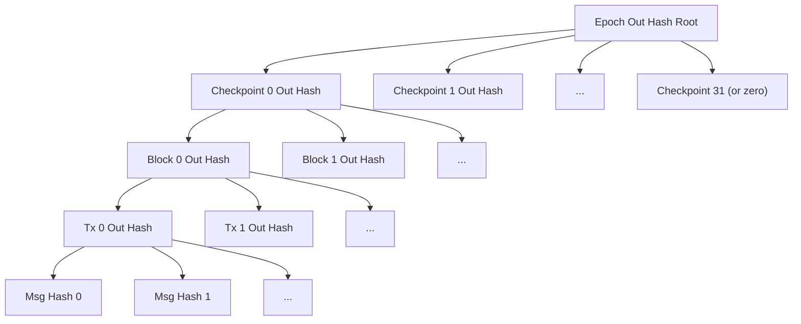

# Cross-Chain Messaging

## Overview

This specification defines the cross-chain messaging protocol between Ethereum L1 and Aztec L2. Cross-chain messages are **unilateral** and **asynchronous**: the sender inserts a message on one chain, and the recipient consumes it on the other chain at a later time without requiring cooperation from the sender.

Two message directions exist:

- **L1-to-L2 (Inbox)**: An L1 contract sends a message to an L2 contract. Messages are accumulated into a Frontier Merkle Tree on L1, included in an L2 checkpoint via the parity circuits, and consumed by L2 contracts through Merkle membership proofs.
- **L2-to-L1 (Outbox)**: An L2 contract sends a message to an L1 contract. Messages are accumulated through the rollup circuit hierarchy into an epoch out hash, published to the L1 Outbox contract upon epoch proof verification, and consumed by L1 contracts through Merkle membership proofs.

SHA-256 is used for all cross-chain message hashing because both chains must verify message membership — SHA-256 provides a practical balance between EVM gas cost and circuit constraints.

### Relationship to Other Specs

| Topic | Spec | What It Covers |
|-------|------|----------------|
| L1-to-L2 message tree structure | [Spec #4](04-state-model.md) | Tree dimensions, leaf format, insertion, dual-root architecture |
| Block and checkpoint headers | [Spec #6](06-blocks.md) | `in_hash` and `epoch_out_hash` fields in headers |
| Parity circuits, out hash accumulation | [Spec #9](09-rollup-circuits.md) | Circuit-level processing of messages through rollup hierarchy |
| Inbox/Outbox L1 contracts | [Spec #10](10-l1-rollup-contract.md) | L1 contract state, propose/proof flows, Frontier tree, bitmap nullification |
| All numeric constants | [Spec #2](02-constants.md) | Tree heights, message limits, domain separators |

This spec focuses on the **end-to-end message lifecycle**, **message format and hashing**, **consumption mechanics on L2**, and the **out hash tree structure** that ties these components together.

## Requirements

**R1. Censorship resistance.** Any L1 account MUST be able to send a message to any L2 contract without permission from the sequencer. The LAG parameter ensures messages are available for inclusion before they can be consumed.

**R2. Replay protection.** Each message MUST be consumable exactly once. L1-to-L2 messages are replay-protected via nullifiers on the L2 nullifier tree. L2-to-L1 messages are replay-protected via a bitmap in the L1 Outbox contract.

**R3. Privacy for L1-to-L2 consumption.** L1-to-L2 messages include a `secretHash` field so that the consumption event on L2 does not publicly reveal which message is being consumed until the consumer provides the preimage.

**R4. Cross-chain integrity.** The rollup proof MUST commit to the exact set of L1-to-L2 messages consumed (via `in_hash`) and the exact set of L2-to-L1 messages produced (via `epoch_out_hash`). Both values are verified on L1.

**R5. Stable message identifiers.** L2-to-L1 message leaf IDs MUST remain stable when longer epoch proofs are submitted, ensuring that already-consumed messages remain marked as consumed.

**R6. EVM compatibility.** All message hashes used in cross-chain membership proofs MUST use SHA-256 truncated to a field element, enabling verification on both L1 (Solidity) and L2 (circuits).

## Specification

### Message Structures

#### L1Actor

Identifies a contract on L1.

| Field | Type | Description |
|-------|------|-------------|
| `actor` | `address` (20 bytes) | Ethereum address of the L1 contract |
| `chainId` | `uint256` | Chain ID of the L1 network |

#### L2Actor

Identifies a contract on L2.

| Field | Type | Description |
|-------|------|-------------|
| `actor` | `bytes32` | Aztec address of the L2 contract |
| `version` | `uint256` | Rollup version identifier |

#### L1ToL2Msg

| Field | Type | Description |
|-------|------|-------------|
| `sender` | `L1Actor` | The L1 contract that sent the message |
| `recipient` | `L2Actor` | The L2 contract that should receive the message |
| `content` | `bytes32` | Application-specific message content (a field element) |
| `secretHash` | `bytes32` | Hash of a secret known to the intended L2 consumer |
| `index` | `uint256` | Global leaf index in the L1-to-L2 message tree |

The `index` field is the **global** leaf index across all checkpoints, computed as:

```
index = (checkpointNumber - INITIAL_CHECKPOINT_NUMBER) * SIZE + subtreeIndex
```

where `SIZE = 2^L1_TO_L2_MSG_SUBTREE_HEIGHT` (1024).

#### L2ToL1Message (L2 Circuit Representation)

Within the L2 protocol circuits, an L2-to-L1 message contains only the fields under the application's control:

| Field | Type | Description |
|-------|------|-------------|
| `recipient` | `EthAddress` | Ethereum address of the intended L1 recipient |
| `content` | `Field` | Application-specific message content |

The remaining fields (`sender`, `version`, `chainId`) are added during circuit processing — the sender is added by the kernel circuit (scoping), and version/chain ID are added during hash computation in the rollup circuits.

#### L2ToL1Msg (L1 Representation)

On L1, the full message structure used for Outbox consumption is:

| Field | Type | Description |
|-------|------|-------------|
| `sender` | `L2Actor` | The L2 contract that sent the message |
| `recipient` | `L1Actor` | The L1 contract that should receive the message |
| `content` | `bytes32` | Application-specific message content |

### Message Hash Computation

All message hashes use `sha256ToField`: the SHA-256 hash with the first byte of the output replaced by `0x00`, producing a value that fits in a BN254 scalar field element. This truncation matches the Noir `to_be_bytes` convention.

#### L1-to-L2 Message Hash

The L1-to-L2 message hash is computed over the ABI-encoded message fields. On L1 (Solidity):

```
sha256ToField(abi.encode(sender, recipient, content, secretHash, index))
```

The encoding uses `abi.encode` (standard ABI encoding with padding), producing 7 × 32 = 224 bytes:

| Byte Offset | Size | Content |
|-------------|------|---------|
| 0 | 32 | `sender.actor` (address, left-padded to 32 bytes) |
| 32 | 32 | `sender.chainId` |
| 64 | 32 | `recipient.actor` |
| 96 | 32 | `recipient.version` |
| 128 | 32 | `content` |
| 160 | 32 | `secretHash` |
| 192 | 32 | `index` |

On L2 (Noir circuits), the same hash is reconstructed from the component fields with identical byte layout.

#### L2-to-L1 Message Hash

The L2-to-L1 message hash is computed over the packed message fields. On L1 (Solidity):

```
sha256ToField(abi.encodePacked(sender.actor, sender.version, recipient.actor, recipient.chainId, content))
```

This produces a 148-byte buffer:

| Byte Offset | Size | Content |
|-------------|------|---------|
| 0 | 32 | `sender.actor` (L2 contract address) |
| 32 | 32 | `sender.version` (rollup version) |
| 64 | 20 | `recipient.actor` (Ethereum address, not padded) |
| 84 | 32 | `recipient.chainId` |
| 116 | 32 | `content` |

On L2 (Noir circuits), the hash is computed in the Tx Base Rollup circuit with the same byte layout, using the `Scoped<L2ToL1Message>` fields plus `version` and `chain_id` from the transaction context.

### L1-to-L2 Message Lifecycle

#### Step 1: Insertion on L1

An L1 contract (the "portal") sends a message by calling `Inbox.sendL2Message(recipient, content, secretHash)`. The Inbox contract:

1. Validates that `recipient.actor`, `content`, and `secretHash` are within the field modulus (`MAX_FIELD_VALUE`).
2. Validates that `recipient.version` matches the rollup `VERSION`.
3. Validates that the rollup is past the ignition phase (`manaTarget > 0`).
4. Constructs the `L1ToL2Msg` with `sender = L1Actor(msg.sender, block.chainid)` and the computed global `index`.
5. Computes `leaf = sha256ToField(message)`.
6. Inserts the leaf into the current checkpoint's Frontier Merkle Tree.
7. Updates the rolling hash: `rollingHash = keccak256(rollingHash, leaf)` (truncated to 16 bytes).
8. Emits `MessageSent(checkpointNumber, index, leaf, rollingHash)`.

**Special case — FeeJuicePortal:** When `msg.sender` is the FeeJuicePortal address, the `sender.actor` is replaced with the magic address `FEE_JUICE_ADDRESS` (constant value 5). This enables deterministic initialization at genesis without deploying a portal at a specific address.

**Content hash pattern:** Portal contracts typically compute `content` as `sha256ToField(abi.encodeWithSignature("functionName(types...)", args...))`. The L2 contract reconstructs this hash to verify the message content.

#### Step 2: Inbox Consumption During Propose

When a checkpoint is proposed, the rollup contract calls `Inbox.consume(checkpointNumber)`, which:

1. Validates that `checkpointNumber < inProgress` (the LAG ensures this).
2. Returns the SHA-256 Merkle root of the consumed tree (or the empty root for the initial checkpoint).
3. Advances `inProgress` if the consumed checkpoint is at the expected position.

The returned root becomes the checkpoint's `in_hash`. The rollup contract validates that the proposed header's `inHash` matches this value.

See [Spec #10](10-l1-rollup-contract.md) for complete Inbox contract specification including the Frontier Merkle Tree and LAG parameter.

#### Step 3: Parity Circuit Processing

The parity circuits convert the 1024 L1-to-L2 messages from their SHA-256 representation (for L1 verification) to a Poseidon2 representation (for the L2 state tree). See [Spec #9](09-rollup-circuits.md) for the parity circuit specification.

The parity root circuit outputs:
- `sha_root`: SHA-256 Merkle root of the messages → verified against L1 Inbox as `in_hash`.
- `converted_root`: Poseidon2 Merkle root of the same messages → inserted into the L1-to-L2 message tree.

#### Step 4: L1-to-L2 Message Tree Insertion

The `converted_root` from the parity circuit is inserted as a subtree of height `L1_TO_L2_MSG_SUBTREE_HEIGHT` (10) into the L1-to-L2 message tree. This occurs only in the **first block** of each checkpoint. See [Spec #4](04-state-model.md) for the tree structure.

#### Step 5: Consumption on L2

An L2 contract consumes an L1-to-L2 message by proving membership in the L1-to-L2 message tree and emitting a nullifier to prevent replay.

##### Private Consumption

In private execution, the consuming contract calls:

```
context.consume_l1_to_l2_message(content, secret, sender, leaf_index)
```

The protocol performs the following steps:

1. **Compute secret hash**: `secret_hash = poseidon2([secret], DOM_SEP__SECRET_HASH)` where `DOM_SEP__SECRET_HASH` is defined in [Spec #2](02-constants.md).

2. **Compute message hash**: Reconstruct the L1-to-L2 message hash using `sha256ToField` over the 224-byte preimage (matching the L1 computation), with:
   - `sender`: The portal's Ethereum address (provided by the application)
   - `chain_id`: From the transaction context
   - `recipient`: The calling contract's own address (`this_address()`)
   - `version`: From the transaction context
   - `content`: Provided by the application
   - `secret_hash`: Computed in step 1
   - `leaf_index`: Provided by the application

3. **Prove membership**: Obtain a Merkle sibling path for the message hash (via an oracle hint), recompute the tree root from `(message_hash, leaf_index, sibling_path)`, and assert it equals the L1-to-L2 message tree root from the **anchor block header**.

4. **Compute nullifier**: `nullifier = poseidon2([message_hash, secret], DOM_SEP__MESSAGE_NULLIFIER)` where `DOM_SEP__MESSAGE_NULLIFIER` is defined in [Spec #2](02-constants.md).

5. **Emit nullifier**: Push the nullifier to the transaction's nullifier set, preventing future consumption of the same message.

The anchor block header provides the tree root for membership proofs. Since the L1-to-L2 message tree is append-only, any message present in a historical root remains present in all subsequent roots.

##### Public Consumption

In public execution (AVM), the consuming contract calls:

```
context.consume_l1_to_l2_message(content, secret, sender, leaf_index)
```

The steps differ from private consumption:

1. **Compute secret hash**: Same as private — `poseidon2([secret], DOM_SEP__SECRET_HASH)`.

2. **Compute message hash**: Same as private — `sha256ToField` over the 224-byte preimage.

3. **Check existence**: Use the AVM `L1TOL2MSGEXISTS` opcode to check that the message hash exists at the given `leaf_index` in the current L1-to-L2 message tree (not a historical root).

4. **Compute nullifier**: Same as private — `poseidon2([message_hash, secret], DOM_SEP__MESSAGE_NULLIFIER)`.

5. **Check not already nullified**: Use the AVM `NULLIFIEREXISTS` opcode to verify the nullifier does not already exist.

6. **Emit nullifier**: Push the nullifier to prevent replay.

### L2-to-L1 Message Lifecycle

#### Step 1: Emission on L2

An L2 contract sends a message to L1 by calling:

```
context.message_portal(recipient, content)
```

In **private** execution, the message is recorded as `Counted<L2ToL1Message>` (with a side-effect counter for ordering) and accumulated in the private circuit's outputs. In **public** execution, the AVM `SENDL2TOL1MSG` opcode is used.

#### Step 2: Kernel Scoping (Siloing)

The private kernel circuit wraps each message with the emitting contract's address, producing `Scoped<Counted<L2ToL1Message>>`. This ensures that no contract can forge the sender address.

The tail kernel strips the counter (used only for private ordering), producing `Scoped<L2ToL1Message>` for the rollup.

#### Step 3: SHA-256 Hashing in Tx Base Rollup

The Tx Base Rollup circuit computes the siloed message hash for each non-empty message:

```
for each message in accumulated_data.l2_to_l1_msgs:
    if message.contract_address != 0:
        hash = sha256ToField(
            message.contract_address,   // 32 bytes (L2 sender)
            tx_context.version,         // 32 bytes
            message.recipient,          // 20 bytes (L1 recipient, not padded)
            tx_context.chain_id,        // 32 bytes
            message.content             // 32 bytes
        )
    else:
        hash = 0
```

This produces the same hash that the L1 Outbox contract will compute during consumption.

#### Step 4: Tx Out Hash Computation

The per-transaction `out_hash` is the root of an **unbalanced SHA-256 Merkle tree** constructed from the non-empty siloed message hashes. The unbalanced tree (also called "wonky tree") packs messages into the smallest power-of-two-aligned structure without padding with zeros.

```
compute_tx_out_hash(messages, num_non_empty):
    if num_non_empty == 0:
        return 0
    return unbalanced_merkle_root_sha256(messages[0..num_non_empty])
```

The maximum number of L2-to-L1 messages per transaction is `MAX_L2_TO_L1_MSGS_PER_TX` (8).

#### Step 5: Out Hash Accumulation Through Rollup Hierarchy

The per-transaction out hashes are accumulated upward through the rollup circuit hierarchy using compressed (wonky) SHA-256 Merkle trees:

```
accumulate_out_hash(left, right):
    if left == 0: return right
    if right == 0: return left
    return sha256_to_field(left || right)
```

This produces per-block out hashes, which are then accumulated into per-checkpoint out hashes using the same wonky tree logic. Zero values are skipped at each level to avoid inflating the tree with empty branches.

See [Spec #9](09-rollup-circuits.md) for the complete circuit specification.

#### Step 6: Epoch Out Hash Tree

At the epoch level, per-checkpoint out hashes are collected into a **balanced** SHA-256 Merkle tree of height `OUT_HASH_TREE_HEIGHT` (5), with capacity for `MAX_CHECKPOINTS_PER_EPOCH` (32) checkpoints. Unused positions are zero-padded. This is the epoch out hash tree, and its root is the `epoch_out_hash`.

This balanced structure (as opposed to wonky) is critical for leaf ID stability — padding unused checkpoint slots with zeros ensures that each checkpoint's position is deterministic regardless of how many checkpoints are in the epoch proof.

#### Step 7: L1 Outbox Insertion

When an epoch proof is verified on L1, the rollup contract inserts the epoch out hash into the Outbox:

```
if outHash != EMPTY_EPOCH_OUT_HASH:
    outbox.insert(epoch, outHash)
```

See [Spec #10](10-l1-rollup-contract.md) for details.

#### Step 8: Consumption on L1

An L1 contract consumes an L2-to-L1 message by calling `Outbox.consume(message, epoch, leafIndex, path)`. The Outbox contract:

1. Validates `path.length < 256`.
2. Validates `leafIndex < 2^path.length`.
3. Validates `message.sender.version == VERSION`.
4. Validates `msg.sender == message.recipient.actor` (only the intended recipient can consume).
5. Validates `block.chainid == message.recipient.chainId`.
6. Validates the epoch has a non-zero root.
7. Computes `leafId = (1 << path.length) + leafIndex`.
8. Validates the message has not been nullified (via bitmap).
9. Computes `messageHash = sha256ToField(message)`.
10. Verifies Merkle membership of `messageHash` at `leafIndex` in the tree with root `roots[epoch].root`.
11. Sets the nullification bit for `leafId`.

### Out Hash Tree Structure

The L2-to-L1 out hash tree is a four-level hierarchical structure:



| Level | Leaves | Tree Type | Compression |
|-------|--------|-----------|-------------|
| Epoch | Checkpoint out hashes (padded to 32) | Balanced SHA-256 | None — zero-padded for stability |
| Checkpoint | Block out hashes | Unbalanced SHA-256 | Zero hashes skipped |
| Block | Tx out hashes | Unbalanced SHA-256 | Zero hashes skipped |
| Transaction | Siloed message hashes | Unbalanced SHA-256 | None — all messages are non-empty |

#### Leaf ID Computation

Each message is identified by a **leaf ID** that encodes its position in the combined tree:

```
leafId = 2^pathSize + leafIndex
```

Where:
- `pathSize` is the total length of the combined sibling path (message + tx + block + checkpoint levels)
- `leafIndex` is the message's index in the equivalent balanced tree at height `pathSize`

The combined `leafIndex` is computed by traversing the four tree levels:

```
messagePos  = txTree.getLeafLocation(messageIndexInTx)
txPos       = blockTree.getLeafLocation(txIndexInBlock)
blockPos    = checkpointTree.getLeafLocation(blockIndexInCheckpoint)
checkpointPos = epochTree.getLeafLocation(checkpointIndexInEpoch)

indexAtCheckpointLevel = checkpointPos.index * 2^blockPos.level + blockPos.index
indexAtTxLevel = indexAtCheckpointLevel * 2^txPos.level + txPos.index
leafIndex = indexAtTxLevel * 2^messagePos.level + messagePos.index
```

Each `index` represents the leaf's position in a balanced tree at that level, and `level` is the height of the subtree at that position. Multiplying by `2^level` accounts for the "ghost leaves" that would exist in a balanced tree.

#### Leaf ID Stability

Leaf IDs are stable across different epoch proof lengths. When a longer epoch proof is submitted (covering more checkpoints), the epoch out hash root changes, but messages from earlier checkpoints retain their leaf IDs because:

1. The epoch tree is zero-padded to `MAX_CHECKPOINTS_PER_EPOCH` positions, so each checkpoint always occupies the same slot.
2. Within a checkpoint, the block/tx/message structure is immutable once committed.
3. The `pathSize` for a message depends only on its structural position (checkpoint index, block index, tx index, message index), not on how many other checkpoints exist.

This ensures the Outbox's bitmap-based nullification remains valid when epoch roots are updated.

### Secret Hash Mechanism

The `secretHash` in L1-to-L2 messages provides privacy for message consumption:

1. **Insertion**: The L1 sender provides `secretHash = poseidon2([secret], DOM_SEP__SECRET_HASH)` when sending the message. The secret is communicated to the intended L2 recipient out-of-band.

2. **Consumption**: The L2 recipient provides the `secret` preimage. The circuit computes `secretHash` and verifies it matches the value in the message. Only someone who knows the secret can consume the message.

3. **Nullifier derivation**: The nullifier is `poseidon2([message_hash, secret], DOM_SEP__MESSAGE_NULLIFIER)`. Since the nullifier depends on the secret, an observer cannot link a nullifier to a specific L1-to-L2 message without knowing the secret.

This mechanism means that while the message content is visible on L1, the moment and manner of its consumption on L2 is private (in private execution contexts).

### Portal Pattern

A "portal" is the L1 counterpart of an L2 contract. Portals are paired with L2 contracts by convention — each uses the other's address as the `recipient`/`sender` field. The protocol does not enforce a registry of portal pairs; it is the application's responsibility to verify the sender address when consuming messages.

The **FeeJuicePortal** is a special portal deployed by the Inbox constructor for bridging the fee asset. It uses the magic L1 sender address `FEE_JUICE_ADDRESS` (5) to enable deterministic L2 address computation at genesis.

## Data Structures

### L1-to-L2 Message (Full)

| Field | Type | Size (bytes) | Description |
|-------|------|-------------|-------------|
| `sender.actor` | `address` | 20 (padded to 32) | L1 sender address |
| `sender.chainId` | `uint256` | 32 | L1 chain ID |
| `recipient.actor` | `bytes32` | 32 | L2 recipient Aztec address |
| `recipient.version` | `uint256` | 32 | Rollup version |
| `content` | `bytes32` | 32 | Application-specific content |
| `secretHash` | `bytes32` | 32 | Hash of consumption secret |
| `index` | `uint256` | 32 | Global leaf index |
| | | **224 total** | SHA-256 preimage |

### L2-to-L1 Message (Full / L1 Representation)

| Field | Type | Size (bytes) | Description |
|-------|------|-------------|-------------|
| `sender.actor` | `bytes32` | 32 | L2 sender Aztec address |
| `sender.version` | `uint256` | 32 | Rollup version |
| `recipient.actor` | `address` | 20 | L1 recipient address |
| `recipient.chainId` | `uint256` | 32 | L1 chain ID |
| `content` | `bytes32` | 32 | Application-specific content |
| | | **148 total** | SHA-256 preimage (packed encoding) |

### L2-to-L1 Message Side-Effect Pipeline

| Stage | Type | Fields |
|-------|------|--------|
| Application emission | `Counted<L2ToL1Message>` | `recipient`, `content`, `counter` |
| After kernel scoping | `Scoped<Counted<L2ToL1Message>>` | `recipient`, `content`, `counter`, `contract_address` |
| After tail kernel | `Scoped<L2ToL1Message>` | `recipient`, `content`, `contract_address` |
| After Tx Base Rollup hashing | `Field` | SHA-256 siloed hash |

### Inbox State

| Field | Type | Description |
|-------|------|-------------|
| `rollingHash` | `bytes16` | Keccak256 rolling hash of all inserted leaves |
| `totalMessagesInserted` | `uint64` | Count of messages inserted across all trees |
| `inProgress` | `uint64` | Checkpoint number of the currently writable tree |

### Outbox Root Data (Per Epoch)

| Field | Type | Description |
|-------|------|-------------|
| `root` | `bytes32` | Epoch out hash root |
| `nullified` | `BitMap` | Bitmap tracking consumed messages by leaf ID |

## Validation Rules

### V1. L1-to-L2 Message Insertion (L1)

1. `recipient.actor` MUST be ≤ `MAX_FIELD_VALUE`.
2. `content` MUST be ≤ `MAX_FIELD_VALUE`.
3. `secretHash` MUST be ≤ `MAX_FIELD_VALUE`.
4. `recipient.version` MUST equal the rollup `VERSION`.
5. The rollup MUST be past ignition (`manaTarget > 0`).

### V2. L1-to-L2 Message Consumption (L2 Private)

1. The computed `message_hash` MUST be a member of the L1-to-L2 message tree at the specified `leaf_index`, verified against the anchor block header's `l1_to_l2_message_tree.root`.
2. The message nullifier MUST be emitted into the transaction's nullifier set.
3. The kernel circuit MUST verify the Merkle membership proof.

### V3. L1-to-L2 Message Consumption (L2 Public)

1. The `message_hash` MUST exist at `leaf_index` in the current L1-to-L2 message tree (verified via the `L1TOL2MSGEXISTS` AVM opcode).
2. The message nullifier MUST NOT already exist in the nullifier tree.
3. The message nullifier MUST be emitted.

### V4. L2-to-L1 Message Emission (L2)

1. Each L2-to-L1 message MUST be scoped with the emitting contract's address by the kernel circuit. Applications MUST NOT be able to forge the `contract_address` (sender).
2. The maximum number of L2-to-L1 messages per transaction is `MAX_L2_TO_L1_MSGS_PER_TX` (8).
3. The maximum number of L2-to-L1 messages per call is `MAX_L2_TO_L1_MSGS_PER_CALL` (8).

### V5. L2-to-L1 Message Hash (Rollup)

1. The Tx Base Rollup circuit MUST compute the siloed SHA-256 hash for each non-empty L2-to-L1 message using the 148-byte packed encoding.
2. Empty messages (zero `contract_address`) MUST produce a zero hash.
3. The `version` and `chain_id` MUST come from the transaction context.

### V6. Out Hash Computation (Rollup)

1. The per-transaction `out_hash` MUST be the root of an unbalanced SHA-256 Merkle tree of the siloed message hashes.
2. If a transaction has zero L2-to-L1 messages, its `out_hash` MUST be zero.
3. Block and checkpoint out hashes MUST use compressed (wonky) accumulation — zero out hashes are skipped.
4. The epoch out hash tree MUST be a balanced SHA-256 Merkle tree of height `OUT_HASH_TREE_HEIGHT` (5), zero-padded to `MAX_CHECKPOINTS_PER_EPOCH` (32) leaves.

### V7. L2-to-L1 Message Consumption (L1)

1. `msg.sender` MUST equal `message.recipient.actor`.
2. `block.chainid` MUST equal `message.recipient.chainId`.
3. `message.sender.version` MUST equal the Outbox `VERSION`.
4. The epoch MUST have a non-zero root in the Outbox.
5. The message MUST NOT have been previously nullified (checked via `leafId` in the bitmap).
6. The Merkle membership proof MUST be valid against the epoch root.
7. After validation, the `leafId` MUST be marked as nullified in the bitmap.
8. `leafIndex` MUST be less than `2^path.length`, and `path.length` MUST be less than 256.
9. The Merkle verification MUST assert that `indexAtHeight == 0` after traversing the full path, preventing index manipulation attacks.

## Security Considerations

### Frontrunning Protection

The `secretHash` mechanism prevents frontrunning of L1-to-L2 message consumption. Without it, an observer could see a pending consumption transaction and submit their own transaction consuming the same message first. With `secretHash`, only someone possessing the secret preimage can construct a valid nullifier.

### Sequencer DOS Protection (LAG)

The LAG parameter (minimum 1 checkpoint) ensures that L1-to-L2 messages cannot be injected into the same checkpoint they are submitted in. This prevents an attacker from inserting messages at the last moment that the sequencer would be forced to include, potentially disrupting block production.

### Index Manipulation in Outbox

The Outbox Merkle verification includes a check that `indexAtHeight == 0` after processing the full sibling path. This prevents an attacker from using an inflated `leafIndex` (e.g., index 8 with path length 2) to replay a proof that walks the same path as a different index (e.g., index 0).

### Epoch Proof Length Stability

When a longer epoch proof is submitted, the Outbox root for that epoch is overwritten. Without stable leaf IDs, messages consumed under the shorter proof could be consumed again under the longer proof. The `leafId = 2^pathSize + leafIndex` formula, combined with the zero-padded balanced epoch tree, ensures all previously consumed messages retain their consumed status.

### Rolling Hash Integrity

The Inbox maintains a `rollingHash` (keccak256 chain of all inserted leaves, truncated to 16 bytes). While not directly used in the protocol's proof system, this provides an additional integrity check that the set of messages consumed by the rollup matches what was inserted.

## Open Questions

1. **Content hash standardization**: The content field is application-specific. Should the protocol mandate a canonical content hash scheme (e.g., `sha256ToField(abi.encodeWithSignature(...))`) or leave it entirely to applications?

2. **Message expiry**: There is currently no mechanism for expiring unconsumed L1-to-L2 messages. Once inserted, a message leaf permanently occupies space in the L1-to-L2 message tree. Should there be a TTL or garbage collection mechanism?

3. **Maximum path length for Outbox**: The Outbox validates `path.length < 256`, but the practical maximum is bounded by the epoch tree structure. Should this be tightened to the actual maximum depth?

4. **Rolling hash usage**: The Inbox's `rollingHash` is maintained but not directly verified in the rollup proof. Should it be removed, or should the proof system incorporate it as an additional integrity check?
