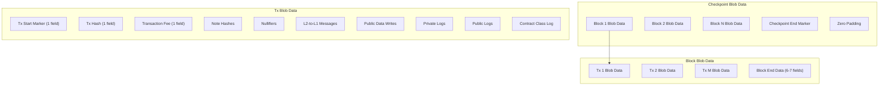
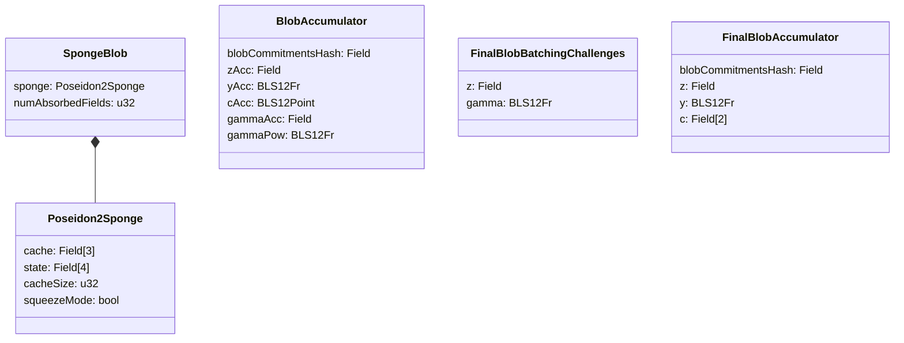

# Data Availability & Blobs

## Overview

This specification defines how Aztec publishes transaction data for data availability (DA) using Ethereum's EIP-4844 blobs. It covers the encoding of transaction effects into blob fields, the hierarchical structure of blob data (transaction, block, checkpoint), the sponge-based commitment scheme that binds blob data to block headers, and the KZG-based batched proof mechanism that enables L1 verification.

Data availability is fundamental to the rollup security model: without it, users cannot reconstruct L2 state from L1, cannot prove ownership of private state, and cannot recover funds if the sequencer becomes unavailable. The protocol guarantees that all data required to reconstruct the L2 state is published to Ethereum via EIP-4844 blobs and is cryptographically bound to on-chain commitments.

**Cross-references:**
- Spec #1 (Protocol Overview & Architecture) — introduces the data availability requirement (R6) and the block/checkpoint/epoch hierarchy
- Spec #2 (Constants) — defines blob-related constants (`FIELDS_PER_BLOB`, `BLOBS_PER_CHECKPOINT`, prefix sentinels, serialization lengths)
- Spec #3 (Cryptographic Primitives) — specifies Poseidon2 (used in sponge blob hashing and challenge computation), SHA-256-to-field (used for blob hashes), and KZG commitments
- Spec #5 (Transaction Format & Lifecycle) — defines `TxEffect`, the per-transaction output encoded in blobs
- Spec #6 (Block Format & Header) — defines the `sponge_blob_hash` field in block headers and `blobs_hash` in checkpoint headers
- Spec #9 (Rollup Circuits) — defines sponge blob propagation through the circuit hierarchy and blob accumulator validation
- Spec #10 (L1 Rollup Contract) — defines blob commitment validation during proposal and batched blob proof verification during epoch proof submission

## Requirements

### R1: State Reconstructability

All transaction effects included in a finalized block MUST be recoverable from EIP-4844 blob data published to Ethereum L1. An independent node MUST be able to reconstruct the complete block body from blob data alone.

**Rationale:** This is the core data availability guarantee. Without it, the rollup degenerates into a validium, and users lose the ability to independently verify state or recover their assets.

### R2: Deterministic Blob Encoding

The encoding of transaction effects into blob fields MUST be deterministic: given the same transaction effects, all implementations MUST produce identical blob field sequences.

**Rationale:** The sponge blob hash in the block header commits to the exact sequence of blob fields. Any deviation in encoding between implementations would produce different hashes, causing proof verification failures.

### R3: Blob-Header Binding

Each block header MUST contain a `sponge_blob_hash` that cryptographically commits to the blob field data of the block and all preceding blocks in the same checkpoint. Each checkpoint header MUST contain a `blobs_hash` that commits to the EIP-4844 versioned blob hashes.

**Rationale:** These commitments create a cryptographic binding between on-chain headers and off-chain blob data. The sponge blob hash is verified by the rollup circuits; the blobs hash is verified by the L1 contract.

### R4: L1-Verifiable Blob Commitments

The L1 rollup contract MUST validate that blob commitments provided during checkpoint proposal match the actual EIP-4844 blobs attached to the transaction. During epoch proof submission, the batched blob proof MUST be verified via the EIP-4844 point evaluation precompile.

**Rationale:** L1 verification is the trust anchor. Without verifying blob commitments against actual blobs, a proposer could claim arbitrary data was published.

### R5: Capacity Bounds

A single checkpoint MUST NOT require more than `BLOBS_PER_CHECKPOINT` (6) blobs. Each blob contains `FIELDS_PER_BLOB` (4096) field elements. Implementations MUST reject checkpoints whose transaction effects exceed the available blob capacity.

**Rationale:** EIP-4844 limits the number of blobs per transaction. The protocol must operate within these bounds and reject blocks that would exceed them.

## Specification

### Blob Data Hierarchy

Transaction data is organized into a three-level hierarchy that mirrors the block/checkpoint/epoch structure:



Each level is delimited by sentinel-prefixed marker fields that enable unambiguous parsing:

| Marker | Constant | Value | Purpose |
|---|---|---|---|
| Transaction start | `TX_START_PREFIX` | `0x9c707518` | Marks the beginning of a transaction's blob data |
| Block end | `BLOCK_END_PREFIX` | `0xeb8dcdbf` | Marks the end of a block within the checkpoint |
| Checkpoint end | `CHECKPOINT_END_PREFIX` | `0x8c637443` | Marks the end of the checkpoint's blob data |

These prefix values are chosen to be unlikely to collide with legitimate field element values. Decoders identify boundaries by inspecting the high-order bits of each field.

### Transaction Blob Encoding

Each transaction's effects are encoded as a contiguous sequence of field elements. The encoding MUST match the `TxBlobData` structure and produce an identical field sequence across all implementations.

#### Tx Start Marker

The first field of each transaction's blob data is the tx start marker — a single field element that packs the `TX_START_PREFIX` and metadata about the transaction's contents. The encoding packs values from most significant bits to least significant bits:

| Component | Bit Width | Description |
|---|---|---|
| `TX_START_PREFIX` | 32 | Sentinel prefix `0x9c707518` |
| `numNoteHashes` | 16 | Number of note hashes |
| `numNullifiers` | 16 | Number of nullifiers |
| `numL2ToL1Msgs` | 16 | Number of L2-to-L1 messages |
| `numPublicDataWrites` | 16 | Number of public data writes |
| `numPrivateLogs` | 16 | Number of private logs |
| `privateLogsLength` | 16 | Total field count of all private log data |
| `publicLogsLength` | 32 | Total field count of all public log data |
| `contractClassLogLength` | 16 | Field count of the contract class log (0 if none) |
| `revertCode` | 8 | Transaction revert code |
| `numBlobFields` | 32 | Total blob fields for this transaction (including this marker) |

The encoding algorithm:

```
value = TX_START_PREFIX
value = (value << 16) | numNoteHashes
value = (value << 16) | numNullifiers
value = (value << 16) | numL2ToL1Msgs
value = (value << 16) | numPublicDataWrites
value = (value << 16) | numPrivateLogs
value = (value << 16) | privateLogsLength
value = (value << 32) | publicLogsLength
value = (value << 16) | contractClassLogLength
value = (value <<  8) | revertCode
value = (value << 32) | numBlobFields
txStartMarkerField = Fr(value)
```

The total bit width is 32 + 16 + 16 + 16 + 16 + 16 + 16 + 32 + 16 + 8 + 32 = 216 bits, which fits within a single 254-bit BN254 field element.

#### Tx Blob Fields Layout

After the tx start marker, the remaining fields encode the transaction effects in this fixed order:

| Fields | Count | Description |
|---|---|---|
| `txStartMarker` | 1 | Packed metadata (see above) |
| `txHash` | 1 | Transaction hash |
| `transactionFee` | 1 | Fee paid for this transaction |
| `noteHashes` | `numNoteHashes` | Note hashes produced by this transaction |
| `nullifiers` | `numNullifiers` | Nullifiers produced by this transaction |
| `l2ToL1Msgs` | `numL2ToL1Msgs` | L2-to-L1 messages emitted |
| `publicDataWrites` | `numPublicDataWrites * 2` | Pairs of `(leafSlot, value)` for each write |
| `privateLogs` | variable | For each log: `[length, ...logFields]` |
| `publicLogs` | `publicLogsLength` | Flat array of public log fields |
| `contractClassLog` | variable | If present: `[contractAddress, ...logFields]` (length = `contractClassLogLength + 1`); if absent: empty |

The total field count for a transaction is:

```
numBlobFields = 1                             // tx start marker
              + 1                             // tx hash
              + 1                             // transaction fee
              + numNoteHashes
              + numNullifiers
              + numL2ToL1Msgs
              + numPublicDataWrites * 2       // slot + value per write
              + numPrivateLogs                // one length field per private log
              + privateLogsLength             // actual private log data
              + publicLogsLength
              + contractClassLogLength
              + (1 if contractClassLogLength > 0 else 0)  // contract address
```

This count is stored in the `numBlobFields` component of the tx start marker, enabling decoders to skip transactions without parsing their contents.

### Block Blob Encoding

A block's blob data consists of its transaction blob data followed by block end data.

#### Block End Marker

The block end marker is a single field that packs the `BLOCK_END_PREFIX` with block metadata:

| Component | Bit Width | Description |
|---|---|---|
| `BLOCK_END_PREFIX` | 32 | Sentinel prefix `0xeb8dcdbf` |
| `timestamp` | 64 | Block timestamp (Unix seconds) |
| `blockNumber` | 32 | L2 block number |
| `numTxs` | 16 | Number of transactions in this block |

Encoding:

```
value = BLOCK_END_PREFIX
value = (value << 64) | timestamp
value = (value << 32) | blockNumber
value = (value << 16) | numTxs
blockEndMarkerField = Fr(value)
```

Total: 32 + 64 + 32 + 16 = 144 bits.

#### Block End State Field

The block end state field packs tree indices and mana usage into a single field element:

| Component | Bit Width | Description |
|---|---|---|
| `l1ToL2MessageNextAvailableLeafIndex` | `L1_TO_L2_MSG_TREE_HEIGHT` | Next available leaf in L1-to-L2 message tree |
| `noteHashNextAvailableLeafIndex` | `NOTE_HASH_TREE_HEIGHT` | Next available leaf in note hash tree |
| `nullifierNextAvailableLeafIndex` | `NULLIFIER_TREE_HEIGHT` | Next available leaf in nullifier tree |
| `publicDataNextAvailableLeafIndex` | `PUBLIC_DATA_TREE_HEIGHT` | Next available leaf in public data tree |
| `totalManaUsed` | 48 | Total mana consumed by this block |

Encoding (from most to least significant):

```
value = l1ToL2MessageNextAvailableLeafIndex
value = (value << NOTE_HASH_TREE_HEIGHT) | noteHashNextAvailableLeafIndex
value = (value << NULLIFIER_TREE_HEIGHT) | nullifierNextAvailableLeafIndex
value = (value << PUBLIC_DATA_TREE_HEIGHT) | publicDataNextAvailableLeafIndex
value = (value << 48) | totalManaUsed
blockEndStateField = Fr(value)
```

#### Block Blob Fields Layout

| Fields | Count | Description |
|---|---|---|
| Transaction blob data | variable | Concatenated `TxBlobData` for each transaction |
| `blockEndMarker` | 1 | Packed block end metadata |
| `blockEndStateField` | 1 | Packed tree indices and mana |
| `lastArchiveRoot` | 1 | Archive tree root before this block |
| `noteHashRoot` | 1 | Note hash tree root after this block |
| `nullifierRoot` | 1 | Nullifier tree root after this block |
| `publicDataRoot` | 1 | Public data tree root after this block |
| `l1ToL2MessageRoot` | 0 or 1 | L1-to-L2 message tree root (first block in checkpoint only) |

The number of block end fields:
- **First block in checkpoint:** 7 fields (includes `l1ToL2MessageRoot`)
- **Subsequent blocks:** 6 fields

The `l1ToL2MessageRoot` is only included in the first block because L1-to-L2 messages are inserted once per checkpoint (see Spec #6).

Decoders identify the boundary between transaction data and block end data by checking whether the current field matches the `BLOCK_END_PREFIX` sentinel (inspecting the high-order bits after shifting out the lower 112 bits).

### Checkpoint Blob Encoding

A checkpoint's blob data consists of all its blocks' blob data followed by a checkpoint end marker, then zero-padded to fill complete blobs.

#### Checkpoint End Marker

| Component | Bit Width | Description |
|---|---|---|
| `CHECKPOINT_END_PREFIX` | 32 | Sentinel prefix `0x8c637443` |
| `numBlobFields` | 32 | Total non-zero blob fields in this checkpoint (including this marker) |

Encoding:

```
value = CHECKPOINT_END_PREFIX
value = (value << 32) | numBlobFields
checkpointEndMarkerField = Fr(value)
```

#### Checkpoint Blob Fields Layout

```
[Block 1 blob fields]           // first block: includes l1ToL2MessageRoot
[Block 2 blob fields]           // subsequent blocks: 6 end fields
...
[Block N blob fields]
[Checkpoint end marker]          // 1 field
[Zero padding]                    // fills remaining blob capacity
```

The total number of non-zero blob fields is:

```
numBlobFields = (numBlocks - 1) * 6 + 7   // block end fields (first block has 7, rest have 6)
              + sum(tx.numBlobFields for each tx in all blocks)
              + 1                            // checkpoint end marker
```

#### Blob Splitting

The checkpoint blob fields are split into one or more EIP-4844 blobs, each containing exactly `FIELDS_PER_BLOB` (4096) field elements. Each field element is serialized as a 32-byte big-endian BN254 scalar, producing blobs of `BYTES_PER_BLOB` (131,072) bytes each.

If the total number of blob fields is `N`, the checkpoint requires `ceil(N / FIELDS_PER_BLOB)` blobs. The last blob is zero-padded to fill its remaining capacity.

A checkpoint MUST NOT require more than `BLOBS_PER_CHECKPOINT` (6) blobs. The maximum blob capacity per checkpoint is therefore:

```
MAX_BLOB_FIELDS_PER_CHECKPOINT = BLOBS_PER_CHECKPOINT * FIELDS_PER_BLOB = 6 * 4096 = 24,576 fields
```

After the checkpoint end marker, all remaining fields up to the end of the last blob MUST be zero.

### Sponge Blob Commitment

The sponge blob is a Poseidon2-based sponge that incrementally absorbs blob fields as transactions and blocks are processed. It provides the cryptographic binding between block headers and blob data.

#### Sponge Blob Structure

The `SpongeBlob` consists of a Poseidon2 sponge and a field counter:

| Field | Type | Description |
|---|---|---|
| `sponge` | `Poseidon2Sponge` | The underlying Poseidon2 sponge state |
| `numAbsorbedFields` | `u32` | Number of field elements absorbed so far |

The `Poseidon2Sponge` has the following internal state:

| Field | Type | Description |
|---|---|---|
| `cache` | `Field[3]` | Absorption buffer (rate = 3) |
| `state` | `Field[4]` | Permutation state (capacity = 4) |
| `cacheSize` | `u32` | Number of elements currently in the cache (0-3) |
| `squeezeMode` | `bool` | Whether the sponge has been squeezed |

The total serialization length is `SPONGE_BLOB_LENGTH = 10` field elements (3 cache + 4 state + 1 cacheSize + 1 squeezeMode + 1 numAbsorbedFields).

#### Initialization

A new sponge blob for a checkpoint is initialized with an initialization vector derived from the maximum field capacity:

```
iv = MAX_FIELDS * 2^64
   = (BLOBS_PER_CHECKPOINT * FIELDS_PER_BLOB) * 2^64
   = 24576 * 2^64

sponge = Poseidon2Sponge {
    cache:       [0, 0, 0],
    state:       [0, 0, 0, iv],
    cacheSize:   0,
    squeezeMode: false,
}

spongeBlob = SpongeBlob {
    sponge:            sponge,
    numAbsorbedFields: 0,
}
```

The initialization vector encodes the maximum capacity in the standard Poseidon2 sponge initialization format.

#### Absorption

Fields are absorbed one at a time into the sponge. When the cache is full (3 elements), a Poseidon2 permutation is performed:

```
function absorb(sponge, field):
    assert not sponge.squeezeMode
    if sponge.cacheSize == 3:
        performDuplex(sponge)
        sponge.cache[0] = field
        sponge.cacheSize = 1
    else:
        sponge.cache[sponge.cacheSize] = field
        sponge.cacheSize += 1

function performDuplex(sponge):
    for i in 0..sponge.cacheSize:
        sponge.state[i] += sponge.cache[i]
    sponge.state = poseidon2Permutation(sponge.state)
```

#### Squeezing

After all fields are absorbed, the sponge is squeezed to produce a single hash output:

```
function squeeze(sponge) -> Field:
    assert not sponge.squeezeMode
    performDuplex(sponge)
    sponge.squeezeMode = true
    return sponge.state[0]
```

Squeezing is a one-time operation. Once squeezed, the sponge MUST NOT absorb further input.

#### Sponge Blob in the Proving Hierarchy

The sponge blob propagates through the rollup circuit hierarchy as follows:

1. **TX Base circuits** absorb each transaction's blob fields into the sponge, producing `end_sponge_blob`.
2. **TX Merge circuits** validate continuity: `left.end_sponge_blob == right.start_sponge_blob`.
3. **Block Root circuits** absorb block end data into the sponge, then squeeze a copy to produce `sponge_blob_hash` for the block header. The original sponge (unsqueezed) continues to the next block.
4. **Block Merge circuits** validate continuity: `left.end_sponge_blob == right.start_sponge_blob`.
5. **Checkpoint Root circuits** validate blob data integrity (see below) and produce the blob accumulator.

Each checkpoint starts with a freshly initialized sponge blob. The `sponge_blob_hash` in each block header is the result of squeezing the sponge state after absorbing that block's data (including all prior blocks' data in the same checkpoint).

### Blob Hashes and Commitments

Several distinct hash values connect blob data to on-chain state. Understanding their differences is critical for correct implementation.

#### Blob Fields Hash (`blobFieldsHash`)

A Poseidon2 sponge hash over all blob fields in a checkpoint. Computed by initializing a `SpongeBlob`, absorbing all non-padding fields (up to `numBlobFields` from the checkpoint end marker), and squeezing.

```
blobFieldsHash = SpongeBlob.init().absorb(blobFields[0..numBlobFields]).squeeze()
```

This is the same as squeezing the accumulated sponge blob after the last block in the checkpoint. It is used to compute the per-blob challenge `z_i`.

#### EVM Versioned Blob Hash

The EIP-4844 versioned hash of a blob, computed from the KZG commitment:

```
function computeEthVersionedBlobHash(commitment: bytes48) -> bytes32:
    hash = sha256(commitment)
    hash[0] = 0x01   // VERSIONED_HASH_VERSION_KZG
    return hash
```

This value is what the EVM `blobhash()` opcode returns.

#### Blobs Hash (`blobsHash`)

A SHA-256-to-field hash of all EVM versioned blob hashes in a checkpoint. This is stored in the checkpoint header and validated by the L1 contract:

```
blobsHash = sha256ToField([versionedBlobHash_0, versionedBlobHash_1, ..., versionedBlobHash_m])
```

where `m + 1` is the number of blobs in the checkpoint.

#### Blob Commitments Hash (`blobCommitmentsHash`)

An iteratively accumulated SHA-256-to-field hash of all blob commitments across an entire epoch. This value is a public input to the epoch proof:

```
// First blob in the epoch (i = 0):
blobCommitmentsHash_0 = sha256ToField(C_0)

// Subsequent blobs (i > 0):
blobCommitmentsHash_i = sha256ToField(blobCommitmentsHash_{i-1}, C_i)
```

where `C_i` is the 48-byte compressed BLS12-381 KZG commitment for blob `i`.

This hash is recalculated on L1 during each `propose` call and accumulated across the epoch. At epoch proof time, the stored `blobCommitmentsHash` for the last checkpoint is used as a public input to verify that the commitments injected into the rollup circuits match the actual L1 blobs.

### Commitment to Fields Encoding

When a 48-byte BLS12-381 compressed point (KZG commitment) needs to be represented as BN254 field elements, it is split into two fields:

```
commitment: bytes[0..48]

field_0 = Fr(commitment[0:31])     // first 31 bytes, left-padded to 32
field_1 = Fr(commitment[31:48])    // last 17 bytes, left-padded to 32
```

This encoding is used when computing the per-blob challenge `z_i` and when encoding commitment values as circuit public inputs.

### Challenge and Proof Computation

The protocol uses a batched KZG opening scheme to verify all blobs in an epoch with a single point evaluation precompile call. This section specifies the challenge derivation and accumulation.

#### Per-Blob Challenge (`z_i`)

For each blob `i` with commitment `C_i`, the challenge is:

```
z_i = poseidon2Hash([blobFieldsHash, C_i_field0, C_i_field1])
```

where `blobFieldsHash` is the sponge blob hash of the checkpoint containing blob `i`, and `C_i_field0`, `C_i_field1` are the commitment-to-fields encoding of `C_i`.

#### Accumulated Challenge (`z`)

The per-blob challenges are accumulated across all blobs in the epoch:

```
// For the first two blobs:
z = poseidon2Hash([z_0, z_1])

// For subsequent blobs:
z = poseidon2Hash([z, z_i])
```

Formally, for `n` blobs:

```
z = z_0                                     if n = 1
z = poseidon2Hash([z_0, z_1])              if n = 2
z = poseidon2Hash([poseidon2Hash([...]), z_i])   for i > 1
```

This produces a single challenge point at which all blob polynomials are evaluated.

#### Blob Evaluation

Each blob `i` is treated as a polynomial `p_i(X)` over the BLS12-381 scalar field. The blob is evaluated at the accumulated challenge `z`:

```
y_i = p_i(z)       // BLS12-381 field element
Q_i = KZG_proof(p_i, z, y_i)   // KZG opening proof (48-byte compressed BLS12-381 G1 point)
```

The evaluation and proof are computed using the standard KZG machinery from the EIP-4844 trusted setup.

#### Gamma Challenge

The random challenge `gamma` for the linear combination is derived from all blob evaluations and the accumulated challenge:

```
// Hash each evaluation's BigNum limbs:
h_i = poseidon2Hash([y_i.limb0, y_i.limb1, y_i.limb2])

// Accumulate:
gammaAcc = h_0                                    if n = 1
gammaAcc = poseidon2Hash([h_0, h_1])             if n = 2
gammaAcc = poseidon2Hash([gammaAcc, h_i])        for i > 1

// Final gamma:
gamma = poseidon2Hash([gammaAcc, z])
```

The BLS12-381 field element `y_i` is represented as a Noir BigNum with 3 limbs of 120 bits each (see Spec #2, `BLS12_FR_LIMBS = 3`). Each limb is hashed as a BN254 field element.

#### Batched Accumulation

Given `z` and `gamma`, the blobs are combined into a single batched opening:

```
// First blob (i = 0):
blobCommitmentsHash = sha256ToField(C_0)
z_acc   = z_0
y_acc   = y_0
c_acc   = C_0          // BLS12-381 G1 point
q_acc   = Q_0          // BLS12-381 G1 point
gammaPow = gamma

// Subsequent blobs (i > 0):
blobCommitmentsHash = sha256ToField(blobCommitmentsHash, C_i)
z_acc   = poseidon2Hash([z_acc, z_i])
y_acc   = y_acc + gammaPow * y_i
c_acc   = c_acc + gammaPow * C_i
q_acc   = q_acc + gammaPow * Q_i
gammaPow = gammaPow * gamma
```

After all blobs are accumulated, the final values are:

| Value | Description |
|---|---|
| `blobCommitmentsHash` | Accumulated hash of all KZG commitments |
| `z` | Accumulated challenge point (BN254 field element) |
| `y_acc` | Linear combination of evaluations (BLS12-381 field element) |
| `c_acc` | Linear combination of commitments (BLS12-381 G1 point) |
| `q_acc` | Linear combination of opening proofs (BLS12-381 G1 point) |

The correctness of `gamma` is verified by recomputing it from the accumulated values and checking equality with the precomputed `gamma`.

### L1 Blob Verification

Blob data is verified on L1 at two points: during checkpoint proposal and during epoch proof submission.

#### During Checkpoint Proposal

When a proposer submits a checkpoint via `propose()`, the `blobInput` parameter contains:

| Offset | Size | Field |
|---|---|---|
| 0 | 1 byte | `numBlobs`: number of blobs in this checkpoint |
| 1 | 48 bytes | Commitment `C_0` (compressed BLS12-381 G1 point) |
| 49 | 48 bytes | Commitment `C_1` |
| ... | ... | ... |
| `1 + 48 * (numBlobs - 1)` | 48 bytes | Commitment `C_{numBlobs-1}` |

The L1 contract performs these validations:

1. **Non-empty check:** `numBlobs > 0`.
2. **For each blob `i`:**
   - Extract the 48-byte commitment `C_i` from the input.
   - Compute the expected versioned hash: `expectedHash = sha256(C_i)` with version byte `0x01` in the first byte.
   - Retrieve the actual blob hash from the EVM: `actualHash = blobhash(i)`.
   - Verify: `actualHash == expectedHash`. This confirms the provided commitment matches the actual EIP-4844 blob attached to the transaction.
3. **Compute `blobsHash`:** `sha256ToField(abi.encodePacked(blobHash_0, ..., blobHash_{numBlobs-1}))`.
4. **Validate against header:** The computed `blobsHash` MUST match `header.blobsHash`.
5. **Accumulate `blobCommitmentsHash`:** Update the per-epoch accumulated hash (see section above). Reinitialized at the first checkpoint of each epoch.

The Aztec-related blobs MUST be the first blobs in the propose transaction. Additional non-Aztec blobs MAY follow.

#### During Epoch Proof Submission

When a prover submits an epoch proof via `submitEpochRootProof()`, the `blobInputs` parameter contains the input for the EIP-4844 point evaluation precompile (address `0x0A`):

| Offset | Size | Field |
|---|---|---|
| 0 | 32 bytes | `versioned_hash`: versioned hash of the batched commitment `c_acc` |
| 32 | 32 bytes | `z`: accumulated challenge point |
| 64 | 32 bytes | `y`: accumulated evaluation result `y_acc` |
| 96 | 48 bytes | `commitment`: batched commitment `c_acc` (compressed) |
| 144 | 48 bytes | `proof`: batched opening proof `q_acc` (compressed) |

The L1 contract:

1. Calls `address(0x0A).staticcall(blobInputs)` — the EIP-4844 point evaluation precompile.
2. The precompile verifies: `e(c_acc - [y_acc], H) == e(q_acc, [tau - z])` (the KZG verification equation in pairing form).
3. If the precompile returns success, the batched blob proof is valid.

The following values from `blobInputs` are also included as public inputs to the epoch root rollup proof:

| Public Input | Source | Encoding |
|---|---|---|
| `blobCommitmentsHash` | Stored on-chain (from accumulated `propose` calls) | 1 field |
| `z` | `blobInputs[32:64]` | 1 field |
| `y` | `blobInputs[64:96]` | 3 fields (BLS12-381 BigNum: 3 limbs of 120 bits) |
| `c` | `blobInputs[96:144]` | 2 fields (split at byte 31: 31 bytes + 17 bytes) |

The `y` value is converted to BigNum representation for the circuit:
- `firstLimb` = last 15 bytes (bits 0-119)
- `secondLimb` = bytes 2-17 (bits 120-239)
- `thirdLimb` = first 2 bytes (bits 240-255)

This ensures the epoch proof circuit can verify that the blob data it processed matches what was published to L1.

## Data Structures

### Blob-Related Constants

| Constant | Value | Description |
|---|---|---|
| `FIELDS_PER_BLOB` | 4096 | Field elements per EIP-4844 blob |
| `BLOBS_PER_CHECKPOINT` | 6 | Maximum blobs per checkpoint |
| `MAX_CHECKPOINTS_PER_EPOCH` | 32 | Maximum checkpoints per epoch |
| `BYTES_PER_BLOB` | 131,072 | Bytes per EIP-4844 blob (4096 * 32) |
| `BLS12_POINT_COMPRESSED_BYTES` | 48 | Size of compressed BLS12-381 G1 point |
| `BLS12_FR_LIMBS` | 3 | BigNum limbs for BLS12-381 field element |
| `SPONGE_BLOB_LENGTH` | 10 | Serialization length of SpongeBlob |
| `BLOB_ACCUMULATOR_LENGTH` | 18 | Serialization length of BlobAccumulator |
| `FINAL_BLOB_ACCUMULATOR_LENGTH` | 7 | Serialization length of FinalBlobAccumulator |
| `FINAL_BLOB_BATCHING_CHALLENGES_LENGTH` | 4 | Serialization length of FinalBlobBatchingChallenges |
| `TX_START_PREFIX` | `0x9c707518` | Transaction start sentinel |
| `BLOCK_END_PREFIX` | `0xeb8dcdbf` | Block end sentinel |
| `CHECKPOINT_END_PREFIX` | `0x8c637443` | Checkpoint end sentinel |

### Circuit Data Structures



| Structure | Serialization Length | Used In |
|---|---|---|
| `SpongeBlob` | 10 fields | TX level, Block level |
| `BlobAccumulator` | 18 fields | Checkpoint level |
| `FinalBlobBatchingChallenges` | 4 fields | Checkpoint level |
| `FinalBlobAccumulator` | 7 fields | Root Rollup public inputs |

### L1 On-Chain State (Blob-Related)

| Storage Field | Type | Location | Description |
|---|---|---|---|
| `blobCommitmentsHash` | `bytes32` | `TempCheckpointLog` | Accumulated blob commitments hash at this checkpoint |
| `blobsHash` | `bytes32` | `CheckpointHeader` | SHA-256 hash of EVM versioned blob hashes |

## Validation Rules

### V1: Blob Encoding Validity

Implementations MUST validate that blob fields can be decoded according to the encoding rules:
- The first field of each transaction MUST have a valid `TX_START_PREFIX`.
- The `numBlobFields` in the tx start marker MUST match the actual field count.
- Block boundaries MUST be marked by fields with a valid `BLOCK_END_PREFIX`.
- The `numTxs` in the block end marker MUST match the number of decoded transactions.
- The checkpoint end marker MUST have a valid `CHECKPOINT_END_PREFIX`.
- The `numBlobFields` in the checkpoint end marker MUST match the total fields read.
- All fields after the checkpoint end marker MUST be zero.

### V2: Blob Capacity

The total blob fields for a checkpoint MUST NOT exceed `BLOBS_PER_CHECKPOINT * FIELDS_PER_BLOB` (24,576 fields).

### V3: Sponge Blob Hash Consistency

The `sponge_blob_hash` in each block header MUST equal the result of squeezing the sponge blob state after absorbing:
1. All transaction blob fields for all blocks up to and including this block within the checkpoint.
2. Block end data for all blocks up to and including this block.
The sponge MUST be freshly initialized at the start of each checkpoint.

### V4: Blob Fields Hash Consistency (Checkpoint Root Circuit)

The Checkpoint Root circuit MUST validate that re-absorbing the hinted `blobs_fields` from scratch into a freshly initialized sponge blob (up to `numAbsorbedFields`) produces the same sponge state as the `end_sponge_blob` propagated from the block-level circuits (after absorbing the checkpoint end marker). This prevents data withholding attacks where a prover claims blob data different from what was actually published.

### V5: Blobs Hash Validation (L1)

The L1 rollup contract MUST validate that `header.blobsHash == sha256ToField(blobHash_0, ..., blobHash_{n-1})` during checkpoint proposal, where each `blobHash_i` is the EIP-4844 versioned hash of the `i`-th blob.

### V6: Blob Commitment Validation (L1)

During checkpoint proposal, the L1 contract MUST validate that the provided KZG commitments match the actual EIP-4844 blobs by comparing `calculateBlobHash(C_i)` against `blobhash(i)` for each blob `i`.

### V7: Blob Commitments Hash Accumulation

The `blobCommitmentsHash` MUST be accumulated correctly across the epoch:
- Reinitialized at the first checkpoint of each epoch: `sha256ToField(C_0)`.
- Updated for each subsequent blob: `sha256ToField(previousHash, C_i)`.

### V8: Batched Blob Proof Verification (L1)

During epoch proof submission, the EIP-4844 point evaluation precompile at `address(0x0A)` MUST return success for the provided `blobInputs`. The `blobCommitmentsHash`, `z`, `y`, and `c` values from the blob proof MUST be consistent with the public inputs to the epoch root rollup proof.

### V9: Epoch Blob Accumulator Boundary

The Root Rollup circuit MUST validate:
- The epoch started with an empty blob accumulator (`start_blob_accumulator` is all zeros).
- The `final_blob_challenges` (precomputed `z` and `gamma`) match the values derivable from the `end_blob_accumulator`.

## Security Considerations

### Data Withholding

A malicious proposer could publish blobs to L1 but withhold the data from other L2 nodes. During the blob retention period (approximately 18 days on Ethereum), blob data remains available via the beacon chain's blob sidecar API. After this period, blob data must be retrieved from archive services or pre-provisioned storage.

**Mitigation:** Nodes SHOULD store blob data in persistent storage (local filesystem, S3, or equivalent) as it arrives. Nodes SHOULD NOT rely solely on L1 consensus layer availability for historical blob data.

### Blob Data Mismatch

A prover could attempt to submit a valid proof with blob data that doesn't match the actual published blobs.

**Mitigation:** The three-layer verification prevents this:
1. **L1 proposal-time:** Blob commitments are verified against actual EIP-4844 blobs via the `blobhash()` opcode.
2. **Circuit-time:** The Checkpoint Root circuit re-absorbs all blob fields into a fresh sponge and verifies consistency with the incrementally accumulated sponge state.
3. **L1 proof-time:** The batched blob proof is verified via the point evaluation precompile, and the `blobCommitmentsHash` links the circuit's injected commitments to the L1-verified commitments.

### Blob Field Collision with Sentinel Prefixes

A transaction effect field could theoretically have a value that matches a sentinel prefix (e.g., `TX_START_PREFIX`, `BLOCK_END_PREFIX`), causing decoders to misinterpret boundaries.

**Mitigation:** The sentinel prefixes are packed with additional metadata into the high bits of the field. The probability of a legitimate field element having the exact bit pattern of a packed sentinel (with valid metadata in the lower bits) is negligible. Furthermore, the `numBlobFields` in the tx start marker provides an independent length check that decoders MUST validate.

### BLS12-381 / BN254 Field Mismatch

The KZG scheme operates over BLS12-381, while the rollup circuits use BN254 arithmetic. The accumulated challenge `z` is a BN254 field element used as a BLS12-381 evaluation point, and `gamma` is derived as a BN254 field element then used as a BLS12-381 scalar.

**Mitigation:** BN254 field elements fit within the BLS12-381 scalar field (the BLS12-381 scalar field is larger), so no reduction or overflow occurs.

## Open Questions

1. **Sentinel prefix collision analysis:** The current sentinel prefixes are chosen to avoid collisions with typical field values, but a formal analysis of collision probability under adversarial conditions has not been documented. Should the protocol add explicit sentinel validation beyond prefix matching?

2. **Blob data archival:** The specification does not normatively define how nodes should store blob data beyond the L1 blob retention period. Should the protocol mandate a specific archival mechanism, or is this an operational concern outside the protocol specification?

3. **DA gas pricing:** The `fee_per_da_gas` field in `GasFees` is currently constrained to be `0`. When DA gas pricing is activated, the pricing model and its relationship to blob base fees on L1 will need specification.

## References

- [EIP-4844: Shard Blob Transactions](https://eips.ethereum.org/EIPS/eip-4844) — defines the blob transaction format, KZG commitments, and the point evaluation precompile
- [EIP-4844 Point Evaluation Precompile](https://eips.ethereum.org/EIPS/eip-4844#point-evaluation-precompile) — precompile at `address(0x0A)` used for batched blob verification
- Spec #3 (Cryptographic Primitives) — Poseidon2 permutation parameters and SHA-256-to-field definition
- Spec #6 (Block Format & Header) — `sponge_blob_hash` field semantics and checkpoint header format
- Spec #9 (Rollup Circuits) — sponge blob propagation, blob accumulator validation rules (V10), and circuit hierarchy
- Spec #10 (L1 Rollup Contract) — `propose()` blob validation and `submitEpochRootProof()` blob proof verification
