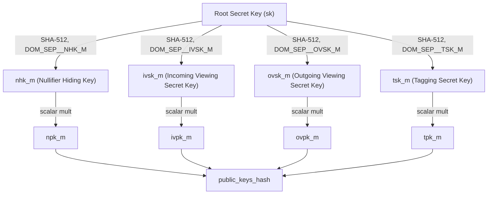
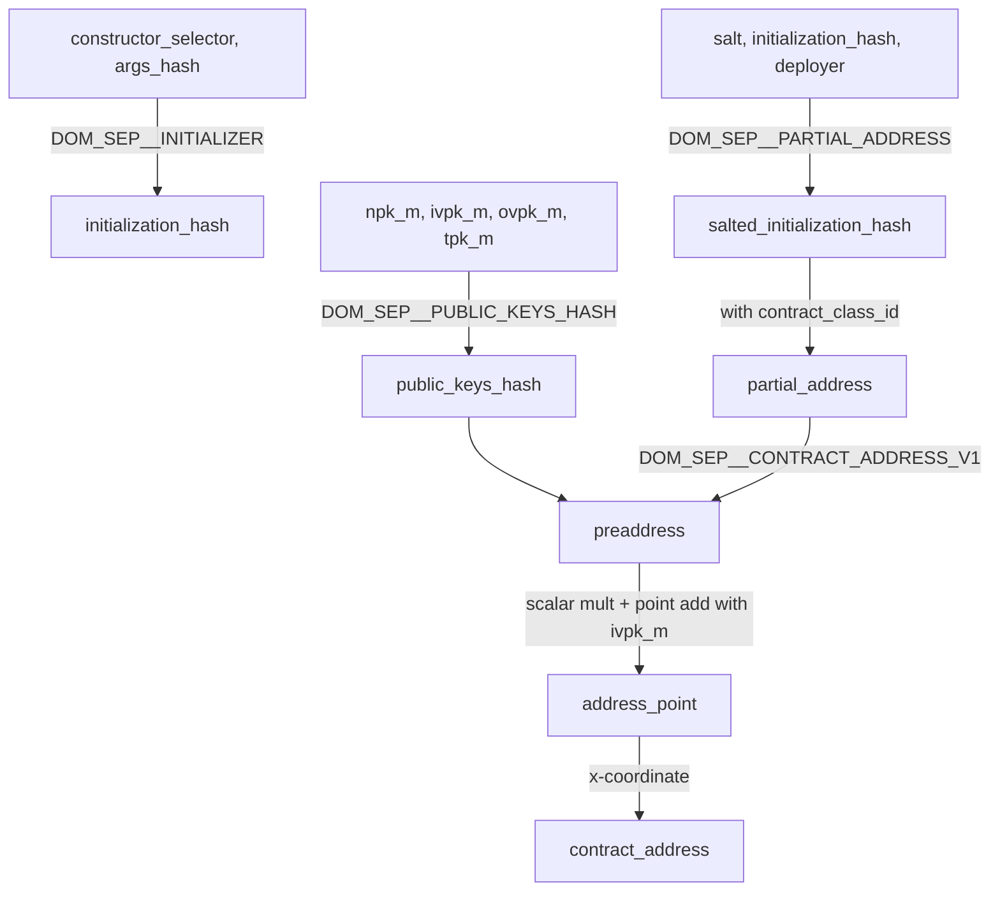
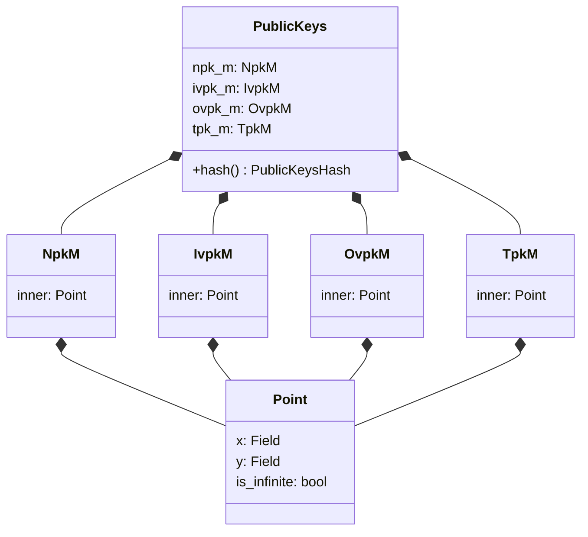

# Addresses & Keys

## Overview

This specification defines the address derivation scheme, key hierarchy, key types, app-siloed key derivation, key validation mechanism, and the relationship between addresses and deployed contract instances in the Aztec protocol.

Every Aztec account is a smart contract. An address is a deterministic commitment to the account's public keys and contract deployment parameters. This means addresses can be computed before deployment, enabling users to receive funds before their account contract exists on-chain.

The key hierarchy supports four distinct key types, each serving a specific cryptographic role in the privacy system: nullifier hiding, incoming viewing, outgoing viewing, and tagging. Master keys are derived from a single secret and can be siloed per-contract to prevent cross-contract key reuse. Application circuits never see master secret keys; they work only with app-siloed keys whose derivation is verified by the private kernel circuits.

**Cross-references:**
- Spec #1 (Protocol Overview & Architecture) — introduces native account abstraction and the privacy model
- Spec #2 (Constants) — defines domain separators, default public keys, and protocol contract addresses
- Spec #3 (Cryptographic Primitives) — specifies the hash functions, key derivation algorithms, and contract address derivation steps
- Spec #4 (State Model & Merkle Trees) — defines the trees where contract state is committed
- Spec #7 (Private Kernel Circuits) — specifies how key validation requests are processed in the Reset circuit

## Requirements

### R1: Deterministic Address Derivation

A contract address MUST be deterministically derived from the contract's public keys and deployment parameters. Two contract instances with identical salt, deployer, contract class ID, initialization hash, and public keys MUST produce the same address. Distinct inputs MUST produce distinct addresses with overwhelming probability.

**Rationale:** Deterministic addresses allow users to compute their address before deployment, enabling pre-deployment fund reception and predictable contract interactions.

### R2: Key Separation

The protocol MUST support four distinct key types (nullifier hiding, incoming viewing, outgoing viewing, tagging), each derived from a single root secret but cryptographically independent. Compromising one key type MUST NOT reveal other key types.

**Rationale:** Each key type serves a different privacy function. Key separation limits the damage from partial key compromise and enables selective disclosure (e.g., sharing viewing keys without enabling spending).

### R3: Application Key Isolation

Application circuits MUST NOT have access to master secret keys. Instead, they MUST receive app-siloed keys that are scoped to the contract address. The private kernel MUST verify that app-siloed keys are correctly derived from the corresponding master keys.

**Rationale:** Master key exposure to arbitrary application code would allow a malicious contract to extract the user's keys. App-siloing ensures that even a compromised contract cannot obtain keys usable in other contracts.

### R4: Address-Key Binding

The contract address MUST commit to all four master public keys. Changing any public key MUST change the address.

**Rationale:** The address serves as an authenticated commitment to the account's cryptographic identity. Binding keys to the address ensures that anyone who knows the address can verify the associated public keys.

### R5: Encryption Determinism

Given only an address (a field element), any party MUST be able to recover the full address point (a curve point) needed for encryption. The recovery MUST be deterministic — all parties MUST recover the same point.

**Rationale:** Senders need the recipient's address point to create shared secrets for encrypted communication. Using a canonical y-coordinate convention ensures all parties encrypt to the same point.

### R6: Ethereum Address Compatibility

The protocol MUST support Ethereum-compatible 20-byte addresses for L1 interoperability in cross-chain messaging.

**Rationale:** Cross-chain message recipients on L1 are identified by Ethereum addresses. The protocol must represent these addresses in a circuit-compatible format.

## Specification

### Key Hierarchy

The Aztec key hierarchy derives four master key pairs from a single root secret key. Each key pair consists of a secret key (a Grumpkin scalar) and a public key (a Grumpkin curve point).



#### Master Key Derivation

Each master secret key is derived from the root secret key using SHA-512 with a domain separator, then reduced to a Grumpkin scalar:

```
function derive_master_key(secret_key: Field, domain_separator: u32) -> GrumpkinScalar:
    let hash = sha512([secret_key, domain_separator])
    return hash mod grumpkin_scalar_field_order
```

The four master key types and their domain separators (defined in Spec #2):

| Key Type | Secret Key Symbol | Domain Separator | Value |
|----------|-------------------|------------------|-------|
| Nullifier Hiding Key | `nhk_m` | `DOM_SEP__NHK_M` | 242137788 |
| Incoming Viewing Secret Key | `ivsk_m` | `DOM_SEP__IVSK_M` | 2747825907 |
| Outgoing Viewing Secret Key | `ovsk_m` | `DOM_SEP__OVSK_M` | 4272201051 |
| Tagging Secret Key | `tsk_m` | `DOM_SEP__TSK_M` | 1546190975 |

Master public keys are derived by scalar multiplication with the Grumpkin generator `G`:

```
npk_m  = nhk_m  * G
ivpk_m = ivsk_m * G
ovpk_m = ovsk_m * G
tpk_m  = tsk_m  * G
```

See Spec #3 (Cryptographic Primitives) for the full key derivation algorithm.

#### Key Purposes

| Key Type | Symbol (secret / public) | Purpose |
|----------|--------------------------|---------|
| Nullifier Hiding Key | `nhk_m` / `npk_m` | Creates nullifiers to spend notes privately. The nullifier hiding key ensures that the link between a note hash and its nullifier is hidden from observers. |
| Incoming Viewing Key | `ivsk_m` / `ivpk_m` | Decrypts incoming note data. Senders encrypt note plaintext to the recipient's incoming viewing public key so only the recipient can read it. Also embedded in the address point for shared secret derivation. |
| Outgoing Viewing Key | `ovsk_m` / `ovpk_m` | Allows the sender to decrypt their own outgoing transaction data. Enables a sender to later reconstruct details of notes they created for others. |
| Tagging Key | `tsk_m` / `tpk_m` | Participates in note discovery/tagging. Tagging keys enable recipients to efficiently scan for notes addressed to them without decrypting every note. |

#### Key Indices

Key types are referenced by a numeric index throughout the protocol:

| Key Type | Index |
|----------|-------|
| Nullifier Hiding Key | 0 |
| Incoming Viewing Key | 1 |
| Outgoing Viewing Key | 2 |
| Tagging Key | 3 |

The total number of key types is `NUM_KEY_TYPES = 4`.

### App-Siloed Key Derivation

Application circuits do not receive master secret keys. Instead, they receive app-siloed secret keys scoped to a specific contract address. This prevents a malicious contract from extracting keys usable in other contracts.

An app-siloed secret key is derived as:

```
function compute_app_siloed_secret_key(
    master_secret_key: GrumpkinScalar,
    contract_address: AztecAddress,
    domain_separator: Field
) -> Field:
    return poseidon2_hash_with_separator(
        [master_secret_key.hi, master_secret_key.lo, contract_address],
        domain_separator
    )
```

Where:
- `master_secret_key.hi` and `master_secret_key.lo` are the high and low 128-bit components of the Grumpkin scalar
- `contract_address` is the address of the contract requesting the key
- `domain_separator` is the same domain separator used for the corresponding master key type (`DOM_SEP__NHK_M`, `DOM_SEP__IVSK_M`, `DOM_SEP__OVSK_M`, or `DOM_SEP__TSK_M`)

The output is a single field element (not a Grumpkin scalar), because it is the output of Poseidon2.

The domain separator generators for app-siloing, indexed by key type:

```
sk_generators = [DOM_SEP__NHK_M, DOM_SEP__IVSK_M, DOM_SEP__OVSK_M, DOM_SEP__TSK_M]
```

### Key Validation

Application circuits request key validation by emitting `KeyValidationRequestAndGenerator` items. These are accumulated in the private kernel's validation request arrays and processed by the Reset circuit.

#### Request Flow

1. A private function calls an oracle to obtain an app-siloed secret key for a given master public key hash and key type.
2. The oracle (PXE key store) looks up the master secret key, derives the app-siloed key, and returns a `KeyValidationRequest` containing the master public key point and the app-siloed secret key.
3. The private function packages the request with the domain separator (generator) for the key type into a `KeyValidationRequestAndGenerator`.
4. The private kernel accumulates these requests in `PrivateValidationRequests.scoped_key_validation_requests_and_generators`.
5. The Reset circuit validates each request using the master secret key provided as a hint.

#### Validation Algorithm

For each key validation request with hint `sk_m` (the master secret key scalar):

```
function validate_key_validation_request(
    request: ScopedKeyValidationRequestAndGenerator,
    sk_m: GrumpkinScalar
):
    // Step 1: Verify the master public key
    let pk_m_derived = sk_m * G
    assert(pk_m_derived == request.request.pk_m)

    // Step 2: Verify the app-siloed secret key
    let sk_app_derived = compute_app_siloed_secret_key(
        sk_m,
        request.contract_address,
        request.request.sk_app_generator
    )
    assert(sk_app_derived == request.request.sk_app)
```

Both assertions MUST pass. If either fails, the transaction proof is invalid. After validation, the request is removed from the validation requests array. All key validation requests MUST be processed before the Tail circuit; the Tail circuit asserts the array is empty (see Spec #7, V-Tail-5).

Private functions MAY cache key validation requests: if the same master public key hash is requested multiple times within a single function execution, the cached app-siloed key is returned without issuing a duplicate request.

### Address Derivation

An Aztec address is a single field element — the x-coordinate of an address point on the Grumpkin curve. The address is derived from the contract's public keys and deployment parameters through a multi-step hash chain.



#### Step 1: Initialization Hash

```
initialization_hash = poseidon2_hash_with_separator(
    [constructor_selector, args_hash],
    DOM_SEP__INITIALIZER
)
```

If the contract has no constructor, `initialization_hash = 0`.

The `args_hash` is computed per Spec #3: `poseidon2_hash_with_separator(args, DOM_SEP__FUNCTION_ARGS)`, or 0 if no arguments.

#### Step 2: Salted Initialization Hash

```
salted_initialization_hash = poseidon2_hash_with_separator(
    [salt, initialization_hash, deployer],
    DOM_SEP__PARTIAL_ADDRESS
)
```

Where:
- `salt` is a deployer-chosen random value for address uniqueness
- `deployer` is the address of the deploying account (or 0 for universal deployment)

#### Step 3: Partial Address

```
partial_address = poseidon2_hash_with_separator(
    [contract_class_id, salted_initialization_hash],
    DOM_SEP__PARTIAL_ADDRESS
)
```

The partial address captures all contract deployment metadata independent of the account's public keys. See Spec #3 for the contract class ID derivation.

#### Step 4: Public Keys Hash

```
public_keys_hash = poseidon2_hash_with_separator(
    [npk_m.x, npk_m.y, ivpk_m.x, ivpk_m.y, ovpk_m.x, ovpk_m.y, tpk_m.x, tpk_m.y],
    DOM_SEP__PUBLIC_KEYS_HASH
)
```

All four master public keys are serialized as their (x, y) coordinates and hashed together.

#### Step 5: Preaddress

```
preaddress = poseidon2_hash_with_separator(
    [public_keys_hash, partial_address],
    DOM_SEP__CONTRACT_ADDRESS_V1
)
```

#### Step 6: Address Point

```
address_point = preaddress * G + ivpk_m
```

Where `G` is the Grumpkin generator. The preaddress is used as a scalar to compute a Grumpkin point, then the master incoming viewing public key is added.

If the resulting point has a "negative" y-coordinate (y > (p-1)/2 where p is the field modulus), the point MUST be negated to use the "positive" y-coordinate (y ≤ (p-1)/2).

#### Step 7: Contract Address

```
contract_address = address_point.x
```

The final address is the x-coordinate of the address point.

#### Domain Separators

All domain separators are defined in Spec #2:

| Step | Domain Separator | Value |
|------|------------------|-------|
| Initialization hash | `DOM_SEP__INITIALIZER` | 385396519 |
| Salted initialization hash | `DOM_SEP__PARTIAL_ADDRESS` | 2103633018 |
| Partial address | `DOM_SEP__PARTIAL_ADDRESS` | 2103633018 |
| Public keys hash | `DOM_SEP__PUBLIC_KEYS_HASH` | 777457226 |
| Preaddress | `DOM_SEP__CONTRACT_ADDRESS_V1` | 1788365517 |

#### Address Point Recovery

Given only an address (field element), the full address point can be recovered for use in encryption:

```
function recover_address_point(address: Field) -> Option<AddressPoint>:
    let x = address
    let y_squared = x * x * x - 17    // Grumpkin curve: y² = x³ - 17
    let y = sqrt(y_squared)            // May not exist if address is invalid
    if y is None:
        return None
    if y > (p - 1) / 2:               // Use positive y convention
        y = -y
    return AddressPoint { x, y, is_infinite: false }
```

An address for which no valid y-coordinate exists (i.e., `x³ - 17` is not a quadratic residue) is not a valid Aztec address. No shared secrets can be created with such an address.

The positive-y convention is critical: all parties encrypting to an address MUST use the point with y ≤ (p-1)/2. The address owner can always derive the corresponding decryption secret regardless of which y their original derivation produced.

### Contract Instance

A contract instance represents a deployed contract and contains all the information needed to derive its address.

#### Fields

| Field | Type | Description |
|-------|------|-------------|
| `salt` | Field | Deployer-chosen random value for address uniqueness |
| `deployer` | AztecAddress | Address of the account that deployed the contract |
| `contract_class_id` | ContractClassId | Identifies the contract's bytecode and verification keys (see Spec #3) |
| `initialization_hash` | Field | Hash of constructor function selector and encoded arguments |
| `public_keys` | PublicKeys | The four master public keys associated with this contract |

#### Address Computation

```
function contract_instance_to_address(instance: ContractInstance) -> AztecAddress:
    let partial_address = PartialAddress::compute(
        instance.contract_class_id,
        instance.salt,
        instance.initialization_hash,
        instance.deployer
    )
    return AztecAddress::compute(instance.public_keys, partial_address)
```

The hash of a `ContractInstance` is defined as its derived address.

#### Universal Deployment

When `deployer` is the zero address, the contract instance can be deployed by anyone. The zero deployer address is included in the salted initialization hash computation, producing a deterministic address that does not depend on a specific deploying account.

### Aztec Address

The `AztecAddress` is a wrapper around a single field element:

| Field | Type | Size | Description |
|-------|------|------|-------------|
| `inner` | Field | 1 field | The x-coordinate of the address point on the Grumpkin curve |

The zero address (`inner = 0`) is reserved and is used as a sentinel value (e.g., to indicate "no deployer" in universal deployment).

### Ethereum Address

The `EthAddress` represents a 20-byte Ethereum address within circuits:

| Field | Type | Size | Description |
|-------|------|------|-------------|
| `inner` | Field | 1 field | Ethereum address as a field element (max 160 bits) |

Validation: `inner` MUST fit within 160 bits (`inner.assert_max_bit_size::<160>()`). This range check MAY be deferred to the tail circuit for efficiency.

Serialization to bytes uses big-endian encoding, taking the last 20 bytes of the 32-byte field representation.

### Default Public Keys

When a contract does not define its own public keys (e.g., non-account contracts), the protocol uses default public keys. These are derived by hashing fixed strings to the Grumpkin curve:

| Key Type | Derivation Input |
|----------|-----------------|
| Default NPK | `"az_null_npk"` hashed to Grumpkin |
| Default IVPK | `"az_null_ivpk"` hashed to Grumpkin |
| Default OVPK | `"az_null_ovpk"` hashed to Grumpkin |
| Default TPK | `"az_null_tpk"` hashed to Grumpkin |

The specific coordinate values are defined in Spec #2 (Constants) under "Default Public Keys". These serve as nullifiers for uninitialized accounts — they are publicly known points that do not correspond to any real user's secret key.

### Protocol Contract Addresses

Protocol contracts have fixed, reserved addresses (1 through `MAX_PROTOCOL_CONTRACTS`) that are not derived through the standard address derivation scheme. These are defined in Spec #2:

| Contract | Address |
|----------|---------|
| Canonical Auth Registry | 1 |
| Contract Instance Registry | 2 |
| Contract Class Registry | 3 |
| Multi-Call Entrypoint | 4 |
| Fee Juice | 5 |
| Public Checks | 6 |

Protocol contract addresses are validated directly during Init circuit verification rather than through the standard address derivation (see Spec #7, V-Init-5).

## Data Structures

### PublicKeys



Serialization: `PublicKeys` serializes as 8 field elements (x and y for each of the 4 keys). The `is_infinite` flag is not serialized; all valid public keys are finite curve points.

### KeyValidationRequest

| Field | Type | Size (fields) | Description |
|-------|------|---------------|-------------|
| `pk_m` | Point | 3 | Master public key (x, y, is_infinite) |
| `sk_app` | Field | 1 | App-siloed secret key |

### KeyValidationRequestAndGenerator

| Field | Type | Size (fields) | Description |
|-------|------|---------------|-------------|
| `request` | KeyValidationRequest | 4 | The key validation request |
| `sk_app_generator` | Field | 1 | Domain separator for the key type |

### ScopedKeyValidationRequestAndGenerator

| Field | Type | Size (fields) | Description |
|-------|------|---------------|-------------|
| `request` | KeyValidationRequestAndGenerator | 5 | The request with generator |
| `contract_address` | AztecAddress | 1 | Contract address the key is siloed to |

### ContractInstance

| Field | Type | Size (fields) | Description |
|-------|------|---------------|-------------|
| `salt` | Field | 1 | Random deployment salt |
| `deployer` | AztecAddress | 1 | Deployer address |
| `contract_class_id` | ContractClassId | 1 | Contract class identifier |
| `initialization_hash` | Field | 1 | Hash of constructor call |
| `public_keys` | PublicKeys | 8 | Four master public keys |

Total serialization length: `CONTRACT_INSTANCE_LENGTH` fields (defined in Spec #2).

### Intermediate Address Values

| Type | Size (fields) | Description |
|------|---------------|-------------|
| `SaltedInitializationHash` | 1 | Hash of salt, initialization hash, and deployer |
| `PartialAddress` | 1 | Hash of contract class ID and salted initialization hash |
| `PublicKeysHash` | 1 | Hash of all four master public keys |
| `AddressPoint` | Point (3 fields) | Full Grumpkin curve point recovered from address |

### KeyValidationHint

Used by the Reset circuit to validate key derivation requests:

| Field | Type | Description |
|-------|------|-------------|
| `sk_m` | GrumpkinScalar | The master secret key corresponding to the request's public key |

## Validation Rules

### V1: Address Derivation Integrity

When a contract instance is referenced (e.g., during Init circuit processing or via `GETCONTRACTINSTANCE` in the AVM), the address MUST be recomputable from the instance fields. Implementations MUST verify:

```
computed_address = AztecAddress::compute(instance.public_keys, PartialAddress::compute(
    instance.contract_class_id, instance.salt, instance.initialization_hash, instance.deployer
))
assert(computed_address == claimed_address)
```

### V2: Public Key Curve Membership

All master public keys MUST be valid points on the Grumpkin curve. The Grumpkin point addition operation (`address_point = preaddress * G + ivpk_m`) will fail if any input point is not on the curve.

### V3: Key Validation Completeness

All `ScopedKeyValidationRequestAndGenerator` items accumulated during private execution MUST be validated by the Reset circuit before the Tail circuit. The Tail circuit MUST assert that the key validation requests array has length 0 (Spec #7, V-Tail-5).

### V4: App-Siloed Key Correctness

For each key validation request, the Reset circuit MUST verify both:
1. The provided master secret key derives to the claimed master public key: `sk_m * G == request.pk_m`
2. The app-siloed key is correctly derived: `compute_app_siloed_secret_key(sk_m, contract_address, generator) == request.sk_app`

### V5: Ethereum Address Range

An `EthAddress` field value MUST fit within 160 bits. Values exceeding 160 bits MUST be rejected.

### V6: Address Point Y-Coordinate Convention

When recovering an address point from an x-coordinate for encryption, implementations MUST use the positive y-coordinate (y ≤ (p-1)/2). This ensures all parties derive the same point for a given address.

### V7: Immutable Address Binding

Once a contract instance is deployed, its address is permanently bound to its public keys and deployment parameters. Changing any of these values would produce a different address. There is no key rotation mechanism at the address level — a new set of keys requires a new address.

## Security Considerations

### Master Key Compartmentalization

The four-key design ensures that compromising one key type does not compromise the others. For example:
- Sharing `ivsk_m` (incoming viewing) allows a third party to see incoming notes but not spend them or see outgoing transactions.
- Sharing `ovsk_m` (outgoing viewing) reveals sent transaction details but not incoming notes or spending capability.
- The nullifier hiding key (`nhk_m`) is the most sensitive, as it enables spending notes.

### App-Siloing Security

App-siloing prevents a malicious contract from extracting master keys. Even if an application circuit is compromised, the attacker obtains only an app-siloed key valid for that specific contract address. The Poseidon2 hash binding to the contract address ensures the siloed key cannot be used to derive keys for other contracts.

### Address Preimage Security

The address derivation uses a multi-layer hash chain with distinct domain separators at each level, preventing:
- **Cross-level collisions:** Different domain separators for each hash step prevent inputs at one level from being confused with another.
- **Address grinding:** The preaddress is used as a scalar multiplier on the Grumpkin generator, making it computationally infeasible to find a preaddress that maps to a chosen address.
- **Key extraction from address:** Given only an address (x-coordinate), recovering the public keys or partial address requires breaking the Poseidon2 hash or the discrete logarithm problem on Grumpkin.

### Positive Y-Coordinate Convention

The positive y-coordinate convention for address points prevents a subtle attack: without this convention, two different parties could encrypt to different points (same x, different y), causing one encryption to be undecryptable. The convention ensures deterministic encryption even though the curve equation has two solutions for y given x.

## Test Vectors

### Public Keys Hash

**Input:**
- npk_m: (1, 2)
- ivpk_m: (3, 4)
- ovpk_m: (5, 6)
- tpk_m: (7, 8)

**Output:**
```
public_keys_hash = 0x056998309f6c119e4d753e404f94fef859dddfa530a9379634ceb0854b29bf7a
```

### Preaddress

**Input:**
- public_keys_hash: 1
- partial_address: 2

**Output:**
```
preaddress = 0x286c7755f2924b1e53b00bcaf1adaffe7287bd74bba7a02f4ab867e3892d28da
```

### Address from Partial Address and Public Keys

**Input:**
- npk_m: (0x22f7fcddfa3ce3e8f0cc8e82d7b94cdd740afa3e77f8e4a63ea78a239432dcab, 0x0471657de2b6216ade6c506d28fbc22ba8b8ed95c871ad9f3e3984e90d9723a7)
- ivpk_m: (0x111223493147f6785514b1c195bb37a2589f22a6596d30bb2bb145fdc9ca8f1e, 0x273bbffd678edce8fe30e0deafc4f66d58357c06fd4a820285294b9746c3be95)
- ovpk_m: (0x09115c96e962322ffed6522f57194627136b8d03ac7469109707f5e44190c484, 0x0c49773308a13d740a7f0d4f0e6163b02c5a408b6f965856b6a491002d073d5b)
- tpk_m: (0x00d3d81beb009873eb7116327cf47c612d5758ef083d4fda78e9b63980b2a762, 0x2f567d22d2b02fe1f4ad42db9d58a36afd1983e7e2909d1cab61cafedad6193a)
- partial_address: 0x0a7c585381b10f4666044266a02405bf6e01fa564c8517d4ad5823493abd31de

**Output:**
```
address = 0x2f66081d4bb077fbe8e8abe96a3516a713a3d7e34360b4e985da0da95092b37d
```

### Default Public Keys Hash

**Input:** Default public keys (values from Spec #2)

**Output:**
```
default_public_keys_hash = 0x023547e676dba19784188825b901a0e70d8ad978300d21d6185a54281b734da0
```

## Open Questions

1. **Key rotation at the application layer:** The protocol does not support key rotation at the address level (changing keys changes the address). Should the spec describe application-layer patterns for key rotation (e.g., migrating to a new account contract with new keys)? Or is this purely an application concern outside protocol scope?

2. **Stealth addresses and diversified keys:** The current design does not include stealth address or diversified key schemes. Are these planned as future protocol extensions, or will they be purely application-layer constructions?

3. **Address point validity:** Not all field elements correspond to valid Grumpkin curve points (approximately half will be invalid). Should the protocol define behavior for transactions sent to invalid addresses, or is this purely a client-side validation concern?

4. **Key validation request limits:** The current limit is 64 scoped key validation requests per transaction (Spec #2). Is this sufficient for complex transactions that may involve many contracts each requiring key validation?

5. **Contract instance updates:** The protocol supports contract class ID updates via the Contract Instance Registry. How do class ID updates interact with the address derivation (since the address commits to the original class ID)?

## References

- Spec #1: Protocol Overview & Architecture — native account abstraction
- Spec #2: Constants — domain separators, default keys, protocol addresses, serialization lengths
- Spec #3: Cryptographic Primitives — hash functions, key derivation, contract address derivation steps
- Spec #4: State Model & Merkle Trees — nullifier tree, note hash tree
- Spec #7: Private Kernel Circuits — key validation request processing in Reset circuit
- Spec #8: Public VM (AVM) — `GETCONTRACTINSTANCE` opcode for reading contract instance fields
