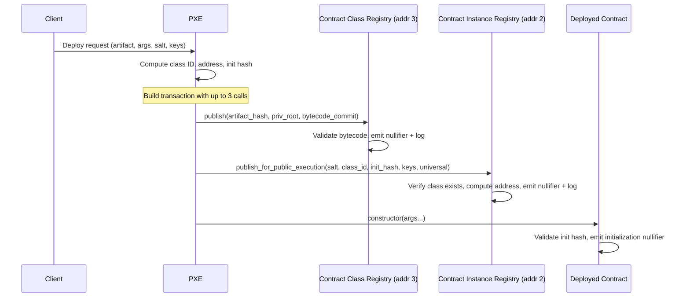
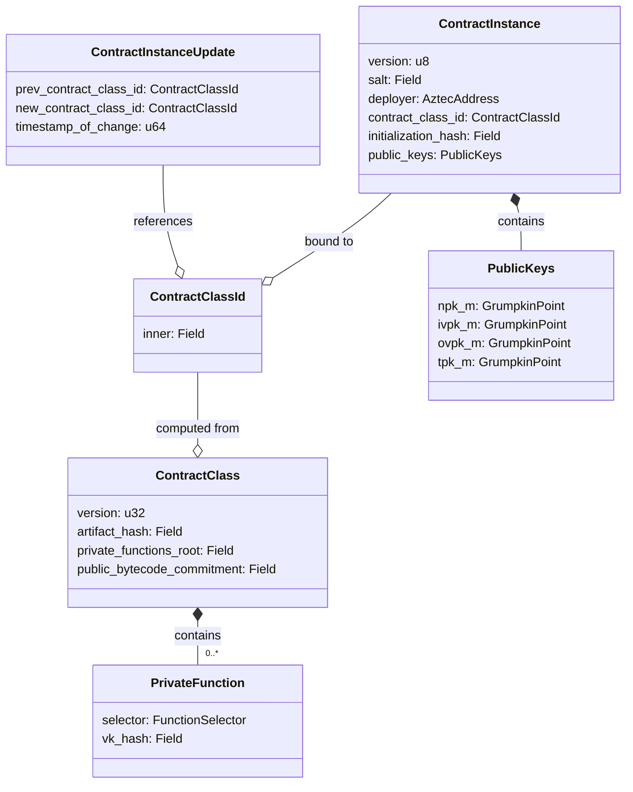

# Spec #14: Contract Deployment

## Overview

This specification defines how contracts are deployed on Aztec. Aztec separates the concept of a **contract class** (immutable code) from a **contract instance** (a deployed entity with an address, state, and binding to a class). Deployment is a two-phase process: first a contract class is registered, then one or more instances of that class are deployed.

Both phases are mediated by **protocol contracts** — the Contract Class Registry and the Contract Instance Registry — which emit on-chain events and nullifiers to make deployment provable and verifiable. The protocol also supports **contract upgrades**, where an instance's class binding can be changed after a mandatory delay.

This spec covers:

- Contract class registration and bytecode publication
- Contract instance deployment and address derivation
- Initialization (constructor execution)
- Contract class upgrades via delayed mutable state
- Kernel-level validation of contract addresses
- Event formats for all deployment-related operations

**Cross-references:**

- Spec #1 (Protocol Overview & Architecture) — introduces the privacy model and transaction lifecycle
- Spec #2 (Constants) — defines all constants, domain separators, magic values, and protocol contract addresses referenced here
- Spec #3 (Cryptographic Primitives) — defines Poseidon2, SHA-256, and Grumpkin curve operations
- Spec #4 (State Model & Merkle Trees) — defines the nullifier tree and public data tree used for deployment proofs
- Spec #5 (Transaction Format & Lifecycle) — defines transaction structure including contract class logs
- Spec #7 (Private Kernel Circuits) — defines contract address validation in the kernel (V-Init-5)
- Spec #8 (Public VM) — defines the `GETCONTRACTINSTANCE` opcode
- Spec #13 (Addresses & Keys) — defines the full address derivation pipeline and key types

---

## Requirements

### R1: Class–Instance Separation

The protocol MUST separate contract code (classes) from deployed entities (instances). Multiple instances MUST be able to share the same class. This enables code reuse and reduces on-chain data costs: given multiple instances that share the same class, the class need only be registered once. The separation also simplifies upgradeability by decoupling state from code, making it possible for an instance to switch to different code while retaining its state.

### R2: Deterministic Addresses

Contract instance addresses MUST be deterministically derived from the instance's parameters (class ID, salt, initialization hash, deployer, public keys). Addresses MUST be computable before deployment, enabling pre-funded accounts.

### R3: Uniqueness

Each contract class MUST be registered at most once. Each contract instance address MUST be deployed at most once. The protocol enforces uniqueness through nullifiers.

### R4: Provable Registration

Both class registration and instance deployment MUST be provable within the protocol's circuit constraints. Any node MUST be able to verify that a given class or instance was registered by checking nullifier existence.

### R5: Bytecode Availability

Public bytecode MUST be made available on-chain as part of class registration. The bytecode commitment included in the contract class ID MUST be verified against the actual bytecode during registration.

### R6: Upgradeability

The protocol MUST support changing an instance's class binding. Upgrades MUST enforce a minimum delay before taking effect, to allow users to exit if they disagree with the change.

### R7: Initialization Integrity

Constructor arguments MUST be committed into the contract address. The protocol MUST ensure that the constructor is called with the arguments that were committed, and that the constructor executes exactly once.

### R8: Private Interaction Before Deployment

A user MUST be able to privately call into a contract instance without it being publicly deployed or initialized. This enables counterfactual deployments: a user can compute an address, receive funds at it, and interact privately — all before the instance is broadcast to the network. This property is essential for diversified and stealth account contracts.

### R9: Public Deployment Prerequisite

All public function calls to a contract instance that has not been publicly deployed MUST fail. Since the contract class bytecode may not be known to all nodes until the instance is publicly deployed, a sequencer or validating node may not be able to execute the public bytecode. The protocol MUST enforce this at the kernel or VM level.

---

## Specification

### Contract Classes

A **contract class** represents the immutable code of a contract. It is identified by a **contract class ID**, which is a commitment to the class's code and metadata.

#### Contract Class Structure

| Field | Type | Description |
|---|---|---|
| `version` | `u32` | Schema version; MUST be `1`. Implicit in the domain separator (see note below) |
| `artifact_hash` | `Field` | SHA-256-derived hash of the full artifact metadata (see Spec #3) |
| `private_functions_root` | `Field` | Poseidon2 Merkle root of the private function tree |
| `public_bytecode_commitment` | `Field` | Poseidon2 commitment to the packed public bytecode |

A contract class also carries the packed public bytecode as auxiliary data, but this is not part of the class ID preimage beyond the commitment.

Individual public functions are not first-class citizens in the protocol — the entire public bytecode for a contract is stored as a single packed blob, unlike private functions which are individually recognized by the protocol via their selectors and verification keys.

Utility functions (unconstrained functions that are never invoked in private or public execution) are not part of the contract class structure. However, commitments to utility functions SHOULD be included in the `artifact_hash`, so that clients can verify the correctness of utility code they execute offchain and expose their secrets to.

#### Contract Class ID Computation

The contract class ID is computed as:

```
contract_class_id = poseidon2_hash_with_separator(
    [artifact_hash, private_functions_root, public_bytecode_commitment],
    DOM_SEP__CONTRACT_CLASS_ID
)
```

Where `DOM_SEP__CONTRACT_CLASS_ID` is defined in Spec #2 (Constants).

The `version` field is not directly included in the class ID preimage. Instead, it is implicit in the domain separator: bumping the contract class version would require using a different domain separator for computing the class ID. Supporting new versions of contract classes would also require introducing new kernel circuits, since a transaction proof may need to switch between different kernel circuits depending on the version of the contract class used for each function call.

#### Private Functions Root

Each private function contributes a leaf to the private function tree:

```
leaf = poseidon2_hash_with_separator(
    [function_selector, vk_hash],
    DOM_SEP__PRIVATE_FUNCTION_LEAF
)
```

Where:

- `function_selector` is a 4-byte selector derived from the function name and parameter types
- `vk_hash` is the hash of the function's verification key

Functions MUST be sorted by selector value before tree construction. The tree has height `FUNCTION_TREE_HEIGHT` (defined in Spec #2), uses `poseidon2_hash([left, right])` as the branch hash, and `poseidon2_hash([0, 0])` as the zero leaf.

#### Public Bytecode Commitment

Public bytecode is packed into field elements at 31 bytes per field:

1. The first field contains the bytecode length in bytes (MUST fit in 32 bits)
2. Subsequent fields contain 31-byte chunks of the bytecode (each MUST use at most 248 bits)
3. The last field MUST NOT contain garbage bytes beyond the declared length

The commitment is computed as:

```
public_bytecode_commitment = poseidon2_hash_with_separator(
    packed_bytecode_fields,
    DOM_SEP__PUBLIC_BYTECODE
)
```

The maximum bytecode size is `MAX_PACKED_PUBLIC_BYTECODE_SIZE_IN_FIELDS` fields (defined in Spec #2), corresponding to approximately 93,000 bytes.

#### Artifact Hash

The artifact hash is a SHA-256-based hierarchical commitment to the full contract artifact, including:

- Private function bytecodes and metadata
- Utility function bytecodes and metadata
- Artifact metadata (name, outputs)

Each function's artifact leaf is:

```
leaf = sha256(version || selector || metadata_hash || sha256(bytecode))
```

Where `version = 1` and `metadata_hash = sha256(deterministic_json(return_types))`.

Private and utility functions each form separate SHA-256 Merkle trees. The artifact hash combines these:

```
artifact_hash = sha256_to_field(
    version || private_functions_artifact_tree_root || utility_functions_artifact_tree_root || artifact_metadata_hash
)
```

Where `artifact_metadata_hash = sha256(deterministic_json({name, outputs}))` and `sha256_to_field` reduces the 256-bit hash modulo the BN254 scalar field modulus.

The artifact hash is NOT verified by the protocol circuits — it serves as an off-chain commitment that clients can verify independently to ensure they have the correct artifact for a given class. In particular, private functions may contain unconstrained Brillig bytecode; since this bytecode is not committed in the protocol-level private function tree (which only commits selectors and verification key hashes), the PXE relies on the artifact hash to verify that the unconstrained code it has been delivered offchain is correct. The PXE SHOULD receive the complete contract artifact (or the relevant function bytecodes along with sibling commitments sufficient to reconstruct the artifact hash) and verify it matches the `artifact_hash` registered on-chain for the class.

### Contract Class Registration

Contract classes are registered through the **Contract Class Registry**, a protocol contract at address `3` (see Spec #2).

#### Registration Function

The registry exposes a single private function:

```
publish(
    artifact_hash: Field,
    private_functions_root: Field,
    public_bytecode_commitment: Field,
)
```

The packed public bytecode is supplied via a **capsule** — an unconstrained data channel that allows passing large data to private functions outside normal arguments.

#### Registration Flow

1. **Load bytecode**: The packed bytecode array is loaded from the capsule at slot `CONTRACT_CLASS_REGISTRY_BYTECODE_CAPSULE_SLOT`

2. **Validate bytecode encoding**:
   - The first field (byte length) MUST satisfy `assert_max_bit_size::<32>()`
   - Each subsequent field MUST satisfy `assert_max_bit_size::<248>()`
   - The last populated field MUST NOT contain bytes beyond the declared length

3. **Validate bytecode commitment**: Recompute the commitment from the loaded bytecode and assert equality with the provided `public_bytecode_commitment`

4. **Compute contract class ID**: `ContractClassId::compute(artifact_hash, private_functions_root, public_bytecode_commitment)`

5. **Emit uniqueness nullifier**: `push_nullifier(contract_class_id)` — this nullifier is scoped to the Contract Class Registry's address. If the class was already registered, the nullifier will collide and the transaction will fail

6. **Emit contract class log**: A `ContractClassPublished` event is emitted as a **contract class log** (a special log type distinct from private logs)

#### ContractClassPublished Event

The event is serialized as a fixed-size array of `MAX_PACKED_PUBLIC_BYTECODE_SIZE_IN_FIELDS + 5` fields:

| Index | Field | Type | Description |
|---|---|---|---|
| 0 | `magic` | `Field` | `CONTRACT_CLASS_PUBLISHED_MAGIC_VALUE` (see Spec #2) |
| 1 | `contract_class_id` | `Field` | The computed class ID |
| 2 | `version` | `Field` | MUST be `1` |
| 3 | `artifact_hash` | `Field` | Artifact hash |
| 4 | `private_functions_root` | `Field` | Private function tree root |
| 5.. | `packed_public_bytecode` | `[Field; MAX_PACKED_PUBLIC_BYTECODE_SIZE_IN_FIELDS]` | The packed bytecode |

This event is emitted via `context.emit_contract_class_log()`. The serialized log is prepended with the address of the emitting contract (the Contract Class Registry). While only the Contract Class Registry can emit contract class logs (enforced by the kernel circuits), the address prefix allows nodes to efficiently filter and validate logs when processing blocks. Nodes parse these logs to reconstruct the contract class including its public bytecode.

### Private and Utility Function Broadcasting

After initial class registration, individual private and utility functions can be broadcast separately. These broadcasts are optional — they provide the actual bytecode and membership proofs for functions that clients may want to execute. The broadcast functions are split between private and utility to allow private bytecode to be broadcast independently (valuable for composability) without requiring the cost of also broadcasting utility functions.

Bytecode in broadcast events is encoded into a fixed-length array of field elements, which sets a maximum length for each function type:

- `MAX_PACKED_BYTECODE_SIZE_PER_PRIVATE_FUNCTION_IN_FIELDS`: Maximum fields for a private function's ACIR + Brillig bytecode (defined in Spec #2)
- `MAX_PACKED_BYTECODE_SIZE_PER_UTILITY_FUNCTION_IN_FIELDS`: Maximum fields for a utility function's Brillig bytecode (defined in Spec #2)

The encoding uses the same packing scheme as public bytecode: 31-byte chunks right-aligned into field elements, with the byte length prepended as the first field and the remainder zero-padded.

#### Private Function Broadcast

A private function broadcast event contains:

| Field | Type | Description |
|---|---|---|
| `magic` | `Field` | `CONTRACT_CLASS_REGISTRY_PRIVATE_FUNCTION_BROADCASTED_MAGIC_VALUE` |
| `contract_class_id` | `Field` | The class this function belongs to |
| `artifact_metadata_hash` | `Field` | Artifact metadata hash for validation |
| `utility_functions_tree_root` | `Field` | For artifact tree validation |
| `private_function_tree_sibling_path` | `[Field; FUNCTION_TREE_HEIGHT]` | Merkle proof in the private function tree |
| `private_function_tree_leaf_index` | `u32` | Leaf position in the private function tree |
| `artifact_function_tree_sibling_path` | `[Field; ARTIFACT_FUNCTION_TREE_MAX_HEIGHT]` | Merkle proof in the artifact function tree |
| `artifact_function_tree_leaf_index` | `u32` | Leaf position in the artifact function tree |
| `function_selector` | `FunctionSelector` | The function's 4-byte selector |
| `vk_hash` | `Field` | Verification key hash |
| `bytecode` | `[Field; ...]` | The function's ACIR + Brillig bytecode |

Clients receiving this broadcast MUST verify:
1. The function leaf (`poseidon2_hash_with_separator([selector, vk_hash], DOM_SEP__PRIVATE_FUNCTION_LEAF)`) exists in the private function tree using the provided Merkle proof
2. The artifact function leaf exists in the artifact tree using the provided Merkle proof
3. The reconstructed artifact hash matches the one committed in the class ID

#### Utility Function Broadcast

Utility function broadcasts follow the same pattern with magic value `CONTRACT_CLASS_REGISTRY_UTILITY_FUNCTION_BROADCASTED_MAGIC_VALUE`. Utility functions contain Brillig bytecode only (no ACIR).

### Contract Instances

A **contract instance** represents a deployed entity with its own address and state. Each instance is bound to a contract class.

#### Contract Instance Structure

| Field | Type | Size (fields) | Description |
|---|---|---|---|
| `version` | `u8` | 1 | Schema version; MUST be `1` |
| `salt` | `Field` | 1 | User-provided entropy for address uniqueness |
| `deployer` | `AztecAddress` | 1 | Address of the deployer, or zero for universal deployment |
| `contract_class_id` | `ContractClassId` | 1 | The class this instance is bound to |
| `initialization_hash` | `Field` | 1 | Commitment to constructor selector and arguments |
| `public_keys` | `PublicKeys` | 8 | Four Grumpkin points: `npk_m`, `ivpk_m`, `ovpk_m`, `tpk_m` (2 fields each) |

Total serialized size: `CONTRACT_INSTANCE_LENGTH = 16` fields (see Spec #2).

See Spec #13 (Addresses & Keys) for the complete `PublicKeys` structure and key derivation.

#### Contract Address Derivation

The contract address is deterministically derived from the instance parameters. The full derivation pipeline is specified in Spec #13 (Addresses & Keys). The key steps are:

```
initialization_hash = poseidon2_hash_with_separator(
    [constructor_selector, args_hash],
    DOM_SEP__INITIALIZER
)

salted_initialization_hash = poseidon2_hash_with_separator(
    [salt, initialization_hash, deployer],
    DOM_SEP__PARTIAL_ADDRESS
)

partial_address = poseidon2_hash_with_separator(
    [contract_class_id, salted_initialization_hash],
    DOM_SEP__PARTIAL_ADDRESS
)

public_keys_hash = poseidon2_hash_with_separator(
    [npk_m.x, npk_m.y, ivpk_m.x, ivpk_m.y, ovpk_m.x, ovpk_m.y, tpk_m.x, tpk_m.y],
    DOM_SEP__PUBLIC_KEYS_HASH
)

preaddress = poseidon2_hash_with_separator(
    [public_keys_hash, partial_address],
    DOM_SEP__CONTRACT_ADDRESS_V1
)

address_point = preaddress * G + ivpk_m    // Grumpkin curve operation
contract_address = address_point.x          // x-coordinate only
```

Where `G` is the Grumpkin generator point. The y-coordinate of the address point MUST be the "positive" value: `y <= (field_modulus - 1) / 2`.

If the contract has no constructor, `initialization_hash = 0`.

#### Universal Deployment

When `deployer` is the zero address, the contract instance is a **universal deployment** — any caller can deploy it. The deployer field is mixed into the salted initialization hash, so the same contract with different deployers produces different addresses.

### Contract Instance Deployment

Contract instances are deployed through the **Contract Instance Registry**, a protocol contract at address `2` (see Spec #2).

#### Deployment Function

The registry exposes a private function:

```
publish_for_public_execution(
    salt: Field,
    contract_class_id: ContractClassId,
    initialization_hash: Field,
    public_keys: PublicKeys,
    universal_deploy: bool,
)
```

#### Deployment Flow

1. **Verify class is registered**: Assert that a nullifier with value `contract_class_id` exists at the Contract Class Registry address (`3`). This proves the class was previously published

2. **Determine deployer**:
   - If `universal_deploy == true`: `deployer = AztecAddress::zero()`
   - Otherwise: `deployer = msg_sender`

3. **Compute partial address**: `PartialAddress::compute(contract_class_id, salt, initialization_hash, deployer)`

4. **Validate public keys on curve**: All four public key points (`npk_m`, `ivpk_m`, `ovpk_m`, `tpk_m`) MUST be valid points on the Grumpkin curve. The `ivpk_m` point is validated implicitly during the `add` operation in address computation; the other three are validated explicitly via `validate_on_curve()`

5. **Compute address**: `AztecAddress::compute(public_keys, partial_address)` — follows the derivation pipeline specified in Spec #13

6. **Emit uniqueness nullifier**: `push_nullifier(address)` — this nullifier is scoped to the Contract Instance Registry's address. Collision indicates duplicate deployment

7. **Emit deployment event**: A `ContractInstancePublished` event is emitted as a **private log**

#### ContractInstancePublished Event

The event is serialized as a 15-field private log:

| Index | Field | Type | Description |
|---|---|---|---|
| 0 | `magic` | `Field` | `CONTRACT_INSTANCE_PUBLISHED_MAGIC_VALUE` (see Spec #2) |
| 1 | `address` | `AztecAddress` | The computed contract address |
| 2 | `version` | `u8` (as `Field`) | MUST be `1` |
| 3 | `salt` | `Field` | Deployment salt |
| 4 | `contract_class_id` | `ContractClassId` | Class binding |
| 5 | `initialization_hash` | `Field` | Constructor commitment |
| 6 | `npk_m.x` | `Field` | Nullifier public key, x-coordinate |
| 7 | `npk_m.y` | `Field` | Nullifier public key, y-coordinate |
| 8 | `ivpk_m.x` | `Field` | Incoming viewing public key, x-coordinate |
| 9 | `ivpk_m.y` | `Field` | Incoming viewing public key, y-coordinate |
| 10 | `ovpk_m.x` | `Field` | Outgoing viewing public key, x-coordinate |
| 11 | `ovpk_m.y` | `Field` | Outgoing viewing public key, y-coordinate |
| 12 | `tpk_m.x` | `Field` | Tagging public key, x-coordinate |
| 13 | `tpk_m.y` | `Field` | Tagging public key, y-coordinate |
| 14 | `deployer` | `AztecAddress` | Deployer address (or zero) |

This event is emitted via `context.emit_private_log()`.

#### Public Deployment as Prerequisite for Public Execution

A contract instance is considered **publicly deployed** once its deployment nullifier (the contract address, scoped to the Contract Instance Registry) has been emitted. All public function calls to an address that has not been publicly deployed MUST fail. This is because the contract class bytecode may not be available to all network nodes until the instance is publicly deployed and its class registration is observable.

The AVM enforces this by checking the existence of the deployment nullifier before executing public functions. Note that a public function MAY be callable within the same transaction in which the deployment nullifier is emitted.

Private function calls, by contrast, do NOT require public deployment — they only require that the caller knows the address preimage and possesses the relevant verification keys.

### Contract Initialization

Constructors are not enshrined in the protocol — they are handled at the application circuit level. A contract may have one or more constructor functions, or none at all. The initialization mechanism ensures:

1. **Argument binding**: The constructor MUST be called with the selector and arguments that were committed in the `initialization_hash`
2. **Deployer authorization**: If the deployer is non-zero, only the deployer can call the constructor
3. **Single execution**: The constructor emits an **initialization nullifier** to prevent re-initialization

#### Initialization States

A contract instance is in one of two initialization states:

- **Uninitialized**: The default state for any address. The constructor has not been called and no initialization nullifier exists. A user who knows the address preimage MAY still issue private calls to the contract, provided the called function does not require initialization (i.e., the function is annotated to skip the initialization check). This enables counterfactual usage of contracts — for example, receiving funds at a pre-computed account address before any on-chain interaction.
- **Initialized**: The constructor has been invoked and the initialization nullifier has been emitted. All functions that depend on initialization (which check for the initialization nullifier) can now be called.

All non-constructor private functions that depend on contract initialization SHOULD check for the existence of the initialization nullifier. A contract MAY allow specific functions to be callable before initialization by omitting this check.

#### Initialization Hash Computation

```
initialization_hash = poseidon2_hash_with_separator(
    [constructor_selector, args_hash],
    DOM_SEP__INITIALIZER
)
```

Where `args_hash` is the Poseidon2 variable-length hash of the encoded constructor arguments.

If the contract has no constructor, `initialization_hash = 0`.

#### Initialization Nullifier

When a constructor executes, it emits a nullifier equal to the contract's own address:

```
initialization_nullifier = contract_address    // unsiloed
```

After siloing by the kernel circuit (see Spec #7):

```
siloed_initialization_nullifier = poseidon2_hash_with_separator(
    [contract_address, contract_address],
    DOM_SEP__SILOED_NULLIFIER
)
```

This nullifier serves a dual purpose:
- Prevents the constructor from being called again (nullifier collision)
- Allows other contracts to verify initialization via `nullifier_exists` checks

#### Constructor Validation

During constructor execution, the following checks are performed:

1. **Initialization hash match**: The hash of the actual constructor selector and arguments MUST equal the `initialization_hash` stored in the contract instance
2. **Deployer authorization**: If `instance.deployer` is non-zero, `msg_sender` MUST equal `instance.deployer`

### Deployment Transaction Structure

A complete deployment transaction typically includes up to three calls batched into a single transaction:

1. **Class publication** (if class not already registered): A call to `ContractClassRegistry.publish()` with the bytecode capsule
2. **Instance publication**: A call to `ContractInstanceRegistry.publish_for_public_execution()` with the instance parameters
3. **Initialization**: A call to the deployed contract's constructor

The class publication step MAY be skipped if the class has already been registered by a previous deployment. The initialization step MAY be skipped if the contract has no constructor.



### Contract Upgrades

The Contract Instance Registry supports upgrading a contract instance to a different class via a **delayed public mutable** state variable.

#### Update Function

```
update(new_contract_class_id: ContractClassId)
```

This is a **public** function — it executes in the AVM, not in private.

#### Update Flow

1. **Verify caller is deployed**: Assert that a nullifier with value `msg_sender` exists at the Contract Instance Registry address. This proves the caller was previously deployed as an instance

2. **Verify new class is registered**: Assert that a nullifier with value `new_contract_class_id` exists at the Contract Class Registry address

3. **Schedule class change**: Write the new class ID into a `DelayedPublicMutable` storage variable keyed by the caller's address. The change takes effect after `DEFAULT_UPDATE_DELAY` seconds (defined in Spec #2, default 86,400 = 24 hours)

4. **Emit update event**: A `ContractInstanceUpdated` event is emitted as a **public log**

#### ContractInstanceUpdated Event

| Index | Field | Type | Description |
|---|---|---|---|
| 0 | `magic` | `Field` | `CONTRACT_INSTANCE_UPDATED_MAGIC_VALUE` (see Spec #2) |
| 1 | `address` | `AztecAddress` | The contract being upgraded |
| 2 | `prev_contract_class_id` | `ContractClassId` | Previous class ID |
| 3 | `new_contract_class_id` | `ContractClassId` | New class ID |
| 4 | `timestamp_of_change` | `u64` | Timestamp when the change becomes effective |

#### Update Delay Management

The update delay can be modified by the contract itself:

```
set_update_delay(new_update_delay: u64)
```

Constraints:
- Only the deployed contract can call this for itself (`msg_sender` must be deployed)
- The new delay MUST be at least `MINIMUM_UPDATE_DELAY` (defined in Spec #2, default 600 seconds = 10 minutes)
- The delay change itself is subject to the current delay (it is also a `DelayedPublicMutable`)

#### Delayed Public Mutable Semantics

The `DelayedPublicMutable` state variable stores three fields:

| Field | Type | Description |
|---|---|---|
| `value_before` | `Field` | The value before the scheduled change |
| `value_after` | `Field` | The value after the scheduled change |
| `timestamp_of_change` | `u64` | When `value_after` takes effect |

The current value at time `t` is:
- `value_after` if `t >= timestamp_of_change`
- `value_before` if `t < timestamp_of_change`

The storage slot for a contract's updated class ID is:

```
slot = poseidon2_hash_with_separator(
    [UPDATED_CLASS_IDS_SLOT, contract_address],
    DOM_SEP__MAP_SLOT
)
```

Where `UPDATED_CLASS_IDS_SLOT = 1` (the base storage slot in the Contract Instance Registry).

### Protocol Contracts

The Contract Class Registry and Contract Instance Registry are **protocol contracts** — they have fixed "magic" addresses that are hardcoded into the protocol. See Spec #2 (Constants) for the full list.

| Contract | Address | Purpose |
|---|---|---|
| Contract Instance Registry | `2` | Instance deployment and upgrades |
| Contract Class Registry | `3` | Class registration and function broadcasting |

Protocol contracts are special in the kernel validation path: their actual derived addresses (computed via the normal address derivation pipeline) differ from their magic addresses. The kernel MUST accept calls to magic addresses if the derived address matches the expected protocol contract derived address (see Spec #7, V-Init-5).

### Kernel-Level Contract Address Validation

For every private function call, the private kernel circuit validates that the function belongs to the called contract. The full validation logic is specified in Spec #7, V-Init-5. This section summarizes the deployment-relevant aspects.

#### Validation Inputs (Hints)

The caller provides the following hints for address validation:

| Field | Type | Description |
|---|---|---|
| `salted_initialization_hash` | `SaltedInitializationHash` | Preimage for partial address |
| `public_keys` | `PublicKeys` | Four master public key points |
| `contract_class_artifact_hash` | `Field` | Artifact hash for class ID recomputation |
| `contract_class_public_bytecode_commitment` | `Field` | Bytecode commitment for class ID recomputation |
| `function_leaf_membership_witness` | `MembershipWitness` | Proof that function exists in private function tree |
| `updated_class_id_witness` | `MembershipWitness<PUBLIC_DATA_TREE_HEIGHT>` | Proof for updated class ID (upgradeable contracts) |
| `updated_class_id_leaf` | `PublicDataTreeLeafPreimage` | Leaf preimage for updated class ID lookup |
| `updated_class_id_delayed_public_mutable_values` | `[Field; 3]` | The three fields of the delayed mutable (value_before, value_after, timestamp_of_change) |

#### Validation Algorithm

```
// Step 1: Reconstruct private functions root from the function membership proof
private_functions_root = merkle_root_from_siblings(
    poseidon2_hash_with_separator([selector, vk_hash], DOM_SEP__PRIVATE_FUNCTION_LEAF),
    function_leaf_membership_witness
)

// Step 2: Reconstruct contract class ID
computed_class_id = poseidon2_hash_with_separator(
    [artifact_hash, private_functions_root, bytecode_commitment],
    DOM_SEP__CONTRACT_CLASS_ID
)

// Step 3: Reconstruct contract address
computed_address = AztecAddress::compute(public_keys, partial_address)
    where partial_address = poseidon2_hash_with_separator(
        [computed_class_id, salted_initialization_hash],
        DOM_SEP__PARTIAL_ADDRESS
    )

// Step 4: Validate
if is_protocol_contract(called_address):
    assert computed_address == expected_derived_address_for(called_address)
else if has_updated_class_id:
    // Read updated class ID from public data tree
    updated_class_id = read_delayed_public_mutable(
        anchor_block_header,
        storage_slot_for(called_address),
        CONTRACT_INSTANCE_REGISTRY_ADDRESS,
        updated_class_id_delayed_public_mutable_values,
        updated_class_id_witness,
        updated_class_id_leaf
    )
    assert computed_class_id == updated_class_id
else:
    assert computed_address == called_address
```

Calls to **derived** protocol contract addresses (as opposed to magic addresses) MUST be rejected — only the magic addresses are valid targets for protocol contracts.

---

## Data Structures

### Contract Class Relationship Diagram



### Event Summary

| Event | Log Type | Magic Value Constant | Emitting Contract |
|---|---|---|---|
| `ContractClassPublished` | Contract class log | `CONTRACT_CLASS_PUBLISHED_MAGIC_VALUE` | Contract Class Registry (addr 3) |
| `PrivateFunctionBroadcasted` | Contract class log | `CONTRACT_CLASS_REGISTRY_PRIVATE_FUNCTION_BROADCASTED_MAGIC_VALUE` | Contract Class Registry (addr 3) |
| `UtilityFunctionBroadcasted` | Contract class log | `CONTRACT_CLASS_REGISTRY_UTILITY_FUNCTION_BROADCASTED_MAGIC_VALUE` | Contract Class Registry (addr 3) |
| `ContractInstancePublished` | Private log | `CONTRACT_INSTANCE_PUBLISHED_MAGIC_VALUE` | Contract Instance Registry (addr 2) |
| `ContractInstanceUpdated` | Public log | `CONTRACT_INSTANCE_UPDATED_MAGIC_VALUE` | Contract Instance Registry (addr 2) |

### Nullifier Summary

| Nullifier Value | Scoped To | Purpose |
|---|---|---|
| `contract_class_id` | Contract Class Registry (addr 3) | Prevents duplicate class registration; proves class existence |
| `contract_address` | Contract Instance Registry (addr 2) | Prevents duplicate instance deployment; proves instance existence |
| `contract_address` | `contract_address` itself | Initialization nullifier; prevents re-initialization |

### Constants Reference

All constants below are defined in Spec #2 (Constants):

| Constant | Description |
|---|---|
| `CONTRACT_CLASS_REGISTRY_CONTRACT_ADDRESS` | Magic address for the class registry (`3`) |
| `CONTRACT_INSTANCE_REGISTRY_CONTRACT_ADDRESS` | Magic address for the instance registry (`2`) |
| `MAX_PACKED_PUBLIC_BYTECODE_SIZE_IN_FIELDS` | Maximum bytecode fields for public bytecode (`3000`) |
| `MAX_PACKED_BYTECODE_SIZE_PER_PRIVATE_FUNCTION_IN_FIELDS` | Maximum bytecode fields per private function broadcast (`3000`) |
| `MAX_PACKED_BYTECODE_SIZE_PER_UTILITY_FUNCTION_IN_FIELDS` | Maximum bytecode fields per utility function broadcast (`3000`) |
| `FUNCTION_TREE_HEIGHT` | Height of the private function tree |
| `ARTIFACT_FUNCTION_TREE_MAX_HEIGHT` | Maximum height of artifact function trees |
| `CONTRACT_CLASS_LOG_SIZE_IN_FIELDS` | Fixed size of contract class logs |
| `CONTRACT_INSTANCE_LENGTH` | Serialized instance size (`16` fields) |
| `DEFAULT_UPDATE_DELAY` | Default upgrade delay (`86400` seconds) |
| `MINIMUM_UPDATE_DELAY` | Minimum allowed upgrade delay (`600` seconds) |
| `UPDATED_CLASS_IDS_SLOT` | Base storage slot for updated class IDs (`1`) |
| `DOM_SEP__CONTRACT_CLASS_ID` | Domain separator for class ID hash |
| `DOM_SEP__PRIVATE_FUNCTION_LEAF` | Domain separator for function tree leaves |
| `DOM_SEP__PUBLIC_BYTECODE` | Domain separator for bytecode commitment |
| `DOM_SEP__INITIALIZER` | Domain separator for initialization hash |
| `DOM_SEP__PARTIAL_ADDRESS` | Domain separator for partial address and salted init hash |
| `DOM_SEP__CONTRACT_ADDRESS_V1` | Domain separator for preaddress |
| `DOM_SEP__PUBLIC_KEYS_HASH` | Domain separator for public keys hash |

---

## Validation Rules

### V1: Class Registration Validity

When processing a `ContractClassPublished` event, implementations MUST verify:

1. The `magic` field equals `CONTRACT_CLASS_PUBLISHED_MAGIC_VALUE`
2. The event originates from the Contract Class Registry (address `3`)
3. The `version` field equals `1`
4. The recomputed contract class ID (from `artifact_hash`, `private_functions_root`, and the bytecode commitment recomputed from `packed_public_bytecode`) matches the declared `contract_class_id`

### V2: Bytecode Encoding Validity

During class registration, the bytecode encoding MUST satisfy:

1. The first field (byte length) fits in 32 bits
2. Each subsequent field uses at most 248 bits (31 bytes of data)
3. The last populated field does not contain bytes beyond the declared byte length
4. The recomputed commitment matches the provided `public_bytecode_commitment`

### V3: Instance Deployment Validity

When processing a `ContractInstancePublished` event, implementations MUST verify:

1. The `magic` field equals `CONTRACT_INSTANCE_PUBLISHED_MAGIC_VALUE`
2. The event originates from the Contract Instance Registry (address `2`)
3. The `version` field equals `1`
4. The declared `address` matches the address recomputed from the instance parameters using the derivation pipeline in Spec #13

### V4: Class Existence Precondition

Instance deployment MUST fail if the referenced `contract_class_id` has not been registered. This is enforced by checking that a nullifier with value `contract_class_id` exists at the Contract Class Registry address.

### V5: Public Key Curve Validity

All four master public keys (`npk_m`, `ivpk_m`, `ovpk_m`, `tpk_m`) MUST be valid points on the Grumpkin curve. Invalid points MUST cause the deployment transaction to fail.

### V6: Address Uniqueness

A contract instance address MUST NOT be deployed more than once. Uniqueness is enforced by the nullifier emitted during deployment — a second deployment of the same address will produce a nullifier collision.

### V7: Class Uniqueness

A contract class ID MUST NOT be registered more than once. Uniqueness is enforced by the nullifier emitted during registration.

### V8: Initialization Integrity

When a constructor executes:

1. The hash of the actual constructor selector and arguments MUST equal the `initialization_hash` committed in the contract instance
2. If the instance's `deployer` is non-zero, `msg_sender` MUST equal `deployer`
3. The initialization nullifier (the contract's own address, scoped to itself) MUST be emitted to prevent re-initialization

### V9: Upgrade Validity

When processing a `ContractInstanceUpdated` event:

1. The caller (`msg_sender`) MUST be a deployed instance (nullifier exists at the Contract Instance Registry)
2. The `new_contract_class_id` MUST be a registered class (nullifier exists at the Contract Class Registry)
3. The `timestamp_of_change` MUST be at least `current_timestamp + update_delay` into the future
4. The `update_delay` MUST be at least `MINIMUM_UPDATE_DELAY`

### V10: Protocol Contract Address Integrity

Implementations MUST NOT allow user contracts to be deployed at protocol-reserved addresses (addresses `1` through `MAX_PROTOCOL_CONTRACTS`). See Spec #2, V7.

### V11: Kernel Address Validation

For every private function call, the kernel MUST verify the relationship between the called address, the function being executed, and the contract class (see Spec #7, V-Init-5). Specifically:

1. The function's verification key hash and selector MUST be consistent with a leaf in the private function tree
2. The private function tree root, combined with the artifact hash and bytecode commitment, MUST produce a valid contract class ID
3. For regular contracts: the class ID and instance parameters MUST produce the called address
4. For protocol contracts: the derived address MUST match the expected derived address for that protocol contract
5. For upgraded contracts: the class ID MUST match the current value in the delayed public mutable storage

### V12: Public Deployment Prerequisite

Public function calls to a contract instance MUST fail if the instance has not been publicly deployed. The AVM MUST verify the existence of the deployment nullifier (the contract address, scoped to the Contract Instance Registry address) before executing public bytecode for a given address. A public function call within the same transaction that emits the deployment nullifier MUST be permitted.

---

## Security Considerations

### Front-Running Deployment

Since contract addresses are deterministic, an attacker who observes a deployment transaction in the mempool could attempt to front-run it by deploying the same address with different parameters. This is mitigated by the deployer field: when `deployer` is non-zero, only that specific address can call the constructor, and the deployer address is mixed into the address computation. Universal deployments (deployer = zero) are susceptible to front-running by design — any party can deploy them.

### Upgrade Safety

The mandatory delay on class upgrades gives users time to observe a pending upgrade and withdraw their assets if they disagree with the new class. The minimum delay (`MINIMUM_UPDATE_DELAY`) prevents contracts from setting an effectively instant upgrade, which would undermine this safety property.

### Bytecode Availability

Public bytecode is emitted in contract class logs, ensuring it is available to all nodes that process the block. Without the bytecode, nodes cannot execute public functions of the class. The commitment scheme ensures integrity — the bytecode in the log MUST match the commitment in the class ID.

### Initialization Replay Protection

The initialization nullifier prevents constructor replay attacks. Without it, an attacker could re-invoke the constructor with the original arguments, potentially resetting contract state.

---

## Discarded Alternatives

### Dedicated Contracts Tree

Earlier versions of the protocol relied on a dedicated contracts tree, which required the kernel circuits to process deployments as a distinct output type from application circuits. By abstracting contract deployment into protocol contracts and storing deployments as nullifiers, the kernel circuit interface is simplified and has fewer responsibilities. This approach also enables multiple contract deployments within a single transaction.

### Bundling Private Function Information into a Single Tree

Data about private functions is split across two trees: the protocol-level private function tree (containing only selectors and verification key hashes) and the artifact tree (containing bytecode and metadata). While merging both trees would simplify the representation, it would also add non-protocol information to the circuit-verified tree and require additional hashing inside circuits. Keeping non-protocol data out of circuits minimizes in-circuit hashing costs.

### Requiring Initialization for Public Deployment

An earlier design required contracts to be initialized before they could be publicly deployed. While this removed the need for public functions to check the initialization nullifier independently, it mixed concerns: the Contract Instance Registry would have needed to read a nullifier emitted by another contract, coupled the registry to the initialization nullifier convention, and forced every contract to have a constructor even if none was needed. Fully separating initialization from public deployment yields a cleaner registry and allows more flexibility in how applications handle their own initialization.

### Coupling Initialization and Public Deployment

An alternative considered was to only allow initialization through the public deployment flow, removing the ability to privately initialize contracts. This was rejected because it would prevent counterfactual usage of contracts (calling into a pre-computed address privately before any on-chain deployment) and would undermine stealth and diversified account contract patterns. Keeping private agreements (contracts) private among their parties has compelling real-world precedent.

---

## Open Questions

1. **Artifact hash verification scope**: The artifact hash is not verified by protocol circuits. Should there be an on-chain mechanism to dispute incorrect artifact hashes, or is off-chain verification sufficient?

2. **Class deregistration**: There is currently no mechanism to deregister a contract class. Should the protocol support class deprecation or removal?

3. **Upgrade observation**: The upgrade delay assumes users actively monitor pending upgrades. Should the protocol provide a standard mechanism for notifying affected users of pending class changes?

4. **Universal deployment front-running**: Universal deployments can be front-run. Is this acceptable, or should there be additional protections (e.g., commit-reveal)?

5. **Bytecode size limits**: The current maximum of `MAX_PACKED_PUBLIC_BYTECODE_SIZE_IN_FIELDS` (~93KB) may be insufficient for complex contracts. Should this limit be revisited?

---

## References

- Spec #1: Protocol Overview & Architecture — transaction lifecycle and privacy model
- Spec #2: Constants — all constants, domain separators, and magic values used in deployment
- Spec #3: Cryptographic Primitives — Poseidon2, SHA-256, Grumpkin curve operations
- Spec #4: State Model & Merkle Trees — nullifier tree and public data tree structure
- Spec #5: Transaction Format & Lifecycle — transaction structure including contract class logs
- Spec #7: Private Kernel Circuits — contract address validation (V-Init-5)
- Spec #8: Public VM (AVM) — `GETCONTRACTINSTANCE` opcode for reading instance fields at runtime
- Spec #13: Addresses & Keys — complete address derivation pipeline, key types, and `ContractInstance` definition
- [Abstracting contract deployment](https://forum.aztec.network/t/proposal-abstracting-contract-deployment/2576) — forum discussion on deployment abstraction
- [Implementing contract upgrades](https://forum.aztec.network/t/implementing-contract-upgrades/2570) — forum discussion on upgrade mechanisms
- [Contract classes, upgrades, and default accounts](https://forum.aztec.network/t/contract-classes-upgrades-and-default-accounts/433) — forum discussion on the class-instance model
