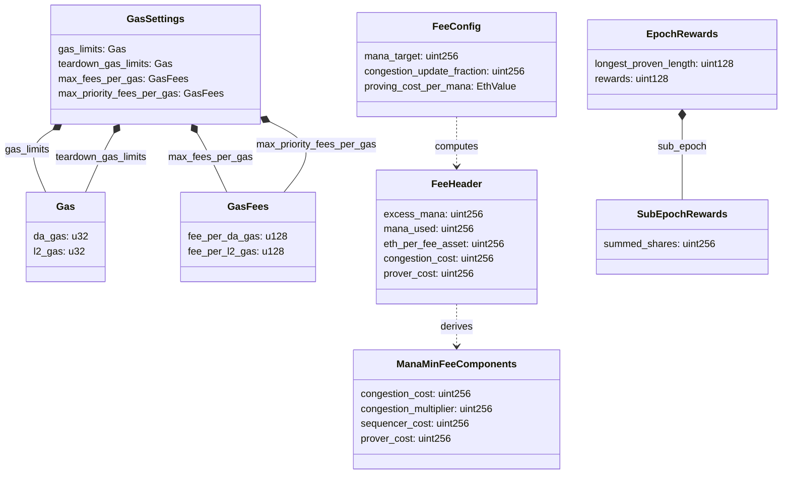

# Gas & Fees

## Overview

This spec defines the gas model, fee payment mechanism, fee pricing, and fee distribution for the Aztec network. It covers how transactions express willingness to pay, how execution costs are metered, how checkpoint-level base fees are determined via a congestion pricing mechanism, and how collected fees are distributed among sequencers, provers, and the burn address.

Gas and fees serve two purposes in the protocol:

1. **Resource pricing** — prevent denial-of-service by requiring users to pay for computation and data availability.
2. **Incentive alignment** — compensate sequencers for proposing checkpoints and provers for submitting validity proofs.

The protocol uses a **two-dimensional gas model** (L2 gas and DA gas) with an EIP-4844-style congestion pricing mechanism. All fees are denominated in the **Fee Juice** token, with an on-chain oracle tracking the ETH-to-Fee-Asset exchange rate.

**Related specs:**
- Spec #2 (Constants) — authoritative source for all gas-related constant values.
- Spec #5 (Transactions) — defines `GasSettings` within the transaction format and fee payment lifecycle.
- Spec #6 (Blocks) — defines `gas_fees` in `GlobalVariables` and fee-related block header fields.
- Spec #8 (Public VM) — defines AVM gas metering during public execution.
- Spec #9 (Rollup Circuits) — defines fee accumulation and validation across rollup layers.
- Spec #10 (L1 Rollup Contract) — defines fee header computation, mana pricing, and reward distribution on L1.

## Requirements

**R1: Two-Dimensional Gas Accounting.** The protocol MUST track resource consumption in two independent dimensions — L2 gas (computation, state operations) and DA gas (data availability via blobs) — because these map to fundamentally different cost drivers on Ethereum L1.

**R2: Transaction-Level Fee Limits.** Users MUST be able to set maximum gas limits and maximum fees per gas for each dimension, independently for main execution and teardown phases. The protocol MUST NOT charge more than the user's stated maximum.

**R3: Dynamic Base Fee.** The checkpoint base fee MUST adjust dynamically based on network congestion using an exponential pricing mechanism, so that sustained high demand increases costs and sustained low demand decreases them.

**R4: Fee Payer Solvency.** The protocol MUST verify at the circuit level that the fee payer has sufficient Fee Juice balance to cover the transaction fee before applying state changes.

**R5: Deterministic Fee Computation.** Given the same gas usage and block gas fees, any implementation MUST compute the same transaction fee. The fee computation formula MUST be deterministic and verifiable in a zero-knowledge circuit.

**R6: Fair Reward Distribution.** Collected fees MUST be split among sequencers, provers, and the burn mechanism according to deterministic rules. Congestion costs MUST be burned to create deflationary pressure during high activity.

**R7: L1 Cost Recovery.** The base fee MUST account for the L1 costs incurred by sequencers (checkpoint proposal gas, blob fees) and provers (epoch verification gas), ensuring that honest participation is economically sustainable.

**R8: Compatibility with EIP-1559 Semantics.** Transactions MUST support priority fees (tips) in addition to base fees, following EIP-1559-style semantics where the effective fee is `base_fee + min(priority_fee, max_fee - base_fee)`.

## Specification

### Gas Dimensions

The protocol defines two independent gas dimensions:

| Dimension | Name | Purpose |
|-----------|------|---------|
| DA Gas | Data Availability Gas | Cost for publishing transaction effects to Ethereum blobs |
| L2 Gas | Layer 2 Gas | Cost for computation, state operations, and proving on Aztec |

Each transaction reports consumption in both dimensions. Both dimensions have independent limits and pricing.

> **Current constraint:** `fee_per_da_gas` MUST be `0`. DA gas pricing is not currently active. All cost components are expressed through L2 gas pricing (see Spec #6, Global Variables).

### Mana

**Mana** is the L1-level abstraction for resource consumption within a checkpoint. While transactions track gas usage in two dimensions, the checkpoint-level fee model uses a single scalar — mana — for congestion pricing and cost amortization.

The `total_mana_used` field in the checkpoint header records the aggregate resource consumption for all transactions in that checkpoint. Mana drives:

- Congestion pricing (excess mana tracking)
- Sequencer and prover cost amortization
- Checkpoint capacity limits

The relationship is: the L1 contract enforces a **mana limit** per checkpoint, and the `feePerL2Gas` in the checkpoint header equals the computed **mana minimum fee** — the sum of sequencer cost, prover cost, and congestion cost per unit of mana.

### Transaction Gas Settings

Each transaction includes a `GasSettings` structure (defined in Spec #5) that expresses the sender's willingness to pay:

| Field | Type | Description |
|-------|------|-------------|
| `gas_limits` | `Gas` | Maximum DA gas and L2 gas for main execution (setup + app logic) |
| `teardown_gas_limits` | `Gas` | Maximum DA gas and L2 gas for the teardown phase |
| `max_fees_per_gas` | `GasFees` | Maximum fee per unit of gas the sender will pay (per dimension) |
| `max_priority_fees_per_gas` | `GasFees` | Maximum additional priority fee (tip) per unit of gas |

Where `Gas` contains `(da_gas: u32, l2_gas: u32)` and `GasFees` contains `(fee_per_da_gas: u128, fee_per_l2_gas: u128)`.

The **fee limit** — the maximum total fee a transaction can incur — is:

```
fee_limit = gas_limits.da_gas * max_fees_per_gas.fee_per_da_gas
           + gas_limits.l2_gas * max_fees_per_gas.fee_per_l2_gas
```

### Effective Gas Fees

The **effective gas fee** determines the actual per-unit price used to compute the transaction fee. It incorporates both the block's base fee and the sender's priority fee, capped at the sender's maximum:

```
effective_fee_per_da_gas = gas_fees.fee_per_da_gas
    + min(max_priority_fees.fee_per_da_gas, max_fees.fee_per_da_gas - gas_fees.fee_per_da_gas)

effective_fee_per_l2_gas = gas_fees.fee_per_l2_gas
    + min(max_priority_fees.fee_per_l2_gas, max_fees.fee_per_l2_gas - gas_fees.fee_per_l2_gas)
```

This requires `max_fees_per_gas >= gas_fees` in each dimension (enforced by circuit validation; see Validation Rules).

### Transaction Fee Computation

The transaction fee is computed as:

```
transaction_fee = gas_used.da_gas * effective_fee_per_da_gas
                + gas_used.l2_gas * effective_fee_per_l2_gas
```

Where `gas_used` is the **billed gas** for the transaction (see Gas Metering below).

### Gas Metering

Gas metering occurs at two levels: the **private kernel circuits** meter gas for private-phase side effects, and the **AVM** meters gas during public execution.

#### Private Phase Gas Metering

The private kernel circuits compute `gas_used` based on the transaction's side effects. The metering algorithm depends on whether the transaction includes public execution:

```
function meter_gas_used(public_inputs, is_for_public) -> Gas:
    metered_da_fields = 0
    metered_l2_gas = 0

    // Select cost table based on transaction type
    l2_gas_table = is_for_public ? PUBLIC_TX_L2_GAS : PRIVATE_ONLY_TX_L2_GAS

    // Note hashes
    metered_da_fields += count(note_hashes)
    metered_l2_gas += count(note_hashes) * l2_gas_table.note_hash

    // Nullifiers
    metered_da_fields += count(nullifiers)
    metered_l2_gas += count(nullifiers) * l2_gas_table.nullifier

    // L2-to-L1 messages
    metered_da_fields += count(l2_to_l1_msgs)
    metered_l2_gas += count(l2_to_l1_msgs) * l2_gas_table.l2_to_l1_msg

    // Private logs (count payload fields + 1 length field per log)
    metered_da_fields += sum(log.length for each private_log) + count(private_logs)
    metered_l2_gas += count(private_logs) * l2_gas_table.private_log

    // Contract class logs (count payload fields + 1 address field per log)
    metered_da_fields += sum(log.length for each contract_class_log) + count(contract_class_logs)
    metered_l2_gas += count(contract_class_logs) * l2_gas_table.contract_class_log

    // Public call startup costs (public transactions only)
    if is_for_public:
        metered_l2_gas += count(public_call_requests) * FIXED_AVM_STARTUP_L2_GAS

    // Teardown gas reservation (public transactions with teardown only)
    teardown_gas = if is_for_public AND has_teardown_call:
        gas_settings.teardown_gas_limits
    else:
        Gas::empty()

    // Convert DA fields to DA gas
    metered_da_gas = metered_da_fields * DA_BYTES_PER_FIELD * DA_GAS_PER_BYTE

    return Gas::tx_overhead() + Gas(metered_da_gas, metered_l2_gas) + teardown_gas
```

The **tx overhead** is a fixed per-transaction cost: `Gas(FIXED_DA_GAS, FIXED_L2_GAS)`.

Two L2 gas cost tables are used depending on whether the transaction includes public execution:

| Side Effect | Private-Only L2 Gas | Public TX L2 Gas |
|------------|---------------------|------------------|
| Note hash | `L2_GAS_PER_NOTE_HASH` | `AVM_EMITNOTEHASH_BASE_L2_GAS` |
| Nullifier | `L2_GAS_PER_NULLIFIER` | `AVM_EMITNULLIFIER_BASE_L2_GAS` |
| L2-to-L1 message | `L2_GAS_PER_L2_TO_L1_MSG` | `AVM_SENDL2TOL1MSG_BASE_L2_GAS` |
| Private log | `L2_GAS_PER_PRIVATE_LOG` | `L2_GAS_PER_PRIVATE_LOG` |
| Contract class log | `L2_GAS_PER_CONTRACT_CLASS_LOG` | `L2_GAS_PER_CONTRACT_CLASS_LOG` |

The reason for dual cost tables: in public transactions, side effects originating from private execution are later processed by the AVM, which incurs additional L2 gas costs for tree insertions and storage operations. In private-only transactions, these operations are handled directly by the rollup circuit at lower cost.

See Spec #2 for the current values of all constants.

#### Billed Gas vs. Actual Gas

For transactions with a teardown phase, the **billed gas** differs from the actual gas consumed:

```
billed_gas = (total_gas - actual_teardown_gas) + teardown_gas_limits
```

The teardown gas limits from `GasSettings` are used instead of the actual teardown consumption. This protects sequencers: they must reserve capacity for the full teardown limit when including the transaction, regardless of how much teardown actually consumes. The user commits to paying for this reservation.

#### AVM Gas Metering

During public execution, the AVM meters gas per instruction. See Spec #8 for the complete AVM gas metering specification, including:

- Base gas costs per opcode (L2 gas and DA gas)
- Dynamic gas costs that scale with runtime values
- Addressing mode gas costs (indirect, relative operands)
- Out-of-gas behavior

See Spec #2 for the authoritative table of AVM opcode gas costs.

### Fee Juice

**Fee Juice** is the protocol's native fee token. All transaction fees are denominated in and paid with Fee Juice.

| Property | Value |
|----------|-------|
| L2 contract address | `FEE_JUICE_ADDRESS` (address 5) |
| Balance storage slot | `FEE_JUICE_BALANCES_SLOT` (slot 1) |

Fee Juice has the following protocol-level properties:

- It is **fungible**.
- It **cannot be transferred** between accounts on the Aztec network. Balances can only change via L1 bridge deposits or protocol-level fee deductions.
- It only has **public balances** — there is no private balance mechanism for Fee Juice.
- It is obtained on Aztec via the Fee Juice Portal bridge from Ethereum (see below).

The fee payer's balance is stored in the public data tree at a leaf slot derived from:

```
balance_slot = derive_storage_slot_in_map(FEE_JUICE_BALANCES_SLOT, fee_payer)
leaf_slot = compute_public_data_leaf_slot(FEE_JUICE_ADDRESS, balance_slot)
```

#### Fee Juice Portal

The `FeeJuicePortal` is an L1 contract that bridges the fee asset between Ethereum and Aztec:

- **Deposits:** Users call `depositToAztecPublic(to, amount, secretHash)` which transfers the underlying ERC-20 token to the portal and sends an L2 message via the Inbox. The L2 message can be consumed publicly to credit the recipient's Fee Juice balance.
- **Fee Distribution:** The rollup contract calls `distributeFees(to, amount)` to transfer collected fees from the portal to reward recipients (sequencers, provers). Only the rollup contract is authorized to call this function.

```
L2_TOKEN_ADDRESS = bytes32(FEE_JUICE_ADDRESS)

function depositToAztecPublic(to, amount, secretHash) -> (key, index):
    transfer underlying token from sender to portal
    contentHash = sha256ToField(abi.encode("claim(bytes32,uint256)", to, amount))
    (key, index) = INBOX.sendL2Message(L2Actor(L2_TOKEN_ADDRESS, VERSION), contentHash, secretHash)
    return (key, index)

function distributeFees(to, amount):
    require(msg.sender == ROLLUP)
    transfer underlying token from portal to `to`
```

### Fee Payer

The **fee payer** is the entity that pays the transaction fee. It is determined during private execution and propagated through the kernel circuits.

#### Setting the Fee Payer

A private function designates its contract as the fee payer by calling `context.set_as_fee_payer()`. This sets a boolean flag `is_fee_payer` on the `PrivateCircuitPublicInputs`. The private kernel circuits inspect this flag for each call stack item:

- When a call stack item has `is_fee_payer = true`, the kernel circuit sets `fee_payer` in the `PrivateKernelCircuitPublicInputs` to the `contract_address` of that call.
- If `fee_payer` is not set by the end of private execution, the transaction is invalid.
- If multiple call stack items attempt to set `is_fee_payer`, the transaction is invalid.

The `fee_payer` address is subsequently propagated through the public kernel circuits (if any) to the final `KernelCircuitPublicInputs`.

#### Fee Deduction

For **private-only transactions** (no public execution), the base rollup circuit injects a `PublicDataWrite` that deducts the transaction fee from the fee payer's Fee Juice balance:

```
new_balance = fee_payer_balance - transaction_fee
```

For **public transactions**, the AVM executes a dedicated `COLLECT_GAS_FEES` phase after teardown that performs the fee deduction.

In both cases, the circuit verifies the fee payer's balance is sufficient before applying the deduction (see V3).

### Transaction Phases and Fee Abstraction

Transactions are broken into distinct phases with different revert semantics:

1. **Private execution** — processed locally by the user. If private execution fails, the user cannot generate a valid proof and the transaction cannot be included in a checkpoint. Side effects are partitioned into non-revertible (setup) and revertible (app logic) sets by the `min_revertible_side_effect_counter`.
2. **Non-revertible insertions** — note hashes, nullifiers, and L2-to-L1 messages from the non-revertible set are inserted into trees.
3. **Public setup** — enqueued public calls from the non-revertible partition execute. If any setup call fails, the transaction is **invalid** and cannot be included in a checkpoint.
4. **Revertible insertions** — note hashes, nullifiers, and L2-to-L1 messages from the revertible set are inserted.
5. **Public app logic** — enqueued public calls from the revertible partition execute. If app logic reverts, all revertible state changes are rolled back, but the transaction remains valid.
6. **Public teardown** — the designated teardown function executes with access to the `transaction_fee`. If teardown reverts, its state changes are rolled back.
7. **Fee collection** — the transaction fee is deducted from the fee payer's Fee Juice balance. This always occurs regardless of reverts.

#### Setup and Teardown Definition

The boundary between setup and app logic is set during private execution by calling `context.end_setup()`, which records the current side effect counter as `min_revertible_side_effect_counter`. Only the entrypoint function (processed by `PrivateKernelInit`) may call `end_setup()`. Side effects with counters below this value are non-revertible; those at or above it are revertible.

The teardown function is specified by calling `context.set_public_teardown_function(contract_address, function_selector, args)` during private execution. This stores a `PublicCallRequest` in the `PrivateCircuitPublicInputs`. The private kernel circuits verify that at most one teardown function is specified per transaction. Unlike enqueued public calls, the teardown function is not a side effect — it has no associated side effect counter and is not subject to `min_revertible_side_effect_counter` partitioning. It is always executed during the teardown phase regardless of when it was set.

#### Revert Code

The transaction's revert status is encoded as a 2-bit `RevertCode`:

| Value | Meaning |
|-------|---------|
| `0` | Success — no phase reverted |
| `1` | App logic reverted |
| `2` | Teardown reverted |
| `3` | Both app logic and teardown reverted |

When app logic reverts, execution proceeds to teardown. When teardown reverts, state is rolled back to the post-setup checkpoint. In both revert cases, the fee payer is still charged the full transaction fee.

#### Fee Abstraction via Fee Payment Contracts

The phase structure enables **fee abstraction**: users who do not hold Fee Juice can pay fees through a Fee Payment Contract (FPC). A typical FPC flow:

1. **Private setup:** The user calls a private function on the FPC. The FPC designates itself as `fee_payer` via `context.set_as_fee_payer()`, specifies its teardown function via `context.set_public_teardown_function(...)`, and calls `context.end_setup()`.
2. **Public setup:** The FPC transfers an accepted asset from the user to itself (non-revertible, so the FPC is guaranteed payment even if app logic fails).
3. **App logic:** The user performs their intended operations.
4. **Teardown:** The FPC reads `transaction_fee`, computes the refund, and transfers the excess accepted asset back to the user.
5. **Fee collection:** The protocol deducts the transaction fee from the FPC's Fee Juice balance.

Because public setup is non-revertible, the FPC is guaranteed to receive the user's payment even if subsequent phases revert.

### Mempool Validation

When a node receives a transaction for inclusion in the mempool, it MUST verify:

1. The `fee_payer` is set (non-zero).
2. For transactions **without** public execution: the `fee_payer` has a Fee Juice balance greater than or equal to the computed transaction fee.
3. For transactions **with** public execution: the `fee_payer` has a Fee Juice balance greater than or equal to the **fee limit** (maximum possible transaction fee), since the actual fee is not known until public execution completes.

### Checkpoint-Level Fee Model

Each checkpoint carries a **fee header** that records the pricing state. The fee header is computed during checkpoint proposal and stored on L1 for later use during epoch proof submission.

#### Fee Header

| Field | Bits | Type | Description |
|-------|------|------|-------------|
| `mana_used` | 32 | `uint32` | Total mana consumed in this checkpoint |
| `excess_mana` | 48 | `uint48` | Cumulative excess mana after this checkpoint |
| `eth_per_fee_asset` | 48 | `uint48` | ETH-to-Fee-Asset exchange rate (1e12 precision) |
| `congestion_cost` | 64 | `uint64` | Congestion cost component per mana (in fee asset) |
| `prover_cost` | 63 | `uint63` | Prover cost component per mana (in fee asset) |
| `pre_heat` | 1 | `bool` | Storage slot pre-heat flag |

The fee header is stored as a compressed `uint256` with the following bit layout:

```
Bit 255:       pre_heat (1 bit)
Bits 192-254:  prover_cost (63 bits)
Bits 128-191:  congestion_cost (64 bits)
Bits 80-127:   eth_per_fee_asset (48 bits)
Bits 32-79:    excess_mana (48 bits)
Bits 0-31:     mana_used (32 bits)
```

#### Mana Target and Limit

The protocol defines a configurable **mana target** per checkpoint. The mana limit is derived as:

```
mana_limit = mana_target * 2
```

The mana limit MUST fit in a `uint32` (i.e., `mana_limit <= 2^32 - 1`).

If `mana_target` is `0`, transactions are disabled (ignition phase).

#### Mana Base Fee Components

The **mana minimum fee** (the per-mana base fee for a checkpoint) is the sum of three components:

```
mana_min_fee = sequencer_cost + prover_cost + congestion_cost
```

Each component is computed as follows.

##### Sequencer Cost

The sequencer cost amortizes the L1 gas cost of proposing a checkpoint over the mana target:

```
eth_used = L1_GAS_PER_CHECKPOINT_PROPOSED * l1_base_fee
         + BLOBS_PER_CHECKPOINT * BLOB_GAS_PER_BLOB * l1_blob_fee

sequencer_cost_per_mana_eth = ceil(eth_used / mana_target)
sequencer_cost_per_mana = to_fee_asset(sequencer_cost_per_mana_eth, eth_per_fee_asset)
```

Where:
- `L1_GAS_PER_CHECKPOINT_PROPOSED = 300,000`
- `BLOBS_PER_CHECKPOINT = 3`
- `BLOB_GAS_PER_BLOB = 2^17 = 131,072`

##### Prover Cost

The prover cost amortizes the L1 gas cost of epoch verification plus a governance-configured proving cost:

```
verification_cost_eth = ceil(ceil(L1_GAS_PER_EPOCH_VERIFIED * l1_base_fee / epoch_duration) / mana_target)
prover_cost_per_mana_eth = verification_cost_eth + proving_cost_per_mana

prover_cost_per_mana = to_fee_asset(prover_cost_per_mana_eth, eth_per_fee_asset)
```

Where:
- `L1_GAS_PER_EPOCH_VERIFIED = 1,000,000`
- `epoch_duration` is the number of slots per epoch
- `proving_cost_per_mana` is a governance-controlled parameter representing the off-chain proving cost per mana (stored in `FeeConfig`)

##### Congestion Cost

The congestion cost uses an EIP-4844-style exponential function to price network congestion:

```
total_base = sequencer_cost_per_mana_eth + prover_cost_per_mana_eth

congestion_multiplier = fake_exponential(
    MINIMUM_CONGESTION_MULTIPLIER,
    excess_mana,
    congestion_update_fraction
)

congestion_cost_eth = floor(total_base * congestion_multiplier / MINIMUM_CONGESTION_MULTIPLIER) - total_base

congestion_cost = to_fee_asset(congestion_cost_eth, eth_per_fee_asset)
```

Where:
- `MINIMUM_CONGESTION_MULTIPLIER = 10^9` (base multiplier with no congestion)
- `congestion_update_fraction = mana_target * 854,700,854 / 10^8`

The magic constants are chosen so that when excess mana increases by `mana_target`, the congestion multiplier increases by approximately 12.5%, matching EIP-4844 blob fee dynamics.

##### Excess Mana Tracking

The excess mana accumulates across checkpoints:

```
excess_mana = max(0, parent.excess_mana + parent.mana_used - mana_target)
```

This is a **clamped addition** — the value cannot go below zero.

##### Fake Exponential Function

The `fake_exponential` function approximates `factor * e^(numerator / denominator)` using a Taylor series expansion:

```
function fake_exponential(factor, numerator, denominator) -> uint256:
    i = 1
    output = 0
    accumulator = factor * denominator

    while accumulator > 0:
        output += accumulator
        accumulator = (accumulator * numerator) / (denominator * i)
        i += 1

    return output / denominator
```

This is identical to the function defined in EIP-4844.

#### Checkpoint Gas Fees

The gas fees included in the checkpoint header (and propagated to `GlobalVariables.gas_fees`) are:

```
gas_fees.fee_per_da_gas = 0           // DA gas pricing not currently active
gas_fees.fee_per_l2_gas = mana_min_fee // Sum of all three cost components
```

The L1 contract validates that the proposed header's `fee_per_l2_gas` exactly matches the computed `mana_min_fee`.

### L1 Gas Fee Oracle

The protocol maintains an on-chain oracle for Ethereum L1 gas prices, used to compute sequencer and prover cost components.

#### Oracle Structure

```
L1FeeData:
    base_fee: uint256    // Ethereum base fee (wei per gas)
    blob_fee: uint256    // EIP-4844 blob base fee (wei per blob gas)

L1GasOracleValues:
    pre:  CompressedL1FeeData   // Previous fee data
    post: CompressedL1FeeData   // Current fee data
    slot_of_change: Slot        // Slot when `post` becomes active
```

Each `L1FeeData` is compressed into 112 bits: two 56-bit values for `base_fee` and `blob_fee`. This caps each value at `2^56 - 1 ≈ 7.2 * 10^16` wei, which is well above any realistic L1 fee level.

#### Oracle Update Logic

The oracle updates are **buffered with a lag** to prevent manipulation:

```
LIFETIME = 5 slots    // How long a fee data entry is valid
LAG = 2 slots         // Delay before new data becomes active

function update_l1_gas_fee_oracle():
    current_slot = block.timestamp.to_slot()
    acceptable_slot = slot_of_change + (LIFETIME - LAG)

    if current_slot < acceptable_slot:
        return  // Too soon to update

    // Rotate: current becomes previous, fresh data becomes current
    pre = post
    post = L1FeeData(base_fee: block.basefee, blob_fee: blob_base_fee())
    slot_of_change = current_slot + LAG
```

The oracle is updated during each checkpoint proposal (when transactions are enabled).

#### Fee Lookup

```
function get_l1_fees_at(timestamp) -> L1FeeData:
    if timestamp.to_slot() < slot_of_change:
        return pre
    else:
        return post
```

### Fee Asset Price Oracle

The protocol tracks the ETH-to-Fee-Asset exchange rate to convert L1 costs (denominated in ETH) to fee asset units.

#### Price Representation

The exchange rate is stored as `eth_per_fee_asset` with `10^12` precision:

```
actual_eth_per_fee_asset = stored_value / 10^12
```

This allows representing prices from `10^-10` ETH per fee asset token (effectively worthless) to `100` ETH per fee asset token.

| Constant | Value | Meaning |
|----------|-------|---------|
| `ETH_PER_FEE_ASSET_PRECISION` | `10^12` | Precision multiplier |
| `MIN_ETH_PER_FEE_ASSET` | `100` | Minimum stored value (~10^-10 ETH) |
| `MAX_ETH_PER_FEE_ASSET` | `10^14` | Maximum stored value (~100 ETH) |
| `MAX_FEE_ASSET_PRICE_MODIFIER_BPS` | `100` | Max ±1% change per checkpoint |

#### Price Update

The price is updated once per checkpoint via a basis-points modifier provided by the proposer:

```
function compute_new_eth_per_fee_asset(current_price, modifier_bps) -> uint256:
    require(|modifier_bps| <= MAX_FEE_ASSET_PRICE_MODIFIER_BPS)

    if modifier_bps >= 0:
        new_price = current_price * (10,000 + modifier_bps) / 10,000
    else:
        new_price = current_price * (10,000 - |modifier_bps|) / 10,000

    return clamp(new_price, MIN_ETH_PER_FEE_ASSET, MAX_ETH_PER_FEE_ASSET)
```

The `MIN_ETH_PER_FEE_ASSET` is set to `100` so that a 1% change (1 bps) always moves the price by at least 1 in integer arithmetic.

#### Currency Conversions

```
function to_eth(fee_asset_amount, eth_per_fee_asset) -> uint256:
    return ceil(fee_asset_amount * eth_per_fee_asset / ETH_PER_FEE_ASSET_PRECISION)

function to_fee_asset(eth_amount, eth_per_fee_asset) -> uint256:
    return ceil(eth_amount * ETH_PER_FEE_ASSET_PRECISION / eth_per_fee_asset)
```

Both conversions round up (ceiling division) to prevent undercharging.

### Fee Configuration

The fee model is parameterized by a governance-controlled configuration:

| Parameter | Type | Bits | Description |
|-----------|------|------|-------------|
| `mana_target` | `uint32` | 32 | Target mana consumption per checkpoint |
| `congestion_update_fraction` | `uint128` | 128 | Denominator for congestion exponential (derived from `mana_target`) |
| `proving_cost_per_mana` | `EthValue` | 64 | Governance-set off-chain proving cost per mana (in ETH) |

The `congestion_update_fraction` is derived as:

```
congestion_update_fraction = mana_target * 854,700,854 / 10^8
```

These parameters are stored compressed in a single `uint256` on L1.

### Fee Distribution

Fee distribution occurs when an epoch root proof is submitted. For each newly proven checkpoint within the proof span, fees are split into three portions.

#### Distribution Formula

For each checkpoint `i` in the proven range:

```
fee = total_fees_collected_in_checkpoint[i]
mana_used = fee_header[i].mana_used
congestion_cost = fee_header[i].congestion_cost
prover_cost = fee_header[i].prover_cost

// 1. Burn: congestion portion
burn = congestion_cost * mana_used

// 2. Prover: proving cost portion (capped at remaining fee after burn)
prover_fee = min(prover_cost * mana_used, fee - burn)

// 3. Sequencer: residual
sequencer_fee = fee - burn - prover_fee
```

#### Accumulation and Claims

- **Sequencer rewards** accumulate per-coinbase address: `sequencer_rewards[coinbase] += sequencer_fee + checkpoint_reward_share`
- **Prover rewards** accumulate per-epoch: `epoch_rewards[epoch].rewards += prover_fee`
- **Burned fees** are transferred to the burn address (`CUAUHXICALLI`)

Fees are collected from the Fee Juice Portal by calling `distributeFees`, then the burn portion is immediately transferred to the burn address.

#### Checkpoint Rewards

In addition to transaction fee revenue, each proven checkpoint earns a fixed **checkpoint reward** from the `RewardDistributor` (governance inflation). These rewards are split:

- A `sequencer_bps` portion (in basis points) goes to the sequencer.
- The remainder goes to the prover reward pool for the epoch.

```
checkpoint_rewards_available = min(
    checkpoints_proven * checkpoint_reward,
    fee_asset.balance_of(reward_distributor)
)
sequencer_checkpoint_reward = checkpoint_rewards_available * sequencer_bps / 10,000
prover_checkpoint_reward = checkpoint_rewards_available - sequencer_checkpoint_reward
```

#### Prover Reward Shares

Provers compete to prove the longest span of checkpoints within an epoch. Rewards are allocated to the **longest proven length** tier:

```
EpochRewards:
    longest_proven_length: uint128
    rewards: uint128
    sub_epoch[length]:
        summed_shares: uint256
        shares[prover]: uint256
```

When a prover submits a proof:

1. The prover's **shares** are determined by a booster contract (`booster.updateAndGetShares(prover)`), which may account for staking or other incentive mechanisms.
2. If the proof covers more checkpoints than any previous proof in this epoch (`length > longest_proven_length`), the additional checkpoints' fees are added to the epoch reward pool.
3. Only provers in the sub-epoch matching `longest_proven_length` receive rewards.

A prover claims their share of epoch rewards after the proof deadline:

```
prover_reward = prover_shares * epoch_rewards / total_summed_shares
```

Each prover can claim once per epoch (tracked by a bitmap).

#### Reward Claiming

- `claimSequencerRewards(coinbase)` — transfers accumulated sequencer rewards to the coinbase address.
- `claimProverRewards(prover, epochs[])` — transfers accumulated prover rewards for specified epochs.

Both functions require `isRewardsClaimable` to be `true` and (for provers) the epoch's proof deadline to have passed.

## Data Structures

### Gas

```
Gas {
    da_gas: u32       // Data availability gas
    l2_gas: u32       // Layer 2 computation gas
}
```

Serialization length: `GAS_LENGTH = 2` fields.

### GasFees

```
GasFees {
    fee_per_da_gas: u128     // Fee per unit of DA gas
    fee_per_l2_gas: u128     // Fee per unit of L2 gas
}
```

Serialization length: `GAS_FEES_LENGTH = 2` fields.

### GasSettings

```
GasSettings {
    gas_limits: Gas                    // Max gas for main execution
    teardown_gas_limits: Gas           // Max gas for teardown phase
    max_fees_per_gas: GasFees          // Maximum fee per gas unit
    max_priority_fees_per_gas: GasFees // Maximum priority fee per gas unit
}
```

Serialization length: `GAS_SETTINGS_LENGTH = 8` fields.

### FeeHeader

```
FeeHeader {
    excess_mana: uint256       // Cumulative excess mana
    mana_used: uint256         // Mana consumed in this checkpoint
    eth_per_fee_asset: uint256 // Exchange rate (1e12 precision)
    congestion_cost: uint256   // Congestion cost per mana (fee asset)
    prover_cost: uint256       // Prover cost per mana (fee asset)
}
```

Compressed representation: `uint256` (see bit layout in Fee Header section above).

### FeeConfig

```
FeeConfig {
    mana_target: uint256                  // Target mana per checkpoint
    congestion_update_fraction: uint256   // Denominator for exponential
    proving_cost_per_mana: EthValue       // Off-chain proving cost (ETH)
}
```

Compressed representation: `uint256` (32-bit mana target, 128-bit congestion fraction, 64-bit proving cost).

### L1FeeData

```
L1FeeData {
    base_fee: uint256    // Ethereum base fee (wei)
    blob_fee: uint256    // EIP-4844 blob base fee (wei)
}
```

Compressed representation: `uint112` (two 56-bit values).

### L1GasOracleValues

```
L1GasOracleValues {
    pre: CompressedL1FeeData        // Previous fee data
    post: CompressedL1FeeData       // Current fee data
    slot_of_change: CompressedSlot  // When post becomes active
}
```

### ManaMinFeeComponents

```
ManaMinFeeComponents {
    congestion_cost: uint256       // Congestion pricing component
    congestion_multiplier: uint256 // Raw multiplier value (1e9 base)
    sequencer_cost: uint256        // Sequencer L1 cost component
    prover_cost: uint256           // Prover L1 + off-chain cost component
}
```

### Reward Structures

```
RewardConfig {
    reward_distributor: address    // Inflation reward source
    sequencer_bps: uint32          // Sequencer share (basis points, max 10,000)
    booster: address               // Prover share calculation contract
    checkpoint_reward: uint96      // Fixed reward per proven checkpoint
}

EpochRewards {
    longest_proven_length: uint128
    rewards: uint128
    sub_epoch[length]: SubEpochRewards
}

SubEpochRewards {
    summed_shares: uint256
    shares[prover]: uint256
}
```

### RevertCode

```
RevertCode: u8
    0 = OK                  // No phase reverted
    1 = APP_LOGIC_REVERTED  // App logic reverted (bit 0)
    2 = TEARDOWN_REVERTED   // Teardown reverted (bit 1)
    3 = BOTH_REVERTED       // Both reverted (bits 0 and 1)
```

This is a 2-bit bitmask: bit 0 indicates app logic revert, bit 1 indicates teardown revert.

### Structure Relationships



## Validation Rules

### V1: Transaction Max Fees (Circuit)

The rollup circuit MUST verify that the transaction's `max_fees_per_gas` is greater than or equal to the block's `gas_fees` in each dimension:

```
assert(tx_gas_settings.max_fees_per_gas.fee_per_da_gas >= block_gas_fees.fee_per_da_gas)
assert(tx_gas_settings.max_fees_per_gas.fee_per_l2_gas >= block_gas_fees.fee_per_l2_gas)
```

Transactions that do not meet this criterion MUST be skipped (deferred to a future block), not rejected (see Spec #5, V8).

### V2: L2 Gas Limit (Circuit)

The rollup circuit MUST verify that the transaction's L2 gas limit does not exceed the maximum processable L2 gas:

```
assert(tx_gas_settings.gas_limits.l2_gas <= AVM_MAX_PROCESSABLE_L2_GAS)
```

### V3: Fee Payer Solvency (Circuit)

The rollup circuit MUST verify that the fee payer's Fee Juice balance is sufficient to cover the computed transaction fee:

```
balance = fee_payer_balance_leaf_preimage.value
assert(balance >= transaction_fee)
```

The circuit also verifies that the balance leaf preimage corresponds to the correct fee payer by checking the leaf slot derivation.

### V4: Mana Limit (L1)

The L1 contract MUST verify that the checkpoint's total mana usage does not exceed the mana limit:

```
assert(header.total_mana_used <= mana_limit)
```

Where `mana_limit = mana_target * 2`.

### V5: DA Fee Is Zero (L1)

The L1 contract MUST verify that the DA gas fee is zero:

```
assert(header.gas_fees.fee_per_da_gas == 0)
```

### V6: L2 Fee Matches Mana Min Fee (L1)

The L1 contract MUST verify that the proposed L2 gas fee exactly matches the computed mana minimum fee:

```
assert(header.gas_fees.fee_per_l2_gas == mana_min_fee)
```

Where `mana_min_fee = sequencer_cost + prover_cost + congestion_cost`.

### V7: Fee Asset Price Modifier (L1)

The L1 contract MUST verify that the fee asset price modifier is within bounds:

```
assert(|fee_asset_price_modifier_bps| <= MAX_FEE_ASSET_PRICE_MODIFIER_BPS)
```

### V8: Coinbase Non-Zero (L1)

The L1 contract MUST verify that the coinbase address is non-zero:

```
assert(header.coinbase != address(0))
```

### V9: Fee Payer Set (Circuit)

The kernel circuit MUST verify that `fee_payer` is set (non-zero address) before producing final public inputs. A transaction without a designated fee payer is invalid.

### V10: Setup Phase Non-Revertible (AVM)

If any enqueued public call in the setup phase (non-revertible partition) reverts, the transaction is **invalid** and MUST NOT be included in a checkpoint. Sequencers SHOULD whitelist known-safe public setup functions to mitigate the risk of processing transactions with untrusted setup calls.

### V11: Gas Usage Within Limits (AVM)

During AVM execution, each instruction MUST check that sufficient gas remains before executing. If an instruction would exceed the remaining gas budget, the AVM MUST raise an `OutOfGasError`, set all remaining gas to zero, and revert the current call context. See Spec #8 for details.

### V12: Fee Accumulation (Rollup Circuit)

The rollup circuits MUST correctly accumulate fees across transactions and blocks:

- `TxRollupPublicInputs.accumulated_fees` MUST equal the sum of all transaction fees within the rollup.
- `BlockRollupPublicInputs.accumulated_fees` MUST equal the sum of fees across all merged transaction rollups.
- `CheckpointRollupPublicInputs.fees[i]` MUST record the `(recipient, amount)` for each checkpoint in the epoch.

See Spec #9 for the complete rollup circuit accumulation rules.

## Security Considerations

### Sequencer Griefing via Teardown

A malicious user could set very high `teardown_gas_limits` to force the sequencer to reserve capacity, then consume very little in teardown. The protocol mitigates this by billing the full `teardown_gas_limits` rather than actual consumption, making this strategy costly for the attacker.

### Fee Asset Price Oracle Manipulation

The fee asset price oracle is bounded to ±1% per checkpoint. Even if a malicious proposer consistently pushes the price in one direction, the maximum drift is limited. Over `n` checkpoints, the price can change by at most `(1.01)^n` or `(0.99)^n`, which limits the rate of manipulation.

### L1 Gas Fee Oracle Staleness

The L1 gas fee oracle uses a lag-and-lifetime mechanism to prevent stale data from persisting. Data is refreshed every `LIFETIME - LAG = 3` slots, with a 2-slot lag to allow the Ethereum base fee to stabilize. If L1 fees spike between oracle updates, the mana base fee may temporarily undercharge, but the delay is bounded.

### Congestion Pricing Overflow

The `fake_exponential` function can overflow if `excess_mana` grows very large relative to `congestion_update_fraction`. In practice, this means fees would become astronomically high before overflow occurs, which is acceptable since the network would be unusable at those fee levels anyway.

### Sequencer Risk from Public Setup

Because a transaction is invalid if it fails in the public setup phase, sequencers risk wasting resources processing transactions with untrusted setup functions. To mitigate this, sequencers are expected to maintain a whitelist of approved public setup functions (e.g., known FPC contracts). Transactions with unwhitelisted setup calls can be deprioritized or rejected at the mempool level.

### Prover Incentive Alignment

The longest-proof-wins mechanism incentivizes provers to prove the maximum span of checkpoints. A prover who submits a shorter proof risks being outcompeted by one who proves a longer span, since only the longest proof's tier receives rewards. This encourages provers to be reliable and comprehensive.

## Open Questions

1. **DA Gas Activation.** The protocol currently sets `fee_per_da_gas = 0`. When and how will DA gas pricing be activated? Will it require a hard fork or can it be enabled via governance parameter changes?

2. **Proving Cost Calibration.** The `proving_cost_per_mana` is a governance parameter. What methodology should be used to calibrate this value, and how frequently should it be updated to reflect actual proving costs?

3. **Fee Asset Price Oracle Governance.** The proposer provides the fee asset price modifier. What prevents collusion among proposers to systematically manipulate the exchange rate? Should there be an external oracle integration?

4. **Mana-to-Gas Mapping.** The spec currently treats `total_mana_used` as equivalent to `feePerL2Gas` pricing. Should mana incorporate a weighted combination of both gas dimensions when DA gas pricing is activated?

5. **Minimum Transaction Fee.** Should there be a minimum fee floor per transaction (beyond the fixed overhead) to prevent dust transactions from consuming sequencer resources?
