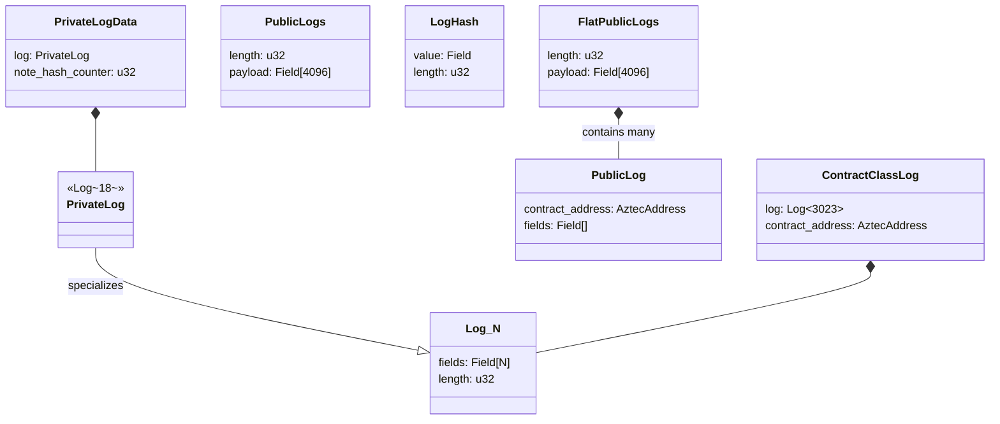
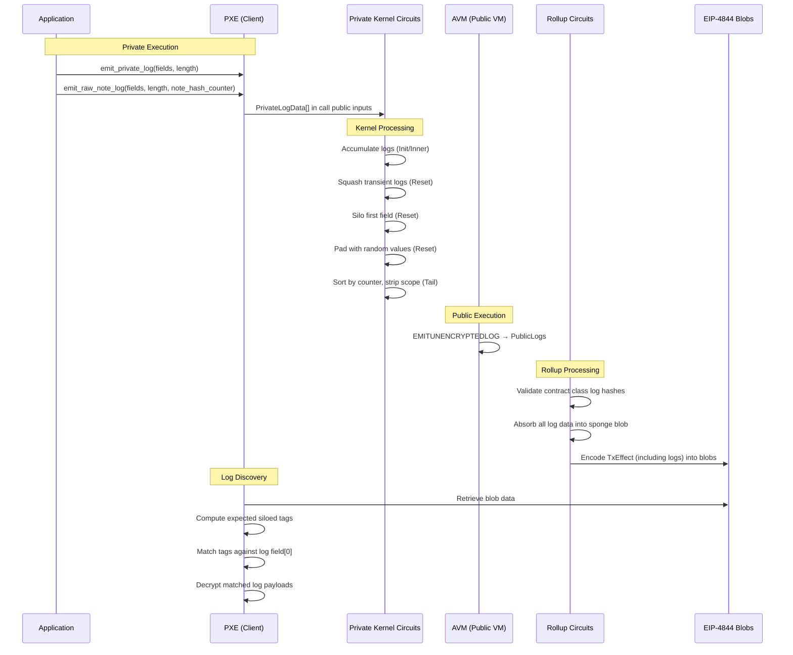

# Logs & Events

## Overview

This specification defines how logs are emitted, encoded, siloed, and committed in the Aztec protocol. Logs are the primary mechanism for communicating information from contracts to off-chain observers — they carry encrypted note data to recipients, broadcast public events, and publish contract class bytecode.

Aztec distinguishes three types of logs:

1. **Private logs** — emitted during private execution, carrying application-encrypted data (typically note or event payloads). The protocol treats their contents as arbitrary fields, with only the first field (the tag) subject to siloing.
2. **Public logs** — emitted during public (AVM) execution, carrying unencrypted data visible to all observers.
3. **Contract class logs** — a special-purpose log type used to publish contract class bytecode and function metadata during class registration.

Logs are not stored in any Merkle tree. They are ephemeral data included in transaction effects, encoded into EIP-4844 blobs for data availability, and committed via the sponge blob hash in the block header. Recipients discover and process logs off-chain.

**Cross-references:**
- Spec #2 (Constants) — defines all log-related constants, per-transaction limits, and domain separators
- Spec #3 (Cryptographic Primitives) — specifies Poseidon2 (used for siloing and hashing) and AES-128 (used for encryption)
- Spec #5 (Transaction Format & Lifecycle) — defines `TxEffect` containing log arrays, blob encoding with TX start markers
- Spec #6 (Block Format & Header) — defines `sponge_blob_hash` commitment covering all blob data including logs
- Spec #7 (Private Kernel Circuits) — defines log accumulation, siloing, squashing, and padding in private kernel circuits
- Spec #8 (Public VM) — defines the `EMITUNENCRYPTEDLOG` AVM opcode for public log emission
- Spec #9 (Rollup Circuits) — defines contract class log hash validation in TX Base circuits
- Spec #12 (Data Availability & Blobs) — defines blob encoding format for log data
- Spec #13 (Addresses & Keys) — defines key derivation used in log encryption and tagging
- Spec #14 (Contract Deployment) — defines contract class log contents for class registration

## Requirements

### R1: Arbitrary Content

The protocol MUST NOT impose any structure on log contents beyond the siloed first field (for private logs).

**Rationale:** Applications determine the usage and content of logs. For private logs, it is application-layer encryption (not protocol-layer) that determines who can read the contents.

### R2: Private Log Siloing

Private logs MUST be siloed to their originating contract before leaving the private kernel circuit chain. Siloing MUST prevent a log emitted by one contract from being attributed to another.

**Rationale:** Without siloing, a malicious contract could emit logs that appear to originate from a different contract, breaking recipient discovery and trust assumptions.

### R3: Private Log–Note Hash Linkage

Private logs MAY be linked to a specific note hash via a `note_hash_counter`. When a linked note hash is squashed (created and nullified within the same transaction during private execution), its associated logs MUST also be squashed.

**Rationale:** Logs linked to transient notes carry information about notes that will never exist on-chain. Propagating them would leak information about squashed notes and consume unnecessary data availability.

### R4: Revertibility

Logs emitted during revertible execution MUST be discarded if the transaction's public execution reverts. Logs emitted during non-revertible execution MUST be preserved regardless of revert status.

**Rationale:** Revertible logs correspond to state changes that may be rolled back. Including them after a revert would create inconsistency between the log stream and on-chain state.

### R5: Data Availability

All logs included in a `TxEffect` MUST be encoded into EIP-4844 blobs and committed via the block header's `sponge_blob_hash`. An independent node MUST be able to reconstruct all logs from blob data.

**Rationale:** Logs are critical protocol infrastructure, and contracts need to be able to rely on all external observers having access to them. Without data availability, parties may be unable to send transactions.

### R6: Bounded Log Sizes

Private logs MUST NOT exceed `PRIVATE_LOG_SIZE_IN_FIELDS` fields per log. Public logs MUST NOT exceed `MAX_PUBLIC_LOG_SIZE_IN_FIELDS` fields per log. The total public log payload per transaction MUST NOT exceed `FLAT_PUBLIC_LOGS_PAYLOAD_LENGTH` fields.

**Rationale:** Bounded log sizes ensure circuit complexity is predictable and prevent a single transaction from consuming unbounded block space.

### R7: Contract Class Log Integrity

Contract class log hashes included in kernel output MUST be validated against the provided log field preimages in the TX Base rollup circuit.

**Rationale:** The kernel circuit only carries a hash of the contract class log (to reduce circuit size). The rollup circuit must verify the preimage matches, ensuring the published bytecode is authentic.

## Specification

### Log Types

#### Private Logs

A private log is a fixed-capacity array of field elements emitted during private function execution. The protocol treats the contents as opaque, with the following conventions:

- **Field 0 (tag):** Siloed to the originating contract by the private kernel.
- **Fields 1..length-1 (payload):** Application-encrypted data. The protocol does not inspect or validate these fields.

```
PrivateLog {
    fields: Field[PRIVATE_LOG_SIZE_IN_FIELDS],  // Fixed-size array (18 fields)
    length: u32,                                 // Actual emitted length (≤ 18)
}
```

Private logs are emitted by private functions via the `emit_private_log` or `emit_raw_note_log` context methods. Each log may optionally be linked to a note hash:

```
PrivateLogData {
    log: PrivateLog,
    note_hash_counter: u32,  // 0 if not linked to a note hash
}
```

During circuit processing, logs carry scoping and ordering metadata:

```
Scoped<Counted<PrivateLogData>> {
    inner: Counted<PrivateLogData> {
        inner: PrivateLogData,
        counter: u32,              // Side-effect counter for ordering
    },
    contract_address: AztecAddress, // Originating contract (cleared after siloing)
}
```

#### Public Logs

A public log is a variable-length array of field elements emitted during AVM (public) execution via the `EMITUNENCRYPTEDLOG` opcode.

Each public log carries its originating contract address:

```
PublicLog {
    contract_address: AztecAddress,
    fields: Field[],  // Variable length, max MAX_PUBLIC_LOG_SIZE_IN_FIELDS
}
```

Public logs within a transaction are stored in a flat packed format:

```
FlatPublicLogs {
    length: u32,                                        // Total fields used
    payload: Field[FLAT_PUBLIC_LOGS_PAYLOAD_LENGTH],    // Packed log data
}
```

Each individual log in the flat payload is encoded as:

```
[log_length, contract_address, field_0, field_1, ..., field_{log_length-1}]
```

Where the first two fields form the `PUBLIC_LOG_HEADER_LENGTH = 2` header.

#### Contract Class Logs

A contract class log is a large log used exclusively for publishing contract class bytecode and function metadata during class registration. At most one contract class log may be emitted per transaction.

```
ContractClassLog {
    log: Log<CONTRACT_CLASS_LOG_SIZE_IN_FIELDS>,  // Up to 3023 fields
    contract_address: AztecAddress,               // Class registry contract
}
```

Contract class logs are represented in the kernel as hashes (to reduce circuit size):

```
LogHash {
    value: Field,   // Poseidon2 hash of the log fields
    length: u32,    // Emitted length
}
```

The hash is computed as:

```
contract_class_log_hash = poseidon2_hash(log_fields[0..CONTRACT_CLASS_LOG_SIZE_IN_FIELDS])
```

### Private Log Siloing

Siloing binds a private log to its originating contract, preventing cross-contract log spoofing. Only the first field (tag) is siloed; the remaining fields are unchanged.

```
siloed_first_field = poseidon2_hash_with_separator(
    [contract_address, inner_first_field],
    DOM_SEP__PRIVATE_LOG_FIRST_FIELD
)
```

Where `DOM_SEP__PRIVATE_LOG_FIRST_FIELD = 2769976252`.

The full siloing operation:

```
function compute_siloed_private_log(contract_address, log):
    siloed_log = copy(log)
    siloed_log.fields[0] = poseidon2_hash_with_separator(
        [contract_address, log.fields[0]],
        DOM_SEP__PRIVATE_LOG_FIRST_FIELD
    )
    return siloed_log
```

After siloing, the `contract_address` on the scoped log is cleared to zero, indicating the log has been siloed and preventing double-siloing.

Siloing is performed by the Private Kernel Reset circuit (see Spec #7).

### Log Squashing

Logs linked to transient note hashes (notes created and nullified within the same transaction during private execution) are squashed — removed from the output. This is part of the transient data squashing process in the Private Kernel Reset circuit.

A log is a **note log** if `note_hash_counter != 0`. A note log is squashed if its linked note hash is squashed. The squashing rules are:

1. **Non-note logs** (`note_hash_counter == 0`): MUST always be kept.
2. **Note logs linked to kept note hashes:** MUST be kept.
3. **Note logs linked to squashed note hashes:** MUST be squashed.
4. **Revertibility boundary:** A log and its linked note hash MUST both be revertible or both be non-revertible to be squashed together. Cross-boundary squashing is forbidden.

Kept logs MUST preserve their original relative order.

### Log Padding

To obscure the true number of logs in a transaction, the Private Kernel Reset circuit pads the private log array with random values after real logs. The padding values are provided by the PXE (client) and are not validated for randomness by the circuit.

Padded logs are siloed using `SIDE_EFFECT_MASKING_ADDRESS`. This prevents log forgery.

Padding entries have `length > 0` (they are indistinguishable from real logs to external observers). After padding, the array is dense — all entries with `length > 0` appear before any with `length == 0`.

### Revertibility Splitting

For transactions with public calls, the Private Kernel Tail-to-Public circuit splits private logs into non-revertible and revertible sets based on the `min_revertible_side_effect_counter`:

- Logs with `counter ≤ min_revertible_side_effect_counter` are **non-revertible**.
- Logs with `counter > min_revertible_side_effect_counter` are **revertible**.

When constructing the final `TxEffect`:
- If `revert_code == OK`: All logs (non-revertible + revertible) are included.
- If `revert_code != OK`: Only non-revertible logs are included.

For private-only transactions (no public calls), all logs are included and `revert_code` is always `OK`.

### Public Log Emission

Public logs are emitted during AVM execution via the `EMITUNENCRYPTEDLOG` opcode:

| Property | Value |
|---|---|
| Opcode | `EMITUNENCRYPTEDLOG` (`0x37`) |
| Operands | `logSizeOffset` (U32), `logOffset` (memory pointer) |
| Dynamic L2 gas | `size * AVM_EMITUNENCRYPTEDLOG_DYN_L2_GAS` |
| Dynamic DA gas | `size * AVM_EMITUNENCRYPTEDLOG_DYN_DA_GAS` |
| Restriction | MUST cause exceptional halt in static call context |

The AVM appends each log (with the calling contract's address) to the transaction's `PublicLogs` structure. The flat payload format packs logs sequentially:

```
payload = [
    log_0_length, log_0_contract_address, log_0_field_0, ..., log_0_field_n,
    log_1_length, log_1_contract_address, log_1_field_0, ..., log_1_field_m,
    ...
]
```

### Contract Class Log Validation

Contract class log preimages are validated in the TX Base rollup circuits. The process:

1. The Private Kernel Tail circuit outputs `contract_class_logs_hashes: ScopedLogHash[]` containing the hash and scoped contract address.
2. The TX Base rollup receives the full `contract_class_log_fields` as a private input.
3. The circuit computes `poseidon2_hash(contract_class_log_fields)` and verifies it matches the hash in the kernel output.

This ensures the log fields published to blobs are authentic without requiring the kernel circuits to process the full log (which can be up to 3023 fields).

### Log Inclusion in Transaction Effects

Logs are included in the `TxEffect` as defined in Spec #5:

| Field | Type | Description |
|---|---|---|
| `private_logs` | PrivateLog[] | Siloed private logs (max 64) |
| `public_logs` | PublicLog[] | Public logs from AVM execution |
| `contract_class_logs` | ContractClassLog[] | Contract class logs (max 1) |

### Blob Encoding

Logs are encoded into EIP-4844 blobs as part of the transaction effect data. The TX start marker (see Spec #12) includes log-specific counts:

| Marker Field | Description |
|---|---|
| `num_private_logs` | Count of private logs in this transaction |
| `private_logs_length` | Total emitted field count across all private logs |
| `public_logs_length` | Total field count of flat public logs payload |
| `contract_class_log_length` | Emitted field count of the contract class log (0 if none) |

**Private log blob encoding:** Each private log contributes its emitted fields (not the full fixed-size array):

```
for each private_log:
    blob_fields += private_log.fields[0..private_log.length]
```

**Public log blob encoding:** The flat public logs payload is included directly:

```
blob_fields += flat_public_logs.payload[0..flat_public_logs.length]
```

**Contract class log blob encoding:** The contract address is prepended:

```
blob_fields += [contract_class_log.contract_address, ...emitted_fields]
```

### Gas Metering for Logs

Log costs are split between DA gas (for data availability) and L2 gas (for execution).

**DA gas** (computed by the Private Kernel Tail circuit):

```
da_gas_for_logs = (
    sum(private_log_lengths) + num_private_logs
    + sum(contract_class_log_lengths) + num_contract_class_logs
) * DA_BYTES_PER_FIELD * DA_GAS_PER_BYTE
```

Where `DA_BYTES_PER_FIELD = 32` and `DA_GAS_PER_BYTE = 16`.

**L2 gas** for private logs:

| Constant | Value |
|---|---|
| `L2_GAS_PER_PRIVATE_LOG` | 0 |
| `L2_GAS_PER_CONTRACT_CLASS_LOG` | 0 |

Public log gas is metered dynamically by the AVM per-opcode (see Spec #8).

## Data Structures

### Core Log Structures

| Structure | Fields | Serialization Length |
|---|---|---|
| `Log<N>` | `fields: Field[N]`, `length: u32` | N + 1 |
| `PrivateLog` | Alias for `Log<18>` | 19 |
| `PrivateLogData` | `log: PrivateLog`, `note_hash_counter: u32` | 20 |
| `PublicLogs` | `length: u32`, `payload: Field[4096]` | 4097 |
| `ContractClassLog` | `log: Log<3023>`, `contract_address: AztecAddress` | 3025 |
| `LogHash` | `value: Field`, `length: u32` | 2 |

### Scoped and Counted Variants

| Structure | Additional Fields | Serialization Length |
|---|---|---|
| `Counted<LogHash>` | `+ counter: u32` | 3 |
| `Scoped<LogHash>` | `+ contract_address: AztecAddress` | 3 |
| `Scoped<Counted<LogHash>>` | `+ counter: u32, contract_address: AztecAddress` | 4 |
| `Scoped<Counted<PrivateLogData>>` | `+ counter: u32, contract_address: AztecAddress` | 22 |

### Log Structure Relationships



### Constants

| Constant | Value | Description |
|---|---|---|
| `MAX_PRIVATE_LOGS_PER_TX` | 64 | Maximum private logs per transaction |
| `MAX_PRIVATE_LOGS_PER_CALL` | 16 | Maximum private logs per function call |
| `MAX_CONTRACT_CLASS_LOGS_PER_TX` | 1 | Maximum contract class logs per transaction |
| `MAX_CONTRACT_CLASS_LOGS_PER_CALL` | 1 | Maximum contract class logs per function call |
| `PRIVATE_LOG_SIZE_IN_FIELDS` | 18 | Fixed field count for private logs |
| `FLAT_PUBLIC_LOGS_PAYLOAD_LENGTH` | 4096 | Maximum total public log fields per tx |
| `PUBLIC_LOG_HEADER_LENGTH` | 2 | Header fields per public log (length + address) |
| `MAX_PUBLIC_LOG_SIZE_IN_FIELDS` | 4094 | Maximum fields per individual public log |
| `CONTRACT_CLASS_LOG_SIZE_IN_FIELDS` | 3023 | Maximum fields for contract class log |
| `LOG_HASH_LENGTH` | 2 | Serialization length of LogHash |
| `DOM_SEP__PRIVATE_LOG_FIRST_FIELD` | 2769976252 | Domain separator for log siloing |
| `L2_GAS_PER_PRIVATE_LOG` | 0 | L2 execution gas per private log |
| `L2_GAS_PER_CONTRACT_CLASS_LOG` | 0 | L2 execution gas per contract class log |
| `DA_BYTES_PER_FIELD` | 32 | Bytes per field for DA gas calculation |
| `DA_GAS_PER_BYTE` | 16 | DA gas per byte |

## Validation Rules

### V1: Private Log Length Bounds

Each private log's `length` field MUST NOT exceed `PRIVATE_LOG_SIZE_IN_FIELDS` (18). Each contract class log's `length` MUST NOT exceed `CONTRACT_CLASS_LOG_SIZE_IN_FIELDS` (3023).

**Enforced by:** Private Kernel Tail circuit (V-Tail-13 in Spec #7).

### V2: Per-Transaction Log Limits

A transaction MUST NOT contain more than `MAX_PRIVATE_LOGS_PER_TX` (64) private logs or more than `MAX_CONTRACT_CLASS_LOGS_PER_TX` (1) contract class logs.

**Enforced by:** Private kernel circuit accumulation bounds.

### V3: Per-Call Log Limits

A single private function call MUST NOT emit more than `MAX_PRIVATE_LOGS_PER_CALL` (16) private logs or more than `MAX_CONTRACT_CLASS_LOGS_PER_CALL` (1) contract class logs.

**Enforced by:** Private Kernel Init and Inner circuits.

### V4: Siloing Completeness

All private logs in the Tail or Tail-to-Public circuit output MUST have been siloed. A siloed log is identified by having its contract address cleared to zero. This includes logs that originated from padding.

**Enforced by:** Private Kernel Tail circuit (V-Tail-7 in Spec #7).

### V5: Log Squashing Correctness

For each private log with `note_hash_counter != 0`:
- If the linked note hash is kept, the log MUST be kept.
- If the linked note hash is squashed, the log MUST be squashed.
- A log and its linked note hash MUST NOT be squashed across the revertible/non-revertible boundary.

Non-note logs (`note_hash_counter == 0`) MUST always be kept.

**Enforced by:** Private Kernel Reset circuit (V-Reset-4 in Spec #7).

### V6: Log Ordering Preservation

Kept logs MUST preserve their original relative order (by side-effect counter). The output log array MUST be dense — all non-empty logs appear before empty padding.

**Enforced by:** Private Kernel Reset and Tail circuits.

### V7: Contract Class Log Hash Integrity

For each non-empty contract class log hash in the kernel output, the TX Base rollup circuit MUST verify:
```
poseidon2_hash(provided_log_fields) == kernel_output.contract_class_logs_hashes[i].value
```

**Enforced by:** TX Base rollup circuits (V-Priv-TxBase-5 and V-Pub-TxBase-7 in Spec #9).

### V8: Public Log Total Length

The total length of all public logs in a transaction (including headers) MUST NOT exceed `FLAT_PUBLIC_LOGS_PAYLOAD_LENGTH` (4096) fields.

**Enforced by:** AVM execution (gas limit provides implicit bound).

### V9: Dense-Trimmed Arrays

Private log arrays MUST be dense-trimmed: all logs with `length > 0` appear first, followed by logs with `length == 0`. The logical length of the array is determined by the index of the first zero-length entry.

**Enforced by:** Private Kernel Tail-to-Public circuit; maintained through rollup circuit processing.

### V10: Public Log Static Call Restriction

The `EMITUNENCRYPTEDLOG` opcode MUST cause an exceptional halt when executed in a static call context.

**Enforced by:** AVM execution (see Spec #8).

## Log Lifecycle



## Security Considerations

### Log Privacy

Private logs provide confidentiality through a combination of protocol and application-layer mechanisms:

- **Siloed tags:** Tags are siloed to the contract address, preventing cross-contract tag correlation.
- **Fixed-size logs:** All private logs are 18 fields regardless of content, preventing length-based analysis.
- **Random padding:** The kernel pads arrays with random values to obscure the true number of logs.
- **Application encryption:** The ciphertext payload is encrypted by the application (not the protocol).

**Limitation:** The number of non-empty logs per transaction is bounded but their count within the padded range is hidden. An observer can determine the maximum possible number of real logs from the array length, but not the exact count.

### Contract Class Log Integrity

Contract class logs carry bytecode that defines contract behavior. A malicious prover could attempt to substitute different bytecode. The hash verification in the TX Base circuit (V7) prevents this — the rollup circuit independently hashes the provided log fields and verifies against the kernel output hash.

### Public Log Censorship

Public logs are emitted by the AVM and included in the transaction effect. A sequencer could censor specific transactions but cannot selectively remove logs from an included transaction — the sponge blob hash commits to all transaction effect data including logs.

## References

- Spec #2 (Constants) — log-related constants and domain separators
- Spec #3 (Cryptographic Primitives) — Poseidon2 hash, AES-128, Grumpkin curve
- Spec #5 (Transaction Format & Lifecycle) — TxEffect structure, blob encoding TX start markers
- Spec #7 (Private Kernel Circuits) — log accumulation, siloing, squashing, padding, gas metering
- Spec #8 (Public VM) — EMITUNENCRYPTEDLOG opcode specification
- Spec #9 (Rollup Circuits) — contract class log hash validation
- Spec #12 (Data Availability & Blobs) — blob encoding format, sponge blob commitment
- Spec #13 (Addresses & Keys) — ivsk derivation, address points for ECDH
