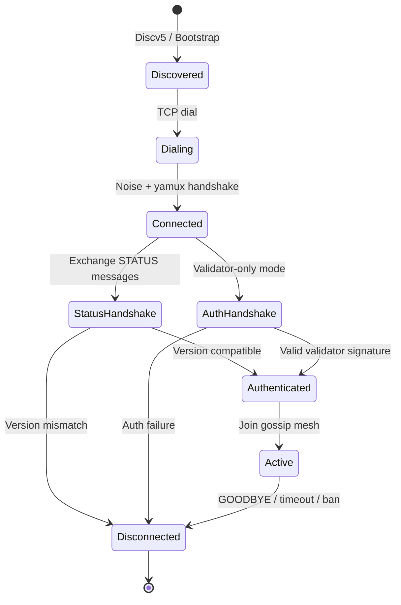

# P2P Network Protocol

## Overview

This specification defines the peer-to-peer network protocol for the Aztec Network. It covers transaction propagation, block proposal dissemination, checkpoint attestation gossip, peer discovery, request-response subprotocols, and message validation. The P2P layer is the primary mechanism through which nodes communicate off-chain: sequencers receive transactions, validators exchange proposals and attestations, and all nodes synchronize state.

A conforming implementation MUST implement the gossip, request-response, and peer management protocols described here to interoperate with other Aztec nodes. The protocol builds on [libp2p](https://libp2p.io/) for transport, [GossipSub v1.1](https://github.com/libp2p/specs/blob/master/pubsub/gossipsub/gossipsub-v1.1.md) for pub/sub messaging, and [Discv5](https://github.com/ethereum/devp2p/blob/master/discv5/discv5.md) for peer discovery.

### Relationship to Other Specs

- **Spec #1 (Protocol Overview)** — Defines the sequencer, validator, and prover roles that participate in the P2P network.
- **Spec #5 (Transactions)** — Defines the `Tx` structure gossipped over the network and the validation rules applied before mempool admission.
- **Spec #6 (Blocks)** — Defines `L2Block`, `BlockHeader`, `CheckpointHeader`, and the block lifecycle stages (`proposed` → `checkpointed` → `proven` → `finalized`).
- **Spec #2 (Constants)** — Defines `MAX_NOTE_HASHES_PER_TX`, `MAX_NULLIFIERS_PER_TX`, serialization lengths, and other constants that bound message sizes.
- **Spec #3 (Cryptographic Primitives)** — Defines the hash functions and signature schemes used in message authentication.

## Requirements

1. **Transaction propagation** — Proven transactions MUST be disseminated to all nodes with low latency so that sequencers can include them in blocks.
2. **Block/Checkpoint proposal dissemination** — Block and checkpoint proposals MUST reach all validators within the slot window so that attestations can be produced.
3. **Checkpoint attestation gossip** — Checkpoint attestations MUST be broadcast to the proposer and all validators so that checkpoints can be submitted to L1 with sufficient signatures.
4. **Equivocation detection** — The network MUST propagate evidence of equivocation (duplicate proposals or attestations at the same slot) to enable slashing.
5. **Peer discovery** — Nodes MUST be able to discover peers without centralized infrastructure, using bootstrap nodes for initial connectivity.
6. **Version compatibility** — Nodes MUST only connect to peers running a compatible protocol version to prevent state corruption.
7. **Denial-of-service resistance** — The protocol MUST rate-limit, score, and disconnect misbehaving peers to maintain network health.
8. **Efficient data retrieval** — Nodes MUST be able to request specific transactions and blocks via targeted request-response protocols, not only via gossip.

## Specification

### Transport Layer

Nodes MUST use the following libp2p transport stack:

| Layer | Protocol |
|---|---|
| Transport | TCP |
| Stream Multiplexing | yamux (preferred), mplex (fallback) |
| Connection Encryption | Noise (secp256k1 ECDH) |
| Pub/Sub | GossipSub v1.1 |
| Discovery | Discv5 (UDP) |

The default listening port is **40400** for both TCP (libp2p) and UDP (Discv5). Nodes MUST support configurable listen and announce addresses.

#### Connection Limits

| Parameter | Value |
|---|---|
| Max peers | 100 |
| Max transport connections | `maxPeers × 2` |
| Max parallel dials | 100 |
| Dial timeout | 30,000 ms |
| Max peer addresses to dial | 5 |
| Connection close threshold | `maxPeers × 3` (stops accepting new connections) |
| Connection listen recovery | `maxPeers × 0.9` (resumes accepting) |
| Pending connection backlog | 5 |

### Node Identity

Each node is identified by a libp2p PeerId derived from a secp256k1 keypair. This keypair is used for Noise handshakes and is distinct from any validator signing key.

#### Ethereum Node Record (ENR)

Nodes advertise their capabilities via Discv5 ENRs containing:

| ENR Key | Value | Description |
|---|---|---|
| `tcp` | Multiaddr | TCP listen address |
| `udp` | Multiaddr | UDP discovery address |
| `aztec` | Compressed version string | Protocol compatibility identifier |
| `ver` | String | Client software version |

The `aztec` ENR value is a compressed version string with the format:

```
00-<l1ChainId>-<l1RollupAddr[2:10]>-<rollupVersion>-<l2ProtocolHash[2:10]>-<l2VkTreeRoot[2:10]>
```

Where each `[2:10]` notation means the first 8 hex characters after the `0x` prefix of the respective value. This encodes: L1 chain ID, L1 rollup contract address prefix, rollup version number, L2 protocol contracts hash prefix, and L2 VK tree root prefix. Two nodes are compatible if and only if their compressed version strings match.

### Peer Discovery

#### Discv5

Nodes MUST implement the Ethereum Discv5 protocol for peer discovery over UDP. Discovery parameters:

| Parameter | Value |
|---|---|
| Lookup timeout | 2,000 ms |
| Request timeout | 2,000 ms |
| Allow unverified sessions | true |

#### Bootstrap Nodes

Nodes MUST support a configurable list of bootstrap node ENRs for initial network connectivity. When connecting to bootstrap nodes:

1. Parse each bootstrap ENR.
2. Optionally validate the `aztec` ENR key for version compatibility.
3. Add the ENR to the local Discv5 routing table.
4. Dial the peer via TCP.

Bootstrap nodes MAY be treated as regular peers after discovery (configurable). Trusted peers are added without version validation.

#### Peer Caching

| Parameter | Value |
|---|---|
| Max cached peers | 100 |
| Cache entry TTL | 5 minutes |
| Max dial attempts per peer | 3 |
| Dial failure ban duration | 5 minutes |

### GossipSub Configuration

Nodes MUST implement GossipSub v1.1 with the following mesh parameters:

| Parameter | Symbol | Value |
|---|---|---|
| Target mesh degree | D | 8 |
| Minimum mesh degree | D_lo | 4 |
| Maximum mesh degree | D_hi | 12 |
| Lazy push degree | D_lazy | 8 |
| Heartbeat interval | | 700 ms |
| Message cache windows | mcacheLength | 6 |
| Gossip cache windows | mcacheGossip | 3 |
| Seen message TTL | seenTTL | 20 minutes |
| Flood publish | | false |
| Signature policy | | StrictNoSign |

The `StrictNoSign` policy means messages are NOT signed at the libp2p level. Authentication relies on application-layer signatures embedded in the messages themselves (e.g., proposer signatures on block proposals).

### Gossip Topics

The protocol defines four gossip topics. Each topic string follows the format:

```
/aztec/<topicType>/v<protocolVersion>
```

| Topic Type | Topic String Example | Description |
|---|---|---|
| `tx` | `/aztec/tx/v0.1.0` | Proven transactions |
| `block_proposal` | `/aztec/block_proposal/v0.1.0` | Block proposals from sequencers |
| `checkpoint_proposal` | `/aztec/checkpoint_proposal/v0.1.0` | Checkpoint proposals grouping blocks for L1 |
| `checkpoint_attestation` | `/aztec/checkpoint_attestation/v0.1.0` | Validator attestations on checkpoints |

#### Topic Subscriptions

All nodes subscribe to all four topics by default. Subscriptions are not auto-determined by node role; the only filter is the `disableTransactions` configuration flag, which causes the node to skip the `tx` topic. 

| Topic | Subscribed |
|---|---|
| `tx` | Unless `disableTransactions` is set |
| `block_proposal` | Always |
| `checkpoint_proposal` | Always |
| `checkpoint_attestation` | Always |

### Message Encoding

#### Compression

All gossip messages MUST be compressed with [Snappy](https://github.com/google/snappy) before transmission and decompressed on receipt. The Snappy frame format uses a little-endian varint preamble encoding the uncompressed size (7 bits per byte, high bit set if more bytes follow, maximum 5 bytes for 32-bit values).

Nodes MUST validate that the decompressed size does not exceed the topic-specific maximum before decompressing.

#### Maximum Message Sizes

| Topic | Max Decompressed Size |
|---|---|
| `tx` | `MAX_TX_SIZE_KB` (512 KB) |
| `block_proposal` | 10 MB |
| `checkpoint_proposal` | 10 MB |
| `checkpoint_attestation` | 5 KB |

Additional protocol-wide constants:

| Constant | Value |
|---|---|
| `MAX_TX_SIZE_KB` | 512 |
| `MAX_L2_BLOCK_SIZE_KB` | 3,072 (3 MB) |
| `MAX_MESSAGE_SIZE_KB` | 10,240 (10 MB) |

#### Message ID Computation

Nodes MUST compute message IDs deterministically for deduplication:

- **Fast message ID** (pre-validation): `xxHash64(message.data)`, encoded as 16-character hex string. Used for rapid deduplication before full validation.
- **Canonical message ID** (post-validation): `SHA-256(topic ‖ message.data)[0:20]` — the first 20 bytes of the SHA-256 hash over the concatenation of the topic string and message data. Displayed as `0x`-prefixed hex.

#### P2P Message Framing

Each gossip message is wrapped in a `P2PMessage` envelope before Snappy compression:

```
Standard mode (production):
  [payload_length: 4 bytes BE] [payload: variable]

```

The `payload` field contains the serialized `Gossipable` object (Tx, BlockProposal, etc.).

### Gossip Message Types

Each gossip message type extends a common `Gossipable` base:

```
abstract Gossipable {
  static p2pTopic: TopicType
  toBuffer(): Buffer
  getSize(): number
  p2pMessageIdentifier(): Buffer32  // Unique ID for deduplication
}
```

#### Transaction (`tx`)

A proven transaction as defined in Spec #5. The `Tx` object contains the private kernel circuit public inputs, chonk proof, contract class log fields, and public function calldata. The message identifier is derived from the `TxHash` (see Spec #5 §Serialization).

#### Block Proposal (`block_proposal`)

Broadcast by the sequencer after assembling a block.

| Field | Type | Description |
|---|---|---|
| `block_header` | `BlockHeader` | Block header (see Spec #6) |
| `index_within_checkpoint` | `uint32` | Block's position within the checkpoint |
| `in_hash` | `Field` | Input hash for blob continuity |
| `archive_root` | `Field` | Post-block archive tree root |
| `tx_hashes` | `TxHash[]` | Ordered list of transaction hashes in the block |
| `signature` | `Signature` | Proposer's signature over the above fields |
| `signed_txs` | `Tx[]` (optional) | Embedded full transactions |

The proposer signs over: `block_header ‖ index_within_checkpoint ‖ in_hash ‖ archive_root ‖ tx_hashes`. The message identifier is derived from the signature.

When `signed_txs` is present, each embedded transaction's hash MUST appear in `tx_hashes`.

#### Checkpoint Proposal (`checkpoint_proposal`)

Broadcast by the proposer to package one or more blocks for L1 submission.

| Field | Type | Description |
|---|---|---|
| `checkpoint_header` | `CheckpointHeader` | Checkpoint header (see Spec #6) |
| `archive` | `Field` | Archive root after checkpoint |
| `signature` | `Signature` | Proposer's signature over header and archive |
| `last_block` | `BlockProposal` (optional) | The final block in the checkpoint |

The proposer signs over: `checkpoint_header ‖ archive`. The message identifier is derived from the signature. When `last_block` is present, it is validated as a standalone `BlockProposal`.

#### Checkpoint Attestation (`checkpoint_attestation`)

Broadcast by committee members to attest to a checkpoint proposal.

| Field | Type | Description |
|---|---|---|
| `payload` | `ConsensusPayload` | The checkpoint data being attested to |
| `signature` | `Signature` | Attester's signature over the payload |
| `proposer_signature` | `Signature` | Original proposer's signature (from the checkpoint proposal) |

The message identifier is derived from the attester's signature.

### Message Deduplication

Each node MUST maintain a per-topic `MessageSeenValidator` — a bounded circular buffer of message IDs:

| Parameter | Value |
|---|---|
| Cache capacity | 100,000 entries |

The cache uses a circular queue backed by a hash set for O(1) lookup. When the cache is full, the oldest entry is evicted. A message is considered duplicate if its message ID is already present.

This application-layer deduplication operates in addition to GossipSub's built-in `seenTTL` cache and provides longer history to prevent cross-network echo of transactions.

### Request-Response Subprotocols

In addition to gossip, nodes MUST support direct request-response communication for targeted data retrieval. Each subprotocol is identified by a protocol string:

| Subprotocol | Protocol ID | Request Type | Response Type |
|---|---|---|---|
| PING | `/aztec/req/ping/1.0.0` | Empty | `"pong"` (ASCII) |
| STATUS | `/aztec/req/status/1.0.0` | `StatusMessage` | `StatusMessage` |
| GOODBYE | `/aztec/req/goodbye/1.0.0` | `GoodbyeReason` (1 byte) | Empty |
| TX | `/aztec/req/tx/1.0.0` | `TxHashArray` | `TxArray` |
| AUTH | `/aztec/req/auth/1.0.0` | `AuthRequest` | `AuthResponse` |
| BLOCK_TXS | `/aztec/req/block_txs/1.0.0` | `BlockTxsRequest` | `BlockTxsResponse` |

#### Request-Response Wire Format

Each response is framed as:

```
[status: 1 byte] [compressed_payload: variable]
```

Where `status` is a `ReqRespStatus` code and `compressed_payload` is the Snappy-compressed response body.

#### Status Codes

| Code | Name | Description |
|---|---|---|
| 0 | `SUCCESS` | Request processed successfully |
| 1 | `RATE_LIMIT_EXCEEDED` | Peer has exceeded rate limits |
| 2 | `BADLY_FORMED_REQUEST` | Request could not be deserialized |
| 3 | `INTERNAL_ERROR` | Server-side processing error |
| 4 | `NOT_FOUND` | Requested resource does not exist |
| 126 | `FAILURE` | Generic failure |
| 127 | `UNKNOWN` | Unknown error |

#### Timeouts

| Parameter | Default |
|---|---|
| Overall request timeout | 10,000 ms |
| Individual request timeout | 10,000 ms |
| Dial timeout | 5,000 ms |

### Subprotocol Details

#### PING

A simple keepalive. The request body is empty. The responder MUST return the ASCII bytes `pong`.

#### STATUS

Exchanged immediately after a new peer connection is established. Both sides send their status and validate the peer's response.

| Field | Type | Description |
|---|---|---|
| `compressed_components_version` | `string` (max 64 bytes) | Version string (same format as ENR `aztec` key) |
| `latest_block_number` | `uint32` | Peer's latest known block number |
| `latest_block_hash` | `string` (max 128 bytes) | Hash of the latest block |
| `finalized_block_number` | `uint32` | Peer's latest finalized block number |

Serialization order: `compressed_components_version`, `latest_block_number`, `latest_block_hash`, `finalized_block_number`. Strings are serialized with a 4-byte big-endian length prefix.

A node MUST disconnect a peer whose `compressed_components_version` does not match its own.

#### GOODBYE

Sent before intentionally disconnecting from a peer. The payload is a single byte encoding the reason:

| Code | Name | Description |
|---|---|---|
| 0x01 | `SHUTDOWN` | Node is shutting down |
| 0x02 | `MAX_PEERS` | Maximum peer count reached |
| 0x03 | `LOW_SCORE` | Peer has low reputation score |
| 0x04 | `BANNED` | Peer is banned |
| 0x05 | `WRONG_NETWORK` | Incompatible network or fork |
| 0x06 | `UNKNOWN` | Unspecified reason |

#### TX

Request transactions by hash. The request contains a `TxHashArray` (length-prefixed vector of 32-byte `TxHash` values). The response contains a `TxArray` (length-prefixed vector of serialized `Tx` objects). Partial responses are permitted — the responder returns only the transactions it has in its mempool.

Requests SHOULD be chunked into batches (default: 1 transaction per request) to bound response sizes.

#### AUTH

Used for validator authentication when `allowOnlyValidators` mode is enabled. The protocol authenticates that a peer controls a registered validator key.

**AuthRequest:**

| Field | Type | Description |
|---|---|---|
| `status` | `StatusMessage` | Requester's status |
| `challenge` | `Field` | Random challenge nonce |

**AuthResponse:**

| Field | Type | Description |
|---|---|---|
| `status` | `StatusMessage` | Responder's status |
| `signature` | `Signature` | Signature over the challenge |

The challenge is signed using the domain separator `"Aztec Validator Challenge:"` concatenated with the challenge field's string representation. The verifier recovers the signer's Ethereum address and checks membership in the current validator set.

| Parameter | Value |
|---|---|
| Max failed auth attempts before ban | 3 |
| Failed auth ban duration | 1 hour |

#### BLOCK_TXS

An optimized protocol for requesting specific transactions from a block proposal, using a bitvector to indicate which transactions are needed.

**BlockTxsRequest:**

| Field | Type | Description |
|---|---|---|
| `archive_root` | `Field` | Post-block archive root (identifies the proposal) |
| `tx_hashes` | `TxHashArray` | Full transaction hashes (for peers that need them) |
| `tx_indices` | `BitVector` | Bitvector where bit `i` = 1 means "send transaction at index `i`" |

**BlockTxsResponse:**

| Field | Type | Description |
|---|---|---|
| `archive_root` | `Field` | Echoed archive root |
| `txs` | `TxArray` | Requested transactions that are available |
| `tx_indices` | `BitVector` | Bitvector where bit `i` = 1 means "transaction `i` is included in response" |

**BitVector serialization:**

```
[length: 4 bytes BE (total number of bits)] [data: ceil(length/8) bytes]
```

Bit at index `i` is stored at byte `floor(i/8)`, bit position `i % 8`. The `length` field MUST NOT exceed `MAX_TXS_PER_BLOCK`.

### Peer Connection Lifecycle



#### Connection Sequence

1. **Discovery**: Node discovers peer via Discv5 or bootstrap ENR list.
2. **Dial**: Establish TCP connection with Noise encryption and yamux multiplexing.
3. **Handshake**: One of two paths depending on configuration:
   - **Standard mode**: Exchange `STATUS` messages. Disconnect if versions are incompatible.
   - **Validator-only mode**: If the peer is not in the trusted/private/preferred set, perform `AUTH` handshake instead. Trusted peers receive a `STATUS` handshake.
4. **Mesh join**: Subscribe peer to relevant gossip topics.
5. **Active**: Exchange gossip messages and respond to request-response queries.
6. **Disconnection**: Send `GOODBYE` with reason code before closing the connection.

#### Protected Peer Classes

| Class | Description | Behavior |
|---|---|---|
| Trusted | Manually configured whitelist | Never disconnected; always status-handshake; no version check on discovery |
| Private | Subset of trusted | Same as trusted; not advertised for discovery |
| Preferred | Validator-selected connections | Priority connections; status-handshake bypasses auth |

### Rate Limiting

Request-response subprotocols are rate-limited using a GCRA (Generic Cell Rate Algorithm) token bucket. Each subprotocol has per-peer and global limits:

| Subprotocol | Per-Peer Limit | Global Limit |
|---|---|---|
| PING | 5 / second | 10 / second |
| STATUS | 5 / second | 10 / second |
| AUTH | 5 / second | 10 / second |
| TX | 10 / second | 200 / second |
| GOODBYE | 5 / second | 10 / second |
| BLOCK_TXS | 10 / second | 200 / second |

When a peer exceeds its per-peer rate limit, the node MUST:
1. Return `RATE_LIMIT_EXCEEDED` status on the response.
2. Apply a `HighToleranceError` penalty to the peer's score.

Inactive peer rate-limiter state is cleaned up after 10 minutes of inactivity.

## Data Structures

### StatusMessage

```
StatusMessage {
  compressed_components_version: string  // max 64 bytes, length-prefixed
  latest_block_number:           uint32  // 4 bytes BE
  latest_block_hash:             string  // max 128 bytes, length-prefixed
  finalized_block_number:        uint32  // 4 bytes BE
}
```

### AuthRequest

```
AuthRequest {
  status:    StatusMessage
  challenge: Field          // 32 bytes
}
```

### AuthResponse

```
AuthResponse {
  status:    StatusMessage
  signature: Signature      // secp256k1 ECDSA signature
}
```

### BlockTxsRequest

```
BlockTxsRequest {
  archive_root: Field        // 32 bytes
  tx_hashes:    TxHashArray  // length-prefixed vector of 32-byte hashes
  tx_indices:   BitVector    // 4-byte length + ceil(length/8) bytes
}
```

### BlockTxsResponse

```
BlockTxsResponse {
  archive_root: Field        // 32 bytes
  txs:          TxArray      // length-prefixed vector of serialized Tx
  tx_indices:   BitVector    // 4-byte length + ceil(length/8) bytes
}
```

### BitVector

```
BitVector {
  length: uint32           // total number of bits; MUST NOT exceed MAX_TXS_PER_BLOCK
  data:   bytes            // ceil(length/8) bytes; bit i at byte floor(i/8), position i%8
}
```

### Vector Serialization

All variable-length arrays (`TxHashArray`, `TxArray`) use a common vector encoding:

```
[count: 4 bytes BE] [element_0] [element_1] ... [element_{count-1}]
```

Each element is serialized via its own `toBuffer()` method.

## Validation Rules

### Message Pre-Validation (All Topics)

Before topic-specific validation, nodes MUST:

1. **Decompress**: Snappy-decompress the message. Reject if decompression fails or decompressed size exceeds the topic maximum.
2. **Deserialize envelope**: Parse the `P2PMessage` framing. On failure, penalize the sender with `LowToleranceError` and reject.
3. **Deduplicate**: Check the message ID against the `MessageSeenValidator`. If already seen, return `Ignore` (do not re-propagate, but do not penalize).
4. **Deserialize payload**: Parse the topic-specific `Gossipable` object. On failure, penalize with `LowToleranceError` and reject.

### Transaction Validation (`tx`)

Transaction gossip validation runs in two stages with a pool pre-check between them. Stage 1 contains fast checks; the pool pre-check skips proof verification when the pool would not accept the transaction (e.g., duplicate, capacity reached); Stage 2 performs expensive proof verification. If any validator fails, the transaction is rejected and the peer is penalized at the listed severity.

The Penalty column refers to the `PeerErrorSeverity` enum (see [Penalty Severities](#penalty-severities)). The order in which Stage 1 validators run is not part of the protocol — only the first observed failure determines the penalty.

| Stage | Check | Penalty | Description |
|---|---|---|---|
| 1 | Transactions permitted | `MidToleranceError` | Node is currently accepting transactions |
| 1 | Timestamp validity | `HighToleranceError` | Transaction has not expired against the next slot timestamp |
| 1 | Size validity | `MidToleranceError` | Transaction size ≤ `MAX_TX_SIZE_KB × 1024` bytes |
| 1 | Metadata validity | `MidToleranceError` | `l1ChainId`, `rollupVersion`, protocol contracts hash, VK tree root match local values |
| 1 | Phases validity | `MidToleranceError` | Setup-phase public calls are on the allow list |
| 1 | Block header validity | `HighToleranceError` | Anchor block hash exists in the archive tree |
| 1 | Double-spend check | dynamic† | Nullifiers do not exist in the committed nullifier tree |
| 1 | Gas validity | `MidToleranceError` | Gas limits within bounds; max fee per gas ≥ block fee; fee payer balance sufficient |
| 1 | Data validity | `MidToleranceError` | Transaction structure and field constraints |
| 1 | Contract instance validity | `MidToleranceError` | Embedded contract instance deployment is well-formed |
| Pool pre-check | `canAddPendingTx` | — | If the pool would not accept the tx (duplicate, capacity, etc.), the message is ignored without penalty and Stage 2 is skipped |
| 2 | Proof validity | `LowToleranceError` | Client proof verifies against the VK |

† **Double-spend severity is determined dynamically.** When the double-spend check fails, the caller examines how recently the conflicting nullifier was published. If the nullifier was committed within the most recent `doubleSpendSeverePeerPenaltyWindow` (default: 30) blocks, the peer is penalized with `HighToleranceError` — the peer may not yet have processed the block that contains the nullifier. If the nullifier is older than that window, the peer is penalized with `LowToleranceError`. To avoid unknowingly propagating invalid transactions, nodes MUST NOT join the gossip mesh until they are fully synchronized with the chain tip.

After all checks pass, the transaction is added to the mempool. Validation results:

- **Accept**: Transaction is valid and new; propagate to mesh.
- **Ignore**: Transaction is already in the mempool or is a duplicate; do not propagate.
- **Reject**: Transaction is invalid; penalize sender and do not propagate.

For request-response TX validation (responding to `TX` requests), a reduced set of checks applies: metadata, size, data, and proof.

### Block Proposal Validation (`block_proposal`)

| # | Check | Penalty | Description |
|---|---|---|---|
| 1 | Slot check | `HighToleranceError` | Proposal slot is current or next slot, or within clock tolerance of previous slot |
| 2 | Signature validity | `MidToleranceError` | Proposer signature verifies |
| 3 | Expected proposer | `MidToleranceError` | Proposer matches the expected proposer for the slot from the epoch cache |
| 4 | Transactions permitted | `MidToleranceError` | If node is not accepting txs, proposal MUST contain no tx hashes |
| 5 | Max txs per block | `MidToleranceError` | `tx_hashes` length ≤ configured `maxTxsPerBlock` |
| 6 | Embedded tx hash consistency | `MidToleranceError` | Every embedded transaction's hash appears in `tx_hashes` |
| 7 | Tx hash verification | `LowToleranceError` | Each embedded transaction's computed hash matches its declared hash |

#### Equivocation Detection

When a second block proposal is received for the same slot and index-within-checkpoint but with a different archive root, this constitutes **equivocation**. The node MUST:

1. Accept and re-propagate the equivocating proposal (to distribute evidence).
2. NOT invoke the block-received callback (do not treat the equivocating block as canonical).
3. Record the equivocation for potential slashing evidence.

### Checkpoint Proposal Validation (`checkpoint_proposal`)

Checkpoint proposals follow the same validation rules as block proposals (slot check, signature, proposer match). Additionally:

- If a `last_block` is present, it MUST pass block proposal validation independently.
- Equivocation detection applies at the checkpoint level.

### Checkpoint Attestation Validation (`checkpoint_attestation`)

| # | Check | Penalty | Description |
|---|---|---|---|
| 1 | Slot check | `HighToleranceError` | Attestation slot is current or next slot, or within clock tolerance |
| 2 | Attester signature | `LowToleranceError` | Attester's signature over the payload verifies |
| 3 | Committee membership | `HighToleranceError` | Attester is a member of the committee for the attested slot |
| 4 | Proposer signature | `LowToleranceError` | The embedded proposer signature verifies |
| 5 | Proposer match | `HighToleranceError` | Proposer matches expected proposer for the slot |

#### Attestation Equivocation Detection

When a validator produces attestations for different proposals in the same slot, the node MUST:

1. Accept and propagate both attestations.
2. Trigger a duplicate-attestation callback for slashing evidence.

### Clock Tolerance

For slot-based validation (proposals and attestations), messages referencing the **previous** slot are accepted if the current slot started less than `MAXIMUM_GOSSIP_CLOCK_DISPARITY_MS` (500 ms) ago. This accommodates minor clock skew between nodes.

```
is_within_clock_tolerance(message_slot, current_slot):
  if current_slot == 0: return false
  if message_slot != current_slot - 1: return false
  elapsed_ms = now() - slot_start_time(current_slot)
  return elapsed_ms < 500
```

### GossipSub Validation Results

After validation, nodes report one of three results to GossipSub:

| Result | GossipSub Action | When |
|---|---|---|
| `Accept` | Propagate to mesh peers | Message is valid and new |
| `Ignore` | Do not propagate; no penalty | Duplicate or already processed |
| `Reject` | Do not propagate; apply P4 penalty | Invalid message |

## Peer Scoring

Peer scoring operates at two layers that are mathematically aligned to produce consistent behavior.

### Application-Layer Scoring

Each peer maintains a floating-point score, starting at 0. Penalties are applied when a peer sends invalid messages or violates protocol rules.

#### Penalty Severities

The `PeerErrorSeverity` enum names the system's *tolerance* for an error class — not the harshness of the punishment. `HighToleranceError` is the mildest penalty (the system tolerates many such failures); `LowToleranceError` is the harshest (very few are tolerated before a peer is banned).

| Severity | Penalty Points | Approximate ban after | Example Triggers |
|---|---|---|---|
| `LowToleranceError` | 50 | ~2 occurrences | Deserialization failure, invalid tx hash, invalid signature |
| `MidToleranceError` | 10 | ~10 occurrences | Invalid proposer, timestamp violation, failed proof |
| `HighToleranceError` | 2 | ~50 occurrences | Connection reset, recent double-spend, rate limit violation |

#### Score Decay

Scores decay exponentially toward 0:

```
score(t) = score(t - Δt) × 0.9^(Δt / 60s)
```

Decay is applied once per heartbeat (every 30 seconds).

#### Score Thresholds

| Threshold | Score | Action |
|---|---|---|
| Disconnect | −50 | Disconnect from peer |
| Ban | −100 | Ban peer; refuse future connections |

### GossipSub-Layer Scoring

Application scores are multiplied by `APP_SPECIFIC_WEIGHT = 10` and fed into GossipSub's peer scoring system. This produces the following aligned thresholds:

| GossipSub Threshold | Value | Aligned App Score | Effect |
|---|---|---|---|
| `gossipThreshold` | −500 | −50 (disconnect) | No gossip to peer |
| `publishThreshold` | −1,000 | −100 (ban) | No self-published messages to peer |
| `graylistThreshold` | −2,000 | — | Ignore all RPCs from peer |
| `acceptPXThreshold` | 100 | +10 | Peer can offer peer exchange |
| `opportunisticGraftThreshold` | 5 | +0.5 | Peer eligible for opportunistic grafting |

### Topic Scoring Parameters

GossipSub topic scores use four parameters (P1–P4) per topic:

#### P1: Time in Mesh

Rewards peers for stable mesh participation.

| Parameter | Value |
|---|---|
| Max score | 8 |
| Quantum | Slot duration |
| Cap time | 3,600 seconds (1 hour) |

```
P1 = min(time_in_mesh / quantum, cap) × weight
weight = MAX_P1_SCORE / cap
```

#### P2: First Message Deliveries

Rewards peers that deliver messages first.

| Parameter | Value |
|---|---|
| Max score | 25 |
| Decay window | 2 slots |

```
P2 = min(first_deliveries, cap) × weight
weight = MAX_P2_SCORE / cap
decay = 0.01^(1 / heartbeats_in_window)
```

#### P3: Mesh Message Delivery Deficit

Penalizes peers that fail to deliver expected messages while in the mesh. **Disabled for `tx` topic** because transaction rates are unpredictable.

| Parameter | Value |
|---|---|
| Max penalty per topic | −34 |
| Number of P3-enabled topics | 3 |
| Total max P3 penalty | −102 |
| Threshold | 30% of convergence value |
| Activation window | 5× decay window (grace period for new mesh members) |
| Message delivery window | 5,000 ms |

```
P3 = max(0, threshold - deliveries)² × weight
weight = MAX_P3_PENALTY / threshold²
```

**Expected messages per slot:**

| Topic | Expected Messages |
|---|---|
| `tx` | Unpredictable (P3 disabled) |
| `block_proposal` | `blocks_per_slot − 1` |
| `checkpoint_proposal` | 1 |
| `checkpoint_attestation` | Committee size |

#### P4: Invalid Message Deliveries

Penalizes peers that deliver invalid messages.

| Parameter | Value |
|---|---|
| Weight | −20 |
| Decay window | 4 slots |

```
P4 = invalid_deliveries × weight
decay = 0.01^(1 / heartbeats_in_window)
```

#### Decay Computation

All decay parameters follow:

```
decay = 0.01^(1 / (heartbeats_per_slot × decay_window_slots))
```

Where `heartbeats_per_slot = slot_duration_ms / 700`. This ensures the counter decays to 1% of its value over the specified window.

## Batch Transaction Requesting

When a node receives a block proposal containing transaction hashes it does not have locally, it MUST request the missing transactions from peers. The batch transaction requester uses a three-tier peer classification:

### Peer Tiers

1. **Pinned Peer**: The peer that sent the block proposal. Queried first with highest priority, expected to have all transactions.
2. **Dumb Peers**: Peers whose transaction inventory is unknown. Requests MUST include full transaction hashes (not just indices).
3. **Smart Peers**: Peers that have demonstrated they hold specific transactions (by responding with a `tx_indices` bitvector). Only requested for transactions they have proven to hold.

### Algorithm

```
function request_missing_txs(proposal, missing_hashes, pinned_peer, deadline):
  // Phase 1: Query pinned peer
  request_from_pinned(pinned_peer, missing_hashes)

  // Phase 2: Query dumb peers in parallel
  for each dumb_peer in random_sample(connected_peers):
    response = send_block_txs_request(dumb_peer, missing_hashes)
    if response contains tx_indices with missing txs:
      promote dumb_peer to smart_peer

  // Phase 3: Query smart peers for remaining missing txs
  for each smart_peer:
    request only txs the smart_peer has proven to hold

  // Retry until all txs found, deadline reached, or no peers available
```

Workers run in parallel: multiple dumb workers and multiple smart workers operate concurrently. Smart workers block until at least one dumb peer is promoted.

## Security Considerations

### Sybil Resistance

The protocol relies on GossipSub scoring and Discv5 version checking to limit the impact of Sybil attacks. In validator-only mode, the AUTH handshake provides stronger Sybil resistance by requiring proof of validator registration.

### Eclipse Attacks

Nodes mitigate eclipse attacks through:
- Trusted/private peer configurations that maintain known-good connections.
- Discv5's Kademlia-based routing which distributes peer knowledge.
- Bootstrap nodes providing initial connectivity from known infrastructure.

### Amplification Attacks

- Rate limiting on all request-response subprotocols bounds the amplification factor.
- Response sizes are bounded by request-derived calculations (e.g., number of requested tx hashes × `MAX_TX_SIZE_KB`).
- Per-peer and global rate limits prevent any single peer from consuming disproportionate resources.

### Equivocation and Slashing

The P2P layer detects and propagates equivocation evidence (conflicting proposals or attestations at the same slot). This evidence can be used by the validator network for slashing. The network intentionally re-broadcasts equivocating messages to ensure evidence reaches all validators.

### Clock Disparity

The 500 ms clock tolerance window is deliberately narrow to limit the window for timing attacks while accommodating reasonable NTP drift. Nodes SHOULD maintain accurate clocks via NTP.

## References

- [libp2p Specification](https://github.com/libp2p/specs)
- [GossipSub v1.1](https://github.com/libp2p/specs/blob/master/pubsub/gossipsub/gossipsub-v1.1.md)
- [Discv5 Protocol](https://github.com/ethereum/devp2p/blob/master/discv5/discv5.md)
- [Snappy Compression](https://github.com/google/snappy)
- [GCRA Rate Limiting](https://en.wikipedia.org/wiki/Generic_cell_rate_algorithm)
- Spec #1 — Protocol Overview & Architecture
- Spec #2 — Constants
- Spec #3 — Cryptographic Primitives
- Spec #5 — Transaction Format & Lifecycle
- Spec #6 — Block Format & Header
- Spec #10 — L1 Rollup Contract & State Transition
