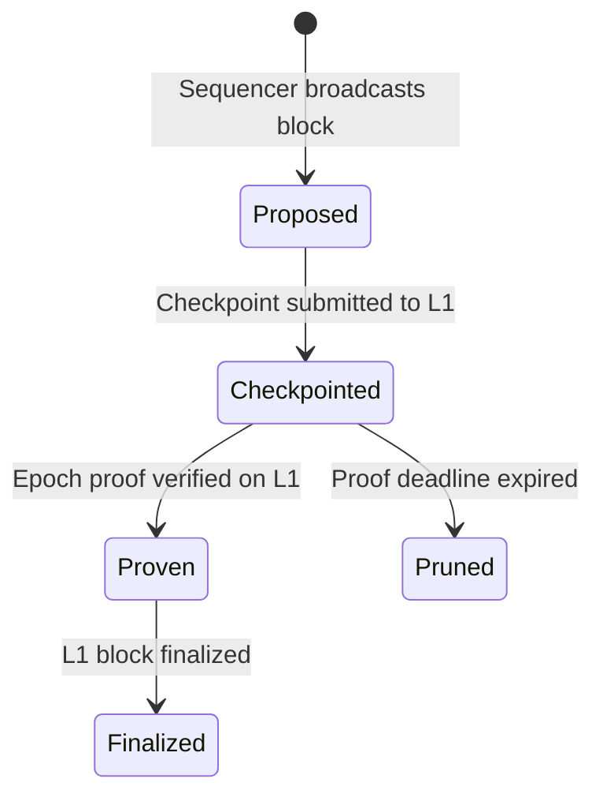
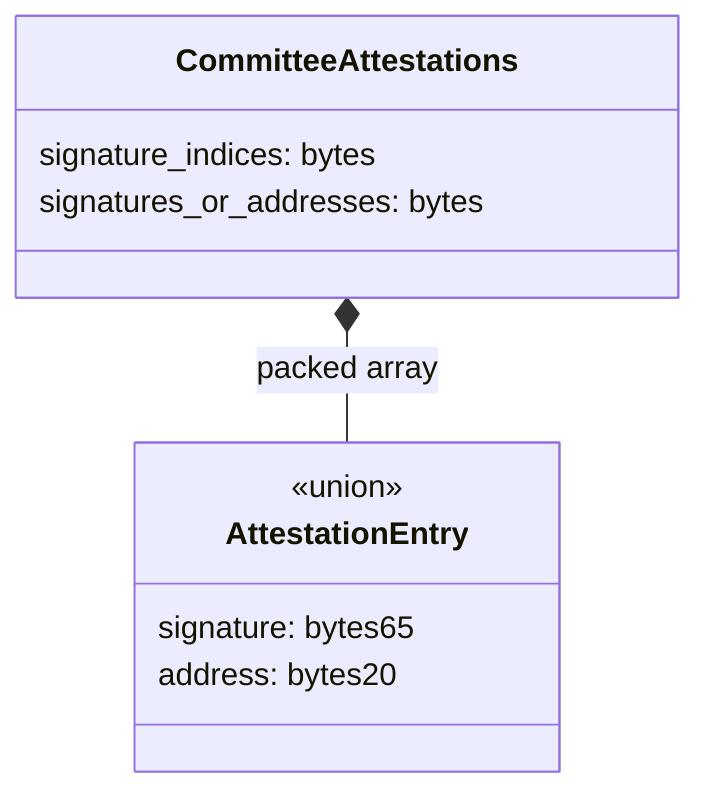

# Block Production & Consensus

## Overview

This specification defines how L2 blocks are proposed, attested, and finalized in the Aztec protocol. It covers the validator lifecycle (staking, committee formation, proposer selection), the block and checkpoint proposal flow, attestation collection and verification, timing constraints, slashing conditions, the escape hatch censorship-resistance mechanism, and the relationship between L2 consensus and L1 finality.

Aztec uses a **leader-based, single-proposer-per-slot** consensus protocol with **checkpoint-level attestations**. A deterministically selected proposer builds one or more blocks within a slot, packages them into a checkpoint, collects attestations from the validator committee, and submits the checkpoint to L1. An epoch-level validity proof then advances the chain from "pending" to "proven" status.

**Cross-references:**

- Spec #1 (Protocol Overview) — introduces the sequencer, validator, and prover roles and the block/checkpoint/epoch hierarchy.
- Spec #2 (Constants) — defines `MAX_CHECKPOINTS_PER_EPOCH`, `OUT_HASH_TREE_HEIGHT`, and other structural constants.
- Spec #6 (Block Format & Header) — defines `BlockHeader`, `CheckpointHeader`, `GlobalVariables`, block assembly, and the block lifecycle stages.
- Spec #9 (Rollup Circuits) — defines the proof hierarchy (transaction → block → checkpoint → epoch).
- Spec #10 (L1 Rollup Contract) — defines the `propose()` and `submitEpochRootProof()` functions, chain tips, pruning, and invalidation.
- Spec #15 (Gas & Fees) — defines mana pricing, fee distribution, and reward mechanisms.
- Spec #17 (P2P Network) — defines gossip topics, message formats, and P2P validation rules for proposals and attestations.

## Requirements

### R1: Deterministic Proposer Selection

The protocol MUST select exactly one proposer per slot using a deterministic algorithm seeded by L1 randomness. Given the same epoch, slot, and RANDAO seed, all implementations MUST compute the same proposer.

**Rationale:** Deterministic selection prevents disputes over who may propose and enables permissionless verification by any node or the L1 contract.

### R2: Committee-Based Attestation

Checkpoints MUST be attested by more than two-thirds of the validator committee before the epoch proof can be accepted on L1. The committee MUST be deterministically sampled from the active validator set using L1 randomness with sufficient lag to prevent manipulation.

**Rationale:** A supermajority attestation threshold provides Byzantine fault tolerance — the chain remains safe as long as fewer than one-third of committee members are adversarial.

### R3: Stake-Based Participation

Validators MUST deposit a minimum stake to participate in consensus. The protocol MUST support adding validators through a queued activation process and removing them through a delayed exit process.

**Rationale:** Proof-of-stake ensures validators have economic incentive to behave honestly. Queued activation prevents validator set churn, and delayed exits ensure slashing can be applied for recently observed misbehavior.

### R4: Slashing for Misbehavior

The protocol MUST support slashing validators who produce invalid blocks, equivocate (produce conflicting proposals or attestations for the same slot), or fail to fulfill escape hatch duties. Slashing MUST be implemented through an on-chain voting mechanism with a quorum requirement.

**Rationale:** Without credible punishment, rational validators could profit from misbehavior (e.g., censoring transactions, double-proposing). Quorum-based voting prevents a single entity from maliciously slashing honest validators.

### R5: Censorship Resistance via Escape Hatch

The protocol MUST provide an alternative block production mechanism (escape hatch) that activates periodically and does not require committee attestations. This ensures chain liveness even when the validator committee is unavailable or colluding to censor transactions.

**Rationale:** If the committee can halt the chain indefinitely, censorship resistance is lost. The escape hatch provides a guaranteed liveness backstop.

### R6: Timing Determinism

Slot timestamps MUST be deterministically derived from the genesis time and slot number. Epoch boundaries MUST be deterministic functions of slot numbers. All implementations MUST agree on these values.

**Rationale:** Consistent timing is required for proposer selection, attestation validity, and L1 verification. Clock drift between nodes is handled by a bounded tolerance window.

### R7: Equivocation Prevention

Validators MUST NOT sign multiple conflicting proposals or attestations for the same slot. The protocol MUST detect equivocation, propagate evidence, and trigger slashing.

**Rationale:** Equivocation can cause chain splits or finality violations. Detection and punishment are essential for consensus safety.

## Specification

### Time Model

Time is divided into **slots** and **epochs**, deterministically derived from the L1 genesis timestamp (see also Spec #10).

```
slot_for_timestamp(ts) = (ts - genesis_time) / slot_duration
epoch_for_slot(s)      = s / epoch_duration
slot_timestamp(s)      = genesis_time + s * slot_duration
```

| Parameter | Description | Configured At |
|---|---|---|
| `genesis_time` | L1 timestamp at rollup deployment | Constructor |
| `slot_duration` | Duration of one slot in seconds | Constructor |
| `epoch_duration` | Number of slots per epoch | Constructor |
| `proof_submission_epochs` | Epochs after an epoch ends during which proofs are accepted | Constructor |

All blocks within a checkpoint share the same slot number and timestamp. Epoch boundaries fall at slot numbers that are multiples of `epoch_duration`.

### Validator Lifecycle

#### Staking and Activation

Validators join the protocol by depositing stake and registering their attester keys:

```
function deposit(attester, withdrawer, public_key_g1, public_key_g2, proof_of_possession, move_with_latest_rollup):
    require balance >= ACTIVATION_THRESHOLD
    verify_proof_of_possession(public_key_g1, public_key_g2, proof_of_possession)
    add_to_entry_queue(attester, withdrawer, public_key_g1)
```

| Parameter | Description |
|---|---|
| `attester` | Ethereum address used for signing attestations and proposals |
| `withdrawer` | Ethereum address authorized to withdraw stake |
| `public_key_g1` | BLS12-381 public key in G1 (for future aggregate signature support) |
| `public_key_g2` | BLS12-381 public key in G2 |
| `proof_of_possession` | BLS signature proving the depositor controls the private key |
| `move_with_latest_rollup` | If true, the validator's stake auto-migrates to new rollup versions |

The `ACTIVATION_THRESHOLD` is the minimum stake required to enter the validator set. Validators are NOT immediately active — they enter a queue and are activated in batches.

#### Entry Queue Processing

The entry queue uses a three-phase flush model to control validator set growth:

| Phase | Condition | Flush Size |
|---|---|---|
| Bootstrap | `active_count == 0 AND queue_size < bootstrap_validator_set_size` | 0 (queue accumulates) |
| Growth | `active_count < bootstrap_validator_set_size` | `bootstrap_flush_size` (large batch) |
| Normal | `active_count >= bootstrap_validator_set_size` | `max(active_count / normal_flush_size_quotient, normal_flush_size_min)` |

The bootstrap phase ensures a minimum number of validators are activated together for initial decentralization. Normal-phase growth is conservative to prevent rapid committee changes.

#### Voluntary Exit

Validators may initiate a voluntary exit:

```
function initiate_exit(attester):
    require caller == withdrawer_of(attester)
    remove_from_active_set(attester)
    create_exit(attester, balance, exit_delay)
```

After the `exit_delay` has elapsed, the validator (or their withdrawer) may withdraw their stake. Exits that have been slashed below the ejection threshold are automatically processed.

#### Forced Ejection

Validators whose effective balance falls below the `ejection_threshold` (due to slashing) are forcibly removed from the active set.

### Committee Formation

At the start of each epoch, a committee is sampled from the active validator set. Committee formation occurs on L1 during the first checkpoint proposal of the epoch via `setupEpoch`.

#### Sampling Algorithm

```
function setup_epoch(epoch):
    seed = get_sample_seed(epoch)
    committee = sample_validators(epoch, seed)
    committee_commitment = keccak256(encode(committee))
    store(epoch, committee_commitment)
    checkpoint_randao(epoch)  // Save randao for future epochs
```

The sampling uses two lag parameters to prevent manipulation:

| Parameter | Description |
|---|---|
| `lag_in_epochs_for_validator_set` | How many epochs in the past to snapshot the active validator set |
| `lag_in_epochs_for_randao` | How many epochs in the past to sample the RANDAO seed |

**Constraint:** `lag_in_epochs_for_validator_set > lag_in_epochs_for_randao`. This ensures the validator set is frozen before the randomness that selects from it is known, preventing an adversary from manipulating set membership after seeing the seed.

The seed is derived from L1 RANDAO (`prevrandao`):

```
sample_seed(epoch) = stored_randao[epoch - lag_in_epochs_for_randao]
```

Where `stored_randao[e]` is the `prevrandao` value checkpointed during epoch `e`.

#### Committee Index Selection

Given a `target_committee_size` and total validator set size, the committee indices are selected using `SampleLib.computeCommittee`:

```
function compute_committee(target_size, set_size, seed) -> indices[]:
    require set_size >= target_size
    // Deterministic pseudorandom sampling without replacement
    // using successive keccak256 hashes of the seed
```

The committee is stored on-chain as a commitment (`keccak256` of the encoded address array). The full committee is reconstructed during proposal verification from the attestation data.

#### Committee Properties

- **Fixed size**: `target_committee_size` validators per epoch.
- **Stable**: The committee does not change within an epoch.
- **Deterministic**: Given the same validator set snapshot and RANDAO seed, all implementations produce the same committee.
- **Committed on-chain**: The committee commitment is stored and verified during proposal and proof submission.

### Proposer Selection

Within each slot, exactly one committee member is designated as the proposer:

```
function compute_proposer_index(epoch, slot, seed, committee_size) -> index:
    return uint256(keccak256(encode(epoch, slot, seed))) % committee_size
```

The proposer for a slot is `committee[compute_proposer_index(epoch, slot, seed, committee_size)]`.

This selection is:
- **Deterministic**: All nodes compute the same proposer for a given slot.
- **Pseudorandom**: The proposer rotates unpredictably across slots (from the perspective of an adversary who cannot predict future RANDAO values).
- **Verifiable on L1**: The rollup contract recomputes the proposer index during `propose()` and verifies the proposer's signature.

### Block Proposal Flow

The proposer for a slot assembles and broadcasts blocks, then packages them into a checkpoint for L1 submission.

#### Step 1: Block Assembly

The proposer selects transactions from the mempool and builds blocks as specified in Spec #6 (Block Assembly). Each block within a checkpoint is assigned a sequential `index_within_checkpoint` starting from 0.

All blocks within a checkpoint share the same `GlobalVariables` values (except `block_number`, which increments sequentially):
- `slot_number`, `timestamp`, `coinbase`, `fee_recipient`, `gas_fees` are constant across the checkpoint.
- `chain_id` and `version` match the current protocol configuration.

#### Step 2: Block Proposal Broadcast

For each block, the proposer creates a `BlockProposal` and broadcasts it on the `block_proposal` gossip topic (see Spec #17):

```
function create_block_proposal(header, index_within_checkpoint, in_hash, archive, txs):
    payload = encode(header, index_within_checkpoint, in_hash, archive, tx_hashes(txs))
    signature = sign(proposer_key, payload)
    return BlockProposal(header, index_within_checkpoint, in_hash, archive, tx_hashes, signature)
```

The proposer MUST NOT create multiple block proposals for the same `(slot, index_within_checkpoint)` position. Doing so constitutes equivocation (see Slashing).

#### Step 3: Checkpoint Proposal Broadcast

After assembling all blocks for the slot, the proposer creates a `CheckpointProposal` and broadcasts it on the `checkpoint_proposal` gossip topic:

```
function create_checkpoint_proposal(checkpoint_header, archive):
    payload = encode(checkpoint_header, archive)
    signature = sign(proposer_key, payload)
    return CheckpointProposal(checkpoint_header, archive, signature, last_block?)
```

The checkpoint proposal MAY include the last block as an embedded `BlockProposal` to reduce latency for validators who have not yet received all blocks.

#### Step 4: Attestation Collection

Committee members validate the checkpoint proposal and, if valid, broadcast `CheckpointAttestation` messages (see Attestation Flow below). The proposer collects attestations from the gossip network.

#### Step 5: L1 Submission

The proposer submits the checkpoint to L1 via the `propose()` function on the rollup contract (see Spec #10). The submission includes:
- The checkpoint header and archive root.
- Packed committee attestations.
- Blob commitment data for data availability.
- A fee oracle input for mana pricing.

### Attestation Flow

Attestations are how committee members express agreement with a checkpoint proposal. Attestations are collected at the checkpoint level — validators do NOT attest to individual block proposals.

#### Attestation Decision

When a committee member receives a `CheckpointProposal`, it evaluates whether to attest:

```
function should_attest(proposal) -> bool:
    // Gate 1: Escape hatch must not be active
    if is_escape_hatch_open(proposal.slot): return false

    // Gate 2: Proposal signature must be valid
    if not verify_signature(proposal): return false

    // Gate 3: Do not attest to own proposals (HA coordination)
    if proposer in own_validator_addresses: return false

    // Gate 4: Must be in committee for this slot
    in_committee = filter_in_committee(proposal.slot, own_validator_addresses)
    if in_committee is empty: return false

    // Gate 5: Validate checkpoint (re-execute blocks)
    if not validate_checkpoint(proposal): return false

    // Gate 6: Equivocation check
    if last_attested_slot >= proposal.slot: return false

    return true
```

#### Checkpoint Validation

Before attesting, committee members SHOULD validate the checkpoint by re-executing the blocks:

```
function validate_checkpoint(proposal) -> bool:
    // 1. Wait for the last block to sync (up to 10s timeout)
    blocks = get_blocks_for_slot(proposal.slot)

    // 2. Fork world state at the parent block
    fork = world_state.fork(parent_block_number)

    // 3. Re-execute all blocks in the checkpoint
    computed = rebuild_checkpoint(blocks, fork, l1_to_l2_messages)

    // 4. Compare computed vs. proposed
    return computed.header == proposal.header
       AND computed.archive == proposal.archive
       AND computed.epoch_out_hash == proposal.epoch_out_hash
```

Re-execution is configurable per node. The following settings control when re-execution occurs:

| Setting | Description |
|---|---|
| `validator_reexecute` | Re-execute when in committee |
| `always_reexecute_block_proposals` | Re-execute all proposals regardless of committee membership |
| `fisherman_mode` | Re-execute for slashing evidence but do not broadcast attestations |

#### Creating Attestations

```
function create_attestation(proposal, attester_address):
    payload = ConsensusPayload(proposal.checkpoint_header, proposal.archive)
    digest = keccak256(
        CHECKPOINT_ATTESTATION_DOMAIN_SEPARATOR,
        payload.to_sign_data()
    )
    signature = sign(attester_key, digest)
    return CheckpointAttestation(payload, signature, proposal.proposer_signature)
```

The attestation binds to:
- The checkpoint header (committing to all block data).
- The archive root after the checkpoint.
- The original proposer's signature (preventing attestation reuse across proposals).

Each committee member creates exactly one attestation per checkpoint. Signing multiple attestations for different proposals at the same slot constitutes equivocation.

#### Attestation Threshold

For epoch proof submission, the last checkpoint in the proven range MUST have valid signatures from more than two-thirds of the committee:

```
required_signatures > committee_size * 2 / 3
```

This threshold is enforced on L1 during `submitEpochRootProof()` (see Spec #10).

### L1 Proposer Verification

When a checkpoint is submitted to L1, the rollup contract verifies proposer authorization:

```
function verify_proposer(slot, epoch, attestations, signers, payload_digest, attestations_and_signers_signature):
    // 1. Reconstruct committee from attestations + signers
    committee = attestations.reconstruct_committee(signers, committee_size)

    // 2. Verify committee commitment
    require keccak256(encode(committee)) == stored_committee_commitment[epoch]

    // 3. Compute proposer index
    proposer_index = compute_proposer_index(epoch, slot, sample_seed, committee_size)
    proposer = committee[proposer_index]

    // 4. Verify proposer's attestation signature
    require attestations.is_signature(proposer_index)
    verify_signature(attestations.get_signature(proposer_index), proposer, payload_digest)

    // 5. Verify attestations-and-signers binding signature
    attestations_digest = keccak256(encode(attestations, signers))
    verify_signature(attestations_and_signers_signature, proposer, attestations_digest)
```

**Key design choice:** Only the proposer's signature is fully verified on L1 during `propose()`. All other committee signatures are verified at epoch proof submission time. This defers the gas cost of full verification, which would be prohibitive for every checkpoint.

### Packed Attestation Format

Committee attestations are encoded in a gas-optimized packed format for L1 submission:

| Component | Description |
|---|---|
| `signature_indices` | Bitmap where bit `i` = 1 indicates position `i` contains a 65-byte ECDSA signature |
| `signatures_or_addresses` | Packed data: 65-byte signatures for signers, 20-byte addresses for non-signers |

The full committee is reconstructed by:
1. For each position `i` where `signature_indices[i] = 1`: recover the address from the ECDSA signature over the payload digest.
2. For each position `i` where `signature_indices[i] = 0`: read the 20-byte address directly.
3. Hash the reconstructed committee array and compare against the stored commitment.

### Epoch Proof and Finalization

After an epoch's checkpoints are proposed, a prover generates a validity proof covering a contiguous range of checkpoints within the epoch. The proof is submitted to L1 via `submitEpochRootProof()` (see Spec #10 for full details).

During proof submission, attestations for the last checkpoint in the range are fully verified:

```
function verify_last_checkpoint_attestations(end_checkpoint, attestations, out_hash):
    // 1. Verify attestations hash matches stored value
    require keccak256(encode(attestations)) == stored_attestations_hash[end_checkpoint]

    // 2. Reconstruct committee and verify sufficient signatures
    verify_attestations(slot, epoch, attestations, payload_digest)
    // Requires > 2/3 valid signatures
```

Upon successful proof verification, the proven tip advances. L2-to-L1 messages are published to the Outbox. Fees and rewards are distributed (see Spec #15).

### Finality Stages

Blocks progress through four finality stages (see also Spec #6):



| Stage | Trigger | Guarantee |
|---|---|---|
| Proposed | Block broadcast on P2P network | No L1 guarantee; may be reorganized |
| Checkpointed | Checkpoint submitted to L1 via `propose()` | Committed to L1. Subject to pruning if no proof within window |
| Proven | Epoch proof verified on L1 via `submitEpochRootProof()` | Cryptographic proof verified on L1. Subject to L1 reorg |
| Finalized | L1 block containing proof is finalized | Full finality. Inherits Ethereum's finality guarantees |

**Pruned state:** If no proof is submitted within `proof_submission_epochs + 1` epochs after the epoch containing the unproven checkpoints, the chain is pruned back to the last proven checkpoint (see Spec #10, Pruning).

### Checkpoint Invalidation

Checkpoints with invalid or insufficient attestations can be permissionlessly removed from the pending chain. This is critical for liveness — a checkpoint with bad attestations would otherwise block epoch proof submission.

Two invalidation functions are available (see Spec #10 for the detailed algorithm):

| Function | Condition | Effect |
|---|---|---|
| `invalidate_bad_attestation` | Any single attestation signature is invalid (recovered address does not match committee member) | Pending tip reset to `checkpoint_number - 1` |
| `invalidate_insufficient_attestations` | Total valid signatures do not exceed 2/3 of committee | Pending tip reset to `checkpoint_number - 1` |

Both functions are callable by any address and remove the invalid checkpoint and all subsequent pending checkpoints.

### Slashing

Slashing is the mechanism by which misbehaving validators lose stake. The protocol uses a tally-based voting system where proposers cast votes on observed offenses.

#### Slashable Offenses

| Offense | Description | Detection |
|---|---|---|
| Invalid block proposal | Proposer broadcasts a block that fails re-execution (state mismatch or failed transactions) | Re-executing validators detect and report |
| Duplicate proposal (equivocation) | Proposer signs multiple block or checkpoint proposals for the same slot with different content | P2P layer detects when a second proposal arrives for the same `(slot, index_within_checkpoint)` with a different archive root |
| Duplicate attestation (equivocation) | Validator signs attestations for different checkpoint proposals at the same slot | P2P layer detects conflicting attestations from the same signer at the same slot |

#### Slashing Vote Mechanism

Slashing uses a tally-based voting system on L1:

```
function vote(votes_data, slot, signature):
    // Only the designated proposer for the slot may submit votes
    require get_proposer_at(slot) == caller
    verify_signature(signature, caller, hash(votes_data, slot))
    store_vote(current_round, votes_data)
```

**Vote encoding:** Each vote is a 2-bit value per validator per epoch within the round:

| Value | Meaning |
|---|---|
| `00` | No slash |
| `01` | Slash small amount |
| `10` | Slash medium amount |
| `11` | Slash large amount |

**Round execution:** After a configurable execution delay, rounds can be executed:

```
function execute_round(round):
    require current_round >= round + execution_delay_in_rounds
    require current_round <= round + lifetime_in_rounds

    for each validator:
        tallies = count_votes_per_level(round, validator)
        // Find highest slash level that reaches quorum
        for level in [large, medium, small]:
            if tallies[level] >= quorum:
                slash(validator, slash_amounts[level])
                break
```

The `quorum` is typically `round_size / 2 + 1`, requiring a majority of slot proposers within the round to agree on slashing.

#### Slash Execution

```
function slash(attester, amount):
    if attester has pending exit:
        reduce exit amount
    else:
        withdraw from GSE, reduce by slash amount
        if remaining balance < ejection_threshold:
            force exit with remaining balance minus slash
```

#### Slashing Parameters

| Parameter | Description |
|---|---|
| `slash_amount_small` | Penalty for minor offenses |
| `slash_amount_medium` | Penalty for moderate offenses |
| `slash_amount_large` | Penalty for severe offenses |
| `quorum` | Votes needed to execute a slash |
| `round_size_in_epochs` | Number of epochs per slashing round |
| `execution_delay_in_rounds` | Rounds to wait before execution (allows for veto) |
| `lifetime_in_rounds` | Rounds after which a slash expires if not executed |

A **vetoer** address (governance-controlled) may veto slash payloads before execution, providing a safety net against false slashing.

### Equivocation Detection and Propagation

Equivocation detection occurs at the P2P layer and is propagated to the validator client for slashing action.

#### Block Proposal Equivocation

The attestation pool tracks block proposals indexed by `(slot, index_within_checkpoint)`. When a second proposal arrives for the same position with a different archive root:

1. The duplicate is accepted and stored (up to `MAX_BLOCK_PROPOSALS_PER_POSITION = 3` per position).
2. The `duplicate_proposal_callback` is invoked, triggering slashing vote emission.
3. The duplicate proposal is re-propagated on the gossip network to distribute evidence.

#### Attestation Equivocation

The attestation pool tracks attestations indexed by `(slot, proposal_id, signer)`. When attestations from the same signer for different proposals at the same slot are detected:

1. The duplicate is accepted and stored (up to `MAX_ATTESTATIONS_PER_SLOT_AND_SIGNER = 3`).
2. The `duplicate_attestation_callback` is invoked, triggering slashing vote emission.

#### Local Equivocation Prevention

Honest validators MUST maintain local state to prevent accidentally equivocating:

| State | Purpose |
|---|---|
| `last_proposed_block` | Prevents creating two block proposals for the same `(slot, index_within_checkpoint)` |
| `last_proposed_checkpoint` | Prevents creating two checkpoint proposals for the same slot |
| `last_attested_proposal` | Prevents attesting to multiple different proposals at the same slot |

### Escape Hatch

The escape hatch is a censorship-resistance mechanism that periodically opens an alternative block production path not requiring committee attestations.

#### Escape Hatch Timing

Escape hatches occur at a configurable frequency measured in epochs:

```
hatch_number(epoch) = epoch / frequency
is_hatch_epoch(epoch) = (epoch % frequency) < active_duration
```

| Parameter | Description |
|---|---|
| `frequency` | Epochs between escape hatch windows |
| `active_duration` | Number of consecutive epochs the hatch remains open |
| `lag_in_hatches` | How far ahead the designated proposer is selected |

**Constraint:** `active_duration >= proof_submission_epochs + 1`, ensuring there is enough time for the escape hatch proposer's checkpoint to be proven.

#### Candidate Set

Escape hatch proposers are drawn from a separate candidate set (distinct from the validator committee):

```
function join_candidate_set():
    require caller not already a candidate
    transfer BOND_SIZE from caller to contract
    add caller to candidate set
```

Candidates post a bond (`BOND_SIZE`) that can be partially slashed if they fail to fulfill their duty.

#### Candidate Selection

Candidates are selected in advance using a lag mechanism:

```
function select_candidate(current_hatch):
    target_hatch = current_hatch + lag_in_hatches

    // Snapshot candidate set at freeze time
    freeze_ts = epoch_to_timestamp(first_epoch_of_hatch(target_hatch) - LAG_IN_EPOCHS_FOR_SET_SIZE)
    set_size = candidate_set.length_at(freeze_ts)

    // Sample using RANDAO from seed time
    seed_ts = epoch_to_timestamp(first_epoch_of_hatch(target_hatch) - LAG_IN_EPOCHS_FOR_RANDAO)
    seed = rollup.get_sample_seed_at(seed_ts)
    index = keccak256(encode(target_hatch, seed)) % set_size

    designated_proposer[target_hatch] = candidate_set.get_at(index, freeze_ts)
```

**Constraint:** `LAG_IN_EPOCHS_FOR_SET_SIZE > LAG_IN_EPOCHS_FOR_RANDAO`, ensuring the candidate set is frozen before the selection randomness is known.

#### Proposal During Escape Hatch

During an escape hatch epoch:

- The designated candidate MAY propose checkpoints by calling `propose()` directly (via `msg.sender`).
- Committee attestations are NOT required.
- Epoch setup is skipped (no committee sampling).
- Attestation verification is skipped during proof submission.

```
// In propose():
if is_escape_hatch:
    require msg.sender == designated_proposer[current_hatch]
else:
    verify_proposer(slot, epoch, attestations, ...)
```

#### Escape Hatch Accountability

After the escape hatch window closes, the candidate's performance is validated:

```
function validate_escape_hatch(hatch):
    proposer = designated_proposer[hatch]
    success = true

    // Check: at least one checkpoint was proposed
    if proposer.last_checkpoint_number == 0: success = false

    // Check: checkpoint was proven
    if rollup.proven_tip < proposer.last_checkpoint_number: success = false

    // Check: checkpoint was not pruned
    if rollup.archive_at(proposer.last_checkpoint_number) != proposer.last_archive: success = false

    if not success:
        proposer.bond -= FAILED_HATCH_PUNISHMENT

    proposer.status = EXITING
```

Failed candidates lose a portion of their bond. After validation, the candidate enters an exit period before they can withdraw their remaining bond.

### Clock Tolerance

Due to network latency and minor clock skew between nodes, message validation applies a bounded tolerance:

```
MAXIMUM_GOSSIP_CLOCK_DISPARITY = 500ms
```

Block proposals and attestations referencing the previous slot are accepted if the current slot started less than 500ms ago. This prevents rejecting messages from honest nodes with slightly slow clocks.

### High-Availability Signing

Validators running multiple redundant nodes MUST coordinate signing to prevent accidental equivocation. The protocol supports a database-backed HA signing mechanism:

```
function sign_with_ha_protection(address, message, context):
    duty_id = (rollup_address, address, slot, duty_type, block_index)

    // Attempt to claim the duty in a shared database
    result = db.try_insert(duty_id, message_hash, node_id)

    if result.is_new:
        signature = sign(address, message)
        db.update_signed(duty_id, signature)
        return signature
    else:
        if result.existing.message_hash == message_hash:
            // Another node already signed the same data
            raise DutyAlreadySignedError
        else:
            // Attempting to sign different data — slashing risk
            raise SlashingProtectionError
```

Duty types that require HA protection:

| Duty Type | Description |
|---|---|
| `BLOCK_PROPOSAL` | Block proposal signing (keyed by slot + block index) |
| `CHECKPOINT_PROPOSAL` | Checkpoint proposal signing (keyed by slot) |
| `ATTESTATION` | Checkpoint attestation signing (keyed by slot) |
| `ATTESTATIONS_AND_SIGNERS` | Signing the packed attestation bundle for L1 submission |
| `GOVERNANCE_VOTE` | Governance vote signing |
| `SLASHING_VOTE` | Slashing vote signing |

Duty types `AUTH_REQUEST` and `TXS` do NOT require HA protection (they are idempotent and not slashable).

## Data Structures

### Committee Attestations (L1 Format)



| Field | Type | Description |
|---|---|---|
| `signature_indices` | `bytes` | Bitmap: bit `i` = 1 means position `i` is a 65-byte ECDSA signature |
| `signatures_or_addresses` | `bytes` | Packed data: 65-byte signatures for signers, 20-byte addresses for non-signers |

### Consensus Payload

The data attested to by committee members:

| Field | Type | Description |
|---|---|---|
| `checkpoint_header` | `CheckpointHeader` | Full checkpoint header (see Spec #6) |
| `archive` | `Field` | Archive root after the checkpoint |

### Payload Digest

The digest signed by committee members:

```
payload_digest = keccak256(
    CHECKPOINT_ATTESTATION_DOMAIN_SEPARATOR,
    archive,
    oracle_input,
    header_hash
)
```

Where `header_hash = sha256_to_field(checkpoint_header.to_be_bytes())`.

### Validator State

| Field | Type | Description |
|---|---|---|
| `attester` | `EthAddress` | Signing address |
| `withdrawer` | `EthAddress` | Withdrawal address |
| `public_key` | `G1Point` | BLS public key |
| `status` | `enum` | `NONE`, `VALIDATING`, `ZOMBIE`, `EXITING` |
| `effective_balance` | `uint256` | Current stake amount |

### Exit Record

| Field | Type | Description |
|---|---|---|
| `withdrawal_id` | `uint256` | Identifier for the withdrawal |
| `amount` | `uint256` | Stake amount to return (may be reduced by slashing) |
| `exitable_at` | `Timestamp` | Earliest time the withdrawal can be completed |
| `recipient_or_withdrawer` | `address` | Who receives the funds |
| `is_recipient` | `bool` | Whether `recipient_or_withdrawer` is a direct recipient or the withdrawer |

### Slashing Vote

| Field | Type | Description |
|---|---|---|
| `votes_data` | `bytes` | Packed 2-bit values: one per validator per epoch in the round |
| `slot` | `Slot` | Slot of the proposer casting the vote |
| `signature` | `Signature` | EIP-712 typed data signature by the proposer |

### Escape Hatch Candidate

| Field | Type | Description |
|---|---|---|
| `address` | `EthAddress` | Candidate's address |
| `status` | `enum` | `ACTIVE`, `PROPOSING`, `EXITING` |
| `amount` | `uint256` | Bond amount (may be reduced by punishment) |
| `exitable_at` | `Timestamp` | Earliest withdrawal time after duty completion |

## Validation Rules

### Block Proposal Validation (P2P)

Nodes MUST validate received block proposals (see also Spec #17):

| # | Rule | Action on Failure |
|---|---|---|
| 1 | Proposal slot is current slot, next slot, or previous slot within clock tolerance | Reject |
| 2 | Proposer signature is valid | Reject |
| 3 | If transactions are not permitted, proposal MUST contain no tx hashes | Reject |
| 4 | Every embedded transaction hash appears in `tx_hashes` | Reject |
| 5 | Proposer matches expected proposer for the slot (from epoch cache) | Reject |
| 6 | Each embedded transaction's computed hash matches its declared hash | Reject |

### Block Proposal Re-Execution Validation

When re-execution is enabled, validators perform deeper validation:

| # | Rule | Outcome |
|---|---|---|
| 1 | Parent block exists (by archive root) | Invalid: `parent_block_not_found` |
| 2 | Parent block slot ≤ proposal slot | Invalid: `parent_block_wrong_slot` |
| 3 | Block number does not already exist | Invalid: `block_number_already_exists` |
| 4 | Computed `in_hash` matches proposal `in_hash` | Invalid: `in_hash_mismatch` |
| 5 | Global variables match within checkpoint (for blocks with `index > 0`) | Invalid: `global_variables_mismatch` |
| 6 | All transactions are available | Invalid: `txs_not_available` |
| 7 | Re-execution produces no failed transactions | Invalid: `failed_txs` (slashable) |
| 8 | Re-execution archive root matches proposal archive root | Invalid: `state_mismatch` (slashable) |
| 9 | Re-execution block header matches proposal block header | Invalid: `state_mismatch` (slashable) |

Results `state_mismatch` and `failed_txs` trigger slashing if the `slash_broadcasted_invalid_block_penalty` is configured.

### Checkpoint Attestation Validation (P2P)

Nodes MUST validate received attestations (see also Spec #17):

| # | Rule | Action on Failure |
|---|---|---|
| 1 | Attestation slot is current or next slot (with clock tolerance) | Reject |
| 2 | Attester signature is valid | Reject |
| 3 | Attester is in the committee for the slot | Reject |
| 4 | Proposer signature embedded in attestation is valid | Reject |
| 5 | Proposer matches expected proposer for the slot | Reject |

### L1 Checkpoint Validation

The L1 rollup contract validates during `propose()` (see Spec #10):

| # | Rule |
|---|---|
| 1 | `coinbase` is non-zero |
| 2 | `total_mana_used` does not exceed `mana_limit` (= `mana_target * 2`) |
| 3 | `last_archive_root` matches stored archive root at the current pending tip |
| 4 | `slot_number` is strictly greater than the last checkpoint's slot |
| 5 | `slot_number` equals the slot derived from `block.timestamp` |
| 6 | `timestamp` equals `genesis_time + slot_number * slot_duration` |
| 7 | `blobs_hash` matches the commitment computed from EIP-4844 blob hashes |
| 8 | `fee_per_da_gas` is `0` |
| 9 | `fee_per_l2_gas` equals the computed mana base fee for the slot |
| 10 | Proposer is the designated committee member for the slot (or escape hatch proposer) |
| 11 | Proposer's attestation signature is valid |
| 12 | `in_hash` matches the consumed inbox tree root (when transactions are enabled) |

### L1 Epoch Proof Validation

During `submitEpochRootProof()` (see Spec #10):

| # | Rule |
|---|---|
| 1 | Start and end checkpoints are in the same epoch |
| 2 | Current epoch is within the proof submission deadline |
| 3 | Start checkpoint is the first checkpoint of its epoch (parent in prior epoch) |
| 4 | Start checkpoint builds on the proven tip (`start - 1 <= proven`) |
| 5 | Checkpoint count does not exceed `MAX_CHECKPOINTS_PER_EPOCH` (32) |
| 6 | Attestations hash for the last checkpoint matches stored value |
| 7 | Valid attestation signatures exceed 2/3 of committee size |
| 8 | Reconstructed committee commitment matches stored commitment |
| 9 | Batched blob proof is valid (EIP-4844 point evaluation precompile) |
| 10 | Root rollup validity proof verifies against assembled public inputs |

## Security Considerations

### Byzantine Fault Tolerance

The attestation threshold of `> 2/3` of the committee provides standard BFT safety: the chain is safe as long as fewer than `1/3` of committee members are adversarial. With a committee size of 48, up to 15 adversarial members can be tolerated.

### RANDAO Manipulation

An adversary who controls the L1 block proposer at the RANDAO checkpoint epoch can bias the committee selection. The `lag_in_epochs_for_randao` parameter mitigates this by sampling RANDAO from multiple epochs in the past, increasing the cost of manipulation (the adversary must predict or control L1 proposers far in advance).

### Proposer Censorship

A malicious proposer can censor specific transactions by excluding them from blocks. Mitigations:
1. **Slot rotation**: Proposers change every slot, limiting censorship duration.
2. **Escape hatch**: Even if the entire committee colludes, the escape hatch provides an alternative production path at regular intervals.
3. **Slashing**: Proposers who produce invalid blocks (e.g., selectively including or excluding transactions in violation of protocol rules) can be slashed.

### Long-Range Attacks

The lag between committee formation and epoch start means an adversary who acquires validator keys after the committee was selected cannot retroactively attack past epochs. The `lag_in_epochs_for_validator_set` ensures the validator set snapshot is taken well before the committee is active.

### Deferred Attestation Verification

During `propose()`, only the proposer's signature is verified on L1. Full committee attestation verification is deferred to `submitEpochRootProof()`. Between proposal and proof:
- An invalid checkpoint can be removed via `invalidateBadAttestation` or `invalidateInsufficientAttestations`.
- If no invalidation occurs and no proof is submitted within the deadline, the chain is pruned.

This design trades immediate safety for gas efficiency, relying on the permissionless invalidation functions as a safety net.

## Open Questions

1. **Committee size vs. decentralization**: The `target_committee_size` is configurable (48 on testnet, 24 on mainnet initial deployment). What is the target long-term committee size, and what analysis determines the optimal trade-off between attestation overhead and Byzantine fault tolerance?

2. **Slashing calibration**: The current slashing amounts (small, medium, large) and quorum thresholds are placeholder values. What economic analysis should determine the appropriate penalty levels relative to the activation threshold?

3. **Escape hatch frequency**: The escape hatch frequency (e.g., every 35 epochs) determines the maximum censorship window. What is the acceptable censorship duration, and how does escape hatch frequency interact with the proof submission deadline?

4. **BLS signature aggregation**: Validators currently register BLS keys but attestations use ECDSA. When will BLS aggregate signatures be activated, and how will this change the attestation format and L1 gas costs?

5. **Fisherman incentives**: Validators in fisherman mode re-execute blocks and report invalid proposals but receive no explicit reward for this service. Should the protocol incentivize fisherman behavior?

6. **Multi-block checkpoints**: The protocol supports multiple blocks per checkpoint, but the conditions under which a proposer should create more than one block per slot are not specified. What heuristics or protocol rules should govern this?

7. **Validator set size bounds**: The entry queue flush model controls growth, but there is no explicit maximum validator set size. Should the protocol enforce a ceiling, and if so, what happens when it is reached?

## References

- Spec #1: Protocol Overview & Architecture
- Spec #2: Constants
- Spec #6: Block Format & Header
- Spec #9: Rollup Circuits
- Spec #10: L1 Rollup Contract & State Transition
- Spec #15: Gas & Fees
- Spec #17: P2P Network Protocol
