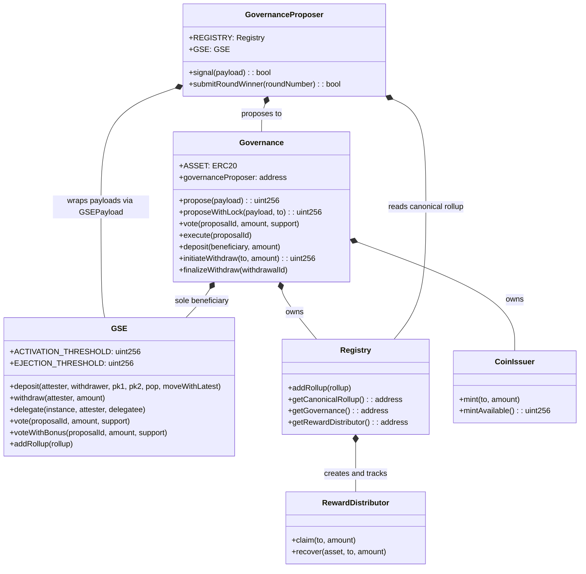
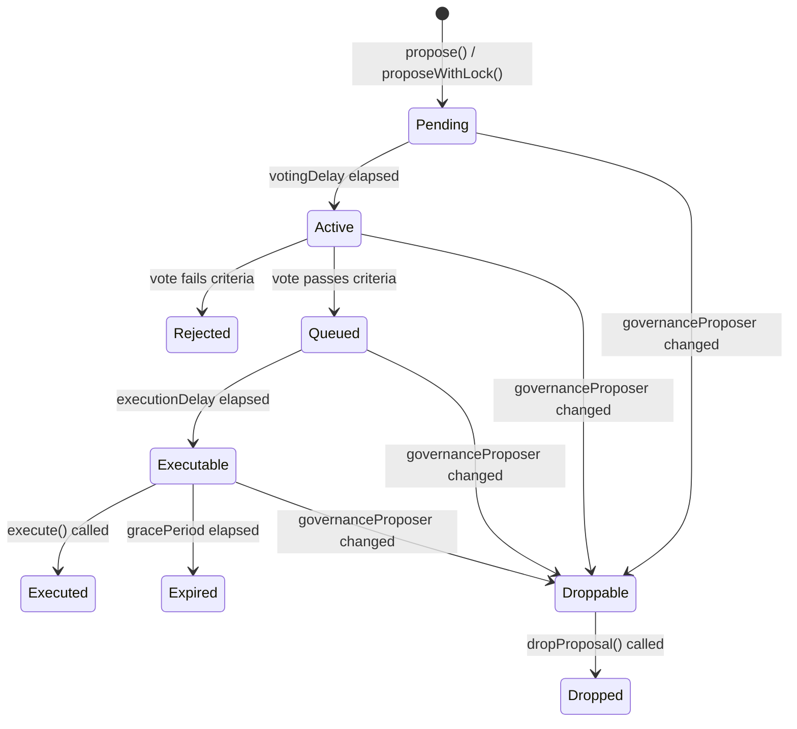

# Spec 19: Governance

## Overview

This specification defines the on-chain governance system for the Aztec Network. Governance controls protocol upgrades, parameter changes, reward distribution, and slashing enforcement through a token-weighted voting mechanism implemented as L1 smart contracts.

The governance system uses a **two-stage process**: validators first signal support for proposals through a round-based signaling mechanism (the GovernanceProposer), then proposals undergo formal voting and timelocked execution in the Governance contract. An emergency bypass path allows proposals without signaling, at the cost of a locked deposit.

Governance is the sole authority for:

- Registering new rollup versions (protocol upgrades)
- Modifying governance parameters (voting thresholds, timing)
- Controlling the RewardDistributor
- Minting new tokens via the CoinIssuer
- Slashing validators via governance-mediated slash payloads

This spec covers the structures, rules, and flows that alternative implementations MUST follow to remain compatible with the governance system. Parameters such as specific timing values or quorum percentages are deployment-time choices; the spec defines the valid ranges and semantics.

**Related specs:**

- [Spec 1: Protocol Overview](./01-protocol-overview.md) — system architecture and component roles
- [Spec 10: L1 Rollup Contract](./10-l1-rollup-contract.md) — rollup state transitions, reward claiming, and the `IInstance` interface
- [Spec 18: Block Production & Consensus](./18-block-production.md) — validator staking, committee selection, slashing votes, and the `GOVERNANCE_VOTE` duty type

---

## Requirements

### R1: Token-Weighted Voting

Governance power MUST be proportional to deposited governance tokens (the ASSET), at a 1:1 ratio. Power MUST be checkpointed so that historical values can be looked up for snapshot-based voting.

### R2: Snapshot Isolation

A proposal's voting power snapshot MUST be taken at the boundary between the Pending and Active phases (the last timestamp of the Pending phase). No deposit or withdrawal during the Active phase may influence the outcome of an in-progress vote.

### R3: Two-Stage Proposal Path

The standard proposal path MUST require validators to first signal support through the GovernanceProposer before a proposal enters the Governance contract. This ensures broad validator consensus before formal voting begins.

### R4: Emergency Proposal Path

The system MUST provide an emergency path (`proposeWithLock`) that bypasses the GovernanceProposer. This path MUST impose a cost on the proposer by locking a configurable amount of their governance power for an extended period.

### R5: Timelocked Execution

All proposals MUST pass through a timelock (execution delay) between vote completion and execution. This gives the community time to react to passed proposals before they take effect.

### R6: Proposal Immutability

Each proposal MUST snapshot the governance configuration at creation time. Configuration changes MUST NOT retroactively affect in-flight proposals.

### R7: Stake Safety via GSEPayload

Proposals originating from the GovernanceProposer MUST be wrapped in a GSEPayload that validates at execution time that more than 2/3 of total stake remains on the latest rollup. This prevents governance from executing proposals that would compromise stake integrity.

### R8: Controlled Deposit Access

The Governance contract MUST restrict which addresses can hold voting power via a beneficiary whitelist. The expected sole beneficiary is the GSE (Governance Staking Escrow). A one-way `openFloodgates` mechanism MUST exist to permanently remove the whitelist restriction.

### R9: Withdrawal Delay

Withdrawals from Governance MUST be subject to a delay that ensures voters cannot exit before proposals they voted on can be executed. The delay MUST be at least `votingDelay/5 + votingDuration + executionDelay`.

### R10: Version Registry

The Registry MUST track all historical rollup versions and expose the canonical (most recently added) rollup. Only Governance (as the Registry owner) may add new rollup versions.

---

## Specification

### 1. Contract Architecture

The governance system consists of the following L1 contracts:



**Ownership model:** Governance owns the Registry, GSE, and CoinIssuer. All administrative functions on these contracts are callable only by Governance (via executed proposals) or by specific privileged callers defined below.

### 2. Governance Contract

The Governance contract is the central authority for proposal management, voting, and execution.

#### 2.1 Deposit and Power

Governance power is acquired by depositing ASSET tokens into the Governance contract.

- `deposit(beneficiary, amount)`: Transfers `amount` of ASSET from `msg.sender` to the Governance contract. Increases the checkpointed power of `beneficiary` by `amount`.
- The caller MUST NOT be the Governance contract itself.
- The `beneficiary` MUST be an approved address in the deposit control whitelist, OR `allBeneficiariesAllowed` MUST be `true`.

Power is tracked using timestamp-keyed checkpoints (OpenZeppelin `Checkpoints.Trace224`). Both per-address and total power are checkpointed.

#### 2.2 Deposit Control

A whitelist (`DepositControl`) restricts which addresses may hold governance power.

| Function | Caller | Effect |
|---|---|---|
| `addBeneficiary(address)` | Governance (self-call via proposal) | Adds address to whitelist |
| `openFloodgates()` | Governance (self-call via proposal) | Permanently allows all addresses; one-way valve |

At deployment, a single initial beneficiary is set (expected to be the GSE). If the initial beneficiary is `address(0)`, floodgates open immediately.

#### 2.3 Withdrawal

Withdrawal is a two-step process:

1. **Initiate**: `initiateWithdraw(to, amount)` — reduces the caller's checkpointed power by `amount` and creates a pending `Withdrawal` record with a delay.
2. **Finalize**: `finalizeWithdraw(withdrawalId)` — transfers the ASSET tokens to the designated `recipient` after the unlock timestamp has passed.

The standard withdrawal delay is computed as:

```
withdrawalDelay = votingDelay / 5 + votingDuration + executionDelay
```

This ensures that if a voter participated in a proposal, the proposal can be executed before the voter's funds are released.

A withdrawal MUST NOT be finalized before `unlocksAt`. A withdrawal MUST NOT be finalized more than once.

#### 2.4 Configuration

The Governance contract stores a `Configuration` that controls all timing and threshold parameters. Each parameter has enforced bounds:

| Parameter | Type | Lower Bound | Upper Bound | Description |
|---|---|---|---|---|
| `votingDelay` | Timestamp | 60 seconds | 90 days | Buffer before voting opens after proposal creation |
| `votingDuration` | Timestamp | 60 seconds | 90 days | Length of the voting period |
| `executionDelay` | Timestamp | 60 seconds | 90 days | Timelock between vote completion and execution |
| `gracePeriod` | Timestamp | 60 seconds | 90 days | Window during which execution is permitted |
| `quorum` | uint256 | 1 | 1e18 (100%) | Minimum participation as fraction of total power |
| `requiredYeaMargin` | uint256 | 0 | 1e18 (100%) | Required yea-minus-nay margin as fraction |
| `minimumVotes` | uint256 | 1 | type(uint96).max | Absolute minimum total power for valid proposals |
| `lockAmount` | uint256 | 2 | type(uint96).max | Power locked when using `proposeWithLock` |
| `lockDelay` | Timestamp | 60 seconds | type(uint32).max (~136 years) | Delay for `proposeWithLock` withdrawals |

Configuration is updated via `updateConfiguration(Configuration)`, callable only by the Governance contract itself (i.e., through an executed proposal). The new configuration MUST pass `assertValid()` or the call reverts.

Existing proposals are unaffected by configuration changes — each proposal snapshots the configuration at creation time.

#### 2.5 Governance Proposer Management

The `governanceProposer` is the single address authorized to call `propose()`. It is updated via `updateGovernanceProposer(address)`, callable only by the Governance contract itself.

When the `governanceProposer` changes, all proposals whose recorded `proposer` matches the old address become `Droppable`. Proposals created via `proposeWithLock` record `address(this)` (the Governance contract) as proposer and are therefore immune to dropping.

The `governanceProposer` MUST NOT be set to the Governance contract's own address.

### 3. Proposal Lifecycle

#### 3.1 Proposal States

A proposal transitions through the following states:



| State | Condition |
|---|---|
| `Pending` | `now <= creation + votingDelay` |
| `Active` | `pendingThrough < now <= pendingThrough + votingDuration` |
| `Queued` | Vote accepted AND `activeThrough < now <= activeThrough + executionDelay` |
| `Executable` | Vote accepted AND `queuedThrough < now <= queuedThrough + gracePeriod` |
| `Rejected` | Voting ended AND vote criteria not met |
| `Executed` | `execute()` called successfully (terminal) |
| `Expired` | `now > executableThrough` (terminal) |
| `Droppable` | `governanceProposer` differs from proposal's recorded proposer AND proposer is not `address(this)` |
| `Dropped` | `dropProposal()` called on a Droppable proposal (terminal) |

Phase boundary timestamps:

```
pendingThrough   = creation + votingDelay
activeThrough    = pendingThrough + votingDuration
queuedThrough    = activeThrough + executionDelay
executableThrough = queuedThrough + gracePeriod
```

Terminal states (`Executed`, `Dropped`) are cached in storage and returned directly. All other states are computed dynamically from timestamps and vote results.

`Droppable` is NOT a terminal state — if the `governanceProposer` is restored to its original value, the proposal resumes its normal lifecycle. Only `Dropped` (set by `dropProposal()`) is permanent.

#### 3.2 Standard Proposal Path

1. The `governanceProposer` calls `propose(payload)`.
2. The proposal is created with the current configuration snapshot, `proposer = governanceProposer`, and `creation = block.timestamp`.
3. The proposal ID is the current `proposalCount`, which is then incremented.

#### 3.3 Emergency Proposal Path (proposeWithLock)

1. Any address with sufficient power calls `proposeWithLock(payload, to)`.
2. The contract initiates a withdrawal of `lockAmount` power from the caller, with a delay of `lockDelay`, sending eventual proceeds to `to`.
3. A proposal is created with `proposer = address(this)` (the Governance contract itself).
4. Because the proposer is the Governance contract, this proposal cannot become `Droppable`.

This path is intended for emergencies where the GovernanceProposer is compromised or unavailable.

Through the GSE, `GSE.proposeWithLock(payload, to)` transfers the required `lockAmount` of ASSET from the caller to the GSE, which deposits it into Governance and calls `Governance.proposeWithLock`.

#### 3.4 Voting

Voting occurs during the `Active` phase. Any address with checkpointed power at `pendingThrough` may vote.

```
vote(proposalId, amount, support)
```

- The proposal MUST be in `Active` state.
- The voter's available power is their checkpointed power at `pendingThrough` minus any votes already cast on this proposal (both yea and nay).
- `amount` MUST be <= available power.
- Partial voting is supported: a voter MAY call `vote` multiple times with different `support` values, splitting their power across yea and nay.
- Each call updates both the per-user ballot and the proposal's `summedBallot`.

#### 3.5 Vote Tabulation

After the Active phase ends, vote tabulation determines whether the proposal is accepted or rejected. The algorithm uses three checks in order:

1. **Minimum power check**: `totalPower >= minimumVotes`. If not, the proposal is rejected. `totalPower` is the total checkpointed power at `pendingThrough`.

2. **Quorum check**:
   ```
   votesNeeded = ceil(totalPower * quorum / 1e18)
   votesCast = yea + nay
   ```
   If `votesCast < votesNeeded`, the proposal is rejected.

3. **Yea margin check**:
   ```
   requiredApprovalVotesFraction = ceil((1e18 + requiredYeaMargin) / 2)
   requiredApprovalVotes = ceil(votesCast * requiredApprovalVotesFraction / 1e18)
   ```
   Yea MUST be **strictly greater than** `requiredApprovalVotes`. Ties result in rejection.

   Example: with `requiredYeaMargin = 0` (0%), yea must exceed 50% of votes cast. With `requiredYeaMargin = 0.2e18` (20%), yea must exceed 60%.

All rounding uses ceiling to prevent underpayment of required thresholds.

#### 3.6 Execution

When a proposal is in the `Executable` state, anyone may call `execute(proposalId)`.

1. The proposal's cached state is set to `Executed`.
2. `payload.getActions()` is called to retrieve the action list.
3. Each action is executed as a low-level `call(target, data)`.
4. Every action MUST succeed (revert on failure).
5. No action MAY target the governance ASSET token address.

For proposals originating from the GovernanceProposer, the payload is a `GSEPayload` that appends an `amIValid()` check as the final action (see Section 7).

#### 3.7 Dropping Proposals

When a proposal is in the `Droppable` state, anyone may call `dropProposal(proposalId)` to permanently set its state to `Dropped`. A proposal that has already been `Dropped` cannot be dropped again.

### 4. GovernanceProposer (Signaling Stage)

The GovernanceProposer implements round-based signaling where checkpoint proposers (validators currently designated to propose checkpoints) indicate support for governance payloads before they enter the formal voting process.

#### 4.1 EmpireBase Signaling Mechanism

Time is divided into **rounds** of `ROUND_SIZE` slots:

```
round = slot / ROUND_SIZE
```

Within each round, the designated checkpoint proposer for each slot may **signal** support for a payload. Each slot permits at most one signal.

| Parameter | Constraint | Description |
|---|---|---|
| `QUORUM_SIZE` | `ROUND_SIZE / 2 < QUORUM_SIZE <= ROUND_SIZE` | Signals needed for a payload to become submittable |
| `ROUND_SIZE` | > 0 | Slots per round |
| `LIFETIME_IN_ROUNDS` | > `EXECUTION_DELAY_IN_ROUNDS` | Rounds after which an unsubmitted winner expires |
| `EXECUTION_DELAY_IN_ROUNDS` | >= 0 | Rounds to wait after the round ends before submission is permitted |

For the GovernanceProposer specifically: `LIFETIME_IN_ROUNDS = 5` and `EXECUTION_DELAY_IN_ROUNDS = 0`.

**Signaling methods:**

1. **Direct**: The current checkpoint proposer calls `signal(payload)`.
2. **Delegated**: Anyone submits with the proposer's EIP-712 signature via `signalWithSig(payload, signature)`. The EIP-712 domain is `("EmpireBase", "1")` with type hash `Signal(address payload,uint256 slot,address instance)`.

Signals accumulate per payload within a round. The payload with the most signals (first to reach quorum) becomes submittable. If multiple payloads tie, the one that reached the highest count first (by being tracked as `payloadWithMostSignals`) takes precedence.

#### 4.2 Round Winner Submission

After a round ends (plus any execution delay), anyone may call `submitRoundWinner(roundNumber)`.

**Requirements:**
- `currentRound > roundNumber + EXECUTION_DELAY_IN_ROUNDS`
- `currentRound <= roundNumber + LIFETIME_IN_ROUNDS`
- The round has not already been submitted.
- The leading payload is not `address(0)`.
- The leading payload has at least `QUORUM_SIZE` signals.

**Effect:** The GovernanceProposer wraps the winning payload in a `GSEPayload` and calls `Governance.propose()`. The wrapping appends a stake-integrity check (see Section 7). The `proposalProposer` mapping records which rollup instance was canonical when the proposal was submitted.

#### 4.3 Instance Resolution

The GovernanceProposer reads the canonical rollup from the Registry via `getInstance()`. The rollup contract MUST implement the `IEmperor` interface:

```
interface IEmperor {
    function getCurrentProposer() returns (address);
    function getCurrentSlot() returns (Slot);
}
```

### 5. Governance Staking Escrow (GSE)

The GSE bridges validator staking with governance voting power. It serves as the single authorized beneficiary in the Governance contract, aggregating all validator stake and managing voting delegation.

#### 5.1 Attester Registration

Rollup contracts call `GSE.deposit(...)` to register attesters. The caller MUST be a registered rollup (checked via the `onlyRollup` modifier).

**Parameters:**

| Parameter | Description |
|---|---|
| `_attester` | The attester's Ethereum address |
| `_withdrawer` | Address authorized to delegate and control withdrawals for this attester |
| `_publicKeyInG1` | BLS public key on BN254 G1 |
| `_publicKeyInG2` | BLS public key on BN254 G2 |
| `_proofOfPossession` | BLS proof of possession linking G1 and G2 keys |
| `_moveWithLatestRollup` | If `true`, stake is placed in the bonus instance (auto-migrates on upgrade) |

**Constraints:**
- If `_moveWithLatestRollup = true`, the calling rollup MUST be the latest rollup.
- The attester MUST NOT already be registered on the calling rollup instance.
- If the caller is the latest rollup, the attester MUST NOT be registered on the bonus instance.
- BLS keys are registered globally per attester and are immutable. An attester who exits must re-register with new keys.
- Proof of possession is validated via an external `Bn254LibWrapper` with a configurable gas limit (default 250,000).
- Exactly `ACTIVATION_THRESHOLD` tokens are transferred from the rollup to the GSE, then deposited into Governance.

#### 5.2 Bonus Instance Mechanism

The GSE maintains a special `BONUS_INSTANCE_ADDRESS = address(uint160(uint256(keccak256("bonus-instance"))))` that is not a real rollup but acts as a virtual instance.

Attesters deposited with `_moveWithLatestRollup = true` are associated with the bonus instance. The latest rollup (as tracked by the GSE's internal `rollups` checkpoints) has access to both its own attesters AND the bonus instance's attesters.

When a new rollup is added via `addRollup()`, it becomes the latest rollup and immediately inherits all bonus instance attesters. The previous latest rollup loses access to the bonus instance.

This is the primary mechanism enabling smooth protocol upgrades — see [Spec 18](./18-block-production.md) for how `move_with_latest_rollup` affects the validator set.

#### 5.3 Voting Delegation

Each attester's voting power can be delegated to a `delegatee` address per instance.

- `delegate(instance, attester, delegatee)`: Only callable by the attester's `withdrawer`. Moves checkpointed voting power from the old delegatee to the new one.
- On initial deposit, voting power is delegated to the instance address itself.
- Delegatees vote via `GSE.vote(proposalId, amount, support)`, which tracks per-delegatee per-proposal power usage and calls `Governance.vote()`.
- The latest rollup may call `GSE.voteWithBonus(proposalId, amount, support)` to exercise the bonus instance's delegated voting power. The caller MUST have been the latest rollup at the proposal's snapshot time.

#### 5.4 Withdrawal via GSE

Rollup contracts call `GSE.withdraw(attester, amount)`:

1. The GSE searches for the attester in the calling rollup's instance, then (if the caller is the latest rollup) in the bonus instance.
2. If `balance - amount < EJECTION_THRESHOLD`, the attester is fully removed and undelegated; the entire balance is withdrawn.
3. The GSE calls `Governance.initiateWithdraw(rollup, amountWithdrawn)`, creating a pending withdrawal payable to the rollup.
4. After the withdrawal delay, anyone calls `GSE.finalizeWithdraw(withdrawalId)` to transfer tokens to the rollup.

The GSE does NOT remove the attester's global configuration (public keys, withdrawer) on exit — these are set once on first deposit.

#### 5.5 GSE-Managed Emergency Proposals

`GSE.proposeWithLock(payload, to)`:
1. Reads the current `lockAmount` from the Governance configuration.
2. Transfers `lockAmount` of ASSET from the caller to the GSE.
3. The GSE deposits the tokens into Governance and calls `Governance.proposeWithLock(payload, to)`.
4. This creates a withdrawal with `lockDelay` and a proposal with `proposer = address(Governance)`.

### 6. Registry

The Registry tracks versioned rollup instances. It is an `Ownable` contract owned by the Governance contract.

#### 6.1 Adding Rollup Versions

`addRollup(rollup)` — only callable by the owner (Governance).

- The rollup's version is read from `rollup.getVersion()`.
- The version MUST NOT already be registered.
- The rollup address is stored in `versionToRollup[version]` and the version number is appended to the `versions` array.
- The canonical rollup is always the most recently added version (last element of `versions`).

#### 6.2 Canonical Rollup

`getCanonicalRollup()` returns the rollup registered with the most recent version. This rollup has the following privileges:
- Claiming checkpoint rewards from the RewardDistributor
- Its checkpoint proposers may signal via the GovernanceProposer

#### 6.3 RewardDistributor

The Registry creates a `RewardDistributor` at construction and exposes it via `getRewardDistributor()`. The owner may update it via `updateRewardDistributor(address)`.

The RewardDistributor holds ASSET tokens and provides:

| Function | Caller | Effect |
|---|---|---|
| `claim(to, amount)` | Canonical rollup only | Transfers ASSET to `to` |
| `recover(asset, to, amount)` | Governance (Registry owner) | Recovers any ERC20 from the distributor |

See [Spec 10](./10-l1-rollup-contract.md) for how the rollup contract claims checkpoint rewards.

### 7. GSEPayload (Stake Integrity Check)

When the GovernanceProposer submits a winning payload to Governance, it wraps the original payload in a `GSEPayload`. This wrapper copies all original actions and appends a call to `amIValid()` as the final action.

`amIValid()` validates stake integrity at execution time:

```
canonicalRollup = REGISTRY.getCanonicalRollup()
latestRollup = GSE.getLatestRollup()

if canonicalRollup != latestRollup:
    return true  // bypass to prevent livelock

effectiveSupply = GSE.supplyOf(latestRollup) + GSE.supplyOf(BONUS_INSTANCE_ADDRESS)
totalSupply = GSE.totalSupply()

require(effectiveSupply > totalSupply * 2 / 3)
return true
```

**Livelock prevention**: If the canonical rollup (per the Registry) does not match the latest rollup (per the GSE), the check is bypassed. This mismatch indicates a misconfiguration where economic incentives drive attesters away from the GSE's "latest" rollup, making it increasingly unlikely to maintain the 2/3 threshold. Bypassing prevents governance from stalling.

**Implication**: 1/3 of total stake can block proposals that pass through the GovernanceProposer, since the remaining 2/3 must be on the latest rollup at execution time.

### 8. CoinIssuer

The CoinIssuer controls token minting with a rate-limited annual budget model. It is owned by Governance.

#### 8.1 Budget Model

- Years are fixed 365-day periods from deployment time.
- Each year's budget: `budget = ASSET.totalSupply() * NOMINAL_ANNUAL_PERCENTAGE_CAP / 1e18`
- Budget resets at the year boundary. Unused budget from the previous year is lost.
- `NOMINAL_ANNUAL_PERCENTAGE_CAP` is set at deployment (in 1e18 precision; 1e18 = 100%).
- The initial budget MUST be non-zero (requires non-zero initial supply or a suitable cap).

#### 8.2 Minting

`mint(to, amount)` — only callable by the owner (Governance).

- If a year boundary has been crossed since the last mint, the budget resets to the new year's calculation.
- `amount` MUST be <= the remaining budget for the current year.
- The budget is reduced by `amount`.

`acceptTokenOwnership()` — only callable by the owner (Governance). Accepts ownership of the ASSET token contract (via `Ownable2Step`), enabling the CoinIssuer to mint.

### 9. Protocol Upgrade Flow

A protocol upgrade follows this end-to-end flow:

1. A new rollup instance contract is deployed with the updated logic, circuits, and configuration.
2. A `RegisterNewRollupVersionPayload` is deployed, referencing the Registry and the new rollup.
3. Checkpoint proposers on the canonical rollup signal support for this payload via the GovernanceProposer.
4. Once quorum is reached in a round, anyone calls `submitRoundWinner()`. The payload is wrapped in a `GSEPayload` and proposed to Governance.
5. The proposal passes through the standard lifecycle: Pending → Active (voting) → Queued (timelock) → Executable.
6. Anyone calls `execute()`. The payload executes two actions:
   - `Registry.addRollup(newRollup)` — registers the new version as canonical.
   - `GSE.addRollup(newRollup)` — registers the new rollup in the GSE, making it the latest. Bonus instance attesters immediately become available to the new rollup.
7. The `GSEPayload.amIValid()` check verifies >2/3 stake remains on the (now new) latest rollup.

After execution, the new rollup is canonical and receives checkpoint rewards. Validators with `moveWithLatestRollup = true` auto-migrate. Others must exit the old rollup and re-deposit on the new one.

---

## Data Structures

### Proposal

| Field | Type | Description |
|---|---|---|
| `config` | `ProposalConfiguration` | Snapshot of governance configuration at creation |
| `cachedState` | `ProposalState` | Cached terminal state (`Executed` or `Dropped`), otherwise dynamically computed |
| `payload` | `IPayload` | The payload contract to execute |
| `proposer` | `address` | The governanceProposer at creation, or `address(this)` for `proposeWithLock` |
| `creation` | `Timestamp` | Block timestamp when the proposal was created |
| `summedBallot` | `Ballot` | Aggregate yea and nay votes |

### ProposalConfiguration

| Field | Type | Description |
|---|---|---|
| `votingDelay` | `Timestamp` | Duration of Pending phase |
| `votingDuration` | `Timestamp` | Duration of Active phase |
| `executionDelay` | `Timestamp` | Duration of Queued phase (timelock) |
| `gracePeriod` | `Timestamp` | Duration of Executable phase |
| `quorum` | `uint256` | Required participation as fraction of total power (1e18 scale) |
| `requiredYeaMargin` | `uint256` | Required yea-nay margin as fraction (1e18 scale) |
| `minimumVotes` | `uint256` | Absolute minimum total power for valid governance |

### Ballot

| Field | Type | Description |
|---|---|---|
| `yea` | `uint256` | Total yea votes |
| `nay` | `uint256` | Total nay votes |

Stored in compressed form as `CompressedBallot` (a single `uint256`: upper 128 bits = yea, lower 128 bits = nay).

### Withdrawal

| Field | Type | Description |
|---|---|---|
| `amount` | `uint256` | Tokens to be returned |
| `unlocksAt` | `Timestamp` | Earliest time the withdrawal can be finalized |
| `recipient` | `address` | Destination address for the tokens |
| `claimed` | `bool` | Whether the withdrawal has been finalized |

### IPayload Action

| Field | Type | Description |
|---|---|---|
| `target` | `address` | Contract to call |
| `data` | `bytes` | Calldata for the call |

### AttesterConfig (GSE)

| Field | Type | Description |
|---|---|---|
| `publicKey` | `G1Point` | BLS public key on BN254 G1 (set once, immutable) |
| `withdrawer` | `address` | Address authorized to delegate and trigger withdrawals |

### RegistryStorage

| Field | Type | Description |
|---|---|---|
| `versionToRollup` | `mapping(uint256 => IHaveVersion)` | Version number to rollup instance |
| `versions` | `uint256[]` | Ordered list of registered versions; last = canonical |
| `rewardDistributor` | `IRewardDistributor` | Current reward distributor contract |

### RoundAccounting (EmpireBase)

| Field | Type | Description |
|---|---|---|
| `lastSignalSlot` | `Slot` | Last slot in which a signal was cast (prevents double-signaling) |
| `payloadWithMostSignals` | `IPayload` | Leading payload in the round |
| `executed` | `bool` | Whether the round winner has been submitted |
| `signalCount` | `mapping(IPayload => uint256)` | Per-payload signal count |

### CompressedProposal (Storage Layout)

Proposals are stored in a compressed 4-slot format:

| Slot | Fields |
|---|---|
| 1 | `proposer` (160 bits) + `minimumVotes` (96 bits) |
| 2 | `cachedState` (8 bits) + `creation` (32 bits) + `votingDelay` (32 bits) + `votingDuration` (32 bits) + `executionDelay` (32 bits) + `gracePeriod` (32 bits) + `quorum` (64 bits) |
| 3 | `summedBallot` (128 bits yea + 128 bits nay) |
| 4 | `payload` (160 bits) + `requiredYeaMargin` (64 bits) |

### CompressedConfiguration (Storage Layout)

| Slot | Fields |
|---|---|
| 1 | `votingDelay` (32 bits) + `votingDuration` (32 bits) + `executionDelay` (32 bits) + `gracePeriod` (32 bits) + `quorum` (64 bits) + `requiredYeaMargin` (64 bits) |
| 2 | `minimumVotes` (96 bits) + `lockAmount` (96 bits) + `lockDelay` (32 bits) |

---

## Validation Rules

### V1: Proposal Creation

- `propose()`: `msg.sender` MUST be the current `governanceProposer`.
- `proposeWithLock()`: `msg.sender` MUST have at least `lockAmount` of deposited power. The `_to` parameter MUST NOT be `address(0)`.

### V2: Voting

- The proposal MUST be in `Active` state.
- `amount` MUST NOT exceed the voter's available power (snapshot power minus previously cast votes on this proposal).

### V3: Execution

- The proposal MUST be in `Executable` state.
- All actions MUST succeed.
- No action target MAY be the ASSET token address.
- For GSEPayload-wrapped proposals, `amIValid()` MUST pass (>2/3 stake on latest rollup, or canonical/latest mismatch).

### V4: Configuration Updates

- All timing parameters MUST be within [60 seconds, 90 days] (except `lockDelay` whose upper bound is `type(uint32).max`).
- `quorum` MUST be in [1, 1e18].
- `requiredYeaMargin` MUST be in [0, 1e18].
- `minimumVotes` MUST be in [1, type(uint96).max].
- `lockAmount` MUST be in [2, type(uint96).max].

### V5: Signaling (GovernanceProposer)

- The signaler MUST be the current checkpoint proposer for the slot (verified directly or via EIP-712 signature).
- Only one signal per slot per instance.
- `QUORUM_SIZE` MUST be > `ROUND_SIZE / 2` and <= `ROUND_SIZE`.

### V6: Round Winner Submission

- The round MUST have ended (current round > round number + execution delay).
- The round MUST NOT have expired (current round <= round number + lifetime).
- The round MUST NOT have already been submitted.
- The winning payload MUST have at least `QUORUM_SIZE` signals.
- The winning payload MUST NOT be `address(0)`.

### V7: GSE Deposits

- Caller MUST be a registered rollup.
- Attester MUST NOT already be registered on the calling rollup or (if caller is latest) on the bonus instance.
- BLS proof of possession MUST be valid within the gas limit.
- BLS public keys MUST NOT have been previously registered by any attester.

### V8: GSE Withdrawals

- Caller MUST be a registered rollup.
- Attester MUST be found in the rollup's instance or (if caller is latest) in the bonus instance.
- `amount` MUST NOT exceed the attester's balance.

### V9: Registry

- Only the owner (Governance) may call `addRollup()`.
- The rollup version MUST NOT already be registered.

### V10: CoinIssuer

- Only the owner (Governance) may call `mint()`.
- `amount` MUST NOT exceed the remaining budget for the current year.

---

## Security Considerations

### Governance Capture

The 2/3 stake integrity check via `GSEPayload.amIValid()` prevents a scenario where governance executes proposals that would move the protocol to a rollup controlled by a minority of stake. However, if an attacker controls >2/3 of total staked tokens, they can pass any proposal through the standard path.

### Withdrawal Front-Running

The withdrawal delay formula (`votingDelay/5 + votingDuration + executionDelay`) ensures that voters cannot exit with their stake before proposals they voted on are executed. This prevents vote-and-exit attacks.

### Proposer Compromise

If the GovernanceProposer or the current canonical rollup is compromised, the `proposeWithLock` emergency path allows any token holder (with sufficient funds) to bypass the signaling stage entirely. The economic cost of locking `lockAmount` tokens for `lockDelay` duration provides sybil resistance.

### Flash Loan Resistance

Snapshot-based voting prevents flash loan attacks. The voting power snapshot is taken at `pendingThrough` (end of the Pending phase), before voting begins. An attacker would need to hold tokens throughout the entire Pending phase to have voting power, making flash loans ineffective.

### Livelock Prevention

The `GSEPayload.amIValid()` bypass when canonical and latest rollups diverge prevents governance livelock. Without this bypass, a misconfigured GSE could prevent all governance proposals from executing, including proposals to fix the misconfiguration.

### Token Safety

Governance execution explicitly prohibits calls to the ASSET token address, preventing proposals from directly manipulating the governance token (e.g., minting tokens to gain voting power, or transferring tokens out of the Governance contract).

---

## Open Questions

1. **Governance parameter initial values**: The spec defines valid ranges but not the specific initial values for `votingDelay`, `votingDuration`, `executionDelay`, `gracePeriod`, `quorum`, `requiredYeaMargin`, `minimumVotes`, `lockAmount`, and `lockDelay`. These are deployment-time choices that significantly affect governance dynamics and should be documented.

2. **Migration path for in-flight state**: When a new rollup version is registered, the spec does not fully define how in-flight checkpoints, pending messages, and unproven epochs on the old rollup are handled. See [Spec 10, Open Question 1](./10-l1-rollup-contract.md).

3. **Slashing vetoer governance**: The slashing system described in [Spec 18](./18-block-production.md) references a governance-controlled "vetoer" address. The mechanism for appointing or rotating this vetoer is not fully specified.

4. **GovernanceProposer replacement**: If the GovernanceProposer contract itself needs to be replaced (not just the proposer address), the process requires a governance proposal to call `updateGovernanceProposer`. All in-flight proposals from the old proposer become Droppable, which may disrupt ongoing governance activity.

5. **CoinIssuer budget interaction with external minting**: If the ASSET token has other minting mechanisms beyond the CoinIssuer, the annual budget calculation based on `totalSupply()` may not accurately reflect intended inflation targets.

6. **GSE rollup removal**: The GSE only supports adding rollups, not removing them. If a registered rollup is compromised, governance must add a new rollup (with bonus instance migration) rather than disable the old one. Whether old rollup instances should be explicitly deactivated needs clarification.

---

## Discarded Alternatives

### Pro-Rata Rewards Across Historical Rollup Instances

An early design proposed distributing block rewards pro-rata to all historical canonical rollup versions, weighted by the amount of stake currently deposited on each instance. The intent was to incentivize operators to continue running infrastructure for old deployments as long as users remained on them, while sharing a single token across all versions.

This was rejected in favor of rewarding only the current canonical rollup. The `RewardDistributor.claim()` function is callable exclusively by the canonical rollup. Reasons for rejection include:

- An inactive old instance with staked tokens could extract rewards by submitting empty blocks, without serving any users.
- The complexity of managing reward splits across an unbounded number of historical instances was not justified given that the bonus instance mechanism (see Section 5.2) already provides a smooth migration path for validators.
- Validators who choose to remain on old instances accept the trade-off of losing checkpoint rewards.

### Security Council Pause Mechanism

An early design proposed an emergency mode for the initial rollup instances, where a security council multisig could pause the rollup (but not make other changes). The pause would auto-expire after a fixed period (e.g., 180 days) to prevent permanently bricking user funds. This was intended as a "training wheel" for early deployments.

This was not implemented. The `proposeWithLock` emergency proposal path (Section 3.3) serves as the emergency mechanism instead, allowing any sufficiently-capitalized token holder to bypass the GovernanceProposer and submit proposals directly. This approach avoids introducing a privileged multisig into the protocol.

---

## References

- [EIP-712: Typed Structured Data Hashing and Signing](https://eips.ethereum.org/EIPS/eip-712) — used for delegated signaling signatures in the GovernanceProposer
- [OpenZeppelin Checkpoints](https://docs.openzeppelin.com/contracts/5.x/api/utils#Checkpoints) — used for timestamp-keyed power snapshots
- [Spec 10: L1 Rollup Contract](./10-l1-rollup-contract.md) — rollup state transitions, reward claiming, `IInstance` interface
- [Spec 18: Block Production & Consensus](./18-block-production.md) — validator staking, committee selection, slashing, `GOVERNANCE_VOTE` duty type
