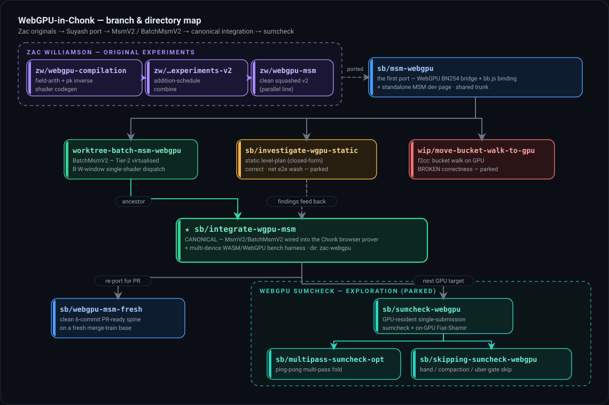

# WebGPU in the Chonk browser prover

Summary documentation for the 2026 exploration of GPU acceleration in the
Chonk (client-IVC) browser prover: a WebGPU **MSM** (built, integrated into
the browser prover, benchmarked across desktop and mobile devices) and a
WebGPU **sumcheck** (prototyped, parked). This branch (`sb/webgpu-docs`)
carries **docs and diagrams only** — all code lives on the branches linked
below. Start here if you are picking the project up.

## Read in this order

1. **[MSM_ALGO.md](MSM_ALGO.md)** — the mathematics of the GPU MSM, how it
   maps onto WebGPU compute passes, and where the MSM sits in the Chonk
   prover. Deliberately implementation-state-free.
2. **[MSM_IMPL.md](MSM_IMPL.md)** — the implementation: what is built and
   how it performs per device (§5), integration mechanics, everything tried
   and parked (§7), how to build/run/test/profile (§8), and the future-work
   ledger (§9).
3. **[SUMCHECK_ALGO.md](SUMCHECK_ALGO.md)** — the GPU sumcheck prototype:
   math, design decisions, optimisations, and the verdict (NO-GO
   standalone, conditional GO inside a GPU-resident pipeline).

## The verdict in one paragraph

The MSM kernel is genuinely fast in isolation — 2–4× over multithreaded
WASM Pippenger at $n \ge 2^{18}$ on Apple Metal — but the win does not
transfer to Chonk end-to-end: Chonk's MSMs sit below GPU saturation and the
prove is ~80% sequential, so e2e is parity on Mac and S26U and ~2× slower
on Pixel 10. Correctness is solid (33/33 proofs verify with byte-identical
VKs across three devices). The honest accounting, including where a GPU
*does* pay, is [MSM_IMPL.md §1](MSM_IMPL.md#1-tldr--the-honest-verdict).

## Where the code is

The full branch genealogy is
[MSM_IMPL.md §2](MSM_IMPL.md#2-what-exists--branches-and-layout); the
quick version:

| Branch | What it holds |
| --- | --- |
| [`sb/integrate-wgpu-msm`](https://github.com/AztecProtocol/aztec-packages/tree/sb/integrate-wgpu-msm) ★ | **Canonical.** The full `MsmV2`/`BatchMsmV2` stack wired into the Chonk browser prover, plus the multi-device bench harness. Every file path in these docs resolves here unless stated otherwise. |
| [`sb/webgpu-msm-fresh`](https://github.com/AztecProtocol/aztec-packages/tree/sb/webgpu-msm-fresh) | Clean, PR-ready 6-commit spine — **start any upstreaming from here**, not from the canonical branch. |
| [`sb/skipping-sumcheck-webgpu`](https://github.com/AztecProtocol/aztec-packages/tree/sb/skipping-sumcheck-webgpu) | The most complete GPU-sumcheck branch; sumcheck paths in [SUMCHECK_ALGO.md](SUMCHECK_ALGO.md) resolve here. Siblings: [`sb/sumcheck-webgpu`](https://github.com/AztecProtocol/aztec-packages/tree/sb/sumcheck-webgpu), [`sb/multipass-sumcheck-opt`](https://github.com/AztecProtocol/aztec-packages/tree/sb/multipass-sumcheck-opt). |
| [`sb/investigate-wgpu-static`](https://github.com/AztecProtocol/aztec-packages/tree/sb/investigate-wgpu-static) | Parked static level-plan (MSM_IMPL §7.3). |
| [`wip/move-bucket-walk-to-gpu`](https://github.com/AztecProtocol/aztec-packages/tree/wip/move-bucket-walk-to-gpu) | Parked **and broken** GPU bucket-walk (MSM_IMPL §7.7); kept as a marker. |
| [`zw/webgpu-msm`](https://github.com/AztecProtocol/aztec-packages/tree/zw/webgpu-msm) and the other `zw/*` lines | Zac's original experiments the whole family forks from (full list in MSM_IMPL §2). |

## Diagrams

`diagrams/` holds every figure referenced by the docs plus their
generators (`gen_*.mjs` on `diagram_kit.mjs`); rebuild with
`diagrams/build.sh`.
