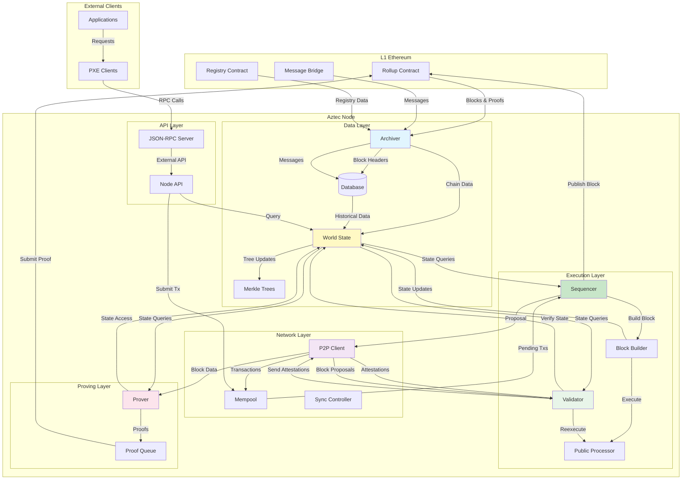
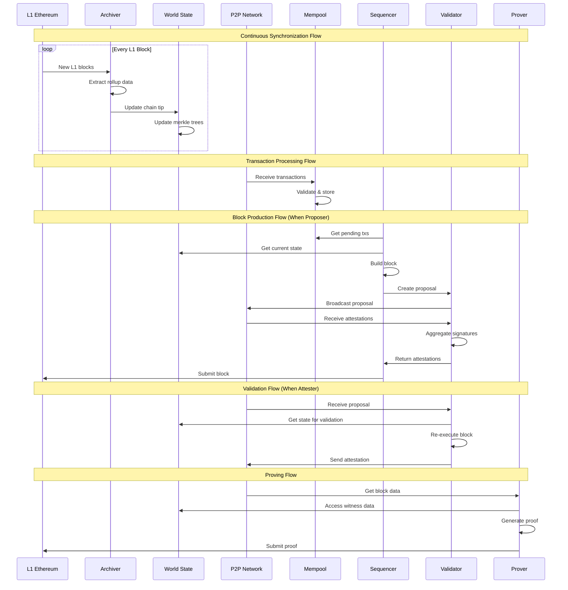
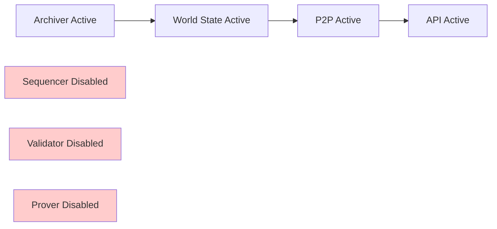
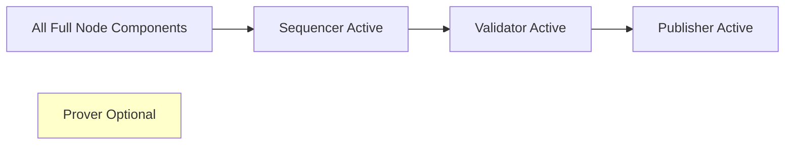
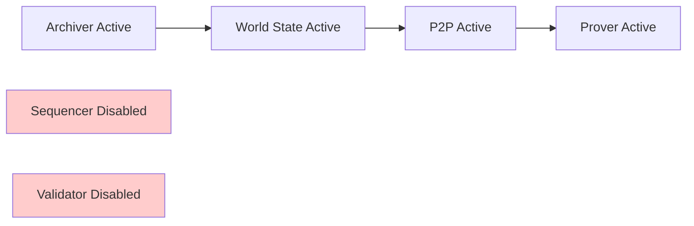

# Aztec Node

The Aztec Node is the core component that orchestrates all the subsystems required to participate in the Aztec network. It integrates the archiver, world state, P2P networking, sequencer, validator, and prover components into a cohesive system that can sync with L1, maintain state, build blocks, and participate in consensus.

## Overview

The Aztec Node serves multiple roles in the network:

- **Full Node**: Maintains complete chain state and serves queries
- **Sequencer Node**: Builds and proposes new blocks when selected
- **Validator Node**: Participates in attestation and consensus
- **Prover Node**: Generates validity proofs for state transitions

## System Architecture

### Component Interaction Flow



### Data Flow Patterns



## Core Components

### Archiver

The archiver is responsible for downloading and indexing L1 data:

- **L1 Monitoring**: Continuously polls Ethereum for new blocks
- **Data Extraction**: Parses rollup contract events and messages
- **Chain Tracking**: Maintains canonical and pending chain states
- **Message Bridge**: Tracks L1→L2 and L2→L1 messages
- **Registry Sync**: Updates validator and contract registries

### World State

Manages the complete state of the Aztec network:

- **Merkle Trees**: Maintains note, nullifier, and public data trees
- **State Snapshots**: Provides consistent views for block building
- **Fork Management**: Handles chain reorganizations
- **State Queries**: Serves state proofs and witness data

### P2P Network

Handles all peer-to-peer communication:

- **Transaction Propagation**: Broadcasts and receives transactions
- **Block Proposals**: Distributes proposals to validators
- **Attestation Collection**: Aggregates committee signatures
- **Peer Discovery**: Maintains network connectivity
- **DoS Protection**: Rate limiting and peer scoring

### Mempool

Manages pending transactions:

- **Transaction Validation**: Checks signatures, fees, and nonces
- **Priority Ordering**: Sorts by fee and arrival time
- **Deduplication**: Prevents duplicate processing
- **Expiration**: Removes stale transactions
- **Reorg Handling**: Re-adds transactions after reorgs

### Sequencer

Coordinates block production when selected as proposer:

- **Slot Monitoring**: Tracks proposer eligibility
- **Block Building**: Assembles transactions into blocks
- **Attestation Collection**: Gathers committee signatures
- **L1 Submission**: Publishes blocks to Ethereum
- **State Management**: Updates local state optimistically

### Validator

Handles consensus participation:

- **Proposal Validation**: Re-executes proposed blocks
- **Attestation Creation**: Signs valid proposals
- **Committee Participation**: Fulfills epoch duties
- **Slashing Detection**: Reports misbehavior

### Prover

Generates validity proofs (when enabled):

- **Proof Generation**: Creates ZK proofs for state transitions
- **Witness Collection**: Gathers required state data
- **Proof Submission**: Sends proofs to L1
- **Resource Management**: Handles proof queue and priorities

## Node Modes

The Aztec Node can operate in different modes:

### Full Node Mode



### Sequencer Node Mode



### Prover Node Mode



## Development

### Building

Start by running `bootstrap.sh` in the project root.

To build the package, run `yarn build` in the root.

To watch for changes, `yarn build:dev`.

### Testing

To run the tests, execute `yarn test`.

The end-to-end tests provide examples of initializing an Aztec Node and using it with a Private eXecution Environment (PXE).

### Running a Local Node

```bash
aztec start
```
