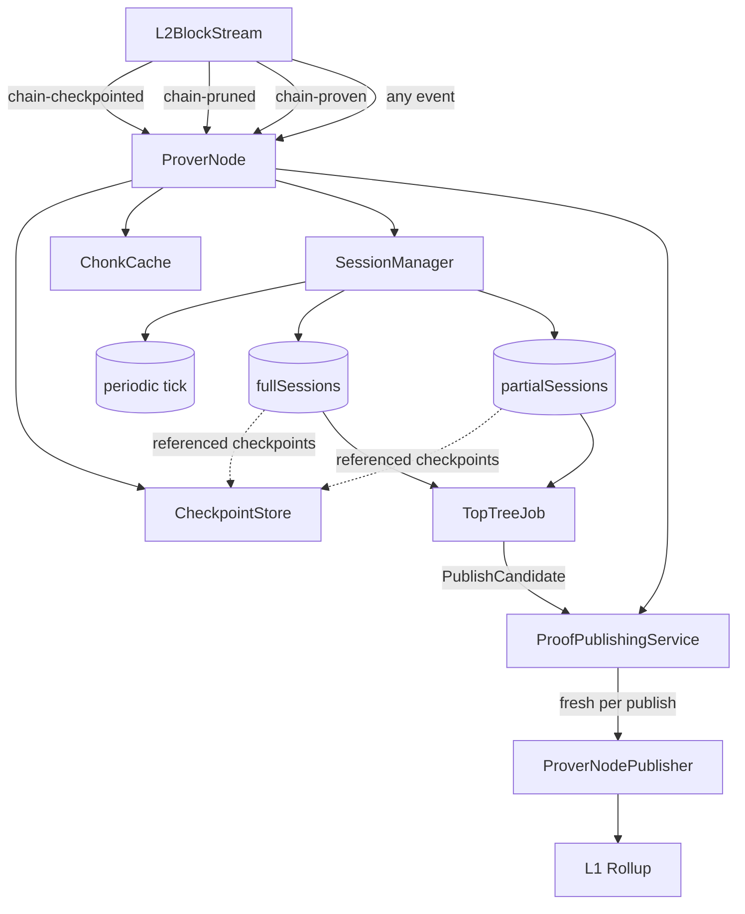
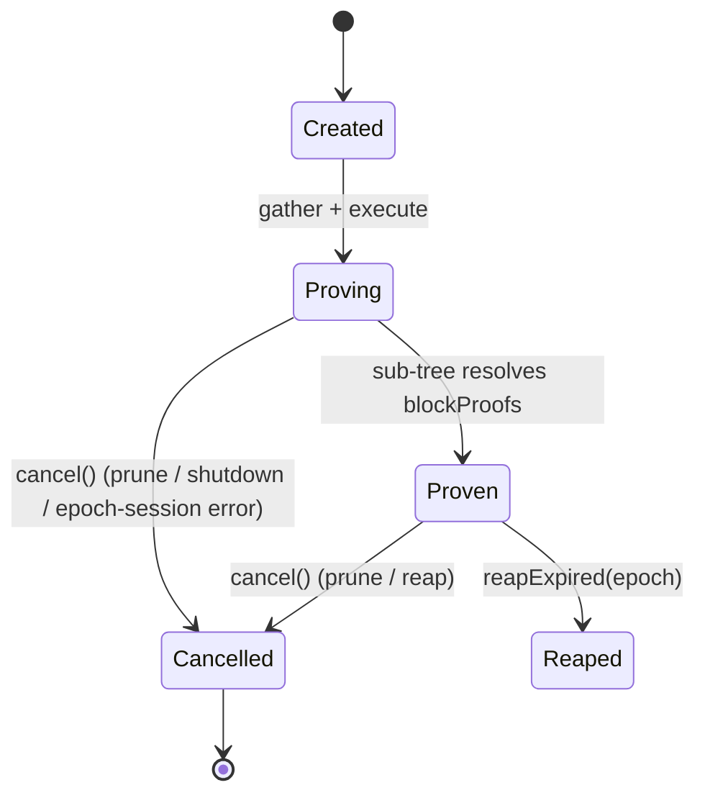
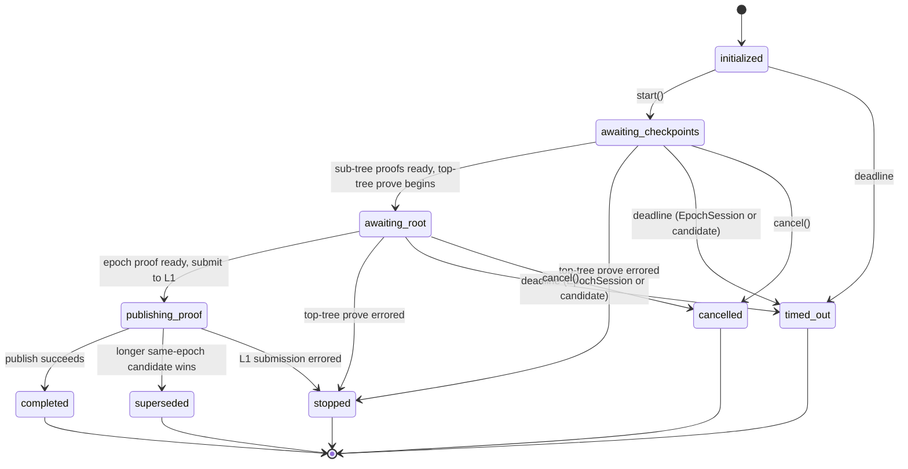
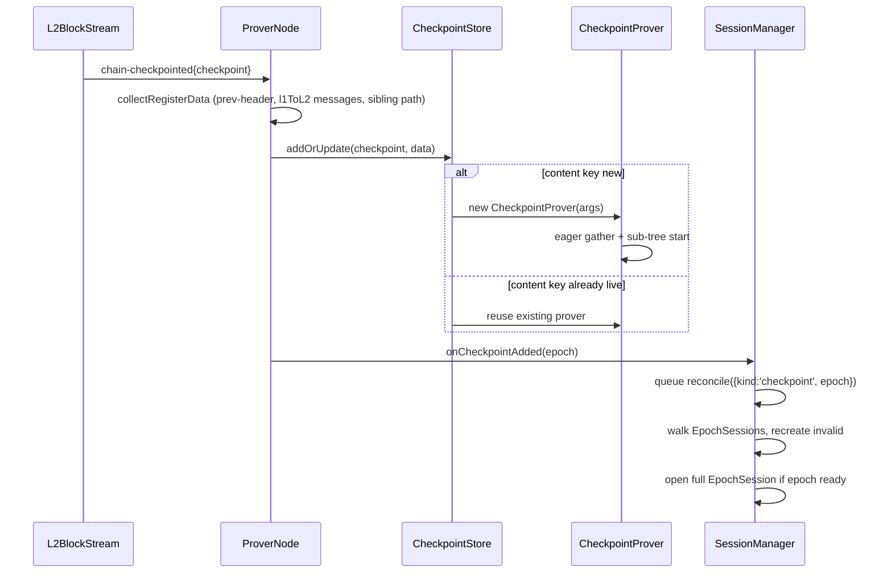
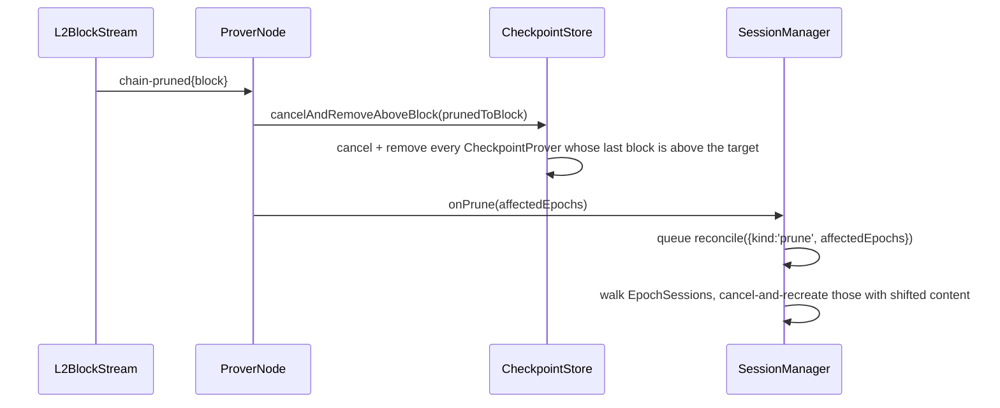
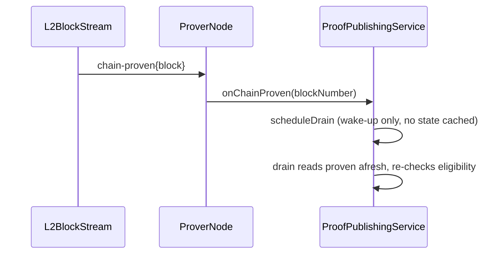
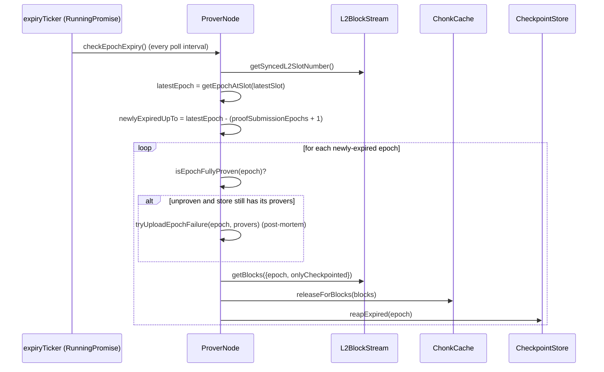

# Prover Node

The prover node turns sequenced checkpoints into epoch proofs that get submitted to the L1
rollup contract.  It runs alongside an Aztec validator/full-node and consumes the
canonical chain view those nodes emit, proving epochs **optimistically** — sub-tree
work begins the moment a checkpoint lands on L1, not when the epoch closes.

This document describes the internal architecture: the state held by the prover-node,
the events that drive it, and the data flow from a fresh `chain-checkpointed` event
through to a `submitEpochRootProof` on L1.

## Contents

1. [Architecture](#architecture)
2. [CheckpointProver lifecycle](#checkpointprover-lifecycle)
3. [EpochSession lifecycle](#epochsession-lifecycle)
4. [Event flow](#event-flow)
5. [Walkthroughs](#walkthroughs)
6. [Design rationale](#design-rationale)
7. [Configuration](#configuration)
8. [Failure handling and observability](#failure-handling-and-observability)

## Architecture



The prover-node splits responsibility between four classes:

- **`ProverNode`** — owns the long-lived collections, wires the L2BlockStream, and
  translates each chain event into a single method call on the `SessionManager` or
  `ProofPublishingService`. It also performs side effects that don't belong on an
  `EpochSession`: registering new checkpoints with the store per event, and sweeping expired
  epochs out of the cache and the store on a periodic ticker (see below). It is the sole author of an
  epoch's terminal failure: when an epoch's proof-submission window closes with the epoch
  still unproven, `expireEpoch` runs the post-mortem failure-upload before reaping the store.
- **`CheckpointStore`** — a registry of `CheckpointProver` instances keyed by
  `(checkpointNumber, slot, archiveRoot)`. Each `CheckpointProver` runs its own sub-tree pipeline
  (tx gather → block processing → block-rollup proofs), starting eagerly the moment a
  checkpoint is registered. The store holds the canonical checkpoint content that
  `EpochSession`s query when assembling their subsets; a prune cancels and removes the affected
  provers, so every prover in the store is canonical.
- **`SessionManager`** — owns every live `EpochSession`, the serial reconcile queue,
  the periodic tick, and all `EpochSession` lifecycle decisions. `ProverNode` calls into it
  via `onCheckpointAdded`, `onPrune`, and `startProof`. Every trigger it receives is
  translated into a `reconcile(trigger)` call, a single idempotent function that walks
  all `EpochSession`s, cancels any whose canonical content has shifted, re-creates them with
  the new content, and opens fresh full `EpochSession`s for any epoch that has become provable.
  It never builds a session over a **failed** `CheckpointProver` (one whose block proofs rejected —
  a sub-tree fault or a prune-induced fork fault): a session over it could only fail, so the epoch is
  cheaply skipped until a prune/re-add installs a fresh prover in its place, at which point a rebuilt
  session reuses every already-completed sub-proof from the content-addressed broker. Reconcile runs on
  a `SerialQueue` (from `@aztec/foundation/queue`), so two concurrent triggers can never interleave on an
  `await` and race on the `EpochSession` maps.
- **`ProofPublishingService`** — central owner of L1 proof submission. `EpochSession`s hand
  their top-tree proofs to the service as `PublishCandidate`s; the service serialises
  one publish at a time against a freshly-created `ProverNodePublisher`, gates eligibility
  on the proven block tip, picks the longest candidate per epoch as the winner
  (others resolve `'superseded'`), and enforces a per-candidate `deadline`. It runs its
  own `drain()` on a separate `SerialQueue`: submits, withdrawals, chain-proven advances,
  and per-candidate deadline expiries all enqueue a drain pass, so the eligibility
  re-check and the L1 publish never interleave with each other.

## CheckpointProver lifecycle

A `CheckpointProver` is content-addressed by `(checkpoint.number, slot, archiveRoot)`,
where `archiveRoot` is the checkpoint's own archive root (its post-state). Keying on the
post-state makes the identity precise: two checkpoints are "the same" iff they produce
the same archive — so a reorg branch, or a replacement built on the same predecessor but
with different content, yields a different archive root and a distinct `CheckpointProver`. A prune
cancels and removes a prover — its sub-tree work forks world-state per block and cannot survive the
prune — so a re-add, even of identical content, constructs a fresh `CheckpointProver` (block-rollup
jobs already completed in the proving broker are still reused, as they are content-addressed).



A prune **cancels and removes** the affected `CheckpointProver`s from the store: a prover's
sub-tree work forks world-state per block, and an L1 prune of a base block faults those reads,
so there is nothing to preserve across a reorg. A re-add — even of identical content — therefore
constructs a fresh `CheckpointProver`. `EpochSession`s ask the store for the checkpoints in a slot
range; every prover in the store is canonical.

### Removal rules

- **Pruned**: `CheckpointStore.cancelAndRemoveAboveBlock(target)` cancels and removes every
  `CheckpointProver` whose last block is above the prune target, the moment a `chain-pruned`
  event arrives.
- **Expired**: `CheckpointStore.reapExpired(expiredEpoch)` drops any `CheckpointProver` whose
  epoch is at or below the supplied expired epoch. Once an epoch's proof-submission window has
  closed, its proof can no longer be accepted on L1, so the `CheckpointProver` is no longer needed.
- **Shutdown**: `CheckpointStore.stop()` cancels every remaining prover and awaits its teardown
  (including teardowns still in flight for provers already removed by a prune or reap).

### Eager tx gathering

A `CheckpointProver` starts its tx gather + sub-tree pipeline **in its constructor**.
The tx provider is injected as a dependency,
and the `CheckpointProver` pulls its own txs via `txProvider.getTxsForBlock(block)` for each
block in its checkpoint.

This means the moment a checkpoint lands on L1, sub-tree proving is already in flight.
By the time the epoch closes (and the `EpochSession` is constructed), most or all of the
block-rollup proofs are already done — the `EpochSession` only has to drive the top tree.

## EpochSession lifecycle

An `EpochSession` is identified by a slot-based **spec**:

```ts
interface SessionSpec {
  kind: 'full' | 'partial';
  epochNumber: EpochNumber;
  fromSlot: SlotNumber;
  toSlot: SlotNumber;
}
```

The spec declares *what to prove* (a slot range).  The concrete checkpoint set the
`EpochSession` holds is the *implementation* of the spec — frozen at construction time,
derived from the canonical content for that slot range.



A proving or submission fault never declares the epoch failed. It settles the `EpochSession` in
the non-declaring terminal `stopped`: a fact about this attempt, not a verdict on the epoch. The
reconciler is free to rebuild the epoch — over healthy provers it does so on the next tick; over a
**failed** `CheckpointProver` it holds off until a prune/re-add installs a fresh one. The epoch is
declared `failed` — with a post-mortem upload — only at its L1 proof-submission-window expiry, in
`ProverNode.expireEpoch`. That is the single, race-free point where the proven tip is settled, so
"did this epoch miss its window?" has an authoritative answer and no prune/fault classification is
needed.

The non-terminal states track the window between `start()` and the L1 submission:

- `awaiting-checkpoints` — a `TopTreeJob` is awaiting each checkpoint's sub-tree result
  (`CheckpointProver.whenBlockProofsReady`) before the top-tree prove can begin.
- `awaiting-root` — the sub-tree proofs are ready and the top-tree (root) prove is running,
  assembling the epoch proof (set via the `TopTreeJob` `beforeProve` hook).
- `publishing-proof` — the epoch proof is being submitted to L1 via `ProofPublishingService`.

`cancel()` and the deadline can fire during any of these pre-submit phases; a terminal state
set that way wins over the phase transitions (which are guarded by `isTerminal()`).

The `EpochSession` does three sequential things: (1) run a `TopTreeJob` over the frozen
checkpoint subset, (2) hand the resulting proof to `ProofPublishingService` as a
`PublishCandidate`, (3) translate the service's outcome into a terminal state.
Predecessor gating, same-epoch dedup, deadline enforcement, and the L1 tx are all
the `ProofPublishingService`'s concern; the `EpochSession` is just the producer of one
candidate and the observer of its outcome.

Outcome → state mapping:

| `PublishOutcome` | `EpochSession` state |
|---|---|
| `published` | `completed` |
| `superseded` | `superseded` |
| `failed` | `stopped` (retryable — not a terminal epoch failure) |
| `expired` | `timed-out` |
| `withdrawn` | `cancelled` |

There is a single deadline — the proof submission window — that applies across both
proving and publishing. Before submission, the `EpochSession` arms its own timer against
it: if proving doesn't finish in time, the `EpochSession` enters `timed-out` via
`cancel('deadline')`. After submission, the publishing service enforces the same deadline
on the candidate. It's the same instant throughout; only which component enforces it
changes once the candidate has been handed off.

### Full vs partial

Every `EpochSession` — full or partial — has `fromSlot = firstSlotOfEpoch(N)`. The L1 rollup
contract requires every proof to extend from the previous epoch's proven tip, so
there's no value in starting later than the epoch boundary. The two kinds differ
only in `toSlot` and in how the publishing service treats their candidate:

- **Full** `EpochSession`s are opened by reconcile when the epoch is complete on L1 *and*
  every archiver-reported checkpoint is present in the store. Their `toSlot` is
  the epoch's last slot. The publishing service never auto-supersedes a `full`
  candidate on proven-tip subsumption — the L1 contract records a `(epoch, prover-id)`
  submission for every full-epoch proof, so even after another prover-node has
  landed first, this prover's submission is still worthwhile.
- **Partial** `EpochSession`s are constructed by an explicit `startProof(epochNumber)` API
  call. Their `toSlot` is the last canonical slot present at request time, which may
  be earlier than the epoch's last slot. Partial candidates are an early-finish
  optimisation: if the proven chain has caught up to or past `endBlock` by the time
  the publishing service picks the winner, the partial resolves `'superseded'`
  without spending L1 gas. Dedup: if the partial's spec collapses to the full's spec
  (canonical content already covers the whole epoch), `startProof` awaits the
  existing full `EpochSession` instead of opening a duplicate.

## ProofPublishingService

The service is a single per-prover-node owner of L1 submission. `EpochSession`s call
`submit(candidate)` and await one of five outcomes:

| Outcome | Meaning |
|---|---|
| `published` | L1 accepted the proof. |
| `superseded` | A longer same-epoch candidate won, or (for `partial` candidates) the proven tip has caught up to `endBlock`. |
| `failed` | L1 submission errored. |
| `expired` | The candidate's `deadline` elapsed before publishing started. |
| `withdrawn` | An `EpochSession` called `withdraw(uuid)` on a still-queued candidate. |

Key invariants:

- **One publish at a time** via a `SerialQueue` drain.
- **Fresh publisher per publish.** Each drain call constructs a new `ProverNodePublisher`
  via the factory. There is no shared in-memory state across publishes.
- **Once an L1 publish starts, it runs to completion.** `withdraw` is a queue-only
  operation: it removes a candidate that hasn't started publishing. An in-flight
  candidate is left alone and its outcome reports whatever L1 returned. The
  originating `EpochSession` has already moved to a terminal state via `cancel()` and
  ignores the late outcome.
- **Drain reads the proven block number afresh** from `l2BlockSource` inside the
  serial queue, so the eligibility
  check is consistent with the publish that follows it on the same drain pass.
- **Per-candidate `deadline`** arms a `setTimeout` (against the injected `DateProvider`).
  When it fires, a still-queued candidate resolves `'expired'`. An in-flight publish
  is left alone (its outcome reports the natural L1 result).
- **Transient `publisherFactory.create()` failures are retried.** Instead of resolving
  the candidate as `'failed'`, the service schedules another drain after a 1s backoff
  and leaves the candidate in the queue. The candidate's `deadline` caps the total
  retry window — persistent acquire failure resolves as `'expired'`.

### Eligibility

A candidate is eligible to publish when its **predecessor block is proven**
(`startBlock - 1 <= proven`). Among eligible candidates for the same epoch, the
one with the **highest `endBlock`** wins; the others resolve `'superseded'`.
Partial candidates whose `endBlock <= proven` are dropped before this check
(early-finish optimisation no longer helps); full candidates are never
auto-superseded on the proven tip.

## Event flow

### chain-checkpointed



### chain-pruned



### chain-proven



### Periodic expiry sweep



The sweep is driven solely by the `expiryTicker` (a `RunningPromise` armed in `start()`), which
fires `checkEpochExpiry()` every poll interval whether or not block-stream events arrive. It is
deliberately **not** run from `handleBlockStreamEvent` — expiry is a background sweep keyed off the
archiver's synced slot, not part of event processing — and because a `RunningPromise` never overlaps
its own runs, no two sweeps can race. An epoch `E` is expired once the chain reaches the start of epoch
`E + proofSubmissionEpochs + 1` — the deadline beyond which an L1 submission for `E` would be rejected.
This is also the single point at which an epoch is declared a terminal **failure**: if `E` is not fully
proven by now (the proven tip is settled, so the answer is authoritative), `expireEpoch` uploads a
post-mortem snapshot built from `E`'s last-known canonical provers before reaping them. A monotonic
high-water mark (`lastExpiredEpoch`) makes the sweep cheap and guarantees each epoch is swept — and
uploaded — exactly once: it only advances after a sweep completes and never revisits an epoch. It is
seeded at `start()` from the last fully-proven epoch (`resolveLastFullyProvenEpoch`), so on a restart we
never re-sweep epochs that already reached L1. An epoch that left no provers behind (never re-added after
a prune — another prover covers it) uploads nothing.

### Periodic tick

`SessionManager.start()` arms a `RunningPromise` that fires
`reconcile({ kind: 'tick' })` every `tickIntervalMs`. The tick picks up epochs that
became complete by time alone (no fresh checkpoint event) and advances to the
next unproven epoch once the previous one lands on L1. The tick is not gated by any per-epoch
bookkeeping; what keeps it from re-proving a doomed epoch is `openFullSessionIfReady` refusing to build
a session when any `CheckpointProver` in the set has **failed** (`isFailed()`). So a stuck epoch is
skipped cheaply each tick — no session, no proving — until a prune/re-add replaces the failed prover, or
the epoch expires. Two consequences worth noting:

- A session that stops with its provers **healthy** — a transient top-tree prove or L1 submit error —
  is re-opened by the next tick (nothing is failed), and the rebuilt session reuses the broker's
  completed sub-proofs and re-attempts the top tree / submit. This is the desired retry for transient
  submit failures.
- A failure that leaves a prover **failed** is not retried by the tick over the same prover; it recovers
  only when a prune/re-add installs a fresh prover, and otherwise fails at expiry.

Transient blockers (max-pending-jobs reached, archiver still indexing) create no session and no failed
prover, so the next tick simply tries again.

## Walkthroughs

### checkpoint-added → prune → checkpoint-added (reorg resilience)

State: epoch N has checkpoints c1..c4 (slots s1..s4).  `fullSessions[N]` holds `EpochSession`
**A** with spec `{kind:'full', N, fromSlot:s1, toSlot:s4}`, referencing `[c1, c2, c3, c4]`.

1. **chain-pruned arrives, target c3.**  The store cancels and removes c4 (its last block is
   above the prune target).  Reconcile fires: `EpochSession` A's frozen set `[c1, c2, c3, c4]`
   includes the now-cancelled c4, so it no longer matches the store's `[c1, c2, c3]` →
   `A.cancel('canonical content changed')`.  Epoch N still complete on L1 → reconcile constructs
   `EpochSession` **B** with the same spec `{full, N, s1, s4}` but checkpoints `[c1, c2, c3]`.

2. **`EpochSession` B starts top-tree proving over [c1, c2, c3].**

3. **chain-checkpointed arrives, target c4_re (same content key as old c4).**  The old c4
   prover was removed on the prune, so the store constructs a **fresh** `CheckpointProver` for
   c4_re and starts its sub-tree work from scratch.  (Its block-rollup jobs are content-addressed
   in the proving broker, so any the old c4 already completed are reused rather than re-proved.)

4. **Reconcile fires.**  `EpochSession` B's content for `(s1, s4)` is now `[c1, c2, c3, c4_re]`,
   doesn't match its frozen `[c1, c2, c3]` → `B.cancel(...)`.  Construct `EpochSession` **C** with
   the same spec but checkpoints `[c1, c2, c3, c4_re]`.

5. **`EpochSession` C reuses the long-lived c1..c3 `CheckpointProver` instances and the fresh
   c4_re.**  Only c4_re's witnesses are regenerated; the top-tree is recomputed.  The chonk cache
   survived the reorg because no epoch in this range has expired yet.


### Partial request dedups against a running full `EpochSession`

The operator calls `startProof(N)` while the full `EpochSession` for epoch N is running with
c1..c4.  Current canonical slot range is `(s1, s4)`, so the partial's computed spec is
`{partial, N, s1, s4}` — its `fromSlot`/`toSlot` exactly match the running full `EpochSession`'s. `startProof`
detects this and awaits the existing full instead of opening a duplicate: no partial
`EpochSession` is created and no second `TopTreeJob` is built. The caller simply blocks on the
full session's result and the epoch is proven once.

### True partial proof

The operator calls `startProof(N)` when only c1, c2 are canonical (epoch incomplete).
`fromSlot` is the epoch's first slot; `toSlot` is `s2` (the last canonical slot).
Partial `EpochSession` created with spec `{partial, N, firstSlotOfEpoch(N), s2}` and
checkpoints `[c1, c2]`.

When c3 later arrives in slot s3, the partial is **not** invalidated — c3's slot is
outside its range. If c2 is then pruned, the partial **is** invalidated (canonical
content for the same slot range is now just `[c1]`) and recreated with the same
spec but checkpoints `[c1]`. If c2 re-adds, the partial is invalidated again and
recreated with `[c1, c2]`.

## Design rationale

### Why slot-based specs (not checkpoint-based)?

A spec like "prove checkpoints 7..10" is invalidated by any reorg that renumbers
those checkpoints.  A spec like "prove slots 350..399" survives renumbering — the
slot range is determined by epoch math and L1 constants, not by which checkpoints
happen to be canonical at the moment.  Reconciliation preserves the slot range
across cancel-and-recreate cycles.

### Why does every `EpochSession` start at the epoch's first slot?

The L1 rollup contract validates that every submitted proof extends from the previous
proven tip — the `fromCheckpoint` of any submission must be the checkpoint immediately
after the current L1 proven head. Starting a partial `EpochSession` at a later slot would
mean the partial's `fromCheckpoint` lies past the proven tip, which the contract
rejects. Fixing `fromSlot` to `firstSlotOfEpoch(N)` for both kinds means partials and
fulls always share the same starting point; they differ only in `toSlot` and in the
submission decision.

### Why does a publishing service own L1 submission instead of the `EpochSession`?

Concentrating L1 submission gives us three properties for free that were awkward
or impossible when each `EpochSession` called the publisher directly:

1. **Atomic same-epoch dedup.** Multiple candidates for the same epoch (full +
   partial, or partial-then-full as canonical content extends) can be in flight
   at once; the service picks the winner under the serial drain so only one L1
   tx is ever sent for the longer candidate.
2. **One source of truth for the proven tip.** Reading the proven block number
   inside the drain means the eligibility check and the publish that follows are
   guaranteed to use the same value. `EpochSession`s can't race each other on stale
   reads.
3. **Per-candidate deadline and retry.** The service owns expiry timers and the
   `publisherFactory.create()` retry loop. `EpochSession`s don't need to know about
   either — they just await the outcome.

### Why is the chonk cache keyed by tx hash and released on finality?

Chonk-verifier proofs are tx-scoped: they prove a transaction's chonk circuit is
valid, independently of which block or epoch the tx lands in.  A tx that gets
reorged out of one block and re-mined into another should not need to be re-proved.
Keying by tx hash makes the cache survive any reorg up to finality; releasing on
finality means we don't grow the cache indefinitely while still keeping every
reorg-relevant proof.

### Why is a pruned `CheckpointProver` removed rather than kept for a possible re-add?

A prover's sub-tree work forks world-state per block, and an L1 prune of a base block faults
those in-flight reads — so the work cannot survive the prune, and there is nothing to preserve
by keeping the prover around.  Removing it on prune and rebuilding on re-add is therefore both
correct and simpler; the expensive block-rollup proofs are still reused when content re-appears,
because the proving broker is content-addressed independently of the prover's lifetime.

### Why is an epoch declared failed only at expiry, never on a proving fault?

Knowledge of an L1 reorg reaches the prover-node on two causally unordered channels: the control
plane (`chain-pruned` → `onPrune`) and the data plane (world-state unwinds, and an in-flight fork
read faults inside a `CheckpointProver` mid-proof). If the `EpochSession` reacted to a fault by
declaring the epoch `failed`, it would have to answer "was this a prune or a genuine failure?" —
and every way to answer it samples control-plane state that lags the data-plane unwind, so the
check is racy by construction. We remove the question instead: a fault is just a fact about the
attempt (`stopped`), and — one level down — a fact about the prover that faulted (`isFailed()`). The
reconciler simply won't build a session over a failed prover, so a doomed epoch is skipped rather than
reasoned about; it recovers when a prune/re-add replaces the prover, and is declared `failed` only when
its submission window closes with the proven tip settled. At that instant "did the epoch miss its
window?" has an authoritative, race-free answer, and the failure and its post-mortem upload become a
single deliberate event.

## Configuration

| Env var | Description |
|---|---|
| `PROVER_NODE_POLLING_INTERVAL_MS` | Polling interval for the L2BlockStream and the SessionManager periodic tick.  Default 1000 ms. |
| `PROVER_NODE_MAX_PENDING_JOBS` | Cap on the number of non-terminal `EpochSession`s (full + partial).  When at limit, reconcile defers opening new full `EpochSession`s; explicit `startProof` calls throw. |
| `PROVER_NODE_EPOCH_PROVING_DELAY_MS` | Optional sleep at the start of each `EpochSession`, before the TopTreeJob is constructed.  Used in tests to give late events time to land. |
| `TX_GATHERING_TIMEOUT_MS` | Per-block tx gather deadline used by each `CheckpointProver`. |
| `PROVER_NODE_FAILED_EPOCH_STORE` | If set, an epoch that expires unproven uploads its proving data (every `CheckpointProver`'s txs + register-time data, regardless of sub-tree completion) to this file store. |
| `PROVER_NODE_DISABLE_PROOF_PUBLISH` | If true, the publishing service runs `analyzeEpochProofSubmission` (estimates L1 fees) instead of actually submitting. |

## Failure handling and observability

Loggers:

- `prover-node` — `ProverNode` itself (event dispatch, lifecycle).
- `prover-node:session-manager` — reconcile decisions, `EpochSession` opens / drops, tick.
- `prover-node:epoch-session` — per-`EpochSession` lifecycle (`Created EpochSession`,
  `Top-tree proof ready`, `Submitted proof for epoch N`, etc.).
- `prover-node:proof-publishing-service` — candidate submit / withdraw / expire,
  drain, publish attempts, transient acquire retries.
- `prover-node:l1-tx-publisher` — the per-publish `ProverNodePublisher`'s L1 work.
- `prover-node:checkpoint-store` — content-key collisions, reap decisions.
- `prover-node:checkpoint-prover` — sub-tree pipeline (gather, block processing).
- `prover-client:chonk-cache` — chonk-verifier cache enqueue / release events.

When an epoch expires unproven, `ProverNode.expireEpoch` calls `tryUploadEpochFailure(epoch, provers)`,
which uses `SessionManager.buildProvingData(provers)` to walk every `CheckpointProver` the store still
holds for the epoch and assemble an `EpochProvingJobData` snapshot — including every `CheckpointProver`'s
txs and register-time data even if its sub-tree never reached `isCompleted()`. This snapshot is what
`uploadEpochProofFailure` ships to the configured file store along with a world-state + archiver backup,
so the failure can be reproduced offline via `rerunEpochProvingJob`. Because this runs once at expiry —
never on a mid-window proving fault — a pruned or transiently-failing epoch that later converges produces
no spurious upload.

Metrics emitted by `EpochSession`s:

- `aztec.prover_node.execution_duration` — wall-clock time from `EpochSession` start to terminal.
- `aztec.prover_node.job_duration` — same, in seconds.
- `aztec.prover_node.job_checkpoints` / `_blocks` / `_transactions` — sizes of the
  proven range.
- `aztec.prover_node.block_processing_duration` /
  `aztec.prover_node.checkpoint_processing_duration` — sub-tree breakdown.
