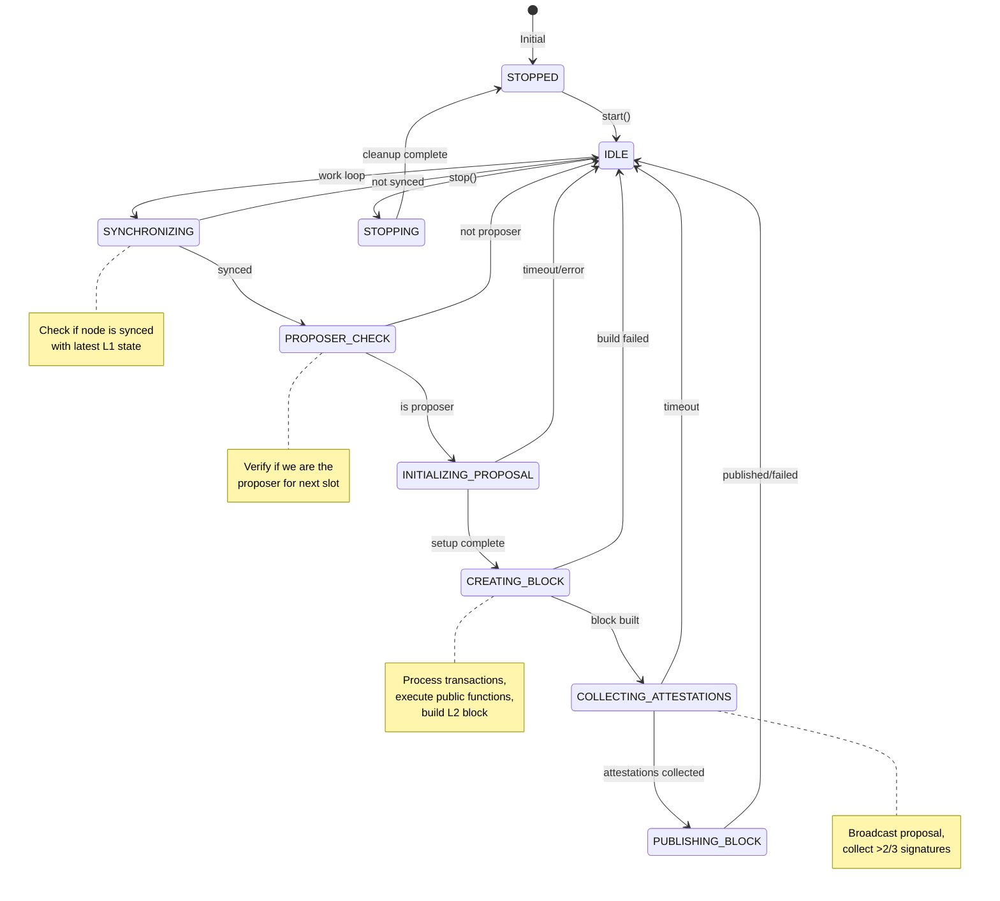
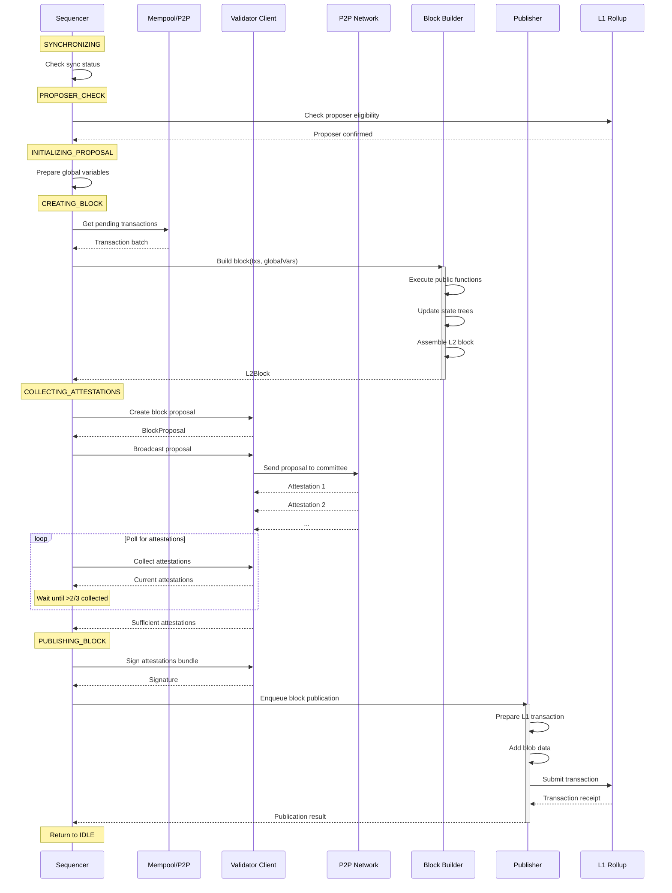
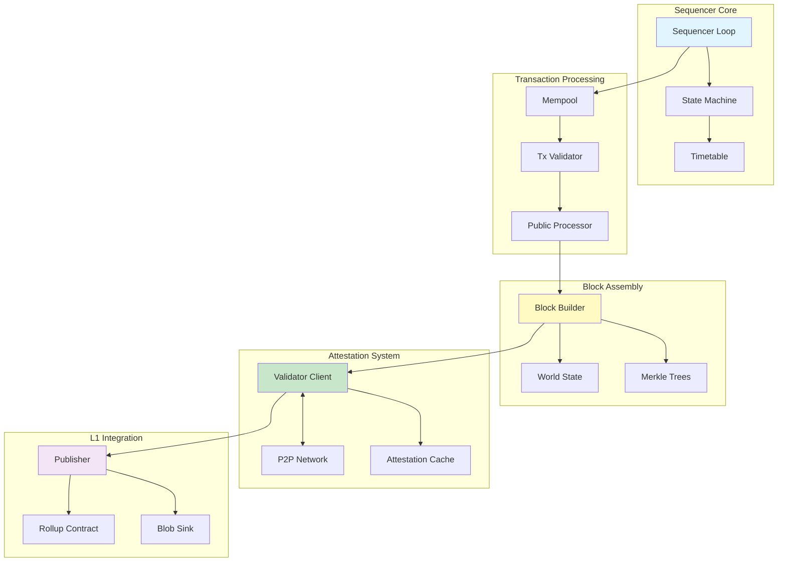
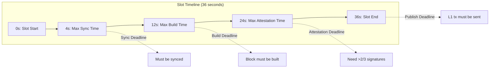

# Sequencer Client

The sequencer is a module responsible for creating and publishing new rollup blocks. This involves fetching txs from the P2P pool, ordering them, executing any public functions, assembling the L2 block, and posting it to the L1 rollup contract along with any contract deployment public data.

## Overview

The sequencer client is the core component responsible for block production in the Aztec network. It coordinates the entire block building process when a validator is selected as the proposer for a slot. The client operates as a continuous loop that monitors for proposal opportunities and executes the full block production pipeline when eligible.

## Block Building Process

### High-Level Flow

The sequencer follows a sophisticated state machine to build and publish blocks:

1. **Synchronization**: Ensure all components are synced to the latest chain state
2. **Proposer Check**: Verify eligibility to propose in the next slot
3. **Block Assembly**: Collect transactions and build the L2 block
4. **Attestation Collection**: Gather signatures from committee members
5. **L1 Publication**: Submit the attested block to the rollup contract

### Sequencer States

The sequencer transitions through multiple states during block production:

### Detailed State Behaviors

| State | Description | Actions | Transitions |
|-------|-------------|---------|-------------|
| **IDLE** | Waiting for next work cycle | Monitor slot progression | → SYNCHRONIZING |
| **SYNCHRONIZING** | Checking sync status | Verify chain tip, pending blocks | → PROPOSER_CHECK or IDLE |
| **PROPOSER_CHECK** | Validating proposer eligibility | Check committee, verify slot assignment | → INITIALIZING_PROPOSAL or IDLE |
| **INITIALIZING_PROPOSAL** | Setting up block proposal | Prepare global variables, enqueue actions | → CREATING_BLOCK |
| **CREATING_BLOCK** | Building the L2 block | Process txs, update state, create block | → COLLECTING_ATTESTATIONS |
| **COLLECTING_ATTESTATIONS** | Gathering committee signatures | Broadcast proposal, poll attestations | → PUBLISHING_BLOCK |
| **PUBLISHING_BLOCK** | Submitting to L1 | Send transaction to rollup contract | → IDLE |

## Component Interactions

### Sequence Diagram: Block Production

### Detailed Component Interactions

## Components

### Core Components

- **Block Builder**: Responsible for assembling an L2 block from processed transactions. This involves:
  - Executing public function calls via the public processor
  - Updating world state trees (note tree, nullifier tree, public data tree)
  - Building the L2 block object with all transaction effects
  - Ensuring block validity and size constraints

- **Publisher**: Handles sending L1 transactions to the rollup and contract deployment emitter contracts. Responsibilities include:
  - Assembling Ethereum transactions with proper encoding
  - Managing gas settings and blob data submission
  - Monitoring transaction inclusion and handling failures
  - Coordinating with slashing and governance actions

- **Public Processor**: Executes public function calls in transactions. Key features:
  - Access to latest data trees for state reads
  - Gas metering and limits enforcement
  - Revert handling and side effect collection
  - Integration with VM for contract execution

- **Validator Client**: Manages attestation and proposal logic:
  - Creates and signs block proposals
  - Collects attestations from committee members
  - Broadcasts proposals via P2P network
  - Handles signature aggregation

### Time Management

The sequencer uses a timetable to manage timing constraints within a slot:

### Configuration

Key configuration parameters:

| Parameter | Description | Default |
|-----------|-------------|---------|
| `transactionPollingIntervalMS` | How often to check for new transactions | 1000ms |
| `maxTxsPerBlock` | Maximum transactions per block | 32 |
| `minTxsPerBlock` | Minimum transactions to build a block | 1 |
| `maxBlockSizeInBytes` | Maximum block size | 1MB |
| `maxL1TxInclusionTimeIntoSlot` | Latest time to include L1→L2 messages | 0s |
| `attestationPropagationTime` | Time for attestations to propagate | 4s |
| `enforceTimeTable` | Whether to enforce timing constraints | false |

## Transaction Selection and Ordering

The sequencer selects and orders transactions following these rules:

1. **Validation**: Transactions must pass validation (signatures, fees, nonces)
2. **Prioritization**: Higher fee transactions are prioritized
3. **L1 Messages**: L1→L2 messages are included based on timing constraints
4. **Gas Limits**: Block gas limits are enforced for both DA and L2 gas
5. **Size Limits**: Block size and blob field limits are respected

## Failure Handling

The sequencer includes robust failure handling:

### Invalid Block Detection

When the sequencer detects invalid blocks on the pending chain:
- Automatically prepares invalidation transactions
- Can submit invalidation even when not the proposer
- Ensures chain integrity is maintained

### Attestation Timeouts

If insufficient attestations are collected:
- Block proposal is abandoned
- Slot remains empty
- State is rolled back
- Next slot proceeds normally

### L1 Submission Failures

If L1 submission fails:
- Transaction is retried with adjusted gas
- Block may be re-proposed in next slot if still valid
- Publisher tracks and reports failed actions

## Metrics and Monitoring

The sequencer exposes comprehensive metrics:

- **Block Metrics**: Built, published, failed blocks
- **Attestation Metrics**: Collection rate, timeouts
- **Timing Metrics**: Time spent in each state
- **Gas Metrics**: L1 gas used, blob gas consumed
- **Transaction Metrics**: Processed, failed, dropped transactions

## Integration with Other Components

### Epoch Cache
- Provides committee and proposer information
- Caches validator data for quick lookups
- Manages epoch transitions

### Slasher Client
- Reports invalid block proposals
- Generates slashing actions for misbehavior
- Coordinates with publisher for slashing votes

### World State Synchronizer
- Ensures consistent view of chain state
- Manages fork resolution
- Commits state changes after L1 confirmation

## Future Improvements

Planned enhancements include:
- Multiple transaction selection strategies
- Dynamic gas pricing
- Parallel transaction processing
- Enhanced reorg handling
- Improved attestation aggregation