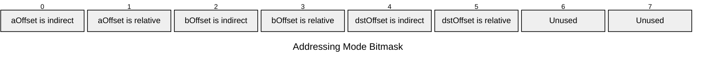
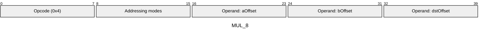
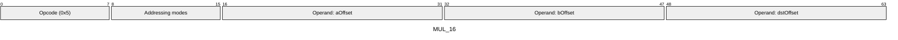
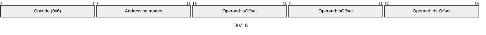
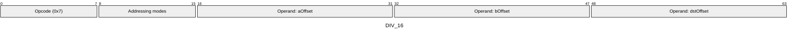
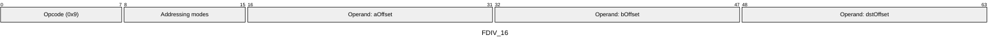
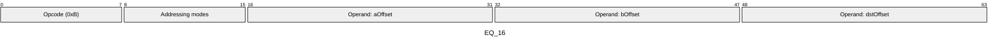
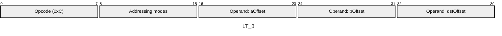
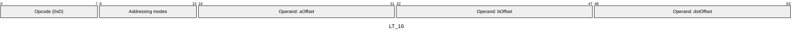

# Instruction Set Details

Comprehensive reference for all Aztec Virtual Machine (AVM) instructions. The AVM is the virtual machine used for **public execution** in the Aztec protocol. This is _not_ a specification of the ACIR instruction set used for private execution.

For a quick overview, see [Instruction Set Quick Reference](avm-isa-quick-reference.md).

## Definitions and Notes

- **`M[x]`**: Denotes the value in memory at offset `x`, or sometimes the "value after memory offset operand x is fully resolved and accessed".
- **`T[x]`**: Denotes the type tag of the memory cell at offset `x`. Tags include `FIELD`, `UINT1`, `UINT8`, `UINT16`, `UINT32`, `UINT64` and `UINT128`.
- **Immediate**: A constant value encoded directly in the bytecode that does not require a memory read to access.
- **`pc++`**: Every instruction increments the program counter (`PC`) by its instruction size (in bytes) unless it performs explicit control flow (jumps, internal calls/returns, calls/returns/reverts) or encounters an error.
- **Gas metering**: Every instruction has an associated gas cost (L2 and DA components). If insufficient gas remains when an instruction is reached, execution halts with an out-of-gas error. This error condition is implicit for all instructions and is not explicitly listed in each instruction's error conditions.
- **`mod 2^k`**: All arithmetic operations are performed modulo 2^k, where `k` is the bit-width of the operand type (e.g., k=8 for `UINT8`, k=254 for `FIELD`).
- **`mod p`**: Field operations are performed modulo the BN254 field prime `p = 21888242871839275222246405745257275088548364400416034343698204186575808495617`.
- **`storage[address][slot]`**: Denotes the value in persistent storage at the given contract address and storage slot.

## Instructions

### ADD

Addition (a + b)

Opcodes `0x00`-`0x01` (2 wire formats)

```javascript
M[dstOffset] = M[aOffset] + M[bOffset]
```

#### Details

Performs addition. Both operands must have the same type tag. For integer types (UINT8, UINT16, UINT32, UINT64, UINT128), the operation is performed modulo 2^k where k is the bit-width (e.g., k=8 for UINT8). For FIELD type, the operation is performed modulo p (the BN254 field prime). The result inherits the tag from the operands.

#### Gas Costs

| Component | Value | Scales with |
|-----------|-------|-------------|
| L2 Base | 12 | - |
| DA Base | 0 | - |
| L2 Addressing | 3 | 3 L2 gas per indirect memory offset<br/>3 L2 gas per relative memory offset |

*See [Gas Metering](gas) for details on how gas costs are computed and applied.

#### Operands

| Name | Type | Description |
|------|------|-------------|
| `aOffset` | Memory offset | Memory offset of first input |
| `bOffset` | Memory offset | Memory offset of second input |
| `dstOffset` | Memory offset | Memory offset for result |

#### Wire Formats
See [Wire Format](wire-format) page for an explanation of wire format variants and opcode naming (e.g., why `ADD_8` vs `ADD_16`).

**ADD_8** (Opcode 0x00):


**ADD_16** (Opcode 0x01):


#### Addressing Modes
See [Addressing](addressing) page for a detailed explanation.

8-bit bitmask: 2 bits per memory offset operand (indirect flag + relative flag)

Memory offset operands (`aOffset`, `bOffset`, `dstOffset`) are encoded as follows:



#### Tag Checks

- `T[aOffset] == T[bOffset]`

#### Tag Updates

- `T[dstOffset] = T[aOffset]`

#### Error Conditions

- **TAG_MISMATCH**: Operands have different type tags
- **MEMORY_ACCESS_OUT_OF_RANGE**: Memory offset operand exceeds addressable memory

---

### SUB

Subtraction (a - b)

Opcodes `0x02`-`0x03` (2 wire formats)

```javascript
M[dstOffset] = M[aOffset] - M[bOffset]
```

#### Details

Performs subtraction. Both operands must have the same type tag. For integer types (UINT8, UINT16, UINT32, UINT64, UINT128), the operation is performed modulo 2^k where k is the bit-width (e.g., k=8 for UINT8). For FIELD type, the operation is performed modulo p (the BN254 field prime). The result inherits the tag from the operands.

#### Gas Costs

| Component | Value | Scales with |
|-----------|-------|-------------|
| L2 Base | 12 | - |
| DA Base | 0 | - |
| L2 Addressing | 3 | 3 L2 gas per indirect memory offset<br/>3 L2 gas per relative memory offset |

*See [Gas Metering](gas) for details on how gas costs are computed and applied.

#### Operands

| Name | Type | Description |
|------|------|-------------|
| `aOffset` | Memory offset | Memory offset of the minuend |
| `bOffset` | Memory offset | Memory offset of the subtrahend |
| `dstOffset` | Memory offset | Memory offset for result |

#### Wire Formats
See [Wire Format](wire-format) page for an explanation of wire format variants and opcode naming (e.g., why `ADD_8` vs `ADD_16`).

**SUB_8** (Opcode 0x02):


**SUB_16** (Opcode 0x03):


#### Addressing Modes
See [Addressing](addressing) page for a detailed explanation.

8-bit bitmask: 2 bits per memory offset operand (indirect flag + relative flag)

Memory offset operands (`aOffset`, `bOffset`, `dstOffset`) are encoded as follows:


#### Tag Checks

- `T[aOffset] == T[bOffset]`

#### Tag Updates

- `T[dstOffset] = T[aOffset]`

#### Error Conditions

- **TAG_MISMATCH**: Operands have different type tags
- **MEMORY_ACCESS_OUT_OF_RANGE**: Memory offset operand exceeds addressable memory

---

### MUL

Multiplication (a * b)

Opcodes `0x04`-`0x05` (2 wire formats)

```javascript
M[dstOffset] = M[aOffset] * M[bOffset]
```

#### Details

Performs multiplication. Both operands must have the same type tag. For integer types (UINT8, UINT16, UINT32, UINT64, UINT128), the operation is performed modulo 2^k where k is the bit-width (e.g., k=8 for UINT8). For FIELD type, the operation is performed modulo p (the BN254 field prime). The result inherits the tag from the operands.

#### Gas Costs

| Component | Value | Scales with |
|-----------|-------|-------------|
| L2 Base | 27 | - |
| DA Base | 0 | - |
| L2 Addressing | 3 | 3 L2 gas per indirect memory offset<br/>3 L2 gas per relative memory offset |

*See [Gas Metering](gas) for details on how gas costs are computed and applied.

#### Operands

| Name | Type | Description |
|------|------|-------------|
| `aOffset` | Memory offset | Memory offset of the first factor |
| `bOffset` | Memory offset | Memory offset of the second factor |
| `dstOffset` | Memory offset | Memory offset for result |

#### Wire Formats
See [Wire Format](wire-format) page for an explanation of wire format variants and opcode naming (e.g., why `ADD_8` vs `ADD_16`).

**MUL_8** (Opcode 0x04):



**MUL_16** (Opcode 0x05):



#### Addressing Modes
See [Addressing](addressing) page for a detailed explanation.

8-bit bitmask: 2 bits per memory offset operand (indirect flag + relative flag)

Memory offset operands (`aOffset`, `bOffset`, `dstOffset`) are encoded as follows:


#### Tag Checks

- `T[aOffset] == T[bOffset]`

#### Tag Updates

- `T[dstOffset] = T[aOffset]`

#### Error Conditions

- **TAG_MISMATCH**: Operands have different type tags
- **MEMORY_ACCESS_OUT_OF_RANGE**: Memory offset operand exceeds addressable memory

---

### DIV

Integer division (a / b)

Opcodes `0x06`-`0x07` (2 wire formats)

```javascript
M[dstOffset] = M[aOffset] / M[bOffset]
```

#### Details

Performs integer division (truncating). Both operands must have the same integral type tag (not FIELD). The result inherits the tag from the operands.

#### Gas Costs

| Component | Value | Scales with |
|-----------|-------|-------------|
| L2 Base | 27 | - |
| DA Base | 0 | - |
| L2 Addressing | 3 | 3 L2 gas per indirect memory offset<br/>3 L2 gas per relative memory offset |

*See [Gas Metering](gas) for details on how gas costs are computed and applied.

#### Operands

| Name | Type | Description |
|------|------|-------------|
| `aOffset` | Memory offset | Memory offset of the dividend |
| `bOffset` | Memory offset | Memory offset of the divisor |
| `dstOffset` | Memory offset | Memory offset for quotient |

#### Wire Formats
See [Wire Format](wire-format) page for an explanation of wire format variants and opcode naming (e.g., why `ADD_8` vs `ADD_16`).

**DIV_8** (Opcode 0x06):



**DIV_16** (Opcode 0x07):



#### Addressing Modes
See [Addressing](addressing) page for a detailed explanation.

8-bit bitmask: 2 bits per memory offset operand (indirect flag + relative flag)

Memory offset operands (`aOffset`, `bOffset`, `dstOffset`) are encoded as follows:


#### Tag Checks

- `T[aOffset] == T[bOffset]`
- `T[aOffset] is integral`

#### Tag Updates

- `T[dstOffset] = T[aOffset]`

#### Error Conditions

- **TAG_MISMATCH**: Operands have different type tags
- **INVALID_TAG_TYPE**: Operands are not integral types
- **DIVISION_BY_ZERO**: Second operand (divisor) is zero
- **MEMORY_ACCESS_OUT_OF_RANGE**: Memory offset operand exceeds addressable memory

---

### FDIV

Field division (a / b)

Opcodes `0x08`-`0x09` (2 wire formats)

```javascript
M[dstOffset] = M[aOffset] / M[bOffset]
```

#### Details

Performs field division (computes a * b^(-1) mod p where p is the BN254 field modulus). Both operands must have FIELD type tag.

#### Gas Costs

| Component | Value | Scales with |
|-----------|-------|-------------|
| L2 Base | 9 | - |
| DA Base | 0 | - |
| L2 Addressing | 3 | 3 L2 gas per indirect memory offset<br/>3 L2 gas per relative memory offset |

*See [Gas Metering](gas) for details on how gas costs are computed and applied.

#### Operands

| Name | Type | Description |
|------|------|-------------|
| `aOffset` | Memory offset | Memory offset of the dividend |
| `bOffset` | Memory offset | Memory offset of the divisor |
| `dstOffset` | Memory offset | Memory offset for result |

#### Wire Formats
See [Wire Format](wire-format) page for an explanation of wire format variants and opcode naming (e.g., why `ADD_8` vs `ADD_16`).

**FDIV_8** (Opcode 0x08):


**FDIV_16** (Opcode 0x09):



#### Addressing Modes
See [Addressing](addressing) page for a detailed explanation.

8-bit bitmask: 2 bits per memory offset operand (indirect flag + relative flag)

Memory offset operands (`aOffset`, `bOffset`, `dstOffset`) are encoded as follows:


#### Tag Checks

- `T[aOffset] == T[bOffset]`
- `T[aOffset] == FIELD`

#### Tag Updates

- `T[dstOffset] = FIELD`

#### Error Conditions

- **TAG_MISMATCH**: Operands have different type tags
- **INVALID_TAG_TYPE**: Operands do not have FIELD type tag
- **DIVISION_BY_ZERO**: Second operand (divisor) is zero
- **MEMORY_ACCESS_OUT_OF_RANGE**: Memory offset operand exceeds addressable memory

---

### EQ

Equality check (a == b)

Opcodes `0x0A`-`0x0B` (2 wire formats)

```javascript
M[dstOffset] = (M[aOffset] == M[bOffset]) ? 1 : 0
```

#### Details

Compares two values for equality. Both operands must have the same type tag. The result is a Uint1 (0 or 1).

#### Gas Costs

| Component | Value | Scales with |
|-----------|-------|-------------|
| L2 Base | 12 | - |
| DA Base | 0 | - |
| L2 Addressing | 3 | 3 L2 gas per indirect memory offset<br/>3 L2 gas per relative memory offset |

*See [Gas Metering](gas) for details on how gas costs are computed and applied.

#### Operands

| Name | Type | Description |
|------|------|-------------|
| `aOffset` | Memory offset | Memory offset of first value to compare |
| `bOffset` | Memory offset | Memory offset of second value to compare |
| `dstOffset` | Memory offset | Memory offset for result (0 or 1) |

#### Wire Formats
See [Wire Format](wire-format) page for an explanation of wire format variants and opcode naming (e.g., why `ADD_8` vs `ADD_16`).

**EQ_8** (Opcode 0x0A):


**EQ_16** (Opcode 0x0B):



#### Addressing Modes
See [Addressing](addressing) page for a detailed explanation.

8-bit bitmask: 2 bits per memory offset operand (indirect flag + relative flag)

Memory offset operands (`aOffset`, `bOffset`, `dstOffset`) are encoded as follows:


#### Tag Checks

- `T[aOffset] == T[bOffset]`

#### Tag Updates

- `T[dstOffset] = UINT1`

#### Error Conditions

- **TAG_MISMATCH**: Operands have different type tags
- **MEMORY_ACCESS_OUT_OF_RANGE**: Memory offset operand exceeds addressable memory

---

### LT

Less than (a &lt; b)

Opcodes `0x0C`-`0x0D` (2 wire formats)

```javascript
M[dstOffset] = (M[aOffset] < M[bOffset]) ? 1 : 0
```

#### Details

Compares two values. Both operands must have the same type tag. For integer types, performs standard numeric comparison. For FIELD type, performs lexicographic comparison treating field elements as integers (0 < 1 < ... < p-1). The result is a Uint1 (0 or 1).

#### Gas Costs

| Component | Value | Scales with |
|-----------|-------|-------------|
| L2 Base | 42 | - |
| DA Base | 0 | - |
| L2 Addressing | 3 | 3 L2 gas per indirect memory offset<br/>3 L2 gas per relative memory offset |

*See [Gas Metering](gas) for details on how gas costs are computed and applied.

#### Operands

| Name | Type | Description |
|------|------|-------------|
| `aOffset` | Memory offset | Memory offset of first value to compare |
| `bOffset` | Memory offset | Memory offset of second value to compare |
| `dstOffset` | Memory offset | Memory offset for result (0 or 1) |

#### Wire Formats
See [Wire Format](wire-format) page for an explanation of wire format variants and opcode naming (e.g., why `ADD_8` vs `ADD_16`).

**LT_8** (Opcode 0x0C):



**LT_16** (Opcode 0x0D):



#### Addressing Modes
See [Addressing](addressing) page for a detailed explanation.

8-bit bitmask: 2 bits per memory offset operand (indirect flag + relative flag)

Memory offset operands (`aOffset`, `bOffset`, `dstOffset`) are encoded as follows:

```mermaid
---
title: "Addressing Mode Bitmask"
config:
  packet:
    bitWidth: 128
    bitsPerRow: 8
---
packet-beta
  0: "aOffset is indirect"
  1: "aOffset is relative"
  2: "bOffset is indirect"
  3: "bOffset is relative"
  4: "dstOffset is indirect"
  5: "dstOffset is relative"
  6: "Unused"
  7: "Unused"
```

#### Tag Checks

- `T[aOffset] == T[bOffset]`

#### Tag Updates

- `T[dstOffset] = UINT1`

#### Error Conditions

- **TAG_MISMATCH**: Operands have different type tags
- **MEMORY_ACCESS_OUT_OF_RANGE**: Memory offset operand exceeds addressable memory

---

### LTE

Less than or equal (a &lt;= b)

Opcodes `0x0E`-`0x0F` (2 wire formats)

```javascript
M[dstOffset] = (M[aOffset] <= M[bOffset]) ? 1 : 0
```

#### Details

Compares two values. Both operands must have the same type tag. For integer types, performs standard numeric comparison. For FIELD type, performs lexicographic comparison treating field elements as integers (0 < 1 < ... < p-1). The result is a Uint1 (0 or 1).

#### Gas Costs

| Component | Value | Scales with |
|-----------|-------|-------------|
| L2 Base | 42 | - |
| DA Base | 0 | - |
| L2 Addressing | 3 | 3 L2 gas per indirect memory offset<br/>3 L2 gas per relative memory offset |

*See [Gas Metering](gas) for details on how gas costs are computed and applied.

#### Operands

| Name | Type | Description |
|------|------|-------------|
| `aOffset` | Memory offset | Memory offset of first value to compare |
| `bOffset` | Memory offset | Memory offset of second value to compare |
| `dstOffset` | Memory offset | Memory offset for result (0 or 1) |

#### Wire Formats
See [Wire Format](wire-format) page for an explanation of wire format variants and opcode naming (e.g., why `ADD_8` vs `ADD_16`).

**LTE_8** (Opcode 0x0E):

```mermaid
---
title: "LTE_8"
config:
  packet:
    bitsPerRow: 40
---
packet-beta
0-7: "Opcode (0xE)"
8-15: "Addressing modes"
16-23: "Operand: aOffset"
24-31: "Operand: bOffset"
32-39: "Operand: dstOffset"
```

**LTE_16** (Opcode 0x0F):

```mermaid
---
title: "LTE_16"
config:
  packet:
    bitsPerRow: 64
---
packet-beta
0-7: "Opcode (0xF)"
8-15: "Addressing modes"
16-31: "Operand: aOffset"
32-47: "Operand: bOffset"
48-63: "Operand: dstOffset"
```

#### Addressing Modes
See [Addressing](addressing) page for a detailed explanation.

8-bit bitmask: 2 bits per memory offset operand (indirect flag + relative flag)

Memory offset operands (`aOffset`, `bOffset`, `dstOffset`) are encoded as follows:

```mermaid
---
title: "Addressing Mode Bitmask"
config:
  packet:
    bitWidth: 128
    bitsPerRow: 8
---
packet-beta
  0: "aOffset is indirect"
  1: "aOffset is relative"
  2: "bOffset is indirect"
  3: "bOffset is relative"
  4: "dstOffset is indirect"
  5: "dstOffset is relative"
  6: "Unused"
  7: "Unused"
```

#### Tag Checks

- `T[aOffset] == T[bOffset]`

#### Tag Updates

- `T[dstOffset] = UINT1`

#### Error Conditions

- **TAG_MISMATCH**: Operands have different type tags
- **MEMORY_ACCESS_OUT_OF_RANGE**: Memory offset operand exceeds addressable memory

---

### AND

Bitwise AND (a &amp; b)

Opcodes `0x10`-`0x11` (2 wire formats)

```javascript
M[dstOffset] = M[aOffset] & M[bOffset]
```

#### Details

Performs bitwise AND operation. Both operands must have the same integral type tag (UINT1, UINT8, UINT16, UINT32, UINT64, UINT128). The result inherits the tag from the operands.

#### Gas Costs

| Component | Value | Scales with |
|-----------|-------|-------------|
| L2 Base | 12 | - |
| DA Base | 0 | - |
| L2 Addressing | 3 | 3 L2 gas per indirect memory offset<br/>3 L2 gas per relative memory offset |
| L2 Dynamic | 3 | - |

*See [Gas Metering](gas) for details on how gas costs are computed and applied.

#### Operands

| Name | Type | Description |
|------|------|-------------|
| `aOffset` | Memory offset | Memory offset of first input |
| `bOffset` | Memory offset | Memory offset of second input |
| `dstOffset` | Memory offset | Memory offset for result |

#### Wire Formats
See [Wire Format](wire-format) page for an explanation of wire format variants and opcode naming (e.g., why `ADD_8` vs `ADD_16`).

**AND_8** (Opcode 0x10):

```mermaid
---
title: "AND_8"
config:
  packet:
    bitsPerRow: 40
---
packet-beta
0-7: "Opcode (0x10)"
8-15: "Addressing modes"
16-23: "Operand: aOffset"
24-31: "Operand: bOffset"
32-39: "Operand: dstOffset"
```

**AND_16** (Opcode 0x11):

```mermaid
---
title: "AND_16"
config:
  packet:
    bitsPerRow: 64
---
packet-beta
0-7: "Opcode (0x11)"
8-15: "Addressing modes"
16-31: "Operand: aOffset"
32-47: "Operand: bOffset"
48-63: "Operand: dstOffset"
```

#### Addressing Modes
See [Addressing](addressing) page for a detailed explanation.

8-bit bitmask: 2 bits per memory offset operand (indirect flag + relative flag)

Memory offset operands (`aOffset`, `bOffset`, `dstOffset`) are encoded as follows:

```mermaid
---
title: "Addressing Mode Bitmask"
config:
  packet:
    bitWidth: 128
    bitsPerRow: 8
---
packet-beta
  0: "aOffset is indirect"
  1: "aOffset is relative"
  2: "bOffset is indirect"
  3: "bOffset is relative"
  4: "dstOffset is indirect"
  5: "dstOffset is relative"
  6: "Unused"
  7: "Unused"
```

#### Tag Checks

- `T[aOffset] == T[bOffset]`
- `T[aOffset] is integral`

#### Tag Updates

- `T[dstOffset] = T[aOffset]`

#### Error Conditions

- **TAG_MISMATCH**: Operands have different type tags
- **INVALID_TAG_TYPE**: Operands are not integral types
- **MEMORY_ACCESS_OUT_OF_RANGE**: Memory offset operand exceeds addressable memory

---

### OR

Bitwise OR (a | b)

Opcodes `0x12`-`0x13` (2 wire formats)

```javascript
M[dstOffset] = M[aOffset] | M[bOffset]
```

#### Details

Performs bitwise OR operation. Both operands must have the same integral type tag (UINT1, UINT8, UINT16, UINT32, UINT64, UINT128). The result inherits the tag from the operands.

#### Gas Costs

| Component | Value | Scales with |
|-----------|-------|-------------|
| L2 Base | 12 | - |
| DA Base | 0 | - |
| L2 Addressing | 3 | 3 L2 gas per indirect memory offset<br/>3 L2 gas per relative memory offset |
| L2 Dynamic | 3 | - |

*See [Gas Metering](gas) for details on how gas costs are computed and applied.

#### Operands

| Name | Type | Description |
|------|------|-------------|
| `aOffset` | Memory offset | Memory offset of first input |
| `bOffset` | Memory offset | Memory offset of second input |
| `dstOffset` | Memory offset | Memory offset for result |

#### Wire Formats
See [Wire Format](wire-format) page for an explanation of wire format variants and opcode naming (e.g., why `ADD_8` vs `ADD_16`).

**OR_8** (Opcode 0x12):

```mermaid
---
title: "OR_8"
config:
  packet:
    bitsPerRow: 40
---
packet-beta
0-7: "Opcode (0x12)"
8-15: "Addressing modes"
16-23: "Operand: aOffset"
24-31: "Operand: bOffset"
32-39: "Operand: dstOffset"
```

**OR_16** (Opcode 0x13):

```mermaid
---
title: "OR_16"
config:
  packet:
    bitsPerRow: 64
---
packet-beta
0-7: "Opcode (0x13)"
8-15: "Addressing modes"
16-31: "Operand: aOffset"
32-47: "Operand: bOffset"
48-63: "Operand: dstOffset"
```

#### Addressing Modes
See [Addressing](addressing) page for a detailed explanation.

8-bit bitmask: 2 bits per memory offset operand (indirect flag + relative flag)

Memory offset operands (`aOffset`, `bOffset`, `dstOffset`) are encoded as follows:

```mermaid
---
title: "Addressing Mode Bitmask"
config:
  packet:
    bitWidth: 128
    bitsPerRow: 8
---
packet-beta
  0: "aOffset is indirect"
  1: "aOffset is relative"
  2: "bOffset is indirect"
  3: "bOffset is relative"
  4: "dstOffset is indirect"
  5: "dstOffset is relative"
  6: "Unused"
  7: "Unused"
```

#### Tag Checks

- `T[aOffset] == T[bOffset]`
- `T[aOffset] is integral`

#### Tag Updates

- `T[dstOffset] = T[aOffset]`

#### Error Conditions

- **TAG_MISMATCH**: Operands have different type tags
- **INVALID_TAG_TYPE**: Operands are not integral types
- **MEMORY_ACCESS_OUT_OF_RANGE**: Memory offset operand exceeds addressable memory

---

### XOR

Bitwise XOR (a ^ b)

Opcodes `0x14`-`0x15` (2 wire formats)

```javascript
M[dstOffset] = M[aOffset] ^ M[bOffset]
```

#### Details

Performs bitwise XOR operation. Both operands must have the same integral type tag (UINT1, UINT8, UINT16, UINT32, UINT64, UINT128). The result inherits the tag from the operands.

#### Gas Costs

| Component | Value | Scales with |
|-----------|-------|-------------|
| L2 Base | 12 | - |
| DA Base | 0 | - |
| L2 Addressing | 3 | 3 L2 gas per indirect memory offset<br/>3 L2 gas per relative memory offset |
| L2 Dynamic | 3 | - |

*See [Gas Metering](gas) for details on how gas costs are computed and applied.

#### Operands

| Name | Type | Description |
|------|------|-------------|
| `aOffset` | Memory offset | Memory offset of first input |
| `bOffset` | Memory offset | Memory offset of second input |
| `dstOffset` | Memory offset | Memory offset for result |

#### Wire Formats
See [Wire Format](wire-format) page for an explanation of wire format variants and opcode naming (e.g., why `ADD_8` vs `ADD_16`).

**XOR_8** (Opcode 0x14):

```mermaid
---
title: "XOR_8"
config:
  packet:
    bitsPerRow: 40
---
packet-beta
0-7: "Opcode (0x14)"
8-15: "Addressing modes"
16-23: "Operand: aOffset"
24-31: "Operand: bOffset"
32-39: "Operand: dstOffset"
```

**XOR_16** (Opcode 0x15):

```mermaid
---
title: "XOR_16"
config:
  packet:
    bitsPerRow: 64
---
packet-beta
0-7: "Opcode (0x15)"
8-15: "Addressing modes"
16-31: "Operand: aOffset"
32-47: "Operand: bOffset"
48-63: "Operand: dstOffset"
```

#### Addressing Modes
See [Addressing](addressing) page for a detailed explanation.

8-bit bitmask: 2 bits per memory offset operand (indirect flag + relative flag)

Memory offset operands (`aOffset`, `bOffset`, `dstOffset`) are encoded as follows:

```mermaid
---
title: "Addressing Mode Bitmask"
config:
  packet:
    bitWidth: 128
    bitsPerRow: 8
---
packet-beta
  0: "aOffset is indirect"
  1: "aOffset is relative"
  2: "bOffset is indirect"
  3: "bOffset is relative"
  4: "dstOffset is indirect"
  5: "dstOffset is relative"
  6: "Unused"
  7: "Unused"
```

#### Tag Checks

- `T[aOffset] == T[bOffset]`
- `T[aOffset] is integral`

#### Tag Updates

- `T[dstOffset] = T[aOffset]`

#### Error Conditions

- **TAG_MISMATCH**: Operands have different type tags
- **INVALID_TAG_TYPE**: Operands are not integral types
- **MEMORY_ACCESS_OUT_OF_RANGE**: Memory offset operand exceeds addressable memory

---

### NOT

Bitwise NOT (~a)

Opcodes `0x16`-`0x17` (2 wire formats)

```javascript
M[dstOffset] = ~M[srcOffset]
```

#### Details

Performs bitwise NOT operation (one's complement). The operand must have an integral type tag (UINT1, UINT8, UINT16, UINT32, UINT64, UINT128). The result inherits the tag from the operand.

#### Gas Costs

| Component | Value | Scales with |
|-----------|-------|-------------|
| L2 Base | 12 | - |
| DA Base | 0 | - |
| L2 Addressing | 3 | 3 L2 gas per indirect memory offset<br/>3 L2 gas per relative memory offset |

*See [Gas Metering](gas) for details on how gas costs are computed and applied.

#### Operands

| Name | Type | Description |
|------|------|-------------|
| `srcOffset` | Memory offset | Memory offset of the value to negate |
| `dstOffset` | Memory offset | Memory offset for result |

#### Wire Formats
See [Wire Format](wire-format) page for an explanation of wire format variants and opcode naming (e.g., why `ADD_8` vs `ADD_16`).

**NOT_8** (Opcode 0x16):

```mermaid
---
title: "NOT_8"
config:
  packet:
    bitsPerRow: 32
---
packet-beta
0-7: "Opcode (0x16)"
8-15: "Addressing modes"
16-23: "Operand: srcOffset"
24-31: "Operand: dstOffset"
```

**NOT_16** (Opcode 0x17):

```mermaid
---
title: "NOT_16"
config:
  packet:
    bitsPerRow: 48
---
packet-beta
0-7: "Opcode (0x17)"
8-15: "Addressing modes"
16-31: "Operand: srcOffset"
32-47: "Operand: dstOffset"
```

#### Addressing Modes
See [Addressing](addressing) page for a detailed explanation.

8-bit bitmask: 2 bits per memory offset operand (indirect flag + relative flag)

Memory offset operands (`srcOffset`, `dstOffset`) are encoded as follows:

```mermaid
---
title: "Addressing Mode Bitmask"
config:
  packet:
    bitWidth: 128
    bitsPerRow: 8
---
packet-beta
  0: "srcOffset is indirect"
  1: "srcOffset is relative"
  2: "dstOffset is indirect"
  3: "dstOffset is relative"
  4: "Unused"
  5: "Unused"
  6: "Unused"
  7: "Unused"
```

#### Tag Checks

- `T[srcOffset] is integral`

#### Tag Updates

- `T[dstOffset] = T[srcOffset]`

#### Error Conditions

- **INVALID_TAG_TYPE**: Operand is not an integral type
- **MEMORY_ACCESS_OUT_OF_RANGE**: Memory offset operand exceeds addressable memory

---

### SHL

Shift left (a &lt;&lt; b)

Opcodes `0x18`-`0x19` (2 wire formats)

```javascript
M[dstOffset] = M[aOffset] << M[bOffset]
```

#### Details

Performs left bit shift. Both operands must have the same integral type tag (UINT1, UINT8, UINT16, UINT32, UINT64, UINT128). The result is computed modulo 2^k where k is the bit-width of the operand type (e.g., k=8 for UINT8). The result inherits the tag from the operands.

#### Gas Costs

| Component | Value | Scales with |
|-----------|-------|-------------|
| L2 Base | 18 | - |
| DA Base | 0 | - |
| L2 Addressing | 3 | 3 L2 gas per indirect memory offset<br/>3 L2 gas per relative memory offset |

*See [Gas Metering](gas) for details on how gas costs are computed and applied.

#### Operands

| Name | Type | Description |
|------|------|-------------|
| `aOffset` | Memory offset | Memory offset of the value to shift |
| `bOffset` | Memory offset | Memory offset of the shift amount |
| `dstOffset` | Memory offset | Memory offset for result |

#### Wire Formats
See [Wire Format](wire-format) page for an explanation of wire format variants and opcode naming (e.g., why `ADD_8` vs `ADD_16`).

**SHL_8** (Opcode 0x18):

```mermaid
---
title: "SHL_8"
config:
  packet:
    bitsPerRow: 40
---
packet-beta
0-7: "Opcode (0x18)"
8-15: "Addressing modes"
16-23: "Operand: aOffset"
24-31: "Operand: bOffset"
32-39: "Operand: dstOffset"
```

**SHL_16** (Opcode 0x19):

```mermaid
---
title: "SHL_16"
config:
  packet:
    bitsPerRow: 64
---
packet-beta
0-7: "Opcode (0x19)"
8-15: "Addressing modes"
16-31: "Operand: aOffset"
32-47: "Operand: bOffset"
48-63: "Operand: dstOffset"
```

#### Addressing Modes
See [Addressing](addressing) page for a detailed explanation.

8-bit bitmask: 2 bits per memory offset operand (indirect flag + relative flag)

Memory offset operands (`aOffset`, `bOffset`, `dstOffset`) are encoded as follows:

```mermaid
---
title: "Addressing Mode Bitmask"
config:
  packet:
    bitWidth: 128
    bitsPerRow: 8
---
packet-beta
  0: "aOffset is indirect"
  1: "aOffset is relative"
  2: "bOffset is indirect"
  3: "bOffset is relative"
  4: "dstOffset is indirect"
  5: "dstOffset is relative"
  6: "Unused"
  7: "Unused"
```

#### Tag Checks

- `T[aOffset] == T[bOffset]`

#### Tag Updates

- `T[dstOffset] = T[aOffset]`

#### Error Conditions

- **TAG_MISMATCH**: Operands have different type tags
- **MEMORY_ACCESS_OUT_OF_RANGE**: Memory offset operand exceeds addressable memory

---

### SHR

Shift right (a &gt;&gt; b)

Opcodes `0x1A`-`0x1B` (2 wire formats)

```javascript
M[dstOffset] = M[aOffset] >> M[bOffset]
```

#### Details

Performs right bit shift (logical, zero-fill). Both operands must have the same integral type tag (UINT1, UINT8, UINT16, UINT32, UINT64, UINT128). The result inherits the tag from the operands.

#### Gas Costs

| Component | Value | Scales with |
|-----------|-------|-------------|
| L2 Base | 18 | - |
| DA Base | 0 | - |
| L2 Addressing | 3 | 3 L2 gas per indirect memory offset<br/>3 L2 gas per relative memory offset |

*See [Gas Metering](gas) for details on how gas costs are computed and applied.

#### Operands

| Name | Type | Description |
|------|------|-------------|
| `aOffset` | Memory offset | Memory offset of the value to shift |
| `bOffset` | Memory offset | Memory offset of the shift amount |
| `dstOffset` | Memory offset | Memory offset for result |

#### Wire Formats
See [Wire Format](wire-format) page for an explanation of wire format variants and opcode naming (e.g., why `ADD_8` vs `ADD_16`).

**SHR_8** (Opcode 0x1A):

```mermaid
---
title: "SHR_8"
config:
  packet:
    bitsPerRow: 40
---
packet-beta
0-7: "Opcode (0x1A)"
8-15: "Addressing modes"
16-23: "Operand: aOffset"
24-31: "Operand: bOffset"
32-39: "Operand: dstOffset"
```

**SHR_16** (Opcode 0x1B):

```mermaid
---
title: "SHR_16"
config:
  packet:
    bitsPerRow: 64
---
packet-beta
0-7: "Opcode (0x1B)"
8-15: "Addressing modes"
16-31: "Operand: aOffset"
32-47: "Operand: bOffset"
48-63: "Operand: dstOffset"
```

#### Addressing Modes
See [Addressing](addressing) page for a detailed explanation.

8-bit bitmask: 2 bits per memory offset operand (indirect flag + relative flag)

Memory offset operands (`aOffset`, `bOffset`, `dstOffset`) are encoded as follows:

```mermaid
---
title: "Addressing Mode Bitmask"
config:
  packet:
    bitWidth: 128
    bitsPerRow: 8
---
packet-beta
  0: "aOffset is indirect"
  1: "aOffset is relative"
  2: "bOffset is indirect"
  3: "bOffset is relative"
  4: "dstOffset is indirect"
  5: "dstOffset is relative"
  6: "Unused"
  7: "Unused"
```

#### Tag Checks

- `T[aOffset] == T[bOffset]`

#### Tag Updates

- `T[dstOffset] = T[aOffset]`

#### Error Conditions

- **TAG_MISMATCH**: Operands have different type tags
- **MEMORY_ACCESS_OUT_OF_RANGE**: Memory offset operand exceeds addressable memory

---

### CAST

Type cast memory value

Opcodes `0x1C`-`0x1D` (2 wire formats)

```javascript
M[dstOffset] = M[srcOffset] as tag
```

#### Details

Changes the type tag of a value. The value itself is preserved if casting to a larger type. When casting to a smaller type, the value is truncated by keeping only the least significant bits that fit in the destination type (equivalent to modulo 2^k where k is the bit-width of the destination type).

#### Gas Costs

| Component | Value | Scales with |
|-----------|-------|-------------|
| L2 Base | 27 | - |
| DA Base | 0 | - |
| L2 Addressing | 3 | 3 L2 gas per indirect memory offset<br/>3 L2 gas per relative memory offset |

*See [Gas Metering](gas) for details on how gas costs are computed and applied.

#### Operands

| Name | Type | Description |
|------|------|-------------|
| `srcOffset` | Memory offset | Memory offset of the value to cast |
| `dstOffset` | Memory offset | Memory offset for casted value |
| `dstTag` | Type tag | Type tag to cast the value to |

#### Wire Formats
See [Wire Format](wire-format) page for an explanation of wire format variants and opcode naming (e.g., why `ADD_8` vs `ADD_16`).

**CAST_8** (Opcode 0x1C):

```mermaid
---
title: "CAST_8"
config:
  packet:
    bitsPerRow: 40
---
packet-beta
0-7: "Opcode (0x1C)"
8-15: "Addressing modes"
16-23: "Operand: srcOffset"
24-31: "Operand: dstOffset"
32-39: "Operand: dstTag"
```

**CAST_16** (Opcode 0x1D):

```mermaid
---
title: "CAST_16"
config:
  packet:
    bitsPerRow: 56
---
packet-beta
0-7: "Opcode (0x1D)"
8-15: "Addressing modes"
16-31: "Operand: srcOffset"
32-47: "Operand: dstOffset"
48-55: "Operand: dstTag"
```

#### Addressing Modes
See [Addressing](addressing) page for a detailed explanation.

8-bit bitmask: 2 bits per memory offset operand (indirect flag + relative flag)

Memory offset operands (`srcOffset`, `dstOffset`) are encoded as follows:

```mermaid
---
title: "Addressing Mode Bitmask"
config:
  packet:
    bitWidth: 128
    bitsPerRow: 8
---
packet-beta
  0: "srcOffset is indirect"
  1: "srcOffset is relative"
  2: "dstOffset is indirect"
  3: "dstOffset is relative"
  4: "Unused"
  5: "Unused"
  6: "Unused"
  7: "Unused"
```

#### Tag Updates

- `T[dstOffset] = dstTag`

#### Error Conditions

- **INVALID_TAG**: Destination tag is not a valid TypeTag
- **MEMORY_ACCESS_OUT_OF_RANGE**: Memory offset operand exceeds addressable memory

---

### GETENVVAR

Get environment variable

Opcode `0x1E`

```javascript
M[dstOffset] = environmentVariable[varEnum]
```

#### Details

Retrieves environment variables from the currently executing context. "Environment" refers to information specific to the current execution context, with some information specific to the block (e.g., BLOCKNUMBER, TIMESTAMP), some to the transaction (e.g., TRANSACTIONFEE), and some to the currently executing contract call (e.g., ADDRESS, SENDER, gas remaining). The variable is specified by an immediate enum value. Supported enum values: `[ADDRESS=0, SENDER, TRANSACTIONFEE, CHAINID, VERSION, BLOCKNUMBER, TIMESTAMP, BASEFEEPERL2GAS, BASEFEEPERDAGAS, ISSTATICCALL, L2GASLEFT, DAGASLEFT]`.

#### Gas Costs

| Component | Value | Scales with |
|-----------|-------|-------------|
| L2 Base | 12 | - |
| DA Base | 0 | - |
| L2 Addressing | 3 | 3 L2 gas per indirect memory offset<br/>3 L2 gas per relative memory offset |

*See [Gas Metering](gas) for details on how gas costs are computed and applied.

#### Operands

| Name | Type | Description |
|------|------|-------------|
| `dstOffset` | Memory offset | Memory offset |
| `varEnum` | Memory offset | Immediate value specifying which environment variable to read |

#### Wire Formats
See [Wire Format](wire-format) page for an explanation of wire format variants and opcode naming (e.g., why `ADD_8` vs `ADD_16`).

**GETENVVAR_16** (Opcode 0x1E):

```mermaid
---
title: "GETENVVAR_16"
config:
  packet:
    bitsPerRow: 40
---
packet-beta
0-7: "Opcode (0x1E)"
8-15: "Addressing modes"
16-31: "Operand: dstOffset"
32-39: "Operand: varEnum"
```

#### Addressing Modes
See [Addressing](addressing) page for a detailed explanation.

8-bit bitmask: 2 bits per memory offset operand (indirect flag + relative flag)

Memory offset operands (`dstOffset`) are encoded as follows:

```mermaid
---
title: "Addressing Mode Bitmask"
config:
  packet:
    bitWidth: 128
    bitsPerRow: 8
---
packet-beta
  0: "dstOffset is indirect"
  1: "dstOffset is relative"
  2: "Unused"
  3: "Unused"
  4: "Unused"
  5: "Unused"
  6: "Unused"
  7: "Unused"
```

#### Tag Updates

- `T[dstOffset] = FIELD`

#### Error Conditions

- **INVALID_ENV_VAR**: Env var enum is not in the range of valid enum values
- **MEMORY_ACCESS_OUT_OF_RANGE**: Memory offset operand exceeds addressable memory

---

### CALLDATACOPY

Copy calldata to memory

Opcode `0x1F`

```javascript
M[dstOffset:dstOffset+M[copySizeOffset]] = calldata[M[cdStartOffset]:M[cdStartOffset]+M[copySizeOffset]]
```

#### Details

Copies a section of the current call's calldata into memory at the specified offset. Reads M[copySizeOffset] elements starting at calldata offset M[cdStartOffset], writing them to memory starting at dstOffset. If the read extends past the end of calldata, the out-of-bounds region is padded with zeros. If the write would exceed addressable memory, the instruction errors.

#### Gas Costs

| Component | Value | Scales with |
|-----------|-------|-------------|
| L2 Base | 18 | - |
| DA Base | 0 | - |
| L2 Addressing | 3 | 3 L2 gas per indirect memory offset<br/>3 L2 gas per relative memory offset |
| L2 Dynamic | 3 | `M[copySizeOffset]` |

*See [Gas Metering](gas) for details on how gas costs are computed and applied.

#### Operands

| Name | Type | Description |
|------|------|-------------|
| `copySizeOffset` | Memory offset | Memory offset of the number of elements to copy |
| `cdStartOffset` | Memory offset | Memory offset of the calldata start index to copy from |
| `dstOffset` | Memory offset | Memory offset for writing calldata |

#### Wire Formats
See [Wire Format](wire-format) page for an explanation of wire format variants and opcode naming (e.g., why `ADD_8` vs `ADD_16`).

**CALLDATACOPY** (Opcode 0x1F):

```mermaid
---
title: "CALLDATACOPY"
config:
  packet:
    bitsPerRow: 64
---
packet-beta
0-7: "Opcode (0x1F)"
8-15: "Addressing modes"
16-31: "Operand: copySizeOffset"
32-47: "Operand: cdStartOffset"
48-63: "Operand: dstOffset"
```

#### Addressing Modes
See [Addressing](addressing) page for a detailed explanation.

8-bit bitmask: 2 bits per memory offset operand (indirect flag + relative flag)

Memory offset operands (`copySizeOffset`, `cdStartOffset`, `dstOffset`) are encoded as follows:

```mermaid
---
title: "Addressing Mode Bitmask"
config:
  packet:
    bitWidth: 128
    bitsPerRow: 8
---
packet-beta
  0: "copySizeOffset is indirect"
  1: "copySizeOffset is relative"
  2: "cdStartOffset is indirect"
  3: "cdStartOffset is relative"
  4: "dstOffset is indirect"
  5: "dstOffset is relative"
  6: "Unused"
  7: "Unused"
```

#### Tag Checks

- `T[copySizeOffset] == UINT32`

#### Tag Updates

- `T[dstOffset:dstOffset+M[copySizeOffset]] = FIELD`

#### Error Conditions

- **INVALID_TAG**: Size operand is not Uint32
- **MEMORY_ACCESS_OUT_OF_RANGE**: Memory offset operand exceeds addressable memory

---

### SUCCESSCOPY

Get success status of latest external call

Opcode `0x20`

```javascript
M[dstOffset] = nestedCallSuccess ? 1 : 0
```

#### Details

Returns 1 if the most recent nested external call (CALL or STATICCALL instruction) succeeded, 0 if it reverted. Result is Uint1.

#### Gas Costs

| Component | Value | Scales with |
|-----------|-------|-------------|
| L2 Base | 12 | - |
| DA Base | 0 | - |
| L2 Addressing | 3 | 3 L2 gas per indirect memory offset<br/>3 L2 gas per relative memory offset |

*See [Gas Metering](gas) for details on how gas costs are computed and applied.

#### Operands

| Name | Type | Description |
|------|------|-------------|
| `dstOffset` | Memory offset | Memory offset for success status (0 or 1) will be written |

#### Wire Formats
See [Wire Format](wire-format) page for an explanation of wire format variants and opcode naming (e.g., why `ADD_8` vs `ADD_16`).

**SUCCESSCOPY** (Opcode 0x20):

```mermaid
---
title: "SUCCESSCOPY"
config:
  packet:
    bitsPerRow: 32
---
packet-beta
0-7: "Opcode (0x20)"
8-15: "Addressing modes"
16-31: "Operand: dstOffset"
```

#### Addressing Modes
See [Addressing](addressing) page for a detailed explanation.

8-bit bitmask: 2 bits per memory offset operand (indirect flag + relative flag)

Memory offset operands (`dstOffset`) are encoded as follows:

```mermaid
---
title: "Addressing Mode Bitmask"
config:
  packet:
    bitWidth: 128
    bitsPerRow: 8
---
packet-beta
  0: "dstOffset is indirect"
  1: "dstOffset is relative"
  2: "Unused"
  3: "Unused"
  4: "Unused"
  5: "Unused"
  6: "Unused"
  7: "Unused"
```

#### Tag Updates

- `T[dstOffset] = UINT1`

#### Error Conditions

- **MEMORY_ACCESS_OUT_OF_RANGE**: Memory offset operand exceeds addressable memory

---

### RETURNDATASIZE

Get returndata size

Opcode `0x21`

```javascript
M[dstOffset] = nestedReturndata.length
```

#### Details

Returns the size of the return data from the most recent nested external call (CALL or STATICCALL instruction). The size is determined by the nested call's RETURN or REVERT instruction. If there has been no nested external call, or if the nested call truly errored (did not explicitly execute a REVERT instruction), this returns 0. Result is Uint32.

#### Gas Costs

| Component | Value | Scales with |
|-----------|-------|-------------|
| L2 Base | 12 | - |
| DA Base | 0 | - |
| L2 Addressing | 3 | 3 L2 gas per indirect memory offset<br/>3 L2 gas per relative memory offset |

*See [Gas Metering](gas) for details on how gas costs are computed and applied.

#### Operands

| Name | Type | Description |
|------|------|-------------|
| `dstOffset` | Memory offset | Memory offset for size will be written |

#### Wire Formats
See [Wire Format](wire-format) page for an explanation of wire format variants and opcode naming (e.g., why `ADD_8` vs `ADD_16`).

**RETURNDATASIZE** (Opcode 0x21):

```mermaid
---
title: "RETURNDATASIZE"
config:
  packet:
    bitsPerRow: 32
---
packet-beta
0-7: "Opcode (0x21)"
8-15: "Addressing modes"
16-31: "Operand: dstOffset"
```

#### Addressing Modes
See [Addressing](addressing) page for a detailed explanation.

8-bit bitmask: 2 bits per memory offset operand (indirect flag + relative flag)

Memory offset operands (`dstOffset`) are encoded as follows:

```mermaid
---
title: "Addressing Mode Bitmask"
config:
  packet:
    bitWidth: 128
    bitsPerRow: 8
---
packet-beta
  0: "dstOffset is indirect"
  1: "dstOffset is relative"
  2: "Unused"
  3: "Unused"
  4: "Unused"
  5: "Unused"
  6: "Unused"
  7: "Unused"
```

#### Tag Updates

- `T[dstOffset] = UINT32`

#### Error Conditions

- **MEMORY_ACCESS_OUT_OF_RANGE**: Memory offset operand exceeds addressable memory

---

### RETURNDATACOPY

Copy returndata to memory

Opcode `0x22`

```javascript
M[dstOffset:dstOffset+M[copySizeOffset]] = nestedReturndata[M[rdStartOffset]:M[rdStartOffset]+M[copySizeOffset]]
```

#### Details

Copies a section of the returndata from the most recent nested external call (CALL or STATICCALL instruction) into memory. Reads M[copySizeOffset] elements starting at return data offset M[rdStartOffset], writing them to memory starting at dstOffset. If the read extends past the end of return data, the out-of-bounds region is padded with zeros. If the write would exceed addressable memory, the instruction errors.

#### Gas Costs

| Component | Value | Scales with |
|-----------|-------|-------------|
| L2 Base | 18 | - |
| DA Base | 0 | - |
| L2 Addressing | 3 | 3 L2 gas per indirect memory offset<br/>3 L2 gas per relative memory offset |
| L2 Dynamic | 3 | `M[copySizeOffset]` |

*See [Gas Metering](gas) for details on how gas costs are computed and applied.

#### Operands

| Name | Type | Description |
|------|------|-------------|
| `copySizeOffset` | Memory offset | Memory offset of the number of elements to copy |
| `rdStartOffset` | Memory offset | Memory offset of the return data start index to copy from |
| `dstOffset` | Memory offset | Memory offset for writing return data |

#### Wire Formats
See [Wire Format](wire-format) page for an explanation of wire format variants and opcode naming (e.g., why `ADD_8` vs `ADD_16`).

**RETURNDATACOPY** (Opcode 0x22):

```mermaid
---
title: "RETURNDATACOPY"
config:
  packet:
    bitsPerRow: 64
---
packet-beta
0-7: "Opcode (0x22)"
8-15: "Addressing modes"
16-31: "Operand: copySizeOffset"
32-47: "Operand: rdStartOffset"
48-63: "Operand: dstOffset"
```

#### Addressing Modes
See [Addressing](addressing) page for a detailed explanation.

8-bit bitmask: 2 bits per memory offset operand (indirect flag + relative flag)

Memory offset operands (`copySizeOffset`, `rdStartOffset`, `dstOffset`) are encoded as follows:

```mermaid
---
title: "Addressing Mode Bitmask"
config:
  packet:
    bitWidth: 128
    bitsPerRow: 8
---
packet-beta
  0: "copySizeOffset is indirect"
  1: "copySizeOffset is relative"
  2: "rdStartOffset is indirect"
  3: "rdStartOffset is relative"
  4: "dstOffset is indirect"
  5: "dstOffset is relative"
  6: "Unused"
  7: "Unused"
```

#### Tag Checks

- `T[copySizeOffset] == UINT32`

#### Tag Updates

- `T[dstOffset:dstOffset+M[copySizeOffset]] = FIELD`

#### Error Conditions

- **INVALID_TAG**: Size operand is not Uint32
- **MEMORY_ACCESS_OUT_OF_RANGE**: Memory offset operand exceeds addressable memory

---

### JUMP

Unconditional jump

Opcode `0x23`

```javascript
PC = jumpOffset
```

#### Details

Sets the program counter to the specified offset. The offset is an immediate value (not from memory). While this instruction itself does not validate the jump target, an invalid target will trigger an instruction fetching error at the start of the next instruction's processing.

#### Gas Costs

| Component | Value | Scales with |
|-----------|-------|-------------|
| L2 Base | 9 | - |
| DA Base | 0 | - |
| L2 Addressing | 3 | 3 L2 gas per indirect memory offset<br/>3 L2 gas per relative memory offset |

*See [Gas Metering](gas) for details on how gas costs are computed and applied.

#### Operands

| Name | Type | Description |
|------|------|-------------|
| `jumpOffset` | Memory offset | Immediate bytecode offset to jump to |

#### Wire Formats
See [Wire Format](wire-format) page for an explanation of wire format variants and opcode naming (e.g., why `ADD_8` vs `ADD_16`).

**JUMP** (Opcode 0x23):

```mermaid
---
title: "JUMP"
config:
  packet:
    bitsPerRow: 40
---
packet-beta
0-7: "Opcode (0x23)"
8-39: "Operand: jumpOffset"
```

#### Addressing Modes
See [Addressing](addressing) page for a detailed explanation.

undefined

Memory offset operands (`jumpOffset`) are encoded as follows:

---

### JUMPI

Conditional jump

Opcode `0x24`

```javascript
if M[condOffset] != 0 then PC = loc else PC = PC + instructionSize
```

#### Details

Jumps to the specified location if the condition is non-zero (true). The condition must have type tag Uint1. While this instruction itself does not validate the jump target, an invalid target will trigger an instruction fetching error at the start of the next instruction's processing.

#### Gas Costs

| Component | Value | Scales with |
|-----------|-------|-------------|
| L2 Base | 9 | - |
| DA Base | 0 | - |
| L2 Addressing | 3 | 3 L2 gas per indirect memory offset<br/>3 L2 gas per relative memory offset |

*See [Gas Metering](gas) for details on how gas costs are computed and applied.

#### Operands

| Name | Type | Description |
|------|------|-------------|
| `condOffset` | Memory offset | Memory offset of the condition value (Uint1) |
| `loc` | Memory offset | Immediate bytecode offset to jump to if condition is true |

#### Wire Formats
See [Wire Format](wire-format) page for an explanation of wire format variants and opcode naming (e.g., why `ADD_8` vs `ADD_16`).

**JUMPI** (Opcode 0x24):

```mermaid
---
title: "JUMPI"
config:
  packet:
    bitsPerRow: 64
---
packet-beta
0-7: "Opcode (0x24)"
8-15: "Addressing modes"
16-31: "Operand: condOffset"
32-63: "Operand: loc"
```

#### Addressing Modes
See [Addressing](addressing) page for a detailed explanation.

8-bit bitmask: 2 bits per memory offset operand (indirect flag + relative flag)

Memory offset operands (`condOffset`) are encoded as follows:

```mermaid
---
title: "Addressing Mode Bitmask"
config:
  packet:
    bitWidth: 128
    bitsPerRow: 8
---
packet-beta
  0: "condOffset is indirect"
  1: "condOffset is relative"
  2: "Unused"
  3: "Unused"
  4: "Unused"
  5: "Unused"
  6: "Unused"
  7: "Unused"
```

#### Tag Checks

- `T[condOffset] == UINT1`

#### Error Conditions

- **INVALID_TAG**: Condition operand is not Uint1
- **MEMORY_ACCESS_OUT_OF_RANGE**: Memory offset operand exceeds addressable memory

---

### INTERNALCALL

Internal function call

Opcode `0x25`

```javascript
internalCallStack.push({callPc: PC, returnPc: PC + instructionSize}); PC = loc
```

#### Details

Pushes current PC and return PC onto internal call stack, then jumps to the target location. While this instruction itself does not validate the jump target, an invalid target will trigger an instruction fetching error at the start of the next instruction's processing.

#### Gas Costs

| Component | Value |
|-----------|-------|
| L2 Base | 9 |
| DA Base | 0 |

*See [Gas Metering](gas) for details on how gas costs are computed and applied.

#### Operands

| Name | Type | Description |
|------|------|-------------|
| `loc` | Memory offset | Immediate bytecode offset of the function to call |

#### Wire Formats
See [Wire Format](wire-format) page for an explanation of wire format variants and opcode naming (e.g., why `ADD_8` vs `ADD_16`).

**INTERNALCALL** (Opcode 0x25):

```mermaid
---
title: "INTERNALCALL"
config:
  packet:
    bitsPerRow: 40
---
packet-beta
0-7: "Opcode (0x25)"
8-39: "Operand: loc"
```

---

### INTERNALRETURN

Return from internal call

Opcode `0x26`

```javascript
PC = internalCallStack.pop().returnPc
```

#### Details

Pops return PC from internal call stack and sets PC to it.

#### Gas Costs

| Component | Value |
|-----------|-------|
| L2 Base | 9 |
| DA Base | 0 |

*See [Gas Metering](gas) for details on how gas costs are computed and applied.

#### Wire Formats
See [Wire Format](wire-format) page for an explanation of wire format variants and opcode naming (e.g., why `ADD_8` vs `ADD_16`).

**INTERNALRETURN** (Opcode 0x26):

```mermaid
---
title: "INTERNALRETURN"
config:
  packet:
    bitsPerRow: 8
---
packet-beta
0-7: "Opcode (0x26)"
```

#### Error Conditions

- **INTERNAL_CALL_STACK_EMPTY**: Internal call stack is empty

---

### SET

Set memory to immediate value

Opcodes `0x27`-`0x2C` (6 wire formats)

```javascript
M[dstOffset] = value
```

#### Details

Stores an immediate value (a constant encoded directly in the bytecode) at the specified memory offset with the given type tag. Multiple wire formats support different value sizes.

#### Gas Costs

| Component | Value | Scales with |
|-----------|-------|-------------|
| L2 Base | 27 | - |
| DA Base | 0 | - |
| L2 Addressing | 3 | 3 L2 gas per indirect memory offset<br/>3 L2 gas per relative memory offset |

*See [Gas Metering](gas) for details on how gas costs are computed and applied.

#### Operands

| Name | Type | Description |
|------|------|-------------|
| `dstOffset` | Memory offset | Memory offset for value will be stored |
| `inTag` | Type tag | Type tag to assign to the value. Unrelated to the opcode's wire format (`SET_8` vs `SET_16`, etc.) |
| `value` | Immediate value | Constant from the bytecode to store into memory |

#### Wire Formats
See [Wire Format](wire-format) page for an explanation of wire format variants and opcode naming (e.g., why `ADD_8` vs `ADD_16`).

**SET_8** (Opcode 0x27):

```mermaid
---
title: "SET_8"
config:
  packet:
    bitsPerRow: 40
---
packet-beta
0-7: "Opcode (0x27)"
8-15: "Addressing modes"
16-23: "Operand: dstOffset"
24-31: "Operand: inTag"
32-39: "Operand: value"
```

**SET_16** (Opcode 0x28):

```mermaid
---
title: "SET_16"
config:
  packet:
    bitsPerRow: 56
---
packet-beta
0-7: "Opcode (0x28)"
8-15: "Addressing modes"
16-31: "Operand: dstOffset"
32-39: "Operand: inTag"
40-55: "Operand: value"
```

**SET_32** (Opcode 0x29):

```mermaid
---
title: "SET_32"
config:
  packet:
    bitsPerRow: 64
---
packet-beta
0-7: "Opcode (0x29)"
8-15: "Addressing modes"
16-31: "Operand: dstOffset"
32-39: "Operand: inTag"
40-71: "Operand: value"
```

**SET_64** (Opcode 0x2A):

```mermaid
---
title: "SET_64"
config:
  packet:
    bitsPerRow: 64
---
packet-beta
0-7: "Opcode (0x2A)"
8-15: "Addressing modes"
16-31: "Operand: dstOffset"
32-39: "Operand: inTag"
40-103: "Operand: value"
```

**SET_128** (Opcode 0x2B):

```mermaid
---
title: "SET_128"
config:
  packet:
    bitsPerRow: 64
---
packet-beta
0-7: "Opcode (0x2B)"
8-15: "Addressing modes"
16-31: "Operand: dstOffset"
32-39: "Operand: inTag"
40-167: "Operand: value"
```

**SET_FF** (Opcode 0x2C):

```mermaid
---
title: "SET_FF"
config:
  packet:
    bitsPerRow: 64
---
packet-beta
0-7: "Opcode (0x2C)"
8-15: "Addressing modes"
16-31: "Operand: dstOffset"
32-39: "Operand: inTag"
40-295: "Operand: value"
```

#### Addressing Modes
See [Addressing](addressing) page for a detailed explanation.

8-bit bitmask: 2 bits per memory offset operand (indirect flag + relative flag)

Memory offset operands (`dstOffset`) are encoded as follows:

```mermaid
---
title: "Addressing Mode Bitmask"
config:
  packet:
    bitWidth: 128
    bitsPerRow: 8
---
packet-beta
  0: "dstOffset is indirect"
  1: "dstOffset is relative"
  2: "Unused"
  3: "Unused"
  4: "Unused"
  5: "Unused"
  6: "Unused"
  7: "Unused"
```

#### Tag Updates

- `T[dstOffset] = tag`

#### Error Conditions

- **INVALID_TAG**: Specified tag is not a valid TypeTag
- **MEMORY_ACCESS_OUT_OF_RANGE**: Memory offset operand exceeds addressable memory

---

### MOV

Move value between memory locations

Opcodes `0x2D`-`0x2E` (2 wire formats)

```javascript
M[dstOffset] = M[srcOffset]
```

#### Details

Copies a value and its type tag from the source memory offset to the destination offset.

#### Gas Costs

| Component | Value | Scales with |
|-----------|-------|-------------|
| L2 Base | 12 | - |
| DA Base | 0 | - |
| L2 Addressing | 3 | 3 L2 gas per indirect memory offset<br/>3 L2 gas per relative memory offset |

*See [Gas Metering](gas) for details on how gas costs are computed and applied.

#### Operands

| Name | Type | Description |
|------|------|-------------|
| `srcOffset` | Memory offset | Memory offset to read from |
| `dstOffset` | Memory offset | Memory offset to write to |

#### Wire Formats
See [Wire Format](wire-format) page for an explanation of wire format variants and opcode naming (e.g., why `ADD_8` vs `ADD_16`).

**MOV_8** (Opcode 0x2D):

```mermaid
---
title: "MOV_8"
config:
  packet:
    bitsPerRow: 32
---
packet-beta
0-7: "Opcode (0x2D)"
8-15: "Addressing modes"
16-23: "Operand: srcOffset"
24-31: "Operand: dstOffset"
```

**MOV_16** (Opcode 0x2E):

```mermaid
---
title: "MOV_16"
config:
  packet:
    bitsPerRow: 48
---
packet-beta
0-7: "Opcode (0x2E)"
8-15: "Addressing modes"
16-31: "Operand: srcOffset"
32-47: "Operand: dstOffset"
```

#### Addressing Modes
See [Addressing](addressing) page for a detailed explanation.

8-bit bitmask: 2 bits per memory offset operand (indirect flag + relative flag)

Memory offset operands (`srcOffset`, `dstOffset`) are encoded as follows:

```mermaid
---
title: "Addressing Mode Bitmask"
config:
  packet:
    bitWidth: 128
    bitsPerRow: 8
---
packet-beta
  0: "srcOffset is indirect"
  1: "srcOffset is relative"
  2: "dstOffset is indirect"
  3: "dstOffset is relative"
  4: "Unused"
  5: "Unused"
  6: "Unused"
  7: "Unused"
```

#### Tag Updates

- `T[dstOffset] = T[srcOffset]`

#### Error Conditions

- **MEMORY_ACCESS_OUT_OF_RANGE**: Memory offset operand exceeds addressable memory

---

### SLOAD

Load value from public storage

Opcode `0x2F`

```javascript
M[dstOffset] = storage[contractAddress][M[slotOffset]]
```

#### Details

Reads from public storage at the specified slot. Performs a read of the Public Data Tree. The contractAddress is the address of the currently executing contract and does not come from the bytecode. Both slot and result have type tag FIELD. Gas cost varies based on whether the slot is warm (recently accessed) or cold (first access in this transaction).

#### Gas Costs

| Component | Value | Scales with |
|-----------|-------|-------------|
| L2 Base | 129 | - |
| DA Base | 0 | - |
| L2 Addressing | 3 | 3 L2 gas per indirect memory offset<br/>3 L2 gas per relative memory offset |

*See [Gas Metering](gas) for details on how gas costs are computed and applied.

#### Operands

| Name | Type | Description |
|------|------|-------------|
| `slotOffset` | Memory offset | Memory offset of the storage slot to read from |
| `dstOffset` | Memory offset | Memory offset for loaded value will be written |

#### Wire Formats
See [Wire Format](wire-format) page for an explanation of wire format variants and opcode naming (e.g., why `ADD_8` vs `ADD_16`).

**SLOAD** (Opcode 0x2F):

```mermaid
---
title: "SLOAD"
config:
  packet:
    bitsPerRow: 48
---
packet-beta
0-7: "Opcode (0x2F)"
8-15: "Addressing modes"
16-31: "Operand: slotOffset"
32-47: "Operand: dstOffset"
```

#### Addressing Modes
See [Addressing](addressing) page for a detailed explanation.

8-bit bitmask: 2 bits per memory offset operand (indirect flag + relative flag)

Memory offset operands (`slotOffset`, `dstOffset`) are encoded as follows:

```mermaid
---
title: "Addressing Mode Bitmask"
config:
  packet:
    bitWidth: 128
    bitsPerRow: 8
---
packet-beta
  0: "slotOffset is indirect"
  1: "slotOffset is relative"
  2: "dstOffset is indirect"
  3: "dstOffset is relative"
  4: "Unused"
  5: "Unused"
  6: "Unused"
  7: "Unused"
```

#### Tag Checks

- `T[slotOffset] == FIELD`

#### Tag Updates

- `T[dstOffset] = FIELD`

#### Error Conditions

- **INVALID_TAG**: Slot operand is not FIELD
- **MEMORY_ACCESS_OUT_OF_RANGE**: Memory offset operand exceeds addressable memory

---

### SSTORE

Store value to public storage

Opcode `0x30`

```javascript
storage[contractAddress][M[slotOffset]] = M[srcOffset]
```

#### Details

Writes to public storage at the specified slot. Performs a write to the Public Data Tree. The contractAddress is the address of the currently executing contract and does not come from the bytecode. Both slot and value must have type tag FIELD. Gas cost varies based on whether the slot is warm (recently accessed) or cold (first access in this transaction). Reverts in static calls.

#### Gas Costs

| Component | Value | Scales with |
|-----------|-------|-------------|
| L2 Base | 1657 | - |
| DA Base | 0 | - |
| L2 Addressing | 3 | 3 L2 gas per indirect memory offset<br/>3 L2 gas per relative memory offset |
| DA Dynamic | 1024 | - |

*See [Gas Metering](gas) for details on how gas costs are computed and applied.

#### Operands

| Name | Type | Description |
|------|------|-------------|
| `srcOffset` | Memory offset | Memory offset of the value to store |
| `slotOffset` | Memory offset | Memory offset of the storage slot to write to |

#### Wire Formats
See [Wire Format](wire-format) page for an explanation of wire format variants and opcode naming (e.g., why `ADD_8` vs `ADD_16`).

**SSTORE** (Opcode 0x30):

```mermaid
---
title: "SSTORE"
config:
  packet:
    bitsPerRow: 48
---
packet-beta
0-7: "Opcode (0x30)"
8-15: "Addressing modes"
16-31: "Operand: srcOffset"
32-47: "Operand: slotOffset"
```

#### Addressing Modes
See [Addressing](addressing) page for a detailed explanation.

8-bit bitmask: 2 bits per memory offset operand (indirect flag + relative flag)

Memory offset operands (`srcOffset`, `slotOffset`) are encoded as follows:

```mermaid
---
title: "Addressing Mode Bitmask"
config:
  packet:
    bitWidth: 128
    bitsPerRow: 8
---
packet-beta
  0: "srcOffset is indirect"
  1: "srcOffset is relative"
  2: "slotOffset is indirect"
  3: "slotOffset is relative"
  4: "Unused"
  5: "Unused"
  6: "Unused"
  7: "Unused"
```

#### Tag Checks

- `T[slotOffset] == FIELD`
- `T[srcOffset] == FIELD`

#### Error Conditions

- **INVALID_TAG**: Slot or value operand is not FIELD
- **STATIC_CALL_ALTERATION**: Attempted storage write in static call context
- **SIDE_EFFECT_LIMIT_REACHED**: Exceeded maximum public data updates per transaction (MAX_PUBLIC_DATA_UPDATE_REQUESTS_PER_TX)
- **MEMORY_ACCESS_OUT_OF_RANGE**: Memory offset operand exceeds addressable memory

---

### NOTEHASHEXISTS

Check existence of note hash

Opcode `0x31`

```javascript
M[existsOffset] = noteHashTree.exists(M[noteHashOffset], M[leafIndexOffset]) ? 1 : 0
```

#### Details

Performs a read of the Note Hash Tree to query whether the specified note hash exists at the given leaf index. Since this opcode checks for existence at a specified leafIndex, it is _not_ limited to checking for note hashes of only the currently executing contract. Note that it is difficult to check for existence of a note hash emitted earlier in the same block because this opcode requires leafIndex. Note hash must be FIELD, leaf index must be Uint64. Result is Uint1.

#### Gas Costs

| Component | Value | Scales with |
|-----------|-------|-------------|
| L2 Base | 126 | - |
| DA Base | 0 | - |
| L2 Addressing | 3 | 3 L2 gas per indirect memory offset<br/>3 L2 gas per relative memory offset |

*See [Gas Metering](gas) for details on how gas costs are computed and applied.

#### Operands

| Name | Type | Description |
|------|------|-------------|
| `noteHashOffset` | Memory offset | Memory offset of the note hash to check |
| `leafIndexOffset` | Memory offset | Memory offset of the leaf index in the note hash tree |
| `existsOffset` | Memory offset | Memory offset for result (0 or 1) will be written |

#### Wire Formats
See [Wire Format](wire-format) page for an explanation of wire format variants and opcode naming (e.g., why `ADD_8` vs `ADD_16`).

**NOTEHASHEXISTS** (Opcode 0x31):

```mermaid
---
title: "NOTEHASHEXISTS"
config:
  packet:
    bitsPerRow: 64
---
packet-beta
0-7: "Opcode (0x31)"
8-15: "Addressing modes"
16-31: "Operand: noteHashOffset"
32-47: "Operand: leafIndexOffset"
48-63: "Operand: existsOffset"
```

#### Addressing Modes
See [Addressing](addressing) page for a detailed explanation.

8-bit bitmask: 2 bits per memory offset operand (indirect flag + relative flag)

Memory offset operands (`noteHashOffset`, `leafIndexOffset`, `existsOffset`) are encoded as follows:

```mermaid
---
title: "Addressing Mode Bitmask"
config:
  packet:
    bitWidth: 128
    bitsPerRow: 8
---
packet-beta
  0: "noteHashOffset is indirect"
  1: "noteHashOffset is relative"
  2: "leafIndexOffset is indirect"
  3: "leafIndexOffset is relative"
  4: "existsOffset is indirect"
  5: "existsOffset is relative"
  6: "Unused"
  7: "Unused"
```

#### Tag Checks

- `T[noteHashOffset] == FIELD`
- `T[leafIndexOffset] == UINT64`

#### Tag Updates

- `T[existsOffset] = UINT1`

#### Error Conditions

- **INVALID_TAG**: Note hash is not FIELD or leaf index is not Uint64
- **INDEX_OUT_OF_RANGE**: Leaf index exceeds note hash tree size (NOTE_HASH_TREE_LEAF_COUNT)
- **MEMORY_ACCESS_OUT_OF_RANGE**: Memory offset operand exceeds addressable memory

---

### EMITNOTEHASH

Emit note hash

Opcode `0x32`

```javascript
noteHashes.append(M[noteHashOffset])
```

#### Details

Writes a new note hash to the Note Hash Tree. Note hash must have type tag FIELD. Reverts in static calls.

#### Gas Costs

| Component | Value | Scales with |
|-----------|-------|-------------|
| L2 Base | 1285 | - |
| DA Base | 512 | - |
| L2 Addressing | 3 | 3 L2 gas per indirect memory offset<br/>3 L2 gas per relative memory offset |

*See [Gas Metering](gas) for details on how gas costs are computed and applied.

#### Operands

| Name | Type | Description |
|------|------|-------------|
| `noteHashOffset` | Memory offset | Memory offset of the note hash to emit |

#### Wire Formats
See [Wire Format](wire-format) page for an explanation of wire format variants and opcode naming (e.g., why `ADD_8` vs `ADD_16`).

**EMITNOTEHASH** (Opcode 0x32):

```mermaid
---
title: "EMITNOTEHASH"
config:
  packet:
    bitsPerRow: 32
---
packet-beta
0-7: "Opcode (0x32)"
8-15: "Addressing modes"
16-31: "Operand: noteHashOffset"
```

#### Addressing Modes
See [Addressing](addressing) page for a detailed explanation.

8-bit bitmask: 2 bits per memory offset operand (indirect flag + relative flag)

Memory offset operands (`noteHashOffset`) are encoded as follows:

```mermaid
---
title: "Addressing Mode Bitmask"
config:
  packet:
    bitWidth: 128
    bitsPerRow: 8
---
packet-beta
  0: "noteHashOffset is indirect"
  1: "noteHashOffset is relative"
  2: "Unused"
  3: "Unused"
  4: "Unused"
  5: "Unused"
  6: "Unused"
  7: "Unused"
```

#### Tag Checks

- `T[noteHashOffset] == FIELD`

#### Error Conditions

- **INVALID_TAG**: Note hash operand is not FIELD
- **STATIC_CALL_ALTERATION**: Attempted note hash emission in static call context
- **SIDE_EFFECT_LIMIT_REACHED**: Exceeded maximum note hashes per transaction (MAX_NOTE_HASHES_PER_TX)
- **MEMORY_ACCESS_OUT_OF_RANGE**: Memory offset operand exceeds addressable memory

---

### NULLIFIEREXISTS

Check existence of nullifier

Opcode `0x33`

```javascript
M[existsOffset] = nullifierTree.exists(M[addressOffset], M[nullifierOffset]) ? 1 : 0
```

#### Details

Performs a read of the Nullifier Tree to query whether the specified nullifier exists for the given contract address. Any contract address can be specified, not just the currently executing contract. Both address and nullifier must be FIELD. Result is Uint1.

#### Gas Costs

| Component | Value | Scales with |
|-----------|-------|-------------|
| L2 Base | 132 | - |
| DA Base | 0 | - |
| L2 Addressing | 3 | 3 L2 gas per indirect memory offset<br/>3 L2 gas per relative memory offset |

*See [Gas Metering](gas) for details on how gas costs are computed and applied.

#### Operands

| Name | Type | Description |
|------|------|-------------|
| `nullifierOffset` | Memory offset | Memory offset of the nullifier to check |
| `addressOffset` | Memory offset | Memory offset of the contract address |
| `existsOffset` | Memory offset | Memory offset for result (0 or 1) will be written |

#### Wire Formats
See [Wire Format](wire-format) page for an explanation of wire format variants and opcode naming (e.g., why `ADD_8` vs `ADD_16`).

**NULLIFIEREXISTS** (Opcode 0x33):

```mermaid
---
title: "NULLIFIEREXISTS"
config:
  packet:
    bitsPerRow: 64
---
packet-beta
0-7: "Opcode (0x33)"
8-15: "Addressing modes"
16-31: "Operand: nullifierOffset"
32-47: "Operand: addressOffset"
48-63: "Operand: existsOffset"
```

#### Addressing Modes
See [Addressing](addressing) page for a detailed explanation.

8-bit bitmask: 2 bits per memory offset operand (indirect flag + relative flag)

Memory offset operands (`nullifierOffset`, `addressOffset`, `existsOffset`) are encoded as follows:

```mermaid
---
title: "Addressing Mode Bitmask"
config:
  packet:
    bitWidth: 128
    bitsPerRow: 8
---
packet-beta
  0: "nullifierOffset is indirect"
  1: "nullifierOffset is relative"
  2: "addressOffset is indirect"
  3: "addressOffset is relative"
  4: "existsOffset is indirect"
  5: "existsOffset is relative"
  6: "Unused"
  7: "Unused"
```

#### Tag Checks

- `T[addressOffset] == FIELD`
- `T[nullifierOffset] == FIELD`

#### Tag Updates

- `T[existsOffset] = UINT1`

#### Error Conditions

- **INVALID_TAG**: Address or nullifier is not FIELD
- **MEMORY_ACCESS_OUT_OF_RANGE**: Memory offset operand exceeds addressable memory

---

### EMITNULLIFIER

Emit nullifier

Opcode `0x34`

```javascript
nullifiers.append(M[nullifierOffset])
```

#### Details

Writes a new nullifier to the Nullifier Tree. This opcode can only emit nullifiers from the currently executing contract address. Nullifier must have type tag FIELD. Reverts in static calls or if nullifier already exists.

#### Gas Costs

| Component | Value | Scales with |
|-----------|-------|-------------|
| L2 Base | 1540 | - |
| DA Base | 512 | - |
| L2 Addressing | 3 | 3 L2 gas per indirect memory offset<br/>3 L2 gas per relative memory offset |

*See [Gas Metering](gas) for details on how gas costs are computed and applied.

#### Operands

| Name | Type | Description |
|------|------|-------------|
| `nullifierOffset` | Memory offset | Memory offset of the nullifier to emit |

#### Wire Formats
See [Wire Format](wire-format) page for an explanation of wire format variants and opcode naming (e.g., why `ADD_8` vs `ADD_16`).

**EMITNULLIFIER** (Opcode 0x34):

```mermaid
---
title: "EMITNULLIFIER"
config:
  packet:
    bitsPerRow: 32
---
packet-beta
0-7: "Opcode (0x34)"
8-15: "Addressing modes"
16-31: "Operand: nullifierOffset"
```

#### Addressing Modes
See [Addressing](addressing) page for a detailed explanation.

8-bit bitmask: 2 bits per memory offset operand (indirect flag + relative flag)

Memory offset operands (`nullifierOffset`) are encoded as follows:

```mermaid
---
title: "Addressing Mode Bitmask"
config:
  packet:
    bitWidth: 128
    bitsPerRow: 8
---
packet-beta
  0: "nullifierOffset is indirect"
  1: "nullifierOffset is relative"
  2: "Unused"
  3: "Unused"
  4: "Unused"
  5: "Unused"
  6: "Unused"
  7: "Unused"
```

#### Tag Checks

- `T[nullifierOffset] == FIELD`

#### Error Conditions

- **INVALID_TAG**: Nullifier operand is not FIELD
- **STATIC_CALL_ALTERATION**: Attempted nullifier emission in static call context
- **NULLIFIER_COLLISION**: Nullifier already exists
- **SIDE_EFFECT_LIMIT_REACHED**: Exceeded maximum nullifiers per transaction (MAX_NULLIFIERS_PER_TX)
- **MEMORY_ACCESS_OUT_OF_RANGE**: Memory offset operand exceeds addressable memory

---

### L1TOL2MSGEXISTS

Check existence of L1-to-L2 message

Opcode `0x35`

```javascript
M[existsOffset] = l1ToL2Messages.exists(M[msgHashOffset], M[msgLeafIndexOffset]) ? 1 : 0
```

#### Details

Checks whether the specified L1-to-L2 message hash exists in the L1 to L2 message tree at the given leaf index. Since this opcode checks for existence at a specified leafIndex, it is _not_ limited to checking for messages with any particular recipient. Message hash must be FIELD, leaf index must be Uint64. Result is Uint1.

#### Gas Costs

| Component | Value | Scales with |
|-----------|-------|-------------|
| L2 Base | 108 | - |
| DA Base | 0 | - |
| L2 Addressing | 3 | 3 L2 gas per indirect memory offset<br/>3 L2 gas per relative memory offset |

*See [Gas Metering](gas) for details on how gas costs are computed and applied.

#### Operands

| Name | Type | Description |
|------|------|-------------|
| `msgHashOffset` | Memory offset | Memory offset of the L1-to-L2 message hash |
| `msgLeafIndexOffset` | Memory offset | Memory offset of the leaf index in the message tree |
| `existsOffset` | Memory offset | Memory offset for result (0 or 1) will be written |

#### Wire Formats
See [Wire Format](wire-format) page for an explanation of wire format variants and opcode naming (e.g., why `ADD_8` vs `ADD_16`).

**L1TOL2MSGEXISTS** (Opcode 0x35):

```mermaid
---
title: "L1TOL2MSGEXISTS"
config:
  packet:
    bitsPerRow: 64
---
packet-beta
0-7: "Opcode (0x35)"
8-15: "Addressing modes"
16-31: "Operand: msgHashOffset"
32-47: "Operand: msgLeafIndexOffset"
48-63: "Operand: existsOffset"
```

#### Addressing Modes
See [Addressing](addressing) page for a detailed explanation.

8-bit bitmask: 2 bits per memory offset operand (indirect flag + relative flag)

Memory offset operands (`msgHashOffset`, `msgLeafIndexOffset`, `existsOffset`) are encoded as follows:

```mermaid
---
title: "Addressing Mode Bitmask"
config:
  packet:
    bitWidth: 128
    bitsPerRow: 8
---
packet-beta
  0: "msgHashOffset is indirect"
  1: "msgHashOffset is relative"
  2: "msgLeafIndexOffset is indirect"
  3: "msgLeafIndexOffset is relative"
  4: "existsOffset is indirect"
  5: "existsOffset is relative"
  6: "Unused"
  7: "Unused"
```

#### Tag Checks

- `T[msgHashOffset] == FIELD`
- `T[msgLeafIndexOffset] == UINT64`

#### Tag Updates

- `T[existsOffset] = UINT1`

#### Error Conditions

- **INVALID_TAG**: Message hash is not FIELD or leaf index is not Uint64
- **INDEX_OUT_OF_RANGE**: Leaf index exceeds L1-to-L2 message tree size (L1_TO_L2_MSG_TREE_LEAF_COUNT)
- **MEMORY_ACCESS_OUT_OF_RANGE**: Memory offset operand exceeds addressable memory

---

### GETCONTRACTINSTANCE

Get contract instance information

Opcode `0x36`

```javascript
M[dstOffset] = contractInstance.exists ? 1 : 0; M[dstOffset+1] = contractInstance[memberEnum]
```

#### Details

Looks up contract instance by address and retrieves the specified member. This opcode can get contract instance information for any contract address, not just the currently executing one. Returns existence flag (Uint1) and member value (FIELD). If the contract does not exist, the member value is set to 0. Supported enum values: `[DEPLOYER=0, CLASS_ID, INIT_HASH]`.

#### Gas Costs

| Component | Value | Scales with |
|-----------|-------|-------------|
| L2 Base | 1527 | - |
| DA Base | 0 | - |
| L2 Addressing | 3 | 3 L2 gas per indirect memory offset<br/>3 L2 gas per relative memory offset |

*See [Gas Metering](gas) for details on how gas costs are computed and applied.

#### Operands

| Name | Type | Description |
|------|------|-------------|
| `addressOffset` | Memory offset | Memory offset |
| `dstOffset` | Memory offset | Memory offset |
| `memberEnum` | Memory offset | Immediate value specifying which contract instance member to retrieve |

#### Wire Formats
See [Wire Format](wire-format) page for an explanation of wire format variants and opcode naming (e.g., why `ADD_8` vs `ADD_16`).

**GETCONTRACTINSTANCE** (Opcode 0x36):

```mermaid
---
title: "GETCONTRACTINSTANCE"
config:
  packet:
    bitsPerRow: 56
---
packet-beta
0-7: "Opcode (0x36)"
8-15: "Addressing modes"
16-31: "Operand: addressOffset"
32-47: "Operand: dstOffset"
48-55: "Operand: memberEnum"
```

#### Addressing Modes
See [Addressing](addressing) page for a detailed explanation.

8-bit bitmask: 2 bits per memory offset operand (indirect flag + relative flag)

Memory offset operands (`addressOffset`, `dstOffset`) are encoded as follows:

```mermaid
---
title: "Addressing Mode Bitmask"
config:
  packet:
    bitWidth: 128
    bitsPerRow: 8
---
packet-beta
  0: "addressOffset is indirect"
  1: "addressOffset is relative"
  2: "dstOffset is indirect"
  3: "dstOffset is relative"
  4: "Unused"
  5: "Unused"
  6: "Unused"
  7: "Unused"
```

#### Tag Updates

- `T[dstOffset] = UINT1`
- `T[dstOffset+1] = FIELD`

#### Error Conditions

- **INVALID_TAG**: Address operand is not FIELD
- **INVALID_MEMBER_ENUM**: Member enum is not in the range of valid enum values
- **MEMORY_ACCESS_OUT_OF_RANGE**: Memory offset operand exceeds addressable memory

---

### EMITUNENCRYPTEDLOG

Emit public log

Opcode `0x37`

```javascript
unencryptedLogs.append(M[logOffset:logOffset+M[logSizeOffset]])
```

#### Details

Emits a public log from the currently executing contract. Log size must be Uint32, log data must be FIELD elements. Reverts in static calls.

#### Gas Costs

| Component | Value | Scales with |
|-----------|-------|-------------|
| L2 Base | 15 | - |
| DA Base | 1024 | - |
| L2 Addressing | 3 | 3 L2 gas per indirect memory offset<br/>3 L2 gas per relative memory offset |
| L2 Dynamic | 3 | `M[logSizeOffset]` |
| DA Dynamic | 512 | `M[logSizeOffset]` |

*See [Gas Metering](gas) for details on how gas costs are computed and applied.

#### Operands

| Name | Type | Description |
|------|------|-------------|
| `logSizeOffset` | Memory offset | Memory offset of the log size (number of fields) |
| `logOffset` | Memory offset | Memory offset of the start of the log data |

#### Wire Formats
See [Wire Format](wire-format) page for an explanation of wire format variants and opcode naming (e.g., why `ADD_8` vs `ADD_16`).

**EMITUNENCRYPTEDLOG** (Opcode 0x37):

```mermaid
---
title: "EMITUNENCRYPTEDLOG"
config:
  packet:
    bitsPerRow: 48
---
packet-beta
0-7: "Opcode (0x37)"
8-15: "Addressing modes"
16-31: "Operand: logSizeOffset"
32-47: "Operand: logOffset"
```

#### Addressing Modes
See [Addressing](addressing) page for a detailed explanation.

8-bit bitmask: 2 bits per memory offset operand (indirect flag + relative flag)

Memory offset operands (`logSizeOffset`, `logOffset`) are encoded as follows:

```mermaid
---
title: "Addressing Mode Bitmask"
config:
  packet:
    bitWidth: 128
    bitsPerRow: 8
---
packet-beta
  0: "logSizeOffset is indirect"
  1: "logSizeOffset is relative"
  2: "logOffset is indirect"
  3: "logOffset is relative"
  4: "Unused"
  5: "Unused"
  6: "Unused"
  7: "Unused"
```

#### Tag Checks

- `T[logSizeOffset] == UINT32`
- `T[logOffset:logOffset+M[logSizeOffset]]` == FIELD

#### Error Conditions

- **INVALID_TAG**: Log size is not Uint32 or log data is not FIELD
- **STATIC_CALL_ALTERATION**: Attempted log emission in static call context
- **SIDE_EFFECT_LIMIT_REACHED**: Exceeded maximum cumulative log size per transaction (FLAT_PUBLIC_LOGS_PAYLOAD_LENGTH)
- **MEMORY_ACCESS_OUT_OF_RANGE**: Memory offset operand exceeds addressable memory

---

### SENDL2TOL1MSG

Send L2-to-L1 message

Opcode `0x38`

```javascript
l2ToL1Messages.append({recipient: M[recipientOffset], content: M[contentOffset]})
```

#### Details

Sends a message to L1, with the specified recipient, from the currently executing contract. Both recipient and content must have type tag FIELD. Reverts in static calls.

#### Gas Costs

| Component | Value | Scales with |
|-----------|-------|-------------|
| L2 Base | 209 | - |
| DA Base | 512 | - |
| L2 Addressing | 3 | 3 L2 gas per indirect memory offset<br/>3 L2 gas per relative memory offset |

*See [Gas Metering](gas) for details on how gas costs are computed and applied.

#### Operands

| Name | Type | Description |
|------|------|-------------|
| `recipientOffset` | Memory offset | Memory offset of the L1 recipient address |
| `contentOffset` | Memory offset | Memory offset of the message content |

#### Wire Formats
See [Wire Format](wire-format) page for an explanation of wire format variants and opcode naming (e.g., why `ADD_8` vs `ADD_16`).

**SENDL2TOL1MSG** (Opcode 0x38):

```mermaid
---
title: "SENDL2TOL1MSG"
config:
  packet:
    bitsPerRow: 48
---
packet-beta
0-7: "Opcode (0x38)"
8-15: "Addressing modes"
16-31: "Operand: recipientOffset"
32-47: "Operand: contentOffset"
```

#### Addressing Modes
See [Addressing](addressing) page for a detailed explanation.

8-bit bitmask: 2 bits per memory offset operand (indirect flag + relative flag)

Memory offset operands (`recipientOffset`, `contentOffset`) are encoded as follows:

```mermaid
---
title: "Addressing Mode Bitmask"
config:
  packet:
    bitWidth: 128
    bitsPerRow: 8
---
packet-beta
  0: "recipientOffset is indirect"
  1: "recipientOffset is relative"
  2: "contentOffset is indirect"
  3: "contentOffset is relative"
  4: "Unused"
  5: "Unused"
  6: "Unused"
  7: "Unused"
```

#### Tag Checks

- `T[recipientOffset] == FIELD`
- `T[contentOffset] == FIELD`

#### Error Conditions

- **INVALID_TAG**: Recipient or content is not FIELD
- **STATIC_CALL_ALTERATION**: Attempted L2-to-L1 message send in static call context
- **SIDE_EFFECT_LIMIT_REACHED**: Exceeded maximum L2-to-L1 messages per transaction (MAX_L2_TO_L1_MSGS_PER_TX)
- **MEMORY_ACCESS_OUT_OF_RANGE**: Memory offset operand exceeds addressable memory

---

### CALL

Call external contract

Opcode `0x39`

```javascript
nestedCallResult = executeContract(
        /*address=*/M[addrOffset],
        /*args=*/M[argsOffset:argsOffset+M[argsSizeOffset]],
        {l2Gas: M[l2GasOffset], daGas: M[daGasOffset]}
    )
```

#### Details

Calls another contract with the specified calldata and gas allocation. Can modify state. The call consumes the allocated gas and refunds unused gas. Updates nestedCallSuccess and nestedReturndata.

#### Gas Costs

| Component | Value | Scales with |
|-----------|-------|-------------|
| L2 Base | 3312 | - |
| DA Base | 0 | - |
| L2 Addressing | 3 | 3 L2 gas per indirect memory offset<br/>3 L2 gas per relative memory offset |

*See [Gas Metering](gas) for details on how gas costs are computed and applied.

#### Operands

| Name | Type | Description |
|------|------|-------------|
| `l2GasOffset` | Memory offset | Memory offset of the L2 gas to allocate to the nested call |
| `daGasOffset` | Memory offset | Memory offset of the DA gas to allocate to the nested call |
| `addrOffset` | Memory offset | Memory offset of the target contract address |
| `argsSizeOffset` | Memory offset | Memory offset of the calldata size |
| `argsOffset` | Memory offset | Memory offset of the start of the calldata |

#### Wire Formats
See [Wire Format](wire-format) page for an explanation of wire format variants and opcode naming (e.g., why `ADD_8` vs `ADD_16`).

**CALL** (Opcode 0x39):

```mermaid
---
title: "CALL"
config:
  packet:
    bitsPerRow: 64
---
packet-beta
0-7: "Opcode (0x39)"
8-23: "Addressing modes"
24-39: "Operand: l2GasOffset"
40-55: "Operand: daGasOffset"
56-71: "Operand: addrOffset"
72-87: "Operand: argsSizeOffset"
88-103: "Operand: argsOffset"
```

#### Addressing Modes
See [Addressing](addressing) page for a detailed explanation.

16-bit bitmask: 2 bits per memory offset operand (indirect flag + relative flag)

Memory offset operands (`l2GasOffset`, `daGasOffset`, `addrOffset`, `argsSizeOffset`, `argsOffset`) are encoded as follows:

```mermaid
---
title: "Addressing Mode Bitmask"
config:
  packet:
    bitWidth: 128
    bitsPerRow: 8
---
packet-beta
  0: "l2GasOffset is indirect"
  1: "l2GasOffset is relative"
  2: "daGasOffset is indirect"
  3: "daGasOffset is relative"
  4: "addrOffset is indirect"
  5: "addrOffset is relative"
  6: "argsSizeOffset is indirect"
  7: "argsSizeOffset is relative"
  8: "argsOffset is indirect"
  9: "argsOffset is relative"
  10: "Unused"
  11: "Unused"
  12: "Unused"
  13: "Unused"
  14: "Unused"
  15: "Unused"
```

#### Tag Checks

- `T[l2GasOffset] == UINT32`
- `T[daGasOffset] == UINT32`
- `T[addrOffset] == FIELD`
- `T[argsSizeOffset] == UINT32`

#### Tag Updates

- `T[successOffset] = UINT1`

#### Error Conditions

- **INVALID_TAG**: Gas, address, or size operands have incorrect tags
- **OUT_OF_GAS**: Insufficient gas for the nested call
- **SIDE_EFFECT_LIMIT_REACHED**: Exceeded maximum unique contract class IDs per transaction (MAX_PUBLIC_CALLS_TO_UNIQUE_CONTRACT_CLASS_IDS)
- **MEMORY_ACCESS_OUT_OF_RANGE**: Memory offset operand exceeds addressable memory

---

### STATICCALL

Static call to external contract

Opcode `0x3A`

```javascript
nestedCallResult = executeContractStatic(
        /*address=*/M[addrOffset],
        /*args=*/M[argsOffset:argsOffset+M[argsSizeOffset]],
        {l2Gas: M[l2GasOffset], daGas: M[daGasOffset]}
    )
```

#### Details

Calls another contract in static mode (read-only). Any state modifications in the nested call will cause it to revert. Updates nestedCallSuccess and nestedReturndata.

#### Gas Costs

| Component | Value | Scales with |
|-----------|-------|-------------|
| L2 Base | 3312 | - |
| DA Base | 0 | - |
| L2 Addressing | 3 | 3 L2 gas per indirect memory offset<br/>3 L2 gas per relative memory offset |

*See [Gas Metering](gas) for details on how gas costs are computed and applied.

#### Operands

| Name | Type | Description |
|------|------|-------------|
| `l2GasOffset` | Memory offset | Memory offset of the L2 gas to allocate to the nested call |
| `daGasOffset` | Memory offset | Memory offset of the DA gas to allocate to the nested call |
| `addrOffset` | Memory offset | Memory offset of the target contract address |
| `argsSizeOffset` | Memory offset | Memory offset of the calldata size |
| `argsOffset` | Memory offset | Memory offset of the start of the calldata |

#### Wire Formats
See [Wire Format](wire-format) page for an explanation of wire format variants and opcode naming (e.g., why `ADD_8` vs `ADD_16`).

**STATICCALL** (Opcode 0x3A):

```mermaid
---
title: "STATICCALL"
config:
  packet:
    bitsPerRow: 64
---
packet-beta
0-7: "Opcode (0x3A)"
8-23: "Addressing modes"
24-39: "Operand: l2GasOffset"
40-55: "Operand: daGasOffset"
56-71: "Operand: addrOffset"
72-87: "Operand: argsSizeOffset"
88-103: "Operand: argsOffset"
```

#### Addressing Modes
See [Addressing](addressing) page for a detailed explanation.

16-bit bitmask: 2 bits per memory offset operand (indirect flag + relative flag)

Memory offset operands (`l2GasOffset`, `daGasOffset`, `addrOffset`, `argsSizeOffset`, `argsOffset`) are encoded as follows:

```mermaid
---
title: "Addressing Mode Bitmask"
config:
  packet:
    bitWidth: 128
    bitsPerRow: 8
---
packet-beta
  0: "l2GasOffset is indirect"
  1: "l2GasOffset is relative"
  2: "daGasOffset is indirect"
  3: "daGasOffset is relative"
  4: "addrOffset is indirect"
  5: "addrOffset is relative"
  6: "argsSizeOffset is indirect"
  7: "argsSizeOffset is relative"
  8: "argsOffset is indirect"
  9: "argsOffset is relative"
  10: "Unused"
  11: "Unused"
  12: "Unused"
  13: "Unused"
  14: "Unused"
  15: "Unused"
```

#### Tag Checks

- `T[l2GasOffset] == UINT32`
- `T[daGasOffset] == UINT32`
- `T[addrOffset] == FIELD`
- `T[argsSizeOffset] == UINT32`

#### Tag Updates

- `T[successOffset] = UINT1`

#### Error Conditions

- **INVALID_TAG**: Gas, address, or size operands have incorrect tags
- **OUT_OF_GAS**: Insufficient gas for the nested call
- **SIDE_EFFECT_LIMIT_REACHED**: Exceeded maximum unique contract class IDs per transaction (MAX_PUBLIC_CALLS_TO_UNIQUE_CONTRACT_CLASS_IDS)
- **MEMORY_ACCESS_OUT_OF_RANGE**: Memory offset operand exceeds addressable memory

---

### RETURN

Return from call

Opcode `0x3B`

```javascript
return M[returnOffset:returnOffset+M[returnSizeOffset]]; halt
```

#### Details

Halts execution and returns data to the caller. Return size must be Uint32. Sets success flag.

#### Gas Costs

| Component | Value | Scales with |
|-----------|-------|-------------|
| L2 Base | 9 | - |
| DA Base | 0 | - |
| L2 Addressing | 3 | 3 L2 gas per indirect memory offset<br/>3 L2 gas per relative memory offset |

*See [Gas Metering](gas) for details on how gas costs are computed and applied.

#### Operands

| Name | Type | Description |
|------|------|-------------|
| `returnSizeOffset` | Memory offset | Memory offset of the return data size |
| `returnOffset` | Memory offset | Memory offset of the start of the return data |

#### Wire Formats
See [Wire Format](wire-format) page for an explanation of wire format variants and opcode naming (e.g., why `ADD_8` vs `ADD_16`).

**RETURN** (Opcode 0x3B):

```mermaid
---
title: "RETURN"
config:
  packet:
    bitsPerRow: 48
---
packet-beta
0-7: "Opcode (0x3B)"
8-15: "Addressing modes"
16-31: "Operand: returnSizeOffset"
32-47: "Operand: returnOffset"
```

#### Addressing Modes
See [Addressing](addressing) page for a detailed explanation.

8-bit bitmask: 2 bits per memory offset operand (indirect flag + relative flag)

Memory offset operands (`returnSizeOffset`, `returnOffset`) are encoded as follows:

```mermaid
---
title: "Addressing Mode Bitmask"
config:
  packet:
    bitWidth: 128
    bitsPerRow: 8
---
packet-beta
  0: "returnSizeOffset is indirect"
  1: "returnSizeOffset is relative"
  2: "returnOffset is indirect"
  3: "returnOffset is relative"
  4: "Unused"
  5: "Unused"
  6: "Unused"
  7: "Unused"
```

#### Tag Checks

- `T[returnSizeOffset] == UINT32`

#### Error Conditions

- **INVALID_TAG**: Return size operand is not Uint32
- **MEMORY_ACCESS_OUT_OF_RANGE**: Memory offset operand exceeds addressable memory

---

### REVERT

Revert execution

Opcodes `0x3C`-`0x3D` (2 wire formats)

```javascript
revert M[returnOffset:returnOffset+M[retSizeOffset]]; halt
```

#### Details

Halts execution with revert status and returns error data to the caller. Revert size must be Uint32. Undoes state changes.

#### Gas Costs

| Component | Value | Scales with |
|-----------|-------|-------------|
| L2 Base | 9 | - |
| DA Base | 0 | - |
| L2 Addressing | 3 | 3 L2 gas per indirect memory offset<br/>3 L2 gas per relative memory offset |

*See [Gas Metering](gas) for details on how gas costs are computed and applied.

#### Operands

| Name | Type | Description |
|------|------|-------------|
| `retSizeOffset` | Memory offset | Memory offset of the revert data size |
| `returnOffset` | Memory offset | Memory offset of the start of the revert data |

#### Wire Formats
See [Wire Format](wire-format) page for an explanation of wire format variants and opcode naming (e.g., why `ADD_8` vs `ADD_16`).

**REVERT_8** (Opcode 0x3C):

```mermaid
---
title: "REVERT_8"
config:
  packet:
    bitsPerRow: 32
---
packet-beta
0-7: "Opcode (0x3C)"
8-15: "Addressing modes"
16-23: "Operand: retSizeOffset"
24-31: "Operand: returnOffset"
```

**REVERT_16** (Opcode 0x3D):

```mermaid
---
title: "REVERT_16"
config:
  packet:
    bitsPerRow: 48
---
packet-beta
0-7: "Opcode (0x3D)"
8-15: "Addressing modes"
16-31: "Operand: retSizeOffset"
32-47: "Operand: returnOffset"
```

#### Addressing Modes
See [Addressing](addressing) page for a detailed explanation.

8-bit bitmask: 2 bits per memory offset operand (indirect flag + relative flag)

Memory offset operands (`retSizeOffset`, `returnOffset`) are encoded as follows:

```mermaid
---
title: "Addressing Mode Bitmask"
config:
  packet:
    bitWidth: 128
    bitsPerRow: 8
---
packet-beta
  0: "retSizeOffset is indirect"
  1: "retSizeOffset is relative"
  2: "returnOffset is indirect"
  3: "returnOffset is relative"
  4: "Unused"
  5: "Unused"
  6: "Unused"
  7: "Unused"
```

#### Tag Checks

- `T[retSizeOffset] == UINT32`

#### Error Conditions

- **INVALID_TAG**: Revert size operand is not Uint32
- **MEMORY_ACCESS_OUT_OF_RANGE**: Memory offset operand exceeds addressable memory

---

### DEBUGLOG

Output debug log

Opcode `0x3E`

```javascript
debugLog(level, message, M[fieldsOffset:fieldsOffset+M[fieldsSizeOffset]])
```

#### Details

Prints a debug log to console as a formatted a message, and pushes a structured debug object (`{contractAddress, level, message, fields[]}`) to an accumulated list for the transaction. This opcode does nearly nothing when executed by sequencers or provers (only performs PC increment and address resolution). It is meant for local debugging or for use by RPC nodes and wallets. Logs are only printed if logging level is "Debug" (6) or higher. Message size is an immediate (constant in the bytecode). Throws an irrecoverable error if truly doing debug logging and log level is invalid (greater than 7) or upon reaching the node's configured maxDebugLogMemoryReads.

#### Gas Costs

| Component | Value | Scales with |
|-----------|-------|-------------|
| L2 Base | 9 | - |
| DA Base | 0 | - |
| L2 Addressing | 3 | 3 L2 gas per indirect memory offset<br/>3 L2 gas per relative memory offset |

*See [Gas Metering](gas) for details on how gas costs are computed and applied.

#### Operands

| Name | Type | Description |
|------|------|-------------|
| `levelOffset` | Memory offset | Memory offset |
| `messageOffset` | Memory offset | Memory offset of the message string |
| `fieldsOffset` | Memory offset | Memory offset of the start of field values to log |
| `fieldsSizeOffset` | Memory offset | Memory offset of the number of fields to log |
| `messageSize` | Memory offset | Immediate value specifying message string length |

#### Wire Formats
See [Wire Format](wire-format) page for an explanation of wire format variants and opcode naming (e.g., why `ADD_8` vs `ADD_16`).

**DEBUGLOG** (Opcode 0x3E):

```mermaid
---
title: "DEBUGLOG"
config:
  packet:
    bitsPerRow: 64
---
packet-beta
0-7: "Opcode (0x3E)"
8-15: "Addressing modes"
16-31: "Operand: levelOffset"
32-47: "Operand: messageOffset"
48-63: "Operand: fieldsOffset"
64-79: "Operand: fieldsSizeOffset"
80-95: "Operand: messageSize"
```

#### Addressing Modes
See [Addressing](addressing) page for a detailed explanation.

8-bit bitmask: 2 bits per memory offset operand (indirect flag + relative flag)

Memory offset operands (`levelOffset`, `messageOffset`, `fieldsOffset`, `fieldsSizeOffset`) are encoded as follows:

```mermaid
---
title: "Addressing Mode Bitmask"
config:
  packet:
    bitWidth: 128
    bitsPerRow: 8
---
packet-beta
  0: "levelOffset is indirect"
  1: "levelOffset is relative"
  2: "messageOffset is indirect"
  3: "messageOffset is relative"
  4: "fieldsOffset is indirect"
  5: "fieldsOffset is relative"
  6: "fieldsSizeOffset is indirect"
  7: "fieldsSizeOffset is relative"
```

#### Tag Checks

- `T[fieldsSizeOffset] == UINT32`
- `T[fieldsOffset:fieldsOffset+M[fieldsSizeOffset]] == FIELD`

#### Error Conditions

- **INVALID_TAG**: Fields operands are not FIELD type
- **INVALID_LOG_LEVEL**: Log level is not a valid LogLevel enum value
- **DEBUG_MEMORY_LIMIT_EXCEEDED**: Exceeded maximum debug log memory reads
- **MEMORY_ACCESS_OUT_OF_RANGE**: Memory offset operand exceeds addressable memory

---

### POSEIDON2

Poseidon2 permutation

Opcode `0x3F`

```javascript
M[outputStateOffset:outputStateOffset+4] = poseidon2Permutation(/*input=*/M[inputStateOffset:inputStateOffset+4])
```

#### Details

Computes the Poseidon2 permutation on a state of 4 field elements. Input and output states must have type tag FIELD.

#### Gas Costs

| Component | Value | Scales with |
|-----------|-------|-------------|
| L2 Base | 24 | - |
| DA Base | 0 | - |
| L2 Addressing | 3 | 3 L2 gas per indirect memory offset<br/>3 L2 gas per relative memory offset |

*See [Gas Metering](gas) for details on how gas costs are computed and applied.

#### Operands

| Name | Type | Description |
|------|------|-------------|
| `inputStateOffset` | Memory offset | Memory offset of the input state (4 field elements) |
| `outputStateOffset` | Memory offset | Memory offset for output state will be written |

#### Wire Formats
See [Wire Format](wire-format) page for an explanation of wire format variants and opcode naming (e.g., why `ADD_8` vs `ADD_16`).

**POSEIDON2** (Opcode 0x3F):

```mermaid
---
title: "POSEIDON2"
config:
  packet:
    bitsPerRow: 48
---
packet-beta
0-7: "Opcode (0x3F)"
8-15: "Addressing modes"
16-31: "Operand: inputStateOffset"
32-47: "Operand: outputStateOffset"
```

#### Addressing Modes
See [Addressing](addressing) page for a detailed explanation.

8-bit bitmask: 2 bits per memory offset operand (indirect flag + relative flag)

Memory offset operands (`inputStateOffset`, `outputStateOffset`) are encoded as follows:

```mermaid
---
title: "Addressing Mode Bitmask"
config:
  packet:
    bitWidth: 128
    bitsPerRow: 8
---
packet-beta
  0: "inputStateOffset is indirect"
  1: "inputStateOffset is relative"
  2: "outputStateOffset is indirect"
  3: "outputStateOffset is relative"
  4: "Unused"
  5: "Unused"
  6: "Unused"
  7: "Unused"
```

#### Tag Checks

- `T[inputStateOffset:inputStateOffset+4] == FIELD`

#### Tag Updates

- `T[outputStateOffset:outputStateOffset+4] = FIELD`

#### Error Conditions

- **INVALID_TAG**: Input state elements are not FIELD
- **MEMORY_ACCESS_OUT_OF_RANGE**: Memory offset operand exceeds addressable memory

---

### SHA256COMPRESSION

SHA-256 compression

Opcode `0x40`

```javascript
M[outputOffset:outputOffset+8] = sha256compress(/*state=*/M[stateOffset:stateOffset+8], /*inputs=*/M[inputsOffset:inputsOffset+16])
```

#### Details

Computes the SHA-256 compression function on an 8-word state and 16-word input block. State and inputs must be Uint32. Outputs 8 Uint32 words.

#### Gas Costs

| Component | Value | Scales with |
|-----------|-------|-------------|
| L2 Base | 12288 | - |
| DA Base | 0 | - |
| L2 Addressing | 3 | 3 L2 gas per indirect memory offset<br/>3 L2 gas per relative memory offset |

*See [Gas Metering](gas) for details on how gas costs are computed and applied.

#### Operands

| Name | Type | Description |
|------|------|-------------|
| `outputOffset` | Memory offset | Memory offset for 8-word output state will be written |
| `stateOffset` | Memory offset | Memory offset of the 8-word SHA-256 state |
| `inputsOffset` | Memory offset | Memory offset of the 16-word input block |

#### Wire Formats
See [Wire Format](wire-format) page for an explanation of wire format variants and opcode naming (e.g., why `ADD_8` vs `ADD_16`).

**SHA256COMPRESSION** (Opcode 0x40):

```mermaid
---
title: "SHA256COMPRESSION"
config:
  packet:
    bitsPerRow: 64
---
packet-beta
0-7: "Opcode (0x40)"
8-15: "Addressing modes"
16-31: "Operand: outputOffset"
32-47: "Operand: stateOffset"
48-63: "Operand: inputsOffset"
```

#### Addressing Modes
See [Addressing](addressing) page for a detailed explanation.

8-bit bitmask: 2 bits per memory offset operand (indirect flag + relative flag)

Memory offset operands (`outputOffset`, `stateOffset`, `inputsOffset`) are encoded as follows:

```mermaid
---
title: "Addressing Mode Bitmask"
config:
  packet:
    bitWidth: 128
    bitsPerRow: 8
---
packet-beta
  0: "outputOffset is indirect"
  1: "outputOffset is relative"
  2: "stateOffset is indirect"
  3: "stateOffset is relative"
  4: "inputsOffset is indirect"
  5: "inputsOffset is relative"
  6: "Unused"
  7: "Unused"
```

#### Tag Checks

- `T[stateOffset:stateOffset+8] == UINT32`
- `T[inputsOffset:inputsOffset+16] == UINT32`

#### Tag Updates

- `T[outputOffset:outputOffset+8] = UINT32`

#### Error Conditions

- **INVALID_TAG**: State or inputs are not Uint32
- **MEMORY_ACCESS_OUT_OF_RANGE**: Memory offset operand exceeds addressable memory

---

### KECCAKF1600

Keccak-f[1600] permutation

Opcode `0x41`

```javascript
M[dstOffset:dstOffset+25] = keccakf1600(/*input=*/M[inputOffset:inputOffset+25])
```

#### Details

Computes the Keccak-f[1600] permutation on a state of 25 Uint64 elements. Input and output must have type tag Uint64.

#### Gas Costs

| Component | Value | Scales with |
|-----------|-------|-------------|
| L2 Base | 58176 | - |
| DA Base | 0 | - |
| L2 Addressing | 3 | 3 L2 gas per indirect memory offset<br/>3 L2 gas per relative memory offset |

*See [Gas Metering](gas) for details on how gas costs are computed and applied.

#### Operands

| Name | Type | Description |
|------|------|-------------|
| `dstOffset` | Memory offset | Memory offset for output state will be written |
| `inputOffset` | Memory offset | Memory offset of the input state (25 Uint64 elements) |

#### Wire Formats
See [Wire Format](wire-format) page for an explanation of wire format variants and opcode naming (e.g., why `ADD_8` vs `ADD_16`).

**KECCAKF1600** (Opcode 0x41):

```mermaid
---
title: "KECCAKF1600"
config:
  packet:
    bitsPerRow: 48
---
packet-beta
0-7: "Opcode (0x41)"
8-15: "Addressing modes"
16-31: "Operand: dstOffset"
32-47: "Operand: inputOffset"
```

#### Addressing Modes
See [Addressing](addressing) page for a detailed explanation.

8-bit bitmask: 2 bits per memory offset operand (indirect flag + relative flag)

Memory offset operands (`dstOffset`, `inputOffset`) are encoded as follows:

```mermaid
---
title: "Addressing Mode Bitmask"
config:
  packet:
    bitWidth: 128
    bitsPerRow: 8
---
packet-beta
  0: "dstOffset is indirect"
  1: "dstOffset is relative"
  2: "inputOffset is indirect"
  3: "inputOffset is relative"
  4: "Unused"
  5: "Unused"
  6: "Unused"
  7: "Unused"
```

#### Tag Checks

- `T[inputOffset:inputOffset+25] == UINT64`

#### Tag Updates

- `T[dstOffset:dstOffset+25] = UINT64`

#### Error Conditions

- **INVALID_TAG**: Input state elements are not Uint64
- **MEMORY_ACCESS_OUT_OF_RANGE**: Memory offset operand exceeds addressable memory

---

### ECADD

Grumpkin elliptic curve addition

Opcode `0x42`

```javascript
M[dstOffset:dstOffset+3] = grumpkinAdd(
        /*point1=*/{x: M[p1XOffset], y: M[p1YOffset], isInfinite: M[p1IsInfiniteOffset]},
        /*point2=*/{x: M[p2XOffset], y: M[p2YOffset], isInfinite: M[p2IsInfiniteOffset]}
    )
```

#### Details

Performs elliptic curve point addition on the Grumpkin curve. Each point is represented as (x: FIELD, y: FIELD, isInfinite: Uint1). Returns result point in same format.

#### Gas Costs

| Component | Value | Scales with |
|-----------|-------|-------------|
| L2 Base | 27 | - |
| DA Base | 0 | - |
| L2 Addressing | 3 | 3 L2 gas per indirect memory offset<br/>3 L2 gas per relative memory offset |

*See [Gas Metering](gas) for details on how gas costs are computed and applied.

#### Operands

| Name | Type | Description |
|------|------|-------------|
| `p1XOffset` | Memory offset | Memory offset of the first point's x-coordinate |
| `p1YOffset` | Memory offset | Memory offset of the first point's y-coordinate |
| `p1IsInfiniteOffset` | Memory offset | Memory offset of the first point's infinity flag |
| `p2XOffset` | Memory offset | Memory offset of the second point's x-coordinate |
| `p2YOffset` | Memory offset | Memory offset of the second point's y-coordinate |
| `p2IsInfiniteOffset` | Memory offset | Memory offset of the second point's infinity flag |
| `dstOffset` | Memory offset | Memory offset for result point will be written (3 values) |

#### Wire Formats
See [Wire Format](wire-format) page for an explanation of wire format variants and opcode naming (e.g., why `ADD_8` vs `ADD_16`).

**ECADD** (Opcode 0x42):

```mermaid
---
title: "ECADD"
config:
  packet:
    bitsPerRow: 64
---
packet-beta
0-7: "Opcode (0x42)"
8-23: "Addressing modes"
24-39: "Operand: p1XOffset"
40-55: "Operand: p1YOffset"
56-71: "Operand: p1IsInfiniteOffset"
72-87: "Operand: p2XOffset"
88-103: "Operand: p2YOffset"
104-119: "Operand: p2IsInfiniteOffset"
120-135: "Operand: dstOffset"
```

#### Addressing Modes
See [Addressing](addressing) page for a detailed explanation.

16-bit bitmask: 2 bits per memory offset operand (indirect flag + relative flag)

Memory offset operands (`p1XOffset`, `p1YOffset`, `p1IsInfiniteOffset`, `p2XOffset`, `p2YOffset`, `p2IsInfiniteOffset`, `dstOffset`) are encoded as follows:

```mermaid
---
title: "Addressing Mode Bitmask"
config:
  packet:
    bitWidth: 128
    bitsPerRow: 8
---
packet-beta
  0: "p1XOffset is indirect"
  1: "p1XOffset is relative"
  2: "p1YOffset is indirect"
  3: "p1YOffset is relative"
  4: "p1IsInfiniteOffset is indirect"
  5: "p1IsInfiniteOffset is relative"
  6: "p2XOffset is indirect"
  7: "p2XOffset is relative"
  8: "p2YOffset is indirect"
  9: "p2YOffset is relative"
  10: "p2IsInfiniteOffset is indirect"
  11: "p2IsInfiniteOffset is relative"
  12: "dstOffset is indirect"
  13: "dstOffset is relative"
  14: "Unused"
  15: "Unused"
```

#### Tag Checks

- `T[p1XOffset] == FIELD`
- `T[p1YOffset] == FIELD`
- `T[p1IsInfiniteOffset] == UINT1`
- `T[p2XOffset] == FIELD`
- `T[p2YOffset] == FIELD`
- `T[p2IsInfiniteOffset] == UINT1`

#### Tag Updates

- `T[dstOffset] = FIELD`
- `T[dstOffset+1] = FIELD`
- `T[dstOffset+2] = UINT1`

#### Error Conditions

- **INVALID_TAG**: Point coordinates are not FIELD or infinity flags are not Uint1
- **POINT_NOT_ON_CURVE**: One or both points are not on the Grumpkin curve
- **MEMORY_ACCESS_OUT_OF_RANGE**: Memory offset operand exceeds addressable memory

---

### TORADIXBE

Convert to radix (big-endian)

Opcode `0x43`

```javascript
M[dstOffset:dstOffset+M[numLimbsOffset]] = toRadixBE(
        /*value=*/M[srcOffset],
        /*radix=*/M[radixOffset],
        /*numLimbs=*/M[numLimbsOffset],
        /*outputBits=*/M[outputBitsOffset]
    )
```

#### Details

Decomposes a field element into limbs in the specified radix (2-256). If outputBits is true (Uint1), outputs Uint1 array; otherwise outputs Uint8 array. Source must be FIELD, radix and numLimbs must be Uint32.

#### Gas Costs

| Component | Value | Scales with |
|-----------|-------|-------------|
| L2 Base | 24 | - |
| DA Base | 0 | - |
| L2 Addressing | 3 | 3 L2 gas per indirect memory offset<br/>3 L2 gas per relative memory offset |
| L2 Dynamic | 3 | `M[numLimbsOffset]`, `M[radixOffset]`* |

*Note: The L2 gas cost scales linearly with M[numLimbsOffset], but also includes a per-limb multiplier based on M[radixOffset]

*See [Gas Metering](gas) for details on how gas costs are computed and applied.

#### Operands

| Name | Type | Description |
|------|------|-------------|
| `srcOffset` | Memory offset | Memory offset of the field element to decompose |
| `radixOffset` | Memory offset | Memory offset of the radix (base) for decomposition |
| `numLimbsOffset` | Memory offset | Memory offset of the number of limbs to generate |
| `outputBitsOffset` | Memory offset | Memory offset of the output mode flag (1 for bits, 0 for bytes) |
| `dstOffset` | Memory offset | Memory offset for limb array will be written |

#### Wire Formats
See [Wire Format](wire-format) page for an explanation of wire format variants and opcode naming (e.g., why `ADD_8` vs `ADD_16`).

**TORADIXBE** (Opcode 0x43):

```mermaid
---
title: "TORADIXBE"
config:
  packet:
    bitsPerRow: 64
---
packet-beta
0-7: "Opcode (0x43)"
8-23: "Addressing modes"
24-39: "Operand: srcOffset"
40-55: "Operand: radixOffset"
56-71: "Operand: numLimbsOffset"
72-87: "Operand: outputBitsOffset"
88-103: "Operand: dstOffset"
```

#### Addressing Modes
See [Addressing](addressing) page for a detailed explanation.

16-bit bitmask: 2 bits per memory offset operand (indirect flag + relative flag)

Memory offset operands (`srcOffset`, `radixOffset`, `numLimbsOffset`, `outputBitsOffset`, `dstOffset`) are encoded as follows:

```mermaid
---
title: "Addressing Mode Bitmask"
config:
  packet:
    bitWidth: 128
    bitsPerRow: 8
---
packet-beta
  0: "srcOffset is indirect"
  1: "srcOffset is relative"
  2: "radixOffset is indirect"
  3: "radixOffset is relative"
  4: "numLimbsOffset is indirect"
  5: "numLimbsOffset is relative"
  6: "outputBitsOffset is indirect"
  7: "outputBitsOffset is relative"
  8: "dstOffset is indirect"
  9: "dstOffset is relative"
  10: "Unused"
  11: "Unused"
  12: "Unused"
  13: "Unused"
  14: "Unused"
  15: "Unused"
```

#### Tag Checks

- `T[srcOffset] == FIELD`
- `T[radixOffset] == UINT32`
- `T[numLimbsOffset] == UINT32`
- `T[outputBitsOffset] == UINT1`

#### Tag Updates

- `T[dstOffset:dstOffset+M[numLimbsOffset]] = (M[outputBitsOffset] ? UINT1 : UINT8)`

#### Error Conditions

- **INVALID_TAG**: Operands have incorrect type tags
- **INVALID_RADIX**: Radix is not in range [2, 256]
- **INVALID_NUM_LIMBS**: Number of limbs is zero but value is non-zero
- **INVALID_DECOMPOSITION**: Value cannot be decomposed into specified radix/limbs
- **INVALID_BIT_MODE**: Bit mode is enabled but radix is not 2
- **MEMORY_ACCESS_OUT_OF_RANGE**: Memory offset operand exceeds addressable memory

---
