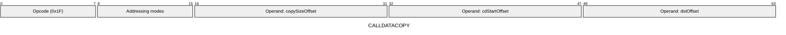
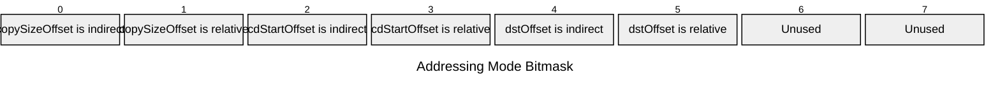

[&larr; Back to Instruction Set: Quick Reference](../avm-isa-quick-reference.md)

# CALLDATACOPY

Copy calldata to memory

Opcode `0x1F`

```javascript
M[dstOffset:dstOffset+M[copySizeOffset]] = calldata[M[cdStartOffset]:M[cdStartOffset]+M[copySizeOffset]]
```

## Details

Copies a section of the current call's calldata into memory at the specified offset. Reads M[copySizeOffset] elements starting at calldata offset M[cdStartOffset], writing them to memory starting at dstOffset. If the read extends past the end of calldata, the out-of-bounds region is padded with zeros. If the write would exceed addressable memory, the instruction errors.

## Gas Costs

| Component | Value | Scales with |
|-----------|-------|-------------|
| L2 Base | 18 | - |
| DA Base | 0 | - |
| L2 Addressing | 3 | 3 L2 gas per indirect memory offset<br/>3 L2 gas per relative memory offset |
| L2 Dynamic | 3 | `M[copySizeOffset]` |

*See [Gas Metering](gas.md) for details on how gas costs are computed and applied.

## Operands

| Name | Type | Description |
|------|------|-------------|
| `copySizeOffset` | Memory offset | Memory offset of the number of elements to copy |
| `cdStartOffset` | Memory offset | Memory offset of the calldata start index to copy from |
| `dstOffset` | Memory offset | Memory offset for writing calldata |

## Wire Formats
See [Wire Format](wire-format.md) page for an explanation of wire format variants and opcode naming (e.g., why `ADD_8` vs `ADD_16`).

**CALLDATACOPY** (Opcode 0x1F):



## Addressing Modes
See [Addressing](addressing.md) page for a detailed explanation.

8-bit bitmask: 2 bits per memory offset operand (indirect flag + relative flag)

Memory offset operands (`copySizeOffset`, `cdStartOffset`, `dstOffset`) are encoded as follows:



## Tag Checks

- `T[copySizeOffset] == UINT32`

## Tag Updates

- `T[dstOffset:dstOffset+M[copySizeOffset]] = FIELD`

## Error Conditions

- **INVALID_TAG**: Size operand is not Uint32
- **MEMORY_ACCESS_OUT_OF_RANGE**: Memory offset operand exceeds addressable memory

## Notes

- See [External Calls](../external-calls.md) for how calldata is passed to nested calls.
- See [Calldata and Return Data](../calldata-returndata.md) for more details.

---

[&larr; Back to Instruction Set: Quick Reference](../avm-isa-quick-reference.md)