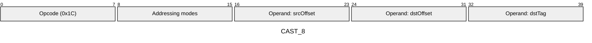
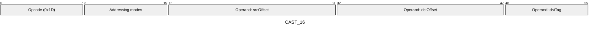
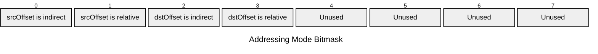

[&larr; Back to Instruction Set: Quick Reference](../avm-isa-quick-reference.md)

# CAST

Type cast memory value

Opcodes `0x1C`-`0x1D` (2 wire formats)

```javascript
M[dstOffset] = M[srcOffset] as tag
```

## Details

Changes the type tag of a value. The value itself is preserved if casting to a larger type. When casting to a smaller type, the value is truncated by keeping only the least significant bits that fit in the destination type (equivalent to modulo 2^k where k is the bit-width of the destination type).

## Gas Costs

| Component | Value | Scales with |
|-----------|-------|-------------|
| L2 Base | 27 | - |
| DA Base | 0 | - |
| L2 Addressing | 3 | 3 L2 gas per indirect memory offset<br/>3 L2 gas per relative memory offset |

*See [Gas Metering](gas.md) for details on how gas costs are computed and applied.

## Operands

| Name | Type | Description |
|------|------|-------------|
| `srcOffset` | Memory offset | Memory offset of the value to cast |
| `dstOffset` | Memory offset | Memory offset for casted value |
| `dstTag` | Type tag | Type tag to cast the value to |

## Wire Formats
See [Wire Format](wire-format.md) page for an explanation of wire format variants and opcode naming (e.g., why `ADD_8` vs `ADD_16`).

**CAST_8** (Opcode 0x1C):



**CAST_16** (Opcode 0x1D):



## Addressing Modes
See [Addressing](addressing.md) page for a detailed explanation.

8-bit bitmask: 2 bits per memory offset operand (indirect flag + relative flag)

Memory offset operands (`srcOffset`, `dstOffset`) are encoded as follows:



## Tag Updates

- `T[dstOffset] = dstTag`

## Error Conditions

- **INVALID_TAG**: Destination tag is not a valid TypeTag
- **MEMORY_ACCESS_OUT_OF_RANGE**: Memory offset operand exceeds addressable memory

---

[&larr; Back to Instruction Set: Quick Reference](../avm-isa-quick-reference.md)