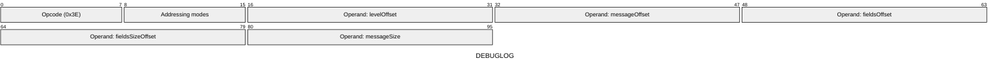
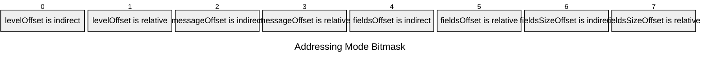

[&larr; Back to Instruction Set: Quick Reference](../avm-isa-quick-reference.md)

# DEBUGLOG

Output debug log

Opcode `0x3E`

```javascript
debugLog(level, message, M[fieldsOffset:fieldsOffset+M[fieldsSizeOffset]])
```

## Details

Prints a debug log to console as a formatted message, and pushes a structured debug object (`{contractAddress, level, message, fields[]}`) to an accumulated list for the transaction. This opcode does nearly nothing when executed by sequencers or provers (only performs PC increment and address resolution). It is meant for local debugging or for use by RPC nodes and wallets. Logs are only printed if logging level is "Debug" (6) or higher. Message size is an immediate (constant in the bytecode). Throws an irrecoverable error if truly doing debug logging and log level is invalid (greater than 7) or upon reaching the node's configured maxDebugLogMemoryReads.

## Gas Costs

| Component | Value | Scales with |
|-----------|-------|-------------|
| L2 Base | 9 | - |
| DA Base | 0 | - |
| L2 Addressing | 3 | 3 L2 gas per indirect memory offset<br/>3 L2 gas per relative memory offset |

*See [Gas Metering](gas.md) for details on how gas costs are computed and applied.

## Operands

| Name | Type | Description |
|------|------|-------------|
| `levelOffset` | Memory offset | Memory offset |
| `messageOffset` | Memory offset | Memory offset of the message string |
| `fieldsOffset` | Memory offset | Memory offset of the start of field values to log |
| `fieldsSizeOffset` | Memory offset | Memory offset of the number of fields to log |
| `messageSize` | Memory offset | Immediate value specifying message string length |

## Wire Formats
See [Wire Format](wire-format.md) page for an explanation of wire format variants and opcode naming (e.g., why `ADD_8` vs `ADD_16`).

**DEBUGLOG** (Opcode 0x3E):



## Addressing Modes
See [Addressing](addressing.md) page for a detailed explanation.

8-bit bitmask: 2 bits per memory offset operand (indirect flag + relative flag)

Memory offset operands (`levelOffset`, `messageOffset`, `fieldsOffset`, `fieldsSizeOffset`) are encoded as follows:



## Tag Checks

- `T[fieldsSizeOffset] == UINT32`
- `T[fieldsOffset:fieldsOffset+M[fieldsSizeOffset]] == FIELD`

## Error Conditions

- **INVALID_TAG**: Fields operands are not FIELD type
- **INVALID_LOG_LEVEL**: Log level is not a valid LogLevel enum value
- **DEBUG_MEMORY_LIMIT_EXCEEDED**: Exceeded maximum debug log memory reads
- **MEMORY_ACCESS_OUT_OF_RANGE**: Memory offset operand exceeds addressable memory

---

[&larr; Back to Instruction Set: Quick Reference](../avm-isa-quick-reference.md)