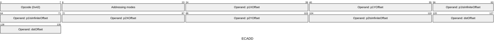
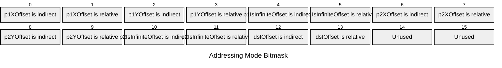

[&larr; Back to Instruction Set: Quick Reference](../avm-isa-quick-reference.md)

# ECADD

Grumpkin elliptic curve addition

Opcode `0x42`

```javascript
M[dstOffset:dstOffset+3] = grumpkinAdd(
        /*point1=*/{x: M[p1XOffset], y: M[p1YOffset], isInfinite: M[p1IsInfiniteOffset]},
        /*point2=*/{x: M[p2XOffset], y: M[p2YOffset], isInfinite: M[p2IsInfiniteOffset]}
    )
```

## Details

Performs elliptic curve point addition on the Grumpkin curve. Each point is represented as (x: FIELD, y: FIELD, isInfinite: Uint1). Returns result point in same format.

## Gas Costs

| Component | Value | Scales with |
|-----------|-------|-------------|
| L2 Base | 27 | - |
| DA Base | 0 | - |
| L2 Addressing | 3 | 3 L2 gas per indirect memory offset<br/>3 L2 gas per relative memory offset |

*See [Gas Metering](gas.md) for details on how gas costs are computed and applied.

## Operands

| Name | Type | Description |
|------|------|-------------|
| `p1XOffset` | Memory offset | Memory offset of the first point's x-coordinate |
| `p1YOffset` | Memory offset | Memory offset of the first point's y-coordinate |
| `p1IsInfiniteOffset` | Memory offset | Memory offset of the first point's infinity flag |
| `p2XOffset` | Memory offset | Memory offset of the second point's x-coordinate |
| `p2YOffset` | Memory offset | Memory offset of the second point's y-coordinate |
| `p2IsInfiniteOffset` | Memory offset | Memory offset of the second point's infinity flag |
| `dstOffset` | Memory offset | Memory offset for result point will be written (3 values) |

## Wire Formats
See [Wire Format](wire-format.md) page for an explanation of wire format variants and opcode naming (e.g., why `ADD_8` vs `ADD_16`).

**ECADD** (Opcode 0x42):



## Addressing Modes
See [Addressing](addressing.md) page for a detailed explanation.

16-bit bitmask: 2 bits per memory offset operand (indirect flag + relative flag)

Memory offset operands (`p1XOffset`, `p1YOffset`, `p1IsInfiniteOffset`, `p2XOffset`, `p2YOffset`, `p2IsInfiniteOffset`, `dstOffset`) are encoded as follows:



## Tag Checks

- `T[p1XOffset] == FIELD`
- `T[p1YOffset] == FIELD`
- `T[p1IsInfiniteOffset] == UINT1`
- `T[p2XOffset] == FIELD`
- `T[p2YOffset] == FIELD`
- `T[p2IsInfiniteOffset] == UINT1`

## Tag Updates

- `T[dstOffset] = FIELD`
- `T[dstOffset+1] = FIELD`
- `T[dstOffset+2] = UINT1`

## Error Conditions

- **INVALID_TAG**: Point coordinates are not FIELD or infinity flags are not Uint1
- **POINT_NOT_ON_CURVE**: One or both points are not on the Grumpkin curve
- **MEMORY_ACCESS_OUT_OF_RANGE**: Memory offset operand exceeds addressable memory

---

[&larr; Back to Instruction Set: Quick Reference](../avm-isa-quick-reference.md)