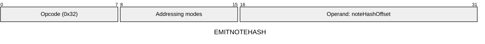
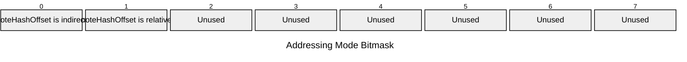

[&larr; Back to Instruction Set: Quick Reference](../avm-isa-quick-reference.md)

# EMITNOTEHASH

Emit note hash

Opcode `0x32`

```javascript
noteHashes.append(M[noteHashOffset])
```

## Details

Writes a new note hash to the Note Hash Tree. Note hash must have type tag FIELD. Reverts in static calls.

## Gas Costs

| Component | Value | Scales with |
|-----------|-------|-------------|
| L2 Base | 19275 | - |
| DA Base | 512 | - |
| L2 Addressing | 3 | 3 L2 gas per indirect memory offset<br/>3 L2 gas per relative memory offset |

*See [Gas Metering](gas.md) for details on how gas costs are computed and applied.

## Operands

| Name | Type | Description |
|------|------|-------------|
| `noteHashOffset` | Memory offset | Memory offset of the note hash to emit |

## Wire Formats
See [Wire Format](wire-format.md) page for an explanation of wire format variants and opcode naming (e.g., why `ADD_8` vs `ADD_16`).

**EMITNOTEHASH** (Opcode 0x32):



## Addressing Modes
See [Addressing](addressing.md) page for a detailed explanation.

8-bit bitmask: 2 bits per memory offset operand (indirect flag + relative flag)

Memory offset operands (`noteHashOffset`) are encoded as follows:



## Tag Checks

- `T[noteHashOffset] == FIELD`

## Error Conditions

- **INVALID_TAG**: Note hash operand is not FIELD
- **STATIC_CALL_VIOLATION**: Attempted note hash emission in static call context
- **SIDE_EFFECT_LIMIT_REACHED**: Exceeded maximum note hashes per transaction (MAX_NOTE_HASHES_PER_TX)
- **MEMORY_ACCESS_OUT_OF_RANGE**: Memory offset operand exceeds addressable memory

---

[&larr; Back to Instruction Set: Quick Reference](../avm-isa-quick-reference.md)