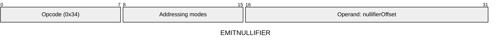
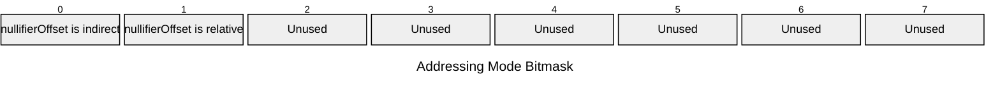

[&larr; Back to Instruction Set: Quick Reference](../avm-isa-quick-reference.md)

# EMITNULLIFIER

Emit nullifier

Opcode `0x34`

```javascript
nullifiers.append(M[nullifierOffset])
```

## Details

Writes a new nullifier to the Nullifier Tree. This opcode can only emit nullifiers from the currently executing contract address. Nullifier must have type tag FIELD. Reverts in static calls or if nullifier already exists.

## Gas Costs

| Component | Value | Scales with |
|-----------|-------|-------------|
| L2 Base | 30800 | - |
| DA Base | 512 | - |
| L2 Addressing | 3 | 3 L2 gas per indirect memory offset<br/>3 L2 gas per relative memory offset |

\* See [Gas Metering](gas.md) for details on how gas costs are computed and applied.

## Operands

| Name | Type | Description |
|------|------|-------------|
| `nullifierOffset` | Memory offset | Memory offset of the nullifier to emit |

## Wire Formats
See [Wire Format](wire-format.md) page for an explanation of wire format variants and opcode naming (e.g., why `ADD_8` vs `ADD_16`).

**EMITNULLIFIER** (Opcode 0x34):



## Addressing Modes
See [Addressing](addressing.md) page for a detailed explanation.

8-bit bitmask: 2 bits per memory offset operand (indirect flag + relative flag)

Memory offset operands (`nullifierOffset`) are encoded as follows:



## Tag Checks

- `T[nullifierOffset] == FIELD`

## Error Conditions

- **INVALID_TAG**: Nullifier operand is not FIELD
- **STATIC_CALL_VIOLATION**: Attempted nullifier emission in static call context
- **NULLIFIER_COLLISION**: Nullifier already exists
- **SIDE_EFFECT_LIMIT_REACHED**: Exceeded maximum nullifiers per transaction (MAX_NULLIFIERS_PER_TX)
- **MEMORY_ACCESS_OUT_OF_RANGE**: Memory offset operand exceeds addressable memory

---

[&larr; Back to Instruction Set: Quick Reference](../avm-isa-quick-reference.md)
