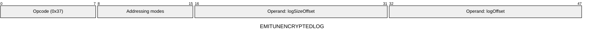
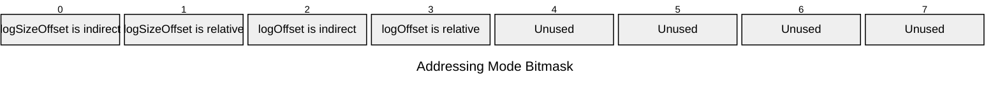

[&larr; Back to Instruction Set: Quick Reference](../avm-isa-quick-reference.md)

# EMITUNENCRYPTEDLOG

Emit public log

Opcode `0x37`

```javascript
unencryptedLogs.append(M[logOffset:logOffset+M[logSizeOffset]])
```

## Details

Emits a public log from the currently executing contract. Log size must be Uint32, log data must be FIELD elements. Reverts in static calls.

## Gas Costs

| Component | Value | Scales with |
|-----------|-------|-------------|
| L2 Base | 15 | - |
| DA Base | 1024 | - |
| L2 Addressing | 3 | 3 L2 gas per indirect memory offset<br/>3 L2 gas per relative memory offset |
| L2 Dynamic | 3 | `M[logSizeOffset]` |
| DA Dynamic | 512 | `M[logSizeOffset]` |

\* See [Gas Metering](gas.md) for details on how gas costs are computed and applied.

## Operands

| Name | Type | Description |
|------|------|-------------|
| `logSizeOffset` | Memory offset | Memory offset of the log size (number of fields) |
| `logOffset` | Memory offset | Memory offset of the start of the log data |

## Wire Formats
See [Wire Format](wire-format.md) page for an explanation of wire format variants and opcode naming (e.g., why `ADD_8` vs `ADD_16`).

**EMITUNENCRYPTEDLOG** (Opcode 0x37):



## Addressing Modes
See [Addressing](addressing.md) page for a detailed explanation.

8-bit bitmask: 2 bits per memory offset operand (indirect flag + relative flag)

Memory offset operands (`logSizeOffset`, `logOffset`) are encoded as follows:



## Tag Checks

- `T[logSizeOffset] == UINT32`
- `T[logOffset:logOffset+M[logSizeOffset]]` == FIELD

## Error Conditions

- **INVALID_TAG**: Log size is not Uint32 or log data is not FIELD
- **STATIC_CALL_VIOLATION**: Attempted log emission in static call context
- **SIDE_EFFECT_LIMIT_REACHED**: Exceeded maximum cumulative log size per transaction (FLAT_PUBLIC_LOGS_PAYLOAD_LENGTH)
- **MEMORY_ACCESS_OUT_OF_RANGE**: Memory offset operand exceeds addressable memory

---

[&larr; Back to Instruction Set: Quick Reference](../avm-isa-quick-reference.md)
