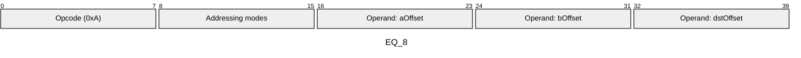
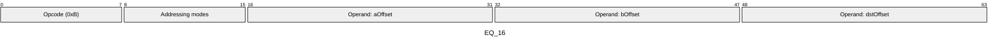
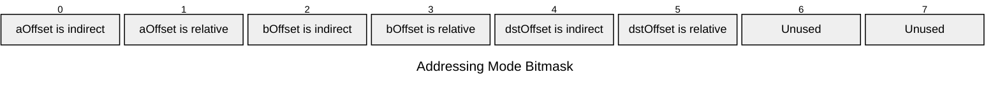

[&larr; Back to Instruction Set: Quick Reference](../avm-isa-quick-reference.md)

# EQ

Equality check (a == b)

Opcodes `0x0A`-`0x0B` (2 wire formats)

```javascript
M[dstOffset] = (M[aOffset] == M[bOffset]) ? 1 : 0
```

## Details

Compares two values for equality. Both operands must have the same type tag. The result is a Uint1 (0 or 1).

## Gas Costs

| Component | Value | Scales with |
|-----------|-------|-------------|
| L2 Base | 12 | - |
| DA Base | 0 | - |
| L2 Addressing | 3 | 3 L2 gas per indirect memory offset<br/>3 L2 gas per relative memory offset |

\* See [Gas Metering](../gas.md) for details on how gas costs are computed and applied.

## Operands

| Name | Type | Description |
|------|------|-------------|
| `aOffset` | Memory offset | Memory offset of the first value to compare |
| `bOffset` | Memory offset | Memory offset of the second value to compare |
| `dstOffset` | Memory offset | Memory offset where the result (0 or 1) will be written |

## Wire Formats
See [Wire Format](../wire-format.md) page for an explanation of wire format variants and opcode naming (e.g., why `ADD_8` vs `ADD_16`).

**EQ_8** (Opcode 0x0A):



**EQ_16** (Opcode 0x0B):



## Addressing Modes
See [Addressing](../addressing.md) page for a detailed explanation.

8-bit bitmask: 2 bits per memory offset operand (indirect flag + relative flag)

Memory offset operands (`aOffset`, `bOffset`, `dstOffset`) are encoded as follows:



## Tag Checks

- `T[aOffset] == T[bOffset]`

## Tag Updates

- `T[dstOffset] = UINT1`

## Error Conditions

- **TAG_MISMATCH**: Operands have different type tags
- **MEMORY_ACCESS_OUT_OF_RANGE**: Memory offset operand exceeds addressable memory

---

[&larr; Back to Instruction Set: Quick Reference](../avm-isa-quick-reference.md)
