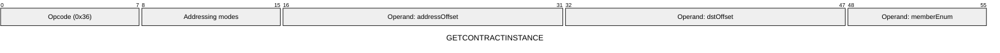
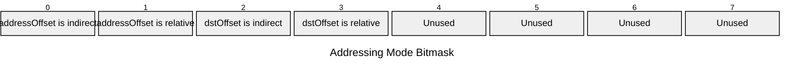

[&larr; Back to Instruction Set: Quick Reference](../avm-isa-quick-reference.md)

# GETCONTRACTINSTANCE

Get contract instance information

Opcode `0x36`

```javascript
M[dstOffset] = contractInstance.exists ? 1 : 0; M[dstOffset+1] = contractInstance[memberEnum]
```

## Details

Looks up contract instance by address and retrieves the specified member. This opcode can get contract instance information for any contract address, not just the currently executing one. Returns existence flag (Uint1) and member value (FIELD). If the contract does not exist, the member value is set to 0. Supported enum values: `[DEPLOYER=0, CLASS_ID, INIT_HASH]`.

## Gas Costs

| Component | Value | Scales with |
|-----------|-------|-------------|
| L2 Base | 1527 | - |
| DA Base | 0 | - |
| L2 Addressing | 3 | 3 L2 gas per indirect memory offset<br/>3 L2 gas per relative memory offset |

*See [Gas Metering](gas.md) for details on how gas costs are computed and applied.

## Operands

| Name | Type | Description |
|------|------|-------------|
| `addressOffset` | Memory offset | Memory offset |
| `dstOffset` | Memory offset | Memory offset |
| `memberEnum` | Memory offset | Immediate value specifying which contract instance member to retrieve |

## Wire Formats
See [Wire Format](wire-format.md) page for an explanation of wire format variants and opcode naming (e.g., why `ADD_8` vs `ADD_16`).

**GETCONTRACTINSTANCE** (Opcode 0x36):



## Addressing Modes
See [Addressing](addressing.md) page for a detailed explanation.

8-bit bitmask: 2 bits per memory offset operand (indirect flag + relative flag)

Memory offset operands (`addressOffset`, `dstOffset`) are encoded as follows:



## Tag Updates

- `T[dstOffset] = UINT1`
- `T[dstOffset+1] = FIELD`

## Error Conditions

- **INVALID_TAG**: Address operand is not FIELD
- **INVALID_MEMBER_ENUM**: Member enum is not in the range of valid enum values
- **MEMORY_ACCESS_OUT_OF_RANGE**: Memory offset operand exceeds addressable memory

---

[&larr; Back to Instruction Set: Quick Reference](../avm-isa-quick-reference.md)