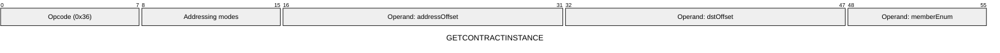
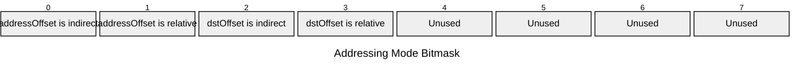

[&larr; Back to Instruction Set: Quick Reference](../avm-isa-quick-reference.md)

# GETCONTRACTINSTANCE

Get contract instance information

Opcode `0x36`

```javascript
M[dstOffset] = contractInstance.exists ? 1 : 0; M[dstOffset+1] = contractInstance[memberEnum]
```

## Details

Looks up contract instance by address and retrieves the specified member. This opcode can get contract instance information for any contract address, not just the currently executing one. Returns existence flag (Uint1) and member value (FIELD). If the contract does not exist, the member value is set to 0. Supported enum values: `[DEPLOYER=0, CLASS_ID, INIT_HASH]`.

## Contract Classes and Instances

In Aztec, the logic of a contract is separated from its state-bearing instance, enabling a powerful model for code reuse and upgradeability. This is different from Ethereum's model where code and state are tightly coupled in a single address.

- **Contract Class**: A template that defines a contract's public and private functions, its storage layout, and other logic. It is identified by a `CLASS_ID`. A single contract class can be used by many different contract instances.
- **Contract Instance**: A deployed, stateful instance of a contract class at a specific address. Each instance has its own storage, but it executes the code of its associated contract class.

This separation allows for:
- **Upgradeability**: An instance can be upgraded to point to a new contract class, changing its logic while preserving its state and address.
- **Code Reuse**: Multiple instances can share the same underlying code from a single class, which is more efficient.

## Contract Instance Members

| Member | Description |
|---|---|
| **Deployer Address** | The address of the account that deployed this contract instance. |
| **Class ID** | The identifier of the contract class that this instance uses for its code. |
| **Initialization Hash** | A hash of the constructor arguments used when the contract instance was deployed. |

**Example**: To check if a contract at a given `address` is an instance of a known `CLASS_ID`:
1. Use `GETCONTRACTINSTANCE` with the `address` and the `CLASS_ID` member enum.
2. The opcode returns two values: an `exists` flag and the `class_id` of the instance.
3. Compare the returned `class_id` with the known `CLASS_ID`.

## Gas Costs

| Component | Value | Scales with |
|-----------|-------|-------------|
| L2 Base | 6108 | - |
| DA Base | 0 | - |
| L2 Addressing | 3 | 3 L2 gas per indirect memory offset<br/>3 L2 gas per relative memory offset |

*See [Gas Metering](gas.md) for details on how gas costs are computed and applied.

## Operands

| Name | Type | Description |
|------|------|-------------|
| `addressOffset` | Memory offset | Memory offset |
| `dstOffset` | Memory offset | Memory offset |
| `memberEnum` | Memory offset | Immediate value specifying which contract instance member to retrieve |

## Wire Formats
See [Wire Format](wire-format.md) page for an explanation of wire format variants and opcode naming (e.g., why `ADD_8` vs `ADD_16`).

**GETCONTRACTINSTANCE** (Opcode 0x36):



## Addressing Modes
See [Addressing](addressing.md) page for a detailed explanation.

8-bit bitmask: 2 bits per memory offset operand (indirect flag + relative flag)

Memory offset operands (`addressOffset`, `dstOffset`) are encoded as follows:



## Tag Updates

- `T[dstOffset] = UINT1`
- `T[dstOffset+1] = FIELD`

## Error Conditions

- **INVALID_TAG**: Address operand is not FIELD
- **INVALID_MEMBER_ENUM**: Member enum is not in the range of valid enum values
- **MEMORY_ACCESS_OUT_OF_RANGE**: Memory offset operand exceeds addressable memory

---

[&larr; Back to Instruction Set: Quick Reference](../avm-isa-quick-reference.md)