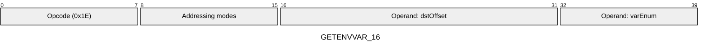
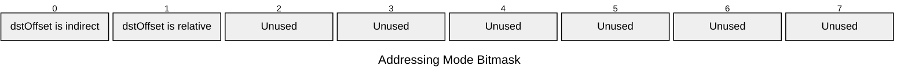

[&larr; Back to Instruction Set: Quick Reference](../avm-isa-quick-reference.md)

# GETENVVAR

Get environment variable

Opcode `0x1E`

```javascript
M[dstOffset] = environmentVariable[varEnum]
```

## Details

Retrieves environment variables from the currently executing context. The variable is specified by an immediate enum value.

## Variable Reference

| Index | Variable | Type | Description |
|-------|----------|------|-------------|
| 0 | `ADDRESS` | `FIELD` | Current executing contract address |
| 1 | `SENDER` | `FIELD` | Immediate caller of this context |
| 2 | `TRANSACTIONFEE` | `FIELD` | Total transaction fee |
| 3 | `CHAINID` | `FIELD` | Chain identifier |
| 4 | `VERSION` | `FIELD` | Protocol version |
| 5 | `BLOCKNUMBER` | `UINT32` | Current block number |
| 6 | `TIMESTAMP` | `UINT64` | Block timestamp |
| 7 | `MINFEEPERL2GAS` | `UINT128` | Minimum fee per L2 gas unit |
| 8 | `MINFEEPERDAGAS` | `UINT128` | Minimum fee per DA gas unit |
| 9 | `ISSTATICCALL` | `UINT1` | Whether current call is static (1) or not (0) |
| 10 | `L2GASLEFT` | `UINT32` | Remaining L2 gas at time of query |
| 11 | `DAGASLEFT` | `UINT32` | Remaining DA gas at time of query |

## Gas Costs

| Component | Value | Scales with |
|-----------|-------|-------------|
| L2 Base | 12 | - |
| DA Base | 0 | - |
| L2 Addressing | 3 | 3 L2 gas per indirect memory offset<br/>3 L2 gas per relative memory offset |

\* See [Gas Metering](../gas.md) for details on how gas costs are computed and applied.

## Operands

| Name | Type | Description |
|------|------|-------------|
| `dstOffset` | Memory offset | Memory offset where the environment variable value will be written |
| `varEnum` | Memory offset | Immediate value specifying which environment variable to read |

## Wire Formats
See [Wire Format](../wire-format.md) page for an explanation of wire format variants and opcode naming (e.g., why `ADD_8` vs `ADD_16`).

**GETENVVAR_16** (Opcode 0x1E):



## Addressing Modes
See [Addressing](../addressing.md) page for a detailed explanation.

8-bit bitmask: 2 bits per memory offset operand (indirect flag + relative flag)

Memory offset operands (`dstOffset`) are encoded as follows:



## Tag Updates

The destination tag is set to the type of the requested variable (see Variable Reference table above):

- `T[dstOffset] = Type(varEnum)`

## Error Conditions

- **INVALID_ENV_VAR**: Env var enum is not in the range of valid enum values
- **MEMORY_ACCESS_OUT_OF_RANGE**: Memory offset operand exceeds addressable memory

---

[&larr; Back to Instruction Set: Quick Reference](../avm-isa-quick-reference.md)
