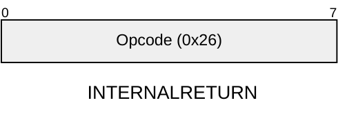

[&larr; Back to Instruction Set: Quick Reference](../avm-isa-quick-reference.md)

# INTERNALRETURN

Return from internal call

Opcode `0x26`

```javascript
PC = internalCallStack.pop().returnPc
```

## Details

Pops return PC from internal call stack and sets PC to it.

## Gas Costs

| Component | Value |
|-----------|-------|
| L2 Base | 9 |
| DA Base | 0 |

*See [Gas Metering](gas.md) for details on how gas costs are computed and applied.

## Wire Formats
See [Wire Format](wire-format.md) page for an explanation of wire format variants and opcode naming (e.g., why `ADD_8` vs `ADD_16`).

**INTERNALRETURN** (Opcode 0x26):



## Error Conditions

- **INTERNAL_CALL_STACK_EMPTY**: Internal call stack is empty

---

[&larr; Back to Instruction Set: Quick Reference](../avm-isa-quick-reference.md)