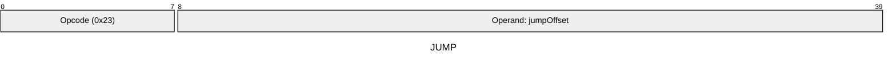

[&larr; Back to Instruction Set: Quick Reference](../avm-isa-quick-reference.md)

# JUMP

Unconditional jump

Opcode `0x23`

```javascript
PC = jumpOffset
```

## Details

Sets the program counter to the specified offset. The offset is an immediate value (not from memory). While this instruction itself does not validate the jump target, an invalid target will trigger an instruction fetching error at the start of the next instruction's processing.

## Gas Costs

| Component | Value |
|-----------|-------|
| L2 Base | 9 |
| DA Base | 0 |

\* See [Gas Metering](../gas.md) for details on how gas costs are computed and applied.

## Operands

| Name | Type | Description |
|------|------|-------------|
| `jumpOffset` | Memory offset | Immediate bytecode offset to jump to |

## Wire Formats
See [Wire Format](../wire-format.md) page for an explanation of wire format variants and opcode naming (e.g., why `ADD_8` vs `ADD_16`).

**JUMP** (Opcode 0x23):



---

[&larr; Back to Instruction Set: Quick Reference](../avm-isa-quick-reference.md)
