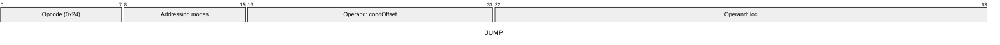
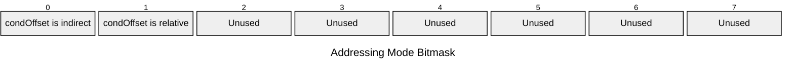

[&larr; Back to Instruction Set: Quick Reference](../avm-isa-quick-reference.md)

# JUMPI

Conditional jump

Opcode `0x24`

```javascript
if M[condOffset] != 0 then PC = loc else PC = PC + instructionSize
```

## Details

Jumps to the specified location if the condition is non-zero (true). The condition must have type tag Uint1. While this instruction itself does not validate the jump target, an invalid target will trigger an instruction fetching error at the start of the next instruction's processing.

## Gas Costs

| Component | Value | Scales with |
|-----------|-------|-------------|
| L2 Base | 9 | - |
| DA Base | 0 | - |
| L2 Addressing | 3 | 3 L2 gas per indirect memory offset<br/>3 L2 gas per relative memory offset |

\* See [Gas Metering](gas.md) for details on how gas costs are computed and applied.

## Operands

| Name | Type | Description |
|------|------|-------------|
| `condOffset` | Memory offset | Memory offset of the condition value (Uint1) |
| `loc` | Memory offset | Immediate bytecode offset to jump to if condition is true |

## Wire Formats
See [Wire Format](wire-format.md) page for an explanation of wire format variants and opcode naming (e.g., why `ADD_8` vs `ADD_16`).

**JUMPI** (Opcode 0x24):



## Addressing Modes
See [Addressing](addressing.md) page for a detailed explanation.

8-bit bitmask: 2 bits per memory offset operand (indirect flag + relative flag)

Memory offset operands (`condOffset`) are encoded as follows:



## Tag Checks

- `T[condOffset] == UINT1`

## Error Conditions

- **INVALID_TAG**: Condition operand is not Uint1
- **MEMORY_ACCESS_OUT_OF_RANGE**: Memory offset operand exceeds addressable memory

---

[&larr; Back to Instruction Set: Quick Reference](../avm-isa-quick-reference.md)
