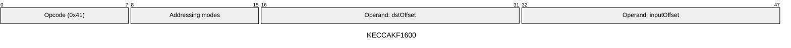
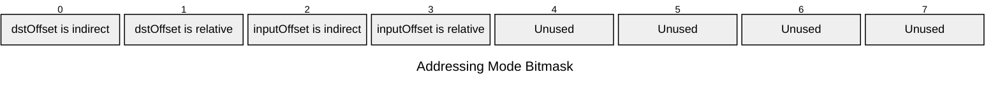

[&larr; Back to Instruction Set: Quick Reference](../avm-isa-quick-reference.md)

# KECCAKF1600

Keccak-f[1600] permutation

Opcode `0x41`

```javascript
M[dstOffset:dstOffset+25] = keccakf1600(/*input=*/M[inputOffset:inputOffset+25])
```

## Details

Computes the Keccak-f[1600] permutation on a state of 25 Uint64 elements. Input and output must have type tag Uint64.

## Gas Costs

| Component | Value | Scales with |
|-----------|-------|-------------|
| L2 Base | 58176 | - |
| DA Base | 0 | - |
| L2 Addressing | 3 | 3 L2 gas per indirect memory offset<br/>3 L2 gas per relative memory offset |

\* See [Gas Metering](gas.md) for details on how gas costs are computed and applied.

## Operands

| Name | Type | Description |
|------|------|-------------|
| `dstOffset` | Memory offset | Memory offset for output state will be written |
| `inputOffset` | Memory offset | Memory offset of the input state (25 Uint64 elements) |

## Wire Formats
See [Wire Format](wire-format.md) page for an explanation of wire format variants and opcode naming (e.g., why `ADD_8` vs `ADD_16`).

**KECCAKF1600** (Opcode 0x41):



## Addressing Modes
See [Addressing](addressing.md) page for a detailed explanation.

8-bit bitmask: 2 bits per memory offset operand (indirect flag + relative flag)

Memory offset operands (`dstOffset`, `inputOffset`) are encoded as follows:



## Tag Checks

- `T[inputOffset:inputOffset+25] == UINT64`

## Tag Updates

- `T[dstOffset:dstOffset+25] = UINT64`

## Error Conditions

- **INVALID_TAG**: Input state elements are not Uint64
- **MEMORY_ACCESS_OUT_OF_RANGE**: Memory offset operand exceeds addressable memory

---

[&larr; Back to Instruction Set: Quick Reference](../avm-isa-quick-reference.md)
