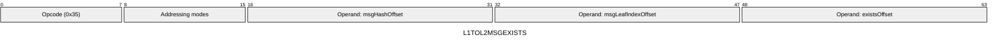
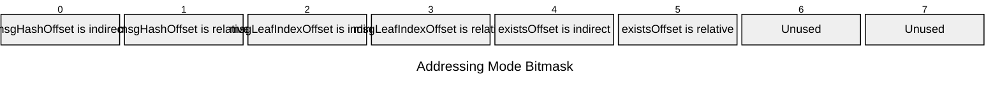

[&larr; Back to Instruction Set: Quick Reference](../avm-isa-quick-reference.md)

# L1TOL2MSGEXISTS

Check existence of L1-to-L2 message

Opcode `0x35`

```javascript
M[existsOffset] = l1ToL2Messages.exists(M[msgHashOffset], M[msgLeafIndexOffset]) ? 1 : 0
```

## Details

Checks whether the specified L1-to-L2 message hash exists in the L1 to L2 message tree at the given leaf index. Since this opcode checks for existence at a specified leafIndex, it is _not_ limited to checking for messages with any particular recipient. If the leaf index exceeds the maximum tree size, the result is 0 (does not exist). Message hash must be FIELD, leaf index must be Uint64. Result is Uint1.

## Gas Costs

| Component | Value | Scales with |
|-----------|-------|-------------|
| L2 Base | 540 | - |
| DA Base | 0 | - |
| L2 Addressing | 3 | 3 L2 gas per indirect memory offset<br/>3 L2 gas per relative memory offset |

\* See [Gas Metering](gas.md) for details on how gas costs are computed and applied.

## Operands

| Name | Type | Description |
|------|------|-------------|
| `msgHashOffset` | Memory offset | Memory offset of the L1-to-L2 message hash |
| `msgLeafIndexOffset` | Memory offset | Memory offset of the leaf index in the message tree |
| `existsOffset` | Memory offset | Memory offset for result (0 or 1) will be written |

## Wire Formats
See [Wire Format](wire-format.md) page for an explanation of wire format variants and opcode naming (e.g., why `ADD_8` vs `ADD_16`).

**L1TOL2MSGEXISTS** (Opcode 0x35):



## Addressing Modes
See [Addressing](addressing.md) page for a detailed explanation.

8-bit bitmask: 2 bits per memory offset operand (indirect flag + relative flag)

Memory offset operands (`msgHashOffset`, `msgLeafIndexOffset`, `existsOffset`) are encoded as follows:



## Tag Checks

- `T[msgHashOffset] == FIELD`
- `T[msgLeafIndexOffset] == UINT64`

## Tag Updates

- `T[existsOffset] = UINT1`

## Error Conditions

- **INVALID_TAG**: Message hash is not FIELD or leaf index is not Uint64
- **MEMORY_ACCESS_OUT_OF_RANGE**: Memory offset operand exceeds addressable memory

---

[&larr; Back to Instruction Set: Quick Reference](../avm-isa-quick-reference.md)
