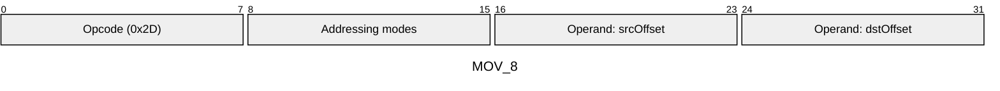
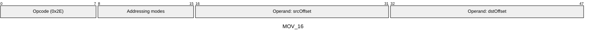
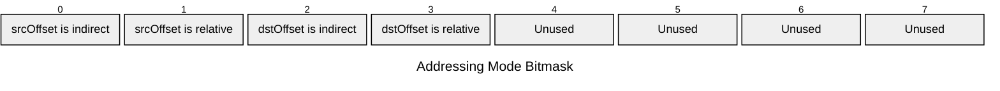

[&larr; Back to Instruction Set: Quick Reference](../avm-isa-quick-reference.md)

# MOV

Move value between memory locations

Opcodes `0x2D`-`0x2E` (2 wire formats)

```javascript
M[dstOffset] = M[srcOffset]
```

## Details

Copies a value and its type tag from the source memory offset to the destination offset.

## Gas Costs

| Component | Value | Scales with |
|-----------|-------|-------------|
| L2 Base | 12 | - |
| DA Base | 0 | - |
| L2 Addressing | 3 | 3 L2 gas per indirect memory offset<br/>3 L2 gas per relative memory offset |

*See [Gas Metering](gas.md) for details on how gas costs are computed and applied.

## Operands

| Name | Type | Description |
|------|------|-------------|
| `srcOffset` | Memory offset | Memory offset to read from |
| `dstOffset` | Memory offset | Memory offset to write to |

## Wire Formats
See [Wire Format](wire-format.md) page for an explanation of wire format variants and opcode naming (e.g., why `ADD_8` vs `ADD_16`).

**MOV_8** (Opcode 0x2D):



**MOV_16** (Opcode 0x2E):



## Addressing Modes
See [Addressing](addressing.md) page for a detailed explanation.

8-bit bitmask: 2 bits per memory offset operand (indirect flag + relative flag)

Memory offset operands (`srcOffset`, `dstOffset`) are encoded as follows:



## Tag Updates

- `T[dstOffset] = T[srcOffset]`

## Error Conditions

- **MEMORY_ACCESS_OUT_OF_RANGE**: Memory offset operand exceeds addressable memory

---

[&larr; Back to Instruction Set: Quick Reference](../avm-isa-quick-reference.md)