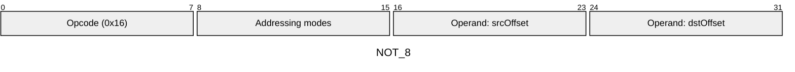
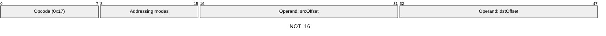
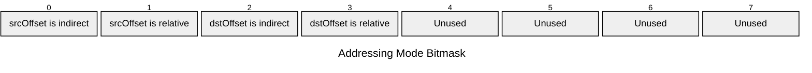

[&larr; Back to Instruction Set: Quick Reference](../avm-isa-quick-reference.md)

# NOT

Bitwise NOT (~a)

Opcodes `0x16`-`0x17` (2 wire formats)

```javascript
M[dstOffset] = ~M[srcOffset]
```

## Details

Performs bitwise NOT operation (one's complement). The operand must have an integral type tag (UINT1, UINT8, UINT16, UINT32, UINT64, UINT128). The result inherits the tag from the operand.

## Gas Costs

| Component | Value | Scales with |
|-----------|-------|-------------|
| L2 Base | 12 | - |
| DA Base | 0 | - |
| L2 Addressing | 3 | 3 L2 gas per indirect memory offset<br/>3 L2 gas per relative memory offset |

\* See [Gas Metering](gas.md) for details on how gas costs are computed and applied.

## Operands

| Name | Type | Description |
|------|------|-------------|
| `srcOffset` | Memory offset | Memory offset of the value to negate |
| `dstOffset` | Memory offset | Memory offset for result |

## Wire Formats
See [Wire Format](wire-format.md) page for an explanation of wire format variants and opcode naming (e.g., why `ADD_8` vs `ADD_16`).

**NOT_8** (Opcode 0x16):



**NOT_16** (Opcode 0x17):



## Addressing Modes
See [Addressing](addressing.md) page for a detailed explanation.

8-bit bitmask: 2 bits per memory offset operand (indirect flag + relative flag)

Memory offset operands (`srcOffset`, `dstOffset`) are encoded as follows:



## Tag Checks

- `T[srcOffset] is integral`

## Tag Updates

- `T[dstOffset] = T[srcOffset]`

## Error Conditions

- **INVALID_TAG_TYPE**: Operand is not an integral type
- **MEMORY_ACCESS_OUT_OF_RANGE**: Memory offset operand exceeds addressable memory

---

[&larr; Back to Instruction Set: Quick Reference](../avm-isa-quick-reference.md)
