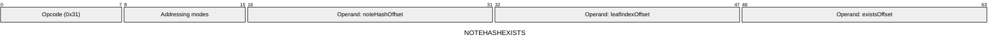
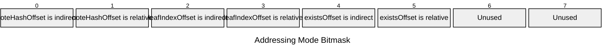

[&larr; Back to Instruction Set: Quick Reference](../avm-isa-quick-reference.md)

# NOTEHASHEXISTS

Check existence of note hash

Opcode `0x31`

```javascript
M[existsOffset] = noteHashTree.exists(M[noteHashOffset], M[leafIndexOffset]) ? 1 : 0
```

## Details

Performs a read of the Note Hash Tree to query whether the specified note hash exists at the given leaf index. Since this opcode checks for existence at a specified leafIndex, it is _not_ limited to checking for note hashes of only the currently executing contract. Note that it is difficult to check for existence of a note hash emitted earlier in the same block because this opcode requires leafIndex. If the leaf index exceeds the maximum tree size, the result is 0 (does not exist). Note hash must be FIELD, leaf index must be Uint64. Result is Uint1.

## Gas Costs

| Component | Value | Scales with |
|-----------|-------|-------------|
| L2 Base | 504 | - |
| DA Base | 0 | - |
| L2 Addressing | 3 | 3 L2 gas per indirect memory offset<br/>3 L2 gas per relative memory offset |

\* See [Gas Metering](../gas.md) for details on how gas costs are computed and applied.

## Operands

| Name | Type | Description |
|------|------|-------------|
| `noteHashOffset` | Memory offset | Memory offset of the note hash to check |
| `leafIndexOffset` | Memory offset | Memory offset of the leaf index in the note hash tree |
| `existsOffset` | Memory offset | Memory offset where the result (0 or 1) will be written |

## Wire Formats
See [Wire Format](../wire-format.md) page for an explanation of wire format variants and opcode naming (e.g., why `ADD_8` vs `ADD_16`).

**NOTEHASHEXISTS** (Opcode 0x31):



## Addressing Modes
See [Addressing](../addressing.md) page for a detailed explanation.

8-bit bitmask: 2 bits per memory offset operand (indirect flag + relative flag)

Memory offset operands (`noteHashOffset`, `leafIndexOffset`, `existsOffset`) are encoded as follows:



## Tag Checks

- `T[noteHashOffset] == FIELD`
- `T[leafIndexOffset] == UINT64`

## Tag Updates

- `T[existsOffset] = UINT1`

## Error Conditions

- **INVALID_TAG**: Note hash is not FIELD or leaf index is not Uint64
- **MEMORY_ACCESS_OUT_OF_RANGE**: Memory offset operand exceeds addressable memory

---

[&larr; Back to Instruction Set: Quick Reference](../avm-isa-quick-reference.md)
