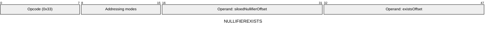
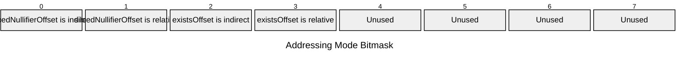

[&larr; Back to Instruction Set: Quick Reference](../avm-isa-quick-reference.md)

# NULLIFIEREXISTS

Check existence of an already siloed nullifier.

Opcode `0x33`

```javascript
M[existsOffset] = nullifierTree.exists(M[siloedNullifierOffset]) ? 1 : 0
```

## Details

Performs a read of the Nullifier Tree to query whether the specified siloed nullifier exists. The nullifier must already be siloed (caller is responsible for computing the siloed nullifier before calling this opcode). The nullifier must be FIELD. Result is Uint1.

## Gas Costs

| Component | Value | Scales with |
|-----------|-------|-------------|
| L2 Base | 903 | - |
| DA Base | 0 | - |
| L2 Addressing | 2 | 3 L2 gas per indirect memory offset<br/>3 L2 gas per relative memory offset |

\* See [Gas Metering](../gas.md) for details on how gas costs are computed and applied.

## Operands

| Name | Type | Description |
|------|------|-------------|
| `siloedNullifierOffset` | Memory offset | Memory offset of the siloed nullifier to check |
| `existsOffset` | Memory offset | Memory offset where the result (0 or 1) will be written |

## Wire Formats
See [Wire Format](../wire-format.md) page for an explanation of wire format variants and opcode naming (e.g., why `ADD_8` vs `ADD_16`).

**NULLIFIEREXISTS** (Opcode 0x33):



## Addressing Modes
See [Addressing](../addressing.md) page for a detailed explanation.

8-bit bitmask: 2 bits per memory offset operand (indirect flag + relative flag)

Memory offset operands (`siloedNullifierOffset`, `existsOffset`) are encoded as follows:



## Tag Checks

- `T[siloedNullifierOffset] == FIELD`

## Tag Updates

- `T[existsOffset] = UINT1`

## Error Conditions

- **INVALID_TAG**: Siloed Nullifier is not FIELD
- **MEMORY_ACCESS_OUT_OF_RANGE**: Memory offset operand exceeds addressable memory

---

[&larr; Back to Instruction Set: Quick Reference](../avm-isa-quick-reference.md)
