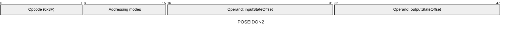
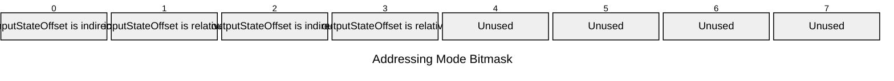

[&larr; Back to Instruction Set: Quick Reference](../avm-isa-quick-reference.md)

# POSEIDON2

Poseidon2 permutation

Opcode `0x3F`

```javascript
M[outputStateOffset:outputStateOffset+4] = poseidon2Permutation(/*input=*/M[inputStateOffset:inputStateOffset+4])
```

## Details

Computes the Poseidon2 permutation on a state of 4 field elements. Input and output states must have type tag FIELD.

## Gas Costs

| Component | Value | Scales with |
|-----------|-------|-------------|
| L2 Base | 360 | - |
| DA Base | 0 | - |
| L2 Addressing | 3 | 3 L2 gas per indirect memory offset<br/>3 L2 gas per relative memory offset |

*See [Gas Metering](gas.md) for details on how gas costs are computed and applied.

## Operands

| Name | Type | Description |
|------|------|-------------|
| `inputStateOffset` | Memory offset | Memory offset of the input state (4 field elements) |
| `outputStateOffset` | Memory offset | Memory offset for output state will be written |

## Wire Formats
See [Wire Format](wire-format.md) page for an explanation of wire format variants and opcode naming (e.g., why `ADD_8` vs `ADD_16`).

**POSEIDON2** (Opcode 0x3F):



## Addressing Modes
See [Addressing](addressing.md) page for a detailed explanation.

8-bit bitmask: 2 bits per memory offset operand (indirect flag + relative flag)

Memory offset operands (`inputStateOffset`, `outputStateOffset`) are encoded as follows:



## Tag Checks

- `T[inputStateOffset:inputStateOffset+4] == FIELD`

## Tag Updates

- `T[outputStateOffset:outputStateOffset+4] = FIELD`

## Error Conditions

- **INVALID_TAG**: Input state elements are not FIELD
- **MEMORY_ACCESS_OUT_OF_RANGE**: Memory offset operand exceeds addressable memory

---

[&larr; Back to Instruction Set: Quick Reference](../avm-isa-quick-reference.md)