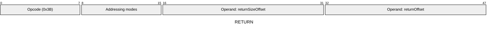
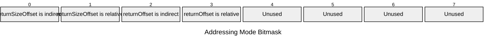

[&larr; Back to Instruction Set: Quick Reference](../avm-isa-quick-reference.md)

# RETURN

Return from call

Opcode `0x3B`

```javascript
exposeReturnData(offset: returnOffset, size: M[returnSizeOffset])
halt
```

## Details

Halts execution and returns data to the caller. Return size must be Uint32. Sets success flag. Caller can access this context's `M[offset:offset+size]` via RETURNDATACOPY.

## Gas Costs

| Component | Value | Scales with |
|-----------|-------|-------------|
| L2 Base | 9 | - |
| DA Base | 0 | - |
| L2 Addressing | 3 | 3 L2 gas per indirect memory offset<br/>3 L2 gas per relative memory offset |

\* See [Gas Metering](gas.md) for details on how gas costs are computed and applied.

## Operands

| Name | Type | Description |
|------|------|-------------|
| `returnSizeOffset` | Memory offset | Memory offset of the return data size |
| `returnOffset` | Memory offset | Memory offset of the start of the return data |

## Wire Formats
See [Wire Format](wire-format.md) page for an explanation of wire format variants and opcode naming (e.g., why `ADD_8` vs `ADD_16`).

**RETURN** (Opcode 0x3B):



## Addressing Modes
See [Addressing](addressing.md) page for a detailed explanation.

8-bit bitmask: 2 bits per memory offset operand (indirect flag + relative flag)

Memory offset operands (`returnSizeOffset`, `returnOffset`) are encoded as follows:



## Tag Checks

- `T[returnSizeOffset] == UINT32`

## Error Conditions

- **INVALID_TAG**: Return size operand is not Uint32
- **MEMORY_ACCESS_OUT_OF_RANGE**: Memory offset operand exceeds addressable memory

## Notes

- See [External Calls](../external-calls.md) for more details on execution flow.
- See [Calldata and Return Data](../calldata-returndata.md) for more details on passing data.

---

[&larr; Back to Instruction Set: Quick Reference](../avm-isa-quick-reference.md)
