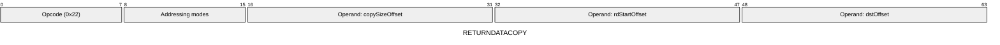
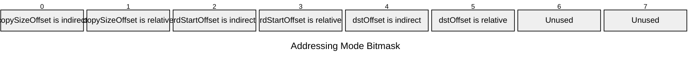

[&larr; Back to Instruction Set: Quick Reference](../avm-isa-quick-reference.md)

# RETURNDATACOPY

Copy returndata to memory

Opcode `0x22`

```javascript
M[dstOffset:dstOffset+M[copySizeOffset]] = nestedReturndata[M[rdStartOffset]:M[rdStartOffset]+M[copySizeOffset]]
```

## Details

Copies a section of the returndata from the most recent nested external call (CALL or STATICCALL instruction) into memory. Reads M[copySizeOffset] elements starting at return data offset M[rdStartOffset], writing them to memory starting at dstOffset. If the read extends past the end of return data, the out-of-bounds region is padded with zeros. If the read or write would exceed addressable memory (≥ 2³²), the instruction errors. The read occurs in the callee's memory space.

## Gas Costs

| Component | Value | Scales with |
|-----------|-------|-------------|
| L2 Base | 18 | - |
| DA Base | 0 | - |
| L2 Addressing | 3 | 3 L2 gas per indirect memory offset<br/>3 L2 gas per relative memory offset |
| L2 Dynamic | 3 | `M[copySizeOffset]` |

\* See [Gas Metering](gas.md) for details on how gas costs are computed and applied.

## Operands

| Name | Type | Description |
|------|------|-------------|
| `copySizeOffset` | Memory offset | Memory offset of the number of elements to copy |
| `rdStartOffset` | Memory offset | Memory offset of the return data start index to copy from |
| `dstOffset` | Memory offset | Memory offset for writing return data |

## Wire Formats
See [Wire Format](wire-format.md) page for an explanation of wire format variants and opcode naming (e.g., why `ADD_8` vs `ADD_16`).

**RETURNDATACOPY** (Opcode 0x22):



## Addressing Modes
See [Addressing](addressing.md) page for a detailed explanation.

8-bit bitmask: 2 bits per memory offset operand (indirect flag + relative flag)

Memory offset operands (`copySizeOffset`, `rdStartOffset`, `dstOffset`) are encoded as follows:



## Tag Checks

- `T[copySizeOffset] == UINT32`

## Tag Updates

- `T[dstOffset:dstOffset+M[copySizeOffset]] = FIELD`

## Error Conditions

- **INVALID_TAG**: Size operand is not Uint32
- **MEMORY_ACCESS_OUT_OF_RANGE**: Memory offset operand exceeds addressable memory

## Notes

- See [External Calls](../external-calls.md) for more details on nested calls.
- See [Calldata and Return Data](../calldata-returndata.md) for more details on return data.

---

[&larr; Back to Instruction Set: Quick Reference](../avm-isa-quick-reference.md)
