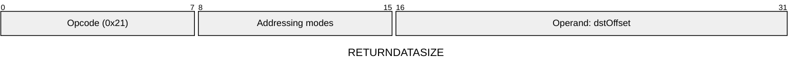
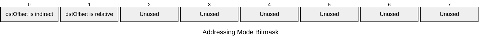

[&larr; Back to Instruction Set: Quick Reference](../avm-isa-quick-reference.md)

# RETURNDATASIZE

Get returndata size

Opcode `0x21`

```javascript
M[dstOffset] = nestedReturndata.length
```

## Details

Returns the size of the return data from the most recent nested external call (CALL or STATICCALL instruction). The size is determined by the nested call's RETURN or REVERT instruction. If there has been no nested external call, or if the nested call truly errored (did not explicitly execute a REVERT instruction), this returns 0. Result is Uint32.

## Gas Costs

| Component | Value | Scales with |
|-----------|-------|-------------|
| L2 Base | 12 | - |
| DA Base | 0 | - |
| L2 Addressing | 3 | 3 L2 gas per indirect memory offset<br/>3 L2 gas per relative memory offset |

\* See [Gas Metering](gas.md) for details on how gas costs are computed and applied.

## Operands

| Name | Type | Description |
|------|------|-------------|
| `dstOffset` | Memory offset | Memory offset for size will be written |

## Wire Formats
See [Wire Format](wire-format.md) page for an explanation of wire format variants and opcode naming (e.g., why `ADD_8` vs `ADD_16`).

**RETURNDATASIZE** (Opcode 0x21):



## Addressing Modes
See [Addressing](addressing.md) page for a detailed explanation.

8-bit bitmask: 2 bits per memory offset operand (indirect flag + relative flag)

Memory offset operands (`dstOffset`) are encoded as follows:



## Tag Updates

- `T[dstOffset] = UINT32`

## Error Conditions

- **MEMORY_ACCESS_OUT_OF_RANGE**: Memory offset operand exceeds addressable memory

## Notes

- See [External Calls](../external-calls.md) for more details on nested calls.
- See [Calldata and Return Data](../calldata-returndata.md) for more details on return data.

---

[&larr; Back to Instruction Set: Quick Reference](../avm-isa-quick-reference.md)
