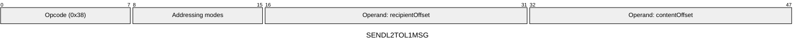
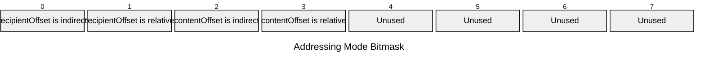

[&larr; Back to Instruction Set: Quick Reference](../avm-isa-quick-reference.md)

# SENDL2TOL1MSG

Send L2-to-L1 message

Opcode `0x38`

```javascript
l2ToL1Messages.append({recipient: M[recipientOffset], content: M[contentOffset]})
```

## Details

Sends a message to L1, with the specified recipient, from the currently executing contract. Both recipient and content must have type tag FIELD. Reverts in static calls.

## Gas Costs

| Component | Value | Scales with |
|-----------|-------|-------------|
| L2 Base | 418 | - |
| DA Base | 512 | - |
| L2 Addressing | 3 | 3 L2 gas per indirect memory offset<br/>3 L2 gas per relative memory offset |

*See [Gas Metering](gas.md) for details on how gas costs are computed and applied.

## Operands

| Name | Type | Description |
|------|------|-------------|
| `recipientOffset` | Memory offset | Memory offset of the L1 recipient address |
| `contentOffset` | Memory offset | Memory offset of the message content |

## Wire Formats
See [Wire Format](wire-format.md) page for an explanation of wire format variants and opcode naming (e.g., why `ADD_8` vs `ADD_16`).

**SENDL2TOL1MSG** (Opcode 0x38):



## Addressing Modes
See [Addressing](addressing.md) page for a detailed explanation.

8-bit bitmask: 2 bits per memory offset operand (indirect flag + relative flag)

Memory offset operands (`recipientOffset`, `contentOffset`) are encoded as follows:



## Tag Checks

- `T[recipientOffset] == FIELD`
- `T[contentOffset] == FIELD`

## Error Conditions

- **INVALID_TAG**: Recipient or content is not FIELD
- **STATIC_CALL_VIOLATION**: Attempted L2-to-L1 message send in static call context
- **SIDE_EFFECT_LIMIT_REACHED**: Exceeded maximum L2-to-L1 messages per transaction (MAX_L2_TO_L1_MSGS_PER_TX)
- **MEMORY_ACCESS_OUT_OF_RANGE**: Memory offset operand exceeds addressable memory

---

[&larr; Back to Instruction Set: Quick Reference](../avm-isa-quick-reference.md)